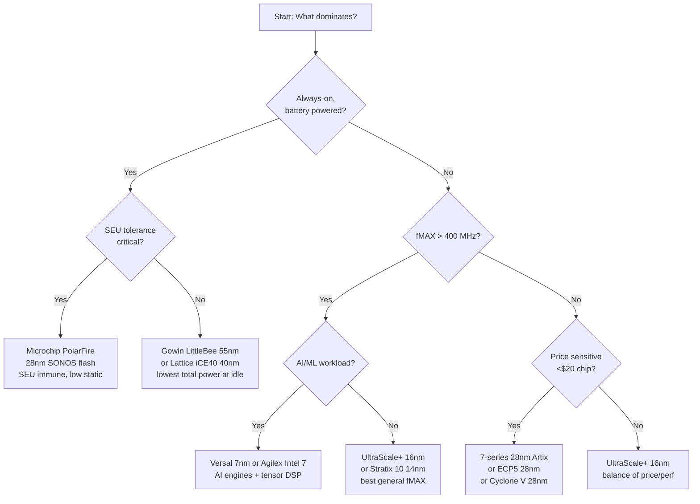

[← Home](../README.md) · [00 — Overview](README.md)

# Technology Nodes — Process Technology Impact on FPGA Characteristics

A 55nm Gowin LittleBee and a 7nm Xilinx Versal share the same fundamental LUT architecture, but behave like entirely different species. Process node determines static power, dynamic power, maximum clock frequency, bitstream susceptibility to single-event upsets, and — critically — device cost. This article explains how semiconductor process technology shapes FPGA behavior and how to choose the right node for your application.

---

## Overview

FPGA process technology spans from 350nm (legacy CPLDs) to 7nm (Versal). Each shrink reduces transistor switching energy (~30% per node), increases transistor density (~2× per node), and — critically for FPGAs — changes the ratio of static (leakage) power to dynamic (switching) power. At 7nm, leakage is a dominant concern, requiring aggressive power gating and multiple threshold voltage libraries. At 55nm, leakage is negligible, making these nodes ideal for always-on, battery-powered applications. The FPGA designer must understand process trade-offs because they determine not just speed and power, but also soft-error rate (smaller transistors are more SEU-susceptible), configuration memory stability, and device longevity (extended-temperature and automotive qualification).

---

## Process Node Comparison

| Process | Example Families | VCCINT (core) | Static Power per KLUT | fMAX typical (slowest grade) | SEU Sensitivity | Relative Cost/LE |
|---|---|---|---|---|---|---|
| **350nm** | MAX 7000 (legacy) | 3.3V / 5V | ~10 μW | 100 MHz | Very low | Very high (mature) |
| **130nm** | Spartan-3 (legacy) | 1.2V | ~100 μW | 150 MHz | Low | Moderate |
| **65nm** | SmartFusion2/Igloo2 | 1.2V | ~50 μW | 180 MHz | Low (flash: SEU immune config) | Moderate |
| **55nm** | Gowin LittleBee, MachXO2 | 1.2V | ~30 μW | 180 MHz | Low | Very low |
| **45/40nm** | Spartan-6 (45nm), iCE40 (40nm) | 1.2V | ~40 μW | 200 MHz | Moderate | Low |
| **28nm** | Cyclone V, 7-series, ECP5, PolarFire | 1.1V | ~80 μW | 300–400 MHz | Moderate–High | Moderate |
| **20nm** | Arria 10, UltraScale (20nm) | 0.95V | ~150 μW | 400–500 MHz | High | High |
| **16nm** | UltraScale+, Stratix 10 | 0.85V | ~200 μW | 500–600 MHz | High | High |
| **14nm** | Stratix 10 (14nm Tri-Gate) | 0.85V | ~200 μW | 550–650 MHz | High | Very high |
| **7nm** | Versal (7nm FinFET) | 0.70V | ~300 μW* | 600–800+ MHz | Very high (mitigated by ECC) | Premium |
| **Intel 7 (10nm)** | Agilex 5/7/9 | 0.75V | ~250 μW* | 600–800+ MHz | Very high (mitigated) | Premium |

> *At advanced nodes, static power is dominated by SRAM leakage. Power gating reduces idle static power by ~80%, but adds wake-up latency. The numbers above are with power gating disabled (worst-case active static).*

---

## Key Process-Related Behaviors

### 1. Static Power vs Dynamic Power Crossover

At older nodes (55nm, 40nm), static power is negligible — a 5,000 LUT design burns ~150 μW static and 10–50 mW dynamic. At 16nm, the same design burns ~1 mW static. At 7nm, static power becomes significant — ~1.5 mW for 5,000 LUTs — and matches dynamic power for low-activity designs.

| Metric | 55nm (Gowin) | 28nm (Cyclone V) | 16nm (UltraScale+) | 7nm (Versal) |
|---|---|---|---|---|
| Static power (5K LUT) | 150 μW | 400 μW | 1 mW | 1.5 mW |
| Dynamic power at 100 MHz (5K LUTs) | 5 mW | 8 mW | 4 mW | 2.5 mW |
| **Total at 100 MHz** | 5.15 mW | 8.4 mW | 5 mW | 4 mW |
| **Total at 10 MHz** | 0.65 mW | 1.2 mW | 1.4 mW | 1.75 mW |
| **Best use case** | Always-on, low activity | Balanced | High perf, moderate activity | Highest performance |

**The crossover effect:** At 10 MHz utilization, the 55nm device wins on total power. At 100 MHz+, 7nm wins because dynamic power drops faster than static power increases. For always-on, low-duty-cycle applications, older nodes are often more power-efficient than advanced nodes.

### 2. Soft Error Rate (SEU) and Process Scaling

| Process Node | Relative SER per Mb of SRAM | Mechanism |
|---|---|---|
| 350nm | 1× (baseline) | Large transistors; high critical charge |
| 130nm | 2–3× | Smaller charge; more susceptible |
| 65nm | 4–6× | Transistor count scaling outpaces hardening |
| 28nm | 8–12× | Planar limit; significant neutron cross-section |
| 16nm/14nm | 12–20× | FinFET provides some inherent SEU reduction |
| 7nm | 20–40× | Very small critical charge; heavy reliance on ECC and scrubbing |

> [!WARNING]
> **SEU rate doubles roughly every process generation** unless mitigated by design (ECC, TMR, scrubbing). A 7nm FPGA without configuration scrubbing experiences ~40× more bit flips than a 350nm device. For safety-critical and aerospace applications, this drives the choice toward flash-based (Microchip PolarFire — inherently SEU-immune config) or radiation-hardened devices.

### 3. Maximum Frequency Scaling

Process shrinks improve transistor switching speed, but FPGA fMAX gains are not linear:

| Node Transition | Theoretical Speedup | Actual FPGA fMAX Gain | Lost To |
|---|---|---|---|
| 40nm → 28nm | 1.4× | 1.2× | Routing dominates delay; metal RC doesn't scale with gate speed |
| 28nm → 20nm | 1.4× | 1.15× | Interconnect delay fraction increases |
| 20nm → 16nm | 1.25× | 1.1× | FinFET improves gates but routing RC still dominates |
| 16nm → 7nm | 2.3× | 1.3× | Metal pitch scaling limited; routing congestion remains the bottleneck |

The lesson: **routing delay, not transistor speed, limits FPGA fMAX at advanced nodes**. This is why Agilex added HyperFlex (pipeline registers in routing) — it's a routing-speed solution, not a transistor-speed solution.

---

## Choosing a Process Node

---

## Technology-Specific Considerations

### SRAM-Based FPGAs (Xilinx, Intel, Lattice, Gowin)

| Advantage | Disadvantage |
|---|---|
| Unlimited reprogramming | Volatile — needs external flash |
| Highest density per node | SEU-sensitive configuration |
| Mature toolchains | Longer configuration time |

### Flash-Based FPGAs (Microchip PolarFire, SmartFusion2)

| Advantage | Disadvantage |
|---|---|
| Instant-on (<1 ms) | Lower density per node |
| SEU-immune configuration | Slower write/erase cycles (10K–100K) |
| Very low static power | Tooling less mature than Xilinx/Intel |
| No external config flash needed | Higher cost per LUT |

### Anti-Fuse (legacy) and Hybrid

| Advantage | Disadvantage |
|---|---|
| One-time programmable | Not reconfigurable |
| Most radiation-hard | Niche, expensive |
| Instant-on, no bitstream | Actel/Microsemi legacy only |

---

## References

| Source | Document |
|---|---|
| Xilinx UG440 — Power Analysis and Optimization | https://docs.xilinx.com/ |
| Microchip PolarFire FPGA Power Estimator | Microchip Docs |
| IEEE: "SEU Characterization of 28nm FPGAs" | Various papers |
| JEDEC JESD89 — Soft Error Rate Measurement | JEDEC Standard |
| [FPGA Market Landscape](landscape.md) | When to choose FPGA vs ASIC vs MCU |
| [Vendor Comparison Matrix](vendor_comparison.md) | Per-vendor cost and technology analysis |
| [History of FPGA Technology](history.md) | How process nodes evolved with FPGA generations |
