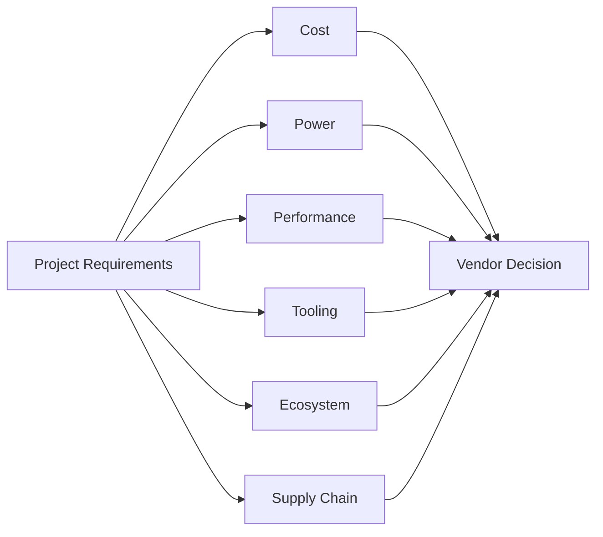
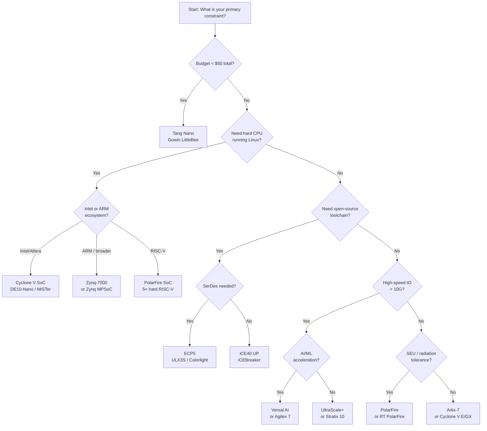

[← Home](../README.md) · [00 — Overview](README.md)

# Vendor Comparison Matrix — Choosing an FPGA Platform

Choosing an FPGA vendor is not merely a hardware decision — it is a long-term toolchain, ecosystem, and support commitment. Unlike microcontrollers where code ports relatively easily between ARM vendors, FPGA designs are tightly coupled to vendor-specific synthesis engines, IP libraries, constraint formats, and debug tools. This article provides a systematic framework for evaluating vendors across six dimensions, followed by a side-by-side comparison of all major FPGA families.

---

## Overview

The FPGA market is dominated by five major vendors — **AMD/Xilinx**, **Intel/Altera**, **Lattice**, **Gowin**, and **Microchip** — with a growing fringe of open-source-friendly and niche players. Each vendor optimizes for different segments: Xilinx leads in density and AI integration, Intel anchors on SoC FPGAs and data center acceleration, Lattice dominates ultra-low-power and open-source accessibility, Gowin competes on price, and Microchip specializes in flash-based reliability and radiation tolerance. The right choice depends not on which vendor is "best" in absolute terms, but on which vendor's trade-offs align with your power budget, performance target, tooling tolerance, and supply chain constraints.

---

## The Six Evaluation Dimensions

### 1. Cost — Device, Board, and Tooling

| Cost Component | What to Evaluate |
|---|---|
| **Device unit cost** | 1K pricing for target LE/LUT density. Gowin and Lattice iCE40 win at low density; Xilinx/Intel dominate mid-to-high density |
| **Development board cost** | Entry-level boards: iCEBreaker ($35), Tang Nano ($6–15), DE10-Nano ($165), Arty A7 ($119), Zynq UltraScale+ eval boards ($1,000+) |
| **Tooling cost** | Intel Quartus Prime Lite / Xilinx Vivado WebPACK are free for most devices. Full-license features (chipscope pro, partial reconfiguration) cost $3,000+/year |
| **IP licensing** | PCIe Gen3/Gen4, DDR4, 10G+ Ethernet, and video codecs often require paid licenses ($5,000–$50,000+) |

### 2. Power — Static, Dynamic, and Sleep

| Vendor | Static Power Strength | Notes |
|---|---|---|
| **Lattice** (FD-SOI) | Excellent | CrossLink-NX/CertusPro-NX use 28nm FD-SOI for 3× lower static power vs planar |
| **Microchip** (flash) | Excellent | PolarFire SONOS flash: near-zero static power, instant-on |
| **Xilinx** | Good (UltraScale+), Poor (7-series) | 7-series static power is high; UltraScale+ improves significantly; Versal has aggressive power gating |
| **Intel** | Moderate | Cyclone V static is acceptable; Stratix/Agilex higher due to performance focus |
| **Gowin** | Good | 55nm SRAM-based; competitive at low density but leaks at scale |

### 3. Performance — Logic Speed, DSP, and SerDes

| Metric | Leader | Notes |
|---|---|---|
| **Max fabric clock** | Xilinx Versal / Intel Agilex | 7nm/Intel 7 processes enable >800 MHz DSP pipelines |
| **SerDes line rate** | Xilinx GTM / Intel E-tile | 112G PAM4 (Versal Premium, Agilex 7) |
| **DSP TFLOPS** | Xilinx Versal AI / Intel Agilex | AI-optimized DSP blocks with INT8/BF16 acceleration |
| **Mid-range SerDes** | Lattice ECP5 / Gowin Arora | 5G (ECP5), 6.25G (Arora), 12.5G (CertusPro-NX) |

### 4. Tooling — IDE Quality, Scriptability, and Learning Curve

| Tool | Strengths | Pain Points | License |
|---|---|---|---|
| **Vivado (Xilinx)** | Mature Tcl API, IP Integrator (block diagram), good reports | Heavy RAM usage (16 GB+), slow synthesis, proprietary XDC format | Free (WebPACK) for most 7-series/UltraScale+ |
| **Quartus Prime (Intel)** | Fast compile for small designs, good SoC integration (Platform Designer) | Lite edition limited device support, occasional crashiness, QSF constraints | Free (Lite) for MAX 10 / Cyclone V/10 |
| **Diamond/Radiant (Lattice)** | Lightweight, fast, good for iCE40/ECP5 | Smaller IP catalog, less mature debug tools | Free |
| **Gowin EDA** | Free, lightweight, Chinese/English UI | Proprietary, limited scripting, smaller IP catalog | Free |
| **Yosys + nextpnr** | Open-source, scriptable, fast iteration | Limited device support (iCE40, ECP5, Gowin, partial 7-series), no timing-driven P&R for all families | Free (open source) |

### 5. Ecosystem — IP, Community, and Education

| Vendor | IP Ecosystem | Open-Source Community | Educational Resources |
|---|---|---|---|
| **Xilinx** | Massive (AXI infrastructure, MIG, XDMA, Vitis libraries) | Growing (LiteX, F4PGA, open xc7 bitstream research) | Extensive (Xilinx UG docs, university programs) |
| **Intel** | Large (Qsys ecosystem, OpenCL support) | Moderate (MiSTer/DE10-Nano community) | Good (Intel FPGA academic program) |
| **Lattice** | Small but growing | Excellent (Project Icestorm, Project Trellis, nMigen/Amaranth, ULX3S) | Good (community-driven tutorials) |
| **Gowin** | Minimal | Growing (Project Apicula/Nano, Tang Nano community) | Limited (Chinese language dominates) |
| **Microchip** | Moderate (Mi-V RISC-V ecosystem, Libero SoC) | Small but focused (RISC-V + PolarFire SoC Linux) | Specialized (rad-hard, low-power niches) |

### 6. Supply Chain — Availability and Longevity

| Vendor | Supply Chain Risk | Longevity Program |
|---|---|---|
| **Xilinx/AMD** | Moderate (high demand, allocation issues for Zynq) | 10–15 year production guarantees |
| **Intel** | Moderate ( Altera transition disruptions in past) | 10+ year guarantees |
| **Lattice** | Lower (stable supply, industrial focus) | 10+ year guarantees |
| **Gowin** | Higher (China-based, export control exposure) | Shorter track record |
| **Microchip** | Lower (aerospace/industrial focus) | 15–20 year guarantees (mil/aero) |

---

## Side-by-Side Vendor Comparison

### Low-Density (1K–25K LUTs / LEs) — Cost-Sensitive and Hobbyist

| Criterion | Lattice iCE40 UP | Gowin LittleBee | Intel MAX 10 | Xilinx Spartan-7 |
|---|---|---|---|---|
| **Density** | 1K–5.3K LUT4 | 1K–9K LUT4 | 2K–50K LE | 6K–102K LUT6 |
| **Price (chip)** | $1.50–$5 | $1.50–$10 | $5–$25 | $10–$50 |
| **Board entry** | iCEBreaker ($35), Upduino ($15) | Tang Nano ($6–$15) | MAX 10 eval ($50–$100) | Arty S7 ($99) |
| **Open-source tools** | Excellent (Yosys+nextpnr) | Good (Apicula/Nano) | None | Partial (F4PGA) |
| **Static power** | Very low | Low | Low (flash) | Moderate |
| **Hard peripherals** | SPI, I2C, DSP (UP5K) | Limited | ADC, flash | None |
| **When to choose** | Open-source purity, lowest power | Lowest cost, SoC integration (GW1NSR) | Instant-on, ADC needs, legacy Intel | Vivado ecosystem, path to larger 7-series |

### Mid-Range (25K–150K LUTs / LEs) — Embedded SoC and Industrial

| Criterion | Intel Cyclone V SoC | Xilinx Zynq-7000 | Lattice ECP5 | Gowin Arora |
|---|---|---|---|---|
| **Density** | 25K–301K LE | 28K–444K LUT6 | 24K–85K LUT4 | 18K–55K LUT4 |
| **Hard CPU** | Dual Cortex-A9 @ 925 MHz | Dual Cortex-A9 @ 1 GHz | None | None (GW1NSR has PicoRV32) |
| **DRAM support** | DDR3 (HPS), DDR3 (FPGA) | DDR3/3L (PS), DDR3 (PL) | DDR3/2, LPDDR2 | DDR2/3, LPDDR |
| **SerDes** | 3.125G (SX) / 6.144G (ST) | N/A (7-series transceivers in Artix/Kintex) | 5G (5G SERDES variants) | 2.5G–6.25G |
| **PCIe** | Gen2 ×1 (SX) / ×4 (ST) | N/A (Zynq-7000 PS has Gen2 ×4) | No | Gen2 ×4 (GW5A) |
| **Tooling** | Quartus Prime Lite (free) | Vivado WebPACK (free) | Diamond (free) | Gowin EDA (free) |
| **Open-source tools** | None | None (7-series fabric partially via F4PGA) | Excellent (Yosys+nextpnr) | Good (nextpnr) |
| **Anchor boards** | DE10-Nano ($165), MiSTer | ZedBoard, PYNQ-Z2, MicroZed | ULX3S ($115), OrangeCrab ($85) | Tang Primer ($40–$50) |
| **When to choose** | MiSTer/retro, Intel ecosystem, HPS/FPGA tight coupling | Linux SoC + programmable logic, ARM ecosystem | Open-source mid-range, 5G SERDES on budget | Ultra-low-cost mid-range, Chinese supply chain |

### High-Range (150K+ LUTs / LEs) — Data Center, AI, and Communications

| Criterion | Xilinx UltraScale+ | Xilinx Versal ACAP | Intel Stratix 10 | Intel Agilex 7 |
|---|---|---|---|---|
| **Density** | Up to 4.5M LUT6 | Up to ~2M LUT + 400 AI engines | Up to 5.5M LE | Up to ~2.7M LE |
| **Process** | 16nm FinFET | 7nm FinFET | 14nm Tri-Gate | Intel 7 (10nm) |
| **Hard CPU** | Quad A53 + dual R5F (MPSoC) | Dual A72 (Premium) | Quad A53 (SoC) | Quad A53 (SoC) |
| **AI/ML acceleration** | DPU (AI Engine in Versal only) | AI Engines (VLIW SIMD, ~4 TFLOPS) | No hard AI | AI tensor DSP (INT8/FP16/BF16) |
| **SerDes** | GTY: 32G / GTM: 58G | GTY: 32G / GTYP: 112G PAM4 | E-tile: 58G PAM4 | E-tile: 112G PAM4 |
| **Memory** | HBM2 (Virtex) | HBM2e, DDR5 | HBM2 (up to 8 GB) | HBM2e |
| **PCIe** | Gen3/Gen4 | Gen5 | Gen3 | Gen5 |
| **Tooling** | Vivado + Vitis | Vivado + Vitis AI | Quartus Prime Pro | Quartus Prime Pro |
| **Price (dev board)** | $1,000–$5,000 | $5,000–$15,000 | $5,000–$10,000 | $3,000–$10,000 |
| **When to choose** | Proven high-volume 16nm, broad IP | Cutting-edge AI/ML acceleration, NoC fabric | Large HBM2 designs, Intel data center | Intel ecosystem, AI inference, 112G networking |

### Specialized — Reliability, Radiation Tolerance, and Flash

| Criterion | Microchip PolarFire | Microchip PolarFire SoC | Microchip SmartFusion2 | Lattice MachXO2/3 |
|---|---|---|---|---|
| **Technology** | 28nm SONOS flash | 28nm SONOS flash + 5× RISC-V | 65nm flash + Cortex-M3 | Non-volatile flash |
| **SEU immunity** | Yes (flash) | Yes (flash) | Yes (flash) | Yes (flash) |
| **Radiation-tolerant variant** | RT PolarFire (>100 Krad) | Planned | RTG4 (separate family) | No |
| **Static power** | Near-zero | Near-zero | Very low | Very low |
| **Instant-on** | <1 ms | <1 ms | <1 ms | <1 ms |
| **Hard CPU** | No | 4× U54 + 1× E51 (RV64GC) | Cortex-M3 | No |
| **DRAM** | DDR3/4 | DDR3/4 | None | None |
| **When to choose** | SEU-critical, low-power, aerospace | Linux-capable hard RISC-V + FPGA | MCU + FPGA + ADC in one, anti-tamper | CPLD replacement, instant-on boot sequencing |

---

## Decision Flowchart

---

## When to Use / When NOT to Use

### When to Use Each Vendor

| Vendor | Ideal Scenario |
|---|---|
| **Xilinx/AMD** | You need the largest ecosystem, proven high-density devices, ARM SoC integration (Zynq), or a clear roadmap to AI acceleration (Versal). You have the RAM and disk space for Vivado. |
| **Intel/Altera** | You are building on the DE10-Nano/MiSTer ecosystem, need tight HPS-FPGA integration (Cyclone V SoC), or are already invested in Intel's data center infrastructure (Agilex). |
| **Lattice** | You prioritize open-source tooling (Yosys+nextpnr), need the lowest possible static power (FD-SOI), or are building MIPI camera/display bridges (CrossLink-NX). |
| **Gowin** | Your BOM cost is the dominant constraint, you need Chinese domestic supply chain, or you want the cheapest possible entry point (Tang Nano at $6). |
| **Microchip** | Your design operates in radiation, aerospace, or safety-critical environments. You need instant-on (<1 ms boot) or hard RISC-V cores (PolarFire SoC). |

### When NOT to Use

| Vendor | Avoid When... |
|---|---|
| **Xilinx/AMD** | Budget is under $50 for chip + board; you need open-source toolchain freedom; static power is critical and 7-series is the only option |
| **Intel/Altera** | You need open-source synthesis (no fully open Quartus alternative); you want the lowest-power solution; allocation shortages affect your timeline |
| **Lattice** | You need >100K LUTs (ECP5 tops at 85K); you need PCIe Gen3+ (CertusPro-NX has Gen3 ×4 but limited lanes); you need hard ARM CPUs |
| **Gowin** | You need comprehensive English documentation; you need high-reliability industrial qualification; you need extensive third-party IP |
| **Microchip** | You need the highest raw logic density (PolarFire maxes at ~482K LEs); you need cutting-edge AI performance; cost is the primary driver |

---

## Best Practices & Antipatterns

### Best Practices

1. **Prototype on the open-source toolchain first** — Even if your final target is Xilinx/Intel, prototyping on iCE40 or ECP5 with Yosys+nextpnr gives you faster iteration and portable RTL verification.
2. **Match the dev board to your final device's architecture** — A Zynq-7000 prototype does not validate UltraScale+ timing; at minimum, run final timing closure on the target family.
3. **Evaluate the toolchain before committing** — Download Vivado WebPACK or Quartus Prime Lite and synthesize a representative design module. Tool RAM usage and compile time are real project risks.
4. **Check IP license costs early** — PCIe Gen3, DDR4, and 10G Ethernet IP can add $10,000+ to a project. Open-source alternatives (LitePCIe, LiteDRAM, verilog-ethernet) may suffice.
5. **Plan for obsolescence** — Verify the vendor's longevity program. Gowin and fringe vendors may not guarantee 10+ year production.

### Antipatterns

| Antipattern | The Problem | The Fix |
|---|---|---|
| **"The Big Vendor Bias"** | Defaulting to Xilinx/Intel without evaluating Lattice/Gowin for simple designs | Benchmark synthesis time, power, and BOM cost for your specific LUT count |
| **"The Dev Board Trap"** | Choosing a vendor because you own their dev board, not because it fits the product | List product requirements first, then select the vendor; dev boards are cheap, redesigns are expensive |
| **"The Open-Source Only Purist"** | Refusing to use vendor tools when the open-source flow lacks critical features (e.g., transceiver calibration) | Use open-source for RTL development and simulation; use vendor tools for final bitstream and transceiver IP |
| **"The Density Over-Provisioning"** | Buying 2× the LUTs "just in case" | Start with 70% utilization target; use vendor power estimators before committing to a larger, hotter, more expensive device |

---

## Pitfalls & Common Mistakes

### 1. Ignoring Static Power in Battery Designs

**The mistake:** Choosing a Xilinx 7-series Artix-7 for a battery-powered IoT sensor because it has "enough LUTs."

**Why it fails:** Artix-7 static power is 100–500 mW even when idle. A Lattice iCE40 or Microchip PolarFire in the same application draws <10 mW static.

**The fix:** For always-on or battery-powered designs, start the vendor search with static power as the primary filter.

### 2. Assuming SoC FPGA Software Portability

**The mistake:** Writing Linux drivers for Zynq-7000 and assuming they will work unchanged on Cyclone V SoC.

**Why it fails:** The HPS/PS peripheral sets differ (Cyclone V has unique DMA controllers, ECC behavior, and boot ROM flow). Device trees, clock frameworks, and DMA APIs are vendor-specific.

**The fix:** Budget 2–4 weeks of driver porting per SoC FPGA vendor. Abstract hardware access behind a thin HAL if multi-vendor support is a goal.

### 3. Underestimating Tooling Learning Curves

**The mistake:** A team familiar with Vivado switches to Quartus Prime for a Cyclone V project and expects the same productivity in week one.

**Why it fails:** Constraint syntax (XDC vs SDC/QSF), IP packaging (XCI vs QSYS), and debug workflows (ILA vs SignalTap) are all different. Muscle memory from one tool does not transfer.

**The fix:** Allocate a dedicated "tooling onboarding" sprint. Document your team's constraint templates and Tcl scripts for each toolchain separately.

---

## Use Cases

### Retro Computing / MiSTer

- **Vendor:** Intel/Altera
- **Family:** Cyclone V SoC (5CSEBA6 on DE10-Nano)
- **Why:** The MiSTer project standardized on DE10-Nano. The HPS runs the Linux control panel while the FPGA fabric replicates vintage computers, consoles, and arcade hardware. The large MiSTer community (100+ cores) makes this the only viable choice for retro FPGA computing.

### Open-Source RISC-V Linux SoC

- **Vendor:** Lattice + community
- **Family:** ECP5 (ULX3S, OrangeCrab)
- **Why:** Full Yosys+nextpnr open flow. LiteX generates a Linux-capable VexRiscv SoC with DDR3, Ethernet, and SPI flash. No vendor tools or licenses required. Ideal for education and reproducible research.

### Industrial Motor Control

- **Vendor:** Microchip
- **Family:** PolarFire or SmartFusion2
- **Why:** Flash-based instant-on (<1 ms boot) ensures safe state on power-up. SEU immunity eliminates the need for external scrubbing. Integrated ADC (SmartFusion2) reduces BOM. Extended temperature grades available.

### AI Inference at the Edge

- **Vendor:** Xilinx
- **Family:** Versal AI Edge or Zynq UltraScale+ with DPU
- **Why:** Hard AI Engines (Versal) or programmable DPU overlays (UltraScale+) provide orders-of-magnitude better inference/watt than soft-logic implementations. Vitis AI toolchain compiles TensorFlow/PyTorch models to target hardware.

### Cost-Optimized Consumer Electronics

- **Vendor:** Gowin
- **Family:** LittleBee (GW1N) or GW1NSR (with PicoRV32)
- **Why:** Sub-$2 chip pricing and sub-$10 board entry (Tang Nano). The GW1NSR integrates a hard PicoRV32 RISC-V core, eliminating the need for a separate MCU in simple control applications.

---

## FAQ

**Q: Can I port a design from Xilinx to Intel or vice versa?**

A: RTL (Verilog/VHDL) is largely portable if it uses standard synthesizable constructs. However, vendor-specific IP (MIG, XDMA, PCIe hard blocks), constraints (XDC vs QSF), and Tcl scripts must be rewritten. Expect 20–40% of the project effort to be vendor-specific.

**Q: Is the open-source toolchain (Yosys + nextpnr) production-ready?**

A: For iCE40 and ECP5, yes — multiple commercial products ship with bitstreams generated by Yosys+nextpnr. For Xilinx 7-series and Gowin, the flow works but lacks official timing characterization and some advanced features (transceiver calibration, partial reconfiguration). Use vendor tools for safety-critical or high-speed designs.

**Q: Should I choose Zynq or Cyclone V SoC?**

A: Choose Zynq if you need the ARM ecosystem (more drivers, larger community, PYNQ Python framework) and a path to larger MPSoC devices. Choose Cyclone V SoC if you are building on the MiSTer/DE10-Nano ecosystem or need Intel-specific transceivers. See [hps_fpga_interaction.md](../01_vendors_and_families/altera_intel/cyclone_v/soc/hps_fpga_interaction.md) and [soc_linux_architecture.md](../10_embedded_linux/soc_linux_architecture.md) for deeper comparisons.

**Q: What about CPLDs? Are they still relevant?**

A: Yes — for simple glue logic, boot sequencing, and voltage translation, MachXO2/3 (Lattice) and MAX V/VI (Intel) remain cost-effective. However, small FPGAs (iCE40, LittleBee) now compete at similar price points with more flexibility.

---

## References

| Source | URL / Document |
|---|---|
| Xilinx 7-Series Overview | DS180 |
| Intel Cyclone V Device Handbook | CV-5V2 |
| Lattice ECP5 Family Datasheet | FPGA-DS-02012 |
| Gowin LittleBee Datasheet | GW1N Series |
| Microchip PolarFire Datasheet | DS50002812 |
| Yosys + nextpnr Supported Devices | https://github.com/YosysHQ/nextpnr |
| Project Icestorm (iCE40) | https://github.com/YosysHQ/icestorm |
| Project Trellis (ECP5) | https://github.com/YosysHQ/prjtrellis |
| Project Apicula (Gowin) | https://github.com/YosysHQ/apicula |
| MiSTer Project | https://github.com/MiSTer-devel/Main_MiSTer |
| LiteX Framework | https://github.com/enjoy-digital/litex |
