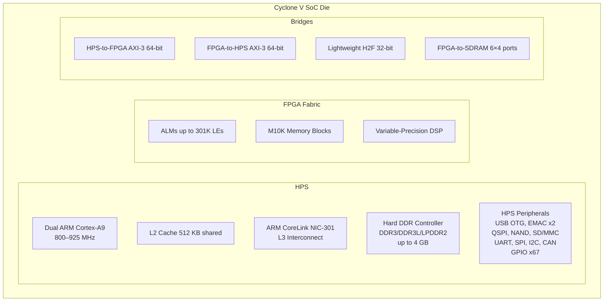

[← Cyclone V Home](../README.md) · [← Intel/Altera Home](../../README.md) · [← Section Home](../../../README.md)

# Cyclone V SoC (SE/SX/ST) — Hard ARM Cortex-A9 + FPGA on One Die

> **Anchor device for this knowledge base.** If you own a DE10-Nano, MiSTer, or any Cyclone V SoC board, start here.

The Cyclone V SoC combines a hardened dual-core ARM Cortex-A9 MPCore (the **HPS**) with the Cyclone V FPGA fabric on a single 28nm die. Key constraint: the HPS boots *before* the FPGA fabric — the FPGA is a peripheral from the CPU's perspective until you reconfigure the boot order or use FPGA-to-HPS bridges to reverse control.

---

## SoC Variants

| Variant | Transceivers | PCIe | Max LEs | Max DSP | Max M10K | Typical Use |
|---|---|---|---|---|---|---|
| **Cyclone V SE** | No | No | 40K–110K | 112–224 | 1.7–5.4 Mb | Cost-sensitive embedded, HMI |
| **Cyclone V SX** | 6× 3.125 Gbps | Gen2 ×1 | 40K–110K | 112–224 | 1.7–5.4 Mb | Industrial networking, vision |
| **Cyclone V ST** | 6× 6.144 Gbps | Gen2 ×4 | 85K–301K | 168–342 | 4.2–12.2 Mb | Video, high-speed data |

> **DE10-Nano / MiSTer:** 5CSEBA6U23I7 — SE variant, 110K LEs, no transceivers, no PCIe.

---

## Deep Dive Articles

| Article | Coverage |
|---|---|
| **[HPS ↔ FPGA Interaction](hps_fpga_interaction.md)** | All 8 HPS-FPGA communication methods: bandwidth, latency, decision matrix, anti-patterns |
| **[HPS Address Map](address_map.md)** | Complete 4 GB physical memory map: SDRAM, bridges, peripherals, Boot ROM, OCRAM, Linux DT correlation |
| **[Boot Sequence](boot_sequence.md)** | Multi-stage boot from POR to Linux: Boot ROM, BSEL, preloader, U-Boot, FPGA config timing, common failures |
| **[MiSTer Platform](mister_platform.md)** | MiSTer framework architecture, SDRAM add-on, core loading, video pipeline, USB vs SNAC latency |

### Cross-Reference

| Article | Location |
|---|---|
| **[Cyclone V vs Zynq-7000](../vs_zynq7000.md)** | Head-to-head comparison: bridge architecture, ACP gap, DSP, boot, ecosystem |
| **[Transceivers (GX/GT)](../fpga_only/transceivers.md)** | PMA/PCS deep dive, clocking, protocol modes, channel bonding |

---

## Die Architecture



The die divides into two domains communicating through three AXI-3 bridge pairs. Both domains share the HPS hard DDR controller.

---

## HPS — Hard Processor System

### CPU Subsystem

| Component | Specification |
|---|---|
| **Cores** | 2× ARM Cortex-A9 MPCore, 32-bit ARMv7-A |
| **Max Frequency** | 800 MHz (commercial), 925 MHz (speed-grade -6) |
| **L1 Cache** | 32 KB I + 32 KB D per core, parity protected |
| **L2 Cache** | 512 KB shared, 8-way set associative, ECC |
| **NEON** | Single-precision FPU + NEON SIMD media engine per core |
| **SCU** | Snoop Control Unit — L1 coherency between cores |

At 800 MHz: ~2,000 DMIPS total — comparable to Raspberry Pi 2.

### L3 Interconnect (NIC-301)

```
        ┌──────────────┐  ┌──────────────┐
        │ Cortex-A9 ×2 │  │ FPGA-to-HPS  │
        └──────┬───────┘  └─────┬────────┘
               │                │
        ┌──────▼────────────────▼────────┐
        │     NIC-301 L3 Interconnect    │
        └──┬──────────┬──────────┬───────┘
           │          │          │
    ┌──────▼──┐ ┌─────▼────┐ ┌───▼──────────┐
    │ SDRAM   │ │ On-Chip  │ │ Peripheral   │
    │ Ctrl    │ │ RAM 64KB │ │ Bus (APB)    │
    └─────────┘ └──────────┘ └──────────────┘
```

### HPS Peripheral Inventory

| Peripheral | Count | Notes |
|---|---|---|
| **UART** | 2 | 16550-compatible, up to 1 Mbps |
| **SPI** | 2 | Master/slave, up to 100 MHz |
| **I2C** | 4 | Standard/Fast/Fast+ |
| **CAN** | 2 | CAN 2.0B, up to 1 Mbps |
| **USB OTG** | 2 | USB 2.0 High-Speed, ULPI PHY |
| **Ethernet MAC** | 2 | 10/100/1000, RGMII/GMII/MII, DMA, checksum offload |
| **NAND Flash** | 1 | ONFI 1.0, 8-bit, ECC |
| **QSPI** | 1 | Quad-SPI, boot capable |
| **SD/MMC** | 1 | SD 3.0, eMMC 4.5, boot capable |
| **GPIO** | 67 | 3 banks, multiplexed |
| **Timers** | 4+4+2 | OS tick, PWM-capable, watchdog |
| **DMA** | 8-channel | Scatter-gather, descriptor-based |

---

## HPS ↔ FPGA Interaction — Complete Guide

Eight distinct paths connect the HPS and FPGA fabric, each with different bandwidth, latency, coherency guarantees, and use cases. Choosing the wrong one is the single most common performance bug on Cyclone V SoC.

> **Full deep-dive, bandwidth calculations, decision matrix, best practices, and anti-patterns:** [hps_fpga_interaction.md](hps_fpga_interaction.md) — a comprehensive guide covering all 8 interaction methods with real benchmarks, official documentation references, and a per-method when-to-use / when-not-to-use analysis.

### Quick Reference

| # | Method | Master | Data Width | Theoretical Peak | Practical Range | Coherent? |
|---|--------|--------|-----------|-----------------|----------------|-----------|
| 1 | **Lightweight H2F (LWH2F)** | HPS → FPGA | 32-bit | 400 MB/s | 15–40 MB/s | No |
| 2 | **HPS-to-FPGA (H2F)** | HPS → FPGA | 64/128 bit | 800–1600 MB/s | 100–700 MB/s | No |
| 3 | **FPGA-to-HPS (F2H)** | FPGA → HPS | 64/128 bit | 800–1600 MB/s | 100–500 MB/s | Via ACP |
| 4 | **FPGA-to-SDRAM (F2S)** | FPGA → DDR | 6× 16–256 bit | 3.2–38.4 GB/s agg. | 1–15 GB/s | **Never** |
| 5 | **On-Chip RAM** | Shared | 64 KB | ~1.6 GB/s | 500–1200 MB/s | Configurable |
| 6 | **Loaned Peripherals** | HPS ↔ FPGA | Periph-specific | Periph-specific | Periph-specific | N/A |
| 7 | **Interrupts** | Bidirectional | 64 signals | Signal only | ~1 µs | N/A |
| 8 | **HPS DMA Controller** | HPS → FPGA/DDR | 8 channels | ~1.6 GB/s | 400–800 MB/s | No |

### HPS Address Map

| Region | Start Address | Size | Access Method |
|---|---|---|---|
| FPGA Slaves (H2F) | `0xC000_0000` | 960 MB | H2F bridge |
| Lightweight FPGA Slaves | `0xFF20_0000` | 2 MB | LWH2F bridge |
| Boot ROM | `0xFFFD_0000` | 64 KB | HPS-only, read-only |
| On-Chip RAM | `0xFFFF_0000` | 64 KB | HPS + FPGA via F2H |

---

## SE Variant — Detailed Device Table

| Device | LEs | ALMs | M10K (blocks) | M10K (Mb) | DSP | PLLs | User IOs | HPS IOs |
|---|---|---|---|---|---|---|---|---|
| 5CSEA2 | 25K | 9,436 | 140 | 1.7 | 36 | 6 | 144 | 181 |
| 5CSEA4 | 40K | 15,094 | 224 | 2.7 | 58 | 6 | 144 | 181 |
| **5CSEA5** | 85K | 32,075 | 397 | 4.8 | 87 | 6 | 288 | 181 |
| **5CSEA6** | **110K** | **41,509** | **557** | **6.8** | **112** | **6** | **288** | **181** |
| 5CSEA9 | 301K | 113,580 | 1,220 | 12.2 | 342 | 12 | 480 | 181 |

> The **5CSEA6** is the DE10-Nano/MiSTer chip — 110K LEs enough for complex retro cores (Ao486, Minimig AGA, PlayStation) and real-time video pipelines.

---

## Boot Sequence

```
Power-On
│
├─► HPS Boot ROM (64 KB on-chip)
│   └─► Reads BSEL pins → SD/MMC, QSPI, NAND
│
├─► Preloader (U-Boot SPL)
│   ├─► Configures SDRAM, pin muxing, clocks
│   └─► Optionally configures FPGA from flash
│
├─► U-Boot (SSBL)
│   ├─► Loads kernel + device tree
│   └─► Can load FPGA bitstream via FPGA Manager
│
├─► Linux kernel boots
│   └─► FPGA Manager driver loaded; post-boot config via configfs
│
└─► Userspace — bulk data through FPGA bridges
```

**FPGA configuration mode:** FPP ×16 via HPS. The HPS loads `.rbf` from SD into SDRAM, then pumps it into the FPGA fabric at ~100 MHz × 16 bits.

---

## DE10-Nano / MiSTer Specifics

| Component | Configuration |
|---|---|
| **FPGA** | 5CSEBA6U23I7 (110K LEs, 557 M10K, 112 DSP) |
| **HPS DRAM** | 1 GB DDR3, 32-bit bus |
| **FPGA IO** | GPIO 0/1 (40-pin), Arduino header |
| **HDMI** | ADV7513 HDMI TX, driven by FPGA fabric |
| **Networking** | HPS EMAC0 → RJ45, 10/100/1000 |
| **USB** | HPS USB OTG via ULPI PHY (USB3300) |
| **Storage** | Micro SD (HPS SD/MMC), boot + rootfs |
| **ADC** | LTC2308 8-channel 12-bit, SPI via FPGA |

### MiSTer SDRAM Add-On

Connects to FPGA GPIO 0/1: 32 MB or 128 MB SDR SDRAM, 16-bit data bus, 48–167 MHz from FPGA PLL. Used by cores needing >6.8 Mb on-chip memory.

---

## Development Boards

### Intel / Terasic (First-Party)

| Board | SoC Variant | FPGA (LEs) | HPS DRAM | Notable IO | Approx. Price | Best For |
|---|---|---|---|---|---|---|
| **DE10-Nano** | 5CSEBA6 (SE) | 110K | 1 GB DDR3 | GPIO 0/1, Arduino, HDMI (ADV7513) | ~$108 | ★ MiSTer, general SoC dev, the anchor board |
| DE10-Standard | 5CSXFC6D6 (SX) | 110K | 1 GB DDR3 | VGA, audio codec, 7-seg ×6, switches, HSMC | ~$349 | Feature-heavy university/teaching, transceiver-equipped |
| DE1-SoC | 5CSEMA5F31 (SE) | 85K | 1 GB DDR3 | VGA, audio, 7-seg, switches, HSMC, TV decoder | ~$249 | Classic teaching board, still widely deployed |
| DE0-Nano-SoC | 5CSEMA4U23 (SE) | 40K | 1 GB DDR3 | GPIO, Arduino, accelerometer, ADC (LTC2308) | ~$99 | Compact entry, similar form-factor to DE10-Nano but smaller FPGA |
| Atlas-SoC (iWave) | 5CSEA5/6 (SE) | 85K/110K | 1 GB DDR3 | Industrial temp, SODIMM form-factor | ~$199 | Embedded/industrial deployment, ruggedized |
| **SoCKit** (Arrow/Terasic) | 5CSXFC6D6 (SX) | 110K | 1 GB DDR3 | PCIe Gen2 ×4 edge connector, HSMC, FMC, GbE ×2 | ~$299 | PCIe development, transceiver prototyping |
| CV SoC Dev Kit (Intel) | 5CSXFC6D6 (SX) | 110K | 1 GB DDR3 | PCIe ×4, FMC, HSMC, SDI video | ~$499 | Official Intel eval, multi-protocol transceiver |

### Third-Party / Community

| Board | SoC Variant | FPGA (LEs) | HPS DRAM | Key Feature | Approx. Price | Best For |
|---|---|---|---|---|---|---|
| **MiSTer (DE10-Nano based)** | 5CSEBA6 (SE) | 110K | 1 GB DDR3 | FPGA retro-computing platform, 100+ cores (console/computer/arcade) | ~$225 (full stack) | Retro gaming, hardware preservation |
| QMTech Cyclone V SoC | 5CSEMA5 (SE) | 85K | 512 MB / 1 GB DDR3 | Low-cost bare board, DDR3 SODIMM option | ~$50–80 | Cheapest Cyclone V SoC option, hobbyist |
| MiSTer Pi (clone) | 5CSEBA6 (SE) | 110K | 1 GB DDR3 | Lower-cost DE10-Nano clone for MiSTer | ~$80–100 | Budget MiSTer entry |

### Choosing a Board

| You want... | Get... |
|---|---|
| MiSTer retro-gaming | DE10-Nano + SDRAM + USB hub + IO board |
| General SoC FPGA development | DE10-Nano (best price/features) |
| PCIe development | SoCKit or CV SoC Dev Kit (SX variant) |
| Cheapest possible Cyclone V SoC | QMTech bare board (~$50) |
| University/teaching lab | DE1-SoC or DE10-Standard |
| Industrial embedded deployment | Atlas-SoC (SODIMM form-factor, industrial temp) |

---

## Cyclone V SoC vs Competitors

| Criterion | Cyclone V SoC | Zynq-7000 | ECP5 | MAX 10 |
|---|---|---|---|---|
| **CPU** | Dual Cortex-A9 | Dual Cortex-A9 | Soft only | Soft Nios II |
| **Max LEs** | 301K | 444K | 85K | 50K |
| **Transceivers** | Up to 6.144 Gbps | Up to 12.5 Gbps | 5G (ECP5-5G) | None |
| **PCIe** | Gen2 x1/x4 | Gen2 x4/x8 | None | None |
| **Open toolchain** | Quartus (free) | Vivado (free) | Yosys+nextpnr ✓ | Quartus (free) |
| **MiSTer cores** | ✓ 100+ | None | Minimal | None |

---

## Best Practices

1. **Plan the FPGA-HPS split early** — GPIO bit-banging, I2C, UART on HPS; video pipelines, DMA datapaths in FPGA.
2. **Reserve HPS DDR bandwidth** — F2S masters don't reserve bandwidth. If FPGA hammers the SDRAM controller, Cortex-A9 cores stall. Use FPGA-internal FIFOs as burst buffers.
3. **Use lightweight bridge for control registers** — lower latency than full H2F bridge.
4. **Lock FPGA PLLs to HPS reference clock** — avoids CDC between domains.

## Pitfalls

### HPS boots first, FPGA comes later

The FPGA fabric isn't running before HPS Linux boot. Configure FPGA via U-Boot pre-boot or early kernel FPGA Manager.

### AXI-3 vs AXI-4 write interleaving

AXI-3 allows write data interleaving (WID signal); AXI-4 removes WID. If your FPGA AXI slave drops WID, writes from HPS arrive in wrong order.

### F2S bandwidth starvation

Six F2S masters share the SDRAM controller with **no QoS arbitration**. A tight FPGA read loop on F2S0 can starve Linux processes. Rate-limit or use larger FPGA-side FIFOs.

### HPS-to-FPGA addresses are raw physical

The H2F bridge uses physical addresses. Linux needs `ioremap` or `/dev/mem`. Never hardcode — read from device tree's `ranges` property.

---

## References

| Source | Path |
|---|---|
| Cyclone V Device Handbook (vol. 1–3) | Intel FPGA Documentation |
| HPS Technical Reference Manual | Cyclone V HPS TRM |
| DE10-Nano Manual | Terasic |
| MiSTer Wiki | https://github.com/MiSTer-devel/Wiki_MiSTer |
| ARM Cortex-A9 MPCore TRM | ARM DDI 0407I |
| AMBA AXI-3 Specification | ARM IHI 0022D |
