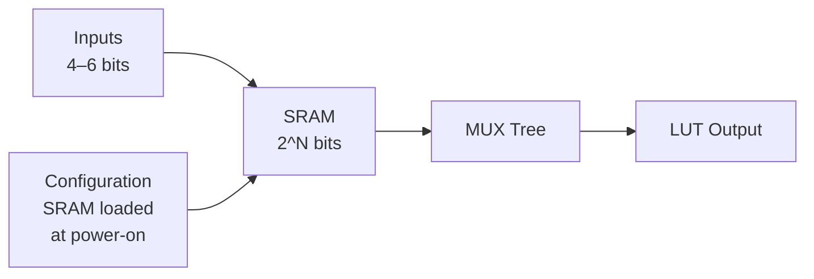
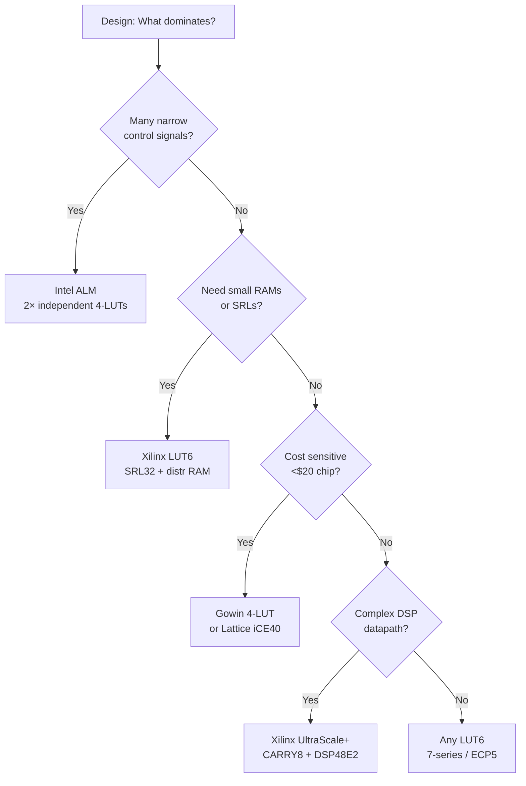

[← Home](../../README.md) · [Architecture](../README.md) · [Fabric](README.md)

# LUTs & CLBs — The Atomic Logic Element

Programmable logic starts with the Look-Up Table — a small SRAM that implements any Boolean function of its inputs. But the LUT alone is useless without the surrounding fabric that connects, registers, and chains it. This article dissects the LUT+logic-cell architecture across all major vendors, explaining how CLBs, Slices, ALMs, and carry chains turn a handful of LUT inputs into the computational fabric of every FPGA design.

---

## Overview

Every FPGA vendor builds logic from a clustered LUT — a small truth table (typically 4 to 8 inputs) backed by SRAM bits, paired with at least one flip-flop and carry-chain adder. These basic cells are bundled into groups called **Configurable Logic Blocks** (CLBs), **Slices** (Xilinx), **Adaptive Logic Modules** (ALMs, Intel), or **Programmable Functional Units** (PFUs, Lattice). Each vendor makes different trade-offs: LUT input count, fracturability (can a 6-LUT split into two 5-LUTs?), flip-flop ratios, dedicated carry logic, and whether the LUT can also serve as a small distributed RAM or shift register. Understanding these atomic primitives is essential because **every HDL construct eventually decomposes into LUT+FF+carry — and the limits of the cell determine the limits of your design's speed, density, and power.**

---

## Architecture: How a LUT Works

A 4-input LUT contains 16 SRAM cells (2⁴ = 16) storing a truth table. The 4 inputs select one SRAM cell through a tree of 2:1 multiplexers. To implement `F = A & B | C & ~D`, the tool computes the truth table for `F` across all 16 input combinations and writes those 16 bits into the LUT's SRAM during configuration.

**6-input LUTs** use 64 SRAM cells and allow more complex single-level logic, reducing the number of LUT levels on the critical path. However, a 6-LUT consumes more die area and has higher static power than a 4-LUT. Most modern FPGAs use fracturable 6-LUTs (or fracturable 8-LUTs in Versal/Agilex) to balance this.

### Fracturable LUTs

A fracturable LUT can operate as one N-input LUT or as two independent (N-1)-input LUTs sharing the same N inputs:

| LUT Type | Single Mode | Fractured Mode | Vendor |
|---|---|---|---|
| 4-LUT | 4-input function | N/A (not fracturable) | Early Xilinx, ice40 |
| 6-LUT | 6-input function | Two 5-input functions | Xilinx 7-series, UltraScale+ |
| ALM | 6-input function | Two 4-input (shared inputs), 4-LUT + full adder | Intel Cyclone/Arria/Stratix |
| 8-LUT | 8-input function | Two 6-input (shared) | Xilinx Versal, Intel Agilex |

---

## Vendor-by-Vendor Cell Architecture

### Xilinx: CLB → Slice → LUT6

Each **CLB** contains **2 Slices** (7-series) or **1 Slice** (UltraScale+). Each **Slice** contains:

| Resource | Count (7-series) | Count (UltraScale+) |
|---|---|---|
| 6-input LUTs | 4 | 8 |
| Flip-Flops | 8 | 16 |
| Carry Chain (CARRY4) | 1 (4-bit) | 1 (CARRY8, 8-bit) |
| Multiplexers (F7AMUX, F8BMUX) | 3 | 3 |

Each LUT6 can be configured as:
- **Logic**: One 6-input function, or two 5-input functions (shared inputs)
- **Distributed RAM**: 64×1 single-port, 32×2 dual-port
- **Shift Register (SRL32)**: 32-bit shift register with variable tap, 1 LUT per bit

The 7-series carry chain (CARRY4) propagates carries through 4 LUTs at ~50 ps per stage. UltraScale+ widened to CARRY8, doubling the carry throughput per CLB.

### Intel/Altera: LAB → ALM

10 ALMs form a **Logic Array Block (LAB)**. Each **ALM** contains:

| Resource | Cyclone V | Arria 10 / Stratix 10 / Agilex |
|---|---|---|
| Fracturable LUT | 6-input (64 SRAM) | 8-input (256 SRAM) in Agilex |
| Flip-Flops | 2 | 4 in Agilex |
| Full Adder | 1 (2-bit sum) | 2 (2-bit + 2-bit) |

An ALM can implement:
- One 6-input function
- Two independent 4-input functions (shared inputs)
- One 4-input LUT + full adder (for arithmetic)
- Part of a ternary adder (3-input add in Agilex)

Intel's ALM is more flexible than Xilinx's Slice for narrow logic — two independent 4-LUTs with independent FFs means one ALM often implements logic that would need two LUT6s in a Xilinx CLB.

### Lattice: PLC → Slice → LUT4

Lattice uses different cell architectures per family:

| Family | Cell Structure | LUTs per Slice | FFs per Slice |
|---|---|---|---|
| iCE40 | Logic Cell (LC) | 1× 4-LUT | 1 FF |
| ECP5 | Slice (2× LUT4, 4× FF) | 2× 4-LUT or 1× ripple | 4 FF |
| CrossLink-NX | PFU (Slice) | 4× fracturable 4-LUT | 8 FF |
| CertusPro-NX | PFU (Slice) | 8× fracturable 4-LUT | 16 FF |

ECP5 can combine two LUT4s with carry muxes to implement a **ripple mode** for efficient adders. CrossLink-NX adds fracturable LUT4s that can merge into wider functions through dedicated intra-Slice muxes.

### Gowin: CLS → LUT4

Gowin uses 4-input LUT-based cells:

| Family | LUT Type | FFs per Cell | Carry |
|---|---|---|---|
| LittleBee (GW1N) | 4-LUT | 1 | 1-bit ripple |
| Arora (GW2A) | 4-LUT | 1 | 2-bit ripple |

Gowin cells are simpler than Intel/Xilinx equivalents — no fracturable LUTs, no distributed RAM mode, no SRL mode. This simplicity keeps die cost low but means Gowin designs typically use 20–40% more LUTs than equivalent Xilinx/Intel implementations.

### Microchip: Logic Element

PolarFire uses 4-input LUTs with 1 FF per Logic Element, organized into clusters of 12 LEs. Carry chains are dedicated 4-bit ripple structures. The simplicity reflects PolarFire's low-power, SEU-immune design priorities.

---

## LUT Equivalence: Converting Between Vendors

Vendor LUT counts are not directly comparable. The "logic density" marketing number must be adjusted:

| Vendor | Marketing Unit | Approximate LUT4 Equivalents | Notes |
|---|---|---|---|
| Xilinx 6-LUT | 1 LUT6 | ≈ 1.6–1.8 LUT4s | Depends on logic pattern; fracturable mode reduces waste |
| Intel ALM | 1 LE (Logic Element) | ≈ 1 LE = 1 LUT4 equivalent | ALM can do 2× LUT4-equivalent work in some patterns |
| Lattice 4-LUT | 1 LUT4 | 1.0 LUT4 | Direct comparison |
| Gowin 4-LUT | 1 LUT4 | 1.0 LUT4 | Direct comparison |

> [!WARNING]
> **Vendor Tools Report "LUTs Used" Differently.** Intel Quartus reports ALM utilization and "LEs used." Xilinx Vivado reports LUT6 utilization. Lattice reports LUT4 utilization. A design using 10,000 LUT6s on Xilinx may use 16,000 LEs on Intel — not because Intel is "less efficient," but because the counting units differ. Always benchmark with your actual RTL.

---

## Distributed RAM and Shift Register Modes

Not all LUTs can double as memory:

| Vendor | Distributed RAM | Shift Register | Notes |
|---|---|---|---|
| Xilinx 7-series+ | Yes (64×1 SP, 32×2 DP) | Yes (SRL32) | Writes are synchronous, reads are async in RAM mode |
| Intel Cyclone V+ | No (use M10K/MLAB) | No | Intel uses MLAB (10Kb, half of each M20K) for distributed RAM |
| Lattice ECP5 | Partial (LUT cascade mode) | No | Ripple mode can chain LUTs for small RAMs |
| Gowin | No | No | All RAM must use BSRAM blocks |
| Microchip PolarFire | No | No | All RAM in LSRAM/uSRAM blocks |

**Implication:** Xilinx designs often implement 16–32 deep FIFOs in distributed RAM (SRL), saving BRAM blocks. Intel designs must use M20K for the same depth or pay LUT cost for register-based storage. This is not a flaw — it's a design trade-off: Intel's MLABs give you dedicated small RAM at the cost of consuming part of an M20K.

---

## Carry Chains and Arithmetic

All modern FPGAs have dedicated carry logic alongside LUTs for efficient adders, counters, and comparators:

| Vendor | Carry Structure | Bit Width per Stage | Notes |
|---|---|---|---|
| Xilinx 7-series | CARRY4 | 4-bit | MUXCY + XORCY per bit |
| Xilinx UltraScale+ | CARRY8 | 8-bit | Wider carry, fewer inter-slice hops |
| Intel Cyclone V | Carry chain (per ALM) | 2-bit sum | Each ALM can do 2-bit addition |
| Intel Agilex | Carry + Ternary adder | 2-bit | Ternary adder = a+b+c+d in one ALM |
| Lattice ECP5 | Ripple mode | 1-bit per slice | Two LUT4s + carry MUX combine |
| Gowin LittleBee | Carry chain | 1-bit | Simple ripple |
| Microchip PolarFire | Carry4 | 4-bit | 4-bit ripple per cluster |

> [!NOTE]
> The carry chain is the single most performance-critical structure for DSP-heavy designs. A 32-bit adder in Xilinx 7-series takes 8 CARRY4 stages (~400 ps). The same adder in ECP5 ripple mode takes 32 stages (~1,600 ps). This is why DSP blocks (which have internal hardened adders) are essential for high-speed arithmetic.

---

## When to Use / When NOT to Use

### When to Use Each LUT Architecture

| LUT Type | Ideal Scenario |
|---|---|
| **4-LUT** (iCE40, Gowin) | Low-cost, low-power, simple control logic. The simplicity keeps routing predictable and power low |
| **Fracturable 6-LUT** (Xilinx 7-series+) | General-purpose: complex logic in 6-LUT mode, narrower functions in 2× 5-LUT mode for density |
| **ALM** (Intel Cyclone V+) | Logic-heavy designs with many narrow functions. ALM's dual independent 4-LUT mode gives density advantage |
| **8-LUT** (Versal, Agilex) | High-performance critical paths. One 8-LUT replaces multiple 6-LUT levels, reducing logic depth |

### When NOT to Use

| Scenario | Recommendation |
|---|---|
| Implementing large shift registers on non-Xilinx | Use BRAM FIFO mode or register arrays. Don't force SRL-style patterns |
| Expecting 1:1 LUT count portability | Always benchmark your RTL on the target vendor's tool. LUT counts will differ |
| Using distributed RAM as primary storage (>512 bits) | Use BRAM blocks. Distributed RAM is for small register files and FIFOs |

---

## Decision Guide: Choosing a Logic Cell Target

---

## Best Practices & Antipatterns

### Best Practices
1. **Let synthesis choose LUT vs FF** — Don't manually instantiate LUT primitives unless you're optimizing a specific critical path
2. **Use `(* keep *)` / `(* preserve *)` sparingly** — Over-constraining prevents the tool from packing unrelated logic into partially-filled LUTs
3. **Benchmark on target hardware early** — Run a small representative module through Vivado/Quartus to see actual LUT utilization before committing to a device
4. **Check carry chain utilization in critical arithmetic** — Use the vendor device viewer to confirm the tool actually used dedicated carry (not LUT logic) for your adders

### Antipatterns

| Antipattern | The Problem | The Fix |
|---|---|---|
| **"The LUT Budgeter"** | Picking a device by LUT count alone, ignoring flip-flop ratio | Check device FF count — Xilinx offers 2 FFs/LUT, Intel offers 1 FFs/ALM. Register-heavy designs may underfill LUTs |
| **"The Faux RAM"** | Implementing [15:0] register arrays as `reg [15:0] mem [0:255]` expecting distributed RAM | Add `(* ram_style = "distributed" *)` or use vendor-specific synthesis attributes. Without hints, tools may infer BRAM or flat registers |
| **"The ALM Assumption"** | Porting an Intel design to Xilinx and assuming equivalent LUT efficiency | Intel ALMs often win on narrow logic; Xilinx LUT6 wins on SRL/DistRAM. Profile both |
| **"The Carry-Crusher"** | Writing `sum = a + b + c + d` expecting one level of carry | The vendor tool will build a carry tree; verify depth in the timing report. Use `(* use_dsp = "yes" *)` for wide adds if DSP slices are available |

---

## Pitfalls & Common Mistakes

### 1. Ignoring LUT-FF Packing Limits

**The mistake:** A design uses 5,000 LUTs and 5,000 FFs on Xilinx, ported to Intel Cyclone V. The Cyclone V uses 5,000 ALMs — and the user assumes it will fit.

**Why it fails:** Xilinx Slices have 4 LUT6 + 8 FFs (2:1 ratio). Intel ALMs have 1 fracturable LUT + 2 FFs. If the design has independent LUTs and FFs (not paired), Intel may use an entire ALM just for a LUT, wasting the FF. The result: Intel uses more ALMs than the Xilinx LUT count suggests.

**The fix:** Profile both registered and unregistered logic paths. Check the vendor post-fit report for "LUT-only" vs "FF-only" utilization.

### 2. SRL Expectations on Non-Xilinx

**The mistake:** Implementing a pipeline delay line as a shift register, expecting synthesis to infer SRL (Shift Register LUT).

**Why it fails:** Only Xilinx LUTs have SRL mode. Intel, Lattice, Gowin, and Microchip use BRAM blocks or register chains. A 64-stage shift register on Xilinx = 2 LUT6s (SRL32 × 2). On Intel = 64 FFs. On Gowin = 64 FFs. The area difference is dramatic.

**The fix:** If targeting multiple vendors, implement delay lines with BRAM-based FIFOs or accept the register cost.

---

## Real-World Use Cases

- **Soft CPU design** (PicoRV32, VexRiscv): LUT + carry chain form the ALU; flip-flops hold register file; distributed RAM (Xilinx) or small dedicated RAMs hold the register file for multi-port access
- **CRC / checksum engines**: Use LUT-based XOR trees with carry chain for wide XOR reduction
- **Async FIFO flags**: Gray-code counters implemented in LUT+FF with explicit placement for timing
- **Low-latency MUX trees**: Direct LUT mapping avoids the need for dedicated MUX resources

---

## References

| Source | Document |
|---|---|
| Xilinx UG474 — 7-Series CLB Architecture | https://docs.xilinx.com/r/en-US/ug474_7Series_CLB |
| Intel CV-5V2 — Cyclone V Device Handbook, Vol. 2 (Logic) | Intel FPGA Documentation |
| Lattice TN1262 — ECP5 sysIO Usage Guide | Lattice Tech Docs |
| Lattice DS1038 — ECP5 Family Datasheet | Lattice Tech Docs |
| Gowin UG100 — GW1N Schematic Manual | Gowin Docs |
| Microchip DS50002812 — PolarFire Datasheet | Microchip Docs |
| [BRAM and URAM deep dive](bram_and_uram.md) | This section |
| [DSP slices deep dive](dsp_slices.md) | This section |
