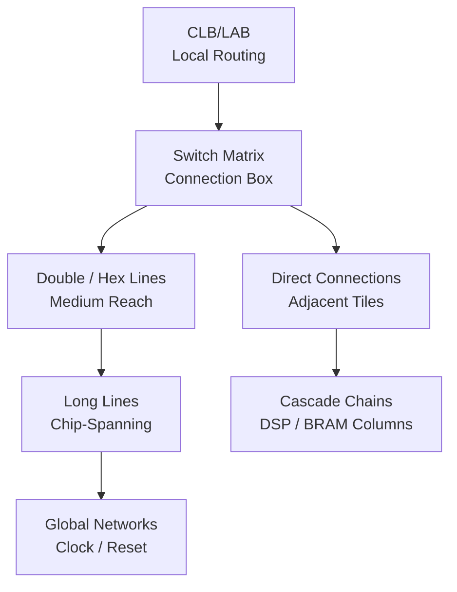

[← Home](../../README.md) · [Architecture](../README.md) · [Fabric](README.md)

# Routing & Interconnect — How Signals Move

LUTs, BRAMs, and DSPs are useless if your signals can't reach them. The FPGA routing fabric — a programmable network of wire segments and switch matrices — determines whether a design meets timing or fails with "routing congestion." This article explains how FPGA routing works, why it's the most underappreciated factor in FPGA performance, and how to write RTL and constraints that produce routable designs.

---

## Overview

The FPGA interconnect is a hierarchical network of metal wires, programmable switch points (pass transistors controlled by SRAM), and dedicated long lines. Unlike an ASIC where wires are physically placed during layout, FPGA routing must accommodate any legal connection pattern — which means an abundance of pre-fabricated wire segments connected through switch matrices. The trade-off: flexibility costs area, delay, and power. About 60–80% of an FPGA's die area is routing, not logic. Timing closure failurs are more often caused by routing congestion than by LUT speed limits. Understanding how the router works — and how your RTL influences its decisions — is the difference between a design that closes timing in one pass and one that requires floorplanning contortions.

---

## Routing Hierarchy



### 1. Local Routing (Intra-CLB)

Connections within a single CLB/Slice/ALM. These are hardwired and fast — LUT output to FF input within the same Slice has near-zero routing delay (<50 ps). The synthesis tool exploits this aggressively, packing related logic into the same CLB whenever possible.

### 2. Direct Connections

Adjacent DSP slices, adjacent BRAM blocks, and adjacent CLBs have dedicated signal paths that bypass the switch matrix entirely. DSP cascade chains (`PCIN→PCOUT` on Xilinx, `chainin→chainout` on Intel) use these direct connections to achieve 3–5× lower latency than general routing.

### 3. General Routing (Switch Matrix)

The **connection box** (CB) connects CLB inputs to nearby wire segments. The **switch box** (SB) connects wire segments to other wire segments. Each programmable connection is a pass transistor + SRAM bit. A signal might traverse 5–15 switch matrices to cross the chip, each adding 100–300 ps of delay.

### 4. Long Lines

Chip-spanning wires (Verilog: `CLOCK_DEDICATED_ROUTE` on Xilinx, global clock networks on all vendors) have dedicated drivers and distribution trees. These are pre-balanced for low skew — a clock edge arrives at all destinations within ~100 ps of each other.

### 5. Global Networks

Clocks, resets, and high-fanout control signals use dedicated global routing networks. Xilinx has 32 global clock buffers (BUFG/BUFGCE) per device. Intel has 32 global clock (GCLK) networks. Lattice ECP5 has 8 primary + 8 secondary clocks. Exceeding these limits forces routing through fabric — a classic timing closure disaster.

---

## Vendor-by-Vendor Routing Architecture

### Xilinx (7-series and UltraScale+)

| Resource | 7-series | UltraScale+ | Notes |
|---|---|---|---|
| **Switch matrix type** | Full crossbar per CLB | Enhanced with more direct paths | US+ adds more unidirectional wires |
| **Wire segment types** | Single, Double, Quad, Long, Clock | Same + HSC (High Speed Cascade) | Long lines span 12+ CLBs |
| **Direct connections** | CARRY4, DSP48, BRAM cascade | CARRY8, DSP58, URAM cascade | Cascade only within same column |
| **Global clocks** | 32 BUFG | 32 BUFG + regional | Regional clocks reduce skew for localized domains |
| **Critical feature** | **pblock constraints** for congestion management | **SLR crossings** (Super Logic Region, inter-die in stacked silicon) | SLR crossings add ~1 ns penalty in SSI devices (Virtex-7 HT, UltraScale+ VU19P) |

**UltraScale+ SLR Crossing Penalty:** On multi-die UltraScale+ devices (VU9P, VU13P, VU19P), crossing between Super Logic Regions (SLRs) costs ~1 ns round-trip. The router cannot optimize across SLR boundaries as aggressively. For high-fMAX designs, SLR crossings must be treated as top-level pipeline stage boundaries.

### Intel/Altera (Cyclone V, Arria 10, Stratix 10, Agilex)

| Resource | Cyclone V | Agilex | Notes |
|---|---|---|---|
| **Switch matrix** | LAB-based | HyperFlex (pipelined routing) | Agilex adds register stages inside routing |
| **Wire segments** | R4, R24, C4/C16 | R4/R24 + pipelined | R4 spans 4 LABs, R24 spans 24 LABs |
| **Direct connections** | ALM cascade, DSP chain | Same + AI tensor DSP cascade | Column-based cascades |
| **Global clocks** | 16 GCLK per quadrant | 32 GCLK | Quadrant-based distribution |
| **Critical feature** | **HyperFlex** (Agilex only): registers embedded in routing fabric to pipeline long paths without consuming ALM FFs |

**HyperFlex:** Agilex's killer routing feature. Instead of consuming an ALM flip-flop to pipeline a long route, HyperFlex embeds registers directly in the routing multiplexers. A 3 ns route can be split into two 1.5 ns segments with a HyperFlex register in the middle — adding 1 cycle of latency but doubling fMAX with zero ALM cost.

### Lattice (ECP5, CrossLink-NX)

| Resource | ECP5 | CrossLink-NX/CertusPro-NX |
|---|---|---|
| **Switch matrix** | Uni-directional with buffered switches | Enhanced with more direct east-west routes |
| **Wire segments** | ×2, ×6, ×16 span | Improved distribution |
| **Direct connections** | sysDSP cascade, EBR cascade | Same + enhanced PCIe hard IP connections |
| **Global clocks** | 8 primary + 8 secondary | 16 primary |

ECP5 routing is simpler than Xilinx/Intel equivalents but also more predictable — fewer wire types mean the router converges faster. The trade-off is reduced maximum frequency on heavily congested designs.

### Gowin and Microchip

Both use simplified routing architectures optimized for low power rather than peak bandwidth:
- **Gowin:** 4-direction switch matrix with limited long lines. Congestion increases sharply above 70% utilization
- **Microchip PolarFire:** Segment-based routing with dedicated high-speed paths for transceivers. Lower congestion at high utilization due to over-provisioned routing relative to logic density

---

## Congestion: The Silent fMAX Killer

### What Is Congestion?

Congestion occurs when too many signals need to pass through the same physical region of the FPGA. The router runs out of wire segments and must take detours — adding 2–5× the expected routing delay and potentially failing timing.

```
┌── No Congestion ────────┐  ┌── Congested ──────────┐
│   LUT──►LUT──►LUT →     │  │ LUT─►LUT  LUT──►LUT   │
│                          │  │    ↙  ↓  ↗    ↘     │
│   Direct, 1-hop route    │  │ Detour through 4 hops │
│   200 ps delay            │  │  1,200 ps delay       │
└──────────────────────────┘  └───────────────────────┘
```

### Congestion Sources

1. **High LUT utilization (>80%)** — Less routing flexibility. Every 1% above 80% increases congestion geometrically
2. **Wide buses crossing chip** — A 256-bit AXI bus crossing the chip center consumes hundreds of wire segments at the crossing point
3. **MUX trees** — Large multiplexers (32:1, 64:1) become routing hotspots. The select lines fan out to all mux locations simultaneously
4. **High-fanout control signals** — A reset or enable that reaches 10,000+ FFs must be replicated and buffered; the router spends significant effort on fanout distribution
5. **DSP column concentration** — All DSPs are in columns. Designs that concentrate all DSP use in one column create local routing saturation

### Congestion Mitigation

| Strategy | When to Apply | Effect |
|---|---|---|
| **pblock/LogicLock regions** | Wide buses crossing chip | Restricts logic placement, forcing signals into predictable corridors |
| **Pipeline long routes** | Cross-chip paths | Adds register stages at chip midpoints; trades latency for routability |
| **Reduce bus widths** | Wide AXI/Avalon | 256-bit → 128-bit or 64-bit, higher clock if possible |
| **Replicate high-fanout** | >1000 loads | `(* max_fanout = 256 *)` on Xilinx; Synthesis will replicate drivers automatically |
| **Spread DSP usage** | All DSP in one column | Instantiate DSPs in multiple columns; use pblocks to force spreading |

---

## When to Use / When NOT to Use

### When to Prioritize Routing in Design

| Situation | Action |
|---|---|
| Design >70% LUT utilization | Start floorplanning early. Don't wait for routing failure |
| Multi-SLR device (UltraScale+ VU*) | Plan SLR boundary crossings as pipeline stage boundaries |
| 100+ DSPs in single column | Spread DSP instantiation across columns with pblock constraints |
| AXI crossbar with 8+ masters | Consider time-division multiplexing (TDM) or narrower data paths to reduce wire count |
| fMAX > 300 MHz on >50% utilization | Accept that you will need to floorplan; pure auto-placement is unlikely to close timing |

### When Routing Is NOT Your Bottleneck

| Situation | Reason |
|---|---|
| <50% LUT utilization on medium device | Plenty of routing slack; auto-placement will likely work |
| Single-SLR / single-die device | No inter-die penalties |
| Simple pipeline with no wide buses | Routing is nearly one-dimensional (straight-line through pipeline stages) |
| I/O-limited design (few LUTs, many pins) | Routing is dominated by fixed I/O pin locations, not fabric congestion |

---

## Best Practices & Antipatterns

### Best Practices
1. **Target ≤70% LUT utilization** — Above 70%, routing becomes the dominant timing failure mode. Budget 30% slack for routing
2. **Pipeline long routes** — Any path crossing >25% of the die should have at least one register stage at the midpoint
3. **Use vendor congestion reports** — Vivado `report_congestion` and Quartus Chip Planner heat maps show hotspots before routing fails
4. **Respect global clock limits** — Don't use BUFG for low-fanout signals. Use BUFH/BUFR for regional clocks. Every wasted BUFG is one less clock domain you can support

### Antipatterns

| Antipattern | The Problem | The Fix |
|---|---|---|
| **"The LUT Stuffing"** | Packing to 95% LUT utilization for "cost efficiency" | Routing fails. Reduce to 70% target; the device is cheaper than the engineering hours spent on timing closure |
| **"The 512-Bit Bus"** | Running 512-bit data paths across the entire chip with no pipelining | All 512 wires converge at switch matrices, creating massive congestion. Pipeline at every major crossing. Or reduce width + increase clock |
| **"The Mega-MUX"** | A single 128:1 multiplexer driven by select logic from one corner and inputs spread across the chip | Select fanout and data routing create a ring of congestion. Decompose into hierarchical MUX stages, each placed near its data sources |
| **"The Cross-Chip Unpipelined"** | A single combinatorial path from IOB to IOB crossing 70% of the die | Routing delay alone (2–4 ns) plus LUT delays makes this impossible above 150 MHz. Add at minimum one register at the die center |

---

## Pitfalls & Common Mistakes

### 1. SLR Crossing Without Pipeline Stage

**The mistake:** A 16-tap FIR filter in a VU9P (3 SLRs) implemented as one DSP column, with taps placed across SLR boundaries by the auto-placer.

**Why it fails:** The cascade chain cannot cross SLR boundaries directly. The router must route cascade outputs through fabric to reach the next SLR — adding ~1 ns per crossing. A 2-SLR crossing adds 2 ns to a path that should be 500 ps.

**The fix:** Partition the FIR filter into one sub-filter per SLR, with explicit pipeline registers at SLR boundaries. Use pblock constraints to lock each sub-filter into its target SLR.

### 2. High-Fanout Reset Driving BUFG

**The mistake:** A global async reset connected to BUFG, then distributed to 50,000 FFs.

**Why it fails:** Resets are not clocks. A BUFG adds insertion delay (1–2 ns) and prevents the router from optimizing reset distribution. For async resets, the BUFG delay can cause recovery time violations — the reset de-asserts at different times at different FFs.

**The fix:** Use sync reset (no global buffer needed — the router replicates and optimizes automatically). If async reset is mandatory, use the vendor's dedicated reset distribution network (Xilinx: `STARTUPE3.GSR`), not BUFG.

### 3. Assuming All Routes Are Created Equal

**The mistake:** P&R passes timing with zero slack on a critical path. User assumes the design is good.

**Why it fails:** Zero-slack paths are fragile. A temperature change, voltage droop, or minor RTL change can push them negative. The router may have used "heroic" detours to close timing — next P&R run may fail.

**The fix:** Budget for timing margin: 5–10% above target fMAX. If the target is 200 MHz, design for 210–220 MHz. The router needs slack headroom to converge.

---

## References

| Source | Document |
|---|---|
| Xilinx UG472 — 7-Series Clocking Resources | https://docs.xilinx.com/ |
| Xilinx UG572 — UltraScale Clocking (global, regional, HSC) | https://docs.xilinx.com/ |
| Intel CV-5V2 — Cyclone V Clock Networks and PLLs | Intel FPGA Documentation |
| Intel Agilex HyperFlex Architecture | Intel FPGA Documentation |
| Lattice TN1264 — ECP5 Clocking and Routing | Lattice Tech Docs |
| [Clocking—PLL, MMCM, DCM](../infrastructure/clocking.md) | Next section — clock distribution |
| [Configuration and Bitstream](../infrastructure/configuration.md) | How the routing SRAM gets programmed |
| [DSP Slices](dsp_slices.md) | Cascade routing for DSP chains |
