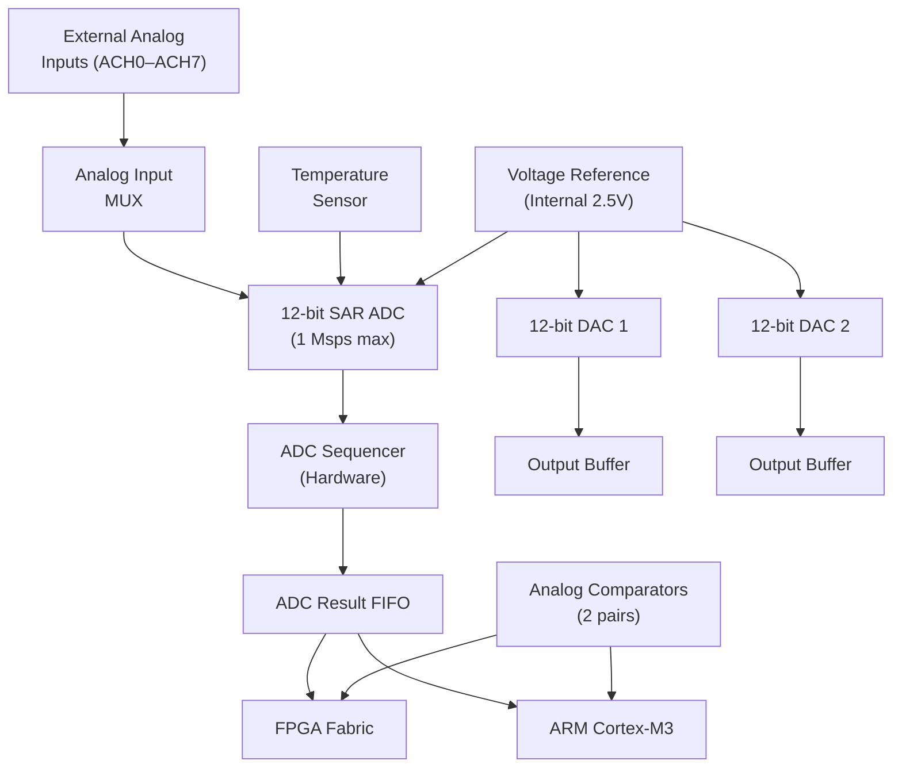

[← Hybrid Home](README.md) · [← Architecture Home](../../README.md) · [← Project Home](../../../README.md)

# Analog/Mixed-Signal FPGA — ADC, DAC, Comparators, and Voltage References

Not all FPGAs are purely digital. Several families integrate analog peripherals — ADCs, DACs, analog comparators, voltage references, and temperature sensors — directly alongside the programmable logic fabric. These mixed-signal FPGAs target applications that would otherwise require a separate MCU or analog front-end chip: sensor interfaces, motor control, power supply monitoring, and closed-loop control. This article covers the analog capabilities of Microchip SmartFusion2/IGLOO2, Lattice MachXO2/3, and Microchip PolarFire — the three FPGA families with significant on-chip analog resources.

> [!NOTE]
> This article covers **on-chip** analog resources. For external ADC/DAC interfacing from any FPGA, see [IO Standards & SERDES](../../02_architecture/infrastructure/io_standards.md).

---

## Why Mixed-Signal FPGAs Exist

| Without Mixed-Signal FPGA | With Mixed-Signal FPGA |
|---|---|
| Separate MCU for ADC + FPGA for processing | Single-chip solution |
| PCB space for analog front-end | Analog built into the FPGA |
| Interface latency between MCU and FPGA | Zero-latency on-chip analog → fabric |
| Multiple firmware images (MCU + FPGA) | Single FPGA bitstream + analog config |
| Higher BOM cost | Lower component count |

---

## Microchip SmartFusion2 — ARM Cortex-M3 + FPGA + Analog

SmartFusion2 is the most complete mixed-signal FPGA: it integrates an ARM Cortex-M3 processor, FPGA fabric, AND a comprehensive analog block called the **Analog Compute Engine (ACE)**.

### ACE Block Architecture



### Analog Resources

| Resource | Specification |
|---|---|
| **ADC** | 12-bit SAR, 1 Msps, 8 multiplexed inputs (ACH0–ACH7) |
| **DACs** | 2× 12-bit, 500 ksps each |
| **Comparators** | 2 pairs (4 total), configurable hysteresis, window mode |
| **Temperature sensor** | ±3°C accuracy, built-in |
| **Voltage reference** | Internal 2.5V (±1%), or external reference |
| **ADC sequencer** | Hardware sequencer — programmable scan order, no CPU intervention |

### ADC Sequencer Operation

The ADC sequencer is a hardware state machine that cycles through the analog inputs without CPU intervention:

```
Sequence: ACH0 → ACH1 → ACH2 → ACH5 → ACH7 → (repeat)
Each sample: 1 µs at 1 Msps
Total scan time: 5 µs for 5 channels
Results pushed to FIFO → available to FPGA fabric and M3
```

### Configuration in Libero SmartDesign

1. Add **ACE** component to SmartDesign
2. Configure ADC input sequence (which channels, what order)
3. Set ADC resolution (8-bit fast mode or 12-bit precision)
4. Configure DAC output voltage range (0–VREF or 0–2×VREF)
5. Set comparator thresholds and hysteresis
6. Enable temperature sensor monitoring
7. Connect ADC/DAC to FPGA fabric via APB bus or direct signals

---

## Microchip IGLOO2 — Flash FPGA with Analog

IGLOO2 shares the same analog block (ACE) as SmartFusion2 but without the ARM Cortex-M3 processor. The analog resources are accessible from the FPGA fabric only.

| Resource | IGLOO2 ACE |
|---|---|
| ADC | 12-bit, 1 Msps, 8 inputs |
| DACs | 2× 12-bit, 500 ksps |
| Comparators | 2 pairs |
| Temperature sensor | Yes |
| Processor access | Fabric only (no M3) |

---

## Lattice MachXO2/3 — Analog Block

Lattice MachXO2 and MachXO3 include a simpler analog block called the **Hardened Analog Block** — primarily an ADC for monitoring and control.

### MachXO3L Analog Resources

| Resource | Specification |
|---|---|
| **ADC** | 12-bit, 24 channels (multiplexed), 16 Msps aggregate |
| **Comparators** | 2 analog comparators |
| **Voltage reference** | Internal 1.2V bandgap |
| **Temperature sensor** | Yes |

### ADC Configuration (MachXO3)

```verilog
// MachXO3 ADC — simplified access via Wishbone bus
// The ADC is accessed through the built-in Wishbone bus interface
// Configuration done through Lattice Diamond IP Express

// ADC input selection: 24 channels available
// Channel 0-7:  external analog inputs (CM0–CM7)
// Channel 8-15: GPIO monitoring (digital voltage levels)
// Channel 16-23: internal (temperature, VCC, VCCAUX, etc.)
```

### MachXO2 vs MachXO3 Analog

| Feature | MachXO2 | MachXO3 |
|---|---|---|
| ADC resolution | 12-bit | 12-bit |
| ADC channels | 14 | 24 |
| Sample rate | 10 ksps | 16 Msps (aggregate) |
| Comparators | 2 | 2 |
| DACs | No | No |

---

## Microchip PolarFire — Analog Features

PolarFire includes analog resources focused on power and temperature monitoring rather than signal acquisition:

| Resource | Specification |
|---|---|
| **Temperature sensor** | ±3°C accuracy, for thermal management |
| **Voltage monitors** | VDD core, VDDIO bank monitoring |
| **ADC** | Not included (use external ADC via SPI) |
| **DAC** | Not included |

PolarFire's approach: use the FPGA's high-speed IO (LVDS, SPI) to interface with external analog components, rather than integrating them on-chip. This is appropriate for the mid-range to high-end market where the analog requirements vary widely.

---

## Comparison of Mixed-Signal FPGAs

| Feature | SmartFusion2 | IGLOO2 | MachXO3 | PolarFire |
|---|---|---|---|---|
| **ADC** | 12-bit, 1 Msps | 12-bit, 1 Msps | 12-bit, 16 Msps | None |
| **ADC channels** | 8 | 8 | 24 | N/A |
| **DACs** | 2× 12-bit | 2× 12-bit | None | None |
| **Comparators** | 2 pairs | 2 pairs | 2 | None |
| **Temp sensor** | Yes | Yes | Yes | Yes |
| **Hard processor** | Cortex-M3 | None | None | None |
| **Config memory** | Flash | Flash | Flash + SRAM | Flash |
| **Target apps** | Motor control, sensor fusion | Industrial control | General monitoring | High-end systems |

---

## Common Pitfalls

### 1. ADC Input Voltage Range

**The problem:** Applying 3.3V to an ADC input that has a maximum range of VREF (2.5V).

**The fix:** Use voltage dividers on external inputs. SmartFusion2 ADC inputs are limited to VREF. Calculate the divider ratio: `V_ADC = V_EXT × R2/(R1+R2)` where `V_ADC ≤ 2.5V`.

### 2. ADC Grounding and Noise

**The problem:** Noisy ADC readings due to shared ground with switching FPGA logic.

**The fix:** Use separate analog ground (AGND) and digital ground (DGND) planes. Connect them at a single point near the FPGA. Route analog traces away from high-speed digital signals.

### 3. DAC Output Loading

**The problem:** The DAC output buffer can drive only limited current (typically 5 mA). Connecting a low-impedance load corrupts the output voltage.

**The fix:** Use an external op-amp buffer for low-impedance loads. The SmartFusion2 DAC output impedance is typically 50Ω — driving a 1kΩ load is fine; driving 100Ω is not.

---

## References

| Source | Description |
|---|---|
| Microchip DS60001184 — SmartFusion2 Datasheet | Analog specifications and configuration |
| Microchip UG0334 — SmartFusion2 ACE User Guide | ACE block programming and sequencer configuration |
| Lattice TN1266 — MachXO3 SysCADA Analog Block | ADC and comparator configuration |
| Microchip PF-DS — PolarFire Datasheet | Temperature and voltage monitoring |
| [IO Standards](../../02_architecture/infrastructure/io_standards.md) | External analog interfacing via IO standards |
| [Power Integrity](../../09_boards_and_board_design/power_integrity.md) | Board-level analog power supply design |
