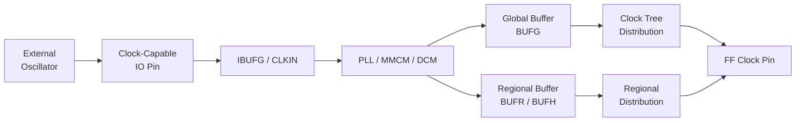

[← Home](../../README.md) · [Architecture](../README.md) · [Infrastructure](README.md)

# Clocking — PLLs, MMCMs, DCMs, and Distribution

A wrong clock architecture dooms an FPGA design before the first line of RTL. The PLL generates precise frequencies. The clock distribution network delivers low-skew edges to every flip-flop. And the clock-domain-crossing strategy determines whether your design works reliably across temperature and voltage. This article covers how FPGA clocking works across all major vendors — from the reference oscillator to the flip-flop clock pin.

---

## Overview

Every FPGA has a dedicated clocking fabric that is fundamentally different from general-purpose routing. A reference clock (typically 25–100 MHz from an external oscillator) enters the FPGA through a clock-capable pin, feeds into a **Phase-Locked Loop (PLL)** or **Mixed-Mode Clock Manager (MMCM)**, and is distributed through balanced clock trees to thousands of synchronous elements. The entire chain — pin, buffer, PLL, distribution network — is pre-characterized for skew, jitter, and insertion delay. A signal on general routing cannot replace a clock because it lacks these guarantees. The key decisions: which PLL parameters (multiply, divide, phase shift), which global vs regional buffer to use, and how many clock domains your design can physically support before running out of clock distribution resources.

---

## The Clocking Chain



### Reference Clock Input

Clock-capable pins (CCLK, MRCC, SRCC on Xilinx; CLK pins on Intel; PCLK on Lattice) have dedicated paths to PLL inputs with controlled impedance. These pins are specified for single-ended or differential clock standards (LVDS, LVPECL, HCSL).

> [!WARNING]
> **Never route a clock through general-purpose IO.** General IO pins lack the dedicated, low-skew path to the PLL and distribution network. Use clock-capable pins exclusively for clock inputs.

---

## PLL/MMCM/DCM Architecture

### Xilinx: MMCM and PLL

| Feature | PLL | MMCM |
|---|---|---|
| **Frequency synthesis** | M/D (simple multiply/divide) | M/D (fractional-N) |
| **Phase shift** | Fixed 45° increments | Fine phase shift (1/56 VCO period) |
| **Jitter filtering** | Good | Better (wider loop bandwidth control) |
| **Clock outputs** | 6 (CLKOUT0–5) | 7 (CLKOUT0–6) |
| **Deskew** | No | Yes (feedback path) |
| **Dynamic reconfig** | No | Yes (DRP, reconfigure at runtime) |
| **Where used** | Simple clock generation | Complex multi-clock designs, source-sync IO |

**7-series Clock Management Tile (CMT):** Each CMT contains one MMCM and one PLL. A 7-series device has 2–24 CMTs depending on device size.

**UltraScale+:** Replaces MMCM with enhanced MMCME3 (fractional-N, wider VCO range, lower jitter).

### Intel/Altera: PLL Types

| PLL Type | Cyclone V | Arria 10 | Agilex | Use |
|---|---|---|---|---|
| **fPLL (Fractional)** | 4 | 8 | 8 | General synthesis, DDR, spread-spectrum |
| **Integer PLL** | 2 | 4 | 4 | Low-jitter applications (SERDES ref clocks) |
| **IOPLL** | N/A | Yes | Yes | Specific IO bank clocking, LVDS SERDES |

**Intel PLL Parameters:**
- VCO range: 600–1,600 MHz (Cyclone V), 800–2,400 MHz (Agilex)
- Outputs: up to 18 (C-counter outputs)
- Phase shift: 1/8 VCO period resolution
- Dynamic reconfiguration: Yes (reconfig PLL at runtime)

### Lattice: PLL and DCMA

| Feature | ECP5 PLL | CertusPro-NX PLL |
|---|---|---|
| **Inputs** | 2 reference clocks per PLL | 2 |
| **VCO range** | 400–800 MHz | 600–1,200 MHz |
| **Outputs** | 3 (CLKOP, CLKOS, CLKOS2) | 4+ |
| **Phase shift** | Coarse (90° steps) | Fine and coarse |
| **Deskew** | No | Yes (DCMA: Dynamic Clock Mux Alignment) |

ECP5 has 2–4 PLLs depending on density. CertusPro-NX has 4–8 PLLs with improved jitter performance.

### Gowin and Microchip

- **Gowin:** Simple PLL with limited output count (2–3). VCO range 400–1,200 MHz. No fractional-N. No dynamic reconfiguration. Sufficient for basic clock generation but limits multi-clock designs
- **Microchip PolarFire:** PLL with 5 outputs, fractional-N, dynamic reconfiguration. Good jitter performance for SERDES reference clocks

---

## Clock Distribution Networks

### Global Clock Buffers

Global buffers drive the low-skew clock tree that reaches every synchronous element on the die:

| Vendor | Buffer Type | Count (typical) | Notes |
|---|---|---|---|
| Xilinx 7-series | BUFG | 32 | Global, reaches entire die |
| Xilinx 7-series | BUFH | 12 per bank | Horizontal, single clock region |
| Xilinx 7-series | BUFR | 4 per bank | Regional, drives IO and fabric in one clock region |
| Intel Cyclone V | GCLK | 16 per quadrant | Quadrant-based global |
| Intel Cyclone V | RCLK | 22 per quadrant | Regional |
| Lattice ECP5 | Primary Clock | 8 | Global |
| Lattice ECP5 | Secondary Clock | 8 | Regional/edge |
| Gowin LittleBee | HCLK | 8 | Global |
| Microchip PolarFire | Global | 32 | Global |

> [!WARNING]
> **Exceeding global clock buffer limits** forces synthesis to route clocks through general fabric — destroying skew, increasing insertion delay, and likely causing timing failures. Count your clock domains early.

### When to Use Regional vs Global Buffers

| Situation | Buffer |
|---|---|
| System clock (>90% of logic) | BUFG (global) — reaches everything |
| IO interface clock (only drives IO logic + adjacent fabric) | BUFR/BUFIO (regional) — lower insertion delay for IO |
| High-fanout control (reset, clock enable, >2,000 loads) | BUFG or BUFH — fabric replication is less efficient |
| Low-fanout clock (<500 loads, localized to one corner) | BUFR or fabric routing — save BUFG for global domains |

---

## Clock Specification (SDC/XDC)

Every clock in the design must be declared in the constraint file. Undeclared clocks have unknown period — the timing analyzer cannot verify paths between them.

```tcl
# Xilinx XDC
create_clock -name sys_clk -period 10.000 [get_ports clk_in]
create_generated_clock -name clk_200m -source [get_pins PLL/CLKIN] -divide_by 2 [get_pins PLL/CLKOUT0]

# Intel SDC
create_clock -name sys_clk -period 10.000 [get_ports clk_in]
create_generated_clock -name clk_200m -source [get_pins PLL|clkin] -divide_by 2 [get_pins PLL|clkout[0]]
```

**Common Pitfall:** Generated clocks often get the wrong master. Always set `-source` to the PLL input clock pin, not the output.

---

## Clock Domain Crossing (CDC) — Quick Reference

| CDC Strategy | Latency | Reliability | Resource Cost | When to Use |
|---|---|---|---|---|
| **2-FF Synchronizer** | 2–3 cycles | Good for single-bit | 2 FFs | Control signals, resets, strobes |
| **Async FIFO (BRAM)** | 2–6 cycles | Excellent for buses | 1 BRAM + 20 LUTs | Data buses crossing domains |
| **Handshake** | 4–10 cycles | Excellent | ~50 LUTs per bus | When FIFO depth/BRAM is unavailable |
| **Gray-Code FIFO** | 2–6 cycles | Excellent | Same as async FIFO | Pointers crossing domains |
| **MCP (Multi-Cycle Path)** | N cycles | Tile-dependent | Zero (constraint only) | Paths stable for N+ cycles |

> [!WARNING]
> **Every signal crossing clock domains requires explicit synchronization.** A register in the source domain driving a register in the destination domain with different clocks is a metastability hazard — not a CDC solution.

For full CDC methodology, see [Clock Domain Crossing deep dive](../../05_timing_and_constraints/clock_domain_crossing.md).

---

## Best Practices & Antipatterns

### Best Practices
1. **Declare every clock in constraints** — Undeclared clocks have infinite period; the timer will not analyze cross-domain paths involving them
2. **Use dedicated PLL for SERDES reference clocks** — SERDES PLLs need ultra-low jitter. Sharing with general fabric PLLs adds jitter from fabric switching noise
3. **Minimize clock domains** — Every additional clock domain adds: 1 BUFG, 1 CDC boundary, 1 async FIFO or synchronizer chain. Target ≤5 domains for most designs
4. **Lock PLLs before releasing reset** — Use PLL locked signal (`LOCKED` output) to hold the design in reset until all output clocks are stable

### Antipatterns

| Antipattern | The Problem | The Fix |
|---|---|---|
| **"The Gated Clock"** | Using `assign gated_clk = clk & enable` and routing to FF clock pins | Gated clocks skip the global distribution network. The enable has unbounded skew, causing hold violations. Use `BUFGCE` or clock enable on FF data path |
| **"The Divided-by-Logic Clock"** | `always @(posedge clk) div2 <= ~div2` then using `div2` as a clock | `div2` is a fabric signal, not a clock. It has skew, no PLL, no distribution tree. Use PLL divide or BUFGCE + clock enable |
| **"The Clock Domain Collector"** | 12 separate clock domains because "each peripheral needs its own clock" | Shared clocks with enables use fewer BUFG resources. The UART, SPI, and I2C can share one clock at their least common multiple. Use PLL only when frequencies truly differ |
| **"The Unlocked Reset"** | Deasserting reset immediately, before PLL LOCKED is asserted | The PLL may take 1–100 µs to lock. During this time, output clocks are unstable. Sample PLL LOCKED and hold reset until lock is confirmed |

---

## Pitfalls & Common Mistakes

### 1. PLL Input Frequency Out of Range

**The mistake:** Connecting a 10 MHz oscillator to a PLL whose minimum input frequency is 19 MHz.

**Why it fails:** The PLL phase detector cannot operate below its minimum frequency. The PLL never locks.

**The fix:** Check the PLL input frequency range in the device datasheet. Use an external oscillator at a compatible frequency, or divide a higher-frequency reference before the PLL (using a dedicated divider, not fabric logic).

### 2. BUFG Starvation

**The mistake:** A design with 14 clock domains on a device with 16 BUFGs. Two global resets also use BUFGs.

**Why it fails:** 14 + 2 = 16, max BUFG count. Adding one more clock domain or debug ILA clock fails synthesis.

**The fix:** Use BUFR/BUFH for localized clocks. High-fanout resets do not need BUFG; use vendor reset distribution (Xilinx STARTUPE3) or fabric replication.

### 3. PLL Phase Shift Without Compensation

**The mistake:** Setting `-phase 90` on a PLL output for a center-aligned DDR capture clock, assuming the 90° shift is absolute.

**Why it fails:** The PLL's output phase is relative to its VCO, not the input clock. Process, voltage, and temperature (PVT) variation shifts the absolute phase. The actual phase may be 80–100° across PVT.

**The fix:** Use MMCM/DCMA deskew mode (feedback from a clock distribution point) to compensate for PVT variation. For DDR interfaces, use vendor DDR PHY calibration instead of manual phase shifts.

---

## References

| Source | Document |
|---|---|
| Xilinx UG472 — 7-Series Clocking Resources | https://docs.xilinx.com/ |
| Xilinx UG572 — UltraScale Clocking | https://docs.xilinx.com/ |
| Intel CV-5V2 — Cyclone V Clock Networks and PLLs | Intel FPGA Documentation |
| Lattice TN1264 — ECP5 Clocking and Routing | Lattice Tech Docs |
| [IO Standards & SERDES](io_standards.md) | Next article |
| [Clock Domain Crossing](../../05_timing_and_constraints/clock_domain_crossing.md) | CDC deep dive |
| [SDC Basics](../../05_timing_and_constraints/sdc_basics.md) | Constraint syntax |
