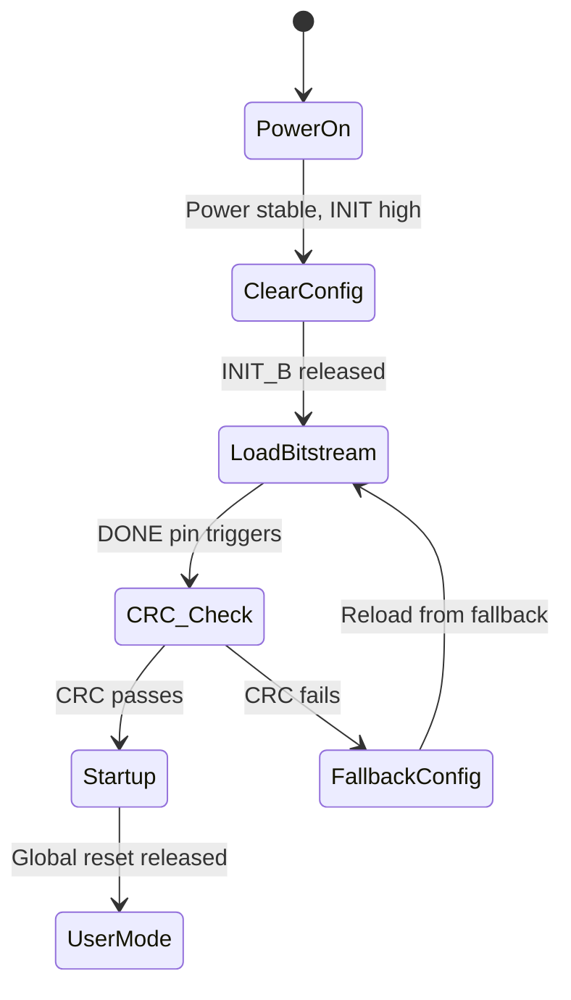

[← Home](../../README.md) · [Architecture](../README.md) · [Infrastructure](README.md)

# Configuration & Bitstream — How an FPGA Comes to Life

An FPGA is a blank slate at power-on — all LUTs, routing, and IO are unconfigured. The configuration process loads a **bitstream** (a binary file encoding every SRAM-controlled switch and LUT value) into the device through one of several configuration interfaces. This article covers the bitstream format at a conceptual level, the configuration modes available across vendors, and the security features (encryption, authentication) that protect FPGA designs from cloning and tampering.

---

## Overview

The FPGA configuration system is a state machine hardwired into the silicon that reads a bitstream from an external memory (SPI flash, BPI flash, SD card, or microcontroller) or accepts it over JTAG/SelectMAP. For SoC FPGAs (Zynq, Cyclone V SoC, PolarFire SoC), the hard processor system (HPS/PS) can also configure the FPGA fabric under software control. The configuration process has three phases: **setup** (power-on, clear configuration SRAM), **load** (stream bitstream data into the device), and **startup** (release global reset, activate IO, begin user logic). Each vendor uses a proprietary, undocumented bitstream format — though projects like Project Trellis (Lattice ECP5) and F4PGA (Xilinx 7-series) have reverse-engineered open-source documentation.

---

## The Configuration State Machine



---

## Configuration Modes

### Mode Selection

Configuration mode is selected by strap pins (Xilinx `M[2:0]`, Intel `MSEL[4:0]`, Lattice `CFG[1:0]`) sampled at power-on. For SoC FPGAs, the HPS/PS can override the strap pins and configure the fabric from software.

### Mode Comparison

| Mode | Interface | Speed | Typical Memory | Use Case |
|---|---|---|---|---|
| **SPI Master (×1/×2/×4)** | SPI flash to FPGA | 20–100 MHz (×4: up to 400 Mbps) | QSPI NOR flash (16–256 Mb) | Most common: simple, cheap, widely available |
| **BPI (Byte-wide Parallel)** | Parallel NOR flash | 16-bit, ~100 MHz | Parallel NOR (128 Mb–1 Gb) | Legacy, faster than SPI single-bit; used on larger Xilinx devices |
| **SelectMAP (×8/×16/×32)** | External master to FPGA | Up to 100 MHz (×32: 3.2 Gbps) | Microcontroller, CPLD, external CPU | Fast configuration from external processor; in-system updates |
| **JTAG** | Debug probe (XVC, USB Blaster) | ~30 MHz (4-wire) | Host PC via debugger | Development and debug; slow but universal |
| **SD/eMMC** | SD card to FPGA | 25–50 MHz | SD card, eMMC | Linux-based systems, Zynq boot |
| **PCie (CvP)** | PCIe link to FPGA | Gen2 ×4 (20 Gbps) | Host CPU over PCIe | Fast partial reconfiguration over PCIe (Intel/Altera only) |
| **Internal Flash (MAX 10, PolarFire)** | On-die flash → SRAM | ~1 Gbps internal | Non-volatile on-die | Instant-on, no external flash needed |
| **HPS/PS (SoC only)** | ARM CPU → FPGA via PCAP/FPGA Manager | ~100–200 MB/s | eMMC, SD, QSPI, NAND, UART, USB, Ethernet | Zynq, Cyclone V SoC, PolarFire SoC: software-driven configuration |

### Vendor Mode Summary

| Vendor | Primary Modes | SoC Host Mode |
|---|---|---|
| Xilinx 7-series | SPI×1/×2/×4, BPI, SelectMAP ×8/×16/×32, JTAG | PCAP (Processor Configuration Access Port, Zynq) |
| Intel Cyclone V | AS×1/×4, PS, FPP×8/×16, JTAG | HPS-to-FPGA bridge (Cyclone V SoC) |
| Lattice ECP5 | SPI (Master), SD, JTAG | N/A (no hard CPU) |
| Gowin LittleBee | SPI, MSPI, SSPI, JTAG, I2C | GW1NSR: PicoRV32 over SSPI |
| Microchip PolarFire | SPI (Master), JTAG | SoC: MSS over SPI |

---

## Bitstream Structure (Conceptual)

While bitstreams are vendor-proprietary and encrypted in the general case, the conceptual structure is similar:

```
┌────────── Bitstream ──────────┐
│ Header (sync word 0xAA995566) │  ← Identifies bitstream
│ Device ID / Part Number        │  ← Prevents wrong-device loading
│ Configuration Options          │  ← Encrypt, compress, fallback
│ ┌── Frame Data ──────────────┐ │
│ │ Frame 0: CLB column 0      │ │  ← Each frame configures a column
│ │ Frame 1: BRAM column 1     │ │
│ │ Frame 2: DSP column 2      │ │
│ │ ... thousands of frames ...│ │
│ │ Frame N: IO column         │ │
│ └────────────────────────────┘ │
│ CRC Checksum                   │  ← Validates bitstream integrity
│ Startup Sequence               │  ← DCI calibration, release reset
└────────────────────────────────┘
```

> [!NOTE]
> **Open-source bitstream documentation** exists for Lattice iCE40 (Project Icestorm), Lattice ECP5 (Project Trellis), Xilinx 7-series (F4PGA), and Gowin LittleBee (Project Apicula). For Intel, Microchip, and Xilinx UltraScale+, the bitstream format remains proprietary and encrypted.

---

## Configuration Security

### Encryption

| Vendor | Encryption | Key Storage | Notes |
|---|---|---|---|
| Xilinx 7-series+ | AES-256 (CBC mode) | eFUSE or BBRAM (battery-backed) | BBRAM volatile key; eFUSE permanent |
| Intel Cyclone V+ | AES-256 | eFUSE or volatile key register | Volatile key via JTAG for development |
| Lattice ECP5 | AES-128 | eFUSE | OTP key; cannot be changed |
| Microchip PolarFire | AES-256 | eFUSE or external secure device | Secret key never leaves device |

**BBRAM (Battery-Backed RAM):** Xilinx devices can store the encryption key in a small SRAM backed by an external battery. If the battery is removed or dies, the key is lost and the encrypted bitstream becomes useless — a physical security feature.

### Authentication

| Vendor | Authentication | Method |
|---|---|---|
| Xilinx UltraScale+ | RSA-2048 + HMAC | Bitstream signed with private key; device verifies with public key hash in eFUSE |
| Intel Agilex | ECDSA + AES-GCM | Authenticated encryption prevents bitstream tampering |
| Microchip PolarFire | ECDSA + AES-256 | Secure boot chain from on-die flash |

### Anti-Tamper

| Feature | Vendors |
|---|---|
| DPA (Differential Power Analysis) countermeasures | Xilinx UltraScale+, Intel Stratix 10, Microchip PolarFire (FIPS 140-2) |
| Voltage/temperature monitors | Microchip SmartFusion2 (anti-tamper meshes) |
| JTAG lock-down | All vendors — JTAG can be permanently disabled via eFUSE |
| Active bitstream monitoring | Microchip (periodic bitstream comparison to detect SEU tampering) |

> [!WARNING]
> **Once eFUSEs are blown, they cannot be reset.** JTAG lock-down, key programming, and device DNA are permanent. Test your configuration security strategy on development devices before committing eFUSEs.

---

## Partial Reconfiguration (DFX — Dynamic Function eXchange)

Xilinx devices (7-series, UltraScale+, Versal) support partial reconfiguration — modifying a region of the FPGA fabric while the rest continues operating. This enables:

| Use Case | Example |
|---|---|
| **Algorithm switching** | Swap between video codecs without reloading the entire system |
| **In-field updates** | Update one module without FPGA-wide reset |
| **Resource time-sharing** | Load compute accelerators on demand; swap out when idle |

Vivado manages partial reconfiguration through pblock constraints defining reconfigurable partitions. The partial bitstream (~1–5 MB for typical partitions) loads through PCAP or ICAP (Internal Configuration Access Port) in microseconds.

---

## Multi-Boot and Fallback

Most vendors support storing multiple bitstreams (golden + update) in the configuration flash. If CRC check fails on the update bitstream, the device reverts to the golden image.

| Vendor | Fallback Mechanism | Notes |
|---|---|---|
| Xilinx | MultiBoot: up to 4 images in BPI flash | IPROG command triggers reload from specified address |
| Intel | Remote System Update (RSU): factory + application images | Automatic fallback on CRC failure |
| Lattice | Dual-boot: SPI flash with 2 images | CFG pins select image on boot failure |
| Microchip | Auto-fallback: golden + recovery in on-die flash | Instant recovery without external flash |

---

## Best Practices & Antipatterns

### Best Practices
1. **Always implement a golden/fallback bitstream** — A failed remote update without fallback bricks the device. The golden image should be minimal: configuration interface + communication path for recovery
2. **Test configuration time** — Large bitstreams can take 100–500 ms to load. Verify that your power rails are stable throughout loading and that peripherals tolerate the IO delay
3. **Verify bitstream CRC** — The device does this automatically, but your loader (HPS, microcontroller) should also verify before triggering configuration
4. **Use compression for SPI flash** — Most vendors support on-the-fly bitstream decompression, reducing flash size by 30–60%

### Antipatterns

| Antipattern | The Problem | The Fix |
|---|---|---|
| **"The Dead Flash"** | Single bitstream in flash, no fallback, no JTAG access on deployed device | Always include golden + update images. Ensure fallback path works before deployment |
| **"The Unlocked JTAG"** | JTAG left enabled on production devices | Blow the JTAG security eFUSE after final testing. JTAG is a backdoor to the configuration system and possibly the encryption key |
| **"The Battery-Forgetful"** | Using BBRAM key without checking battery health on deployed devices | Implement periodic battery-voltage telemetry. If the BBRAM battery dies, encrypted bitstreams stop working — your device is bricked |
| **"The M[2:0] Guess"** | Setting Xilinx mode pins without consulting the configuration guide | Incorrect mode pin strapping → device cannot load from flash. Always verify against the specific device's configuration guide; pin functions differ across families |

---

## Pitfalls & Common Mistakes

### 1. CCLK Frequency Too High for Flash

**The mistake:** Setting SPI configuration clock (CCLK) to 100 MHz with a 50 MHz-rated QSPI flash.

**Why it fails:** The flash cannot deliver data at 100 MHz. The FPGA reads garbage, CRC check fails, and configuration never completes.

**The fix:** Check the flash's maximum read frequency. Lower CCLK to match. Use ×4 SPI mode instead of higher CCLK for equivalent throughput.

### 2. Power Supply Sequencing During Configuration

**The mistake:** VCCINT (core) ramps 50 ms after VCCIO (IO), and configuration starts immediately when VCCINT reaches threshold.

**Why it fails:** The FPGA's internal logic is alive but the IO is unpowered. Configuration loads bitstream into fabric, but IO bank drivers activate before IO is ready, causing contention or latch-up.

**The fix:** Follow the vendor's power sequencing in the datasheet (typically: VCCINT → VCCAUX → VCCIO, ±10 ms). Use power-good signals to gate INIT_B (do not release configuration until all rails are stable).

### 3. Multi-Boot Address Misalignment

**The mistake:** Setting the MultiBoot address register to `0x00400000` when the golden image is at `0x00000000` and the update image is at `0x00400000` in BPI flash. The update image header is at `0x00400000`.

**Why it fails:** BPI flash addressing is word- or byte-based depending on the interface width. `0x00400000` may be a byte address, but the IPROG command expects a word address.

**The fix:** Use Vivado's `write_cfgmem` to generate the correct address. Read the generated `.mcs` or `.prm` file to verify image placement.

---

## References

| Source | Document |
|---|---|
| Xilinx UG470 — 7-Series Configuration Guide | https://docs.xilinx.com/ |
| Xilinx UG570 — UltraScale Configuration | https://docs.xilinx.com/ |
| Intel CV-5V1 — Cyclone V Device Handbook, Vol. 1 (Configuration) | Intel FPGA Documentation |
| Lattice TN1260 — ECP5 Configuration and SPI Flash | Lattice Tech Docs |
| Gowin UG288 — GW1N Configuration Guide | Gowin Docs |
| Microchip PolarFire Configuration | Microchip Docs |
| Project Trellis (ECP5 bitstream) | https://github.com/YosysHQ/prjtrellis |
| Project Icestorm (iCE40 bitstream) | https://github.com/YosysHQ/icestorm |
| [IO Standards & SERDES](io_standards.md) | Previous article |
| [Design Flow: Bitstream Generation](../../03_design_flow/bitstream.md) | Next section — tool perspective |
