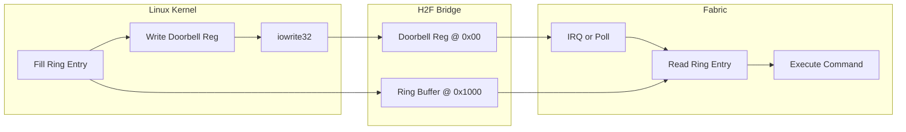
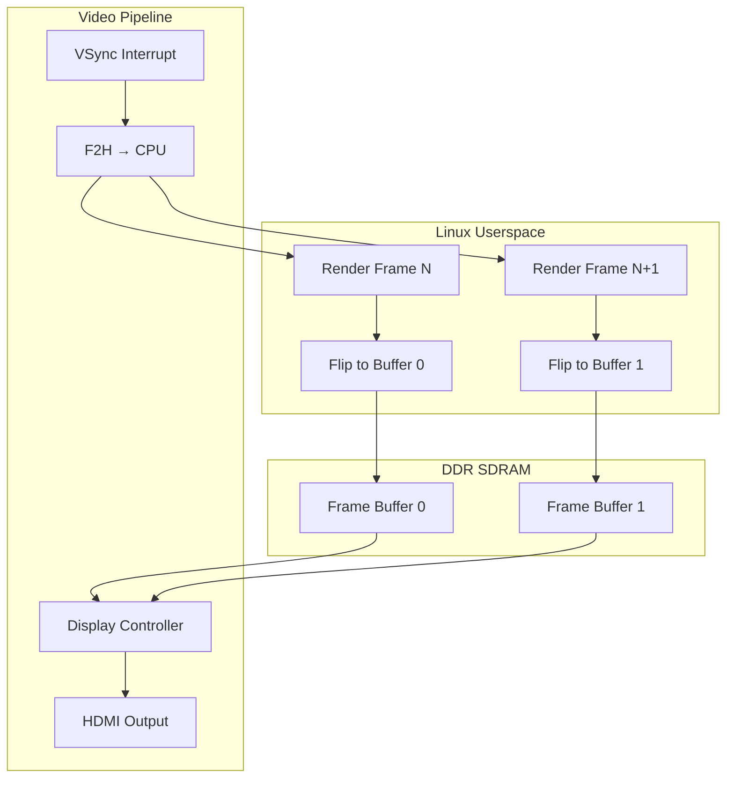
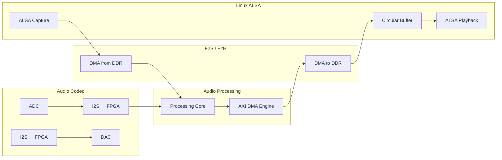
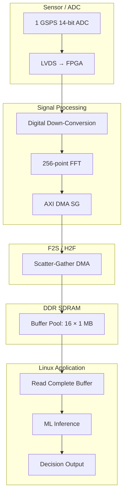
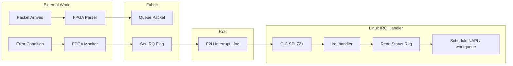
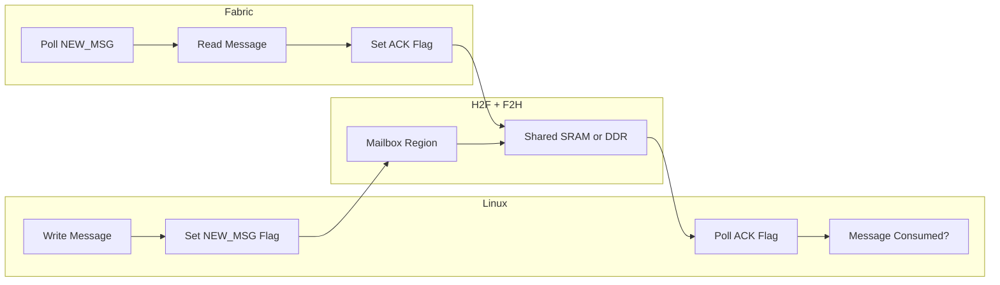

[← SoC Home](README.md) · [← Section Home](../README.md) · [← Project Home](../../README.md)

# Intel SoC FPGA — HPS-FPGA Bridge Architecture

How the Intel Hard Processor System (HPS) communicates with FPGA fabric across Cyclone V SoC, Arria 10 SoC, Stratix 10 SoC, Agilex 5 SoC, and Agilex 7 SoC families. Covers bridge topology, memory maps, bandwidth budgets, and the fundamental non-coherency model that defines Intel's approach.

---

## The Intel Bridge Model: Four Bridges, No Coherency

Intel SoC FPGAs use a fixed set of AXI bridges between the HPS and FPGA fabric. Unlike Xilinx Zynq, **there is no cache coherency** — FPGA masters bypass the CPU L2 cache entirely when accessing DDR.

```
                    ┌─────────────────────────────────────┐
                    │         Intel HPS Subsystem         │
                    │  ┌─────────┐    ┌───────────────┐   │
                    │  │ Dual/   │    │   L2 Cache    │   │
                    │  │ Quad    │◄──►│  (512K-1MB)   │   │
                    │  │ Cortex  │    └───────┬───────┘   │
                    │  │ -A9/A53 │            │           │
                    │  └────┬────┘            │           │
                    │       │                 │           │
                    │  ┌────▼─────────────────▼────┐      │
                    │  │   L3 Interconnect (NIC)   │      │
                    │  │    ARM NIC-301 / CoreLink │      │
                    │  └────┬──────────┬─────┬─────┘      │
                    │       │          │     │            │
                    └───────┼──────────┼─────┼────────────┘
                            │          │     │
              ┌─────────────┼──────────┼─────┼─────────────┐
              │             ▼          ▼     ▼             │
              │  FPGA Fabric ───────────────────────────── │
              │                                            │
              │   ┌─────┐  ┌─────┐  ┌─────┐  ┌──────────┐  │
              │   │H2F  │  │LWH2F│  │F2H  │  │  F2S     │  │
              │   │64-b │  │32-b │  │64-b │  │6× cmd    │  │
              │   │AXI  │  │AXI  │  │AXI  │  │4R/4W data│  │
              │   └─────┘  └─────┘  └─────┘  └──────────┘  │
              │                                            │
              └────────────────────────────────────────────┘
```

**Key architectural principle:** The HPS and FPGA fabric are **independent clock domains**. The bridges contain asynchronous FIFOs that tolerate large frequency mismatches (e.g., HPS at 800 MHz, FPGA at 150 MHz for a retro-computing core). This is why Intel SoCs are popular for MiSTer and other FPGA-computing projects — the CPU and fabric clocks are decoupled.

---

## Bridge Inventory by Family

| Bridge | Direction | Width | Protocol | Cyclone V / Arria 10 | Stratix 10 | Agilex 5 / 7 |
|---|---|---|---|---|---|---|
| **H2F** | HPS → FPGA | 64-bit | AXI-3 | ✓ | ✓ AXI-4 | ✓ AXI-4 |
| **LWH2F** | HPS → FPGA | 32-bit | AXI-3 | ✓ | ✓ AXI-4 | ✓ AXI-4 |
| **F2H** | FPGA → HPS | 64-bit | AXI-3 | ✓ | ✓ AXI-4 | ✓ AXI-4 |
| **F2S** | FPGA → DDR | 16-256 bit | AXI-3 | 6 cmd + 4R/4W | — | — |

> **Note:** Stratix 10 and Agilex families do **not** expose dedicated F2S ports. Instead, the FPGA fabric accesses DDR through the HPS SDRAM scheduler via the F2H bridge or through a dedicated FPGA DDR controller (hard memory controller in the fabric). The F2S bridge is unique to Cyclone V and Arria 10 SoC.

### Bridge Bandwidth Summary (Cyclone V SoC @ Typical Clocks)

| Bridge | Width | Clock | Theoretical | Realistic (Linux) | Realistic (Bare-metal) | Bottleneck |
|---|---|---|---|---|---|---|
| **H2F** | 64-bit | 400 MHz | 3.2 GB/s | ~45-100 MB/s | ~800 MB/s | Linux memcpy overhead, bridge arbitration |
| **LWH2F** | 32-bit | 400 MHz | 1.6 GB/s | ~10-20 MB/s | ~200 MB/s | Single-beat only, no burst aggregation |
| **F2H** | 64-bit | 400 MHz | 3.2 GB/s | ~50-120 MB/s | ~900 MB/s | NIC-301 arbitration, DDR contention |
| **F2S** | 64-bit | 400 MHz | 3.2 GB/s per port | ~300 MB/s per port | ~2.0 GB/s per port | DDR controller, 6-port arbitration |

> **Why the Linux-to-realistic gap?** The HPS runs Linux with virtual memory, cache coherency management, and generic memcpy. A 65 KB `memcpy` from userspace through `/dev/mem` mmap measures ~45 MB/s (forum-reported). Bare-metal code with custom burst loops achieves 5-10× higher throughput. For production, use `dma_alloc_coherent()` buffers and kernel-space transfer routines.

### AXI-3 vs AXI-4: The WID Problem

Cyclone V and Arria 10 use AXI-3, which includes the **WID** signal for write interleaving. AXI-4 (Stratix 10, Agilex) removes WID and relies on in-order write data. If you connect third-party AXI-4 IP to a Cyclone V H2F bridge:

1. The IP expects no WID and sends write data in AWID order
2. The bridge still accepts WID but the IP doesn't drive it
3. **Result:** Write reordering bugs, data corruption in burst writes

**Fix:** Insert an AXI-4 to AXI-3 protocol converter (available in Intel Platform Designer / Qsys) between the IP and the bridge.

---

## H2F — HPS-to-FPGA Bridge

The primary control path. The Linux kernel, U-Boot, or bare-metal code on the HPS uses this bridge to read/write registers in the FPGA fabric.

### Properties

| Property | Value |
|---|---|
| Data width | 64-bit |
| Address width | 32-bit (4 GB space) |
| Protocol | AXI-3 (CV/Arria 10), AXI-4 (Stratix 10/Agilex) |
| Clock | HPS clock (async FIFO to fabric) |
| Burst support | Up to 16 beats |
| Typical use | MMIO register banks, on-chip RAM, DMA descriptors |

### Memory Map (Cyclone V SoC Example)

The H2F bridge is mapped into the HPS address space at a fixed base address. FPGA peripherals appear as memory-mapped devices:

```
HPS Address Space (Cyclone V):
0x0000_0000 ──► 0xBFFF_FFFF   DDR SDRAM (3 GB)
0xC000_0000 ──► 0xCFFF_FFFF   On-chip RAM (256 KB)
0xFC00_0000 ──► 0xFFFF_FFFF   HPS peripherals (L3, timers, UART)

H2F Windows:
0xC000_0000 ──► 0xC003_FFFF   LWH2F (lightweight, 256 KB)
0xC000_0000 ──► 0xDFFF_FFFF   H2F (960 MB window)
```

In Linux, these regions appear under `/sys/class/fpga_manager/` or are mmap'd via `/dev/mem`. Device trees for Intel SoC declare the `hps_0_bridges` node with `ranges` that map H2F/LWH2F windows.

### Linux Access Example

```c
// mmap the H2F bridge region (simplified)
int fd = open("/dev/mem", O_RDWR | O_SYNC);
volatile uint32_t *fpga_regs = mmap(NULL, 0x10000,
    PROT_READ | PROT_WRITE, MAP_SHARED, fd, 0xC0000000);

// Write to a custom peripheral at offset 0x1000
fpga_regs[0x1000 / 4] = 0xDEADBEEF;

// Read back status
uint32_t status = fpga_regs[0x1004 / 4];
```

> **Best practice:** Use UIO (Userspace I/O) kernel driver instead of `/dev/mem` for production. UIO maps the bridge window through a proper device node and handles interrupts.

---

## LWH2F — Lightweight HPS-to-FPGA Bridge

A 32-bit, lower-latency version of H2F optimized for small control transactions.

### Why It Exists

The full H2F bridge has deep FIFOs and wide datapaths optimized for burst DMA. For simple register peeks and pokes (e.g., toggling an LED, checking a FIFO empty flag), this adds unnecessary latency. LWH2F is **cut-through** — transactions propagate faster because the bridge logic is simpler.

| Property | LWH2F | H2F |
|---|---|---|
| Data width | 32-bit | 64-bit |
| Burst support | Single beat only | Up to 16 beats |
| Latency | ~3-4 cycles | ~6-10 cycles |
| Address space | 2 MB | 960 MB |
| Use case | GPIO, simple control regs | DMA, framebuffers, bulk data |

### L3 Interconnect Routing (Not Point-to-Point)

The LWH2F is **not** a direct wire from the CPU to the FPGA. The CPU's AXI master connects to an **L3 interconnect** (bus matrix), and the LWH2F is a **slave port** on that matrix:

```
CPU (AXI master)
    │
    ▼
L3 Interconnect ──► LWH2F slave port ──► FPGA fabric
    │
    ├──► H2F slave port ──► FPGA fabric
    ├──► DDR controller
    └──► Peripherals (UART, USB, DMA, etc.)
```

| Family | L3 Interconnect | Notes |
|---|---|---|
| **Cyclone V / Arria V** | ARM CoreLink NIC-301 | Single-ported switch; CPU transactions serialized |
| **Arria 10** | Arteris FlexNoC | Higher bandwidth, lower latency than NIC-301 |
| **Stratix 10** | Netspeed Gemini | Integrated with CCU for coherency routing |
| **Agilex 7** | Arteris Ncore2 | Supports QoS and multiple simultaneous transactions |
| **Agilex 5** | Arteris Ncore3 | CHI-B protocol; cache stashing from F2H bridge |

**Implications:**
- LWH2F transactions **share arbitration** with DMA, DDR, and peripheral traffic on the L3 interconnect
- On Cyclone V's NIC-301, the CPU's AXI master is a single port — H2F and LWH2F transactions from the same CPU core are serialized by the interconnect
- The "lightweight" in LWH2F refers to its **narrow 32-bit datapath** and **smaller FIFOs**, not a separate physical path bypassing the L3 interconnect

### MiSTer Example: LWH2F for SPI Control Register

MiSTer (DE10-Nano, Cyclone V SoC) uses the LWH2F bridge for all HPS→FPGA control plane traffic, including the SPI interface that loads ROMs and handles SD card I/O:

```verilog
// MiSTer hps_io module — simplified SPI register interface
// Connected to LWH2F (32-bit Avalon-MM slave)

module mister_spi_ctrl (
    input         clk,
    input         reset,
    // LWH2F interface (from HPS Linux)
    input  [7:0]  avs_address,      // 256 x 32-bit registers
    input         avs_read,
    output [31:0] avs_readdata,
    input         avs_write,
    input  [31:0] avs_writedata,
    output        avs_waitrequest,
    // SPI output to FPGA core
    output [31:0] spi_w,            // 32-bit SPI write data
    input  [31:0] spi_r,            // 32-bit SPI read data
    output        spi_stb           // SPI transaction strobe
);
    reg [31:0] regs [0:255];

    // Address 0x00: SPI write data register
    // Address 0x01: SPI read data register
    // Address 0x02: SPI control/status

    always @(posedge clk) begin
        if (avs_write) regs[avs_address] <= avs_writedata;
    end

    assign spi_w       = regs[8'h00];
    assign spi_stb     = avs_write && (avs_address == 8'h02);
    assign avs_readdata = (avs_address == 8'h01) ? spi_r : regs[avs_address];
    assign avs_waitrequest = 1'b0;
endmodule
```

The LWH2F bridge is ideal here because:
- SPI transactions are small (1-4 bytes payload + control)
- Low latency matters for interactive ROM loading
- Single-beat-only is fine — SPI is inherently byte-serial

**Physical path:** Linux userspace → `/dev/mem` mmap → H2F/LWH2F bridge → `hps_io` → `spi_w/spi_r` registers → FPGA SPI core → SD card

### Typical RTL Connection

```verilog
// In Platform Designer, LWH2F appears as an Avalon-MM or AXI master
// Connect to a simple register bank:

module ctrl_regs (
    input         clk,
    input         reset,
    // LWH2F interface (Avalon-MM slave)
    input  [15:0] avs_address,
    input         avs_read,
    output [31:0] avs_readdata,
    input         avs_write,
    input  [31:0] avs_writedata,
    output        avs_waitrequest
);
    reg [31:0] regs [0:15];
    assign avs_readdata = regs[avs_address[5:2]];
    always @(posedge clk) begin
        if (avs_write) regs[avs_address[5:2]] <= avs_writedata;
    end
    assign avs_waitrequest = 1'b0; // Combinatorial response
endmodule
```

---

## F2H — FPGA-to-HPS Bridge

The reverse path: FPGA logic acts as AXI master, the HPS acts as slave. This lets the FPGA push data into HPS memory or interrupt the CPU.

### Properties

| Property | Value |
|---|---|
| Data width | 64-bit |
| Address width | 32-bit |
| Target | HPS DDR (via L3), on-chip RAM, HPS peripherals |
| Protocol | AXI-3 / AXI-4 |

### Typical Use Cases

1. **DMA completion notification:** FPGA DMA engine writes a completion flag into HPS DDR
2. **Mailbox / command queue:** FPGA writes command structures that the HPS polls
3. **Interrupt generation:** Write to the HPS GIC (Generic Interrupt Controller) distributor via memory-mapped access

### Address Translation

When the FPGA issues an AXI transaction through F2H, the bridge forwards it to the HPS L3 interconnect. The address is decoded by the NIC-301 to route to DDR, on-chip RAM, or peripherals. **No address translation occurs** — the FPGA must use HPS physical addresses. If Linux is running with virtual memory, the FPGA cannot directly access userspace buffers unless they are pinned and the physical address is passed to the FPGA.

```
FPGA AXI Master ──► F2H Bridge ──► NIC-301 ──► DDR Controller
         │                            │
         │    Physical address        │
         │    (no MMU in path)        │
         ▼                            ▼
   Must use HPS-                   Linux kernel
   visible phys addr               manages page tables
```

---

## F2S — FPGA-to-SDRAM (Cyclone V / Arria 10 Only)

The highest-bandwidth path. Six independent command ports with configurable read/write data widths give the FPGA direct access to external DDR without involving the HPS CPU complex.

### Architecture

```
FPGA Fabric
    │
    ├──► F2S Port 0 ──┐
    ├──► F2S Port 1   │
    ├──► F2S Port 2   ├──► SDRAM Scheduler ──► DDR Controller ──► DDR3/4
    ├──► F2S Port 3   │    (arbitrates 6:1)
    ├──► F2S Port 4   │
    └──► F2S Port 5 ──┘
```

| Parameter | Value |
|---|---|
| Command ports | 6 (independent read/write command channels) |
| Read data ports | 4 (64-bit each, configurable) |
| Write data ports | 4 (64-bit each, configurable) |
| Data width | 16, 32, 64, 128, or 256 bits per port |
| Clock | Fabric clock (async to HPS) |

### Bandwidth Math

At 64-bit width × 400 MHz DDR clock (Cyclone V typical):
- Peak per-port: 64 × 400M = 25.6 Gb/s = 3.2 GB/s (theoretical)
- With 6 ports: ~19.2 GB/s aggregate theoretical
- Realistic (70% efficiency): ~13.4 GB/s

This exceeds the DDR3-800 bandwidth (~6.4 GB/s for 16-bit interface, ~12.8 GB/s for 32-bit). **The F2S ports are over-provisioned** — the bottleneck is the DDR controller, not the bridges.

### The Starvation Problem

The SDRAM scheduler arbitrates between F2S ports and the HPS L3 with **no QoS**. A greedy FPGA DMA loop on one F2S port can starve the Linux kernel of DDR bandwidth, causing watchdog timeouts or audio dropouts.

**Mitigation strategies:**
1. **Rate-limit FPGA bursts:** Insert FIFOs in the FPGA that accumulate data, then burst at controlled intervals
2. **Use on-chip RAM as buffer:** Stage data in FPGA BRAM, then transfer to DDR in large bursts during CPU idle periods
3. **Reduce F2S port count:** Use fewer ports at higher width rather than many narrow ports

---

## NIC-301 Interconnect

The ARM CoreLink NIC-301 is the L3 crossbar inside the HPS. It routes transactions between CPU cores, DMA, bridges, DDR, and peripherals.

### Master Ports (Initiators)

| Master | Description |
|---|---|
| CPU0 / CPU1 | Cortex-A9 cores (or A53 on Stratix 10) |
| DMAC | DMA controller (8 channels) |
| H2F / LWH2F | HPS-to-FPGA bridges |

### Slave Ports (Targets)

| Slave | Description |
|---|---|
| DDR | SDRAM controller |
| OCRAM | On-chip RAM (64-256 KB) |
| F2H | FPGA-to-HPS bridge slave |
| Peripherals | UART, SPI, timers, etc. |
| STM | System Trace Macrocell |

### Arbitration

NIC-301 uses round-robin arbitration by default. There is **no programmable QoS** on Cyclone V — you cannot prioritize CPU transactions over FPGA transactions. Stratix 10 and Agilex upgrade to a more advanced interconnect with QoS support.

---

## Memory Map: HPS-FPGA Address Space

### Cyclone V SoC

| Region | HPS Address | Size | Description |
|---|---|---|---|
| SDRAM | 0x0000_0000 | 3 GB | DDR3 via hard controller |
| FPGA slaves (H2F) | 0xC000_0000 | 960 MB | FPGA Avalon-MM/AXI slaves |
| FPGA slaves (LWH2F) | 0xFF20_0000 | 2 MB | Lightweight control |
| HPS peripherals | 0xFC00_0000 | 64 MB | UART, timers, GPIO |
| Boot ROM | 0xFFFF_0000 | 64 KB | On-chip boot ROM |

### Agilex 7 SoC

Agilex uses a newer address map with larger windows and NoC integration:

| Region | HPS Address | Size | Description |
|---|---|---|---|
| SDRAM | 0x0000_0000 | 64 GB | DDR4/5 via hard controller |
| FPGA fabric (H2F) | 0x4000_0000_0000 | 512 GB | 64-bit addressing to fabric |
| PCIe | 0x1000_0000_0000 | 1 TB | PCIe root complex |
| HPS peripherals | 0xF900_0000 | 128 MB | Peripheral region |

The shift to 64-bit addressing in Agilex allows the HPS to address much larger FPGA fabric and external PCIe spaces.

---

## ACP on Intel SoC: Cyclone V / Arria 10 Only

Intel SoC FPGAs have a nuanced coherency story that depends entirely on the CPU generation:

| Family | CPU | Has ACP? | Coherency Path |
|---|---|---|---|
| **Cyclone V SoC** | Dual Cortex-A9 | ✅ Yes | F2H bridge → ACP ID mapper → SCU → L1/L2 |
| **Arria 10 SoC** | Dual Cortex-A9 | ✅ Yes | F2H bridge → ACP in MPCore + L3 interconnect |
| **Stratix 10 SoC** | Quad Cortex-A53 | ❌ No ACP | CCU (Netspeed Gemini) via ACE-Lite on F2H |
| **Agilex 7 SoC** | Quad Cortex-A53 | ❌ No ACP | CCU (Arteris Ncore2) via ACE-Lite on F2H |
| **Agilex 5 SoC** | A76 + A55 | ❌ No ACP | CCU (Arteris Ncore3) via ACE5-Lite/CHI-B on F2H |

**The rule:** Only the ARM Cortex-A9-based Intel SoCs (Cyclone V, Arria 10) expose an ACP to the FPGA fabric. Newer Intel SoCs with Cortex-A53/A76/A55 replace ACP with a **Cache Coherency Unit (CCU)** that uses ACE-Lite/ACE5-Lite/CHI-B protocol on the F2H bridge — hardware coherency is still available, just through a different mechanism.

### How Cyclone V / Arria 10 ACP Works

The FPGA accesses the ACP not through a dedicated port, but through the **F2H bridge + ACP mapper**:

```
FPGA Fabric
    │
    ▼
F2H Bridge ──► ACP Mapper ──► SCU (Snoop Control Unit) ──► L1/L2 Cache
                  │
                  └──► Translates F2H AXI transactions to ACP protocol
```

When FPGA logic issues a read/write through the F2H bridge with ACP attributes:
1. The ACP mapper translates the AXI transaction to ACP protocol
2. The SCU checks CPU0/CPU1 L1 caches for the requested address
3. If dirty in L1, data is forwarded from L1 (with possible eviction to L2)
4. If clean or absent, L2 or DDR provides the data
5. Cache state is updated atomically — the FPGA sees coherent data

### Enabling ACP Access

The ACP mapper is enabled through the `L2 Cache Controller` registers in the HPS. In Platform Designer, the F2H bridge has a configuration option to mark transactions as ACP (via the `AxCACHE` and `AxUSER` signals). Not all F2H transactions are ACP — only those explicitly configured.

### ACP vs F2S: When to Use What

| Scenario | Use | Why |
|---|---|---|
| Small shared data structures (< 1 MB) | F2H → ACP | Hardware coherency, no software flush/inv |
| Bulk streaming (video, DMA, signal proc) | F2S | Higher bandwidth, cache is irrelevant |
| FPGA needs CPU memory without coherency | F2S or F2H (non-ACP) | Bypass cache entirely |
| Linux userspace shared buffers | F2H → ACP | No `dma_sync_*` calls needed |

### Why Stratix 10 / Agilex Have No ACP (But Still Have Coherency)

ARM replaced the SCU+ACP architecture with **CoreLink CCI/CMN** (Cache Coherent Interconnect/NoC) starting with Cortex-A53. CCI uses a distributed coherency protocol (ACE/ACE-Lite/CHI) rather than a central snoop port. Intel's newer SoCs implement this through a **Cache Coherency Unit (CCU)**:

| Family | CCU IP | Protocol | Coherency Path |
|---|---|---|---|
| **Stratix 10** | Netspeed Gemini | ACE-Lite | FPGA → F2H bridge → CCU → A53 L1/L2 |
| **Agilex 7** | Arteris Ncore2 | ACE-Lite | FPGA → F2H bridge → CCU → A53 L1/L2 |
| **Agilex 5** | Arteris Ncore3 | ACE5-Lite/CHI-B | FPGA → F2H bridge → CCU → A76/A55 L1/L2/L3 |

**Key difference from ACP:** On Stratix 10 / Agilex, the FPGA master performs **cacheable accesses through the CCU** using ACE-Lite signaling on the F2H bridge (configured via `AxUSER`). The CCU maintains coherency with CPU caches automatically — no software flush/invalidate is needed for cacheable transactions. However, the CCU is not an ACP port; it is a full coherency interconnect that happens to accept FPGA-initiated coherent transactions.

**Practical implication:** For small coherent buffers (< 1 MB, per Intel guideline), configure the F2H bridge for ACE-Lite cacheable access. For larger buffers or streaming data, use non-cacheable F2S access to avoid cache thrashing.

## Cache Coherency: Two Different Architectures

Intel SoC FPGAs have **two distinct coherency architectures** depending on the CPU generation:

1. **ACP-based (Cyclone V, Arria 10):** Hardware coherency through the Accelerator Coherency Port. The FPGA accesses CPU caches via F2H → ACP mapper → SCU.
2. **CCU-based (Stratix 10, Agilex 5/7):** Hardware coherency through the Cache Coherency Unit. The FPGA accesses CPU caches via F2H → CCU using ACE-Lite/ACE5-Lite/CHI-B protocol.

**All Intel SoC families offer hardware cache coherency.** The difference is the mechanism — ACP on Cortex-A9, CCU on Cortex-A53/A76/A55. This contrasts with Xilinx, where ACP (and HPC on MPSoC) is available across all Zynq families using the same port name.

### What This Means

When the FPGA writes data to DDR via F2S:
1. Data goes directly to DDR, bypassing the CPU L2 cache
2. If the CPU recently read that address, the L2 cache holds a stale copy
3. The CPU reads stale data from cache instead of fresh data from DDR

### Software Workaround: Cache Maintenance

Linux provides the `dma_sync_*` API and `flush_cache_all()` for explicit cache management:

```c
// HPS prepares a buffer for FPGA processing
void *buffer = dma_alloc_coherent(dev, size, &dma_handle, GFP_KERNEL);

// HPS writes commands to buffer
strcpy(buffer, "process_this");

// CRITICAL: Flush CPU cache so FPGA sees the data
__cpuc_flush_dcache_area(buffer, size);
outer_flush_range(__pa(buffer), __pa(buffer) + size);

// Trigger FPGA via H2F register
iowrite32(1, fpga_cmd_reg);

// Wait for FPGA done interrupt
wait_for_completion(&fpga_done);

// CRITICAL: Invalidate CPU cache before reading results
__cpuc_flush_dcache_area(buffer, size);
outer_inv_range(__pa(buffer), __pa(buffer) + size);

// Now safe to read results
printk("Result: %s\n", (char *)buffer);
```

> **Note:** `dma_alloc_coherent()` on Intel SoC allocates **non-cacheable** memory by default. If you use this, no flush/invalidate is needed — but CPU access to the buffer is slower.

---

## Platform Designer / Qsys Integration

Intel's system integration tool (formerly Qsys, now Platform Designer in Quartus Prime) generates the interconnect fabric between HPS bridges and your custom IP.

### Typical System Layout

```
┌───────────────────────────────────────────┐
│         Platform Designer System          │
│                                           │
│  ┌─────────┐      ┌────────────────────┐  │
│  │  HPS    │──────► AXI Interconnect   │  │
│  │  IP     │      │  (auto-generated)  │  │
│  │         │◄─────│                    │  │
│  └─────────┘      └──┬─────┬─────┬─────┘  │
│                      │     │     │        │
│                   ┌──▼──┐ ┌▼───┐ ┌▼────┐  │
│                   │DMA  │ │UART│ │Video│  │
│                   │Eng  │ │    │ │Proc │  │
│                   └─────┘ └────┘ └─────┘  │
│                                           │
└───────────────────────────────────────────┘
```

When you instantiate the `cyclone5_hps` or `agilex_hps` IP, Platform Designer automatically exposes the bridge interfaces. You connect your custom IP to the `h2f` and `f2h` Avalon-MM/AXI interfaces. The tool generates the arbitration, address decoding, and clock-crossing logic.

### Clock Domains

| Domain | Typical Frequency | Source |
|---|---|---|
| HPS CPU | 800-925 MHz (CV), 1.2 GHz (S10), 1.5 GHz (Agilex 7) | HPS PLL |
| HPS buses | 400 MHz | Derived from CPU clock |
| FPGA fabric | 50-400 MHz | Fabric PLLs |
| DDR | 400-800 MHz (800-1600 MT/s) | DDR PLL |

Bridge FIFOs handle the asynchronous crossing. Platform Designer inserts `altclkctrl` and `altera_avalon_mm_clock_crossing_bridge` automatically.

---

## Interaction Patterns: Real-World Workflows

### Pattern 1: Doorbell + Ring Buffer (Low-Latency Control)

The most common pattern for CPU→FPGA command streaming. Used in software-defined radio, motor control, and network packet processing.



**Workflow:**
1. CPU fills command entry in FPGA ring buffer (H2F bridge, 64-bit AXI)
2. CPU writes doorbell register — triggers FPGA action
3. FPGA either polls doorbell or receives interrupt (via F2H)
4. FPGA reads command from ring buffer, executes, optionally writes response

**Latency:** ~200 ns doorbell → FPGA action (H2F bridge + fabric routing)

**Best bridge:** H2F (64-bit) for ring buffer, LWH2F (32-bit) for doorbell if only toggling a flag

---

### Pattern 2: Ping-Pong Frame Buffer (Video / Display)

Standard for video pipelines where CPU generates UI overlays and FPGA drives the display controller.



**Workflow:**
1. CPU renders frame N into frame buffer 0 via H2F bridge (or direct DDR mmap)
2. FPGA display controller scans out frame buffer 1 (previous frame)
3. At VSync, FPGA fires interrupt (F2H → GIC → Linux IRQ)
4. CPU atomically flips pointer — FPGA now reads buffer 0, CPU renders into buffer 1

**Key constraint:** FPGA read must never stall. Use F2S bridge (Cyclone V) or dedicated FPGA DDR controller to guarantee bandwidth.

**Buffer sizing:** 1920×1080 @ 32bpp = 8.3 MB per frame. Triple buffering adds one more buffer for GPU/CPU composition safety.

---

### Pattern 3: Cyclic Audio DMA (Low-Latency Streaming)

Real-time audio requires <10 ms round-trip latency. Used in guitar effects, software synthesizers, and professional audio interfaces.



**Workflow:**
1. FPGA receives I2S audio samples, processes through DSP pipeline
2. AXI DMA engine (in FPGA) moves processed samples to DDR via F2S or F2H bridge
3. Linux ALSA driver reads from circular DMA buffer, delivers to userspace
4. Reverse path: userspace → ALSA → DDR → DMA → FPGA → DAC

**Latency budget:**
- FPGA processing: 1-2 samples (<50 µs @ 48 kHz)
- DMA transfer: 64 samples buffer = 1.3 ms
- Linux ALSA buffer: 128-256 samples = 2.7-5.3 ms
- **Total round-trip:** ~5-10 ms

**Critical:** Use cyclic DMA (`dmaengine_prep_dma_cyclic`) with period sizes of 64-128 samples. Never use userspace mmap for audio — ALSA kernel driver handles DMA directly.

---

### Pattern 4: Bulk Data Ingest (Signal Processing / ML)

High-bandwidth data capture from ADCs or sensors, processed by FPGA then consumed by CPU.



**Workflow:**
1. FPGA receives high-speed raw ADC samples (e.g., 1 GSPS @ 14-bit = 1.75 GB/s)
2. FPGA DSP chain decimates and processes (DDC + FFT reduces to ~100 MB/s)
3. AXI DMA with scatter-gather moves completed buffers to DDR via F2S
4. CPU processes full buffers via `dma_mmap_coherent()` or `read()` from character device

**Bridge choice:** F2S (Cyclone V) for highest bandwidth, bypassing CPU cache. On Stratix 10/Agilex, use dedicated FPGA DDR controller.

---

### Pattern 5: FPGA-Initiated Interrupt (Event Notification)

FPGA detects external events (packet arrival, threshold crossing, error condition) and notifies CPU.



**Workflow:**
1. FPGA detects event, sets flag in F2H-accessible status register
2. FPGA asserts interrupt line (wired to GIC SPI 72-143 on Cyclone V)
3. Linux IRQ handler reads status register via F2H bridge, determines event type
4. Handler schedules deferred processing (NAPI for networking, workqueue for general)
5. FPGA de-asserts interrupt when acknowledged

**Latency:**
- FPGA → GIC: ~20 ns (on-chip routing)
- GIC → CPU: ~50 ns (interrupt entry)
- Linux handler dispatch: 2-5 µs
- **Total:** ~3-10 µs (dominated by Linux overhead)

---

### Pattern 6: Shared Memory Mailbox (Short Messages)

For sub-microsecond latency control where interrupts are too slow. CPU and FPGA poll a shared flag.



**Workflow:**
1. CPU writes 32-64 byte message to mailbox (H2F bridge)
2. CPU sets NEW_MSG flag in shared register
3. FPGA polls flag (every clock cycle), reads message
4. FPGA processes, sets ACK flag
5. CPU sees ACK, writes next message

**Latency:** ~100-300 ns per message (limited by bridge round-trip and FPGA polling)

**Best for:** Motor control PWM updates, real-time PID setpoint changes, radio frequency hopping.

## Per-Family Comparison

| Feature | Cyclone V SoC | Arria 10 SoC | Stratix 10 SoC | Agilex 7 SoC | Agilex 5 SoC |
|---|---|---|---|---|---|
| CPU | Dual A9 | Dual A9 @ 1.2 GHz | Quad A53 | Quad A53 | Dual A76 + Dual A55 |
| CPU arch | ARMv7 | ARMv7 | ARMv8 | ARMv8 | ARMv8.2 |
| Max DDR | 4 GB DDR3 | 8 GB DDR3/4 | 64 GB DDR4 | 128 GB DDR4/5 | 64 GB DDR4/5/LPDDR5 |
| H2F width | 64-bit AXI-3 | 64-bit AXI-3 | 64-bit AXI-4 | 64-bit AXI-4 | 64-bit AXI-4 |
| F2S ports | 6 | 6 | None | None | None |
| FPGA DDR ctrl | No | No | Yes (hard) | Yes (hard) | Yes (hard) |
| Coherency | None | None | None | None | None |
| Interconnect | NIC-301 | NIC-301 | CoreLink CCN | NoC + AXI | NoC + AXI |
| PCIe | Gen2 x4 | Gen3 x8 | Gen3 x16 | Gen5 x16 | Gen4 x8 |

---

## Common Pitfalls

| Problem | Symptom | Fix |
|---|---|---|
| AXI-4 IP on AXI-3 bridge | Write data corruption | Insert protocol converter in Platform Designer |
| Cache stale data | FPGA results invisible to CPU | Use `dma_alloc_coherent()` or explicit flush/inv |
| F2S starvation | Linux watchdog reboots | Rate-limit FPGA DMA bursts, use BRAM buffers |
| LWH2F burst access | Bus hang, timeout | LWH2F only supports single-beat transactions |
| Wrong physical address | FPGA writes to wrong DDR region | Pass `dma_handle` (bus address) to FPGA, not CPU virtual addr |
| HPS not released from reset | FPGA configured but bridges dead | U-Boot must run `bridge_enable_handoff` before Linux boots |

---


## Reference Development Boards

### Cyclone V SoC Boards

| Board | Vendor | Price | Key Features | Best For | Status |
|---|---|---|---|---|---|
| **DE10-Nano** | Terasic | $225 ($190 academic) | HDMI, Ethernet, Arduino headers, 1 GB DDR3 | Education, MiSTer, hobbyists | Active |
| **DE1-SoC** | Terasic | $377 ($322 academic) | VGA, video-in, audio codec, 1 GB DDR3 | University courses, OpenCL | Active |
| **SoCKit** | Arrow / Terasic | — | HSMC expansion, 2 GB DDR3, audio codec | Prototyping, high-speed IO | **Phased out** |
| **Atlas-SoC** | Terasic | — | Dual Ethernet, VGA, PCIe x4 | Networking, vision | **Phased out** |
| **Chameleon96** | NovTech / 96Boards | — | 96Boards CE form factor, WiFi/BT | IoT, embedded Linux | **Discontinued** |

> **MiSTer note:** The DE10-Nano is the official MiSTer platform. Its LWH2F bridge + on-chip RAM configuration is the reference implementation for FPGA retro-computing projects.
>
> **Current as of:** 2026-04 (verified against Terasic official store)

### Arria 10 SoC Boards

| Board | Vendor | Price | Key Features | Best For | Status |
|---|---|---|---|---|---|
| **Arria 10 SX SoC Dev Kit** | Terasic / Intel | $3,995 | 4 GB DDR4, QSFP+, PCIe Gen3 x8 | High-speed comms, 5G baseband | Active |
| **Hitek Systems A10SoC** | Hitek Systems | Contact | Custom form factors, wide temp | Aerospace, defense | Active |

> **Current as of:** 2026-04 (verified against Terasic official store)

### Stratix 10 SoC Boards

| Board | Vendor | Price | Key Features | Best For | Status |
|---|---|---|---|---|---|
| **Stratix 10 SX SoC Dev Kit** | Terasic / Intel | $8,995 | HBM2 option, 8 GB DDR4, 2× QSFP28 | AI inference, HPC | Active |
| **Stratix 10 MX Dev Kit** | Terasic | $10,000 | HBM2 integrated, 1 GB DDR4, RLDRAM3 | HPC, AI training | Active |
| **S10 SoC Modular** | BittWare / Hitek | Contact | 3U VPX, VITA 57.1 FMC | Military, radar | Active |

> **Current as of:** 2026-04 (verified against Terasic official store)

### Agilex 7 SoC Boards

| Board | Vendor | Price | Key Features | Best For | Status |
|---|---|---|---|---|---|
| **DE10-Agilex** | Terasic | $7,288 | 2× QSFPDD, PCIe Gen4 x16, 4× DDR4 SODIMM | Education, 200G networking | Active |
| **Agilex 7 FPGA Starter Kit** | Terasic | $5,491 | QSFP28, FMC+, 2× DDR4, HPS system | Evaluation, prototyping | Active |
| **Agilex 7 F-Series Dev Kit** | Terasic | $8,495 | 2× F-Tile, transceivers, 16 GB DDR4 | High-speed IO, signal integrity | Active |
| **Agilex 7 F-Series Transceiver-SoC** | Terasic | $9,495 | P-Tile + E-Tile, ARM SoC, PCIe Gen4 x8 | SoC designs, transceiver eval | Active |
| **Agilex 7 I-Series Dev Kit** | Terasic | $9,999 | PCIe 5.0, CXL, high-speed networking | Cloud acceleration, CXL dev | Active |
| **Agilex 7 I-Series Transceiver-SoC** | Terasic | $13,995 | 4× F-Tile, ARM SoC, 400G Ethernet | NFV, 5G infrastructure | Active |
| **Agilex 7 I-Series Transceiver (6× F-Tile)** | Terasic | $15,999 | 6× F-Tile, maximum transceiver count | Telecom, highest bandwidth | Active |

> **Price note:** Intel dev kit pricing is direct from Terasic (Intel's primary board partner). Academic discounts are available through the Intel FPGA University Program — typically 30-50% off select kits. Contact Terasic or Intel FPGA sales for academic/volume pricing.
>
> **Current as of:** 2026-04 (verified against Terasic official store)

--

## Further Reading

| Document | Intel Doc ID |
|---|---|
| Cyclone V HPS TRM | 683126 |
| Arria 10 HPS TRM | 683126 (shared) |
| Stratix 10 HPS TRM | 683222 |
| Agilex 7 HPS TRM | 683567 |
| Agilex 5 HPS TRM | 814346 |
| Embedded Peripherals IP User Guide | Various |
