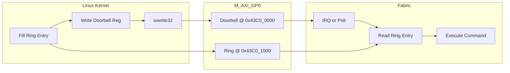
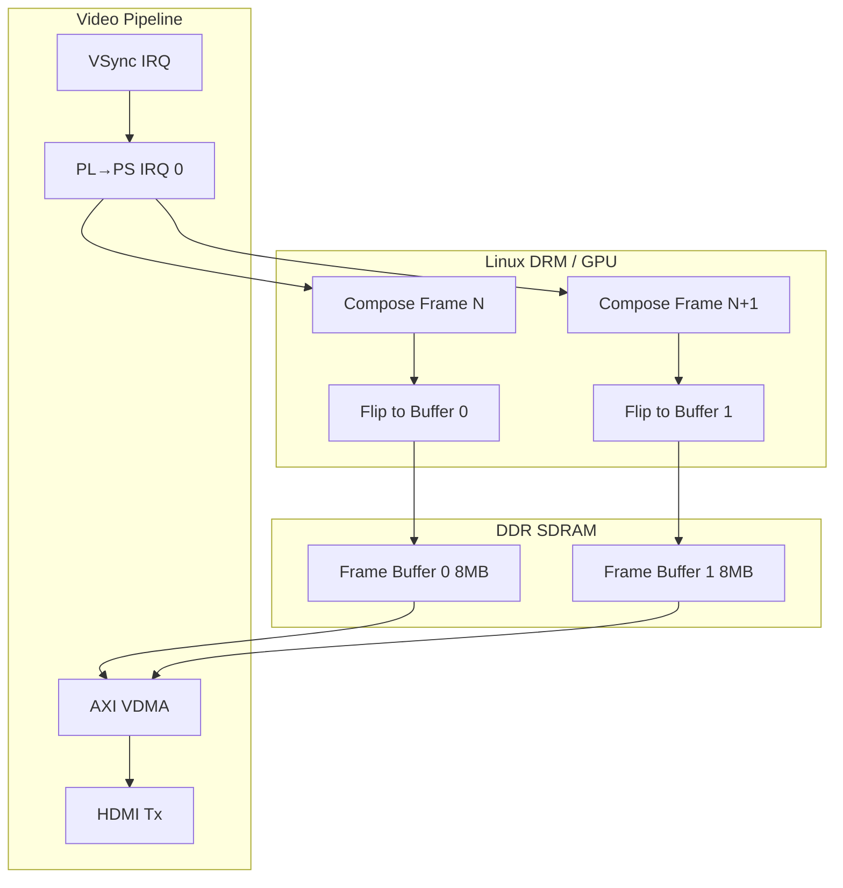
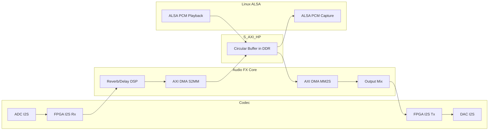
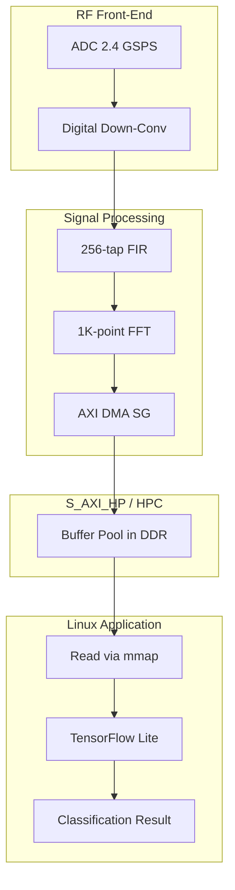
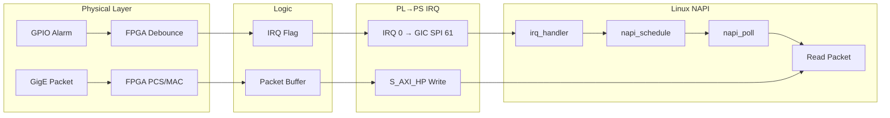
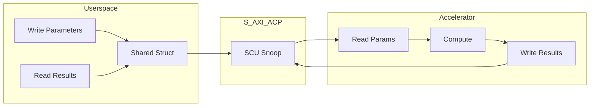

[← SoC Home](README.md) · [← Section Home](../README.md) · [← Project Home](../../README.md)

# Xilinx Zynq / MPSoC / Versal — PS-PL Interface Architecture

How the Xilinx Processing System (PS) communicates with Programmable Logic (PL) across Zynq-7000, Zynq UltraScale+ MPSoC, and Versal families. Covers the AXI port topology, the ACP coherency mechanism, CCI-400/NoC evolution, and the QoS features that distinguish Xilinx from Intel.

---

## The Xilinx PS-PL Model: Many Ports, Full Coherency Optional

Xilinx provides the richest set of PS-PL interfaces in the industry. Unlike Intel's fixed four-bridge model, Xilinx scales from 9 AXI interfaces on Zynq-7000 to a hard NoC mesh on Versal.

```
                    ┌─────────────────────────────────────┐
                    │      Xilinx Processing System       │
                    │  ┌─────────┐    ┌───────────────┐   │
                    │  │ Dual/   │    │   L2 Cache    │   │
                    │  │ Quad    │◄──►│  (SCU/CCI)    │   │
                    │  │ Cortex  │    └───────┬───────┘   │
                    │  │ -A9/A53 │            │           │
                    │  └────┬────┘            │           │
                    │       │                 │           │
                    │  ┌────▼─────────────────▼────┐      │
                    │  │  AXI Interconnect / NoC   │      │
                    │  │  (Central interconnect)   │      │
                    │  └────┬────┬────┬────┬───────┘      │
                    │       │    │    │    │              │
                    └───────┼────┼────┼────┼──────────────┘
                            │    │    │    │
        ┌───────────────────┼────┼────┼────┼───────────────────┐
        │                   ▼    ▼    ▼    ▼                   │
        │  PL (FPGA Fabric) ─────────────────────────────────  │
        │                                                      │
        │   M_AXI_GP0/1  S_AXI_HP0-3  S_AXI_HPC0/1  S_AXI_ACP  │
        │   (PS→PL ctrl) (PL→DDR HP) (PL→DDR coherent) (cache) │
        │                                                      │
        └──────────────────────────────────────────────────────┘
```

**Key architectural principle:** Xilinx offers **optional cache coherency** through the ACP (Accelerator Coherency Port) and HPC ports. The FPGA can participate in the CPU's cache coherency protocol, eliminating explicit software cache management for shared data structures.

---

## Port Inventory: Zynq-7000 vs MPSoC vs Versal

### Zynq-7000 (9 AXI Interfaces)

| Interface | Direction | Width | Purpose | M/S |
|---|---|---|---|---|
| **M_AXI_GP0** | PS → PL | 32-bit | General-purpose control | Master |
| **M_AXI_GP1** | PS → PL | 32-bit | General-purpose control | Master |
| **S_AXI_HP0** | PL → PS | 32/64-bit | High-performance to DDR/OCM | Slave |
| **S_AXI_HP1** | PL → PS | 32/64-bit | High-performance to DDR/OCM | Slave |
| **S_AXI_HP2** | PL → PS | 32/64-bit | High-performance to DDR/OCM | Slave |
| **S_AXI_HP3** | PL → PS | 32/64-bit | High-performance to DDR/OCM | Slave |
| **S_AXI_ACP** | PL ↔ PS | 64-bit | Cache-coherent access to SCU/L2 | Slave |
| **S_AXI_GP0** | PL → PS | 32-bit | General PL master to PS | Slave |
| **S_AXI_GP1** | PL → PS | 32-bit | General PL master to PS | Slave |

> **Master vs Slave terminology:** In Xilinx docs, these are named from the PS perspective. `M_AXI_GP` means the PS is the AXI master (initiator). `S_AXI_HP` means the PS is the AXI slave (target) — actually the PS interconnect receives the transaction and routes it to DDR.

### Zynq UltraScale+ MPSoC (Enhanced Interfaces)

| Interface | Direction | Width | New Feature |
|---|---|---|---|
| **M_AXI_HPM0/1** | PS → PL | 128/64/32-bit | Upgraded GP with wider paths |
| **S_AXI_HP0-HP3** | PL → PS | 128/64/32-bit | Wider than Zynq-7000 (128-bit option) |
| **S_AXI_HPC0/HPC1** | PL → PS | 128/64/32-bit | **Cache-coherent** via CCI-400 |
| **S_AXI_ACP** | PL ↔ PS | 128/64-bit | Coherent via CCI (not SCU) |
| **S_AXI_GP0-GP1** | PL → PS | 64/32-bit | General PL master access |

### Versal (NoC-Based Architecture)

Versal eliminates traditional AXI bridges and replaces them with a **hard Network-on-Chip (NoC)**:

| Feature | Versal |
|---|---|
| PS-PL connectivity | NoC NMU (NoC Master Unit) / NSU (NoC Slave Unit) |
| Coherency | CHI (Coherent Hub Interface) rather than AXI-ACE |
| Bandwidth | ~200 GB/s aggregate NoC bandwidth |
| QoS | Programmable latency/bandwidth guarantees per NMU |
| DDR access | NoC routes directly to DDR controllers |

### Interface Bandwidth Summary (All Families)

| Interface | Family | Width | Clock | Theoretical | Realistic (Linux DMA) | Realistic (Bare-metal) | Bottleneck |
|---|---|---|---|---|---|---|---|
| **M_AXI_GP0/1** | Zynq-7000 | 32-bit | 150 MHz | 600 MB/s | ~40 MB/s (mmap) | ~300 MB/s | Linux mmap overhead, narrow bus |
| **M_AXI_HPM0/1** | MPSoC | 128-bit | 333 MHz | 5.3 GB/s | ~500 MB/s (mmap) | ~2.5 GB/s | PS interconnect arbitration |
| **S_AXI_HP0-3** | Zynq-7000 | 64-bit | 150 MHz | 1.2 GB/s per port | ~600 MB/s per port | ~900 MB/s | AXI-DMA SG overhead, FIFO depth |
| **S_AXI_HP0-3** | MPSoC | 128-bit | 333 MHz | 5.3 GB/s per port | ~4.0 GB/s per port | ~5.0 GB/s | DDR controller, PS NIC-400 limit |
| **S_AXI_HPC0/1** | MPSoC | 128-bit | 333 MHz | 5.3 GB/s per port | ~3.5 GB/s per port | ~4.5 GB/s | CCI-400 snoop filter, coherency traffic |
| **S_AXI_ACP** | Zynq-7000 | 64-bit | 150 MHz | 1.2 GB/s | ~400 MB/s | ~700 MB/s | SCU snoop latency, cache line fill |
| **S_AXI_ACP** | MPSoC | 128-bit | 333 MHz | 5.3 GB/s | ~1.5 GB/s | ~3.0 GB/s | CCI-400 coherency overhead |
| **NoC NMU** | Versal | 256-bit packet | 1 GHz | ~25 GB/s per NMU | ~20 GB/s per NMU | ~23 GB/s | NoC mesh congestion, DDR scheduler |

**Key insight:** The Zynq-7000 ACP is slower than HP for bulk transfers because SCU snooping adds latency. On MPSoC, HPC ports achieve ~90% of HP bandwidth while providing full coherency — a much better tradeoff than Zynq-7000's ACP. Versal's NoC sustains the highest per-port bandwidth but requires careful NMU QoS configuration to avoid mesh hot spots.

---

## M_AXI_GP — PS Master, PL Slave

The general-purpose ports are the primary control path from the Linux kernel or bare-metal code into the FPGA fabric.

### Zynq-7000 M_AXI_GP

| Property | Value |
|---|---|
| Count | 2 (GP0, GP1) |
| Data width | 32-bit fixed |
| Address width | 32-bit |
| Protocol | AXI3 |
| Clock | 150 MHz (typical, FCLK_CLK0) |
| Burst | Up to 16 beats |
| Max throughput | ~600 MB/s per port (32×150M) |

### Typical Use Cases

- MMIO register access to custom peripherals
- FPGA configuration via PCAP (Zynq-7000) or CSU DMA (MPSoC)
- AXI GPIO, AXI UART, AXI Timer control
- Triggering DMA engines inside the PL

### Linux Device Tree Example

```dts
// In zynq-7000.dtsi or board device tree
amba_pl: amba_pl {
    #address-cells = <1>;
    #size-cells = <1>;
    compatible = "simple-bus";
    ranges;

    my_peripheral@43c00000 {
        compatible = "xlnx,my-ip-1.00.a";
        reg = <0x43c00000 0x10000>;
        interrupts = <0 29 4>;
        interrupt-parent = <&intc>;
    };
};
```

The `ranges` property maps the GP0/GP1 address windows into kernel virtual address space. U-Boot or the kernel's `zynq-fpga` driver sets up these mappings after FPGA configuration.

---

## S_AXI_HP — High-Performance PL Master to DDR

The workhorse for data-plane applications. FPGA logic acts as AXI master, reading/writing PS DDR at high bandwidth.

### Architecture

```
PL AXI Master (e.g., AXI DMA, Video DMA, custom logic)
    │
    ▼
S_AXI_HP0/1/2/3 ──► AXI FIFO Interface (AFI) ──► PS Interconnect ──► DDR Controller
    │                       │
    │                       └──► Clock domain crossing, data width conversion
    │
    └──► Supports 32/64-bit data (Zynq-7000)
         Supports 32/64/128-bit data (MPSoC)
```

### Properties (Zynq-7000)

| Property | Value |
|---|---|
| Count | 4 (HP0-HP3) |
| Data width | 32 or 64-bit (configurable per port in Vivado) |
| Address width | 32-bit (4 GB DDR space) |
| Protocol | AXI3 |
| Clock | Independent PL clock (FCLK_CLK0-3) |
| FIFO depth | 1 KB per port (read and write) |
| Burst | Up to 16 beats |

### AXI FIFO Interface (AFI)

The AFI sits between the PL and PS interconnect. It provides:
- **Clock domain crossing:** HP ports run on PL clocks (up to 250 MHz), the interconnect runs at a fixed 150-200 MHz
- **Data width conversion:** 64-bit HP → 32/64-bit interconnect
- **Outstanding transaction buffering:** Up to 16 reads + 16 writes per port

### Bandwidth (Zynq-7000)

| Configuration | Theoretical | Realistic (Linux DMA) | Realistic (Bare-metal) | Bottleneck |
|---|---|---|---|---|
| 1× HP @ 64-bit × 150 MHz | 1.2 GB/s | ~600 MB/s | ~900 MB/s | AXI-DMA overhead, FIFO depth |
| 4× HP @ 64-bit × 150 MHz | 4.8 GB/s | ~2.5 GB/s | ~3.5 GB/s | DDR controller arbitration |
| 1× GP @ 32-bit × 150 MHz | 600 MB/s | ~40 MB/s (mmap) | ~300 MB/s | Linux mmap overhead, narrow bus |
| ACP @ 64-bit × 150 MHz | 1.2 GB/s | ~400 MB/s | ~700 MB/s | SCU snoop latency, cache line fill |
| DDR3-1066 (32-bit bus) | 4.26 GB/s | ~3.0 GB/s | ~3.8 GB/s | Memory controller, DRAM timing |

**Key insight:** With 4 HP ports active, the DDR controller becomes the bottleneck — not the bridges. The ACP is slower than HP for bulk transfers because SCU snooping adds 2-3 cache-line-fill latency cycles per transaction.

**DMA burst size tuning:**
- **Optimal:** 16 beats × 64-bit = 128 bytes per burst (matches AXI-DMA default)
- **Suboptimal:** 1-4 beat bursts cause AFI FIFO thrashing and ~40% bandwidth loss
- **Maximum:** 256 beats (AXI-DMA max) only beneficial for contiguous DDR regions > 4 KB

### MPSoC HP Upgrade

MPSoC HP ports support **128-bit data width** and higher clock frequencies (up to 333 MHz):

| Configuration | Theoretical | Realistic | Notes |
|---|---|---|---|
| 1× HP @ 128-bit × 333 MHz | 5.3 GB/s | ~4.0 GB/s | AXI-DMA SG mode overhead ~20% |
| 4× HP @ 128-bit × 333 MHz | 21.3 GB/s | ~12 GB/s | PS interconnect becomes bottleneck |
| 2× HPC @ 128-bit × 333 MHz | 10.6 GB/s | ~6 GB/s | CCI-400 snoop filter adds ~15% latency |
| DDR4-2400 (64-bit bus) | 38.4 GB/s | ~30 GB/s | Theoretical max, rarely saturated by PS |

The PS-side L3 interconnect (using ARM NIC-400) limits aggregate throughput to ~15-18 GB/s regardless of how many HP ports are active. For maximum bandwidth, use the PL-side DDR controller directly (not via PS HP ports).

---

## Linux DMA Engine Integration (Zynq-7000 / MPSoC)

Xilinx provides the `xilinx-vdma`, `xilinx-axidma`, and `xilinx-frmbuf` drivers. Here's a complete Zynq-7000 AXI-DMA kernel example:

```c
#include <linux/dmaengine.h>
#include <linux/dma-mapping.h>
#include <linux/of_dma.h>

struct zynq_dma_chan {
    struct dma_chan *chan;           // From dma_request_slave_channel()
    dma_addr_t buf_addr;             // Physical address for FPGA
    void *buf_virt;                  // CPU virtual address
    struct completion done;
};

static void zynq_dma_callback(void *data) {
    struct zynq_dma_chan *ch = data;
    complete(&ch->done);
}

static int zynq_setup_dma(struct device *dev, struct zynq_dma_chan *ch) {
    struct dma_async_tx_descriptor *desc;
    dma_cap_mask_t mask;

    dma_cap_zero(mask);
    dma_cap_set(DMA_SLAVE, mask);

    // 1. Request channel from device tree (matches "dma-names" in DT)
    ch->chan = dma_request_slave_channel(dev, "axidma0");
    if (!ch->chan) return -ENODEV;

    // 2. Allocate 256 KB coherent buffer (CPU + FPGA accessible)
    ch->buf_virt = dma_alloc_coherent(dev, 256 * 1024,
                                      &ch->buf_addr, GFP_KERNEL);

    // 3. Configure slave parameters (from device tree or explicit)
    struct dma_slave_config cfg = {
        .direction = DMA_DEV_TO_MEM,     // FPGA → CPU memory
        .src_addr_width = DMA_SLAVE_BUSWIDTH_4_BYTES,
        .dst_addr_width = DMA_SLAVE_BUSWIDTH_4_BYTES,
        .src_maxburst = 16,              // 16 beats = optimal for Zynq HP
    };
    dmaengine_slave_config(ch->chan, &cfg);

    // 4. Prepare cyclic transfer (double-buffering for streaming)
    desc = dmaengine_prep_dma_cyclic(ch->chan,
        ch->buf_addr, 256 * 1024,       // buffer base, total size
        128 * 1024,                     // period size (half buffer)
        DMA_DEV_TO_MEM, DMA_PREP_INTERRUPT);

    desc->callback = zynq_dma_callback;
    desc->callback_param = ch;

    // 5. Submit and start
    dmaengine_submit(desc);
    dma_async_issue_pending(ch->chan);

    return 0;
}
```

**Zynq-7000 Device Tree snippet:**
```dts
axidma_0: axidma@40400000 {
    compatible = "xlnx,axi-dma-1.00.a";
    reg = <0x40400000 0x10000>;
    interrupt-parent = <&intc>;
    interrupts = <0 29 4>;           // GIC SPI 29, rising edge
    #dma-cells = <1>;

    dma-channel@40400000 {
        compatible = "xlnx,axi-dma-s2mm-channel";
        dma-channels = <1>;
        xlnx,datawidth = <32>;       // 32-bit AXI Stream → HP port
        xlnx,include-dre;            // Data Realignment Engine
    };
};
```

**Performance tuning for Zynq DMA:**
1. **Enable DRE (Data Realignment Engine)** — allows non-64-byte-aligned buffers through ACP/HPC
2. **Use SG (Scatter-Gather) mode** only for non-contiguous buffers; simple mode has lower latency
3. **Set `src_maxburst = 16`** — matches Zynq HP AFI FIFO depth optimally
4. **Align buffers to 64 bytes** — avoids ACP/HPC bus errors and improves DDR burst efficiency

---

## S_AXI_HPC — High-Performance Coherent (MPSoC Only)

The HPC ports are the MPSoC's biggest architectural advance over Zynq-7000. They connect FPGA masters through the **CCI-400 (Cache Coherent Interconnect)** rather than directly to DDR.

```
PL AXI Master
    │
    ▼
S_AXI_HPC0/1 ──► CCI-400 ──► L2 Cache ──► CPU Cores
    │                │
    │                └──► Snoops CPU caches for coherency
    │
    └──► Also routes to DDR if data is not in cache
```

### Coherency Protocol

The CCI-400 implements the AXI-ACE (AXI Coherency Extensions) protocol:

1. FPGA issues a read through HPC
2. CCI-400 checks if the data is in any CPU L1/L2 cache
3. If dirty, CCI forces a write-back to L2 and forwards the line to FPGA
4. If clean, CCI fetches from DDR or L2
5. FPGA receives cache-line-aligned, coherent data

### When to Use HPC vs HP

| Scenario | Use | Why |
|---|---|---|
| FPGA shares buffers with Linux userspace | HPC | No cache flush/invalidate needed |
| FPGA streams video frames to display | HP | Cache irrelevant, higher raw bandwidth |
| FPGA accelerator on shared data structures | HPC | Coherency eliminates software bugs |
| FPGA writes results CPU never reads | HP | Bypass cache is faster |

### HPC Linux Integration

On MPSoC, the CCI-400 is transparent to software — you simply map the HPC address region and use it like any other AXI slave:

```c
// MPSoC HPC0 physical base (from Xilinx UG1085)
#define HPC0_PHYS_BASE  0x00000000ULL   // Maps to DDR via CCI-400
#define HPC0_SIZE       0x80000000ULL   // 2 GB coherent region

// In kernel driver: map HPC region for coherent FPGA access
static void __iomem *hpc_base;

static int __init hpc_init(void) {
    // ioremap_cache() maps as Normal Cacheable (not Device memory)
    // CCI-400 handles coherency automatically
    hpc_base = ioremap_cache(HPC0_PHYS_BASE, HPC0_SIZE);

    // Write data — CPU L2 cache holds line, CCI snoops FPGA reads
    writel(0xDEADBEEF, hpc_base + 0x1000);
    // No flush needed! CCI-400 invalidates FPGA's copy on CPU write
    return 0;
}
```

**Critical difference from Zynq-7000 ACP:**
| Aspect | Zynq-7000 ACP | MPSoC HPC |
|---|---|---|
| Cacheability | Must mark pages as cacheable manually | Handled by CCI-400 automatically |
| Alignment | 64-byte mandatory | 64-byte mandatory |
| Software flush | Required before FPGA read | **Not required** — hardware coherency |
| CPU overhead | High (flush/invalidate cycles) | Near-zero |

### HPC Limitations

- **Cache-line granularity:** All HPC transactions must be 64-byte aligned and sized (cache line size)
- **No partial writes:** You cannot do a 32-bit write through HPC — the CCI treats it as a full line operation
- **Bandwidth overhead:** Snoop traffic adds ~10-20% latency vs HP
- **CCI-400 throughput limit:** ~6-8 GB/s aggregate coherent traffic (all HPC + ACP + CPU combined)

---

## S_AXI_ACP — Accelerator Coherency Port

The ACP is Zynq-7000's signature feature and remains in MPSoC. It provides **direct cache coherency** without the full CCI overhead of HPC.

### Zynq-7000 ACP Architecture

```
PL AXI Master
    │
    ▼
S_AXI_ACP ──► SCU (Snoop Control Unit) ──► L2 Cache
                  │                          │
                  └──► Snoops CPU0/1 L1 ─────┘
```

The SCU sits between the Cortex-A9 cores and the L2 cache. When the FPGA accesses ACP:
1. SCU checks CPU0 and CPU1 L1 caches
2. If dirty in L1, data is forwarded directly from L1 to FPGA
3. SCU updates coherency state (Invalidates other copies if writing)
4. If not in L1, L2 or DDR provides the data

### ACP vs HPC

| Property | Zynq-7000 ACP | MPSoC ACP | MPSoC HPC |
|---|---|---|---|
| Coherency scope | L1 + L2 via SCU | L1 + L2 via CCI | L1 + L2 via CCI |
| Data width | 64-bit | 128/64-bit | 128/64-bit |
| Granularity | Cache line (64-byte) | Cache line (64-byte) | Cache line (64-byte) |
| Latency | Lower (direct SCU) | Medium (CCI) | Medium (CCI) |
| Use case | Small shared buffers | Shared buffers | Large streaming + coherency |

### Software Example: Coherent Buffer

```c
// Allocate a coherent buffer for FPGA accelerator
void *coherent_buf = mmap(NULL, BUF_SIZE,
    PROT_READ | PROT_WRITE, MAP_SHARED, fd, phys_addr);

// CPU writes parameters
coherent_buf[0] = width;
coherent_buf[1] = height;
coherent_buf[2] = mode;

// No flush needed! ACP guarantees coherency
// Trigger FPGA accelerator via GP port
*(volatile uint32_t *)ctrl_reg = 1;

// Poll FPGA done
while (!(*(volatile uint32_t *)status_reg));

// Read results directly — no invalidate needed
uint32_t result = coherent_buf[3];
```

This is impossible on Intel SoC without explicit `__cpuc_flush_dcache_area()` calls.

---

## QoS and Traffic Shaping

### Zynq-7000 QoS

Zynq-7000 has **no programmable QoS**. The HP ports share the DDR controller through a round-robin arbiter. A bandwidth-hungry FPGA DMA can starve the CPU.

**Measured impact:** When FPGA DMA saturates 1× HP at 800 MB/s, CPU L2 cache miss latency increases from ~20 ns to ~120 ns (6× degradation). With 4× HP active, CPU can stall for 10s of microseconds.

**Mitigation:**
- Use PL-side FIFOs to burst at controlled intervals (e.g., 4 KB bursts every 1 ms)
- Spread traffic across multiple HP ports (round-robin across ports helps)
- Lower HP port priority by throttling AXI `AWVALID/ARVALID` in FPGA logic
- Reserve a DDR region for CPU-exclusive access via `reserved-memory` in device tree

### MPSoC QoS

MPSoC introduces programmable QoS per HP/HPC port through the **AFI (AXI FIFO Interface)** registers:

```c
// MPSoC AFI QoS register addresses (from UG1085, Section 33.3)
#define AFI_HP0_RDQOS    0xFD380000   // HP0 read QoS
#define AFI_HP0_WRQOS    0xFD380004   // HP0 write QoS
#define AFI_HP1_RDQOS    0xFD390000   // HP1 read QoS
// ... HP2-HP3 follow same pattern

// Set QoS: 0x0 = lowest, 0xF = highest priority
writel(0xF, ioremap(AFI_HP0_RDQOS, 4));   // Real-time video: highest
writel(0xA, ioremap(AFI_HP1_RDQOS, 4));   // CPU traffic: medium
writel(0x3, ioremap(AFI_HP2_RDQOS, 4));   // Background DMA: lowest
```

The QoS values propagate through the PS interconnect to the DDR controller, which uses them for arbitration:
- **Real-time traffic** (display pipeline, video output): QoS 0xF
- **CPU traffic** (Linux kernel, userspace): QoS 0xA-0xB
- **Best-effort FPGA DMA:** QoS 0x3-0x5

**Verifying QoS effect:**
```bash
# Read current HP0 QoS value
busybox devmem 0xFD380000 32
# → Should return 0x0000000F if set to highest priority
```

### AFI Registers

Each HP port has AFI control registers for:
- Read/write FIFO thresholds
- Outstanding transaction limits
- QoS override values

```
AFI_RDCHAN_CTRL    ──► Read channel control
AFI_WRCHAN_CTRL    ──► Write channel control
AFI_RDQoS          ──► Read QoS value
AFI_WRQoS          ──► Write QoS value
```

---

## Memory Map: PS-PL Address Space

### Zynq-7000

| Region | Address | Size | Description |
|---|---|---|---|
| DDR | 0x0000_0000 | 1 GB | Low DDR (default) |
| DDR (high) | 0x0010_0000_0000 | 3 GB | High DDR (extended) |
| OCM (on-chip) | 0xFFFC_0000 | 256 KB | On-chip RAM |
| M_AXI_GP0 | 0x4000_0000 | 1 GB | PL region via GP0 |
| M_AXI_GP1 | 0x8000_0000 | 1 GB | PL region via GP1 |
| QSPI linear | 0xFC00_0000 | 128 MB | QSPI flash linear access |
| BootROM | 0x0000 | 128 KB | On-chip BootROM |

The PL address map is defined in Vivado. Custom IP is assigned base addresses (e.g., `0x43C0_0000`) which fall within the M_AXI_GP windows.

### MPSoC

MPSoC expands to 64-bit addressing:

| Region | Address | Size | Description |
|---|---|---|---|
| DDR low | 0x0000_0000_0000 | 2 GB | Low DDR |
| DDR high | 0x0008_0000_0000 | 32 GB | High DDR |
| PL via HPM0 | 0x4000_0000_0000 | 256 GB | PL region |
| PL via HPM1 | 0x5000_0000_0000 | 256 GB | PL region |
| PCIe | 0x6000_0000_0000 | 256 GB | PCIe address space |
| OCM | 0xFFFC_0000 | 256 KB | On-chip RAM |

---

## Vivado Integration

In Vivado IP Integrator, the Zynq/MPSoC Processing System IP block exposes all PS-PL interfaces as configurable ports.

### Enabling Ports

1. Double-click the Zynq IP in the block diagram
2. Navigate to **PS-PL Configuration**
3. Check the boxes for HP0-HP3, HPC0-HPC1, ACP, GP0-GP1
4. Set data widths (32/64/128-bit)
5. Set PL clock frequencies (FCLK_CLK0-3)

### AXI SmartConnect vs Interconnect

Vivado generates either `axi_interconnect` or `axi_smartconnect` to route between PS ports and your IP:

| Feature | AXI Interconnect | AXI SmartConnect |
|---|---|---|
| Performance | Good | Better (optimized for latency) |
| Area | Larger | Smaller |
| Protocol conversion | Yes | Yes |
| Clock crossing | Yes | Yes |
| Width conversion | Yes | Yes |
| Use case | Legacy designs | New designs (recommended) |

---

## Cache Coherency Deep Dive

### SCU (Zynq-7000)

The Snoop Control Unit maintains coherency between the two Cortex-A9 L1 caches and the shared L2. The ACP connects to the SCU, giving the FPGA the same coherency view as the CPUs.

**SCU operations on ACP read:**
1. Check CPU0 L1 tag array — is the line present and dirty?
2. Check CPU1 L1 tag array — is the line present and dirty?
3. If dirty in either L1, forward data from that L1, write-back to L2
4. If present but clean in L1, forward from L2
5. If absent, fetch from DDR

### CCI-400 (MPSoC)

The Cache Coherent Interconnect replaces the SCU for the quad-core A53 cluster. It supports:
- **Snoop filtering:** Tracks which cores hold which lines, reducing snoop traffic
- **Full AXI-ACE protocol:** Supports cache line states (UniqueClean, SharedClean, UniqueDirty)
- **QoS-aware arbitration:** Prioritizes latency-sensitive coherent traffic

---

## Versal: The NoC Revolution

Versal abandons AXI bridges entirely for a **hard 2D-mesh Network-on-Chip**.

### NoC Components

| Component | Function |
|---|---|
| **NMU** (NoC Master Unit) | Converts AXI/ACE/CHI from PS/PL to NoC packets |
| **NSU** (NoC Slave Unit) | Converts NoC packets to AXI for DDR/PL peripherals |
| **NPS** (NoC Packet Switch) | Routes packets through the mesh |
| **NCRB** (NoC Clock Reset Block) | Clock domain management |

### Coherency in Versal

Versal uses **CHI (Coherent Hub Interface)** instead of AXI-ACE. CHI is ARM's next-generation coherency protocol:
- **Distributed coherency:** No central CCI — each agent has a coherency interface
- **Directory-based snooping:** Reduces broadcast snoop traffic
- **Higher bandwidth:** CHI is designed for many-core systems

### Programming the NoC

The NoC is configured through the **CIPS (PS-PMC)** block in Vivado:
- Set DDR controller ports and bandwidth
- Configure NMU QoS (latency/bandwidth reservations)
- Define routing paths between PS, PL, AI Engines, and DDR

```
NoC Programming Example (Vivado Tcl):
set_property CONFIG.NOC_TYPE {NOC_TYPE_1} [get_bd_cells versal_cips_0]
set_property CONFIG.DDR_MEMORY {DDR4_2400} [get_bd_cells versal_cips_0]
```

---

## PYNQ / ZedBoard Practical Example

### Scenario: Python-Controlled FPGA Accelerator

The PYNQ framework (Python on Zynq) uses the GP port for control and HP port for data:

```python
# Python (running on Zynq ARM Linux via PYNQ)
from pynq import Overlay, allocate

# 1. Load bitstream (configures PL via PCAP)
ol = Overlay("my_accelerator.bit")

# 2. Allocate physically contiguous buffer (maps to HP port)
#    This buffer is visible to both CPU and FPGA
input_buf = allocate(shape=(1024,), dtype='u4')   # 4 KB input
output_buf = allocate(shape=(1024,), dtype='u4')  # 4 KB output

# 3. Fill input data
input_buf[:] = range(1024)
input_buf.flush()  # Ensure data reaches DDR before FPGA reads

# 4. Configure accelerator registers via GP port (MMIO)
ol.my_accel.register_map.src_addr = input_buf.physical_address
ol.my_accel.register_map.dst_addr = output_buf.physical_address
ol.my_accel.register_map.len = 1024
ol.my_accel.register_map.ctrl = 1  # Start

# 5. Poll for completion (or use interrupt)
while ol.my_accel.register_map.status != 1:
    pass

# 6. Invalidate cache before reading results
output_buf.invalidate()
result = output_buf[:]
```

**Physical path:**
```
Python allocate() → dma_alloc_coherent() → DDR buffer
    │
    ├──► CPU writes data → cacheable DDR region
    │    input_buf.flush() → __cpuc_flush_dcache_area()
    │
    ├──► FPGA reads via HP0 (AXI-DMA in PL)
    │    AXI-DMA → S_AXI_HP0 → AFI → DDR controller
    │
    └──► FPGA writes results → DDR
         output_buf.invalidate() → invalidate_cpu_cache()
         Python reads results
```

**Why `flush()` and `invalidate()` are needed on Zynq-7000:**
- The HP port is **non-coherent** — it bypasses the SCU/ACP
- CPU writes go to L1 cache first; `flush()` pushes dirty lines to DDR
- FPGA writes go directly to DDR; `invalidate()` drops stale CPU cache copies

**On MPSoC with HPC:** `flush()`/`invalidate()` are **not needed** — CCI-400 handles coherency automatically.

---

## Interaction Patterns: Real-World Workflows

### Pattern 1: Doorbell + Ring Buffer (Low-Latency Control)

The canonical pattern for CPU→FPGA command streaming. Used in SDR basebands, motor controllers, and NIC offloads.



**Workflow:**
1. CPU allocates ring buffer in DDR, shares physical address with FPGA via doorbell
2. CPU writes command entry (64-128 bytes), updates tail pointer
3. CPU writes doorbell register via M_AXI_GP0 (MMIO)
4. FPGA polls doorbell or receives interrupt via PL→PS IRQ
5. FPGA reads command from DDR via S_AXI_HP, executes

**Latency:** ~300 ns doorbell → FPGA action (GP port + AXI interconnect)

**Zynq-7000 vs MPSoC:** On MPSoC, use HPC port for ring buffer if CPU and FPGA share it frequently — no flush needed.

---

### Pattern 2: Ping-Pong Frame Buffer (Video / Display)

CPU composes UI, FPGA drives display timing. Standard in embedded graphics, automotive HUD, and digital signage.



**Workflow:**
1. CPU/GPU renders frame into buffer 0 via S_AXI_HP (MPSoC) or direct cache flush (Zynq-7000)
2. FPGA AXI VDMA reads buffer 1 and drives HDMI timing controller
3. At VSync, FPGA asserts PL interrupt → CPU receives Linux IRQ
4. CPU updates VDMA pointer register — next frame reads from buffer 0
5. CPU begins composing frame N+2 into buffer 1

**Key constraint:** Display scanout must never underflow. VDMA uses a 3-frame FIFO internally; if CPU misses deadline, VDMA repeats previous frame (visible tear).

**Bridge choice:** S_AXI_HP for frame buffers (high bandwidth). M_AXI_GP for VDMA control register updates.

**Buffer sizing:** 1920×1080 @ 32bpp = 8.3 MB. 60 FPS requires 498 MB/s sustained — well within 1× HP @ 900 MB/s.

---

### Pattern 3: Cyclic Audio DMA (Low-Latency Streaming)

Real-time audio effects and synthesis where <10 ms round-trip is mandatory.



**Workflow:**
1. FPGA receives I2S samples, processes through DSP pipeline (reverb, EQ, compression)
2. AXI DMA S2MM writes processed samples to DDR circular buffer via S_AXI_HP
3. Linux ALSA driver reads from circular buffer, delivers to userspace (JACK, PulseAudio)
4. Reverse path: userspace → ALSA → DDR → AXI DMA MM2S → FPGA → DAC

**Latency budget (48 kHz, 128-sample periods):**
- FPGA DSP: 128 samples = 2.7 ms pipeline delay
- DMA transfer: 64-sample period = 1.3 ms
- ALSA buffer: 2 periods = 2.7 ms
- **Total round-trip:** ~6-7 ms

**Critical:** Use `xilinx-vdma` cyclic mode with 3-period buffering. Never use userspace mmap for audio — ALSA handles DMA buffer management.

**Zynq-7000 trap:** HP port is non-coherent. ALSA driver must use `dma_alloc_coherent()` for audio buffers, or CPU will read stale cache lines.

---

### Pattern 4: Bulk Data Ingest (SDR / Radar / ML Preprocessing)

High-bandwidth ADC capture, FPGA preprocessing, CPU post-processing.



**Workflow:**
1. FPGA receives raw ADC samples (e.g., 2.4 GSPS @ 16-bit = 4.8 GB/s raw)
2. DDC + decimation reduces to 100 MSPS complex = 800 MB/s
3. FFT produces spectrum frames, DMA writes to DDR buffer pool via S_AXI_HP
4. CPU processes full frames via `mmap()` on `/dev/mem` or UIO

**Bridge choice:**
- **Zynq-7000:** Use 2× S_AXI_HP @ 64-bit to get ~1.8 GB/s aggregate
- **MPSoC:** Use 1× S_AXI_HPC if CPU needs coherent access to spectrum data; 2× S_AXI_HP if write-only
- **Versal:** NoC NMU with QoS reservation for guaranteed bandwidth

**Buffer management:** Use AXI DMA scatter-gather with 16 × 1 MB buffers. FPGA fills buffer N while CPU processes buffer N-1.

---

### Pattern 5: FPGA-Initiated Interrupt (Event-Driven)

FPGA detects external events and wakes CPU for handling. Used in network packet processing, industrial control, and security monitoring.



**Workflow:**
1. FPGA receives packet, writes to DDR via S_AXI_HP, sets flag
2. FPGA asserts PL IRQ 0 (mapped to GIC SPI 61 on Zynq-7000)
3. Linux IRQ handler acknowledges, schedules NAPI poll
4. NAPI poll reads packet from DDR buffer, delivers to network stack
5. FPGA de-asserts IRQ when buffer drained

**Zynq-7000 PL IRQ mapping:**
| PL IRQ | GIC SPI | Linux IRQ |
|---|---|---|
| PL IRQ 0 | SPI 61 | platform-defined |
| PL IRQ 1 | SPI 62 | platform-defined |
| PL IRQ 15 | SPI 76 | platform-defined |

**Latency:**
- FPGA → GIC: ~20 ns
- GIC → CPU: ~50 ns
- Linux IRQ dispatch: 2-5 µs
- NAPI poll scheduling: 1-3 µs
- **Total:** ~5-12 µs before CPU begins packet processing

---

### Pattern 6: ACP Shared Buffer (Zero-Copy Coherency)

Zynq-7000 ACP enables true zero-copy between CPU and FPGA — no flush, no invalidate.



**Workflow:**
1. CPU allocates cacheable buffer in DDR, shares physical address with FPGA
2. CPU writes parameters directly — data goes to L1/L2 cache
3. FPGA reads via S_AXI_ACP → SCU snoops CPU caches, forwards data if dirty
4. FPGA computes, writes results via ACP
5. CPU reads results — SCU ensures coherence, no cache invalidation needed

**Requirements:**
- Buffer must be 64-byte aligned, 64-byte multiples
- ACP transactions must be cache-line-sized bursts
- CPU pages must be marked cacheable (not `dma_alloc_coherent`)

**Best for:** Small shared data structures (< 1 MB) with frequent read-modify-write. Financial tick processing, real-time control loops, sensor fusion.

**MPSoC upgrade:** Replace ACP with S_AXI_HPC — same zero-copy semantics but 128-bit width and higher bandwidth.

## Reference Development Boards

### Zynq-7000 Boards

| Board | Vendor | Price Range | Key Features | Best For |
|---|---|---|---|---|
| **ZedBoard** | Avnet | ~$500 | FMC LPC, 512 MB DDR3, HDMI | Education, embedded vision |
| **ZC702** | Xilinx / Avnet | ~$400 | FMC LPC/HPC, 1 GB DDR3 | Prototyping, Xilinx reference |
| **ZC706** | Xilinx / Avnet | ~$2,500 | FMC HPC, 2 GB DDR3, SFP+ | High-speed comms, DSP |
| **PYNQ-Z1** | Digilent | ~$200 | Arduino shield compat, 512 MB DDR3 | Python education, ML |
| **PYNQ-Z2** | Digilent | ~$150 | Raspberry Pi header, 512 MB DDR3 | Hobbyists, IoT |
| **MicroZed** | Avnet | ~$200 | SODIMM form factor, 1 GB DDR3 | Embedded integration |
| **MiniZed** | Avnet | ~$100 | WiFi/BT, Arduino, 512 MB DDR3 | Wireless IoT, low cost |
| **Ultra96-V2** | Avnet | ~$250 | 96Boards Ultra form factor, Zynq UltraScale+ | AI at edge, Linaro |

> **PYNQ note:** PYNQ-Z1/Z2 are the reference boards for the PYNQ framework. They trade high-speed transceivers for accessibility and Python ecosystem integration.

### Zynq UltraScale+ MPSoC Boards

| Board | Vendor | Price Range | Key Features | Best For |
|---|---|---|---|---|
| **ZCU102** | Xilinx / Avnet | ~$2,500 | 4 GB DDR4, FMC HPC, SFP+, DisplayPort | Vision, video analytics |
| **ZCU104** | Xilinx / Avnet | ~$1,000 | 2 GB DDR4, FMC LPC, DisplayPort | Edge AI, embedded |
| **ZCU106** | Xilinx / Avnet | ~$3,000 | 4 GB DDR4, FMC HPC, 2× SFP+, HDMI 2.0 | Broadcast, Pro AV |
| **ZCU111** | Xilinx / Avnet | ~$8,000 | RFSoC Gen 1, 8× 4 GSPS ADC, 8× DAC | Direct RF, 5G NR |
| **ZCU216** | Xilinx / Avnet | ~$12,000 | RFSoC Gen 3, 16× 5 GSPS ADC, 16× DAC | Wideband SDR, radar |
| **ZCU208** | Xilinx / Avnet | ~$10,000 | RFSoC Gen 3, 8× 5 GSPS ADC, 8× DAC | Test & measurement |
| **Ultra96-V2** | Avnet | ~$250 | 96Boards, 2 GB LPDDR4 | Edge AI, makers |
| **KV260** | Xilinx / Avnet | ~$200 | Vision AI Starter Kit, 4 GB DDR4 | Computer vision, Kria |
| **KR260** | Xilinx / Avnet | ~$400 | Robotics Starter Kit, 10G Ethernet | Industrial robotics |

> **Kria note:** KV260 and KR260 are Kria SOM-based starter kits. The Kria K26 SOM itself is production-grade and available separately for integration into custom carrier boards.

### Versal AI Core Boards

| Board | Vendor | Price Range | Key Features | Best For |
|---|---|---|---|---|
| **VCK190** | Xilinx / Avnet | ~$12,000 | Versal AI Core VC1902, AI Engines, DDR4 | AI inference, DSP |
| **VEK280** | Xilinx / Avnet | ~$15,000 | Versal AI Edge VE2802, video codec | Automotive, broadcast |
| **VHK158** | Xilinx / Avnet | ~$20,000 | Versal HBM VH1582, 32 GB HBM2e | HPC, genomics |

> **Versal pricing:** Versal dev kits are premium platforms. For evaluation without hardware, use the Vitis unified software platform and hardware emulation.

## Per-Family Comparison

| Feature | Zynq-7000 | Zynq MPSoC | Versal |
|---|---|---|---|
| CPU | Dual A9 | Quad A53 + Dual R5F | Dual A72 + Dual R5F |
| PS-PL interface | 9 AXI ports | HP/HPC/GP/ACP | NoC (NMU/NSU) |
| Coherency | ACP via SCU | ACP + HPC via CCI-400 | CHI via NoC |
| Max HP width | 64-bit | 128-bit | NoC packetized |
| HP count | 4 | 4 HP + 2 HPC | NMU-configurable |
| QoS | None | Programmable per port | Programmable per NMU |
| Max DDR | 1 GB (default) | 32 GB | 128 GB |
| Fabric LEs | 444K | 1,143K | ~2,000K |
| Linux DMA driver | `xilinx-vdma` | `xilinx-vdma` + `zynqmp-dma` | `xilinx-axipmon` |
| Cache flush needed? | Yes (HP non-coherent) | No (HPC coherent) | No (CHI coherent) |

---

## Common Pitfalls

| Problem | Symptom | Fix |
|---|---|---|
| ACP unaligned access | Bus error, data corruption | Ensure 64-byte alignment, 64-byte bursts only |
| HPC partial write | Unexpected line corruption | Use full cache-line writes or switch to HP |
| HP FIFO overflow | AXI slave responds with SLVERR | Reduce outstanding transactions in FPGA master (max 16) |
| Wrong PL clock | Timing failure, unreliable AXI | Constrain FCLK_CLK in XDC, verify with `report_clock_networks` |
| No DDR init | PL accesses hang | Ensure PS boots first (DDR trained by FSBL/U-Boot SPL) |
| MPSoC HP QoS ignored | CPU starvation | Program AFI QoS registers at `0xFD380000+`, verify with `devmem` |
| Versal NoC misconfigured | No PL access to DDR | Validate NoC routing in Vivado DRC; check NMU clock |
| DMA timeout | AXI-DMA hangs mid-transfer | Enable `axistream-connected` in device tree; check TLAST |
| Cache coherency bug | Stale data, race conditions | On Zynq-7000: always flush before FPGA read, invalidate after |
| Linux mmap failure | `-EINVAL` from `mmap()` | Check `/dev/mem` permissions; use UIO for production |

---

## Further Reading

| Document | AMD/Xilinx Doc ID |
|---|---|
| Zynq-7000 TRM | UG585 |
| Zynq UltraScale+ MPSoC TRM | UG1085 |
| Versal ACAP TRM | AM011 |
| AXI Reference Guide | UG761 |
| Zynq-7000 SoC PCB Design Guide | UG933 |
| MPSoC Software Developer Guide | UG1137 |
