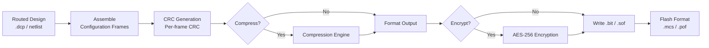

[← Home](../README.md) · [03 — Design Flow](README.md)

# Bitstream Generation — Configuration Data to Configured Device

The bitstream is the final artifact of the FPGA design flow — a binary file encoding every SRAM cell in the device, from LUT truth tables to switch matrix connections. This article covers how bitstreams are generated, compressed, encrypted, and loaded into the FPGA, plus partial reconfiguration and multi-boot strategies.

---

## Overview

After placement and routing, the tool has a complete map of which SRAM cells must be set to 1 or 0. Bitstream generation encodes this map into the vendor's proprietary binary format, prepends headers (device ID, configuration options, encryption metadata), appends CRC checksums and startup sequences, and optionally compresses or encrypts the payload. The output is a `.bit` (Xilinx), `.sof` (Intel SRAM Object File), `.bit`/`.jed` (Lattice), or `.fs` (Gowin) file. For production, this file is converted to a flash programming format: `.mcs`/`.bin` (Xilinx SPI), `.pof` (Intel Programmer Object File), or `.svf`/`.xsvf` (JTAG vector format).

---

## Bitstream Generation Pipeline



### Configuration Frames

The FPGA configuration memory is organized into **frames** — the smallest addressable unit of configuration (typically 101–404 bytes depending on family). Each frame configures a vertical column of the die (CLBs, BRAMs, DSPs, IO). A typical Artix-7 has ~20,000 frames. The bitstream is simply all frames concatenated with headers and CRC.

### Bitstream Internal Anatomy

While every vendor's bitstream format is proprietary, all share a common high-level structure: header metadata → configuration register writes → frame data → CRC → startup sequence.

```
┌────────────────────────────────────────────────┐
│ Bitstream Structure (conceptual, all vendors)  │
├────────────┬───────────────────────────────────┤
│ Header     │ Sync word, device ID, design name │
│            │ date, tool version, config opts   │
├────────────┼───────────────────────────────────┤
│ Register   │ Type 1 / Type 2 packets           │
│ Writes     │ CMD, IDCODE, write to config regs │
│            │ (FDRI, FAR, CMD, MASK, CTL)       │
├────────────┼───────────────────────────────────┤
│ Frame Data │ Actual configuration payload      │
│            │ Frames × columns of die           │
│            │ Each frame = N words (e.g. 101    │
│            │ 32-bit words on Xilinx 7-series)  │
├────────────┼───────────────────────────────────┤
│ CRC        │ Per-frame or per-packet CRC       │
│            │ Failure → fallback / abort        │
├────────────┼───────────────────────────────────┤
│ Startup    │ DCI match, DCM/PLL lock,           │
│ Sequence   │ global write enable (GWE),         │
│            │ end of startup (EOS), DONE release │
└────────────┴───────────────────────────────────┘
```

**Configuration Packets**: Most vendors use a packet-based protocol for bitstream commands. Xilinx is the best-documented example:

- **Type 1 Packet** (32 bits): `[Header=001] [Op: 00=NOP, 01=Read, 10=Write] [Register Address: 14 bits] [Word Count: 11 bits]` — used for configuration register reads/writes
- **Type 2 Packet** (32 bits): `[Header=010] [Op] [Extended Word Count: 27 bits]` — used for bulk frame data writes (FDRI register) that exceed Type 1's 2048-word limit

| Vendor | Packet Format | Publicly Documented? |
|---|---|---|
| Xilinx (all) | Type 1 / Type 2 32-bit packets | Yes (UG470, UG570, Project X-Ray) |
| Intel | Proprietary packet structure | Partially (configuration user guide only) |
| Lattice iCE40/ECP5 | Commands embedded in bitstream | Yes (Project Icestorm/Trellis) |
| Gowin | SPI command + data interleaved | Partially (Project Apicula) |

**Frame Addressing**: Frames are addressed by a combination of block type, row, column, and minor frame:

| Vendor Family | Frame Size | Addressing Model |
|---|---|---|
| Xilinx 7-series | 101 × 32-bit words | FAR register: block type + row + column + minor frame |
| Lattice ECP5 | Configuration rows | Row + column addressing |
| Lattice iCE40 | 16 × 8-bit per tile | Tile-based (no column abstraction) |
| Intel | Proprietary | Undocumented |

**Annotated Header Example (Xilinx .bit file)**:
```
00000000: 00 09 0f f0 0f f0 0f f0  0f f0 00 00 01 61 00 0b  |.............a..|
           |── sync word ──| |pad| |── design name length ──|
00000010: 64 65 73 69 67 6e 5f 31  5f 77 72 61 70 70 65 72  |design_1_wrapper|
           |── design name (ASCII) ────────────────────────|
00000020: 00 62 00 0c 37 73 31 30  30 74 66 67 67 33 32 36  |.b..7s100tfgg326|
           |── part name ────────────────────────────────────|
00000030: 2d 31 00 63 00 0b 32 30  32 36 2f 30 34 2f 32 35  |-1.c..2026/04/25|
           |── date ─────────────────────────────────────────|
00000040: 00 64 00 09 31 32 3a 33  34 3a 35 36 00 65 00 00  |.d..12:34:56.e..|
           |── time ───────────────|── key length = 0 (no AES)|
```

> [!NOTE]
> **Reading headers with `strings`**: `strings -n 3 design.bit | head -20` often reveals the design name, part number, and build date embedded as ASCII metadata in the bitstream header. This works across Xilinx and Intel bitstreams. Lattice bitstreams use a different encoding.

---

## Bitstream File Formats — Complete Reference

Every FPGA vendor has invented its own file formats for bitstreams, flash programming images, and configuration data — and many have accumulated legacy formats over decades of tool evolution. This section catalogs every known format, including deprecated ones still encountered in older designs and documentation.

### Active Formats Quick Reference

| Vendor | SRAM Bitstream | Flash Programming | JTAG Indirect | Raw Binary | Encryption |
|---|---|---|---|---|---|
| **Xilinx 7-series+** | `.bit` | `.mcs` (SPI), `.bin` (raw) | — | `.bin` from `.bit` | AES-256 CBC/GCM |
| **Intel Cyclone V/MAX 10** | `.sof` | `.pof` (parallel flash) | `.jic` | `.rbf` | AES-256 |
| **Intel Arria 10+** | `.sof` | `.pof` | `.jic` | `.rbf` | AES-GCM |
| **Lattice ECP5/CrossLink** | `.bit` | `.mcs`, `.bin`, `.hex` | `.svf`, `.xsvf` | `.bin` | AES-128 |
| **Lattice iCE40** | `.bit` (icepack), `.bin` | `.bin` | `.svf` | `.bin` | — |
| **Lattice MachXO2/3** | `.bit`, `.jed` | `.mcs`, `.bin` | `.svf` | `.bin` | — |
| **Gowin LittleBee/Arora** | `.fs` | `.bin`, `.mcs` | `.svf` | `.bin` | No (external) |
| **Microchip PolarFire** | `.bit` | On-die flash format | `.svf`, `.stp` | `.bin` | AES-256 |
| **Microchip SmartFusion2** | `.bit` | On-die flash format | `.svf`, `.stp` | `.bin` | AES-256 |
| **Efinix Trion/Titanium** | `.hex`, `.bin` | SPI flash `.hex`/`.bin` | `.svf` | `.bin` | No |

### Common Flash Programming Formats

FPGA tools convert bitstreams into standard flash programming formats that off-the-shelf flash programmers understand:

| Format | Extension | Standard | Used By | Notes |
|---|---|---|---|---|
| **Intel MCS-86 Hex** | `.mcs` | Intel HEX (extended addressing) | Xilinx, Lattice, Gowin | 32-bit extended linear addressing; most common SPI flash format |
| **Intel HEX** | `.hex` | Intel HEX (standard) | Efinix, Lattice, Gowin | Standard 8-bit/16-bit addressing; simpler than MCS |
| **Motorola S-Record** | `.exo`, `.s19`, `.srec` | Motorola S-record | Xilinx (legacy), Actel (legacy) | Used for parallel PROM programmers; now largely deprecated |
| **Tektronix Hex** | `.tek` | Tektronix hex | Xilinx (legacy) | Obsolete; last supported in ISE 10.x |
| **Raw Binary** | `.bin` | Raw dump | All vendors | No headers, no addressing — flash programmer must know the start address |
| **Serial Vector Format** | `.svf` | SVF (JTAG) | All vendors | ASCII JTAG instruction stream; playable by any JTAG adapter |
| **Xilinx Serial Vector** | `.xsvf` | XSVF (compressed SVF) | Xilinx, Lattice | Binary SVF variant; smaller and faster over JTAG |
| **STAPL / JAM** | `.jam`, `.jbc`, `.stp` | IEEE 1532 / JESD-71 | Intel, Microchip | Byte-code programming language for embedded configuration |

---

### Format Reference by Vendor

#### Xilinx / AMD

| Format | Extension | Type | Status | Contents |
|---|---|---|---|---|
| **Bitstream** | `.bit` | Binary | **Active** — all SRAM families | Full bitstream with header: sync word, device ID, design name, date, config options, frame data, CRC. The standard output of Vivado/ISE `write_bitstream` |
| **Rawbits** | `.rbt` | ASCII | Deprecated (ISE only) | Human-readable bitstream as ASCII `1`/`0` characters. One bit per character, readable in any text editor. Useful for hand-patching individual config bits. Removed in Vivado |
| **Raw Binary** | `.bin` | Binary | **Active** | Bitstream stripped of header — pure configuration frame data. Used for flash programming where the flash tool adds its own header. Generated with `write_cfgmem -format bin` |
| **MCS-86** | `.mcs` | ASCII hex | **Active** | Intel MCS-86 hex with linear addressing. Standard format for SPI/BPI flash programming. Contains bitstream + addressing + CRC. Generated with `write_cfgmem -format mcs` |
| **Intel HEX** | `.hex` | ASCII hex | Deprecated (Xilinx) | Standard Intel HEX. Historically used for legacy PROM programmers. Superseded by `.mcs` for SPI flash |
| **PROM File** | `.prm` | Binary | Deprecated — XC1700/XC1800 series | Dedicated to legacy Xilinx serial/parallel PROMs (XC1700, XC1800, XC17Vxx). No longer generated by Vivado; ISE 14.7 was the last to produce these |
| **Tektronix** | `.tek` | ASCII hex | Deprecated — removed in ISE 11 | Tektronix hex format for legacy programmers. Never widely used |
| **Motorola S-Record** | `.exo` | ASCII hex | Deprecated | Motorola S-record format for parallel PROM programmers. Last supported in ISE |
| **IEEE 1532 ISC** | `.isc` | ASCII | **Active** (rare) | IEEE 1532 In-System Configuration format. Standardized JTAG configuration. Rarely used; `.svf` is more practical |
| **Design Checkpoint** | `.dcp` | Binary | **Active** | Vivado Design Checkpoint. Not strictly a bitstream — it's a snapshotted netlist with placement, routing, and configuration data. Can be converted to `.bit` |

**Key distinction**: `.bit` contains a header + frame data. `.bin` is headerless raw frame data. `.mcs` wraps the `.bin` in Intel hex addressing for SPI flash.

#### Intel / Altera

| Format | Extension | Type | Status | Contents |
|---|---|---|---|---|
| **SRAM Object File** | `.sof` | Binary | **Active** — all SRAM families | Standard bitstream for direct configuration (JTAG, active serial). Contains device ID, configuration data, compression flag, encryption metadata. Generated by Quartus `assembler` |
| **Programmer Object File** | `.pof` | Binary | **Active** — parallel flash | Configuration image for flash devices (EPCQ, EPCQ-L, CFI parallel flash). Contains bitstream + flash programming metadata + optional multiple pages. Generated from `.sof` via `convert_programming_file` |
| **Raw Binary File** | `.rbf` | Binary | **Active** | Header-stripped bitstream for external configuration by MCU/CPU. The CPU sends this data byte-by-byte to the FPGA's configuration interface (PS, FPP, AS). Generated with `quartus_cpf -c output_file.rbf` |
| **JTAG Indirect Config** | `.jic` | Binary | **Active** | JTAG Indirect Configuration file. Contains both the flash programmer image AND JTAG instructions for an intermediate CPLD/FPGA to program the flash. Used when the FPGA bridges JTAG to flash. Generated via `convert_programming_file` |
| **Tabular Text File** | `.ttf` | ASCII | **Deprecated** — Quartus II only | Human-readable ASCII version of `.sof` as hexadecimal text. Similar to Xilinx `.rbt`. Deprecated in Quartus Prime (replaced by `.rbf` for raw data) |
| **JAM STAPL** | `.jam` | ASCII | **Active** (embedded) | JAM Standard Test and Programming Language. ASCII-based bytecode for embedded configuration without a host PC. Interpretable by a small JAM player (~20 KB code) on an embedded MCU |
| **JAM Byte Code** | `.jbc` | Binary | **Active** (embedded) | Compiled binary version of `.jam`. Smaller and faster for embedded execution. Generated with `quartus_cpf` |
| **Serial Vector Format** | `.svf` | ASCII | **Active** | ASCII JTAG instruction stream. Generic format — any JTAG adapter can play it. Larger and slower than `.jic`/`.pof` but universal |
| **Chain Description File** | `.cdf` | Binary | **Active** | Describes the JTAG chain topology (device order, IR/DR lengths). Used by Quartus Programmer to identify devices on the chain. Not a bitstream itself |
| **Encryption Key File** | `.ekp` | Binary | **Active** | Stores the AES encryption key for the FPGA. Programmed separately into eFUSE or volatile key register |

**Key distinction**: `.sof` is for direct FPGA loading. `.pof` is for flash. `.rbf` is for CPU-driven configuration. `.jic` is for JTAG-through-FPGA flash programming.

#### Lattice

| Format | Extension | Type | Status | Contents |
|---|---|---|---|---|
| **Bitstream** | `.bit` | Binary | **Active** — ECP5, CrossLink, MachXO2/3 | Standard bitstream for SRAM configuration. iCE40 `.bit` is produced by `icepack` (open-source); ECP5/MachXO `.bit` is produced by Radiant/Diamond |
| **JEDEC Fuse Map** | `.jed` | ASCII | **Active** — MachXO, ispMACH, GAL | JEDEC JESD3-C fuse map format. Used for non-volatile CPLDs (MachXO family, ispMACH 4000, GAL). Describes fuse states in a standardized JEDEC format. Human-readable |
| **MCS-86 Hex** | `.mcs` | ASCII hex | **Active** | Intel MCS-86 format for SPI flash. Generated by Diamond/Radiant deployment tool |
| **Intel HEX** | `.hex` | ASCII hex | **Active** | Standard Intel HEX for SPI flash. Alternative to `.mcs`; simpler addressing |
| **Raw Binary** | `.bin` | Binary | **Active** | Raw binary for SPI flash or MCU-driven configuration |
| **Serial Vector Format** | `.svf` | ASCII | **Active** | JTAG SVF for configuration via any JTAG adapter |
| **Xilinx Serial Vector** | `.xsvf` | Binary | **Active** | Compressed SVF variant. Smaller than `.svf` for the same bitstream. Played via Lattice `ispVM` or `xc3sprog` |
| **VME File** | `.vme` | ASCII | **Legacy** — ispVM | Used by the ispVM programmer for ispMACH/GAL devices. Contains JTAG fuse programming instructions |
| **ISC** | `.isc` | ASCII | Rare | IEEE 1532 ISC format for Lattice devices. Used in aerospace/military flows |

**Key distinction**: `.bit` is for SRAM FPGAs (ECP5, iCE40). `.jed` is for non-volatile CPLDs (MachXO, ispMACH). They are fundamentally different formats — `.bit` is a binary bitstream; `.jed` is an ASCII fuse map.

#### Gowin

| Format | Extension | Type | Status | Contents |
|---|---|---|---|---|
| **Gowin Bitstream** | `.fs` | Binary | **Active** — all families | Proprietary compressed bitstream format. The standard output of Gowin EDA. Contains configuration data with Gowin-specific compression. Loaded via Gowin programmer or embedded MCU |
| **Raw Binary** | `.bin` | Binary | **Active** | Raw binary for SPI flash or MCU-driven configuration from SRAM |
| **MCS-86 Hex** | `.mcs` | ASCII hex | **Active** | Intel MCS-86 format for SPI flash programming |
| **Serial Vector Format** | `.svf` | ASCII | **Active** | JTAG SVF for configuration via OpenOCD or other JTAG adapters |
| **SRAM File** | `.sram` | Binary | Legacy (older Gowin tools) | Older bitstream format used by early Gowin EDA versions. Superseded by `.fs` |

**Key distinction**: `.fs` is Gowin's unique compressed format — it is not simply a renamed `.bit`. The compression is integrated into the format and cannot be disabled.

#### Microchip / Microsemi / Actel

Microchip (formerly Microsemi, formerly Actel) has an unusually complex format history due to the antifuse → flash → SONOS technology transitions:

| Format | Extension | Type | Status | Contents |
|---|---|---|---|---|
| **Bitstream** | `.bit` | Binary | **Active** — PolarFire, SmartFusion2, IGLOO2 | Standard bitstream for flash-based FPGAs. Generated by Libero SoC. Contains configuration data for on-die flash programming |
| **Programming Database** | `.pdb` | Binary | **Active** — SmartFusion2, IGLOO2 | Programming Database file. Contains device-specific programming algorithms + configuration data. Used by FlashPro programmer |
| **STAPL** | `.stp` | ASCII | **Active** — all flash families | Standard Test and Programming Language (IEEE 1532). ASCII bytecode for embedded programming. Widely used in avionics and defense for in-system updates |
| **Serial Vector Format** | `.svf` | ASCII | **Active** | JTAG SVF for configuration via FlashPro or third-party JTAG tools |
| **Actel Fuse Map** | `.afm` | Binary | **Deprecated** — antifuse families (Axcelerator, ProASIC, eX, SX) | Fuse map for Antifuse FPGA families. Antifuse is one-time programmable — `.afm` describes which antifuses to blow. Incompatible with flash families |
| **Data File** | `.dat` | Binary | **Deprecated** — Actel legacy | Legacy programming data file for Actel Designer (pre-Libero). Used with Axcelerator and ProASIC families |
| **Job File** | `.job` | Binary | **Active** | FlashPro job project file — contains programming setup (device chain, operations, verification options). Not a bitstream per se, but generated alongside |
| **Embedded Flash Config** | `.efc` | Binary | Deprecated — SmartFusion | Embedded Flash Configuration file for SmartFusion (cortex-M3 + FPGA). Superseded by `.pdb` in Libero SoC v11+ |

**Key distinction**: Microchip uses flash-based configuration — the `.bit`/`.pdb` is programmed once into on-die flash, and the FPGA loads from internal flash on power-up. No external configuration memory needed. The `.afm`/`.dat` formats are for the older Antifuse technology and are incompatible with current families.

#### Efinix

| Format | Extension | Type | Status | Contents |
|---|---|---|---|---|
| **Intel HEX Bitstream** | `.hex` | ASCII hex | **Active** — all families | Primary bitstream format for Efinix FPGAs. Standard Intel HEX encoding of configuration data. Chosen for simplicity and compatibility with off-the-shelf flash programmers |
| **Raw Binary** | `.bin` | Binary | **Active** | Raw binary bitstream for SPI flash or MCU-driven configuration |
| **Serial Vector Format** | `.svf` | ASCII | **Active** | JTAG SVF for configuration via debug probes |

**Key distinction**: Efinix chose `.hex` as the primary format instead of a proprietary binary format — making it one of the simplest bitstream ecosystems to integrate into embedded programming workflows.

---

### Cross-Vendor / Universal Configuration Formats

These formats are not vendor-specific — they describe JTAG operations at a level that any FPGA or JTAG adapter can execute:

| Format | Extension | Based On | Purpose |
|---|---|---|---|
| **Serial Vector Format** | `.svf` | JTAG state machine operations | ASCII description of every JTAG TMS/TDI transition and TDO expected value. Universal — playable by OpenOCD, UrJTAG, xc3sprog, and vendor programmers |
| **Xilinx Serial Vector** | `.xsvf` | SVF with binary compression | Binary variant of SVF originally by Xilinx. Uses run-length encoding for repeated JTAG operations. Significantly smaller than `.svf` for large bitstreams. Supported by Lattice ispVM and OpenOCD |
| **STAPL / JAM** | `.stp`, `.jam`, `.jbc` | IEEE 1532 / JESD-71 | Byte-code virtual machine for embedded configuration. A small interpreter (~20 KB) on a microcontroller reads `.jam`/`.stp` and executes JTAG operations to configure the FPGA. No host PC required |
| **IEEE 1532 ISC** | `.isc` | IEEE 1532-2002 | XML-like ASCII format standardized by IEEE for in-system configuration. Reads like a procedural JTAG script. Rarely used in practice — `.svf` and `.stp` are more common |

> [!NOTE]
> **`.svf` is the lowest common denominator.** Almost every FPGA tool can generate `.svf`, and almost every JTAG tool can play it. It is the only format that works across all vendors, all devices, and all JTAG adapters. The cost is size: an SVF file can be 10–50× larger than the equivalent `.bit`/`.sof` because it encodes every JTAG state machine transition as ASCII text.

---

### Format Decision Guide

| If you are... | Use this format | Because |
|---|---|---|
| Developing on a dev board via USB | Vendor's native bitstream (`.bit`, `.sof`, `.fs`) | Directly loadable by vendor programmer |
| Programming SPI flash for production | `.mcs` (Intel hex) or `.bin` | Off-the-shelf flash programmers understand these |
| Configuring FPGA from an onboard MCU/CPU | `.rbf` (Intel) or `.bin` (others) | Raw binary with no header overhead |
| Embedded/in-field updates with an MCU | `.jam`/`.jbc` (Intel) or `.stp` (Microchip) | Small interpreter on MCU, no host PC needed |
| Universal JTAG configuration | `.svf` | Works with every JTAG adapter and every FPGA |
| Archiving or human inspection | `.rbt` (Xilinx) or `.ttf` (Intel, deprecated) | ASCII representation of every config bit |
| Open-source toolchain (Lattice) | `.bit` (icepack/ecppack) | Generated by open-source tools |

> [!TIP]
> **When in doubt, generate both the vendor bitstream AND a `.svf`.** The vendor bitstream is fast for development. The `.svf` is your universal fallback — if a new JTAG adapter doesn't support the vendor's format, `.svf` will always work.

---

## Open-Source Bitstream Landscape

The FPGA industry's biggest open-source gap is bitstream documentation. Without it, an entirely open-source FPGA toolchain is impossible — you can synthesize and place-and-route with Yosys + nextpnr, but you cannot generate a valid bitstream without the vendor's proprietary bitstream generator (or reverse-engineered documentation). This section maps the current state across all vendors.

### Reverse-Engineering Status by Vendor

| Vendor Family | Open Docs? | Project | Status | What's Known | What's Unknown / Proprietary |
|---|---|---|---|---|---|
| **Lattice iCE40** | Fully documented | [Project Icestorm](https://github.com/YosysHQ/icestorm) | Complete | Frame format, tile map, routing bits, PLL, BRAM | — (fully open) |
| **Lattice ECP5** | Fully documented | [Project Trellis](https://github.com/YosysHQ/prjtrellis) | Complete | Frame format, tile map, routing, SERDES/PCS, DDR | — (fully open) |
| **Lattice CrossLink-NX** | None | — | — | — | Proprietary; no public RE effort |
| **Xilinx 7-series** | Well documented | [Project X-Ray](https://github.com/f4pga/prjxray) / F4PGA | ~95% | CLB, BRAM, DSP, routing, IO tiles, PLL/MMCM | GTX transceiver config, some advanced IO |
| **Xilinx UltraScale/UltraScale+** | Partial | Project UltraScale | ~40% | Basic frame structure, some tile types | Routing details, high-speed IO, clocking |
| **Xilinx Versal** | None | — | — | — | Completely proprietary; hardened AI engines |
| **Intel Cyclone V / MAX 10** | **No** | None | — | — | Fully proprietary; no public RE effort exists |
| **Intel Arria 10 / Stratix 10 / Agilex** | **No** | None | — | — | AES-GCM encrypted by default; legal barriers |
| **Gowin LittleBee / Arora** | Partial | [Project Apicula](https://github.com/YosysHQ/apicula) | ~60% | Basic tile types, some routing | I/O configuration, PLL, advanced routing |
| **Microchip PolarFire / SmartFusion2** | **No** | None | — | — | SONOS flash-based; completely proprietary |
| **Efinix Trion / Titanium** | **No** | None | — | — | Proprietary; small vendor, no community RE |

### Why Some Vendors Have Open Docs and Others Don't

| Factor | Lattice (Open) | Xilinx (Partial) | Intel (Closed) |
|---|---|---|---|
| **Bitstream complexity** | Simple, regular tile grid | Moderate, columnar architecture | Complex, irregular ALM routing |
| **Community focus** | Highest open-source interest (iCE40/ECP5 are hobbyist favorites) | Moderate (7-series dev boards are affordable) | Low (Intel boards are less popular in open-source community) |
| **Legal barriers** | No active enforcement against RE | Historically tolerant of academic RE | EULA explicitly prohibits RE; strong enforcement |
| **Encryption** | Optional, often unused | Optional on 7-series | AES baked into configuration controller |
| **RE effort required** | Low (small bitstream, regular structure) | Medium (columnar, well-structured) | High (large, irregular, encrypted by default on newer families) |

### Consequence for Open-Source Flows

| If Your Target Is... | Open-Source Bitstream Possible? | Toolchain |
|---|---|---|
| Lattice iCE40 | Yes — fully open | Yosys + nextpnr + icestorm (icepack) |
| Lattice ECP5 | Yes — fully open | Yosys + nextpnr + Project Trellis (ecppack) |
| Xilinx 7-series | Yes — mostly open | Yosys + nextpnr-xilinx + Project X-Ray |
| Xilinx UltraScale+ | Partial (experimental) | Yosys + nextpnr-xilinx (limited device support) |
| Intel (any) | **No — vendor tools required** | Quartus Prime (mandatory for bitstream generation) |
| Gowin (any) | **No — vendor tools required** | Gowin EDA for bitstream; Apicula for synthesis/P&R only |
| Microchip (any) | **No — vendor tools required** | Libero SoC mandatory |
| Efinix (any) | **No — vendor tools required** | Efinity mandatory |

> [!WARNING]
> **"Open-source synthesis + P&R" does not mean "open-source bitstream."** Yosys + nextpnr can produce a placed-and-routed design for many devices, but producing a valid `.bit`/`.sof`/`.fs` file still requires the vendor's bitstream generator (or a reverse-engineered packer like icepack/ecppack). For Intel, Microchip, and Efinix, the vendor toolchain is the only path to a working bitstream.

---

## Bitstream Compression

Bitstreams are highly compressible — most frames are repetitive (unused LUTs are all zeros). Vendor tools offer built-in compression:

| Vendor | Compression | Typical Ratio | How to Enable |
|---|---|---|---|
| Xilinx | Bitstream compression | 30–60% | `set_property BITSTREAM.GENERAL.COMPRESS TRUE [current_design]` |
| Intel | Bitstream compression | 30–50% | `set_global_assignment -name BITSTREAM_COMPRESSION ON` |
| Lattice | Not built-in | N/A (external only) | Compress externally before flash programming; decompress in MCU before loading |
| Gowin | Not built-in | N/A (external only) | Compress externally; Gowin's configuration controller does not decompress on-the-fly |
| Microchip | Not built-in | N/A (internal flash) | On-die flash does not benefit from compression since it loads internally at high speed |
| Efinix | Not built-in | N/A (external only) | Compress .hex/.bin externally for SPI flash storage |

> [!NOTE]
> **External compression workaround for Lattice/Gowin/Efinix**: Use gzip or LZ4 to compress the bitstream before storing in flash. A small MCU (or the soft CPU in the design) decompresses it into a buffer before feeding it to the FPGA's configuration interface. This is common in space-constrained IoT deployments.

Compression is transparent: the FPGA's internal configuration controller decompresses on-the-fly during loading. The only penalty is slightly longer configuration time (decompression overhead is negligible vs flash read time).

---

## Encryption and Security

See also [Configuration & Bitstream](../02_architecture/infrastructure/configuration.md) for the hardware perspective.

| Vendor | Encryption | Key Storage | Key Length | Block Mode |
|---|---|---|---|---|
| Xilinx 7-series | AES | eFUSE / BBRAM | 256-bit | CBC |
| Xilinx UltraScale+ | AES-GCM | eFUSE / BBRAM | 256-bit | GCM (authenticated) |
| Intel Cyclone V | AES | eFUSE / volatile key | 256-bit | CBC |
| Intel Agilex | AES-GCM | eFUSE / PUF | 256-bit | GCM (authenticated) |
| Lattice ECP5 | AES | eFUSE | 128-bit | ECB |
| Microchip PolarFire | AES-256 | eFUSE / external | 256-bit | CBC |

**Encrypted bitstream generation (Xilinx):**
```tcl
set_property BITSTREAM.ENCRYPTION.ENCRYPT TRUE [current_design]
set_property BITSTREAM.ENCRYPTION.ENCRYPTKEYSELECT bbram [current_design]
set_property BITSTREAM.ENCRYPTION.KEY0 256'hDEADBEEF... [current_design]
```

> [!WARNING]
> **The encryption key is embedded in the bitstream (encrypted with the device's public key) or programmed separately.** Never commit encryption keys to version control. Use environment variables or a hardware security module (HSM) for key management.

---

## Partial Reconfiguration (DFX)

Partial reconfiguration allows modifying a region of the FPGA while the rest continues running:

```
┌──────── Full Bitstream ────────┐
│ Static Region (always running) │
│ ┌─── Reconfigurable Partition ┐│
│ │  Partial Bitstream A        ││  ← Swap at runtime
│ │  Partial Bitstream B        ││
│ │  Partial Bitstream C        ││
│ └─────────────────────────────┘│
└────────────────────────────────┘
```

### Xilinx DFX Flow

```tcl
# Define reconfigurable partition
create_pblock pblock_rp
add_cells_to_pblock pblock_rp [get_cells rp_module]
resize_pblock pblock_rp -add {SLICE_X20Y50:SLICE_X40Y100 DSP48_X2Y5:DSP48_X4Y10}

# Generate full and partial bitstreams
write_bitstream -force -file top_full.bit
write_bitstream -force -cell rp_module variant_a_partial.bit
write_bitstream -force -cell rp_module variant_b_partial.bit
```

Partial bitstreams load through ICAP (Internal Configuration Access Port) or PCAP (Processor Configuration Access Port on Zynq) in microseconds to milliseconds, depending on partition size.

### Intel Partial Reconfiguration

Intel supports partial reconfiguration on Arria 10, Stratix 10, and Agilex through the PR IP and PR regions defined in Platform Designer (Qsys).

### Partial Reconfiguration Availability by Vendor

| Vendor | PR Support | Minimum Family | Interface | Notes |
|---|---|---|---|---|
| **Xilinx** | Yes | 7-series and later | ICAP (internal) / PCAP (Zynq processor) | DFX flow with pblock constraints; most mature PR ecosystem |
| **Intel** | Yes | Arria 10, Stratix 10, Agilex | PR IP over JTAG or internal | **Not available on Cyclone V / MAX 10**. Requires PR license (paid) |
| **Lattice** | No | — | — | Dual-boot (two full images) does not qualify as partial reconfiguration |
| **Gowin** | No | — | — | Not supported on any current family |
| **Microchip** | No | — | — | Flash-based architecture does not support runtime partial reconfiguration |
| **Efinix** | No | — | — | Not supported |

> [!NOTE]
> **Partial reconfiguration is a premium feature.** Only Xilinx and Intel (Arria 10+) offer it, and both require paid tool licenses in most cases. For open-source alternatives, consider loading different full bitstreams via multi-boot instead.

---

## Multi-Boot and Fallback

Storing multiple bitstreams in flash enables recovery from a failed remote update:

| Vendor | Mechanism | Fallback Trigger | Max Images |
|---|---|---|---|
| Xilinx | MultiBoot (IPROG command) | CRC failure, watchdog timeout | 4 in BPI flash |
| Intel | Remote System Update (RSU) | CRC failure, user trigger | 2 (factory + application) |
| Lattice | Dual-boot | Configuration failure | 2 |
| Microchip | Auto-fallback | CRC failure | 2 (golden + recovery in on-die flash) |
| Gowin | Dual-boot (select families) | Configuration failure | 2 (on GW2A / Arora) |
| Efinix | Not supported | — | 1 (single image only) |

---

## Best Practices & Antipatterns

### Best Practices
1. **Generate bitstream with version metadata** — Embed a build timestamp and git hash in a BRAM or register accessible by software for deployed firmware tracking
2. **Verify bitstream CRC post-write** — The FPGA verifies during loading, but your flash programmer should also verify. A corrupted flash write silently survives until the next power cycle
3. **Use compression for SPI flash** — Reduces flash cost and load time. For a 32 Mb Artix-7 bitstream, compression often shrinks it to 12–16 Mb
4. **Always include a golden image** — Remote update without fallback = bricked device if the update fails

### Antipatterns

| Antipattern | The Problem | The Fix |
|---|---|---|
| **"The Plaintext Bitstream"** | Production bitstream without encryption | Reverse engineering the bitstream reveals your entire design. Encrypt for production |
| **"The Unversioned Build"** | No git hash or timestamp in the bitstream | Deployed firmware cannot be traced to source. Embed metadata in a read-only register |
| **"The Single-Image Flash"** | One bitstream in SPI flash, no golden/fallback image | Power loss during update = bricked device. Always have golden + update images |

---

## References

| Source | Document |
|---|---|
| Vivado UG908 — Programming and Debugging | https://docs.xilinx.com/ |
| Vivado UG909 — Partial Reconfiguration | https://docs.xilinx.com/ |
| Intel CV-5V1 — Cyclone V Configuration | Intel FPGA Documentation |
| Project Icestorm — iCE40 Bitstream Documentation | https://github.com/YosysHQ/icestorm |
| Project Trellis — ECP5 Bitstream Documentation | https://github.com/YosysHQ/prjtrellis |
| Project X-Ray — Xilinx 7-series Bitstream Documentation | https://github.com/f4pga/prjxray |
| Project Apicula — Gowin Bitstream Documentation | https://github.com/YosysHQ/apicula |
| Gowin SUG550 — GowinSynthesis User Guide | https://www.gowinsemi.com/en/support/documentation/ |
| Microchip Libero SoC User Guide | https://www.microchip.com/en-us/products/fpgas-and-plds/design-resources |
| Efinix Efinity User Guide | https://www.efinixinc.com/support/docs.php |
| [Configuration & Bitstream (Hardware)](../02_architecture/infrastructure/configuration.md) | Hardware perspective on configuration |
| [Place & Route](place_and_route.md) | Previous stage |
| [Floorplanning](floorplanning.md) | Manual placement for DFX regions |
