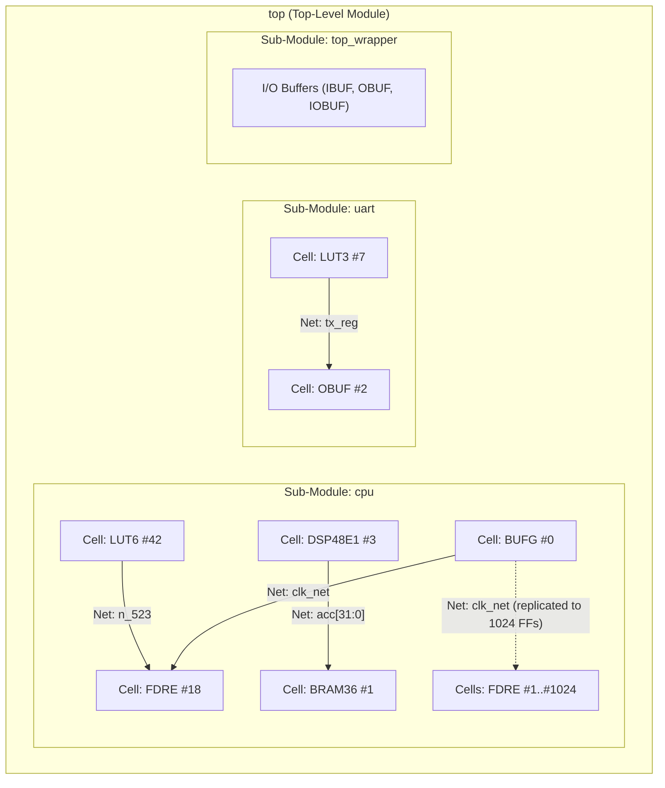
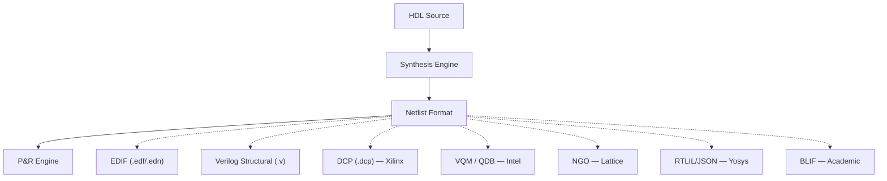

[← Home](../README.md) · [03 — Design Flow](README.md)

# The Netlist — Intermediate Representation Between Synthesis and Implementation

> [!IMPORTANT]
> A netlist is the central data structure of the entire FPGA toolchain — yet it is the least understood artifact. Every synthesis engine produces one, every place-and-route engine consumes one, every formal verification tool reasons about one, yet most FPGA developers never inspect their netlist.

This article explains what a netlist is, catalogs every netlist format across all vendors (including open-source), and shows how to generate, inspect, and manipulate netlists for cross-vendor and optimization workflows.

---

## Overview


> **Formal definition**: *"In electronic design, a netlist is a description of the connectivity of an electronic circuit. In its simplest form, a netlist consists of a list of the electronic components in a circuit and a list of the nodes they are connected to. A network (net) is a collection of two or more interconnected components."*
>
> — [Netlist — Wikipedia](https://en.wikipedia.org/wiki/Netlist). See also: [EDIF Standard, ANSI/EIA-548-1988 / IEEE 1076.4](https://ieeexplore.ieee.org/document/123456) (the industry-standard interchange format for netlists), and the [Yosys documentation on RTLIL](https://yosyshq.readthedocs.io/) (the open-source netlist intermediate language).

A netlist is a directed graph where **cells** (components: LUTs, FFs, BRAMs, DSPs, I/O buffers) are connected by **nets** (wires).

It is the output of synthesis and the input to placement and routing — the handoff point between the front-end (HDL world) and the back-end (physical world).

Netlists exist at multiple levels of abstraction: post-elaboration (RTL netlist, technology-independent), post-synthesis (mapped to device primitives), post-route (with physical locations), and post-layout (with timing). The choice of netlist format determines interoperability between tools: EDIF enables mixing Xilinx ISE synthesis with Lattice P&R; structural Verilog enables any simulator to verify post-synthesis; Yosys RTLIL enables open-source manipulation without any vendor tool installed.

---

## What Is a Netlist?

### Conceptual Model

A netlist is a graph `G = (C, N)` where:

- **Cells (C)**: leaf-level hardware instances — LUTs, flip-flops, carry chains, BRAM tiles, DSP slices, I/O buffers, and hard IP blocks (PLLs, transceivers). Each cell has a type (e.g., `LUT6`, `FDRE`, `RAMB36E1`) and pins with a direction (input, output, inout).
- **Nets (N)**: connections between cell pins. A net is a single electrical node — all pins on the same net are shorted together. Nets are unnamed or explicitly named by the designer.
- **Hierarchy**: netlists preserve the module hierarchy from HDL — a top-level cell contains sub-module cells, which contain leaf cells. Flattening the netlist eliminates this hierarchy (faster P&R but unreadable).

```
Top-Level Module ("top")
├── Sub-Module: "cpu"
│   ├── Cell: LUT6 #42  →  Net: "n_523"  →  Cell: FDRE #18
│   ├── Cell: DSP48E1 #3  →  Net: "acc[31:0]"  →  Cell: BRAM36 #1
│   └── Cell: BUFG #0  →  Net: "clk_net"  →  Cells: FDRE #1..#1024
├── Sub-Module: "uart"
│   └── Cell: LUT3 #7  →  Net: "tx_reg"  →  Cell: OBUF #2
└── Sub-Module: "top_wrapper" (I/O buffers)
```

This same netlist, visualized as a directed graph of cells connected by nets:



### Why Netlists Exist

| Purpose | Explanation |
|---|---|
| **Decouple synthesis from P&R** | Synthesis is vendor-agnostic in principle; P&R is vendor-specific. A standard netlist format lets you use the best synthesizer with any backend |
| **Enable third-party synthesis** | Synplify Pro can synthesize for Xilinx, Intel, Lattice, Gowin, and Microchip — because it writes EDIF netlists that each vendor's P&R tool can read |
| **Enable cross-vendor flows** | Yosys synthesizes to generic primitives, exports EDIF, and feeds into Lattice Diamond, Gowin EDA, or nextpnr |
| **Formal verification input** | Formal tools (SymbiYosys, JasperGold) operate on the netlist — reasoning about logic without physical constraints |
| **Simulation of post-synthesis design** | A post-synthesis netlist simulation catches synthesis-introduced bugs (e.g., incorrectly inferred RAM) before P&R |
| **ECO (Engineering Change Order)** | Manually editing a netlist avoids re-running synthesis and P&R — critical for last-minute timing fixes |

---

## Netlist Formats — Complete Cross-Vendor Reference



### Format Comparison Table

| Format | Extension | Type | Human-Readable? | Produced By | Consumed By | Size (Relative) | Self-Contained? |
|---|---|---|---|---|---|---|---|
| **EDIF** | `.edf`, `.edn` | ASCII | Yes | Synplify Pro, Yosys, ISE, Vivado (export) | Vivado, Diamond, Radiant, Gowin EDA, Libero, nextpnr | Large (10–100× binary) | Yes (no external libraries needed) |
| **Structural Verilog** | `.v`, `.vo` | ASCII | Yes | Vivado, Quartus, Yosys, Synplify Pro | Any Verilog simulator, any P&R that accepts Verilog | Medium | Depends on vendor cell library |
| **VQM (Verilog Quartus Mapping)** | `.vqm` | ASCII | Yes (Verilog-like) | Quartus | Quartus (internal), third-party simulators | Medium | No (requires Quartus primitives) |
| **Intel QDB (Quartus Database)** | `.qdb` | Binary | No | Quartus Fitter | Quartus (checkpoint, incremental compile) | Small–Medium | Yes (netlist + constraints + placement + routing) |
| **QXP (Quartus Exported Partition)** | `.qxp` | Binary | No | Quartus (post-fit export) | Quartus (design partition reuse) | Small | Yes (post-fit netlist for partition) |
| **Xilinx DCP** | `.dcp` | Binary | No | Vivado | Vivado only | Medium (compressed) | Yes (contains netlist + constraints) |
| **Lattice NGO** | `.ngo` | Binary | No | Lattice LSE | Diamond P&R | Small | Yes |
| **Yosys RTLIL** | `.il` | ASCII | Yes | Yosys | Yosys, custom scripts | Medium | Yes |
| **Yosys JSON** | `.json` | ASCII | Yes | Yosys | nextpnr, custom tools | Large | Yes |
| **BLIF** | `.blif` | ASCII | Yes | Yosys, ABC, Odin II | VPR, academic tools | Medium | Yes |
| **EBLIF** | `.eblif` | ASCII | Yes | Yosys | VPR, nextpnr-ice40 | Medium | Yes (extended BLIF with attributes) |
| **XDL (Xilinx Design Language)** | `.xdl` | ASCII | Yes | ISE | ISE, custom scripts (deprecated) | Large | Yes |
| **Tcl Checkpoint (ISE)** | `.ncd` | Binary | No | ISE | ISE only | Small | Yes |

### EDIF — The Industry Standard

EDIF (Electronic Design Interchange Format, IEEE 1076.4) is the closest thing to a universal netlist format. It was designed in the 1980s to enable EDA tool interoperability and remains the primary interchange format between synthesis and P&R for most vendors.

**Structure**: EDIF is a Lisp-like ASCII format with nested S-expressions:

```
(edif top_design
  (edifVersion 2 0 0)
  (edifLevel 0)
  (keywordMap (keywordLevel 0))
  (library work
    (edifLevel 0)
    (technology (numberDefinition))
    (cell top
      (view netlist
        (interface
          (port clk (direction INPUT))
          (port rst (direction INPUT))
          (port led (direction OUTPUT)))
        (contents
          (instance LUT6_1
            (viewRef netlist (cellRef LUT6)))
          (instance FDRE_2
            (viewRef netlist (cellRef FDRE)))
          (net clk_net
            (joined
              (portRef clk)
              (portRef C (instanceRef FDRE_2))))))))
  (design top_design
    (cellRef top
      (libraryRef work))))
```

| EDIF Property | Value |
|---|---|
| **Version** | EDIF 2 0 0 (most common), EDIF 3 0 0 (rare) |
| **Encoding** | ASCII, case-insensitive keywords |
| **Cell library** | Primitives defined in separate cell definitions or external library |
| **Vendor extensions** | Vendors add proprietary properties via `(property ...)` blocks |
| **Pros** | Universal — almost every EDA tool reads/writes it; self-contained; human-readable |
| **Cons** | Enormous for large designs (10–100× bigger than binary); slow to parse; no timing or constraint info |

### Structural Verilog — The Universal Lowest Common Denominator

Every vendor tool can output a structural Verilog netlist — a `.v` file where the design is described purely as module instantiations with wire connections (no behavioral code, no `always` blocks):

```verilog
// Post-synthesis structural Verilog (Xilinx Vivado)
module top (
  input  wire clk,
  input  wire rst,
  output wire led
);
  wire n_0, n_1;  // anonymous nets

  LUT1 #(.INIT(2'h1)) LUT1_inst (.O(n_0), .I0(rst));
  FDRE #(.INIT(1'b0)) FDRE_inst (.Q(led), .C(clk), .CE(n_1), .D(n_0), .R(1'b0));
  ...
endmodule
```

| Property | Details |
|---|---|
| **Universality** | Every simulator, synthesizer, and P&R tool accepts structural Verilog. It is the only format that truly works everywhere |
| **Lossiness** | Loses optimization metadata — BRAM configuration, DSP pipelining hints, retiming annotations are typically not preserved in structural Verilog |
| **Vendor dependency** | The primitives (e.g., `LUT1`, `FDRE`) are vendor-specific — a Xilinx structural netlist cannot be directly used in Quartus |
| **Best use** | Post-synthesis simulation, netlist-level ECO editing, cross-vendor "last resort" interchange |

### Vendor-Specific Formats

#### Xilinx DCP (Design Checkpoint)

Xilinx's `.dcp` is not just a netlist — it's a complete design snapshot containing the netlist, constraints (XDC), placement, routing, and intermediate implementation data. It is generated and consumed exclusively by Vivado. DCPs are the standard handoff format between Vivado synthesis and implementation, and between implementation stages (opt_design → place_design → route_design).

**Key property**: A DCP can be opened in Vivado and treated exactly like an in-memory design — you can resume P&R, modify constraints, or write a bitstream from any `.dcp` checkpoint.

#### Intel Quartus — The Full Netlist Pipeline

Intel's Quartus Prime stores netlists in multiple formats at different pipeline stages. Understanding these formats is essential for cross-tool flows, incremental compilation, and design partition reuse.

**Pipeline stages**:

```
HDL Source
   │
   ▼
┌──────────────────────────────────┐
│  Analysis & Synthesis            │
│  (quartus_map)                   │
│  Produces: Internal Atom Netlist │
└──────────────┬───────────────────┘
               │
               ▼
┌──────────────────────────────────┐
│  VQM — Verilog Quartus Mapping   │
│  Post-synthesis netlist          │
│  .vqm (text)                     │
│  ▼ consumed by Fitter            │
└──────────────┬───────────────────┘
               │
               ▼
┌──────────────────────────────────┐
│  Fitter (Place & Route)          │
│  (quartus_fit)                   │
│  Internal: QDB database          │
└──────────────┬───────────────────┘
               │
       ┌───────┴────────┐
       ▼                ▼
┌──────────────┐  ┌───────────────────┐
│  QDB         │  │  Post-Fit Export  │
│  Checkpoint  │  │  .vo (Verilog)    │
│  (.qdb)      │  │  .vho (VHDL)      │
│  Incremental │  │  Gate-level sim   │
│  compile     │  │                   │
└──────────────┘  └───────────────────┘
       │
       ▼
┌────────────────────┐
│  QXP — Partition   │
│  Export (.qxp)     │
│  Reusable post-fit │
│  block             │
└────────────────────┘
```

| Format | Extension | Stage | Description |
|---|---|---|---|
| **VQM** | `.vqm` | Post-synthesis | Structural Verilog with Intel primitives. ASCII, human-readable. The standard handoff between Synthesis and Fitter. Contains LUTs, FFs, BRAMs, DSPs mapped to device primitives (e.g., `stratixv_lcell_comb`, `dffeas`). No placement or routing data |
| **QDB** | `.qdb` | Post-fit | Quartus Database — binary checkpoint containing the complete placed-and-routed netlist plus all constraints, timing, and implementation data. Analogous to Xilinx DCP. Used for incremental compilation (preserving fitter results across builds) and as a project archive format. Cannot be inspected without Quartus |
| **QXP** | `.qxp` | Post-fit export | Quartus Exported Partition — a self-contained post-fit netlist for a design partition. Enables team-based design: one engineer locks a partition, exports as QXP, and other team members import it as a pre-solved block. Contains netlist + placement + routing for the partition only |
| **Post-Fit Verilog / VHDL** | `.vo` / `.vho` | Post-fit | Gate-level simulation netlist for third-party simulators (ModelSim, Questa, VCS). Includes all technology-mapped primitives with full connectivity. Can be annotated with SDF for timing simulation. Equivalent to Vivado's `write_verilog -mode impl` |
| **Atom Netlist** | (internal) | Post-synthesis | Historical: the internal netlist format before VQM was introduced. Still referenced in older Quartus II documentation. Superseded by VQM in modern Quartus Prime |
| **EDIF** | `.edf` / `.edn` | Import/Export | Quartus can import EDIF from third-party synthesis (Synplify Pro, Precision) and export EDIF via `quartus_eda` for cross-vendor flows |

**Key difference from Xilinx**: Vivado uses a single unified checkpoint format (DCP) that carries the design from synthesis through implementation. Quartus separates the textual synthesis handoff (VQM) from the binary post-fit checkpoint (QDB). There is no single "everything" file analogous to DCP in Quartus — you archive both VQM + QDB for full reproducibility.

**VQM in-depth**:

```verilog
// Example VQM fragment (Intel Cyclone V / Arria V / Stratix V)
module top (
    input  wire clk,
    input  wire rst,
    output wire [3:0] led
);
    // Intel primitives — not generic Verilog
    cyclonev_lcell_comb #(
        .lut_mask(64'h000000000000FF00),
        .operation_mode("normal")
    ) lut_0 (
        .combout(n_0),
        .dataa(rst),
        .datab(1'b1),
        .datac(1'b1),
        .datad(1'b1)
    );
    dffeas #(
        .power_up("low")
    ) ff_0 (
        .q(led[0]),
        .d(n_0),
        .clk(clk),
        .clrn(1'b1),
        .prn(1'b1),
        .ena(1'b1)
    );
    // ... hundreds/thousands more primitives
endmodule
```

| VQM Property | Details |
|---|---|
| **Primitives** | Vendor-specific: `cyclonev_lcell_comb`, `stratixv_lcell_comb`, `dffeas`, `altsyncram`, etc. Family-dependent |
| **Encoding** | ASCII (Verilog-like), readable in any text editor |
| **Size** | ~5–50 MB for medium designs (much larger than binary QDB) |
| **Constraints** | Not included — use `.sdc` / `.qsf` separately |
| **Cross-version compatibility** | Generally forward-compatible within a device family; not guaranteed across major Quartus versions |

#### Lattice NGO (Native Generic Object)

Lattice's internal binary netlist format used between Lattice Synthesis Engine (LSE) and the Diamond P&R engine. It is not human-readable and not intended for external consumption. When using Synplify Pro with Lattice, the handoff is EDIF (`.edf`), bypassing NGO entirely.

#### Gowin Post-Synthesis Netlist

Gowin EDA uses an internal netlist format for synthesis-to-P&R handoff. For export, the tool can write structural Verilog (`.vo`) or EDIF (via Synplify Pro). Gowin's `.vg` files are Verilog gate-level netlists.

#### Yosys RTLIL / JSON

Yosys (open-source synthesis) uses **RTLIL** (RTL Intermediate Language, `.il`) as its internal representation — a Lisp-like text format that is fully human-readable and designed for programmatic manipulation. Yosys also exports **JSON** netlists consumed by nextpnr for placement and routing. Both formats are well-documented and form the backbone of the open-source FPGA toolchain.

---

## Netlist Levels — From Elaboration to Timing

A design passes through multiple netlist levels, each adding detail and reducing abstraction:

| Level | Name | Contains | Generated By | Used For |
|---|---|---|---|---|
| **L1** | Post-Elaboration / RTL Netlist | Technology-independent gates (AND, OR, MUX), unoptimized | HDL front-end (after parsing/elaboration) | Early simulation, linting |
| **L2** | Post-Synthesis Netlist | Device primitives (LUTs, FFs, BRAMs, DSPs), optimized but unplaced | Synthesis engine | P&R input, post-synthesis simulation, formal verification |
| **L3** | Post-Place Netlist | Primitives at physical sites (e.g., `SLICE_X12Y34`), unrouted | Placement engine | Pre-route timing estimation |
| **L4** | Post-Route Netlist | Placed primitives + routed interconnects (exact wire segments) | Routing engine | Final timing analysis, bitstream generation input |
| **L5** | Post-Layout / SDF-Annotated | Netlist + Standard Delay Format (SDF) back-annotated timing | Static timing analysis engine | Gate-level timing simulation |

The netlist grows at each level:
- **L2** (post-synthesis): `~50,000 lines of EDIF` for a medium Artix-7 design
- **L4** (post-route): the same cells, but nets now have precise routing delays associated
- **L5** (SDF-annotated): `~200 MB SDF file` alongside the netlist for timing simulation

---

## Generating Netlists — Commands by Vendor

### Xilinx Vivado

```tcl
# Write EDIF (standard interchange)
write_edif -force output.edf

# Write structural Verilog (post-synthesis)
write_verilog -mode synth_stub output_synth.v
write_verilog -mode functional output_func.v

# Write structural Verilog (post-implementation)
write_verilog -mode impl output_impl.v

# Save Design Checkpoint
write_checkpoint -force design.dcp

# Write SDF for gate-level timing simulation
write_sdf output.sdf
```

### Intel Quartus Prime

```tcl
# ==== Synthesis Stage ====

# Run synthesis (produces VQM internally in the project database)
# quartus_map <project>

# Export VQM (post-synthesis netlist)
quartus_cdb <project> --write_vqm

# Export EDIF from project
quartus_eda <project> --write_edif


# ==== Post-Fit Stage ====

# Run fitter (place & route)
# quartus_fit <project>

# Save QDB checkpoint (post-fit, includes netlist + placement + routing)
# Automatically generated after fitter; also via:
# quartus_cdb <project> --write_qdb

# Export post-fit structural Verilog (for gate-level simulation)
quartus_eda <project> --simulation --tool=modelsim --format=verilog --output_directory=sim/

# Export post-fit VHDL
quartus_eda <project> --simulation --tool=modelsim --format=vhdl --output_directory=sim/

# Write SDF (Standard Delay Format) — timing back-annotation
quartus_sta <project> --write_sdf

# Write SDO (Standard Delay Output) — alternative timing format
quartus_eda <project> --write_sdo


# ==== Partition Export (Team-Based Design) ====

# Create a design partition and export as QXP
# 1. Define partition in Design Partitions Window (GUI) or .qsf:
#    set_global_assignment -name PARTITION <partition_name> -section_id <id>
# 2. After fit, export:
quartus_cdb <project> --write_qxp --partition=<partition_name> --output_file=<output>.qxp

# Import a QXP partition (use as pre-solved block in another project)
# quartus_cdb <project> --import_qxp=<file>.qxp
```

| Quartus Executable | Purpose |
|---|---|
| `quartus_map` | Analysis & Synthesis → produces VQM (internal) |
| `quartus_fit` | Fitter (place & route) → produces QDB |
| `quartus_cdb` | Compiler Database — exports VQM, QDB, QXP |
| `quartus_eda` | EDA Netlist Writer — exports EDIF, Verilog, VHDL for third-party tools |
| `quartus_sta` | Static Timing Analysis — exports SDF for gate-level simulation |
| `quartus_asm` | Assembler — generates programming files (bitstream); not netlist-related |

### Lattice Diamond / Radiant

```
# Diamond: LSE → .ngo automatically
# Diamond: Synplify Pro → .edf (EDIF netlist)

# Radiant: File → Export Files → EDIF Netlist
# Radiant: File → Export Files → Verilog Simulation Netlist

# Open-source (ecppack extracts netlist from ECP5 bitstream)
ecppack --netlist output.net design.config design.bit
```

### Gowin EDA

```
# GowinSynthesis → internal netlist (automatic)
# Export: Project → File → Export → Netlist File (.vo/.vg)
# Synplify Pro → EDIF for Gowin devices
```

### Yosys (Open Source)

```tcl
# Read design
read_verilog top.v

# Synthesize
synth_xilinx -flatten -top top

# Write EDIF
write_edif output.edf

# Write structural Verilog
write_verilog output_synth.v

# Write RTLIL (Yosys internal format)
write_rtlil output.il

# Write JSON (for nextpnr)
write_json output.json

# Write BLIF (for VPR)
write_blif output.blif
```

---

## Inspecting Netlists

### Quick Inspection Patterns

```bash
# Count cells by type in EDIF
grep -c "(cellRef LUT" design.edf
grep -c "(cellRef FDRE" design.edf
grep -c "(cellRef DSP48E" design.edf
grep -c "(cellRef RAMB36" design.edf

# Find unconnected (floating) nets in structural Verilog
grep "1'bz" design_synth.v

# List all unique cell types in structural Verilog
grep -oP '^\s+\w+ \#' design_synth.v | sort | uniq -c

# Count modules in RTLIL
grep -c "^module " design.il

# Check hierarchy depth in Yosys
yosys -p "read_rtlil design.il; hierarchy -top; stat"
```

### Netlist Viewers

| Tool | Input Formats | Pros |
|---|---|---|
| **Vivado RTL Schematic** | `.dcp`, EDIF | Interactive, cross-probes to source HDL |
| **Quartus RTL Viewer** | `.vqm`, internal | Shows technology-mapped primitives |
| **Diamond/Radiant Netlist Analyzer** | `.ngo`, `.edf` | Hierarchy browser |
| **Yosys show** (`yosys -p "read_rtlil design.il; show"`) | RTLIL, Verilog | Generates Graphviz diagrams |
| **netlistsvg** | Yosys JSON | SVG schematic from command line |
| **Gowin EDA Schematic Viewer** | internal | Interactive post-synthesis view |

---

## Cross-Vendor Netlist Flows

The choice of synthesis engine is decoupled from the choice of P&R engine — if you use a netlist format that both tools support:

```
┌─────────────────────┐      EDIF/.json      ┌─────────────────────┐
│  Synthesis Engine   │ ──────────────────→  │   P&R Engine        │
│  (any vendor)       │                      │   (possibly diff.   │
│                     │                      │    vendor)          │
│  Yosys              │                      │   Vivado            │
│  Synplify Pro       │                      │   Quartus           │
│  Lattice LSE        │                      │   Diamond/Radiant   │
│  GowinSynthesis     │                      │   nextpnr           │
└─────────────────────┘                      └─────────────────────┘
```

| Flow | Synthesis | Netlist | P&R | Viable? | Notes |
|---|---|---|---|---|---|
| **Yosys → nextpnr** | Yosys (synth_ice40, synth_ecp5) | JSON | nextpnr (ice40, ecp5) | Yes — fully open | iCE40 and ECP5 only |
| **Yosys → Vivado** | Yosys (synth_xilinx) | EDIF | Vivado | Yes | 7-series supported; UltraScale+ experimental |
| **Yosys → Quartus** | Yosys (synth_intel_alm) | EDIF or Verilog | Quartus | Experimental | Primitive matching is the main challenge |
| **Synplify Pro → Vivado** | Synplify Pro | EDIF | Vivado | Yes | Commercial flow; +10–15% fMAX over Vivado synth |
| **Synplify Pro → Diamond** | Synplify Pro | EDIF | Diamond | Yes | Standard Lattice flow for high-performance designs |
| **Synplify Pro → Gowin EDA** | Synplify Pro | EDIF | Gowin EDA | Yes | For Arora devices |
| **Synplify Pro → Libero** | Synplify Pro | EDIF | Libero SoC | Yes | Standard Microchip flow |
| **ISE → Vivado** | Xilinx ISE | EDIF | Vivado | Limited | ISE EDIF lacks Vivado-specific primitives |
| **Vivado → Vitis HLS** | Vivado HLS | DCP | Vivado | Yes | Standard HLS-to-implementation flow |

> [!WARNING]
> **Cross-vendor EDIF flows require matching primitive libraries.** A Yosys-generated EDIF targeting Xilinx uses Xilinx-specific primitives (`LUT6`, `FDRE`, `BUFG`). You cannot feed a Xilinx-targeted EDIF into Quartus — the primitives won't match. Use Synplify Pro or Yosys with the correct `-target` flag.

---

## Netlist Manipulation — Engineering Change Orders (ECO)

ECO is the practice of directly modifying a post-synthesis or post-route netlist to fix bugs or make small functional changes — without re-running the full synthesis/place/route flow. This is common in:

- **Late-stage timing fixes**: insert a pipeline register at the netlist level
- **Bug fixes on deployed hardware**: modify a LUT's INIT value to change a logic function
- **ECO for ASIC-to-FPGA migration**: patch a hundred gates instead of re-synthesizing

```tcl
# Xilinx Vivado ECO flow
# 1. Load the routed DCP
open_checkpoint design_routed.dcp

# 2. Make ECO changes (e.g., swap a LUT INIT)
set_property INIT 16'hA5E7 [get_cells ECO_LUT]

# 3. Route only the changed nets
route_design -eco

# 4. Write new bitstream without full re-synthesis+P&R
write_bitstream design_eco.bit
```

| Vendor | ECO Support | Method |
|---|---|---|
| **Xilinx** | Yes | Vivado ECO flow (`route_design -eco`) |
| **Intel** | Yes | Quartus Chip Planner — manual LUT/FF editing + incremental fitter |
| **Lattice** | Limited | No formal ECO flow; use Synplify incremental synthesis |
| **Yosys** | Yes (scriptable) | Modify RTLIL directly, re-run place/route |
| **Gowin, Microchip, Efinix** | No | Not supported — full re-synthesis required |

---

## Best Practices & Antipatterns

### Best Practices

1. **Always generate a post-synthesis netlist for simulation** — A netlist simulation catches synthesis bugs (incorrect RAM inference, latch insertion, truncation) that RTL simulation cannot. This is the single most underused verification technique
2. **Archive EDIF alongside the bitstream** — EDIF is self-contained and human-readable. Ten years from now, you can still open an EDIF file. You may not be able to open a Vivado DCP without the exact Vivado version that created it
3. **Inspect the netlist for unexpected primitives** — After synthesis, grep for cell types. If you see a `LATCH` or `SRL16E` you didn't expect, synthesis inferred something your RTL didn't describe
4. **Use JSON netlists for custom tooling** — Yosys JSON is trivial to parse in Python/JavaScript. Automation scripts can count cells, trace critical paths, or modify netlists without any vendor tool
5. **Prefer EDIF for archiving, structural Verilog for portability, DCP for Vivado workflows**

### Antipatterns

| Antipattern | The Problem | The Fix |
|---|---|---|
| **"The Netlist Blindspot"** | Never looking at the netlist; trusting synthesis without verification | Open the post-synthesis schematic at minimum. grep for unexpected primitives. A 30-second check catches latch inference |
| **"The EDIF Assumption"** | Assuming all EDIF netlists are interchangeable between vendors | EDIF contains vendor-specific primitives. A Xilinx EDIF goes to Vivado; an Intel-targeted EDIF goes to Quartus. Use the correct `-target` |
| **"The DCP Archive Trap"** | Archiving only `.dcp` files with no EDIF fallback | DCP is version-locked to a specific Vivado release. EDIF can be read by any text editor 20 years later |
| **"The Latch Surprise"** | Missing `else` or `default` creates a latch, but only visible in the netlist | Always check post-synthesis resource counts — if FF count doesn't match expectations, look for latches |
| **"The Flattened Everything"** | Using `-flatten` on a large design for 1% fMAX gain | Flattening destroys hierarchy, making netlist inspection and ECO impossible. Use `-flatten_hierarchy rebuilt` instead of `full` |

---

## Pitfalls & Common Mistakes

### 1. Floating Nets in Structural Verilog

**The mistake**: A post-synthesis structural Verilog netlist has unconnected ports — synthesis optimized away the connected logic, but the port is left floating (`1'bz`).

**Why it fails**: In RTL simulation, the port was driven. In netlist simulation, it floats, producing `X` propagation that breaks simulation and masks real bugs.

**The fix**: Use `write_verilog -mode functional` (Vivado) to get a netlist with all optimizations removed for simulation. For Quartus, use the EDA Netlist Writer with simulation options.

### 2. EDIF File Size Explosion

**The mistake**: A modest 50K-LUT design produces a 2 GB EDIF file that crashes the P&R tool on import.

**Why it fails**: EDIF is ASCII, and vendors add verbose properties to every cell. A single LUT6 can occupy 50+ lines of EDIF.

**The fix**: Use the vendor's native binary format (DCP for Vivado, NGO for Diamond) for iterative development. Use EDIF only for archiving and cross-tool interchange. If EDIF is needed, remove unnecessary `(property ...)` blocks.

### 3. Hierarchy Mismatch in Cross-Vendor Flows

**The mistake**: Yosys synthesizes with `-flatten`, producing a flat EDIF. Vivado's P&R can't map the flat netlist back to the original RTL hierarchy, making timing reports unreadable.

**The fix**: Use `synth_xilinx` without `-flatten` to preserve hierarchy. Cross-vendor flows work best when both synthesis and P&R agree on module boundaries.

---

## References

| Source | Document |
|---|---|
| EDIF Standard (IEEE 1076.4) | https://en.wikipedia.org/wiki/EDIF |
| Vivado UG901 — Synthesis: Chapter 5 (Netlist Export) | https://docs.xilinx.com/r/en-US/ug901-vivado-synthesis |
| Quartus Prime Handbook — EDA Netlist Writer | https://www.intel.com/content/www/us/en/docs/programmable/ |
| Yosys Manual — `write_edif`, `write_json`, `write_rtlil` | https://yosyshq.readthedocs.io/ |
| nextpnr — JSON Netlist Format | https://github.com/YosysHQ/nextpnr |
| Project X-Ray — Xilinx 7-series Netlist/Bitstream Docs | https://github.com/f4pga/prjxray |
| BLIF Format Specification | https://docs.verilogtorouting.org/en/latest/vpr/file_formats/ |
| [Synthesis](synthesis.md) | Previous stage — how netlists are produced |
| [Place & Route](place_and_route.md) | Next stage — how netlists are consumed |
| [Design Flow Overview](overview.md) | Six-stage pipeline context |
