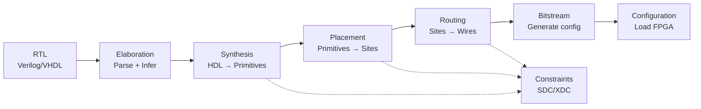

[← Home](../README.md) · [03 — Design Flow](README.md)

# Design Flow Overview — RTL to Configured FPGA

The FPGA design flow transforms human-readable HDL into a binary bitstream that configures every LUT, flip-flop, and switch in the device. This is not a single "compile" button — it's a six-stage pipeline where each stage makes irreversible optimization decisions that cascade into the next. Understanding what happens at each stage is the difference between a design that closes timing in one run and one that requires weeks of tool-fighting.

---

## Overview

The FPGA design flow has six stages: **elaboration** (parse HDL, infer structures), **synthesis** (map HDL to device primitives), **placement** (assign primitives to physical locations), **routing** (connect primitives through switch matrices), **bitstream generation** (encode configuration data), and **configuration** (load bitstream into device). Optional stages include **floorplanning** (manual placement directives), **timing analysis** (verify setup/hold), **power analysis** (estimate thermal), and **partial reconfiguration** (reconfigure a running region). Every vendor tool wraps these stages in a monolithic IDE (Vivado, Quartus, Diamond), but the underlying pipeline is universal — and understanding it at the command level enables CI/CD, reproducible builds, and cross-vendor portability.

---

## The Six-Stage Pipeline



### Stage 1: Elaboration

The tool parses all HDL files, resolves parameters/generics, expands generate blocks, and infers high-level structures (counters, RAMs, FSMs). Elaboration is fast (seconds) and produces an intermediate representation — typically an RTL netlist or technology-independent gate-level description.

### Stage 2: Synthesis

Synthesis maps the technology-independent gates onto the device's actual primitives: LUTs, FFs, BRAMs, DSPs, carry chains. This is where the tool decides whether your `reg [7:0] mem [0:255]` becomes BRAM or distributed RAM. Synthesis also performs logic optimization (constant folding, expression simplification, resource sharing) and can optionally apply retiming (move registers across combinational logic to balance pipeline stages).

### Stage 3: Placement

Synthesis produces a list of primitives with logical connections. Placement assigns each primitive to a specific physical site on the die (LUT → Slice X12Y34, BRAM → BRAM_X2Y0). The placer optimizes for wire length (shorter wires = lower delay) and congestion (avoiding routing hotspots). Placement is NP-hard — vendors use simulated annealing, analytical solvers, and iterative improvements.

### Stage 4: Routing

The router connects placed primitives through the switch matrix (see [Routing & Interconnect](../02_architecture/fabric/routing.md)). It selects specific wire segments and programmable switch points to create point-to-point connections. Routing is the most time-consuming stage (can be 50–70% of total compile time) and the most common source of timing failures.

### Stage 5: Bitstream Generation

The router's output is a list of configuration frames — binary data that sets every SRAM cell in the device. Bitstream generation encodes these frames into the vendor's proprietary format, optionally compresses and encrypts them, and writes the final `.bit` (Xilinx), `.sof` (Intel), or `.bit`/`.jed` (Lattice) file.

### Stage 6: Configuration

The bitstream is loaded into the FPGA through SPI flash, JTAG, or an external processor (see [Configuration & Bitstream](../02_architecture/infrastructure/configuration.md)). The device's internal state machine clears the configuration SRAM, loads the bitstream, validates CRC, and releases the global reset.

---

## Vendor Implementation Comparison

| Stage | Vivado (Xilinx) | Quartus Prime (Intel) | Diamond (Lattice) | Yosys + nextpnr |
|---|---|---|---|---|
| **Synthesis** | `synth_design` (Vivado synthesis) | `quartus_map` (analysis & synthesis) | `synpify` or Lattice LSE | `yosys` |
| **Placement** | `place_design` | `quartus_fit` (includes place) | `map` (includes place) | `nextpnr` (includes both) |
| **Routing** | `route_design` | Part of `quartus_fit` | `par` | `nextpnr` |
| **Bitstream** | `write_bitstream` | `quartus_asm` | `bitgen` | `ecppack` / `icepack` / `gowin_pack` |
| **Configuration** | `program_hw_device` (Vivado HW Manager) | `quartus_pgm` | Diamond Programmer | `openocd` or `iceprog` |
| **Constraints** | XDC (SDC superset) | SDC (.sdc) + QSF (.qsf) | LPF (Lattice Preference) | PCF (physical constraints) |

---

## Tcl Scripting and Non-Project Mode

All vendor tools support **non-project mode** — a Tcl-scripted flow where each stage is invoked as a command rather than through the IDE GUI. This is essential for CI/CD and reproducible builds:

```tcl
# Vivado non-project flow example
read_verilog top.v
read_xdc constraints.xdc
synth_design -top top -part xc7a35tcsg324-1
opt_design
place_design
route_design
write_bitstream -force top.bit
```

```tcl
# Quartus non-project flow (command line)
exec quartus_map top --source=top.v --family="Cyclone V"
exec quartus_fit top
exec quartus_asm top
exec quartus_sta top
```

> [!WARNING]
> **Project-mode Tcl scripts are not reproducible without the .xpr/.qpf file.** Use non-project mode for any design that must build identically on another machine or in CI.

---

## When to Use / When NOT to Use

### When to Use Each Flow

| Flow Type | Ideal Scenario |
|---|---|
| **GUI / Project Mode** | Development, debug, IP configuration, visual floorplanning |
| **Non-Project Tcl Mode** | CI/CD, automated builds, reproducible research |
| **Open-source (Yosys + nextpnr)** | iCE40, ECP5 designs where no vendor license is available; fast iteration |
| **Mixed (Yosys synthesis + vendor P&R)** | Yosys for synthesis (open, scriptable), vendor P&R for timing closure on Xilinx/Intel devices |

### When NOT to Use

| Scenario | Recommendation |
|---|---|
| Dumping from GUI to Tcl without testing | Vivado "write_project_tcl" output is not a clean non-project script. Rewrite minimally |
| Expecting Yosys+nextpnr timing numbers to match Vivado/Quartus | nextpnr timing analysis is less accurate on non-Lattice devices. Use vendor STA for sign-off |

---

## Recommended File Iteration Times

| Stage | 5K LUT Design | 100K LUT Design | Notes |
|---|---|---|---|
| **Elaboration** | <5 seconds | <30 seconds | Fastest stage |
| **Synthesis** | 10–60 seconds | 2–10 minutes | Scales linearly with code size |
| **Placement** | 30–120 seconds | 5–20 minutes | Hardest stage, NP-hard |
| **Routing** | 20–60 seconds | 5–30 minutes | Congestion-dependent |
| **Bitstream** | 5–30 seconds | 1–5 minutes | Fast, encryption adds time |
| **Total (first run)** | 1–4 minutes | 10–60 minutes | Vendor + device dependent |
| **Incremental** | 10–30 seconds | 1–10 minutes | Reuses previous placement/routing |

---

## References

| Source | Document |
|---|---|
| Vivado Design Suite Tcl Command Reference | UG835 |
| Quartus Prime Pro Edition Handbook | Intel FPGA Documentation |
| Yosys Manual | https://yosyshq.readthedocs.io/ |
| nextpnr Documentation | https://github.com/YosysHQ/nextpnr |
| [Synthesis deep dive](synthesis.md) | Next article |
| [Place & Route](place_and_route.md) | Placement and routing details |
| [Project Structure](project_structure.md) | Directory layout and versioning |
