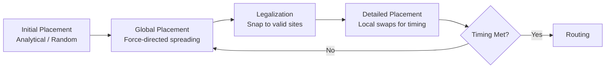

[← Home](../README.md) · [03 — Design Flow](README.md)

# Place & Route — Physical Implementation

Placement assigns every LUT, FF, BRAM, and DSP to a specific physical site. Routing connects them through the switch matrix. This two-stage process determines whether your design meets timing — and it consumes 50–70% of total compile time. Understanding how the placer and router make decisions lets you guide them toward convergence instead of fighting them blind.

---

## Overview

After synthesis produces a netlist of device primitives, the **placer** maps each primitive to a unique site on the die — LUTs to specific Slice locations, BRAMs to specific column positions, DSPs to specific DSP sites. The **router** then connects these placed primitives through the programmable interconnect, selecting specific wire segments and switch points. Both stages optimize for timing (meeting setup/hold constraints) and routability (leaving enough routing resources for other connections). Placement is NP-hard — vendors use simulated annealing, analytical placement (solving quadratic equations for force-directed spreading), and multi-level clustering. Routing is also NP-hard and typically uses PathFinder — a negotiation-based algorithm that iteratively rips up and reroutes congested connections.

---

## Placement: Primitives to Sites

### Optimization Objectives

| Objective | How the Placer Achieves It |
|---|---|
| **Minimize wire length** | Place connected primitives close together |
| **Minimize congestion** | Spread logic evenly across the die |
| **Meet timing constraints** | Place critical path primitives close; non-critical paths can be farther |
| **Respect site constraints** | DSPs must go in DSP columns; BRAMs in BRAM columns; IO in IO banks |
| **Honor pblock/LogicLock directives** | User-defined regions constrain placement |

### Placement Algorithms



**Analytical placement:** Model the netlist as a system of springs (connected primitives attract each other) and solve for equilibrium. This produces a dense, overlapping placement with optimal wire length but severe overlap.

**Legalization:** Spread the overlapping primitives to valid sites while minimizing displacement. This is the hardest sub-problem — algorithms minimize quadratic wire length with spreading forces.

**Detailed placement:** Local swaps (exchange two LUTs, move one LUT to an adjacent site) to improve a specific critical path.

### Placement Constraints

```tcl
# Xilinx pblock: constrain logic to a physical region
create_pblock pblock_dsp_core
add_cells_to_pblock pblock_dsp_core [get_cells dsp_core/*]
resize_pblock pblock_dsp_core -add {SLICE_X20Y50:SLICE_X40Y75 DSP48_X2Y10:DSP48_X4Y15}

# Intel LogicLock: similar region-based constraint
set_instance_assignment -name PLACE_REGION "X20 Y50 X40 Y75" -to dsp_core
```

---

## Routing: Sites to Wires

### The PathFinder Algorithm

PathFinder is the dominant FPGA routing algorithm. It works iteratively:

1. **Route every net** using the shortest path (ignoring congestion)
2. **Calculate congestion cost** for every routing resource based on overuse
3. **Rip up and reroute** congested nets, with higher cost for congested resources
4. **Repeat** until no resources are overused or iteration limit is reached

The key insight: PathFinder negotiates — congested resources become progressively more "expensive," forcing nets to find alternative paths. This converges to a legal routing in 10–50 iterations for most designs.

### Why Routing Fails

| Failure Mode | Symptom | Root Cause |
|---|---|---|
| **Congestion** | Router cannot complete; unresolved overuse | Too many signals in too small a region. >80% LUT utilization |
| **Timing** | All nets routed but timing not met | Long detours around congested regions added delay |
| **Hold violations** | Router introduces very short paths (fast) | Hold time violations on short paths; fix with `set_min_delay` |

### Routing Directives

| Vivado Directive | Effect |
|---|---|
| `-directive Explore` | Aggressive exploration of routing alternatives; longer runtime |
| `-directive AggressiveExplore` | Very aggressive; for congested designs |
| `-directive NoTimingRelaxation` | Maintain timing-critical nets at cost of runtime |
| `-directive RuntimeOptimized` | Faster routing, less exploration; use for early iterations |

---

## Timing-Driven Placement & Routing

Modern P&R is timing-driven — the placer and router are aware of clock constraints (from SDC/XDC) and prioritize critical paths:

1. **Timing analysis runs after placement** — estimates routing delay using wire-load models (pre-routing) or actual routed delays (post-routing)
2. **Slack is calculated** — negative slack = timing violation
3. **Critical paths** (most negative slack) receive priority in detailed placement and routing
4. **Iterative improvement** — place → estimate timing → adjust → route → analyze → rip-up-and-reroute

---

## Vendor-Specific P&R

| Feature | Vivado | Quartus Prime | nextpnr |
|---|---|---|---|
| **Placement engine** | Analytical + simulated annealing | Analytical + iterative refinement | Simulated annealing |
| **Routing engine** | PathFinder variant | PathFinder variant | PathFinder-like |
| **Timing-driven** | Yes (full STA integration) | Yes (TimeQuest STA) | Partial (static timing for some devices) |
| **pblock equivalent** | pblock constraints | LogicLock regions | PCF `BEL` constraints |
| **Incremental P&R** | Yes (checkpoint-based) | Yes (Rapid Recompile) | No (full re-run) |
| **GUI view** | Device View (placed design) | Chip Planner | nextpnr GUI |
| **Congestion map** | Yes (report_congestion) | Yes (Chip Planner congestion) | No (simulated annealing inherently less congested at low util) |

---

## Best Practices & Antipatterns

### Best Practices
1. **Target ≤70% LUT utilization** — Above 70%, routing congestion increases geometrically. The placer has room to spread critical paths
2. **Run early P&R with relaxed constraints** — First P&R at 50% target fMAX. If it passes, tighten. This reveals the true critical paths before you spend hours optimizing non-critical ones
3. **Use incremental P&R** — After a small RTL change, incremental P&R reuses the previous placement and only reroutes affected nets. Cuts iteration time by 80%
4. **Check congestion map before final routing** — Vivado `report_congestion` and Quartus Chip Planner show hotspots. If a region is red, floorplan before routing fails

### Antipatterns

| Antipattern | The Problem | The Fix |
|---|---|---|
| **"The Over-Packer"** | Targeting 95% LUT utilization to save device cost | Routing fails. The engineering time lost to timing closure exceeds the device cost savings. Target 70% |
| **"The Runtime Martyr"** | Accepting 4-hour P&R runs without investigating why | Long runtime usually means congestion or timing loop. Check utilization; floorplan congested regions; simplify constraints |
| **"The Directive Churn"** | Randomly trying different P&R directives (`Explore`, `AggressiveExplore`, `Performance`) | Use `Default` first. If it fails, try `Explore`. `AggressiveExplore` is a last resort for highly congested designs. Churning wastes time |
| **"The Unconstrained Cross-Chip"** | Allowing 256-bit bus to be placed anywhere across the die | The placer spreads the bus bits, creating a web of long nets. Use pblock to constrain the bus to a tight region |

---

## Pitfalls & Common Mistakes

### 1. Congestion From DSP Concentration

**The mistake:** Instantiate 64 DSPs all in one module, expecting the placer to spread them evenly.

**Why it fails:** All DSPs are in columns. If the placer packs all 64 into one column, routing from fabric to DSP saturates. The router cannot complete.

**The fix:** Use pblock regions to distribute DSPs across 2–4 columns. Even 2 columns of 32 DSPs dramatically reduces congestion.

### 2. Hold Violations After Routing

**The mistake:** Design meets setup timing but fails hold timing after routing.

**Why it fails:** The router created very short paths that are faster than the clock period. Data arrives before the hold window closes at the destination FF.

**The fix:** Add `set_min_delay` constraints on short paths or add delay buffers (LUTs configured as delay elements). Most tools auto-fix minor hold violations by inserting routing detours. Severe hold violations usually mean missing `set_clock_groups` for async clocks.

---

## References

| Source | Document |
|---|---|
| Vivado UG904 — Implementation | https://docs.xilinx.com/ |
| L. McMurchie & C. Ebeling, "PathFinder: A Negotiation-Based Performance-Driven Router for FPGAs" (1995) | FPGA '95 |
| nextpnr Documentation | https://github.com/YosysHQ/nextpnr |
| [Synthesis](synthesis.md) | Previous stage |
| [Bitstream](bitstream.md) | Next stage |
| [Floorplanning](floorplanning.md) | Manual placement directives |
| [Routing Architecture](../02_architecture/fabric/routing.md) | How the FPGA interconnect works |
