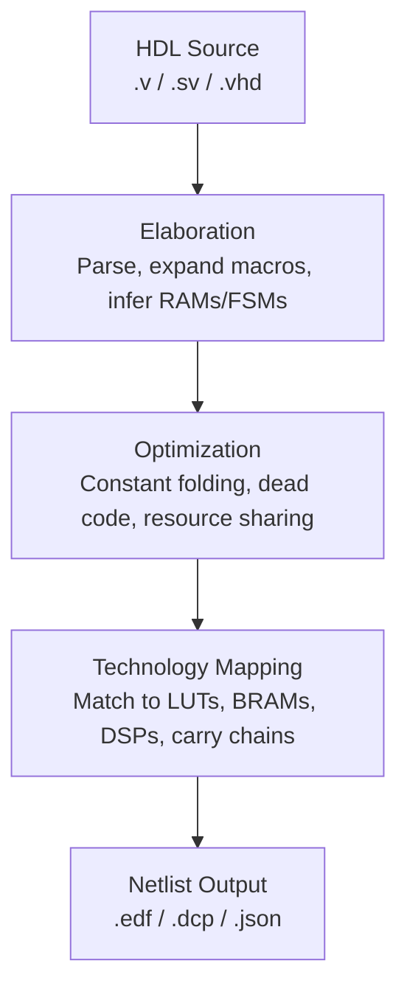

[← Home](../README.md) · [03 — Design Flow](README.md)

# Synthesis — HDL to Device Primitives

Synthesis is where your abstract Verilog/VHDL becomes real FPGA hardware. The synthesis engine reads your RTL, infers what hardware structures you described (intentionally or not), and maps them onto the device's primitives: LUTs, FFs, BRAMs, DSPs. Understanding what synthesis does — and doesn't — infer is critical, because synthesis bugs are silent: the tool generates hardware for exactly what you wrote, not what you meant.

---

## Overview

Synthesis transforms behavioral RTL into a technology-mapped netlist. It performs three phases: **elaboration** (parse, expand parameters, infer macros), **optimization** (constant folding, expression simplification, dead code elimination, FSM extraction), and **technology mapping** (match optimized logic to LUTs, BRAMs, DSPs). The output is a list of device primitives with logical connections — no physical locations yet. The quality of synthesis directly determines area (LUT count), speed (logic levels on critical paths), and power (switching activity). A well-written synthesis constraint file (or well-placed HDL attributes) can reduce LUT count by 30% and improve fMAX by 50%.

---

## Synthesis Tools Across Vendors

Every FPGA vendor provides its own synthesis engine, each with different lineage, strengths, and quirks. Knowing which engine you're targeting changes how you write directives, interpret warnings, and debug inference failures.

| Vendor | Synthesis Engine | Underlying Technology | Notes |
|---|---|---|---|
| **Xilinx/AMD** | Vivado Synthesis | In-house (successor to XST) | Tightly integrated with Vivado; excellent DSP/BRAM inference; supports SystemVerilog synthesis subsets |
| **Intel/Altera** | Quartus Prime Synthesis | In-house (Integrated Synthesis) | Supports VHDL-2008 and SystemVerilog; strong FSM extraction; retiming via global assignment |
| **Lattice** | Lattice Synthesis Engine (LSE) / Synplify Pro | In-house (LSE) or Siemens Synplify Pro | LSE is free and integrated; Synplify Pro (paid) often yields +10–20% fMAX on ECP5/CrossLink-NX |
| **Gowin** | GowinSynthesis / Synplify Pro | In-house (GowinSynthesis) or Siemens Synplify Pro | GowinSynthesis is the free default; Synplify Pro available for high-performance designs on Arora |
| **Microchip** | Synplify Pro (bundled in Libero SoC) | Siemens Synplify Pro | Libero SoC bundles Synplify Pro for all PolarFire/SmartFusion2/IGLOO2 families; no in-house alternative |
| **Efinix** | Efinity Synthesis | In-house | Integrated with Efinity IDE; optimized for Trion/Titanium architecture; supports Verilog/SystemVerilog/VHDL |
| **Open Source** | Yosys | Community-developed | Vendor-agnostic; supports synth_xilinx, synth_intel_alm, synth_ecp5, synth_gowin, synth_ice40; backbone of F4PGA/SymbiFlow |

> [!NOTE]
> **Synplify Pro** appears under three vendors (Lattice, Gowin, Microchip) — same engine, different device libraries. Synplify Pro generally produces 10–25% better fMAX than vendor in-house engines but adds license cost (~$3,000+/year) and a separate tool in the workflow.

### Choosing a Synthesis Engine

| Your Situation | Recommended Engine |
|---|---|
| Hobbyist, open-source toolchain | Yosys + nextpnr |
| Gowin LittleBee, low-cost | GowinSynthesis (free, good enough) |
| Gowin Arora, performance-critical | Synplify Pro |
| Lattice iCE40/ECP5, open-source friendly | Yosys (has best-in-class iCE40/ECP5 support) |
| Lattice CrossLink-NX/CertusPro-NX, timing-critical | Synplify Pro |
| Microchip PolarFire (any design) | Synplify Pro (only option in Libero) |
| Xilinx 7-series/UltraScale+ | Vivado Synthesis (only practical option) |
| Intel Cyclone V/MAX 10/Arria 10 | Quartus Integrated Synthesis (only practical option) |
| Efinix Trion/Titanium | Efinity Synthesis (only option) |

---

## The Synthesis Pipeline



### Phase 1: Elaboration

- Expands `generate`, `for` loops, parameter/generic overrides
- Infers RAM (BRAM vs distributed), ROM, shift registers (SRL)
- Recognizes FSMs (for optimized encoding) and DSP macros (multiply-accumulate)
- Produces a technology-independent gate-level netlist

### Phase 2: Optimization

| Optimization | What It Does | When It Helps |
|---|---|---|
| **Constant folding** | `assign x = 2 + 3` → `assign x = 5` | Simplifies compile-time expressions |
| **Dead code elimination** | Removes unreachable branches, unused outputs | Clean up after parameterization |
| **Resource sharing** | Two unused-at-the-same-time multipliers → one DSP | Reduces area for time-multiplexed operations |
| **Retiming** | Moves registers across combinational logic | Balances pipeline stages, improves fMAX |
| **FSM extraction** | Recognizes state machine patterns, applies one-hot/binary encoding | Reduces LUTs for large state machines |

### Phase 3: Technology Mapping

Maps the optimized gates to the target device's primitives:

| RTL Construct | Xilinx | Intel | Lattice | Gowin | Microchip | Yosys (target) |
|---|---|---|---|---|---|---|
| `reg [7:0] mem [0:255]` | BRAM36 or distributed RAM | M20K or MLAB | EBR or distributed | BSR or distributed | LSRAM or uSRAM | BRAM or distributed (target-dependent) |
| `assign p = a * b` | DSP48E2 | Variable-precision DSP | sysDSP | MULT18X18 / DSP slice | Math block (18×18 MAC) | DSP block (target-dependent) |
| `a + b` (same clock) | CARRY4 chain | Carry chain in ALM | Ripple mode | CARRY chain | Carry chain | Carry chain (target-dependent) |
| `assign s = {a, b}` | LUTs (concatenation) | LUTs | LUTs | LUTs | LUTs | LUTs |
| `assign s = a >> b` (variable) | Barrel shifter in LUTs | Barrel shifter in LUTs | Barrel shifter in LUTs | Barrel shifter in LUTs | Barrel shifter in LUTs | Barrel shifter in LUTs |
| `reg [N:0] srl [0:D-1]` | SRL32/SRL64 (LUT RAM) | SRL in ALM | Distributed RAM | Distributed RAM | Distributed RAM | $__SHIFTREG (target-dependent) |

---

## Synthesis Directives

### Vendor-Neutral (Verilog Attributes)

```verilog
(* ram_style = "block" *) reg [7:0] mem [0:255];       // Force BRAM
(* ram_style = "distributed" *) reg [7:0] rf [0:15];    // Force LUT RAM
(* use_dsp = "yes" *) wire [35:0] product = a * b;      // Force DSP
(* use_dsp = "no" *) wire [7:0] small = a * b;           // Force LUTs
(* keep = "true" *) wire debug_signal;                    // Prevent optimization removal
(* dont_touch = "true" *) module critical_path (...);    // Prevent flattening
(* max_fanout = 64 *) reg clk_en;                        // Limit fanout
```

### Vendor-Specific

| Directive | Xilinx | Intel | Lattice (LSE) | Gowin (GowinSynthesis) | Microchip (Synplify Pro) | Yosys |
|---|---|---|---|---|---|---|
| Force BRAM | `(* ram_style = "block" *)` | `(* ramstyle = "M10K" *)` | `(* syn_ramstyle = "block_ram" *)` | `(* syn_ramstyle = "block_ram" *)` | `(* syn_ramstyle = "block_ram" *)` | `(* ram_style = "block" *)` (via synprop) |
| Force DSP | `(* use_dsp = "yes" *)` | `(* multstyle = "dsp" *)` | `(* mult_style = "dsp" *)` | `(* syn_multstyle = "dsp" *)` | `(* syn_multstyle = "dsp" *)` | `(* use_dsp = "yes" *)` (via synprop) |
| FSM encoding | `(* fsm_encoding = "one_hot" *)` | `(* fsm_encoding = "one_hot" *)` | `(* syn_encoding = "onehot" *)` | `(* syn_encoding = "onehot" *)` | `(* syn_encoding = "onehot" *)` | `-fsm_encoding onehot` (Yosys CLI) |
| Retiming | `-retiming` (synth_design) | `set_global_assignment -name ALLOW_REGISTER_RETIMING ON` | N/A (LSE) / `-retiming` (Synplify) | N/A (GowinSynthesis) / `-retiming` (Synplify) | `-retiming` (Synplify) | Not yet supported in Yosys |
| Resource sharing | `-resource_sharing auto` | `set_global_assignment -name AUTO_RESOURCE_SHARING ON` | Auto (LSE) / `-resource_sharing on` (Synplify) | Auto | `-resource_sharing on` (Synplify) | Auto |

---

## Synthesis Reports: What to Check

### Utilization Report

```
+-------------------------+------+-------+-----------+--------+
| Resource                | Used | Avail | % Used    | Notes  |
+-------------------------+------+-------+-----------+--------+
| Slice LUTs              | 8450 | 20800 | 40.6%     | OK     |
| Slice Registers         | 4100 | 41600 | 9.8%      | Low    |
| Block RAM Tile          | 12   | 50    | 24.0%     | OK     |
| DSP48E1                 | 8    | 90    | 8.8%      | OK     |
| BUFG                    | 3    | 32    | 9.4%      | OK     |
+-------------------------+------+-------+-----------+--------+
```

> [!WARNING]
> **Flip-flop utilization below ~30% of LUT utilization** indicates unregistered logic or poor pipelining. Each LUT should pair with at least one FF for efficient packing.

### Synthesis Warnings to Never Ignore

| Warning | Meaning | Fix |
|---|---|---|
| `LATCH inferred` | Incomplete `case` or `if` created a latch | Add default assignment or `else` branch |
| `Black box module` | Module not found; treated as external | Check file list; add missing source |
| `Truncated value` | Width mismatch in assignment | Check signal widths; intentional truncation? |
| `Unconnected port` | Module instance port not connected | Verify port list; open ports may float |
| `DSP inference failed` | Tool wanted to use DSP but couldn't fit | Check operand widths; simplify expression or force DSP with pragma |

---

## Best Practices & Antipatterns

### Best Practices
1. **Write RTL with synthesis in mind** — Every `always @(posedge clk)` block should have a reset or default assignment. Incomplete conditionals create latches
2. **Check synthesis warnings before P&R** — Latches, black boxes, and width mismatches in the synthesis log will become timing failures in P&R
3. **Use `-retiming` for pipeline-heavy designs** — Retiming moves registers across combinational logic to balance pipeline stages, often improving fMAX by 20–40%
4. **Review the schematic viewer** — Every vendor tool (Vivado, Quartus, Diamond/Radiant, Gowin EDA, Libero SoC, Efinity) has an RTL/schematic viewer. Verify that a state machine actually looks like a state machine; if it doesn't, synthesis inferred something you didn't intend

### Antipatterns

| Antipattern | The Problem | The Fix |
|---|---|---|
| **"The Latch Lagoon"** | Incomplete `case` or `if-else` with no default assignment | Always add `default:` or final `else` assignment. Latches are almost never intentional |
| **"The Async Reset Everywhere"** | Adding async reset to every register | Async reset prevents packing into BRAM/DSP output registers. Use sync reset unless async reset is a physical requirement |
| **"The Combinatorial Loop"** | `assign a = b; assign b = a;` or feedback without a register | Synthesis reports "combinatorial loop detected." Always insert a register in feedback paths |
| **"The Black Box Surprise"** | Missing a source file; the tool treats the module as external | Check the file list. Black boxes are valid for hard IP (PLLs, transceivers) but never for your RTL |
| **"The DSP Denial"** | Forcing `(* use_dsp = "no" *)` globally because "DSPs are expensive" | DSPs are free if unused. Let the tool decide; override only for specific cases (e.g., 4×4 multiply) |

---

## Pitfalls & Common Mistakes

### 1. Width Mismatch Creates Silent Bugs

**The mistake:** `assign sum = a + b;` where `a` is 8 bits and `b` is 8 bits, but `sum` is 8 bits. The 9th bit (carry-out) is silently truncated.

**Why it fails:** Synthesis warns about truncation, but the warning is easy to miss among hundreds of lines. The design works until `a + b > 255`.

**The fix:** `assign sum = {1'b0, a} + {1'b0, b};` — explicit width extension before arithmetic.

### 2. Auto-Inferred RAM With Wrong Width/Depth

**The mistake:** `reg [31:0] mem [0:1023];` expecting BRAM, but synthesis infers two BRAMs because the width exceeds one BRAM's native width.

**Why it fails:** BRAM36 has max 36-bit width at ×1K depth. 32-bit width at 1K depth fits in one BRAM36. But if `mem` is `[31:0]`, some tools infer one BRAM. If depth grows to 2K, two BRAMs cascade.

**The fix:** Use `(* ram_style = "block" *)` to guarantee BRAM inference. Check the synthesis report for BRAM count — it should match your expectation.

---

## References

| Source | Document |
|---|---|
| Xilinx UG901 — Vivado Synthesis Guide | https://docs.xilinx.com/r/en-US/ug901-vivado-synthesis |
| Intel Quartus Prime Synthesis Manual | https://www.intel.com/content/www/us/en/docs/programmable/ |
| Lattice LSE Reference Guide | Lattice FPGA Synthesis (LSE) documentation |
| Lattice Synplify Pro for Lattice | Siemens / Lattice joint documentation |
| Gowin GowinSynthesis User Guide (SUG550) | https://www.gowinsemi.com/en/support/documentation/ |
| Microchip Libero SoC User Guide | https://www.microchip.com/en-us/products/fpgas-and-plds/design-resources |
| Efinix Efinity Synthesis Guide | https://www.efinixinc.com/support/docs.php |
| Yosys Manual — synth_xilinx / synth_intel_alm / synth_ecp5 / synth_gowin | https://yosyshq.readthedocs.io/ |
| [Inference Rules](../04_hdl_and_synthesis/inference_rules.md) | What HDL infers what hardware — cross-vendor reference |
| [Place & Route](place_and_route.md) | Next stage after synthesis |
| [Design Flow Overview](overview.md) | Six-stage pipeline |
