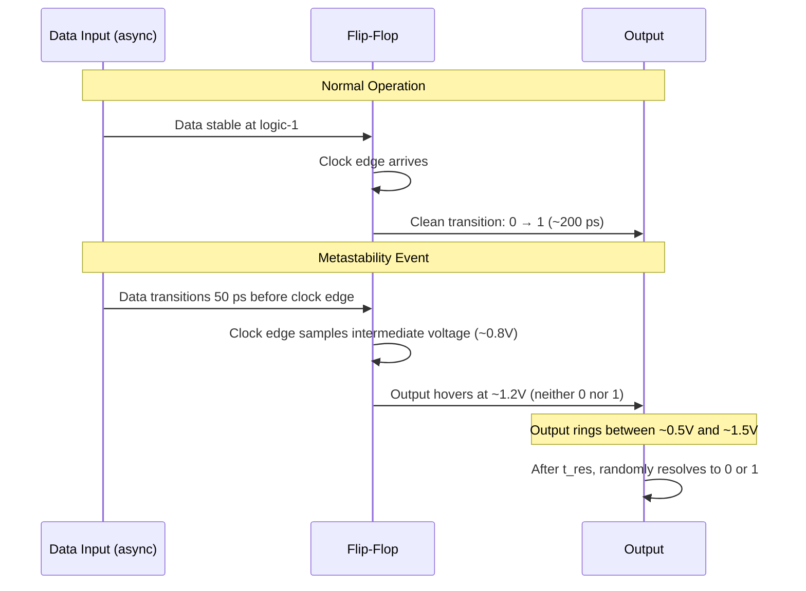
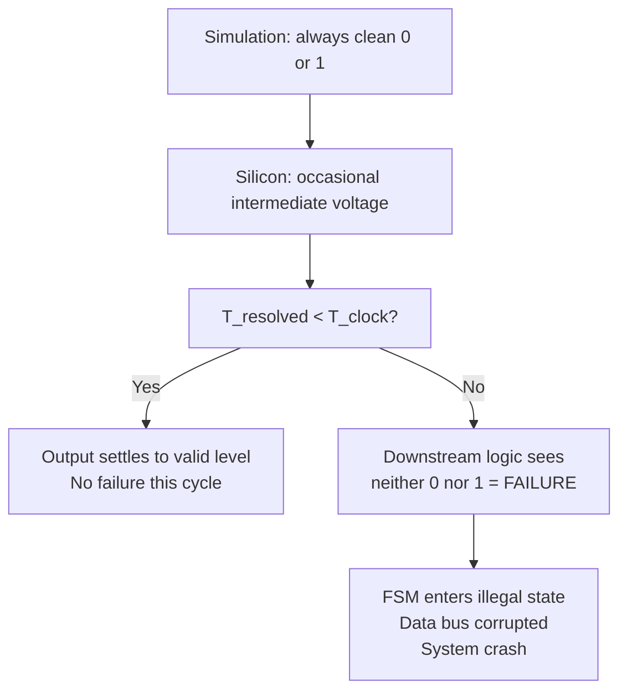

[← HDL & Synthesis Home](README.md) · [← Project Home](../README.md)

# Clock Domain Crossing (CDC) — Coding Patterns

Clock Domain Crossing is the transfer of a signal from a register clocked by one clock to a register clocked by another, asynchronous clock. CDC is the single most common source of **intermittent, unreproducible** FPGA bugs because metastability behaves statistically — a design can work for millions of cycles and then fail.

```
┌─────────────────┐                  ┌─────────────────┐
│   Domain A      │                  │   Domain B      │
│   clk_a @ 50MHz │                  │   clk_b @ 100MHz│
│   (independent  │      data        │   (independent  │
│    oscillator)  ├─────────────────►│    oscillator)  │
│                 │   no fixed phase │                 │
│   [registers]   │   relationship   │   [registers]   │
└─────────────────┘                  └─────────────────┘
         ↑                                      ↑
    Any signal leaving this domain         Sampling an async signal
    has no guaranteed timing relative      risks setup/hold violation
    to the destination clock
```

### Clock Relationships Matter

Not all cross-clock paths are equally dangerous:

| Relationship | Example | CDC Required? |
|---|---|---|
| **Synchronous** | Same clock, same phase | No |
| **Related (integer multiple)** | 100 MHz and 50 MHz from same PLL | Usually no — use multi-cycle constraints |
| **Mesochronous** | Same frequency, unknown phase (clock distribution skew) | Minimal — phase is bounded |
| **Asynchronous** | Independent oscillators; no phase/frequency relationship | **Yes — full CDC treatment** |

This article addresses the **asynchronous** case.

---

## Metastability Dictionary

Before diving into the root cause, a shared vocabulary:

| Term | Definition |
|---|---|
| **Metastable state** | A flip-flop output that is neither a valid logic `0` nor logic `1` — oscillating or hovering at an intermediate voltage between V<sub>IL</sub> and V<sub>IH</sub> |
| **Setup time (t<sub>su</sub>)** | The minimum time **before** the active clock edge that the data input must be stable and valid |
| **Hold time (t<sub>h</sub>)** | The minimum time **after** the active clock edge that the data input must remain stable |
| **Setup-and-hold window** (aperture window) | The critical interval `[t_clk − t_su, t_clk + t_h]` around the sampling clock edge. Any data transition inside this window triggers metastability |
| **Resolution time (t<sub>res</sub>)** | The time the flip-flop output takes to resolve from a metastable voltage to a clean, valid logic level. This is **probabilistic** — there is no guaranteed maximum |
| **Settling time constant (τ)** | A device-specific parameter (picoseconds) characterizing how fast a metastable output converges. Smaller τ = faster resolution = higher MTBF |
| **MTBF** | Mean Time Between Failures — the statistical average time between metastability-induced functional failures, measured in years (or seconds for an unsynchronized path) |
| **Synchronizer** | A circuit that reduces metastability failure probability to an acceptable level — typically 2 or 3 cascaded flip-flops, giving the signal extra time to resolve before use |

---

## Metastability: The Root Cause

### When It Happens — Timing Diagrams

A flip-flop samples its D input on the active clock edge. The data must be stable throughout the entire setup-and-hold window. When an asynchronous signal arrives with no fixed phase relationship to the sampling clock, it **will** occasionally violate this window.

**Normal Operation** (data stable across the window):
```
CLK     ▁▁▁▁/▔▔▔▔\▁▁▁▁/▔▔▔▔\▁▁▁▁/▔▔▔▔\▁▁▁▁
DATA    ▔▔▔▔▔▔▔▔▔▔▔▔▔▔▔▔▔▔▔▔▔▔▔▔▔▔▔▔▔▔▔▔▔▔▔
        ├── t_su ──┤├ t_h ┤
                     ↑ sampling edge — data is cleanly sampled as '1'
Q       ▁▁▁▁▁▁▁▁▁▁▁▁▁/▔▔▔▔▔▔▔▔▔▔▔▔▔▔▔▔▔▔▔▔
                     ↑ output cleanly transitions to '1'
```

**Setup/Hold Violation → Metastability**:
```
CLK     ▁▁▁▁/▔▔▔▔\▁▁▁▁/▔▔▔▔\▁▁▁▁/▔▔▔▔\▁▁▁▁
DATA    ▔▔▔▔▔▔▔▔▔\▁▁▁▁▁▁▁▁▁▁▁▁▁▁▁▁▁▁▁▁▁▁▁▁
                    ↑ DATA transitions inside setup window — violation!
Q       ▁▁▁▁▁▁▁▁▁▁▁▁/▔\▁/▔\▁▁/▔▔▔▔▔▔▔▔▔▔
                    ↑ output oscillates, randomly settles to 0 or 1
```

### How It Happens — Inside the Flip-Flop



A flip-flop is fundamentally a **bistable element** (two cross-coupled inverters). Under normal conditions, positive feedback drives the output rapidly to one rail (0 or 1). When the input changes inside the setup-and-hold window, the internal nodes are left at nearly equal voltages — the feedback loop has **no clear winner**. The circuit lingers in this quasi-stable equilibrium, with thermal noise eventually nudging it toward one rail. The resolution time is governed by:

```
V_out(t) = V_initial × e^(t / τ)
```

Where `V_initial` is the voltage difference from the metastable equilibrium point and `τ` is the device time constant (typically 1–10 ps in modern FPGA fabrics).

### Why It's So Dangerous

**1. It cannot be eliminated — only managed.** Every asynchronous input **will** violate setup/hold eventually. The question is not *if* but *how often*, and whether the MTBF is acceptable for the application.

**2. It is invisible in RTL simulation.** Most simulators model flip-flops as ideal sampling elements — if data changes at exactly the clock edge, the simulator uses a deterministic rule (e.g., sample the pre-edge value). Silicon has no such rule. A design that passes simulation perfectly can fail intermittently on hardware.



**3. Failure is statistical and intermittent.** A design can work for millions of cycles before a single metastability event propagates through. This makes CDC bugs the hardest to debug — they rarely reproduce on demand. The MTBF formula quantifies the risk:

```
MTBF = e^(T_resolution / τ) / (f_clock × f_data × T_window)
```

Where `T_resolution` is the time allowed for the signal to settle (typically one clock period) and `τ` is the device-specific metastability resolution time constant.

A typical unsynchronized path on a modern FPGA (f<sub>clock</sub> = 200 MHz, f<sub>data</sub> = 10 MHz, τ ≈ 5 ps, T<sub>resolution</sub> ≈ 5 ns) has an MTBF measured in **seconds**. Adding a single synchronizer flip-flop (doubling T<sub>resolution</sub> to ~10 ns) pushes MTBF to **millions of years**.

**Every additional synchronizer flip-flop exponentially increases MTBF.** Two flip-flops in series is the industry standard minimum; three for safety-critical designs (automotive, medical, aerospace).

---

## Synchronizers: The Solution

A synchronizer is a chain of flip-flops clocked by the destination domain. It does not prevent metastability — nothing can — but it gives the metastable output additional time to resolve to a valid level before the signal is used by downstream logic. The following patterns show how to build synchronizers for different signal types and data rates.

---

## Pattern 1: 2-FF Synchronizer (Level Signal, Single-Bit)

The simplest and most fundamental CDC pattern. Works only for **single-bit signals**.

**Verilog:**
```verilog
(* ASYNC_REG = "TRUE" *) reg [1:0] sync_ff;

always @(posedge dst_clk) begin
    sync_ff <= {sync_ff[0], async_signal};
end

wire sync_out = sync_ff[1]; // Safe to use in dst_clk domain
```

**VHDL:**
```vhdl
signal sync_ff : std_logic_vector(1 downto 0);
attribute ASYNC_REG : string;
attribute ASYNC_REG of sync_ff : signal is "TRUE";

signal sync_out : std_logic;

process(dst_clk)
begin
    if rising_edge(dst_clk) then
        sync_ff <= sync_ff(0) & async_signal;
    end if;
end process;

sync_out <= sync_ff(1); -- Safe to use in dst_clk domain
```

### Critical Rules

1. **Source signal must be registered** — never synchronize the output of combinational logic directly. Combinational glitches can be sampled by the destination clock and propagate as false transitions.
2. The `ASYNC_REG` attribute is **mandatory** — without it, the tool may optimize away or replicate the registers
3. Place the two FFs **physically adjacent** — if separated across the die, the metastable output travels a long wire, consuming resolution time before the second FF samples it
4. Fan-out only from the **second** flip-flop — never use the first FF's output for logic
5. No combinational logic between the synchronizer stages — no gates, no LUTs, just wire
6. Declare a **false path** on the first stage — the path from the async input to the first synchronizer FF is intentionally metastable; timing analysis on it is meaningless and creates noise:

```tcl
# XDC: exclude the first synchronizer stage from timing analysis
set_false_path -from [get_ports async_signal] -to [get_cells sync_ff_reg[0]]
```

### 3-FF Variant (Safety-Critical)

For high-reliability applications (automotive, medical, aerospace), add a third flip-flop:

```verilog
(* ASYNC_REG = "TRUE" *) reg [2:0] sync_ff; // 3-stage for safety
```

---

## Pattern 1.5: Pulse Synchronizer (Single-Cycle Event)

The 2-FF synchronizer works for **level signals** — signals that remain stable for many destination clock cycles. It does **not** work for single-cycle pulses.

If a source domain asserts a signal for exactly one `src_clk` cycle, the destination clock may:
- **Miss it entirely** (pulse narrower than one `dst_clk` period)
- **See it stretched** (pulse sampled across multiple `dst_clk` edges)

The solution: **toggle synchronizer** + edge detector.

### How It Works

1. **Source domain**: Toggle a flag bit on each event
2. **Synchronize**: Pass the toggled bit through a 2-FF synchronizer
3. **Destination domain**: Detect the edge (XOR of current and delayed sample)

### Verilog

```verilog
// Source domain — toggle on event
reg toggle_flag;
always @(posedge src_clk) begin
    if (event_pulse)
        toggle_flag <= ~toggle_flag;
end

// Destination domain — 2-FF sync + edge detect
(* ASYNC_REG = "TRUE" *) reg [1:0] toggle_sync;
always @(posedge dst_clk)
    toggle_sync <= {toggle_sync[0], toggle_flag};

wire pulse_detected = toggle_sync[1] ^ toggle_sync[0];
```

### When to Use

| Signal Type | Use |
|---|---|
| Level (stable for many cycles) | 2-FF synchronizer (Pattern 1) |
| Single-cycle pulse / event flag | Pulse synchronizer (this pattern) |
| Periodic strobe with known rate | Either pattern; ensure pulse is wide enough |

---

## Pattern 2: Multi-Bit Bus Crossing (Gray Code + 2-FF)

**Never apply the 2-FF pattern to a multi-bit bus.** Each bit settles independently, so different bits resolve on different clock cycles — the destination sees a corrupt, transient value that never existed in the source domain.

The solution: **Gray code encoding** + 2-FF synchronizer.

Gray code changes only **one bit at a time** when incrementing. Even if that single bit is metastable, the destination sees either the old value or the new value — never an intermediate, multi-bit corrupted state.

### Verilog: Binary-to-Gray Converter

```verilog
// Binary to Gray
wire [WIDTH-1:0] gray_ptr = bin_ptr ^ (bin_ptr >> 1);

// Synchronize each Gray bit independently
(* ASYNC_REG = "TRUE" *) reg [WIDTH-1:0] gray_sync [0:1];
always @(posedge dst_clk) begin
    gray_sync[0] <= gray_ptr;
    gray_sync[1] <= gray_sync[0];
end

// Gray to Binary (in destination domain)
function [WIDTH-1:0] gray2bin;
    input [WIDTH-1:0] g;
    integer i;
    begin
        gray2bin[WIDTH-1] = g[WIDTH-1];
        for (i = WIDTH-2; i >= 0; i = i - 1)
            gray2bin[i] = gray2bin[i+1] ^ g[i];
    end
endfunction

wire [WIDTH-1:0] safe_ptr = gray2bin(gray_sync[1]);
```

### When Gray Code Works

Gray code is safe for CDC when:
- The multi-bit value **increments by exactly 1** (counters, FIFO pointers)
- The destination clock is **at least 1.5× faster** than the source clock (ensures at least one destination edge between source transitions)

Gray code does **NOT** work for arbitrary data buses. For that, use an async FIFO.

---

## Pattern 3: Asynchronous FIFO

The async FIFO is the workhorse of multi-bit CDC. It uses **dual-clock Block RAM** with independently clocked read and write ports, plus Gray-coded pointer synchronization.

### Architecture

```
Source Domain (wr_clk)              Destination Domain (rd_clk)
┌───────────────────┐                ┌──────────────────┐
│ wr_data ──► Dual  │                │ Dual ◄── rd_data │
│ wr_addr ◄── Port  │◄── DATA ──────►│ Port  ◄── rd_addr│
│           BRAM    │                │       BRAM       │
└───────────────────┘                └──────────────────┘
        │                                    │
   wr_ptr (bin)                         rd_ptr (bin)
        │                                    │
   bin2gray                             bin2gray
        │                                    │
   ┌────▼────────────────────────────────────▼────┐
   │  2-FF Synchronizer (each Gray bit)           │
   │  wr_ptr_gray  ────►  rd_ptr_gray_sync        │
   │  rd_ptr_gray  ◄────  wr_ptr_gray_sync        │
   └──────────────────────────────────────────────┘
```

The FIFO status flags (`empty`, `full`, `almost_empty`, `almost_full`) are derived from the synchronized pointers. Because pointers are Gray-coded, the comparison never sees invalid intermediate states.

### Verilog Instantiation (Vendor Primitive)

```verilog
// Xilinx: XPM FIFO
xpm_fifo_async #(
    .FIFO_WRITE_DEPTH(512),
    .WRITE_DATA_WIDTH(32),
    .READ_DATA_WIDTH(32)
) fifo_inst (
    .wr_clk(wr_clk),
    .rd_clk(rd_clk),
    .din(wr_data),
    .wr_en(wr_en),
    .rd_en(rd_en),
    .dout(rd_data),
    .full(full),
    .empty(empty)
);
```

For Intel devices, use the FIFO IP core or `scfifo`/`dcfifo` megafunction. For open-source flows, LiteX and other frameworks provide parametric async FIFO implementations.

---

## Pattern 4: Handshake Synchronizer

For occasional, low-bandwidth multi-bit data crossings where a FIFO is overkill, use a request/acknowledge handshake.

```
Source Domain                      Destination Domain
┌──────────┐                       ┌──────────┐
│ req ─────│──── 2-FF ────► data   │          │
│          │       ack ◄──── 2-FF  │          │
│ data ────│───────────────────────│──► latch │
└──────────┘                       └──────────┘
```

### Verilog Implementation

```verilog
// Source domain
reg req;
always @(posedge src_clk) begin
    if (start && !ack_sync)
        req <= 1;
    else if (ack_sync)
        req <= 0;
end

// Destination domain — synchronize req, latch data, generate ack
(* ASYNC_REG = "TRUE" *) reg [1:0] req_sync;
reg ack;
always @(posedge dst_clk) begin
    req_sync <= {req_sync[0], req};
    if (req_sync[1])
        latched_data <= src_data;
    ack <= req_sync[1];
end

// Source domain — synchronize ack back
(* ASYNC_REG = "TRUE" *) reg [1:0] ack_sync;
always @(posedge src_clk)
    ack_sync <= {ack_sync[0], ack};
```

Each transfer takes at least **4–6 clock cycles** (2 for req sync, 1 for data latch, 2 for ack return). Throughput is inherently limited — this pattern is for configuration registers, not streaming data.

---

## Pattern 5: MCP (Multi-Cycle Path with Synchronizer)

When a signal changes slowly relative to the destination clock (e.g., a configuration register that changes once per millisecond while the destination runs at 200 MHz), the signal is effectively static from the destination's perspective.

**Rule:** If the signal changes less than once per 1000 destination clock cycles, a single 2-FF synchronizer is sufficient, and you can declare the input path as a **false path** or **multi-cycle path** in timing constraints:

```tcl
# XDC: exclude the input synchronizer from timing analysis
set_false_path -from [get_ports async_config_reg*] -to [get_cells sync_ff_reg[0]]
```

This prevents the timing tool from trying to close timing on the intentionally metastable first stage.

---

## Correlated Signals: The Convergence Problem

Synchronizing multiple **semantically related** signals independently is a subtle and dangerous mistake.

Consider a source domain that produces an 8-bit data bus and a single `valid` qualifier. If you synchronize `valid` and each `data` bit through separate 2-FF chains:

```
┌─────────────┐      ┌─────────────┐
│  Domain A   │      │  Domain B   │
│  data[7:0]  │      │  data_sync  │
│  valid      │      │  valid_sync │
│     │       │      │      │      │
│  [8× 2-FF]  │      │  [1× 2-FF]  │
│     │       │      │      │      │
└─────┼───────┘      └──────┼──────┘
      │                     │
      └──────► risk: valid  │
               resolves on  │
               cycle N, but │
               data[3]      │
               resolves on  │
               cycle N+1    │
```

Each bit's metastability resolves independently. The destination domain may see `valid_sync = 1` with `data_sync` still containing bits from the previous transaction. The result is a **corrupt, never-existed-in-source** data value.

### The Fix

Never synchronize a data bus and its qualifier separately. Use one of:

- **Async FIFO** (Pattern 3) — self-timed, handles any data width
- **Handshake synchronizer** (Pattern 4) — `req` qualifies the entire bus
- **Hold data stable + sync qualifier only** — if the source guarantees data is stable for multiple `src_clk` cycles, synchronize only `valid` and sample the (registered) data directly when `valid_sync` asserts

---

## Common CDC Mistakes

| Mistake | Symptom | Fix |
|---|---|---|
| Synchronizing a pulse with 2-FF level synchronizer | Pulse missed or stretched | Use pulse (toggle) synchronizer |
| Synchronizing a bus with 2-FF on each bit | Intermittent data corruption | Use Gray code or async FIFO |
| Separately synchronizing correlated signals (valid + data) | Partial data corruption | Sync qualifier only, or use FIFO/handshake |
| No `ASYNC_REG` attribute on synchronizer | Tool optimizes away or replicates FFs; MTBF collapses | Add attribute |
| Combinational logic between sync stages | Glitch propagates through | Pure wire connection between sync FFs |
| Using first sync FF output for logic | Metastability sampled by downstream logic | Only use second (or third) FF output |
| Missing timing exceptions on sync path | Tool reports timing violation; wastes effort | `set_false_path` on first stage |
| Clock gating on synchronizer clock | Missing clock edges → metastability persists longer | No gating on synchronizer's clock |
| CDC on a derived (gated/divided) clock | Unpredictable phase relationship | Treat as full CDC; use proper pattern |

---

## Choosing the Right CDC Pattern

| Signal Type | Throughput | Pattern | Complexity |
|---|---|---|---|
| Single-bit level (control) | Low | 2-FF synchronizer | Minimal |
| Single-bit level (safety) | Low | 3-FF synchronizer | Minimal |
| Single-bit pulse / event | Low | Pulse synchronizer | Low |
| Multi-bit counter/pointer | Medium | Gray code + 2-FF | Low |
| Multi-bit streaming data | High | Async FIFO | Medium |
| Multi-bit occasional data | Low | Handshake | Medium |
| Slow-changing multi-bit | Low | 2-FF + false path timing exception | Minimal |

---

## CDC Verification

How do you know your CDC is correct? RTL simulation **cannot** catch metastability. You need dedicated checks.

### Static Analysis (Synthesis / Implementation)

| Tool | Command / Feature | What It Checks |
|---|---|---|
| Xilinx Vivado | `report_cdc` | Missing synchronizers, incorrect `ASYNC_REG` usage, unsafe crossings |
| Intel Quartus | Timing Analyzer CDC Advisor | Synchronizer chain detection, missing false paths |
| Synopsys SpyGlass | CDC lint | Comprehensive structural CDC analysis |
| Mentor Questa | Questa CDC | Formal CDC verification |

### Simulation-Based Checks

Use SystemVerilog assertions to catch **protocol violations** (not metastability itself):

```systemverilog
// Assert that Gray-code pointer changes by exactly 1 bit
property gray_code_one_hot_change;
    @(posedge clk) $onehot(gray_ptr ^ $past(gray_ptr));
endproperty
assert property (gray_code_one_hot_change);
```

### What Tools Cannot Catch

- **Semantically incorrect synchronizer choice** (using 2-FF on a pulse, or Gray code on arbitrary data)
- **Correlated signal convergence** (separately syncing `valid` and `data`)
- **Logic bugs in FIFO full/empty generation**

These require code review and protocol-level testing.

---

## Further Reading

| Resource | Description |
|---|---|
| [Cliff Cummings: CDC Design & Verification Using SystemVerilog (SNUG 2008)](http://www.sunburst-design.com/papers/) | The canonical reference on CDC |
| [Xilinx UG903: Timing Closure](https://docs.amd.com/) | XDC constraints for CDC paths |
| [ASYNC_REG pragma](vendor_pragmas.md#asynchronous-register-chain-async_reg) | Vendor attribute reference |
| [State Machines](state_machines.md) | FSM design — CDC-safe state encoding |
