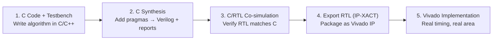

[← HLS Home](README.md) · [← HDL & Synthesis Home](../README.md) · [← Project Home](../../../README.md)

# HLS Overview

High-Level Synthesis transforms algorithmic C/C++/OpenCL code into RTL — scheduling operations into clock cycles, allocating hardware resources, and generating pipelined datapaths. For FPGA developers, HLS bridges the gap between software prototyping and hardware implementation.

This article covers the conceptual foundation: the synthesis flow, the C-to-hardware mental model, the essential pragmas, data types, and interface synthesis. For the deep optimization guide with full working examples, see [Advanced HLS Patterns](../../16_advanced_topics/advanced_hls_patterns.md). For vendor-specific tool setup, see [Toolchains: HLS](../../13_toolchains/hls_overview.md).

---

## Core HLS Concepts

| Concept | What It Does | Impact |
|---|---|---|
| **Scheduling** | Assigns operations to clock cycles | Determines latency and throughput |
| **Binding** | Maps operations to hardware resources (DSP, LUT, BRAM) | Determines area |
| **Pipelining** | Overlaps execution of loop iterations | II=1 means 1 result per cycle after pipeline fill |
| **Loop Unrolling** | Replicates loop body N times | N× throughput, N× area |
| **Array Partitioning** | Splits array across multiple BRAM banks | Eliminates memory bandwidth bottleneck |
| **Interface Synthesis** | Generates AXI-Stream/AXI4/AXI-Lite ports | Defines how C arguments map to hardware IO |
| **Dataflow** | Runs sequential functions concurrently (process-level pipelining) | Overlaps producer/consumer functions via FIFOs |

---

## The HLS Synthesis Flow



```
┌──────────────┐     ┌──────────────┐     ┌───────────────────┐
│ 1. C Code +  │     │ 2. C         │     │ 3. C/RTL          │
│    Testbench │────►│    Synthesis │────►│    Co-simulation  │
│              │     │              │     │                   │
│ Write algo   │     │ Add pragmas  │     │ Verify RTL        │
│ in C/C++     │     │ → Verilog +  │     │ matches C         │
│              │     │   reports    │     │ (functional equiv)│
└──────────────┘     └──────────────┘     └────────┬──────────┘
                                                   │
                     ┌──────────────┐     ┌────────▼─────────┐
                     │ 5. Vivado    │     │ 4. Export RTL    │
                     │    Impl      │◄────│    (IP-XACT)     │
                     │              │     │                  │
                     │ Real timing, │     │ Package as Vivado│
                     │ real area    │     │ IP for block     │
                     └──────────────┘     │ design           │
                                          └──────────────────┘
```

**Critical insight:** Steps 2–3 give *estimated* timing and area. Only step 5 (real Vivado P&R) gives accurate QoR. An HLS "II=1" at 200 MHz may break at 150 MHz post-route due to routing congestion.

### Step-by-Step (Vitis HLS)

```bash
# 1. C Simulation — verify algorithm correctness
vitis_hls -f run_csim.tcl

# 2. C Synthesis — generate RTL from C + pragmas
vitis_hls -f run_csynth.tcl

# 3. C/RTL Co-simulation — verify RTL matches C behavior
vitis_hls -f run_cosim.tcl

# 4. Export RTL — package as Vivado IP
vitis_hls -f run_export.tcl
```

---

## The C-to-Hardware Mental Model

Understanding what hardware the compiler generates for each C construct is the key to writing effective HLS code.

### Three Hardware Architectures from One Loop

```cpp
void add_arrays(const int A[8], const int B[8], int C[8]) {
    for (int i = 0; i < 8; i++) {
        C[i] = A[i] + B[i];
    }
}
```

| Pragma | Hardware | Latency | Throughput | Area |
|---|---|---|---|---|
| _(none)_ | FSM + single adder, iterates 8 times | 8+ cycles | 1 result / 8 cycles | 1 adder |
| `#pragma HLS PIPELINE II=1` | Pipelined adder, one new input per cycle | 8 + pipeline_depth | 1 result / cycle | 1 adder + pipeline regs |
| `#pragma HLS UNROLL` + `ARRAY_PARTITION complete` | 8 parallel adders, all compute at once | 1 cycle | 8 results / cycle | 8 adders |

The HLS compiler transforms your sequential C into parallel hardware. **Your job is to tell it how much parallelism you want** — it handles the mechanical work of replicating hardware, inserting pipeline registers, and resolving memory port contention.

---

## Use Cases: HLS vs RTL Side-by-Side

The best way to understand HLS is to see concrete examples alongside their RTL equivalents. Each example below shows the same functionality written in HLS C++ and in hand-written Verilog.

### Use Case 1: FIR Filter (DSP)

The classic FPGA use case — a tap delay-line filter. HLS expresses this as a simple loop; RTL requires explicit shift registers and accumulator management.

**HLS C++ (12 lines):**

```cpp
#define N_TAPS 8
typedef ap_fixed<16,8> coeff_t;
typedef ap_fixed<24,12> data_t;
typedef ap_fixed<24,12> acc_t;

void fir_filter(data_t din, data_t &dout) {
    #pragma HLS PIPELINE II=1
    #pragma HLS INTERFACE axis port=din
    #pragma HLS INTERFACE axis port=dout

    static data_t shift_reg[N_TAPS];
    const coeff_t coeffs[N_TAPS] = {c0, c1, c2, c3, c4, c5, c6, c7};
    #pragma HLS ARRAY_PARTITION variable=coeffs complete

    // Shift register
    SHIFT: for (int i = N_TAPS - 1; i > 0; i--) {
        #pragma HLS UNROLL
        shift_reg[i] = shift_reg[i - 1];
    }
    shift_reg[0] = din;

    // MAC
    acc_t acc = 0;
    MAC: for (int i = 0; i < N_TAPS; i++) {
        #pragma HLS UNROLL
        acc += shift_reg[i] * coeffs[i];
    }
    dout = acc;
}
```

**Equivalent Verilog (~55 lines):**

```verilog
module fir_filter (
    input  wire        clk,
    input  wire        rst,
    input  wire [23:0] din,
    input  wire        din_valid,
    output wire [23:0] dout,
    output wire        dout_valid
);
    // Shift register
    reg [23:0] shift_reg [0:7];
    integer i;

    always @(posedge clk) begin
        if (rst) begin
            for (i = 0; i < 8; i = i + 1)
                shift_reg[i] <= 24'd0;
        end else if (din_valid) begin
            shift_reg[0] <= din;
            for (i = 1; i < 8; i = i + 1)
                shift_reg[i] <= shift_reg[i-1];
        end
    end

    // Coefficients
    reg [15:0] coeffs [0:7];
    initial begin
        coeffs[0] = 16'h0100; coeffs[1] = 16'h0200;
        coeffs[2] = 16'h0300; coeffs[3] = 16'h0400;
        coeffs[4] = 16'h0400; coeffs[5] = 16'h0300;
        coeffs[6] = 16'h0200; coeffs[7] = 16'h0100;
    end

    // MAC (pipelined)
    reg [47:0] acc;
    always @(posedge clk) begin
        if (din_valid) begin
            acc <= shift_reg[0] * coeffs[0] +
                   shift_reg[1] * coeffs[1] +
                   shift_reg[2] * coeffs[2] +
                   shift_reg[3] * coeffs[3] +
                   shift_reg[4] * coeffs[4] +
                   shift_reg[5] * coeffs[5] +
                   shift_reg[6] * coeffs[6] +
                   shift_reg[7] * coeffs[7];
        end
    end

    assign dout = acc[23:0];
    assign dout_valid = din_valid;  // 1-cycle latency
endmodule
```

| Aspect | HLS C++ | Hand-Written Verilog |
|---|---|---|
| Lines of code | 12 | 55 |
| AXI-Stream handshaking | Generated by `INTERFACE axis` | Must write `valid/ready` logic manually |
| Changing tap count | Change `N_TAPS`, recompile | Edit shift register size, loop bounds, MAC chain |
| Pipeline control | `#pragma HLS PIPELINE II=1` | Must manually add pipeline registers |

---

### Use Case 2: AXI-Stream Packet Header Parser

A streaming design that reads packets and extracts a field — common in network processing. HLS uses `hls::stream`; RTL requires explicit FIFO and valid/ready handshaking.

**HLS C++ (18 lines):**

```cpp
struct packet_header {
    ap_uint<48> dst_mac;
    ap_uint<48> src_mac;
    ap_uint<16> ethertype;
};

void parse_ethernet(
    hls::stream<ap_uint<64>> &pkt_in,
    hls::stream<ap_uint<16>>  &ethertype_out
) {
    #pragma HLS INTERFACE axis port=pkt_in
    #pragma HLS INTERFACE axis port=ethertype_out
    #pragma HLS PIPELINE II=1

    // Read first two 64-bit words = 14-byte header
    ap_uint<64> word0 = pkt_in.read();  // bytes 0-7
    ap_uint<64> word1 = pkt_in.read();  // bytes 8-13 + padding

    // Extract ethertype (bytes 12-13)
    ap_uint<16> etype = word1(15, 0);   // Lower 16 bits of second word
    ethertype_out.write(etype);
}
```

**Equivalent Verilog (~45 lines):**

```verilog
module parse_ethernet (
    input  wire        clk,
    input  wire        rst,
    // AXI-Stream input
    input  wire [63:0] pkt_in_tdata,
    input  wire        pkt_in_tvalid,
    output wire        pkt_in_tready,
    // AXI-Stream output
    output wire [15:0] ethertype_out_tdata,
    output wire        ethertype_out_tvalid,
    input  wire        ethertype_out_tready
);
    reg [1:0] state;
    localparam IDLE   = 2'd0;
    localparam WORD0  = 2'd1;
    localparam WORD1  = 2'd2;
    localparam DONE   = 2'd3;

    reg [63:0] word0_reg;
    assign pkt_in_tready = (state == WORD0 || state == WORD1);

    always @(posedge clk) begin
        if (rst) begin
            state <= IDLE;
        end else begin
            case (state)
                IDLE:   state <= WORD0;
                WORD0: begin
                    if (pkt_in_tvalid) begin
                        word0_reg <= pkt_in_tdata;
                        state <= WORD1;
                    end
                end
                WORD1: begin
                    if (pkt_in_tvalid) begin
                        state <= DONE;
                    end
                end
                DONE:   state <= IDLE;
            endcase
        end
    end

    assign ethertype_out_tdata  = pkt_in_tdata[15:0];
    assign ethertype_out_tvalid = (state == WORD1 && pkt_in_tvalid);
endmodule
```

| Aspect | HLS C++ | Hand-Written Verilog |
|---|---|---|
| Lines of code | 18 | 45 |
| AXI-Stream handshaking | `hls::stream.read()` / `.write()` — compiler generates valid/ready | Must wire tvalid/tready manually |
| State machine | Implicit (reads are blocking) | Explicit FSM with 4 states |
| Adding more header fields | Read more words, extract bits | Extend FSM, add more registers |

---

### Use Case 3: Memory-Mapped Register Bank

A control/status register block with AXI-Lite slave. This is the "software interface" for every FPGA IP. HLS generates the entire bus interface from a few `s_axilite` pragmas.

**HLS C++ (15 lines):**

```cpp
void register_block(
    ap_uint<1> &ctrl_start,
    ap_uint<1> &ctrl_reset,
    ap_uint<32> &status_count,
    ap_uint<32> &status_error
) {
    #pragma HLS INTERFACE s_axilite port=ctrl_start      bundle=ctrl
    #pragma HLS INTERFACE s_axilite port=ctrl_reset      bundle=ctrl
    #pragma HLS INTERFACE s_axilite port=status_count    bundle=ctrl
    #pragma HLS INTERFACE s_axilite port=status_error    bundle=ctrl
    #pragma HLS INTERFACE s_axilite port=return          bundle=ctrl
    // 'return' generates the ap_start/ap_done handshake registers
}
```

The compiler generates:
- AXI4-Lite slave decoder (address map: `ctrl_start` = 0x00, `ctrl_reset` = 0x04, `status_count` = 0x08, `status_error` = 0x0C)
- `ap_start`, `ap_done`, `ap_idle`, `ap_ready` registers at 0x10–0x1C
- Read/write strobe logic, byte-lane steering

**Equivalent Verilog (~80+ lines)** would require:
- AXI4-Lite write decoder (awaddr decoding, wdata register, bresp)
- AXI4-Lite read decoder (araddr decoding, rdata mux, rresp)
- Per-register write enables and read muxes
- All handshaking signals (awvalid/awready, wvalid/wready, etc.)

| Aspect | HLS C++ | Hand-Written Verilog |
|---|---|---|
| Lines of code | 15 | 80+ |
| AXI-Lite protocol | Generated automatically | Must implement full aw/ar/w/b/r channels |
| Adding a register | Add one `s_axilite` pragma line | Add decoder entry, register, read mux bit |
| Address map | Auto-generated by compiler | Must manually assign and document offsets |

---

### Use Case 4: Simple FSM (Where RTL Wins)

Not everything is better in HLS. Complex state machines with many transitions, timeout counters, and conditional branches are often clearer in RTL.

**HLS C++ — awkward (20 lines):**

```cpp
void spi_controller(
    hls::stream<ap_uint<8>> &tx_data,
    hls::stream<ap_uint<8>> &rx_data,
    ap_uint<1> &spi_cs,
    ap_uint<1> &spi_clk,
    ap_uint<1> &spi_mosi,
    ap_uint<1> &spi_miso
) {
    // HLS must express the SPI bit-bang FSM as a loop with a state variable
    // This is possible but unnatural — the sequential C model fights the
    // cycle-accurate bit manipulation needed for SPI clock generation
    enum State {IDLE, START, SHIFT, STOP};
    static State state = IDLE;
    static int bit_count = 0;
    static ap_uint<8> shifter = 0;

    // ...many switch/case branches to handle each state...
    // Each bit of SPI timing must be explicitly coded
    // The HLS scheduler may insert unwanted pipeline registers
    // Result: harder to write, harder to read, no performance benefit
}
```

**Verilog — natural (30 lines):**

```verilog
module spi_controller (
    input  wire clk, rst,
    output reg  spi_cs, spi_clk, spi_mosi,
    input  wire spi_miso
);
    localparam IDLE=0, START=1, SHIFT=2, STOP=3;
    reg [1:0] state;
    reg [2:0] bit_cnt;
    reg [7:0] shifter;

    always @(posedge clk) begin
        if (rst) begin
            state <= IDLE; spi_cs <= 1; spi_clk <= 0;
        end else case (state)
            IDLE:  begin spi_cs <= 0; state <= START; end
            START: begin shifter <= 8'hA5; bit_cnt <= 0; state <= SHIFT; end
            SHIFT: begin
                spi_clk <= ~spi_clk;
                if (spi_clk) shifter <= {shifter[6:0], spi_miso};
                if (bit_cnt == 7 && spi_clk) state <= STOP;
                else if (spi_clk) bit_cnt <= bit_cnt + 1;
            end
            STOP:  begin spi_cs <= 1; state <= IDLE; end
        endcase
    end
endmodule
```

| Aspect | HLS C++ | Verilog |
|---|---|---|
| Natural fit | Poor — C has no concept of clock edges | Excellent — `always @(posedge clk)` maps directly |
| Readability | Awkward switch/case with manual state encoding | Clean `case` with per-state logic |
| Bit-level control | Must force cycle-accurate behavior via pragmas | Native — every signal is a wire or reg |
| Use HLS here? | **No** — write this one in Verilog | — |

---

### Summary: When HLS Saves Lines vs When It Doesn't

| Pattern | HLS Advantage | Lines Saved |
|---|---|---|
| **DSP pipelines** (FIR, FFT, CORDIC) | Loop → pipelined datapath; pragmas replace manual pipeline register insertion | 3–5× |
| **Streaming dataflow** (packet parse, encrypt) | `hls::stream` replaces explicit FIFO + valid/ready wiring | 2–3× |
| **Register banks** (AXI-Lite slave) | `s_axilite` pragma generates entire bus decoder | 5–8× |
| **Memory movers** (DMA, scatter/gather) | `m_axi` pragma generates AXI4 master + burst logic | 3–5× |
| **Bit-level FSMs** (SPI, I2C, UART) | No advantage — C fights cycle-accurate timing | 0–1× (often worse) |
| **Clock domain crossing** | Not expressible in HLS | N/A — must use RTL IP |

---

## Essential Pragma Reference

### PIPELINE — Overlap Loop Iterations

```cpp
for (int i = 0; i < N; i++) {
    #pragma HLS PIPELINE II=1
    out[i] = process(in[i]);
}
```

| Parameter | Values | Meaning |
|---|---|---|
| `II` | 1, 2, 3... | Initiation Interval — how many cycles between starting successive iterations. II=1 = max throughput |

**What it does:** Creates a pipeline where iteration N+1 starts before iteration N finishes. The pipeline depth depends on the data dependencies in the loop body.

**When II>1:** The compiler could not schedule the loop body to fit in one cycle. Common causes: memory port contention (need `ARRAY_PARTITION`), loop-carried dependency, or combinational path too long.

### UNROLL — Replicate Loop Body

```cpp
for (int k = 0; k < 32; k++) {
    #pragma HLS UNROLL factor=8
    sum += A[i][k] * B[k][j];
}
```

| Parameter | Values | Meaning |
|---|---|---|
| `factor` | 2, 4, 8, ... | Number of copies of the loop body |
| _(no factor)_ | complete | Unroll **all** iterations — dangerous for large trip counts |

> **Warning:** `#pragma HLS UNROLL` without a factor unrolls the **entire** loop. A `for (k=0; k<1024; k++)` with full unroll creates 1,024 copies of the loop body. Always specify a factor.

### ARRAY_PARTITION — Multiply Memory Bandwidth

```cpp
float A[32][32];
#pragma HLS ARRAY_PARTITION variable=A cyclic factor=8 dim=2
```

| Mode | How It Splits | When to Use |
|---|---|---|
| `block` | Contiguous chunks: elements 0–3 → BRAM0, 4–7 → BRAM1 | Access pattern is sequential along partitioned dimension |
| `cyclic` | Interleaved: elements 0,8,16 → BRAM0; 1,9,17 → BRAM1 | Access pattern strides by factor (e.g., column access of row-major array) |
| `complete` | Every element in its own register (not BRAM) | Small arrays only (< ~64 elements); uses FFs, not BRAM |

**The #1 HLS trap:** `PIPELINE II=1` + `UNROLL factor=8` on a loop that reads from a **single, unpartitioned** array. The compiler can't schedule 8 reads per cycle from a 2-port BRAM. Result: II=4 or worse. **Always partition arrays BEFORE pipelining loops that access them.**

### DATAFLOW — Function-Level Parallelism

```cpp
void top(hls::stream<int> &in, hls::stream<int> &out) {
    #pragma HLS DATAFLOW
    hls::stream<int> fifo1, fifo2;
    #pragma HLS STREAM variable=fifo1 depth=16

    read_input(in, fifo1);      // Runs continuously
    process_data(fifo1, fifo2); // Runs continuously, overlapped with read_input
    write_output(fifo2, out);   // Runs continuously, overlapped with process_data
}
```

`DATAFLOW` runs entire functions in parallel, connected by FIFOs. Unlike `PIPELINE` (which overlaps iterations of one loop), `DATAFLOW` overlaps separate functions.

### INTERFACE — Map C Arguments to Hardware Ports

```cpp
void my_ip(
    int *a,               // → AXI4 master (default for pointers)
    int &b,               // → AXI4-Lite slave register
    hls::stream<int> &s   // → AXI4-Stream
) {
    #pragma HLS INTERFACE m_axi port=a depth=1024 offset=slave bundle=gmem
    #pragma HLS INTERFACE s_axilite port=b bundle=ctrl
    #pragma HLS INTERFACE axis port=s
}
```

| Interface Type | C Signature | Hardware Port | Latency | Use Case |
|---|---|---|---|---|
| **AXI4 master (`m_axi`)** | `int *ptr` | Bus master that reads/writes memory | Variable (depends on arbiter) | DMA: read/write DDR from FPGA |
| **AXI4-Lite slave (`s_axilite`)** | `int &reg` | Register-mapped slave port | 1–2 cycles (fixed) | CPU control registers, status |
| **AXI4-Stream (`axis`)** | `hls::stream<T>` | Point-to-point streaming | 1 cycle per transfer | Data flow between IP blocks |

---

## HLS Data Types

### Arbitrary-Width Integers

```cpp
#include <ap_int.h>

ap_int<8>   signed_8bit;      // -128 to 127
ap_uint<8>  unsigned_8bit;    // 0 to 255
ap_int<18>  dsp_friendly;     // Maps to DSP48E2 18-bit input
ap_int<27>  dsp_wide;         // Maps to DSP48E2 27-bit input
```

**DSP mapping:** The Xilinx DSP48E2 can do one 27×18 multiply per cycle. Using `ap_int<18>` and `ap_int<27>` ensures the compiler maps multiplies to DSP slices, not LUTs.

### Fixed-Point

```cpp
#include <ap_fixed.h>

ap_fixed<16, 8>  q8_8;     // 16-bit total, 8 integer bits, 8 fractional
ap_ufixed<12, 4> uq4_8;    // 12-bit unsigned, 4 integer, 8 fractional
ap_fixed<27, 14> dsp_acc;  // Fits DSP48E2 accumulator (48-bit output)
```

Fixed-point is far more efficient than `float` on FPGAs — there are no native floating-point units in fabric. Each `float` multiply costs ~500 LUTs + 4 DSP slices and takes 4–8 cycles.

### Streams (FIFOs)

```cpp
#include <hls_stream.h>

hls::stream<int> data_fifo;
hls::stream<ap_uint<64>> pkt_stream;

// Write (blocking if full)
data_fifo.write(value);

// Read (blocking if empty)
int val = data_fifo.read();

// Non-blocking with success flag
bool success;
int val = data_fifo.read_nb(success);
```

`hls::stream` maps to FIFOs in hardware — the fundamental communication primitive for DATAFLOW designs. They cannot be read more than once (unlike arrays).

---

## Major HLS Tools

| Tool | Vendor | Input | FPGA Targets | Notes |
|---|---|---|---|---|
| **Vitis HLS** | AMD/Xilinx | C/C++/OpenCL | Xilinx 7-series, UltraScale+, Versal | Most mature; free in Vivado |
| **Intel HLS Compiler** | Altera | C++ | Intel Agilex, Stratix 10, Arria 10 | Uses C++17 attributes instead of pragmas; free in Quartus Pro |
| **Catapult HLS** | Siemens | C++/SystemC | Xilinx, Intel (via RTL export) | ASIC-grade quality; enterprise pricing |
| **Bambu** | PoliMi | C | Multi-vendor | Open-source (GPL); academic provenance |

### Vitis HLS vs Intel HLS — Pragma Syntax

| Concept | Vitis HLS | Intel HLS Compiler |
|---|---|---|
| Pipeline | `#pragma HLS PIPELINE II=1` | `[[intel::ii(1)]]` |
| Unroll | `#pragma HLS UNROLL factor=8` | `#pragma unroll 8` |
| Array partition | `#pragma HLS ARRAY_PARTITION variable=A cyclic factor=8` | `[[intel::fpga_memory]]` + bank attributes |
| Dataflow | `#pragma HLS DATAFLOW` | `[[intel::kernel_args_restrict]]` + pipelining |
| Arbitrary int | `ap_int<18>` | `ac_int<18, false>` |
| Fixed-point | `ap_fixed<16,8>` | `ac_fixed<16,8,true>` |
| Stream | `hls::stream<T>` | `mm_host` / `pipe` classes |

---

## When HLS Makes Sense

| ✅ Good for HLS | ❌ Bad for HLS |
|---|---|
| DSP algorithms (FIR, FFT, matrix multiply) | Precise cycle-level control logic |
| Computer vision / ML inference pipelines | Hand-crafted state machines |
| High-throughput packet processing | Clock domain crossing logic |
| Prototyping before RTL implementation | Resource-constrained designs (iCE40) |
| Algorithms that already exist in C/C++ | Bit-level manipulation (parity, CRC) |
| Designs with regular dataflow (producer→process→consumer) | Irregular memory access patterns (pointer chasing) |

---

## The Performance Debugging Loop

HLS development is iterative — you add pragmas, synthesize, check II, and refine:

```
1. Write C code + testbench
2. C Simulation → verify correctness
3. C Synthesis → check II, latency, resources
4. If II > target:
   a. Check synthesis log for "cannot schedule" messages
   b. Common fix: ARRAY_PARTITION for memory bottlenecks
   c. Common fix: move accumulator declaration inside pipelined loop
   d. Common fix: reduce UNROLL factor if routing-congested
5. C/RTL Co-simulation → verify functional equivalence
6. Export → Vivado implementation → check real timing
7. If real timing fails:
   a. Over-constrain HLS target clock by 25%
   b. Reduce UNROLL factor to ease routing congestion
   c. Consider floorplanning (pblock constraints) for congested regions
```

---

## References

| Document | Source | What It Covers |
|---|---|---|
| [UG1399 — Vitis HLS User Guide](https://docs.amd.com/r/en-US/ug1399-vitis-hls) | AMD/Xilinx | Complete Vitis HLS reference: pragmas, data types, optimization |
| [Advanced HLS Patterns](../../16_advanced_topics/advanced_hls_patterns.md) | This KB | Deep optimization guide with full working examples |
| [Toolchains: HLS](../../13_toolchains/hls_overview.md) | This KB | Vendor-specific tool setup and best practices |
