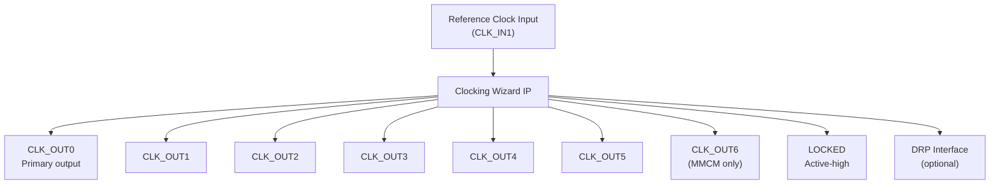
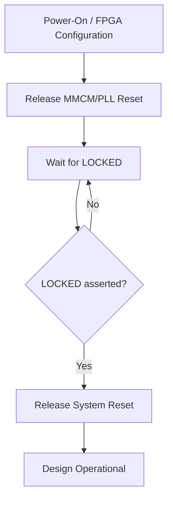

[← IP & Cores Home](../README.md) · [← Project Home](../../README.md)

# Clocking IP — Configuration, Instantiation, and Dynamic Reconfiguration

Clock management IP transforms a single reference oscillator into the complete clock tree your design requires: multiple frequencies, precise phase relationships, low-jitter outputs, and runtime reconfigurability. Every FPGA design instantiates at least one clock management primitive — yet the configuration options, port interfaces, and vendor-specific IP customizers differ significantly across Xilinx, Intel, Lattice, Gowin, and Microchip. This article covers how to configure, instantiate, and dynamically reconfigure clock management IP across all vendors, with register maps, Tcl automation, and practical examples.

> [!NOTE]
> This article covers the **IP usage** perspective — how to configure and instantiate clock management blocks in your design. For the underlying silicon architecture (PLL/MMCM/DCM hardware, VCO operation, clock distribution networks), see [Clocking — PLLs, MMCMs, DCMs, and Distribution](../../02_architecture/infrastructure/clocking.md).

---

## Overview: Why Clock Management IP Exists

An FPGA receives one or two reference clocks from off-chip oscillators (typically 25–100 MHz). The fabric needs dozens of different clocks:

| Clock Need | Example | Why PLL/IP Required |
|---|---|---|
| System clock at different frequency | 100 MHz → 200 MHz DDR, 50 MHz peripheral | Frequency multiplication/division |
| Phase-shifted clock | 90° shifted for center-aligned DDR capture | Phase shift control |
| Low-jitter SERDES reference | 156.25 MHz for 10G Ethernet | Jitter filtering and cleanup |
| Multiple derived clocks | 100 MHz, 200 MHz, 333 MHz from one 50 MHz input | Multi-output synthesis |
| Runtime frequency change | Adaptive clocking for power saving, video mode switching | Dynamic reconfiguration |

The clock management IP provides a GUI (or Tcl) front-end that computes the M/D counter values, VCO frequency, and output divider settings — then generates the wrapped primitive with correct parameters and constraints.

---

## Vendor IP Comparison

| Feature | Xilinx Clocking Wizard | Intel PLL IP | Lattice PLL | Gowin PLL | Microchip Clock Conditioner |
|---|---|---|---|---|---|
| **Primitives wrapped** | MMCM, PLL | fPLL, IOPLL, iPLL | ECP5 PLL, CertusPro-NX PLL | GW1N/2N/5N PLL | PolarFire PLL |
| **Configuration tool** | Vivado IP Customizer | Platform Designer / QIP | Diamond/Radiant IP Express | Gowin EDA IP Core Generator | Libero SmartDesign |
| **Multi-output** | Up to 7 (MMCM) | Up to 18 (C-counter) | Up to 3 (ECP5) | 2–3 | Up to 5 |
| **Dynamic reconfig** | DRP (MMCM only) | PLL Reconfig (Cyclone V+, Agilex) | No (ECP5), Yes (CertusPro-NX) | No | Yes (PolarFire) |
| **Fractional-N** | MMCME2/3 (fractional mode) | fPLL | No | No | Yes (PolarFire) |
| **Phase interpolation** | Fine: 1/56 VCO period (MMCM) | 1/8 VCO period | Coarse: 90° steps (ECP5) | Fixed | Fine |
| **Auto-constraint generation** | Yes (XDC output) | Yes (SDC output) | Yes (LPF/SDC output) | Yes (SDC output) | Yes (SDC output) |
| **Spread-spectrum** | No | Yes (fPLL, Agilex) | No | No | Yes |

---

## Xilinx: Clocking Wizard

The Xilinx Clocking Wizard (PG065) is the primary IP for configuring MMCM and PLL primitives in 7-series, UltraScale, and UltraScale+ devices. It computes M/D values, generates wrapper RTL, and produces XDC constraints automatically.

### Architecture



### Port Interface (7-Series MMCM Mode)

| Port | Direction | Width | Description |
|---|---|---|---|
| `clk_in1` | Input | 1 | Primary reference clock |
| `clk_in2` | Input | 1 | Secondary reference clock (optional, for clock switchover) |
| `clk_out1`–`clk_out7` | Output | 1 each | Generated clocks at configured frequencies |
| `reset` | Input | 1 | Active-high reset; holds MMCM in reset |
| `locked` | Output | 1 | Active-high; indicates all outputs are stable |
| `clk_in_sel` | Input | 1 | Selects between `clk_in1` and `clk_in2` |
| `drdy` | Output | 1 | DRP ready |
| `dwe` | Input | 1 | DRP write enable |
| `den` | Input | 1 | DRP enable |
| `daddr` | Input | 7 | DRP address |
| `di` | Input | 16 | DRP data in |
| `do` | Output | 16 | DRP data out |

### Configuration in Vivado IP Customizer

1. **Input Clock Info**: Set frequency (e.g., 100.000 MHz), jitter (UI or ps), and signal type (single-ended/differential)
2. **Output Clocks**: Enable desired outputs and set target frequency, phase (degrees), and duty cycle (%) for each
3. **Clocking Features**: Select MMCM vs PLL, optional clock switchover, dynamic reconfiguration
4. **Port Renaming**: Customize port names if desired

> [!IMPORTANT]
> The wizard auto-computes the VCO frequency (fin × M / D) and output dividers. If the VCO frequency falls outside the allowed range (600–1200 MHz for 7-series MMCM), the wizard reports an error and you must adjust input/output frequencies or M/D values manually.

### Tcl: Instantiating the Clocking Wizard

```tcl
# Create Clocking Wizard IP - 7-series MMCM
create_ip -name clk_wiz -vendor xilinx.com -library ip -module_name clk_gen_100m

# Configure input clock
set_property -dict [list \
  CONFIG.PRIM_SOURCE {No_buffer} \
  CONFIG.PRIM_IN_FREQ {100.000} \
  CONFIG.CLKOUT1_REQUESTED_OUT_FREQ {200.000} \
  CONFIG.CLKOUT2_REQUESTED_OUT_FREQ {100.000} \
  CONFIG.CLKOUT3_REQUESTED_OUT_FREQ {50.000} \
  CONFIG.CLKOUT4_USED {true} \
  CONFIG.CLKOUT4_REQUESTED_OUT_FREQ {25.000} \
  CONFIG.USE_LOCKED {true} \
  CONFIG.USE_RESET {true} \
  CONFIG.MMCM_DRP {true} \
] [get_ips clk_gen_100m]

generate_target all [get_ips clk_gen_100m]
```

### Verilog Instantiation

```verilog
// Clocking Wizard instance — 100 MHz input, 4 outputs
clk_wiz_0 clk_gen (
    .clk_out1  (clk_200m),    // 200 MHz — DDR controller
    .clk_out2  (clk_100m),    // 100 MHz — system clock
    .clk_out3  (clk_50m),     // 50 MHz  — peripheral clock
    .clk_out4  (clk_25m),     // 25 MHz  — slow peripheral
    .reset     (rst_btn),     // Active-high reset from button
    .locked    (pll_locked),  // PLL lock indicator
    .clk_in1   (clk_100m_pad) // 100 MHz from osc
);
```

### DRP (Dynamic Reconfiguration Port)

The DRP allows runtime modification of MMCM parameters — multiply/divide values, phase shift, and duty cycle — without reconfiguring the FPGA. This is critical for:

- **Video mode switching**: Changing pixel clock frequency when resolution changes
- **Adaptive clocking**: Reducing clock speed for power savings
- **Protocol negotiation**: Adjusting SERDES reference clock rates

#### DRP Register Map (MMCM)

| DRP Address | Register | Bits | Description |
|---|---|---|---|
| `0x08` | CLKFBOUT | [15:0] | Feedback divider (M value) and fractional settings |
| `0x09` | CLKFBOUT_FRAC | [15:0] | Fractional-N M value (MMCME2/3 only) |
| `0x0A` | CLKOUT0 | [15:0] | CLKOUT0 divider and high/low time |
| `0x0B` | CLKOUT0_FRAC | [15:0] | Fractional divider for CLKOUT0 |
| `0x0C`–`0x12` | CLKOUT1–6 | [15:0] | Output dividers for CLKOUT1–6 |
| `0x14` | DIVCLK | [15:0] | Input divider (D value) |
| `0x15` | LOCK_REG1 | [15:0] | Lock filter settings |
| `0x16` | LOCK_REG2 | [15:0] | Lock filter settings |
| `0x17` | LOCK_REG3 | [15:0] | Lock counter settings |
| `0x18` | POWER_REG | [15:0] | Power down control |

#### DRP Write Sequence (Verilog)

```verilog
// Simplified DRP state machine to change CLKOUT0 frequency
// Assumes: clk_in1 is stable, MMCM is locked, DRP interface enabled

localparam S_IDLE    = 3'd0,
           S_WRITE   = 3'd1,
           S_WAIT    = 3'd2,
           S_DONE    = 3'd3;

reg  [2:0] drp_state = S_IDLE;
reg  [6:0] drp_addr_r;
reg [15:0] drp_di_r;

// Example: Change CLKOUT0 divider register (addr 0x0A)
// to adjust output frequency at runtime
always @(posedge clk_100m) begin
    case (drp_state)
        S_IDLE: begin
            if (freq_change_req && pll_locked) begin
                drp_addr_r <= 7'h0A;   // CLKOUT0 register
                drp_di_r   <= new_divider_val; // Pre-computed divider value
                drp_state  <= S_WRITE;
            end
        end
        S_WRITE: begin
            dwe  <= 1'b1;
            den  <= 1'b1;
            daddr <= drp_addr_r;
            di   <= drp_di_r;
            drp_state <= S_WAIT;
        end
        S_WAIT: begin
            dwe <= 1'b0;
            den <= 1'b0;
            if (drdy) begin
                drp_state <= S_DONE;
                // MMCM may briefly lose lock after DRP change
                // Wait for re-lock before using outputs
            end
        end
        S_DONE: begin
            freq_change_ack <= 1'b1;
            drp_state <= S_IDLE;
        end
    endcase
end
```

> [!WARNING]
> **After a DRP write, the MMCM may briefly lose lock.** Monitor the LOCKED output. Do not use clock outputs for at least 100 µs after a DRP change until LOCKED reasserts. Some designs add a secondary reset after DRP to ensure clean state.

### Direct Primitive Instantiation (Bypass Wizard)

For full control, instantiate the MMCME2_ADV or PLLE2_ADV primitive directly:

```verilog
// Direct MMCM instantiation — 7-series
// Input: 100 MHz, Output: 200 MHz (M=10, D=5, O=1)
MMCME2_ADV #(
    .BANDWIDTH          ("OPTIMIZED"),
    .CLKIN1_PERIOD     (10.0),      // 100 MHz = 10 ns period
    .CLKFBOUT_MULT_F   (10.0),      // M = 10 → VCO = 1000 MHz
    .CLKFBOUT_PHASE    (0.0),
    .CLKOUT0_DIVIDE_F  (5.0),       // O0 = 5.0 → 200 MHz
    .CLKOUT0_DUTY_CYCLE(0.5),
    .CLKOUT0_PHASE     (0.0),
    .CLKOUT1_DIVIDE    (10),         // O1 = 10 → 100 MHz
    .CLKOUT1_DUTY_CYCLE(0.5),
    .CLKOUT1_PHASE     (0.0),
    .CLKOUT2_DIVIDE    (20),         // O2 = 20 → 50 MHz
    .CLKOUT2_DUTY_CYCLE(0.5),
    .CLKOUT2_PHASE     (0.0),
    .DIVCLK_DIVIDE     (1)           // D = 1
) mmcm_inst (
    .CLKIN1   (clk_100m_in),
    .CLKFBIN  (clk_fb),
    .CLKFBOUT (clk_fb),
    .CLKOUT0  (clk_200m),
    .CLKOUT1  (clk_100m),
    .CLKOUT2  (clk_50m),
    .LOCKED   (pll_locked),
    .PWRDWN   (1'b0),
    .RST      (rst)
);
```

---

## Intel/Altera: PLL IP

Intel provides multiple PLL IP variants through Platform Designer (Qsys) or standalone QIP files. The PLL IP is configured through the Quartus IP Parameter Editor.

### PLL IP Types

| IP Variant | Use Case | Families |
|---|---|---|
| **ALTPLL** | Legacy integer-N PLL | Cyclone IV/V, Arria II, Stratix IV/V |
| **IOPLL** | IO-bank PLL for LVDS/SERDES | Arria 10, Agilex |
| **fPLL** | Fractional-N PLL | Cyclone V, Arria 10, Agilex |
| **ATX PLL** | Transceiver reference PLL | Stratix 10, Agilex (high-line-rate) |
| **CMU PLL** | Clock multiplier unit for transceivers | Arria 10, Stratix 10 |

### ALTPLL Configuration (Cyclone V)

```
Quartus IP Parameter Editor → ALTPLL:
  - General: Input clock frequency = 50.000 MHz
  - Output clocks:
    - c0: 100 MHz (×2), phase 0°, duty 50%
    - c1:  50 MHz (×1), phase 0°, duty 50%
    - c2:  25 MHz (÷2), phase 0°, duty 50%
  - Lock output: Enabled (active-high)
  - Dynamic reconfiguration: Disabled (or enable for runtime changes)
```

### VHDL Instantiation (ALTPLL)

```vhdl
-- ALTPLL instance — Cyclone V, 50 MHz input
pll_inst : entity work.alt_pll
    port map (
        inclk0 => clk_50m_in,     -- 50 MHz reference
        c0     => clk_100m,        -- 100 MHz
        c1     => clk_50m,         -- 50 MHz
        c2     => clk_25m,        -- 25 MHz
        locked => pll_locked
    );
```

### Intel PLL Reconfiguration

Intel Agilex and Arria 10 support PLL dynamic reconfiguration via the PLL Reconfiguration IP. The interface uses a memory-mapped register set:

| Offset | Register | Description |
|---|---|---|
| `0x00` | CTRL | Control register: bit 0 = start reconfig, bit 1 = read/write select |
| `0x04` | STATUS | Status: bit 0 = busy, bit 1 = locked |
| `0x08` | M_COUNTER | M counter value (multiply) |
| `0x0C` | N_COUNTER | N counter value (divide) |
| `0x10` | C_COUNTER_0 | C0 counter (output divide) |
| `0x14` | C_COUNTER_1 | C1 counter (output divide) |
| `0x18` | PHASE_SHIFT | Phase shift value |

Reconfiguration sequence:
1. Write new M/N/C counter values to registers
2. Set CTRL bit 0 to start reconfiguration
3. Poll STATUS until busy bit clears
4. Verify locked bit is set

---

## Lattice: PLL IP

### ECP5 PLL Configuration (Diamond/Radiant)

Lattice ECP5 provides 2–4 PLLs with up to 3 outputs each (CLKOP, CLKOS, CLKOS2). Configuration is done through the IP Express tool.

```
Diamond/Radiant IP Express → PLL:
  - Input frequency: 12.000 MHz
  - CLKOP: 48.000 MHz (M=4, D=1), phase 0°
  - CLKOS: 24.000 MHz (M=4, D=2), phase 0°
  - CLKOS2: 12.000 MHz (M=4, D=4), phase 90°
  - Feedback path: CLKOP (internal)
  - Lock output: Enabled
```

### Verilog Instantiation (ECP5)

```verilog
// ECP5 PLL — 12 MHz input, 48/24/12 MHz outputs
(* IOPAD_EXTERNAL_PIN_LOCATION="C8" *) input wire clk_12m_in;

wire clk_48m, clk_24m, clk_12m_90, pll_locked;

PLLECl pll_inst (
    .CLKI   (clk_12m_in),   // 12 MHz reference
    .CLKOP  (clk_48m),       // 48 MHz primary output
    .CLKOS  (clk_24m),       // 24 MHz secondary output
    .CLKOS2 (clk_12m_90),    // 12 MHz, phase-shifted 90°
    .LOCK   (pll_locked),
    .RST    (1'b0)
);

defparam pll_inst.CLKOP_DIV    = 1;   // Output divider for CLKOP
defparam pll_inst.CLKOS_DIV    = 2;   // Output divider for CLKOS
defparam pll_inst.CLKOS2_DIV   = 4;   // Output divider for CLKOS2
defparam pll_inst.CLKI_DIV     = 1;   // Input divider (D)
defparam pll_inst.CLKFB_DIV    = 4;   // Feedback divider (M)
defparam pll_inst.PHASE_CTRL   = "STATIC";
defparam pll_inst.STDBY_ENABLE = "DISABLED";
```

### Lattice CertusPro-NX PLL

CertusPro-NX adds DCMA (Dynamic Clock Mux Alignment) for improved phase control and dynamic clock switching. The IP Express tool provides a similar configuration interface with additional options for:

- Dynamic phase shift (fine mode)
- Clock switchover between two reference inputs
- Spread-spectrum clocking (SSC) for EMI reduction

---

## Gowin: PLL IP

Gowin FPGAs provide a simple PLL with limited configurability. The IP Core Generator in Gowin EDA creates the wrapper.

### Configuration

```
Gowin EDA → IP Core Generator → PLL:
  - Input frequency: 27.000 MHz
  - Output 1: 54.000 MHz (×2)
  - Output 2: 27.000 MHz (×1)
  - Feedback path: Internal
  - Static configuration only (no dynamic reconfig)
```

### Verilog Instantiation (Gowin GW1N)

```verilog
// Gowin PLL — 27 MHz input, 54 MHz output
rPLL #(
    .FCLKIN       ("27.000"),
    .FCLKOUT0     ("54.000"),
    .FCLKOUT1     ("27.000"),
    .IDIV_SEL     (0),           // Input divider
    .FBDIV_SEL    (1),           // Feedback divider
    .ODIV0_SEL   (8),            // Output 0 divider
    .ODIV1_SEL   (16),           // Output 1 divider
    .DUTY0_SEL   ("5000"),       // 50% duty cycle
    .DUTY1_SEL   ("5000")
) pll_inst (
    .CLKIN   (clk_27m_in),
    .CLKOUT0 (clk_54m),
    .CLKOUT1 (clk_27m),
    .LOCK    (pll_locked),
    .RESET   (1'b0)
);
```

> [!NOTE]
> Gowin PLLs have no dynamic reconfiguration capability. Frequency changes require reconfiguring the FPGA with a new bitstream.

---

## Microchip: Clock Conditioner IP

Microchip PolarFire and SmartFusion2 provide configurable PLLs through Libero SmartDesign.

### PolarFire PLL Configuration

The PolarFire Clock Conditioner supports fractional-N synthesis and dynamic reconfiguration through an AXI4-Lite interface.

| Feature | PolarFire PLL |
|---|---|
| VCO range | 500–1,500 MHz |
| Outputs | Up to 5 |
| Phase resolution | Fine (sub-degree) |
| Dynamic reconfig | Yes (via AXI4-Lite) |
| Fractional-N | Yes |
| Spread-spectrum | Yes |

### Configuration in Libero SmartDesign

1. Add **CLKCON_CR** (Clock Conditioner) component to SmartDesign
2. Configure reference clock frequency
3. Set output frequencies, phase, and duty cycle
4. Enable AXI4-Lite register interface for dynamic reconfiguration
5. Connect LOCK output to system reset logic

---

## Reset and Lock Management

Every clock management IP provides a LOCKED output. The correct reset sequence is:



### Verilog: Safe Reset Sequence

```verilog
// Safe reset: hold system in reset until PLL locks
// Plus: re-assert reset if PLL loses lock
reg [15:0] lock_counter = 0;
wire sys_rst_n;

assign sys_rst_n = (lock_counter == 16'hFFFF);

always @(posedge clk_100m or negedge pll_locked) begin
    if (!pll_locked) begin
        lock_counter <= 16'd0;     // Reset counter if PLL loses lock
    end else if (lock_counter != 16'hFFFF) begin
        lock_counter <= lock_counter + 1; // Count up = delay after lock
    end
end
```

> [!WARNING]
> **Never use an unlocked PLL output as a clock.** If the PLL loses lock mid-operation, its output frequency becomes unpredictable. Use the LOCKED signal to gate system reset and stop all downstream logic immediately upon loss of lock.

---

## Practical Decision Guide

### How Many PLLs Do You Need?

| Clock Requirements | PLLs Needed | Example |
|---|---|---|
| 1 input → 1 output (same freq) | 0 (use BUFG only) | Pass-through system clock |
| 1 input → 1–3 outputs (different freq) | 1 | 50 MHz → 100 MHz + 25 MHz |
| 1 input → 4–7 outputs | 1 (Xilinx MMCM) or 2 (Lattice/Intel) | Multi-clock DSP pipeline |
| 2 references (auto-switch) | 1 with switchover | Redundant clock for reliability |
| 5+ unrelated frequencies | 2+ | Complex SoC with multiple protocol domains |
| Runtime frequency changes | 1 with DRP/reconfig | Video, adaptive clocking |

### When to Use PLL vs MMCM (Xilinx)

| Scenario | Use | Why |
|---|---|---|
| Simple frequency multiplication (M/D) | **PLL** | Lower power, simpler |
| Fine phase shift (< 45° resolution) | **MMCM** | 1/56 VCO period granularity |
| Deskew with feedback | **MMCM** | Phase compensation via feedback path |
| Dynamic reconfiguration at runtime | **MMCM** | DRP port only available on MMCM |
| Source-synchronous IO deskew | **MMCM** | Phase alignment to incoming data |

### When to Use Direct Primitives vs Wizard

| Approach | When to Use |
|---|---|
| **Clocking Wizard IP** | Standard design flows, auto-constraint generation, DRP convenience wrapper |
| **Direct primitive (MMCME2_ADV)** | Full DRP control, custom lock detection, parameterized designs, resource optimization |
| **Manual M/D computation** | When wizard cannot find valid parameters — set VCO manually and compute counters |

---

## Open-Source Equivalents

| Vendor Tool | Open-Source Equivalent | Notes |
|---|---|---|
| Vivado Clocking Wizard | LiteX `ClockDomain` + `S7PLL`/`S7MMCM` | Python-driven PLL/MMCM configuration for 7-series; auto-generates Verilog |
| Quartus ALTPLL | LiteX `ECP5PLL`, `iCE40PLL` | Limited to Lattice families; Intel not supported |
| Diamond PLL IP | LiteX `ECP5PLL` | Same as above; generates PLL configuration from Python |
| Gowin PLL IP | Apicula / openFPGALoader | Reverse-engineered bitstream; no IP customizer replacement yet |

### LiteX Clock Configuration Example

```python
# LiteX: Define clock domains with PLL
from migen import *

class MySoC(Module):
    def __init__(self, platform):
        # 12 MHz input → 48 MHz system clock
        self.submodules.pll = pll = S7PLL(speed_grade=-1)
        pll.register_clkin(platform.request("clk12"), 12e6)
        pll.create_clkout(self.cd_sys, 48e6)
        pll.create_clkout(self.cd_sys2x, 96e6)
```

---

## Common Pitfalls

### 1. VCO Frequency Out of Range

**The mistake:** Requesting output frequencies that force the VCO outside its legal range.

**Why it fails:** The PLL VCO must operate within a specific frequency range (e.g., 600–1200 MHz for 7-series MMCM). The wizard computes M × fin / D to set VCO frequency. If M/D cannot produce a VCO within range, the PLL never locks or produces excessive jitter.

**The fix:** Check the VCO frequency in the wizard output. If it's near the boundary, manually adjust M/D or add a pre-divider on the input. Consider using a different reference oscillator frequency that gives better VCO headroom.

### 2. Forgetting LOCKED-Based Reset

**The mistake:** Connecting the PLL reset to the system reset, then deasserting system reset before PLL locks.

**Why it fails:** Before lock, the output clock frequency is unpredictable. Flip-flops clocked by the PLL output may metastabilize or capture garbage data.

**The fix:** Use LOCKED as part of the system reset tree. Hold the entire design in reset until LOCKED asserts. See the "Safe Reset Sequence" example above.

### 3. Clock Switchover Glitch

**The mistake:** Using manual clock switchover (switching between `clk_in1` and `clk_in2`) without the MMCM's built-in switchover logic.

**Why it fails:** A mux selecting between two asynchronous clocks produces a runt pulse that violates setup/hold on downstream flip-flops.

**The fix:** Use the MMCM's built-in clock switchover feature (CLKINSEL pin), which handles glitch-free transitions. Alternatively, use a BUFGMUX primitive for manual switching.

### 4. Over-Constraining the PLL

**The mistake:** Requesting 6 output frequencies with precise phase relationships, all from a single MMCM.

**Why it fails:** The VCO and output dividers cannot satisfy all constraints simultaneously. The wizard may find a solution that produces frequencies within ±1% of requested values, but the actual jitter and phase error may exceed requirements.

**The fix:** Use two PLLs for complex multi-frequency designs. Separate critical SERDES reference clocks from general fabric clocks.

### 5. Not Constraining Generated Clocks

**The mistake:** Instantiating the PLL primitive directly without the Clocking Wizard, and forgetting to add `create_generated_clock` constraints.

**Why it fails:** The timing analyzer has no information about the PLL output frequencies. All paths sourced by these clocks will show as unconstrained — and will pass timing by default, hiding violations.

**The fix:** Either use the Clocking Wizard (which auto-generates constraints) or manually add `create_generated_clock` for every PLL output:

```tcl
create_generated_clock -name clk_200m \
    -source [get_pins mmcm_inst/CLKIN1] \
    -multiply_by 2 \
    [get_pins mmcm_inst/CLKOUT0]
```

---

## References

| Source | Document |
|---|---|
| Xilinx PG065 | LogiCORE IP Clocking Wizard v6.0 Product Guide |
| Xilinx UG472 | 7 Series FPGAs Clocking Resources User Guide |
| Xilinx UG572 | UltraScale Architecture Clocking Resources User Guide |
| Xilinx XAPP888 | Xilinx 7 Series MMCM/PLL Dynamic Reconfiguration |
| Intel AN-661 | Cyclone V PLL Reconfiguration User Guide |
| Lattice TN1264 | ECP5 Clocking and Routing Technical Note |
| Gowin UG286 | Gowin PLL User Guide |
| Microchip UG0682 | PolarFire FPGA Clocking Resources User Guide |
| [Clocking Architecture](../../02_architecture/infrastructure/clocking.md) | PLL/MMCM hardware architecture deep dive |
| [SDC Basics](../../05_timing_and_constraints/sdc_basics.md) | Clock constraint syntax |
| [Clock Domain Crossing](../../05_timing_and_constraints/clock_domain_crossing.md) | CDC methodology |
