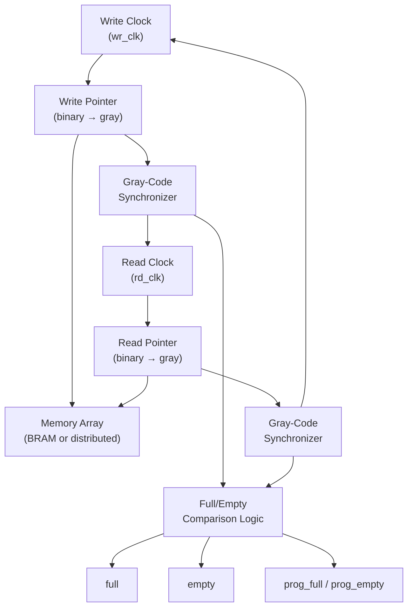
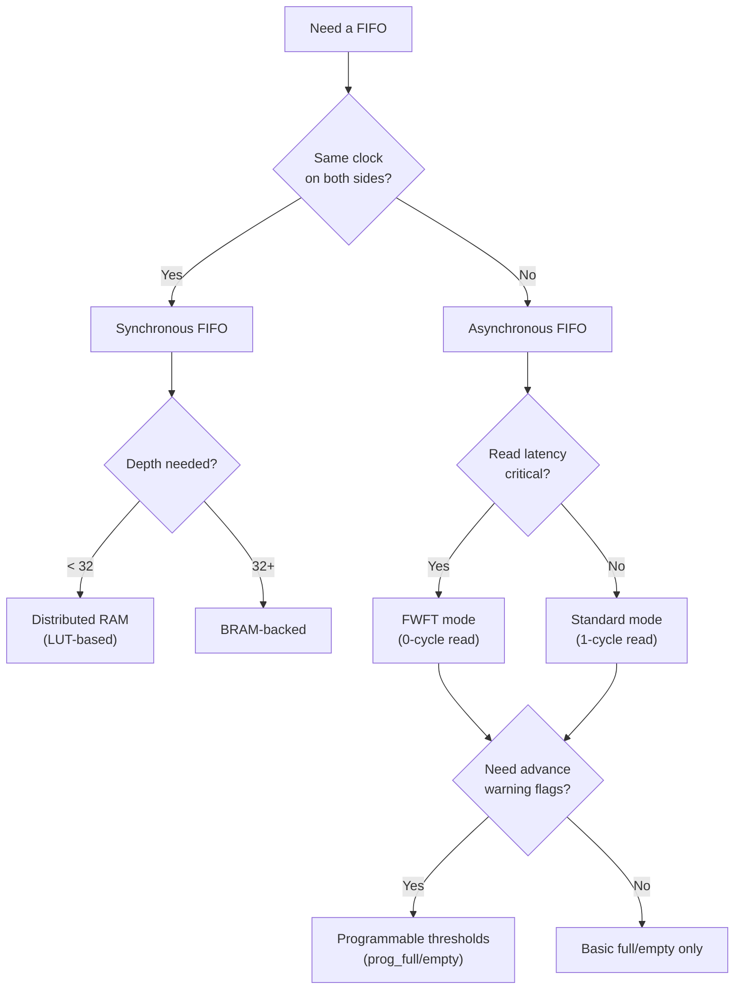

[← IP & Cores Home](../README.md) · [← Project Home](../../README.md)

# FIFO IP — Asynchronous and Synchronous FIFO Design, Configuration, and Usage

FIFOs (First-In, First-Out buffers) are among the top three most-instantiated IP blocks in any FPGA design, alongside clock management and memory controllers. Every data path that crosses a clock domain, every pipeline that decouples producer from consumer, and every interface that buffers burst data into a steady stream relies on a FIFO. Despite their apparent simplicity, FIFOs hide subtle design challenges: gray-code pointer synchronization across clock domains, full/empty detection without false negatives, and programmable threshold interrupts that must account for latency. This article covers the architecture, vendor IP configuration, and practical usage of both asynchronous (dual-clock) and synchronous (single-clock) FIFOs across all FPGA vendors.

> [!NOTE]
> This article covers the **IP configuration and usage** of FIFOs. For the CDC theory behind async FIFO pointer synchronization, see [Clock Domain Crossing](../../05_timing_and_constraints/clock_domain_crossing.md). For BRAM hardware that backs most FIFOs, see [BRAM & URAM](../../02_architecture/fabric/bram_and_uram.md).

---

## Overview: Why FIFO IP Exists

A FIFO solves one fundamental problem: **decoupling the timing relationship between a data producer and a data consumer**. The three canonical use cases:

| Use Case | FIFO Type | Example |
|---|---|---|
| **Clock domain crossing** | Async (dual-clock) | 200 MHz DSP pipeline → 100 MHz AXI bridge |
| **Rate matching / burst buffering** | Sync or Async | Ethernet MAC burst → steady-rate processing pipeline |
| **Pipeline decoupling** | Sync | Producer stalls on cache miss while consumer continues from FIFO |

Without a FIFO, the producer must wait for the consumer on every transfer — eliminating all throughput advantage from parallelism. With a FIFO, the producer writes at its own rate, the consumer reads at its own rate, and the FIFO absorbs the difference.

---

## FIFO Architecture

### Block Diagram



### Key Design Decisions

| Decision | Options | Impact |
|---|---|---|
| **Memory type** | BRAM (deep, 18/36 Kb), distributed (shallow, LUT-based), URAM (UltraScale+ only) | Depth, width, power |
| **Clocking** | Common clock (sync), independent clocks (async) | CDC requirements |
| **Read latency** | Standard (1 cycle), FWFT (0 cycle) | Throughput vs simplicity |
| **ECC** | None, inline ECC (Xilinx), parity (Intel) | Reliability vs area |
| **Synchronization stages** | 2-FF (default), 3-FF, 4-FF | MTBF vs latency |
| **Programmable thresholds** | None, prog_full, prog_empty, both | Flow control without polling |

---

## Vendor FIFO IP Comparison

| Feature | Xilinx FIFO Generator | Intel DCFIFO | Lattice FIFO | Gowin FIFO | Microchip FIFO |
|---|---|---|---|---|---|
| **Sync FIFO** | Yes | Yes (SCFIFO) | Yes | Yes | Yes |
| **Async FIFO** | Yes | Yes (DCFIFO) | Yes | Yes | Yes |
| **FWFT mode** | Yes | Yes | No (standard only) | No | Yes |
| **BRAM-backed** | Yes (18K/36K) | Yes (M9K/M20K) | Yes (ECP5 EBR) | Yes (BSRAM) | Yes (LSRAM) |
| **Distributed RAM** | Yes (LUT-based) | Yes (ALM-based) | Yes (LUT-based) | Yes (LUT-based) | No |
| **Built-in ECC** | Yes (UltraScale+) | Yes (Arria 10+) | No | No | Yes (PolarFire) |
| **Programmable thresholds** | Yes (prog_full/empty) | Yes (almost_full/empty) | No (fixed flags) | No | Yes |
| **Configurable sync stages** | 2–6 | 2–4 | 2 (fixed) | 2 (fixed) | 2–4 |
| **Built-in CDC** | Yes (async mode) | Yes (DCFIFO) | Yes (async mode) | Yes | Yes |
| **Max depth (BRAM)** | 4M+ (cascaded) | 256K+ | 4K (single EBR) | 32K | 16K |
| **Auto-constraint** | Yes (XDC) | Yes (SDC) | Yes (LPF) | Yes (SDC) | Yes (SDC) |

---

## Xilinx: FIFO Generator

The Xilinx FIFO Generator (PG057) is the primary IP for creating sync and async FIFOs. It wraps BRAM or distributed RAM with control logic, gray-code synchronizers (for async), and status flags.

### Port Interface (Async FIFO, FWFT Mode)

| Port | Direction | Width | Description |
|---|---|---|---|
| `wr_clk` | Input | 1 | Write domain clock |
| `rd_clk` | Input | 1 | Read domain clock |
| `rst` | Input | 1 | Synchronous reset (resets both domains) |
| `din` | Input | DATA_WIDTH | Data input |
| `wr_en` | Input | 1 | Write enable — qualifies `din` |
| `rd_en` | Input | 1 | Read enable — qualifies `dout` |
| `dout` | Output | DATA_WIDTH | Data output (FWFT: first word available immediately) |
| `full` | Output | 1 | FIFO is full — writes are ignored |
| `empty` | Output | 1 | FIFO is empty — reads return invalid data |
| `prog_full` | Output | 1 | FIFO fill ≥ programmable threshold |
| `prog_empty` | Output | 1 | FIFO fill ≤ programmable threshold |
| `wr_data_count` | Output | CNT_WIDTH | Approximate fill level (write domain) |
| `rd_data_count` | Output | CNT_WIDTH | Approximate fill level (read domain) |
| `valid` | Output | 1 | FWFT: output data is valid |

### Standard vs FWFT (First-Word Fall-Through)

| Characteristic | Standard Mode | FWFT Mode |
|---|---|---|
| **Read latency** | 1 clock cycle (after `rd_en`) | 0 cycles (data appears before `rd_en`) |
| **First read** | Assert `rd_en` → data on next clock | Data appears on `dout` when FIFO goes non-empty |
| **Behavior** | Like a registered BRAM read port | Like a shift register output |
| **Empty flag** | Deasserted when data available for read | Deasserted when first word is already on `dout` |
| **Use when** | Simple pipeline buffering | Lower-latency interfaces, AXI-Stream pipelines |

```verilog
// Standard mode read — must wait 1 cycle
always @(posedge rd_clk) begin
    if (!empty) begin
        rd_en <= 1'b1;         // Request read
        // Data available on dout NEXT cycle
    end else begin
        rd_en <= 1'b0;
    end
end

// FWFT mode read — data already available
always @(posedge rd_clk) begin
    // dout already has valid data when empty=0
    // Consume it by asserting rd_en
    if (!empty && consumer_ready) begin
        rd_en <= 1'b1;         // Acknowledge / consume current word
    end else begin
        rd_en <= 1'b0;         // Hold current word on dout
    end
end
```

### Tcl: Instantiating the FIFO Generator

```tcl
# Create async FIFO — 100 MHz write, 50 MHz read
create_ip -name fifo_generator -vendor xilinx.com -library ip -module_name async_fifo_16x32

set_property -dict [list \
  CONFIG.Fifo_Implementation {Independent_Clocks_Block_RAM} \
  CONFIG.Input_Data_Width {32} \
  CONFIG.Input_Depth {16} \
  CONFIG.Output_Data_Width {32} \
  CONFIG.Output_Depth {16} \
  CONFIG.Reset_Type {Asynchronous_Reset} \
  CONFIG.Full_Flags_Reset_Value {1} \
  CONFIG.Use_Dout_Reset {true} \
  CONFIG.Programmable_Full_Type {Single_Programmable_Full_Threshold_Constant} \
  CONFIG.Full_Threshold_Assert_Value {13} \
  CONFIG.Programmable_Empty_Type {Single_Programmable_Empty_Threshold_Constant} \
  CONFIG.Empty_Threshold_Assert_Value {3} \
  CONFIG.Write_Data_Count {true} \
  CONFIG.Read_Data_Count {true} \
] [get_ips async_fifo_16x32]

generate_target all [get_ips async_fifo_16x32]
```

### Verilog Instantiation

```verilog
// Async FIFO: 32-bit wide, 16 deep, BRAM-backed, FWFT
fifo_generator_0 fifo_cdc (
    .wr_clk         (clk_200m),
    .rd_clk         (clk_100m),
    .rst            (sys_rst),
    .din            (wr_data),
    .wr_en          (wr_valid),
    .rd_en          (rd_ready),
    .dout          (rd_data),
    .full          (fifo_full),
    .empty         (fifo_empty),
    .prog_full     (fifo_almost_full),  // Asserts at depth ≥ 13
    .prog_empty    (fifo_almost_empty), // Asserts at depth ≤ 3
    .valid         (rd_valid),
    .wr_data_count (wr_fill_level),
    .rd_data_count (rd_fill_level)
);
```

---

## Intel: DCFIFO (Dual-Clock FIFO)

Intel provides SCFIFO (single-clock) and DCFIFO (dual-clock) as standard IP in Quartus. The DCFIFO includes built-in gray-code synchronizers and metastability protection.

### Key Parameters

| Parameter | Description | Typical Values |
|---|---|---|
| `LPM_WIDTH` | Data width | 8, 16, 32, 64, 128 |
| `LPM_NUMWORDS` | FIFO depth | 16, 32, 64, 256, 1024 |
| `LPM_DIRECTION` | Direction | `"UNUSED"` (bidirectional) |
| `DELAY_RDUSEDW` | Read-side used-word delay | 0 (no delay), 1 (registered) |
| `DELAY_WRUSEDW` | Write-side used-word delay | 0 (no delay), 1 (registered) |
| `OVERFLOW_CHECKING` | Overflow protection | `"ON"` (recommended) |
| `UNDERFLOW_CHECKING` | Underflow protection | `"ON"` (recommended) |
| `ADD_USED_WR_BIT` | Extra bit for usedw accuracy | `"OFF"`, `"ON"` |

### Intel DCFIFO Metastability Protection

Intel's DCFIFO offers configurable synchronization stages (2–4 FFs) for the gray-code pointer crossing. More stages increase MTBF but add 1 cycle of latency per stage.

| Sync Stages | MTBF (relative) | Extra Latency | When to Use |
|---|---|---|---|
| 2 | Baseline | 0 | Low-frequency clocks, relaxed reliability |
| 3 | ~100× better | +1 rd_clk cycle | Most designs (recommended) |
| 4 | ~10,000× better | +2 rd_clk cycles | High-frequency, safety-critical |

### VHDL Instantiation (Intel DCFIFO)

```vhdl
-- Intel DCFIFO: 32-bit, 256 deep, dual-clock
component dcfifo is
    generic (
        LPM_WIDTH       : natural := 32;
        LPM_NUMWORDS    : natural := 256;
        LPM_WIDTHU      : natural := 8;    -- usedw width = ceil(log2(NUMWORDS))
        DELAY_RDUSEDW   : natural := 1;
        DELAY_WRUSEDW   : natural := 1;
        ADD_USED_WR_BIT : string  := "ON";
        OVERFLOW_CHECKING  : string := "ON";
        UNDERFLOW_CHECKING : string := "ON"
    );
    port (
        data    : in  std_logic_vector(LPM_WIDTH-1 downto 0);
        wrclk   : in  std_logic;
        wrreq   : in  std_logic;
        rdclk   : in  std_logic;
        rdreq   : in  std_logic;
        q       : out std_logic_vector(LPM_WIDTH-1 downto 0);
        wrusedw : out std_logic_vector(LPM_WIDTHU downto 0);
        rdusedw : out std_logic_vector(LPM_WIDTHU downto 0);
        full    : out std_logic;
        empty   : out std_logic
    );
end component;

fifo_cdc : dcfifo
    generic map (
        LPM_WIDTH       => 32,
        LPM_NUMWORDS    => 256,
        ADD_USED_WR_BIT => "ON"
    )
    port map (
        data    => wr_data,
        wrclk   => clk_200m,
        wrreq   => wr_valid,
        rdclk   => clk_100m,
        rdreq   => rd_ready,
        q       => rd_data,
        full    => fifo_full,
        empty   => fifo_empty
    );
```

---

## Lattice: FIFO IP

Lattice ECP5 and CertusPro-NX provide FIFO IP through Diamond/Radiant IP Express. The ECP5 FIFO is BRAM (EBR) backed.

### ECP5 FIFO Configuration

```
IP Express → FIFO:
  - Mode: Synchronous / Asynchronous
  - Data width: 32 bits
  - Depth: 1024
  - Memory type: EBR (Block RAM)
  - Flags: full, empty, almost_full, almost_empty
  - Almost-full threshold: 960
  - Almost-empty threshold: 64
```

### Verilog Instantiation (ECP5)

```verilog
// ECP5 Async FIFO — 32-bit, 1024 deep
fifo_async_32x1024 fifo_inst (
    .Data         (wr_data),
    .WrClock      (clk_200m),
    .RdClock      (clk_100m),
    .WrEn         (wr_valid),
    .RdEn         (rd_ready),
    .Reset        (sys_rst),
    .Q            (rd_data),
    .Full         (fifo_full),
    .Empty        (fifo_empty),
    .AlmostFull   (fifo_almost_full),
    .AlmostEmpty  (fifo_almost_empty)
);
```

> [!NOTE]
> Lattice ECP5 FIFO IP does not support FWFT mode. The read latency is always 1 clock cycle.

---

## Gowin: FIFO IP

Gowin FPGAs provide a simple FIFO IP generated through the Gowin EDA IP Core Generator. The FIFO uses BSRAM (Block SRAM) for deeper FIFOs and distributed RAM for shallow ones.

### Configuration

```
Gowin EDA → IP Core Generator → FIFO:
  - Type: Async / Sync
  - Data width: 16 bits
  - Depth: 256
  - Memory type: BSRAM
  - Flags: full, empty
```

### Verilog Instantiation (Gowin)

```verilog
// Gowin Async FIFO — 16-bit, 256 deep
fifo_async_16x256 fifo_inst (
    .Data    (wr_data),
    .WrClk   (clk_50m),
    .RdClk   (clk_25m),
    .WrEn    (wr_valid),
    .RdEn    (rd_ready),
    .Reset   (sys_rst),
    .Q       (rd_data),
    .Full    (fifo_full),
    .Empty   (fifo_empty)
);
```

---

## Microchip: FIFO IP

Microchip PolarFire and SmartFusion2 provide FIFO IP through Libero SmartDesign. The PolarFire FIFO supports ECC and configurable thresholds.

### PolarFire FIFO Features

| Feature | Value |
|---|---|
| Memory type | LSRAM |
| Max depth | 16K entries |
| ECC | Optional (single-error-correct, double-error-detect) |
| Programmable thresholds | Yes |
| FWFT | Yes |
| Sync stages | 2–4 (configurable) |

---

## Programmable Thresholds (prog_full / prog_empty)

Programmable thresholds provide advance warning before the FIFO reaches its limits — essential for backpressure and flow control without polling.

### How They Work

```
FIFO Depth: 1024
prog_full  threshold: 900  → asserts when fill ≥ 900
prog_empty threshold: 100  → asserts when fill ≤ 100

Write side:  when prog_full=1, apply backpressure to producer
Read side:   when prog_empty=0, start prefetching data from slow source
```

### Threshold Selection Guide

| FIFO Depth | prog_full | prog_empty | Reasoning |
|---|---|---|---|
| 16 | 13 | 3 | Small FIFO — tight margins |
| 256 | 220 | 36 | ~85% full, ~14% empty — typical for packet buffering |
| 1024 | 900 | 100 | ~88% / ~10% — burst absorption with margin |
| 4096 | 3800 | 200 | ~93% / ~5% — deep buffering, large bursts |

> [!WARNING]
> **Threshold accuracy has latency.** The `prog_full` signal is computed from the synchronized (gray-code) read pointer — which lags the actual read pointer by 2–4 clock cycles. In the worst case, the FIFO may be emptier than `prog_full` indicates. Always account for this by setting thresholds with margin.

---

## Data Count Accuracy

### Write-Side vs Read-Side Counts

| Count Type | Accuracy | Domain | Use |
|---|---|---|---|
| `wr_data_count` | ±(2–4) words | Write clock | Backpressure decisions |
| `rd_data_count` | ±(2–4) words | Read clock | Flow control decisions |
| Neither | Exact | Neither | Not available in async FIFOs |

**Why not exact?** In an async FIFO, the write side cannot instantaneously know the read pointer (it's in a different clock domain). The gray-code synchronization adds 2–4 cycles of latency. During that time, reads may have occurred, making the count stale.

**Rule of thumb:** Treat `wr_data_count` as a ceiling (FIFO is at most this full) and `rd_data_count` as a floor (FIFO is at least this full).

---

## Common Pitfalls

### 1. Writing to a Full FIFO

**The mistake:** Asserting `wr_en` when `full` is high.

**Why it fails:** The write is silently dropped (Xilinx) or corrupts the last written word (Intel, depending on overflow checking settings). No error flag is asserted by default.

**The fix:** Always check `full` before asserting `wr_en`. Enable overflow checking in the IP configuration. In RTL:

```verilog
// BAD: unconditional write
assign wr_en = producer_valid;
assign din   = producer_data;

// GOOD: gated write with backpressure
assign wr_en = producer_valid && !fifo_full;
assign din   = producer_data;
assign producer_ready = !fifo_full;  // Backpressure
```

### 2. Reading from an Empty FIFO

**The mistake:** Asserting `rd_en` when `empty` is high.

**Why it fails:** Standard mode returns garbage data. FWFT mode holds the last valid word on `dout` but `valid` deasserts.

**The fix:** Gate reads with `empty`:

```verilog
// BAD: unconditional read
assign rd_en = consumer_ready;

// GOOD: gated read
assign rd_en = consumer_ready && !fifo_empty;
assign consumer_valid = !fifo_empty;  // Data available
```

### 3. Forgetting Reset Behavior

**The mistake:** Not resetting the FIFO after configuration, or resetting while data is being written.

**Why it fails:** After FPGA configuration, FIFO pointers may be in an undefined state. Without a proper reset, the FIFO may appear full or empty incorrectly.

**The fix:** Apply a reset for at least 5 write-clock cycles + 5 read-clock cycles after configuration. Wait for `full` and `empty` to deassert before enabling data flow.

### 4. Asymmetric Width FIFOs

**The mistake:** Using a 32-bit write / 8-bit read FIFO and assuming the 8-bit reads come out in the same order as the 32-bit writes.

**Why it fails:** Asymmetric FIFOs pack/unpack data in little-endian byte order by default. The first 8-bit read returns bits [7:0] of the first 32-bit write, not bits [31:24].

**The fix:** Check the vendor's byte ordering convention. Xilinx uses little-endian by default; use `CONFIG.Data_Count_Width` and related settings to verify. Intel DCFIFO has an `ADD_USED_WR_BIT` option that affects counting.

### 5. Timing Violations on Full/Empty Flags

**The mistake:** Treating `full` and `empty` as synchronous signals that meet timing in the destination domain.

**Why it fails:** In async FIFOs, `full` is generated in the write domain using a synchronized version of the read pointer. It is valid in the write domain but has no timing relationship with the read clock. Similarly, `empty` is valid only in the read domain.

**The fix:** The FIFO IP handles CDC internally. Do not apply false-path or clock-group constraints between `wr_clk` and `rd_clk` on FIFO-internal signals. The generated XDC/SDC constraints handle this automatically. Only constrain the external interfaces.

---

## Decision Guide: Which FIFO Configuration?



### Quick Selection Table

| Scenario | FIFO Type | Width × Depth | Mode | Flags |
|---|---|---|---|---|
| AXI-Stream CDC bridge | Async | 32 × 256 | FWFT | prog_full + prog_empty |
| Processor-to-peripheral buffer | Sync | 8 × 16 | Standard | full + empty |
| Ethernet frame buffer | Async | 64 × 4096 | FWFT | prog_full (backpressure) |
| DSP pipeline stage | Sync | 16 × 8 | FWFT | empty only |
| DDR write data buffer | Async | 256 × 512 | Standard | prog_full + data_count |
| Slow ADC to fast processor | Async | 12 × 1024 | Standard | prog_empty (prefetch) |

---

## Open-Source FIFO Implementations

| Project | Language | Features | Use Case |
|---|---|---|---|
| **LiteX LiteFIFO** | Migen/Amaranth | Async/sync, programmable thresholds | LiteX SoC designs |
| **ZipCPU wbfifo** | Verilog | Wishbone-bus FIFO, dual-clock | Wishbone-based systems |
| **alexforencich async_fifo** | Verilog | Parameterized, synthesis-proven | General-purpose, vendor-agnostic |
| **PoC fifo_async** | VHDL | Sync/async, generic depth/width | VHDL-centric projects |
| **OpenCores fifo** | Verilog/VHDL | Various community implementations | Educational / prototyping |

### LiteX FIFO Example

```python
from migen import *

class MySoC(Module):
    def __init__(self, platform):
        # Async FIFO crossing from sys_clk to eth_clk
        fifo = stream.AsyncFIFO([("data", 32)], depth=256)
        self.submodules += fifo
        self.comb += [
            # Write side (sys_clk domain)
            fifo.sink.valid.eq(producer_valid),
            fifo.sink.data.eq(producer_data),
            producer_ready.eq(fifo.sink.ready),

            # Read side (eth_clk domain)
            consumer_valid.eq(fifo.source.valid),
            consumer_data.eq(fifo.source.data),
            fifo.source.ready.eq(consumer_ready),
        ]
```

---

## References

| Source | Document |
|---|---|
| Xilinx PG057 | FIFO Generator v13.2 LogiCORE IP Product Guide |
| Xilinx UG573 | UltraScale Architecture Memory Resources User Guide — FIFO section |
| Intel 683448 | DCFIFO (Dual-Clock FIFO) IP Core User Guide |
| Lattice TN1264 | ECP5 Memory User Guide — FIFO section |
| Gowin UG286 | Gowin FIFO IP User Guide |
| Microchip UG0682 | PolarFire FPGA Memory Resources User Guide |
| [Clock Domain Crossing](../../05_timing_and_constraints/clock_domain_crossing.md) | CDC theory, gray-code pointer synchronization |
| [BRAM & URAM](../../02_architecture/fabric/bram_and_uram.md) | Memory primitives that back FIFO storage |
| [CDC Coding Patterns](../../04_hdl_and_synthesis/cdc_coding.md) | HDL patterns for clock domain crossing |
