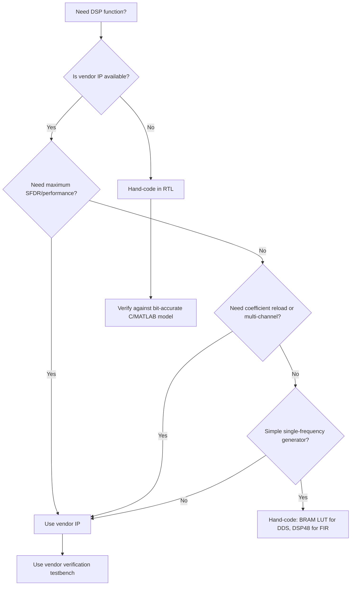

[← 06 Ip And Cores Home](../README.md) · [← Other Hard Ip Home](README.md) · [← Project Home](../../../README.md)

# Signal Processing IP — FFT, FIR, DDS, CORDIC Vendor Comparison

DSP-heavy FPGA designs rely heavily on vendor IP blocks for FFT (Fast Fourier Transform), FIR (Finite Impulse Response) filters, DDS (Direct Digital Synthesis), and CORDIC (Coordinate Rotation Digital Computer). These IP cores are optimized to map directly onto vendor DSP slices (Xilinx DSP48E2, Intel DSP blocks, Lattice sysDSP), achieving higher clock rates and lower power than hand-coded RTL in most cases. This article compares vendor IP against hand-coded alternatives and provides integration patterns for each DSP function.

> [!NOTE]
> For DSP slice architecture (DSP48E2 internals, multiply-accumulate chains), see [DSP & Math Blocks](../../02_architecture/fabric/dsp_math_blocks.md). For HDL coding patterns that infer DSP slices, see [Inference Rules](../../04_hdl_and_synthesis/inference_rules.md).

---

## FFT (Fast Fourier Transform)

### Vendor IP vs Hand-Coded

| Aspect | Vendor FFT IP | Hand-Coded FFT |
|---|---|---|
| Implementation | Optimized for vendor DSP slices | Your choice of architecture |
| Configurations | Pipelined, streaming, burst, radix-2/4/8 | Whatever you write |
| Resource efficiency | Best — maps to DSP48/MULTADD exactly | Usually worse than vendor |
| Latency | Predictable (vendor data sheet) | Variable |
| Throughput | 1 sample/clock (pipelined) | Depends on design |
| Verification | Pre-verified by vendor | Your responsibility |

### By Vendor

| Vendor | IP Name | Max Points | Architecture | Interface | Notes |
|---|---|---|---|---|---|
| **Xilinx** | Fast Fourier Transform (PG109) | Up to 65536 | Pipelined Streaming, Burst, Radix-2/4, Radix-2 Lite | AXI4-Stream | Internal rounding/convergent rounding options. Phase factor width configurable. |
| **Intel** | FFT IP Core | Up to 65536 | Streaming, Variable Streaming, Buffered Burst, Burst | Avalon-ST | Variable streaming can change FFT size on-the-fly. |
| **Lattice** | FFT Compiler | Up to 4096 | Pipelined, Burst | Conventional | Smaller catalog, fewer options. |

**Resource example (Xilinx 1024-pt pipelined):** ~16 DSP48, ~12 BRAM, ~3K LUTs

### FFT Architecture Selection

| Architecture | Throughput | Latency | Resource | Best For |
|---|---|---|---|---|
| **Pipelined Streaming** | 1 sample/clock | ~N cycles (transform latency) | Highest (4 multipliers per butterfly) | Real-time spectrum analysis, radar |
| **Burst I/O** | 1 transform per ~N²/log₂(N) cycles | High | Lowest | Off-line processing, low sample rate |
| **Radix-2 Lite** | 1/2 sample/clock | Moderate | Low (2 multipliers per butterfly) | Cost-sensitive designs |

```verilog
// Xilinx FFT instantiation — Pipelined Streaming, 1024-point
// PG109 — Vivado 2023.2
xilinx_fft_1024 u_fft (
    .aclk             (clk),
    .aresetn          (rst_n),
    .s_axis_data_tdata  ({16'h0000, fft_in_data}),  // Imag[15:0], Real[15:0]
    .s_axis_data_tvalid (fft_in_valid),
    .s_axis_data_tready (fft_in_ready),
    .s_axis_data_tlast  (fft_in_last),
    .m_axis_data_tdata  (fft_out_data),   // Imag[15:0], Real[15:0]
    .m_axis_data_tvalid (fft_out_valid),
    .m_axis_data_tready (fft_out_ready),
    .m_axis_data_tlast  (fft_out_last),
    .event_data_in_channel_halt (fft_halt)  // Backpressure event
);
```

---

## FIR Filter

### Architecture Choices

| Architecture | DSP Usage | Latency | Throughput | Best For |
|---|---|---|---|---|
| **Systolic (fully pipelined)** | 1 DSP per tap | Linear with taps | 1 sample/clock | High throughput, fixed coefficients |
| **Semi-parallel (folded)** | N DSPs for M taps | Higher | N/M × sample rate | Balance DSP vs throughput |
| **Transposed** | 1 DSP per tap | 1 sample (pipelined) | 1 sample/clock | Lowest latency from input to output |
| **Polyphase** | Sub-filter DSP count | Sub-filter depth | Input rate / decimation factor | Decimation/interpolation filters |

### By Vendor

| Vendor | IP Name | Max Taps | Rate Change | Notes |
|---|---|---|---|---|
| **Xilinx** | FIR Compiler (PG149) | Unlimited (resource-limited) | Interpolation 1–64×, Decimation 1–64× | Coefficient reload, symmetric/antisymmetric, Hilbert/Interpolating. |
| **Intel** | FIR II IP Core | Unlimited | Interpolation, Decimation, Fractional | Fixed, reloadable coefficients. Multi-cycle variable support. |
| **Lattice** | FIR Filter | 1024 taps typical | Single rate or multirate | Radiant Clarity Designer integration. |

### Symmetric FIR Optimization

For symmetric FIR filters (linear phase), you can halve the number of multipliers by pre-adding symmetric coefficients:

```verilog
// Symmetric FIR: N taps → N/2 multipliers
// For a 16-tap symmetric filter, this uses only 8 DSP slices
// instead of 16.
// Xilinx FIR Compiler does this automatically when
// "Symmetric" coefficient type is selected.
```

---

## DDS (Direct Digital Synthesis)

Generates sine/cosine waveforms digitally from a phase accumulator:

\[f_{out} = \frac{\Delta\theta \times f_{clk}}{2^N}\]

### By Vendor

| Vendor | IP Name | Output Width | SFDR (typical) | Channels | Notes |
|---|---|---|---|---|---|
| **Xilinx** | DDS Compiler (PG141) | 8–32 bit | 48–96 dB | 1 | Phase dithering, Taylor series correction. AXI4-Stream. |
| **Intel** | NCO IP Core | 8–32 bit | 48–115 dB | Up to 32 | Multi-channel. Phase dithering, Taylor correction. |
| **Lattice** | DDS | 8–24 bit | 48–72 dB | 1 | Simpler implementation. |

### DDS: Vendor IP vs Hand-Coded BRAM LUT

| Approach | Resources | SFDR | Flexibility | Effort |
|---|---|---|---|---|
| **Vendor DDS IP** | ~500 LUTs + 2 BRAM | 48–115 dB | Programmable phase increment, multi-channel | Low (wizard) |
| **BRAM sine LUT** | 1 BRAM + ~200 LUTs | 48–72 dB | Fixed frequency (unless dual-port LUT with phase offset) | Low (50 lines of RTL) |
| **CORDIC (iterative)** | ~200 LUTs per iteration | Depends on iterations | Variable frequency, any angle | Medium |

**When to hand-code DDS:** Simple sine generation at a fixed frequency → BRAM LUT is simpler and sufficient. Use vendor IP only for multi-channel, high-SFDR, or phase-modulation requirements.

---

## CORDIC

A rotation-mode CORDIC computes:

\[x' = x \cos\theta - y \sin\theta\]
\[y' = y \cos\theta + x \sin\theta\]

Uses iterative shift-and-add for hardware-efficient trig/rotations — no multipliers required.

### By Vendor

| Vendor | IP Name | Modes | Latency | Notes |
|---|---|---|---|---|
| **Xilinx** | CORDIC (PG105) | Rotate, Translate, Sin/Cos, Sinh/Cosh, Arctan, Square Root | N+2 cycles (N=iterations) | AXI4-Stream. Configurable precision. |
| **Intel** | CORDIC (part of DSP Builder) | Rotate, Sin/Cos, Arctan, Magnitude | N cycles | Tighter integration with DSP Builder. |

### CORDIC vs DSP Multiply for Rotation

| Approach | Resources | Latency | When to Use |
|---|---|---|---|
| **CORDIC** | ~200 LUTs/iteration, 0 DSP | N+2 cycles | Variable angle, no DSP slices available |
| **DSP48 multiply** | 1 DSP48 + ~100 LUTs | 3–4 cycles (pipelined) | Fixed or variable angle when DSP slices available |

**Rule of thumb:** If DSP slices are available, use `x*cos(θ) - y*sin(θ)` with DSP48 multipliers — it's 3–5× faster than CORDIC and consumes only 3 DSP slices. CORDIC is for when DSP slices are exhausted or when the angle is purely iterative.

---

## Decision Guide: When to Use Vendor DSP IP



---

## Best Practices

1. **Try vendor IP first** — vendor DSP IP maps to hardware DSP slices optimally, often better than hand-written inference
2. **Use pipelined streaming FFT** whenever throughput matters — the latency hit (1024 cycles for 1024-pt) is worth the 1 sample/clock throughput
3. **DDS for simple sine: BRAM LUT** — a 4096-entry × 16-bit sine table uses 1 BRAM and ~200 LUTs vs vendor IP overhead (~500 LUTs for wrapper)
4. **Coefficient reload** — for adaptive FIR filters, verify the IP supports real-time coefficient update without re-synthesis
5. **Check SFDR, not just resolution** — a 16-bit DDS with 72 dB SFDR is cleaner than 24-bit with 48 dB SFDR
6. **Always verify with a bit-accurate model** — generate a C or MATLAB reference model with identical quantization, and compare against the IP's output in simulation

---

## Pitfalls

### 1. FFT Scaling Overflow
Pipelined FFTs accumulate gain across stages. Without scaling, a 1024-point FFT can overflow by 10 bits (30 dB).

**Fix:** Enable "scaling schedule" in the FFT IP. For Xilinx, configure `scale_sch` to divide by 2 at each stage. For unscaled FFTs, use sufficient output width (input width + log₂(N) guard bits).

### 2. FIR Coefficient Quantization Mismatch
If you design an FIR filter in MATLAB with 64-bit floating-point coefficients and then quantize to 16-bit fixed for the IP, the stopband attenuation may degrade by 10–20 dB.

**Fix:** Use the vendor's coefficient generator (Xilinx FIR Compiler has a built-in filter designer) which accounts for quantization effects. Alternatively, use MATLAB `fir1()` with coefficient quantization verification.

### 3. CORDIC Gain Compensation
CORDIC rotation introduces a gain factor of approximately 1.6468 (product of √(1+2^(-2i))). If you don't compensate, your output amplitude will be wrong.

**Fix:** Either divide the output by 1.6468 (requires a multiplier), or pre-scale the input by 1/1.6468. Xilinx CORDIC IP has an optional "Coarse Rotation" mode that handles this automatically.

---

## References

- Xilinx PG109: Fast Fourier Transform LogiCORE IP
- Xilinx PG149: FIR Compiler LogiCORE IP
- Xilinx PG141: DDS Compiler LogiCORE IP
- Xilinx PG105: CORDIC LogiCORE IP
- Intel FIR II IP Core User Guide
- Intel NCO IP Core User Guide
- Lattice Radiant IP User Guides
- [DSP & Math Blocks](../../02_architecture/fabric/dsp_math_blocks.md) — DSP slice architecture
- [Inference Rules](../../04_hdl_and_synthesis/inference_rules.md) — HDL patterns that infer DSP slices
