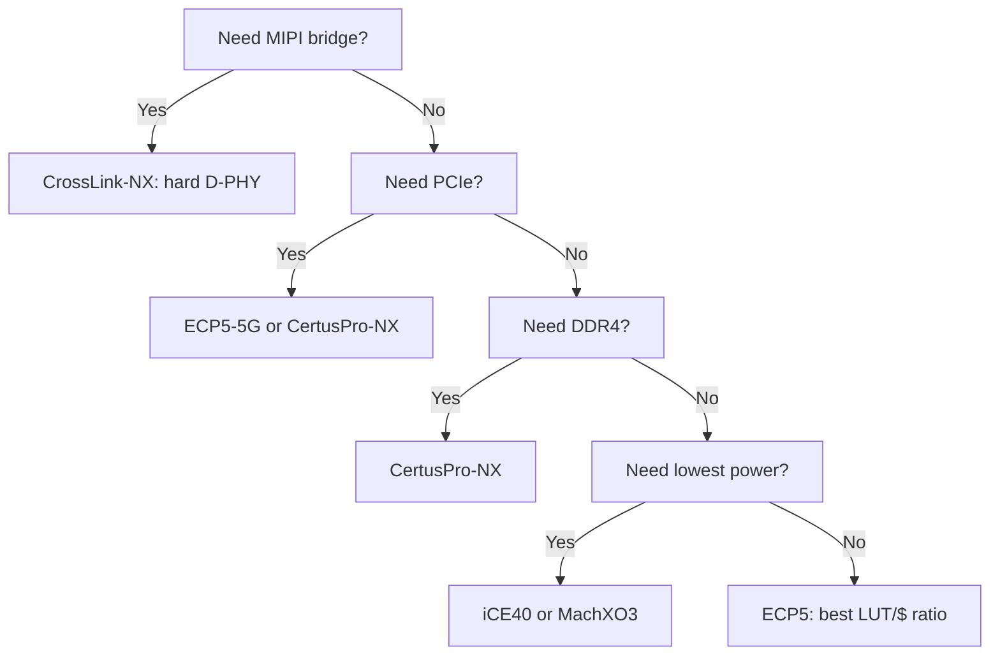

[← 06 Ip And Cores Home](../README.md) · [← Vendor Ip Home](README.md) · [← Project Home](../../../README.md)

# Lattice IP Ecosystem — Diamond IPexpress & Radiant Clarity Designer

Lattice's IP catalog is smaller than Xilinx or Intel but strategically focused on Lattice's market strengths: low-power bridging, MIPI aggregation, and small-form-factor interface conversion. The IP tools have evolved from Diamond's IPexpress (wizard-based, standalone) to Radiant's Clarity Designer (integrated block-design flow). Understanding which IP is available on which family — and which requires a paid license — is essential for Lattice-based designs.

> [!NOTE]
> For clock management IP (PLL, dynamic clock mux), see [Clock Management IP](../clocking_ip/clock_management_ip.md). For FIFO IP, see [FIFO Design](../fifo_ip/fifo_design.md). This article covers the broader Lattice IP catalog beyond those fundamental blocks.

---

## Tool Evolution

| Tool | IDE | IP Tool | Families | Status |
|---|---|---|---|---|
| **Diamond** | Diamond 3.x | IPexpress | ECP5, MachXO2/3, iCE40 (some) | Mature, legacy focus |
| **Radiant** | Radiant 2024.x | Clarity Designer | CertusPro-NX, CrossLink-NX, Avant | Active development |

### IPexpress vs Clarity Designer

| Feature | IPexpress (Diamond) | Clarity Designer (Radiant) |
|---|---|---|
| Interface | Standalone wizard per IP | Integrated module/IP block design |
| Bus connection | Manual HDL wiring | Drag-and-drop (simplified) |
| Parameter GUI | Text-based + tabbed | Modern GUI with preview |
| Simulation | Separate ModelSim project | Integrated with Radiant Sim |
| Output | VHDL/Verilog + `.ipx` config file | VHDL/Verilog + `.cmp` component file |
| Scripting | Limited Tcl | Full Tcl API for CI/CD |

---

## IP Catalog by Category

### Clocking

| IP | Description | Families | License |
|---|---|---|---|
| **PLL** | Phase-locked loop: clock multiplication, phase shift, duty cycle | All families | Free |
| **DCMA** | Dynamic Clock Mux Architecture: glitch-free clock switching | ECP5, MachXO3 | Free |

> See [Clock Management IP](../clocking_ip/clock_management_ip.md) for PLL configuration details, DRP-equivalent register access, and phase-alignment patterns.

### Memory Interfaces

| IP | Description | Families | License |
|---|---|---|---|
| **DDR2/3 Controller** | Hard DDR2/3 memory controller with calibration | ECP5 | Free |
| **LPDDR2/3 Controller** | Low-power DDR for mobile/edge | CrossLink-NX | Free |
| **DDR4 Controller** | DDR4 with ECC support | CertusPro-NX | Free |
| **Soft Memory Controller** | Generic SRAM/Flash interface | All | Free |

> See [DDR IP](../ddr/README.md) for detailed per-vendor memory interface comparison.

### High-Speed I/O (Lattice's Differentiator)

| IP | Description | Families | License |
|---|---|---|---|
| **MIPI D-PHY RX** | Hard D-PHY: 1–4 lanes CSI-2 camera input | CrossLink-NX (hard) | Free |
| **MIPI D-PHY TX** | Hard D-PHY: 1–4 lanes DSI display output | CrossLink-NX (hard) | Free |
| **MIPI CSI-2 Controller** | Camera Serial Interface protocol layer | CrossLink-NX | Free |
| **MIPI DSI Controller** | Display Serial Interface protocol layer | CrossLink-NX | Free |
| **HDMI/DVI TX** | TMDS encoding, audio embedding | ECP5, MachXO3 | Free (soft) |
| **LVDS** | Low-voltage differential signaling | All | Free |

**Why MIPI matters:** Lattice dominates the MIPI bridging market. CrossLink-NX has hardened MIPI D-PHY that consumes zero LUTs. This is Lattice's single biggest differentiator versus Gowin and Microchip. Typical use case: Camera → FPGA preprocessing → Display (VR/AR, machine vision, drones).

```verilog
// MIPI CSI-2 RX instantiation (CrossLink-NX, Radiant Clarity Designer)
// The hard D-PHY handles lane-level physical protocol
// This soft IP handles the CSI-2 packet layer
mipi_csi2_rx #(
    .NUM_LANES       (2),
    .MAX_DATA_WIDTH  (10),
    .FIFO_DEPTH      (2048)
) u_csi2_rx (
    .clk_pixel       (clk_pixel),
    .rst             (rst),
    .rx_clk_p        (mipi_clk_p),    // From hard D-PHY
    .rx_clk_n        (mipi_clk_n),
    .rx_data_p       (mipi_data_p),   // 2-lane data
    .rx_data_n       (mipi_data_n),
    .pixel_data      (pixel_out),     // AXI4-Stream-like output
    .pixel_valid     (pixel_valid),
    .pixel_sof       (pixel_sof),     // Start of frame
    .pixel_eol       (pixel_eol)      // End of line
);
```

### Bus Interfaces

| IP | Description | Families | License |
|---|---|---|---|
| **I2C** | Master/slave I2C controller | All | Free |
| **SPI** | Master/slave SPI controller | All | Free |
| **UART** | 16550-compatible UART | All | Free |
| **Wishbone** | Wishbone bus adapter | All (soft) | Free |

### Ethernet

| IP | Description | Families | License |
|---|---|---|---|
| **GigE MAC** | 10/100/1000 Mbps soft MAC, GMII/RGMII/SGMII | ECP5, CertusPro-NX | Free |
| **SGMII PCS** | Hard SGMII PCS in ECP5 DCU serdes | ECP5 (DCU variant) | Free |

> See [Hard Ethernet MACs](../other_hard_ip/ethernet_mac.md) for cross-vendor MAC comparison.

### DSP

| IP | Description | Families | License |
|---|---|---|---|
| **FIR Filter** | Configurable FIR (symmetric, decimating) | ECP5, CertusPro-NX | Free |
| **Multiply/Accumulate** | DSP-slice based MACC | ECP5 | Free |
| **CORDIC** | Coordinate rotation (sin/cos, arctan) | ECP5 | Free |

> Lattice DSP IP is limited vs Xilinx/Intel. For advanced signal processing (FFT, adaptive FIR), consider hand-coded RTL or open-source alternatives.

### Processors

| IP | Description | Families | License |
|---|---|---|---|
| **LatticeMico8** | 8-bit soft MCU, ~200 LUTs | All | Free (deprecated) |
| **LatticeMico32** | 32-bit soft CPU, ~3K LUTs | ECP5 | Free (deprecated) |
| **RISC-V (VexRiscv)** | Third-party, via [LiteX](../../12_open_source_open_hardware/litex/litex_overview.md) integration | All | MIT |

> [!WARNING]
> **LatticeMico32 is deprecated.** Lattice no longer actively develops Mico32. For new soft CPU designs, use VexRiscv via LiteX or PicoRV32. See [Soft Cores & SoC Design](../../11_soft_cores_and_soc_design/README.md) for CPU selection guidance.

### PCIe

| IP | Description | Families | License |
|---|---|---|---|
| **PCIe Gen2 x1/x2/x4** | Hard PCIe endpoint with DMA | ECP5-5G | Free |
| **PCIe Gen3 x4** | Hard PCIe endpoint | CertusPro-NX | Free |

> PCIe hard IP on ECP5-5G is free — no license fee. This is a differentiator vs Gowin, where PCIe IP may require a paid license.

---

## Lattice vs Gowin IP Comparison

Lattice and Gowin target similar market segments (low-power, small-form-factor). Here's how their IP catalogs compare:

| IP Category | Lattice | Gowin | Advantage |
|---|---|---|---|
| **MIPI D-PHY** | Hard on CrossLink-NX | None | Lattice (no contest) |
| **PCIe** | Gen2 (ECP5-5G) + Gen3 (CertusPro-NX) | Gen2 (GW5A) | Lattice (more mature) |
| **DDR** | DDR2/3 (ECP5), LPDDR2/3, DDR4 (CertusPro-NX) | DDR3 (GW5A), LPDDR3/4 | Comparable |
| **HDMI** | Soft TX only | DVI TX IP | Comparable |
| **DSP** | FIR, MACC, CORDIC | FIR, FFT, CIC | Gowin (wider catalog) |
| **USB** | None | USB 2.0 device (GW5A) | Gowin |
| **Soft CPU** | Mico8/Mico32 (deprecated) | PicoRV32 (hard on GW1NSR) | Gowin (modern) |

---

## Decision Guide: When to Use Lattice IP



---

## Best Practices

1. **Use hard MIPI D-PHY on CrossLink-NX** — don't try to implement MIPI in soft logic; the hard D-PHY is free and consumes zero LUTs
2. **PCIe hard block on ECP5-5G is free** — no license fee, unlike Gowin where some PCIe IP may require payment
3. **LatticeMico32 is deprecated** — use VexRiscv or LiteX for new RISC-V designs; see [VexRiscv](../../11_soft_cores_and_soc_design/riscv_cores/vexriscv.md)
4. **DDR controller is family-specific** — verify availability before selecting FPGA; ECP5 supports DDR2/3 only, not DDR4
5. **IPexpress (Diamond) generates simulation models** — always include the generated `_sim.v` files in your testbench; they are not the same as the synthesis files
6. **Clarity Designer (Radiant) produces `.cmp` component files** — include these in your project to get correct port declarations without manual copying

---

## Pitfalls

### 1. ECP5 DDR2/3 Controller Requires Specific Pin Placement
The ECP5 DDR controller only works with pins in dedicated byte-lane groups. Randomly assigning DQ/DQS pins causes calibration failure.

**Bad:** Placing DQ and DQS pins in different I/O banks.
**Good:** Use the Diamond/Radiant pin planner to select pins within the same byte group for each DQS lane.

### 2. MIPI D-PHY Lane Muxing is Fixed
On CrossLink-NX, the MIPI D-PHY lane-to-pin mapping is fixed in silicon. You cannot remap lanes in the FPGA fabric — the PCB must route MIPI lanes to the correct physical pins.

### 3. IPexpress Simulation Models Need Separate Compilation
IPexpress generates separate simulation model files (e.g., `ddr3_mem_model.v`) that must be compiled into your simulation library. Forgetting these causes `module not found` errors.

---

## References

- Lattice Diamond User Guide → IPexpress
- Lattice Radiant User Guide → Clarity Designer
- Lattice TN1278: ECP5 High-Speed I/O Interface
- Lattice CrossLink-NX MIPI D-PHY User Guide (FPGA-TN-02098)
- Lattice ECP5 DDR3 Memory Interface User Guide (FPGA-TN-02035)
- [Clock Management IP](../clocking_ip/clock_management_ip.md) — PLL configuration and dynamic reconfiguration
- [FIFO Design](../fifo_ip/fifo_design.md) — FIFO IP across vendors
- [Soft Cores & SoC Design](../../11_soft_cores_and_soc_design/README.md) — CPU selection guide
