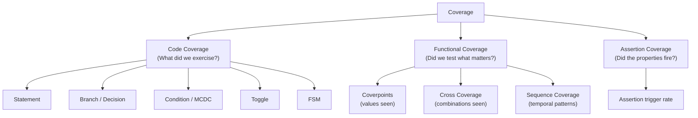
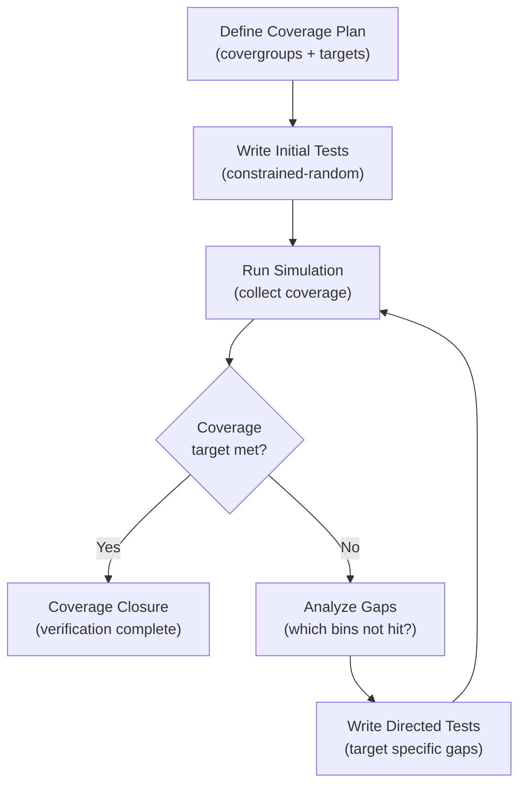

[← Verification Home](README.md) · [← Project Home](../README.md)

# Coverage Methodology — Functional, Code, and Coverage-Driven Verification

Coverage is the quantitative measure of how thoroughly a design has been verified. Without coverage, you don't know whether your tests exercise the corner cases that cause silicon failures — you only know that the tests you wrote pass. Coverage methodology answers the fundamental question: *"Are we done verifying?"* This article covers the three pillars of coverage (code, functional, and assertion), how to set coverage targets, how to close coverage, and how the coverage-driven verification methodology integrates with simulation and formal tools.

> [!NOTE]
> This article covers coverage methodology as it applies to FPGA verification. For safety-critical certification requirements (DO-254 structural coverage targets), see [Safety-Critical FPGA Design](../16_advanced_topics/safety_critical_design.md).

---

## The Three Pillars of Coverage



| Pillar | Question | Measured By | Tool |
|---|---|---|---|
| **Code coverage** | Did every line of RTL execute? | Structural analysis of RTL | Simulator (all vendors) |
| **Functional coverage** | Did we test the scenarios that matter? | User-defined coverage models | SystemVerilog `covergroup`, Intel QVIP |
| **Assertion coverage** | Did the properties actually fire? | SVA/assertion evaluation | Simulator + formal tools |

---

## Code Coverage

Code coverage is automatically computed by the simulator. It requires no additional testbench code — only enabling the coverage option during compilation.

### Types

| Type | What It Measures | Target (Typical) | DO-254 Requirement |
|---|---|---|---|
| **Statement** | Every executable line of RTL ran at least once | 100% | DAL C+ |
| **Branch** (Decision) | Every `if`/`case` branch was taken both ways | 100% | DAL B+ |
| **Condition** (MCDC) | Each condition in a compound expression independently affects the outcome | 100% | DAL A |
| **Toggle** | Every signal transitioned 0→1 and 1→0 | 95%+ (IO pins may not toggle) | Complementary |
| **FSM** | Every state was entered, every transition was exercised | 100% | DAL C+ |

### Enabling Code Coverage

**Vivado XSim:**
```tcl
# Compile with coverage enabled
xvlog -d COVERAGE --cov TestBench.v
xelab --cov work.tb -s sim_snap
xsim sim_snap --cov
# After simulation:
xsim sim_snap -R
# Generate report:
report_coverage -file cov_report.txt
```

**ModelSim/Questa:**
```tcl
# Compile with coverage
vlog +cover=bcest TestBench.v  # b=branch, c=condition, e=expression, s=statement
vsim -coverage work.tb
run -all
coverage save cov_data.ucdb
# View in GUI:
coverage view
# Generate text report:
coverage report -file cov_report.txt
```

**Verilator:**
```bash
# Verilator: enable line and toggle coverage
verilator --cc --coverage-line --coverage-toggle design.v tb.cpp
make -C obj_dir -f Vdesign.mk
./obj_dir/Vdesign
# Generate coverage report:
verilator_coverage obj_dir/logs/coverage.dat
```

### Common Code Coverage Gaps

| Gap | Typical Cause | Fix |
|---|---|---|
| Uncovered `else` branch | Error condition never exercised | Add directed test for error path |
| Uncovered FSM state | Illegal/unused state never reached | Add test that forces FSM into that state |
| Untoggled signal | Signal only driven high or only driven low | Check if the signal is truly needed; add test |
| MCDC hole | Two conditions always correlated in tests | Add test that decouples the conditions |

---

## Functional Coverage

Functional coverage is user-defined. It answers: *"Did we test the specific scenarios our design specification requires?"* Unlike code coverage (which is automatic), functional coverage requires the verification engineer to define what matters.

### SystemVerilog Covergroups

```systemverilog
// Covergroup: ALU opcode coverage
covergroup alu_opcode_cg @(posedge clk);
    // Coverpoint: which opcodes are seen
    cp_opcode: coverpoint opcode {
        bins add  = {2'b00};
        bins sub  = {2'b01};
        bins and  = {2'b10};
        bins or   = {2'b11};
        bins illegal = default;  // Catch-all for undefined opcodes
    }

    // Coverpoint: operand sign combinations
    cp_sign_a: coverpoint a[7] {
        bins positive = {0};
        bins negative = {1};
    }
    cp_sign_b: coverpoint b[7] {
        bins positive = {0};
        bins negative = {1};
    }

    // Cross coverage: did we test all opcode + sign combinations?
    cross_op_sign: cross cp_opcode, cp_sign_a, cp_sign_b;
endgroup
```

### Coverage Bins

| Bin Type | Syntax | Meaning |
|---|---|---|
| **Explicit** | `bins add = {2'b00}` | This specific value must be seen |
| **Range** | `bins mid = {[10:20]}` | Any value in this range counts |
| **Transition** | `bins seq = (2'b00 => 2'b01)` | This sequence of values must occur |
| **Default** | `bins others = default` | Catch-all for uncovered values |
| **Wild** | `bins pattern = {4'b10??}` | Don't-care bits (like casez) |

### Cross Coverage

Cross coverage measures combinations of coverpoints. It reveals whether correlated scenarios were tested:

| Sign A | Sign B | Opcode=ADD | Opcode=SUB |
|---|---|---|---|
| + | + | ✓ (tested) | ✗ (not tested) |
| + | − | ✗ | ✓ |
| − | + | ✓ | ✗ |
| − | − | ✗ | ✓ |

Cross coverage reveals that the SUB opcode was never tested with positive operands — a potential corner case.

> [!WARNING]
> **Cross coverage can explode combinatorially.** 5 coverpoints × 4 bins each = 4⁵ = 1,024 cross bins. Limit cross coverage to correlated coverpoints that matter.

---

## Assertion Coverage

Assertions (SVA) verify protocol behavior. Assertion coverage measures whether the assertions actually fired during simulation — an assertion that never triggers is a useless assertion.

### SystemVerilog Assertion Coverage

```systemverilog
// Concurrent assertion with coverage
property fifo_no_overflow;
    @(posedge wr_clk) !(wr_en && fifo_full);
endproperty

// Assert: check the property (error if violated)
assert_fifo_overflow: assert property (fifo_no_overflow)
    else $error("FIFO overflow detected!");

// Cover: did this property ever trigger?
cover_fifo_overflow: cover property (fifo_no_overflow)
    ; // This property was exercised in simulation
```

### Assertion Coverage Report

| Assertion | Fired (Covered) | Never Fired | Action |
|---|---|---|---|
| `fifo_no_overflow` | ✓ | | No action |
| `axi_awvalid_stable` | ✓ | | No action |
| `protocol_no_x_on_data` | | ✗ | Add test with X-state stimulus |
| `reset_cleanup` | | ✗ | Add test that exercises reset during operation |

---

## Coverage-Driven Verification (CDV)

CDV is a methodology where coverage targets drive the creation of new tests. The process:



### Coverage Targets by Project Phase

| Phase | Target | Rationale |
|---|---|---|
| **Block-level verification** | 100% statement, 95% branch, 90% functional | Early phase — tolerate some gaps |
| **Integration verification** | 100% statement, 98% branch, 95% functional | System-level tests fill remaining gaps |
| **Regression gate** | 100% statement, 100% branch, 100% critical functional | Must-pass before tapeout |

### Coverage Closure Workflow

1. **Identify uncovered bins** from coverage report
2. **Classify gaps**:
   - **Must-cover** (safety-critical, DAL A): write directed test immediately
   - **Should-cover** (important functionality): add constrained-random stimulus
   - **Waivable** (unreachable, deprecated): document waiver with justification
3. **Write targeted tests** for must-cover and should-cover gaps
4. **Re-run regression** and verify coverage improvement
5. **Document waivers** for bins that cannot be covered

### Coverage Merging

When running tests in parallel or across multiple testbenches, coverage databases must be merged:

```tcl
# ModelSim/Questa: merge coverage from multiple runs
vcover merge combined.ucdb run1.ucdb run2.ucdb run3.ucdb
coverage report -file final_report.txt combined.ucdb
```

---

## Practical Checklist

- [ ] Enable code coverage during all simulation runs (statement + branch at minimum)
- [ ] Define functional covergroups for all critical interfaces (AXI, custom protocols)
- [ ] Set coverage targets per project phase (block → integration → gate)
- [ ] Run coverage regression nightly and track trends
- [ ] Review coverage gaps weekly; write directed tests for must-cover bins
- [ ] Document all coverage waivers with justification
- [ ] Verify assertion coverage — assertions that never fired are not useful
- [ ] Cross-coverage only for correlated signals (avoid combinatorial explosion)
- [ ] Use coverage merging for parallel test runs
- [ ] Track functional coverage trend over time (should monotonically increase)

---

## References

| Source | Description |
|---|---|
| IEEE 1800-2023 §19 — Coverage | SystemVerilog coverage syntax reference |
| Chris Spear, "SystemVerilog for Verification" Ch. 9–10 | Functional coverage methodology textbook |
| Verification Academy — Coverage | https://verificationacademy.com/ |
| Accellera UVM 1.2 User Guide | UVM coverage collection and reporting |
| [SV Verification](sv_verification.md) | SystemVerilog verification primitives |
| [UVM Overview](uvm_overview.md) | UVM testbench framework with built-in coverage |
| [Safety-Critical Design](../16_advanced_topics/safety_critical_design.md) | DO-254 structural coverage requirements |
| [Formal Verification](formal_verification.md) | Formal cover properties |
