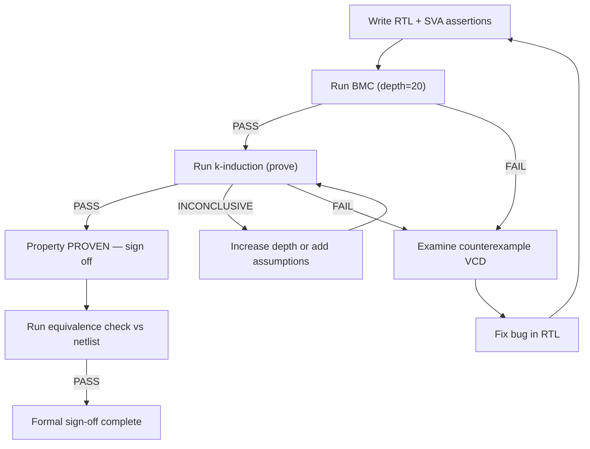

[← 07 Verification Home](README.md) · [← Project Home](../../README.md)

# Formal Verification for FPGA

Formal verification mathematically proves your design is correct for **all** possible inputs — not just the ones you thought to test. Where simulation checks one path through the state space, formal verification checks every path.

This article covers the two pillars of FPGA formal verification: **property checking** (proving assertions hold) and **equivalence checking** (proving two netlists are identical). The primary open-source tool is [SymbiYosys](https://symbiyosys.readthedocs.io/); commercial tools include Cadence JasperGold, Siemens Questa Formal, and Synopsys VC Formal.

---

## What Formal Verification Proves

| Method | What It Does | When Used |
|---|---|---|
| **Assert** | Property must ALWAYS hold | Safety: "FIFO never overflows", "AXI VALID never deasserts before READY" |
| **Assume** | Constrain input space | "Assume `inc` stays high for ≤4 cycles" — prunes unreachable states |
| **Cover** | Does this state ever occur? | Coverage: "Does my FSM reach ERROR state?", "Can full flag assert?" |
| **BMC** (Bounded Model Check) | Property holds for first N cycles | Quick check; finds shallow bugs fast; doesn't prove forever |
| **k-induction** | If property held for k consecutive cycles, it holds on cycle k+1 | Proves properties unbounded; needs sufficient depth |
| **Equivalence checking** | Two circuits produce identical outputs for all inputs | Post-synthesis: does netlist match RTL? Post-PR: does routed design match? |

### Formal vs Simulation — The Core Difference

```
Simulation:  "I tested 10,000 input vectors and didn't find a bug."
Formal:      "I proved no bug exists for ANY of the 2^N possible input sequences."
```

Formal doesn't need a testbench. It needs **properties** (assertions about what the design should do) and **assumptions** (constraints on what inputs are legal).

---

## SVA Property Quick Reference

SystemVerilog Assertions (SVA) are the language of formal verification:

| Construct | Meaning | Example |
|---|---|---|
| `assert property` | Must always hold (safety) | `assert property (@(posedge clk) !full \|\| !wr_en);` |
| `assume property` | Constrain inputs | `assume property (@(posedge clk) inc \|\| dec \|\| hold);` |
| `cover property` | Must be reachable | `cover property (@(posedge clk) state == ERROR);` |
| `\|->` | Implication (if LHS then RHS) | `req \|-> ##[1:4] ack;` |
| `\|=>` | Next-cycle implication | `rst \|=> cnt == 0;` |
| `##N` | N cycles later | `valid \|-> ##2 ready;` |
| `##[1:N]` | 1 to N cycles later | `start \|-> ##[1:8] done;` |
| `$past(sig)` | Value of signal last cycle | `$past(rst) \|-> cnt == 0;` |
| `$rose(sig)` | Signal went 0→1 | `$rose(start) \|-> busy;` |
| `$fell(sig)` | Signal went 1→0 | `$fell(busy) \|-> done;` |
| `disable iff (cond)` | Don't check during condition | `disable iff (rst) assert ...;` |

---

## SymbiYosys — Open-Source Formal Verification

[SymbiYosys (sby)](https://symbiyosys.readthedocs.io/) is a front-end for Yosys-based formal verification. It supports BMC, k-induction, cover, and equivalence checking.

### Installation

```bash
# Debian/Ubuntu — from apt (may be older version)
sudo apt install yosys sby

# Or build from source for latest:
git clone https://github.com/YosysHQ/sby.git
cd sby && sudo make install

# Install SAT solvers (at least one required)
sudo apt install yices2        # Yices 2 — recommended for BMC
sudo apt install z3            # Z3 — good for k-induction
# boolector, bitwuzla also supported
```

### SBY Configuration File

Every formal verification run requires an `.sby` file:

```ini
# fifo_formal.sby — verify a FIFO never overflows
[options]
mode bmc          # bmc, prove, cover, or live
depth 30          # Check first 30 cycles

[engines]
smtbmc yices      # SAT engine + solver

[script]
read_verilog -formal fifo.sv
prep -top fifo

[files]
fifo.sv
```

| Mode | What It Does | When to Use |
|---|---|---|
| `bmc` | Bounded model check — property holds for N cycles | Quick sanity check; find bugs |
| `prove` | k-induction — proves property for ALL cycles | Final verification sign-off |
| `cover` | Checks if cover property is reachable | Verify error states can occur |
| `live` | Liveness checking — does something eventually happen? | "Request eventually gets acknowledged" |

### Running

```bash
sby -f fifo_formal.sby

# Output:
# SBY [fifo_formal] engine_0.status: PASS   ← All assertions hold for 30 cycles
# or
# SBY [fifo_formal] engine_0.status: FAIL   ← Counterexample found
# SBY [fifo_formal] engine_0.trace: VCD written to engine_0/trace.vcd
```

---

## Example 1: Counter Overflow Proof

```systemverilog
module counter (
    input  wire        clk,
    input  wire        rst,
    input  wire        inc,
    output reg  [7:0]  cnt
);
    always @(posedge clk) begin
        if (rst)       cnt <= 0;
        else if (inc)  cnt <= cnt + 1;
    end

    `ifdef FORMAL
        // Property 1: counter never exceeds 255 (wraps naturally)
        // An 8-bit counter CAN'T exceed 255 — this assertion always holds
        assert property (@(posedge clk) cnt < 256);

        // Property 2: after reset, counter is 0
        assert property (@(posedge clk) disable iff (rst)
            $past(rst) |-> cnt == 0);

        // Property 3: incrementing works (when not at max)
        assert property (@(posedge clk) disable iff (rst)
            (!$past(rst) && $past(inc) && $past(cnt) < 255)
            |-> cnt == $past(cnt) + 1);

        // Cover: can the counter reach 200?
        cover property (@(posedge clk) cnt == 200);
    `endif
endmodule
```

```ini
# counter.sby
[options]
mode prove
depth 20

[engines]
smtbmc yices

[script]
read_verilog -formal counter.v
prep -top counter

[files]
counter.v
```

```bash
sby -f counter.sby
# SBY [counter] engine_0.status: PASS  ← Proven for ALL cycles (k-induction)
```

---

## Example 2: FIFO Overflow/Underflow Proof

This is the classic FPGA formal verification problem — proving a FIFO never overflows (write when full) or underflows (read when empty):

```systemverilog
module fifo #(
    parameter WIDTH = 8,
    parameter DEPTH = 16
)(
    input  wire             clk,
    input  wire             rst,
    input  wire             wr_en,
    input  wire [WIDTH-1:0] wr_data,
    input  wire             rd_en,
    output wire [WIDTH-1:0] rd_data,
    output wire             full,
    output wire             empty
);
    reg [WIDTH-1:0] mem [0:DEPTH-1];
    reg [$clog2(DEPTH):0] wr_ptr, rd_ptr;

    assign full  = (wr_ptr[$clog2(DEPTH)] != rd_ptr[$clog2(DEPTH)]) &&
                   (wr_ptr[$clog2(DEPTH)-1:0] == rd_ptr[$clog2(DEPTH)-1:0]);
    assign empty = (wr_ptr == rd_ptr);
    assign rd_data = mem[rd_ptr[$clog2(DEPTH)-1:0]];

    always @(posedge clk) begin
        if (rst) begin
            wr_ptr <= 0;
            rd_ptr <= 0;
        end else begin
            if (wr_en && !full) begin
                mem[wr_ptr[$clog2(DEPTH)-1:0]] <= wr_data;
                wr_ptr <= wr_ptr + 1;
            end
            if (rd_en && !empty) begin
                rd_ptr <= rd_ptr + 1;
            end
        end
    end

    `ifdef FORMAL
        // Property 1: Never write when full
        assert property (@(posedge clk) disable iff (rst)
            !(full && wr_en));

        // Property 2: Never read when empty
        assert property (@(posedge clk) disable iff (rst)
            !(empty && rd_en));

        // Property 3: After write then read, data matches
        // (Simplified: check that rd_data is valid when not empty)
        assert property (@(posedge clk) disable iff (rst)
            !empty |-> rd_data === mem[rd_ptr[$clog2(DEPTH)-1:0]]);

        // Property 4: Full and empty are mutually exclusive
        assert property (@(posedge clk) disable iff (rst)
            !(full && empty));

        // Cover: Can the FIFO become full?
        cover property (@(posedge clk) full);

        // Cover: Can we read after writing?
        cover property (@(posedge clk) rd_en && !empty);
    `endif
endmodule
```

---

## Example 3: AXI-Lite Protocol Proof

Formal verification excels at protocol compliance — proving that an AXI slave never violates the handshake rules:

```systemverilog
module axi_lite_slave_formal (
    input  wire        clk,
    input  wire        rst_n,
    // Write address
    input  wire [31:0] awaddr,
    input  wire        awvalid,
    output wire        awready,
    // Write data
    input  wire [31:0] wdata,
    input  wire        wvalid,
    output wire        wready,
    // Write response
    output wire [1:0]  bresp,
    output wire        bvalid,
    input  wire        bready
);
    // ... DUT implementation ...

    `ifdef FORMAL
        // Assumption: master follows AXI protocol
        // Once VALID asserted, it stays high until READY
        assume property (@(posedge clk) disable iff (!rst_n)
            awvalid && !awready |=> awvalid);  // VALID stays until handshake
        assume property (@(posedge clk) disable iff (!rst_n)
            wvalid && !wready |=> wvalid);

        // Assert: response only after both AW and W handshakes
        assert property (@(posedge clk) disable iff (!rst_n)
            bvalid |-> $past(awvalid && awready) &&
                        $past(wvalid && wready));

        // Assert: BVALID stays asserted until BREADY
        assert property (@(posedge clk) disable iff (!rst_n)
            bvalid && !bready |=> bvalid);

        // Assert: BRESP is always OKAY (0) for this simple slave
        assert property (@(posedge clk) disable iff (!rst_n)
            bvalid |-> bresp == 2'b00);
    `endif
endmodule
```

> **Key insight:** The `assume` properties are as important as `assert`. They constrain the formal engine to only explore states where the master behaves correctly. Without assumptions, the engine would find "bugs" caused by impossible inputs (e.g., VALID toggling every cycle).

---

## Example 4: Equivalence Checking

Equivalence checking proves two designs produce identical outputs for all inputs. The most common use: verify synthesis didn't change the logic.

```ini
# equiv_check.sby — prove post-synthesis netlist matches RTL
[options]
mode prove

[engines]
smtbmc yices

[script]
# Read both designs
read_verilog -formal counter.v
read_verilog -formal counter_synth.v

# Create equivalence check
prep -top counter
equiv_make counter counter_synth equiv_check
equiv_simple
equiv_status -assert

[files]
counter.v
counter_synth.v
```

```bash
sby -f equiv_check.sby
# If PASS: post-synthesis netlist is mathematically identical to RTL
# If FAIL: synthesis introduced a functional difference — critical bug!
```

When to use equivalence checking:
- After synthesis: does the netlist match RTL?
- After a bug fix: does the fix change only the intended behavior?
- After optimization: does the optimized version produce identical results?
- After vendor IP integration: does the wrapped IP behave like the model?

---

## k-Induction — Proving Properties Forever

BMC only checks a finite number of cycles. k-induction proves a property holds for **all** cycles:

**Principle:** If a property P held for k consecutive cycles, and assuming P held for k cycles implies P holds on cycle k+1, then P holds forever.

```
Base case:  P holds for cycles 0 through k  (proved by BMC)
Step case:  Assuming P holds for cycles N through N+k-1,
            prove P holds for cycle N+k
Conclusion: P holds for ALL cycles
```

**The catch:** k must be large enough. If the design has a state that takes 10 cycles to reach, k must be at least 10. Too small k → "INCONCLUSIVE" result.

```ini
# Use prove mode for k-induction
[options]
mode prove
depth 20        # k = 20 — must exceed longest path to any state

[engines]
smtbmc yices    # or smtbmc z3
```

**Typical depths:**
- Simple pipeline: k = pipeline_depth + 2
- FIFO: k = DEPTH + 2
- State machine: k = number of states + 2
- If INCONCLUSIVE, increase depth and retry

---

## Commercial Formal Verification Tools

| Tool | Vendor | Key Capability | Cost |
|---|---|---|---|
| **JasperGold** | Cadence | Smart proof technology; auto-abstraction; coverage-driven formal; C/C++ property support | Enterprise ($50k+/yr) |
| **Questa Formal** | Siemens (Mentor) | Property synthesis; clock-domain crossing formal proof; assertion-based verification | Enterprise |
| **VC Formal** | Synopsys | Formal coverage; SOC integration checks; connectivity verification | Enterprise |
| **OneSpin 360** | Siemens (previously) | FPGA-specific checks; X-propagation analysis; safety verification (ISO 26262) | Enterprise |

### When to Use Commercial Tools

| Scenario | SymbiYosys | JasperGold / Questa Formal |
|---|---|---|
| Module-level property checking | ✅ Sufficient | — |
| AXI protocol compliance | ✅ Works with careful assumes | ✅ Has AXI VIP built-in |
| Large SoC (>100k registers) | ❌ State space explosion | ✅ Auto-abstraction reduces state space |
| DO-254 / ISO 26262 certification | ❌ No tool qualification | ✅ Tool-qualified for safety standards |
| Equivalence checking (RTL vs netlist) | ✅ Basic `equiv_make` | ✅ Industrial-grade, handles black boxes |
| C/C++ algorithm verification | ❌ Not supported | ✅ JasperGold supports C models |

---

## Tool Comparison: SymbiYosys vs JasperGold vs Questa Formal

| Feature | SymbiYosys | JasperGold | Questa Formal |
|---|---|---|---|
| **Cost** | Free (open-source) | $50k+/yr | $30k+/yr |
| **Solvers** | Yices, Z3, Boolector, Bitwuzla | Proprietary (IC3/PDR, BMC) | Proprietary |
| **BMC** | ✅ | ✅ | ✅ |
| **k-induction** | ✅ | ✅ | ✅ |
| **Cover** | ✅ | ✅ | ✅ |
| **Liveness** | ✅ (limited) | ✅ | ✅ |
| **Auto-abstraction** | ❌ | ✅ Critical for large designs | ✅ |
| **X-propagation analysis** | ❌ | ✅ | ✅ |
| **AXI protocol VIP** | ❌ (write your own) | ✅ Built-in | ✅ Built-in |
| **Equivalence checking** | ✅ Basic | ✅ Full | ✅ Full |
| **VHDL support** | Via GHDL plugin | ✅ Native | ✅ Native |
| **Safety certification** | ❌ | ✅ DO-254, ISO 26262 | ✅ DO-254, IEC 61508 |
| **GUI** | ❌ CLI + VCD | ✅ Full debug GUI | ✅ Full debug GUI |
| **CI/CD integration** | ✅ CLI-native | ❌ Requires license server | ❌ Requires license server |

---

## Practical Workflow



### Step-by-Step Process

1. **Add `ifdef FORMAL` guards** to your RTL — assertions only compiled for formal, not synthesis
2. **Start with BMC** (`mode bmc, depth 20`) — find shallow bugs in seconds
3. **Add assumptions** — constrain inputs so the engine doesn't waste time on impossible states
4. **Switch to prove** (`mode prove`) — attempt full proof
5. **If INCONCLUSIVE** — increase depth, add lemmas (helper assertions), or add more assumptions
6. **Add cover properties** — verify that error states ARE reachable (otherwise the assertions are vacuously true)
7. **Run equivalence check** after synthesis — prove netlist matches RTL

---

## FPGA-Specific Limitations

| Limitation | Explanation | Workaround |
|---|---|---|
| **Vendor IP black boxes** | MIG, PCIe hard block, transceivers — no RTL to verify | Verify your wrapper/glue logic; assume IP correct |
| **DSP blocks** | Formal tools may not model DSP48E2 accurately | Verify the DSP-free version; add assume for DSP constraints |
| **Transceivers** | Analog behavior (CDR, EQ) can't be formalized | Verify the digital wrapper; simulation for analog |
| **State space explosion** | Designs with >100k registers overwhelm SAT solvers | Verify modules individually; use assume-guarantee |
| **Clock domain crossing** | Formal tools model single clock domain | Use CDC-specific tools (Meridian CDC, SpyGlass CDC) |
| **Memory arrays** | Large memories blow up state space | Abstract: verify with small DEPTH, assume scaling holds |

---

## Common Pitfalls

| Pitfall | Symptom | Fix |
|---|---|---|
| **Vacuous pass** | Property always true because assumption never met | Add `cover` for assumptions — if cover fails, assumption is unreachable |
| **Missing `disable iff (rst)`** | Assert fires during reset → false failures | Always disable assertions during active reset |
| **Assumptions too tight** | PASS but design is buggy under real inputs | Review assumptions: are they real protocol constraints or over-constraining? |
| **Depth too small** | INCONCLUSIVE on `prove` mode | Increase depth; typical: 2× the longest pipeline or FIFO depth |
| **No cover properties** | All asserts pass but error states unreachable | Always add `cover` for every error/edge case |
| **Formal-unfriendly code** | `case` with X-don't-care, `casex`, 4-state logic | Use `case` with explicit default; avoid `casex` in formal |
| **SMT solver timeout** | Engine runs for hours with no result | Try different solver (Z3 vs Yices); reduce design size; add abstractions |

---

## References

| Document | Source | What It Covers |
|---|---|---|
| [SBY Documentation](https://symbiyosys.readthedocs.io/) | YosysHQ | SymbiYosys configuration, engines, solver options |
| [SBY Quickstart](https://symbiyosys.readthedocs.io/en/latest/quickstart.html) | YosysHQ | Step-by-step first formal verification |
| [Yosys Model Checking](https://yosyshq.readthedocs.io/projects/yosys/en/latest/using_yosys/more_scripting/model_checking.html) | YosysHQ | Yosys formal verification internals |
| [Jasper Formal Verification Platform](https://www.cadence.com/en_US/home/tools/system-design-and-verification/formal-and-static-verification.html) | Cadence | Commercial formal verification |
| [Simulation Overview](simulation_overview.md) | This KB | Simulator landscape and comparison |
| [UVM Overview](uvm_overview.md) | This KB | UVM testbench framework |
| [Cocotb](cocotb.md) | This KB | Python-based verification |
| [SystemVerilog Verification](sv_verification.md) | This KB | SVA syntax, coverage, randomization |
