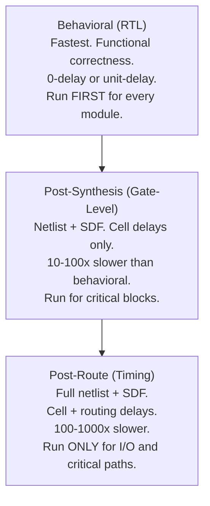
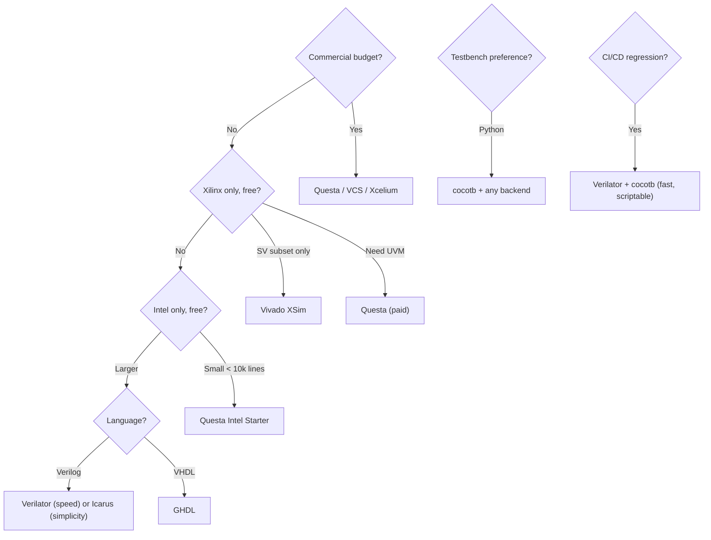

[← 07 Verification Home](README.md) · [← Project Home](../../README.md)

# Simulation Overview — FPGA Verification Landscape

Simulation is the first line of defense against FPGA bugs. Before a single bit is synthesized, simulation validates that the RTL behaves as intended. The FPGA ecosystem offers a spectrum of simulators — from vendor-locked free tools to industrial-grade commercial products to fully open-source options.

This article covers each simulator in depth, with pros/cons analysis, concrete usage examples, and guidance on what you can verify and what you'll see in waveforms.

---

## The Simulator Landscape

| Simulator | Type | Language Support | License | Best For |
|---|---|---|---|---|
| **QuestaSim/ModelSim** | Commercial (Siemens) | VHDL, Verilog, SV, UVM, SVA | Paid (free Intel Starter, Microsemi DE) | Mixed-language, UVM, large designs |
| **Synopsys VCS** | Commercial | VHDL, Verilog, SV, UVM, SVA | Paid | ASIC-grade verification, highest performance |
| **Cadence Xcelium** | Commercial | VHDL, Verilog, SV, UVM, SVA | Paid | ASIC-grade, parallel simulation |
| **Vivado XSim (xsim)** | Vendor-free (Xilinx) | VHDL, Verilog, SV (subset) | Free (with Vivado) | Xilinx designs, IP simulation |
| **Quartus Sim (Questa Intel Starter)** | Vendor-free (Intel) | VHDL, Verilog, SV (subset) | Free (with Quartus) | Intel designs, limited to 10k lines |
| **Active-HDL** | Commercial (Aldec) | VHDL, Verilog, SV (subset) | Paid / Student | VHDL-focused, Windows native |
| **Riviera-PRO** | Commercial (Aldec) | VHDL, Verilog, SV, UVM | Paid | Advanced VHDL/Verilog/SV |
| **GHDL** | Open-source | VHDL (full 2008, partial 2019) | GPL / free | Open-source VHDL, CI/CD |
| **Icarus Verilog (iverilog)** | Open-source | Verilog (subset of 2005), limited SV | GPL / free | Quick Verilog simulation, CI/CD |
| **Verilator** | Open-source | Verilog + SV (synthesizable subset) → C++/SystemC | LGPL / free | Ultra-fast sim, CI/CD, large designs |
| **cocotb** | Open-source (testbench framework) | Python-driven, sim-agnostic | BSD / free | Python testbenches, co-simulation |
| **nvc** | Open-source | VHDL (focus on IEEE 1076-2019) | GPL / free | Modern VHDL, fast compile |

---

## What Simulation Verifies

Simulation can catch different categories of bugs depending on the level and effort invested:

| Bug Category | Example | Caught By |
|---|---|---|
| **Functional errors** | Counter wraps at 9 instead of 10 | Directed testbench + assertions |
| **Protocol violations** | AXI VALID deasserted before READY | SVA assertions in simulation |
| **Race conditions** | Blocking assignment in clocked logic | Behavioral simulation (may show X-prop) |
| **Reset bugs** | State machine starts in wrong state | Power-on reset test |
| **Overflow/underflow** | FIFO full, write still accepted | Constrained-random + coverage |
| **Clock domain crossing** | Metastable data sampled in wrong domain | CDC-aware simulation (or formal) |
| **Pipeline hazards** | Read-after-write returns stale data | Scoreboard comparison |
| **Timing violations** | Setup/hold violation on critical path | Post-route SDF simulation (not behavioral!) |
| **Synthesis mismatch** | `casex` treats X as don't-care, sim doesn't | Gate-level simulation |

> **Key insight:** Behavioral simulation **cannot** find timing violations. It has no concept of real delays. Use STA (static timing analysis) for timing, and post-route SDF simulation only for I/O interface verification.

---

## What You See in Waveforms

Waveform viewers are your primary debugging tool. Here's what to look for:

| Signal State | Meaning | What It Tells You |
|---|---|---|
| `0` / `1` | Defined logic level | Normal operation |
| `X` (red) | Unknown / conflicting drivers | Uninitialized register, multiple drivers, or missing reset |
| `Z` (blue) | High-impedance | Undriven signal, tri-state bus, or missing pull-up |
| `Staircase pattern` | Signal changes every N cycles | Counter, state machine, or pipeline register — expected |
| `Glitch` (spike <1 cycle) | Combinational hazard | Not a bug in synchronous design (captured at clock edge), but indicates long combinational path |
| `X → 0/1 after reset` | Normal initialization | Reset is working correctly |
| `X persists after reset` | Not reset, or no driver | Bug: signal not in sensitivity list, or no reset path |

### Reading an AXI Transaction in a Waveform

```
Clock  ──┐ ┌─┐ ┌─┐ ┌─┐ ┌─┐ ┌─┐ ┌─┐ ┌─┐ ┌─┐ ┌─┐
         └─┘ └─┘ └─┘ └─┘ └─┘ └─┘ └─┘ └─┘ └─┘ └─

AWVALID ────────────────────┐                 ┌──────
                            └─────────────────┘
AWREADY ──────────────────────┐               ┌──────
                              └───────────────┘
AWADDR  ──────────────< 0x04 >───────────────────────

WDATA   ────────────────────< 0xDEADBEEF >───────────

BVALID  ─────────────────────────────┐         ┌─────
                                     └─────────┘
BRESP   ─────────────────────────────< OKAY >──────────
         │ AW Phase │  W Phase  │ B Phase │
         │          │           │         │
         t0         t1          t2        t3
```

- **AW Phase** (t0–t1): Address write phase — VALID/READY handshake
- **W Phase** (t1–t2): Data write phase — can overlap with AW phase
- **B Phase** (t2–t3): Response phase — OKAY, EXOKAY, SLVERR, DECERR

A protocol violation would appear as: VALID deasserted before READY, or BRESP = SLVERR when you expected OKAY.

---

## Simulator Deep Dives

### Vivado XSim — The Xilinx Default

```
RTL (.v/.vhd) ──→ xvlog/xvhdl (analysis) ──→ xelab (elaboration) ──→ xsim (simulation)
                                   │                           │
                                   └── Vendor libraries        └── Waveform (.wdb)
                                       (unisims, secureip)
```

| ✅ Pros | ❌ Cons |
|---|---|
| Free, unlimited design size | Slowest commercial simulator (interpreted engine) |
| Integrated with Vivado (1-click launch) | SV subset only — no UVM 1.2 full support |
| Auto-compiles Xilinx simulation libraries | `.wdb` format locked to Vivado (no VCD by default) |
| SDF back-annotation for timing sim | Elaboration (`xelab`) can take minutes on large designs |
| Mixed VHDL/Verilog | No coverage collection in free version |

**Example: Simulating a FIFO with XSim**

```bash
# Step 1: Compile RTL + testbench
xvlog -sv fifo.sv tb_fifo.sv

# Step 2: Elaborate (creates simulation snapshot)
xelab tb_fifo -snapshot fifo_snap -debug typical

# Step 3: Run simulation
xsim fifo_snap -R

# Step 4: Interactive waveform debug
xsim fifo_snap -gui
# In GUI: add wave /fifo_dut/* → run 1us → inspect waveforms
```

**What you'll verify:** FIFO empty/full flags, read/write pointer behavior, overflow/underflow protection, reset behavior. Watch for X-propagation on `dout` before first write.

**Example: Post-route timing simulation**

```bash
# After Vivado implementation generates .sdf
xvlog -sv post_route.v  # Gate-level netlist
xvhdl unisims.vhd        # Xilinx UNISIM library
xelab tb -snapshot timing_snap -sdfmax /dut=impl.sdf
xsim timing_snap -R
# Now signals include real cell + routing delays
# Verify setup/hold on I/O: do signals meet spec at the pins?
```

---

### Questa/ModelSim — The Industry Workhorse

```
RTL ──→ vlog/vcom (compile) ──→ vsim (simulate)
                       │               │
                       └── Intel libs  └── Wave window (.wlf)
                           (altera_mf, lpm, cyclonev)
```

| ✅ Pros | ❌ Cons |
|---|---|
| Full UVM 1.2 / IEEE 1800.2 support | Expensive (full license: $5k–$50k+/year) |
| Mixed VHDL/Verilog/SV in same design | Intel Starter Edition limited to 10k lines |
| Coverage collection (functional + code) | WLF format proprietary (need VCD export for other viewers) |
| Built-in assertion debugging | Windows-centric (Linux supported but secondary) |
| Fast compilation, decent simulation speed | Not as fast as VCS for huge ASIC regressions |
| FLI (Foreign Language Interface) for VHDL | — |

**Example: Running a UVM test with Questa**

```bash
# Compile UVM library + design + testbench
vlib work
vlog -sv +incdir+$UVM_HOME/src \
    $UVM_HOME/src/uvm_pkg.sv \
    axi_if.sv axi_slave.sv axi_txn.sv \
    axi_driver.sv axi_monitor.sv axi_agent.sv \
    axi_scoreboard.sv axi_env.sv axi_test.sv tb_top.sv

# Run UVM test
vsim -c tb_top -do "run -all; quit" +UVM_TESTNAME=axi_write_read_test

# Interactive debug with waveform
vsim -gui tb_top
# > add wave /tb_top/dut/*
# > run 10us
# > Inspect AXI handshake timing, check scoreboard output
```

**What you'll verify with UVM on Questa:** Protocol compliance (every AXI handshake follows spec), functional coverage (did we test all burst sizes?), constrained-random corner cases (backpressure, error injection), scoreboard-matched outputs.

**Example: Coverage-driven verification**

```bash
# Run with coverage collection
vsim -c tb_top -coverage -do "run -all; coverage save cov.ucdb; quit"

# View coverage report
vsim -gui -viewcov cov.ucdb
# Shows: % of toggle coverage, line coverage, FSM state coverage
# Goal: >95% for tapeout-grade verification
```

---

### Verilator — The Speed King

```bash
# Verilator: compile Verilog → C++, then simulate as native code
verilator --cc --build -j 0 top.v --exe tb.cpp
./obj_dir/Vtop        # Runs 100-1000x faster than interpreted simulators
```

| ✅ Pros | ❌ Cons |
|---|---|
| **Fastest simulator** — compiles to native C++ | No VHDL support at all |
| Free, open-source (LGPL) | Only synthesizable SV subset — no classes, UVM, dynamic arrays |
| Built-in linting catches synthesis issues early | C++ testbench required (or cocotb via VPI wrapper) |
| Multi-threaded simulation (`--threads 4`) | 2-state only (no X/Z — initialized to 0) |
| Ideal for CI/CD: regression in seconds | No SDF timing simulation |
| Trace output: VCD, FST (fast compressed) | Learning curve for C++ testbench API |

**Example: Verilator C++ testbench for a counter**

```cpp
// tb_counter.cpp
#include "Vcounter.h"       // Auto-generated by Verilator
#include "verilated.h"
#include <cstdio>

int main(int argc, char** argv) {
    Verilated::commandArgs(argc, argv);

    Vcounter* dut = new Vcounter;

    // Reset
    dut->rst = 1;
    dut->clk = 0;
    dut->eval();
    dut->clk = 1;
    dut->eval();
    dut->rst = 0;

    // Run 100 cycles, check count
    for (int i = 0; i < 100; i++) {
        dut->clk = 0;
        dut->eval();
        dut->clk = 1;
        dut->eval();

        if (dut->count != (uint32_t)(i + 1)) {
            printf("FAIL at cycle %d: expected %d, got %u\n",
                   i, i + 1, dut->count);
            delete dut;
            return 1;
        }
    }

    printf("PASS: 100 cycles verified\n");
    delete dut;
    return 0;
}
```

```bash
# Build and run
verilator --cc --build --exe counter.v tb_counter.cpp
./obj_dir/Vcounter
# Output: PASS: 100 cycles verified
```

**Example: Verilator linting (no testbench needed)**

```bash
verilator --lint-only my_design.v
# Catches: unused signals, width mismatches, missing resets,
#          combinational loops, synthesis-incompatible constructs
# All without writing a single line of testbench
```

**What you'll verify with Verilator:** Functional correctness of synthesizable RTL at high speed. Best for: regression suites, CI/CD pipelines, long-running tests (packet processing, memory controllers). Not for: UVM, coverage, X-propagation, timing.

**Example: Verilator with cocotb (Python testbench)**

```python
# test_counter.py
import cocotb
from cocotb.clock import Clock
from cocotb.triggers import RisingEdge, Timer

@cocotb.test()
async def test_counter_wrap(dut):
    cocotb.start_soon(Clock(dut.clk, 10, units='ns').start())
    dut.rst.value = 1
    await RisingEdge(dut.clk)
    await RisingEdge(dut.clk)
    dut.rst.value = 0

    # Count up to max and check wrap-around
    for i in range(256):
        await RisingEdge(dut.clk)
    assert dut.count.value == 0, f"Expected wrap to 0, got {dut.count.value}"
```

```makefile
# Makefile
SIM = verilator
TOPLEVEL_LANG = verilog
VERILOG_SOURCES = counter.v
MODULE = test_counter
include $(shell cocotb-config --makefiles)/Makefile.sim
```

```bash
make SIM=verilator
# Runs cocotb test using Verilator backend — fast iteration
```

---

### Icarus Verilog — Quick & Simple

```bash
iverilog -o sim.vvp top.v tb.v
vvp sim.vvp            # Run simulation
```

| ✅ Pros | ❌ Cons |
|---|---|
| Simplest setup — two commands | Interpreted engine — slow on large designs |
| Full Verilog-2005 support | Very limited SystemVerilog (no UVM, no classes, no covergroups) |
| VCD output works with any viewer | No VHDL support |
| Great for small modules, quick sanity checks | No code coverage |
| Ubiquitous in open-source FPGA projects | No SDF timing back-annotation |

**Example: Self-checking FIFO testbench with Icarus**

```verilog
// tb_fifo.v
`timescale 1ns/1ps

module tb_fifo;
    reg clk, rst_n, wr_en, rd_en;
    reg [7:0] wr_data;
    wire [7:0] rd_data;
    wire full, empty;

    fifo #(8, 16) dut (.*);

    // Clock generation
    initial clk = 0;
    always #5 clk = ~clk;

    // Test sequence
    integer errors = 0;

    initial begin
        $dumpfile("fifo.vcd");
        $dumpvars(0, tb_fifo);

        // Reset
        rst_n = 0; wr_en = 0; rd_en = 0;
        #20 rst_n = 1;

        // Write 16 values
        for (int i = 0; i < 16; i++) begin
            @(posedge clk);
            wr_en = 1; wr_data = i;
        end
        @(posedge clk);
        wr_en = 0;

        // Check full flag
        #1;
        if (!full) begin
            $display("FAIL: FIFO should be full");
            errors = errors + 1;
        end

        // Read all values back
        for (int i = 0; i < 16; i++) begin
            @(posedge clk);
            rd_en = 1;
            #1;
            if (rd_data !== i) begin
                $display("FAIL: Read %0d, expected %0d", rd_data, i);
                errors = errors + 1;
            end
        end
        @(posedge clk);
        rd_en = 0;

        // Check empty flag
        #1;
        if (!empty) begin
            $display("FAIL: FIFO should be empty");
            errors = errors + 1;
        end

        if (errors == 0)
            $display("PASS: All checks passed");
        else
            $display("FAIL: %0d errors", errors);

        $finish;
    end
endmodule
```

```bash
# Compile and run
iverilog -o fifo_sim tb_fifo.v fifo.v
vvp fifo_sim
# Output: PASS: All checks passed

# View waveform
gtkwave fifo.vcd &
# Navigate: click signals → drag to Signal window → zoom to fit
# Look for: wr_data advancing 0→15, rd_data matching, full/empty transitions
```

**What you'll verify:** FIFO read/write ordering, full/empty flag correctness, reset behavior, basic data integrity. Best for small modules where quick iteration matters more than performance.

---

### GHDL — The VHDL Open-Source Champion

```bash
ghdl -a --std=08 top.vhd      # Analyze
ghdl -e --std=08 tb           # Elaborate
ghdl -r tb --vcd=wave.vcd     # Run
```

| ✅ Pros | ❌ Cons |
|---|---|
| Most complete open-source VHDL implementation | Verilog support only via synthesis → Verilog netlist |
| Full VHDL-2008, partial 2019 | No GUI — command-line only |
| Synthesis to Verilog/netlist (`--synth`) for Yosys | No code coverage built-in |
| VCD/FST/GHW waveform output | Smaller community than Verilator |
| cocotb compatible via VPI | Slower than Verilator on equivalent designs |

**Example: VHDL testbench with GHDL**

```vhdl
-- tb_counter.vhd
library ieee;
use ieee.std_logic_1164.all;
use ieee.numeric_std.all;

entity tb_counter is end entity;

architecture sim of tb_counter is
    signal clk   : std_logic := '0';
    signal rst   : std_logic := '1';
    signal count : unsigned(7 downto 0);
begin
    -- DUT
    dut: entity work.counter
        port map (clk => clk, rst => rst, count => count);

    -- Clock: 100 MHz
    clk <= not clk after 5 ns;

    -- Stimulus
    process
    begin
        wait for 20 ns;
        rst <= '0';

        for i in 1 to 200 loop
            wait until rising_edge(clk);
        end loop;

        -- Check count wrapped correctly
        assert count = to_unsigned(200 mod 256, 8)
            report "Counter mismatch"
            severity error;

        assert false report "Simulation complete" severity failure;
    end process;
end architecture;
```

```bash
# Analyze, elaborate, run
ghdl -a --std=08 counter.vhd tb_counter.vhd
ghdl -e --std=08 tb_counter
ghdl -r tb_counter --vcd=counter.vcd --stop-time=10us

# View
gtkwave counter.vcd &
# Examine: count signal incrementing, wrap-around behavior at 255→0
```

**What you'll verify:** VHDL-specific constructs (records, protected types, PSL assertions), correct entity/architecture behavior, synthesis-to-simulation parity when using `--synth` output.

---

### Commercial Big Three: VCS, Xcelium, Riviera-PRO

These simulators are for teams with budgets and ASIC-grade verification needs:

| Simulator | Key Differentiator | When to Use |
|---|---|---|
| **Synopsys VCS** | Highest simulation throughput; best UVM performance | Large ASIC/FPGA regressions (>1M cycles), UVM-heavy projects |
| **Cadence Xcelium** | Multi-core parallel simulation; best X-propagation detection | Designs with many X-sources, team uses Cadence flow |
| **Aldec Riviera-PRO** | Best mixed VHDL/Verilog/SV; Windows-native | VHDL-heavy teams, Aldec ecosystem, Windows workstations |

| ✅ Pros (all three) | ❌ Cons (all three) |
|---|---|
| Full UVM, coverage, SVA, mixed-language | Expensive ($10k–$100k+/year per license) |
| Fast compilation + simulation | Vendor lock-in for waveform formats |
| Professional support and training | Overkill for solo FPGA developers |
| Advanced debug (assertion tracing, coverage holes) | Complex licensing (FlexLM) |

---

## cocotb — Python Testbenches

cocotb (COroutine-based COsimulation TestBench) lets you write testbenches in Python, driving any simulator:

```python
# test_my_dut.py
import cocotb
from cocotb.clock import Clock
from cocotb.triggers import RisingEdge, FallingEdge, Timer

@cocotb.test()
async def test_fifo(dut):
    # Start clock
    cocotb.start_soon(Clock(dut.clk, 10, units='ns').start())

    # Reset
    dut.rst_n.value = 0
    await RisingEdge(dut.clk)
    await RisingEdge(dut.clk)
    dut.rst_n.value = 1

    # Write data
    dut.wr_en.value = 1
    dut.wr_data.value = 0xAB
    await RisingEdge(dut.clk)

    # Check output
    assert dut.rd_data.value == 0xAB, "Data mismatch!"
```

### Simulator Backends

| Simulator | VPI/VHPI/GPI Interface | cocotb Support |
|---|---|---|
| Questa/ModelSim | FLI (VHDL), VPI (Verilog) | Yes (both) |
| Vivado XSim | VPI | Yes |
| Icarus Verilog | VPI | Yes |
| Verilator | VPI (wrapper) | Yes |
| GHDL | VPI | Yes |
| VCS | VPI | Yes |
| Aldec Riviera-PRO | VHPI/VPI | Yes |

cocotb is simulator-agnostic — switch backends by changing `make` variables:

```makefile
# Makefile
SIM ?= icarus       # or questa, xsim, verilator, ghdl, vcs
TOPLEVEL_LANG ?= verilog
```

For a deep dive with real testbench examples, see [Cocotb](cocotb.md).

---

## Waveform Viewers

| Tool | Format | License | Notes |
|---|---|---|---|
| **GTKWave** | VCD, FST, GHW, LXT | GPL / free | Classic open-source viewer; can handle multi-GB traces with FST |
| **Surfer** | VCD, FST | MIT / free | Modern, fast, GPU-accelerated; written in Rust; web-like UI |
| **Vivado Waveform** | .wdb (proprietary) | Free (with Vivado) | Integrated with Xilinx flow; good for XSim traces |
| **Questa Wave** | .wlf (proprietary) | Paid / free starter | Part of Questa GUI; assertion debug integration |
| **Verdi / DDE** | VCD, FSDB | Paid (Synopsys) | ASIC-grade debugging; nWave signal tracing, schematic viewer |
| **Scansion** | VCD | Free | Lightweight macOS viewer |

### Waveform Workflow Tips

1. **Save signal groups** — Most viewers let you save `.gtkw` (GTKWave) or `.do` (Questa) files with your signal selection. Reuse across runs.
2. **Use FST not VCD** — FST is 10–50× smaller than VCD for the same trace. All open-source viewers support it.
3. **Add markers/measurements** — Measure time between events (e.g., AXI VALID→READY latency).
4. **Search for values** — GTKWave: right-click signal → "Data → Signal Search". Find the exact cycle where `count == 255`.
5. **Compare two runs** — Run simulation before and after a code change, diff the waveforms.

---

## Simulation Levels



```
┌── Behavioral (RTL) ──────────────────────────────────────┐
│ Fastest. Validates functional correctness.               │
│ No timing. Typically 0-delay or unit-delay (#1).         │
│ Run this FIRST for every module.                         │
└──────────────────────────────────────────────────────────┘
                           ↓
┌── Post-Synthesis (Gate-Level) ───────────────────────────┐
│ Netlist + SDF. Validates synthesis result.               │
│ Includes cell delays, no routing delays.                 │
│ Run for critical blocks (state machines, CDC).           │
│ Much slower than behavioral (~10-100x).                  │
└──────────────────────────────────────────────────────────┘
                           ↓
┌── Post-Route (Timing) ───────────────────────────────────┐
│ Full netlist + SDF (cell + routing delays).              │
│ Validates timing closure at the gate level.              │
│ Very slow (~100-1000x behavioral).                       │
│ Run ONLY for I/O interfaces and critical paths.          │
│ Not for full system — use STA (static timing) instead.   │
└──────────────────────────────────────────────────────────┘
```

### When to Use Each Level

| Level | Speed | When Required |
|---|---|---|
| **Behavioral** | Fast | Always — this is your default. 95% of bugs caught here. |
| **Gate-level** | Medium | After synthesis, verify: state machine encoding, `casex`/`casez` behavior, resource sharing |
| **Post-route** | Very slow | Only for: I/O timing (setup/hold at pins), clock domain crossing, high-speed serial interfaces |

---

## Choosing a Simulation Stack



```
┌─ Commercial / ASIC-grade? ──────────────────────────────► Questa / VCS / Xcelium
│
├─ Xilinx only, free?
│   ├─ Verilog/SV synthesis subset ───────────────────────► XSim (vendor default)
│   └─ Need UVM? ─────────────────────────────────────────► Questa (pay for UVM license)
│
├─ Intel only, free?
│   ├─ Small modules (<10k lines) ────────────────────────► Questa Intel Starter
│   └─ Larger designs ────────────────────────────────────► Questa (pay) or Verilator
│
├─ Open-source + Verilog ─────────────────────────────────► Verilator (speed) or Icarus (simplicity)
│
├─ Open-source + VHDL ────────────────────────────────────► GHDL (complete VHDL)
│
├─ Python testbenches ────────────────────────────────────► cocotb + any backend
│
└─ CI/CD regression ──────────────────────────────────────► Verilator + cocotb (fast, scriptable)
```

### Simulator Speed Comparison (Relative)

Based on a 100K-cycle FIFO testbench simulation:

| Simulator | Relative Speed | Notes |
|---|---|---|
| **Verilator** | 100× | Compiled C++, multi-threaded |
| **VCS** | 30–50× | Commercial, optimized engine |
| **Xcelium** | 20–40× | Commercial, multi-core |
| **Questa** | 10–20× | Commercial, interpreted + JIT |
| **GHDL** | 5–10× | Compiled Ada backend |
| **Icarus Verilog** | 1× (baseline) | Interpreted, single-threaded |
| **Vivado XSim** | 0.5–1× | Interpreted, slow elaboration |

> Speed varies enormously by design type. Verilator excels on synthesizable RTL but cannot simulate UVM/class-based testbenches (falls back to 0× — unsupported).

---

## Quick-Start Commands

| Simulator | Compile | Run | Waveform |
|---|---|---|---|
| **Vivado XSim** | `xvlog top.v tb.v` + `xelab tb -snapshot sim` | `xsim sim --tclbatch run.tcl` | `xsim sim -gui` → add wave |
| **Questa** | `vlog top.v tb.v` | `vsim -c tb -do "run -all"` | `vsim -gui tb` |
| **Verilator** | `verilator --cc --build top.v --exe tb.cpp` | `./obj_dir/Vtop` | `--trace` for VCD generation |
| **Icarus** | `iverilog -o sim.vvp top.v tb.v` | `vvp sim.vvp` | `$dumpfile` / `$dumpvars` in testbench |
| **GHDL** | `ghdl -a top.vhd tb.vhd` + `ghdl -e tb` | `ghdl -r tb --vcd=wave.vcd` | GTKWave wave.vcd |
| **cocotb** | (auto via Makefile) | `make SIM=icarus` | `WAVE=1` or `--vcd` flag |

---

## Common Pitfalls

| Pitfall | Symptom | Fix |
|---|---|---|
| **Simulating without reset** | X-propagation, all signals 'X' | Assert reset for at least 2 clock cycles at simulation start |
| **Using blocking assignments for clocked logic** | Race conditions; simulation ≠ synthesis | Use `<=` (non-blocking) for `always @(posedge clk)` in Verilog |
| **Forgetting timescale** | All delays are 0 or nanosecond ambiguity | Add `` `timescale 1ns/1ps `` at top of testbench |
| **Vendor IP simulation libraries missing** | "Module not found" errors | Compile vendor sim libraries first: `compile_simlib` (Vivado), EDA Simulation Library Compiler (Quartus) |
| **Verilator: unsupported SV construct** | "UNSUPPORTED" errors | Stick to synthesizable SV subset; move UVM/testbench constructs to C++ side |
| **XSim: slow elaboration** | `xelab` takes minutes | Use `-generic_top` or split into smaller modules |
| **Mismatched VHDL/Verilog top in cocotb** | GPI errors, signals not found | Set `TOPLEVEL_LANG` correctly in Makefile |
| **Verilator: no X/Z detection** | Bug that causes X in Questa passes in Verilator | Run both; use Verilator for speed, Questa for X-accuracy |
| **Icarus: limited SV** | "syntax error" on valid SV | Check Icarus SV support table; rewrite in Verilog-2005 |
| **GHDL: missing VPI symbols** | cocotb can't find signals | Use `ghdl -e --vpi-pic=static tb` for static VPI linking |

---

## Further Reading

| Article | Topic |
|---|---|
| [testbench_patterns.md](testbench_patterns.md) | Self-checking testbenches, BFMs, scoreboards |
| [formal_verification.md](formal_verification.md) | Formal verification with SymbiYosys |
| [cocotb.md](cocotb.md) | cocotb Python testbenches deep dive |
| [uvm_overview.md](uvm_overview.md) | UVM (Universal Verification Methodology) |
| [sv_verification.md](sv_verification.md) | SystemVerilog for verification: assertions, coverage, randomization |
