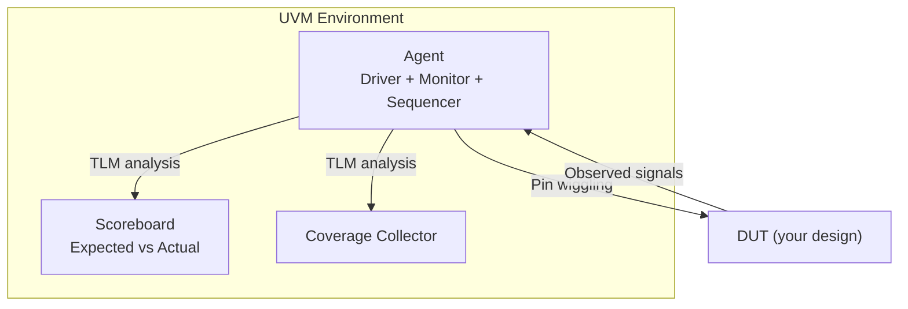
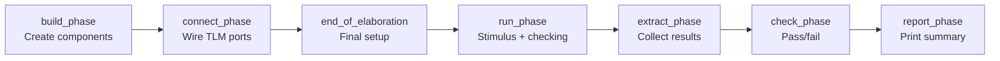

[← 07 Verification Home](README.md) · [← Project Home](../../README.md)

# UVM for FPGA — Overview

UVM (Universal Verification Methodology) is the IEEE 1800.2 industry-standard verification framework built on SystemVerilog. While UVM's full weight is often overkill for FPGA projects, understanding its architecture helps you scale verification when needed — and borrow the patterns that matter.

This article covers the UVM class hierarchy, component mechanics, TLM communication, the phasing system, and a minimal working testbench. For lighter alternatives, see [Cocotb](cocotb.md) and [Formal Verification](formal_verification.md).

---

## UVM Architecture



```
┌──────────────────────────────────────────┐
│              UVM Environment             │
│  ┌─────────┐  ┌──────────┐  ┌─────────┐  │
│  │ Agent   │  │ Score-   │  │ Coverage│  │
│  │┌───────┐│  │ board    │  │Collector│  │
│  ││Driver ││  │          │  │         │  │
│  │├───────┤│  └────┬─────┘  └────┬────┘  │
│  ││Monitor││       │             │       │
│  │├───────┤│       │             │       │
│  ││Sequen-││       │             │       │
│  ││cer    ││       │             │       │
│  │└───────┘│       │             │       │
│  └────┬────┘       │             │       │
│       │ TLM        │             │       │
└───────┼────────────┼─────────────┼───────┘
        │            │             │
   ┌────▼────────────▼─────────────▼───┐
   │           DUT (your design)       │
   └───────────────────────────────────┘
```

---

## UVM Class Hierarchy

Every UVM component inherits from `uvm_void` → `uvm_object` or `uvm_component`. Understanding this chain is essential for knowing what methods are available.

```
uvm_void
├── uvm_object               ← base for data objects (transactions, sequences)
│   ├── uvm_transaction
│   │   └── uvm_sequence_item  ← the stimulus unit ("a single AXI write")
│   └── uvm_sequence           ← generates sequence_items
│       └── uvm_custom_sequence  ← your test-specific sequences
│
└── uvm_component             ← base for structural components (has hierarchy)
    ├── uvm_driver             ← drives pin-level signals from transactions
    ├── uvm_monitor            ← observes pins, creates transactions
    ├── uvm_sequencer          ← routes sequence_items to driver
    ├── uvm_agent              ← groups driver + monitor + sequencer
    ├── uvm_scoreboard         ← compares expected vs actual
    ├── uvm_subscriber         ← coverage collector base
    ├── uvm_env                ← top-level container for agents + scoreboard
    └── uvm_test               ← top-level test: configures env, starts sequences
```

**Key distinction:** `uvm_object` has no hierarchy or phasing — it's a data container. `uvm_component` lives in the UVM hierarchy, participates in phases, and can access the config database.

---

## Core UVM Components

| Component | Role | FPGA Relevance |
|---|---|---|
| **uvm_test** | Top-level test class; configures env and starts sequences | One test per verification scenario |
| **uvm_env** | Container for agents, scoreboard, coverage | One env per DUT; holds the full testbench |
| **uvm_agent** | Groups driver, monitor, sequencer for one interface | One agent per AXI/Avalon interface |
| **uvm_driver** | Converts transactions to pin-level signals | Drives stimulus onto DUT inputs |
| **uvm_monitor** | Observes pin-level signals, creates transactions | Watches outputs, sends to scoreboard |
| **uvm_sequencer** | Routes sequence items to driver | Controls test flow ("send 100 AXI writes, then 50 reads") |
| **uvm_scoreboard** | Compares expected vs actual results | Reference model: does DUT output match golden model? |
| **uvm_subscriber** | Base class for coverage collection | "Did we test all AXI burst types?" |
| **uvm_sequence_item** | Transaction object (stimulus unit) | One item = one bus operation (read, write, packet) |
| **uvm_sequence** | Generates sequence_items | Defines a test scenario (write 4 words, read them back) |

---

## TLM Communication

UVM components communicate through **Transaction-Level Modeling (TLM)** ports — essentially type-safe FIFOs. This decouples components: the driver doesn't know where its transactions come from, the monitor doesn't know who consumes its observations.

### Port Types

| Port Type | Direction | Method | Use Case |
|---|---|---|---|
| `uvm_analysis_port` | One → Many (broadcast) | `.write(tx)` | Monitor → Scoreboard + Coverage |
| `uvm_blocking_put_port` | One → One (push) | `.put(tx)` — blocks if FIFO full | Sequence → Driver |
| `uvm_blocking_get_port` | One → One (pull) | `.get(tx)` — blocks if FIFO empty | Driver ← Sequencer |
| `uvm_tlm_fifo` | Buffer between ports | Configurable depth | Rate-mismatch between producer/consumer |

### Connection Pattern

```systemverilog
// In agent::connect_phase:
monitor.analysis_port.connect(scoreboard.analysis_export);
monitor.analysis_port.connect(coverage_sub.analysis_export);
```

The `analysis_port` is a broadcast: every `monitor.write(tx)` call delivers the transaction to **all** connected subscribers. This is how one monitor feeds both scoreboard and coverage simultaneously.

---

## UVM Phasing

UVM components execute through a fixed sequence of phases. Understanding phases is critical — `build_phase` creates the hierarchy, `connect_phase` wires TLM ports, `run_phase` is where simulation happens.



| Phase | What Happens | You Override? |
|---|---|---|
| **build_phase** | Create sub-components via `type_id::create()` | Yes — this is where you build the hierarchy |
| **connect_phase** | Connect TLM ports between components | Yes — wire monitor → scoreboard, etc. |
| **end_of_elaboration_phase** | Final setup before simulation starts | Rarely |
| **run_phase** | The actual simulation — drive stimulus, check results | Yes — in tests, start sequences here |
| **extract_phase** | Collect data from scoreboard | Rarely |
| **check_phase** | Scoreboard reports pass/fail | Sometimes |
| **report_phase** | Print UVM_INFO/WARNING/ERROR summary | Sometimes — add custom report formatting |

**Critical rule:** Only `run_phase` consumes simulation time. All other phases are functions (zero-time). Your driver's `run_phase` task is where `@(posedge clk)` lives.

---

## Factory and Configuration Database

### Factory Override

The UVM factory lets you substitute one component type for another without modifying source code. This is the mechanism for test-to-test variation.

```systemverilog
// In your test's build_phase:
// Replace default AXI driver with an error-injection variant
factory.set_type_override_by_type(axi_driver::get_type(),
                                   axi_error_driver::get_type());

// Replace for a specific instance only:
factory.set_inst_override_by_type(axi_driver::get_type(),
                                   axi_error_driver::get_type(),
                                   "env.agent1.driver");
```

**Use case:** Test 1 uses the normal driver. Test 2 overrides the driver with one that injects AXI protocol errors (deasserts VALID early, drives BAD parity). Same environment, different driver — no code duplication.

### Configuration Database (`uvm_config_db`)

Pass parameters from the test down to components without modifying component source:

```systemverilog
// In test: set a parameter
uvm_config_db#(int)::set(this, "env.agent.driver", "vif_width", 64);

// In driver: retrieve the parameter
int width;
if (!uvm_config_db#(int)::get(this, "", "vif_width", width))
    `uvm_fatal("DRV", "vif_width not set in config_db")
```

**Use case:** One agent parameterized for 32-bit or 64-bit AXI data width. The test sets the width; the agent adapts.

---

## Minimal Working Example: AXI-Lite Register Test

This is the smallest useful UVM testbench — an AXI-Lite slave DUT with a register bank. It demonstrates the complete flow: transaction → sequence → driver → monitor → scoreboard.

### DUT (simple AXI-Lite register bank)

```systemverilog
// axi_lite_slave.sv — the design under test
module axi_lite_slave (
    input  wire        clk,
    input  wire        rst_n,
    // AXI-Lite write address
    input  wire [31:0] awaddr,
    input  wire        awvalid,
    output wire        awready,
    // AXI-Lite write data
    input  wire [31:0] wdata,
    input  wire [3:0]  wstrb,
    input  wire        wvalid,
    output wire        wready,
    // AXI-Lite write response
    output wire [1:0]  bresp,
    output wire        bvalid,
    input  wire        bready,
    // AXI-Lite read address
    input  wire [31:0] araddr,
    input  wire        arvalid,
    output wire        arready,
    // AXI-Lite read data
    output wire [31:0] rdata,
    output wire [1:0]  rresp,
    output wire        rvalid,
    input  wire        rready
);
    reg [31:0] regs [0:15];

    assign awready = 1;
    assign wready  = 1;
    assign arready = 1;

    always @(posedge clk) begin
        if (!rst_n) begin
            for (int i = 0; i < 16; i++) regs[i] <= 0;
        end else begin
            if (awvalid && awready && wvalid && wready)
                regs[awaddr[5:2]] <= wdata;
        end
    end

    assign rdata = (arvalid && arready) ? regs[araddr[5:2]] : 32'd0;
    assign bresp = 2'b00;  // OKAY
    assign rresp = 2'b00;
    assign bvalid = awvalid && wvalid;
    assign rvalid = arvalid;
endmodule
```

### Transaction

```systemverilog
// axi_lite_txn.sv
class axi_lite_txn extends uvm_sequence_item;
    rand bit [31:0] addr;
    rand bit [31:0] data;
    rand bit        is_write;  // 1=write, 0=read

    `uvm_object_utils_begin(axi_lite_txn)
        `uvm_field_int(addr,     UVM_DEFAULT)
        `uvm_field_int(data,     UVM_DEFAULT)
        `uvm_field_int(is_write, UVM_DEFAULT)
    `uvm_object_utils_end

    constraint addr_aligned { addr[1:0] == 2'b00; }  // 32-bit aligned
    constraint valid_addr   { addr < 64; }            // 16 registers × 4 bytes
endclass
```

### Sequence

```systemverilog
// write_read_seq.sv — write a value, read it back, verify
class write_read_seq extends uvm_sequence #(axi_lite_txn);
    `uvm_object_utils(write_read_seq)
    `uvm_declare_p_sequencer(uvm_sequencer #(axi_lite_txn))

    function new(string name="write_read_seq");
        super.new(name);
    endfunction

    task body();
        axi_lite_txn tx;

        // Write phase
        for (int i = 0; i < 16; i++) begin
            tx = axi_lite_txn::type_id::create("tx");
            start_item(tx);
            tx.is_write = 1;
            tx.addr     = i * 4;
            tx.data     = $urandom_range(32'h0000_0000, 32'hFFFF_FFFF);
            finish_item(tx);
        end

        // Read-back phase
        for (int i = 0; i < 16; i++) begin
            tx = axi_lite_txn::type_id::create("tx");
            start_item(tx);
            tx.is_write = 0;
            tx.addr     = i * 4;
            tx.data     = 0;  // Don't care for reads
            finish_item(tx);
        end
    endtask
endclass
```

### Driver

```systemverilog
// axi_lite_driver.sv
class axi_lite_driver extends uvm_driver #(axi_lite_txn);
    `uvm_component_utils(axi_lite_driver)

    virtual axi_lite_if vif;

    function new(string name, uvm_component parent);
        super.new(name, parent);
    endfunction

    task run_phase(uvm_phase phase);
        forever begin
            seq_item_port.get_next_item(req);
            drive_txn(req);
            seq_item_port.item_done();
        end
    endtask

    task drive_txn(axi_lite_txn tx);
        @(posedge vif.clk);
        if (tx.is_write) begin
            vif.awvalid <= 1;
            vif.awaddr  <= tx.addr;
            vif.wvalid  <= 1;
            vif.wdata   <= tx.data;
            vif.wstrb   <= 4'hF;
            @(posedge vif.clk);
            while (!vif.bvalid) @(posedge vif.clk);
            vif.awvalid <= 0;
            vif.wvalid  <= 0;
        end else begin
            vif.arvalid <= 1;
            vif.araddr  <= tx.addr;
            @(posedge vif.clk);
            while (!vif.rvalid) @(posedge vif.clk);
            vif.arvalid <= 0;
        end
    endtask
endclass
```

### Test (Top-Level)

```systemverilog
// axi_lite_test.sv
class axi_lite_test extends uvm_test;
    `uvm_component_utils(axi_lite_test)

    axi_lite_env env;

    function new(string name, uvm_component parent);
        super.new(name, parent);
    endfunction

    function void build_phase(uvm_phase phase);
        super.build_phase(phase);
        env = axi_lite_env::type_id::create("env", this);
    endfunction

    task run_phase(uvm_phase phase);
        write_read_seq seq;
        seq = write_read_seq::type_id::create("seq");

        phase.raise_objection(this);  // Prevent simulation from ending
        seq.start(env.agent.sequencer);
        phase.drop_objection(this);   // All done, allow sim to end
    endtask
endclass
```

### Top-Level Module (instantiates DUT + test)

```systemverilog
// tb_top.sv
module tb_top;
    import uvm_pkg::*;
    `include "uvm_macros.svh"

    logic clk, rst_n;
    axi_lite_if vif (.clk(clk), .rst_n(rst_n));

    axi_lite_slave dut (
        .clk(clk), .rst_n(rst_n),
        .awaddr(vif.awaddr), .awvalid(vif.awvalid), .awready(vif.awready),
        .wdata(vif.wdata),   .wstrb(vif.wstrb),     .wvalid(vif.wvalid),   .wready(vif.wready),
        .bresp(vif.bresp),   .bvalid(vif.bvalid),    .bready(vif.bready),
        .araddr(vif.araddr), .arvalid(vif.arvalid),  .arready(vif.arready),
        .rdata(vif.rdata),   .rresp(vif.rresp),      .rvalid(vif.rvalid),   .rready(vif.rready)
    );

    initial begin
        clk = 0;
        forever #5 clk = ~clk;  // 100 MHz
    end

    initial begin
        rst_n = 0;
        #20 rst_n = 1;
    end

    initial begin
        uvm_config_db#(virtual axi_lite_if)::set(null, "uvm_test_top.env.agent.driver", "vif", vif);
        uvm_config_db#(virtual axi_lite_if)::set(null, "uvm_test_top.env.agent.monitor", "vif", vif);
        run_test("axi_lite_test");
    end
endmodule
```

---

## Building and Running UVM

### With Questa/ModelSim

```bash
# Compile UVM library + design + testbench
vlib work
vlog -sv +incdir+$UVM_HOME/src $UVM_HOME/src/uvm_pkg.sv \
    axi_lite_if.sv axi_lite_txn.sv axi_lite_driver.sv \
    axi_lite_monitor.sv axi_lite_agent.sv axi_lite_scoreboard.sv \
    axi_lite_env.sv axi_lite_test.sv tb_top.sv axi_lite_slave.sv

# Simulate
vsim -c tb_top -do "run -all; quit"
```

### With Vivado XSim

```bash
# XSim supports UVM 1.2 (limited — check UG900 for supported subset)
xvlog -sv --incr --relax -d UVM_NO_DPI \
    +incdir+$XILINX_VIVADO/data/uvm/src $XILINX_VIVADO/data/uvm/src/uvm_pkg.sv \
    axi_lite_if.sv axi_lite_txn.sv axi_lite_driver.sv \
    axi_lite_monitor.sv axi_lite_agent.sv axi_lite_scoreboard.sv \
    axi_lite_env.sv axi_lite_test.sv tb_top.sv axi_lite_slave.sv

xelab tb_top -snapshot snap -relax -dpi_header no
xsim snap -R
```

> **Note:** XSim's UVM support is a subset. For full UVM, use Questa, VCS, or Xcelium. See [Vivado XSim UVM Support](https://docs.amd.com/r/en-US/ug900-vivado-logic-simulation/Universal-Verification-Methodology-UVM-Support).

### With VCS (Synopsys)

```bash
vcs -sverilog -ntb_opts uvm-1.2 \
    +incdir+$VCS_HOME/uvm-1.2/src \
    axi_lite_if.sv axi_lite_slave.sv axi_lite_txn.sv \
    axi_lite_driver.sv axi_lite_monitor.sv axi_lite_agent.sv \
    axi_lite_scoreboard.sv axi_lite_env.sv axi_lite_test.sv tb_top.sv

./simv +UVM_VERBOSITY=UVM_MEDIUM
```

### Useful UVM Command-Line Options

| Option | Effect |
|---|---|
| `+UVM_VERBOSITY=UVM_HIGH` | Show all `uvm_info` messages (default: UVM_MEDIUM) |
| `+UVM_TESTNAME=my_test` | Override which test class to run |
| `+UVM_TIMEOUT=1ms,QUIT` | Abort simulation after 1 ms if not done |
| `+uvm_set_config_int=*,vif_width,64` | Set config_db integer from command line |

---

## When to Use UVM (vs Cocotb + SVA)

| Scenario | UVM | Cocotb + SVA |
|---|---|---|
| Single AXI/streaming IP test | Overkill | ✅ Quick Python test |
| SoC with 5+ bus interfaces | ✅ Agent per interface, coordinated tests | ❌ Hard to coordinate |
| Reusable verification IP | ✅ Factory pattern enables VIP sharing | ❌ Limited reusability |
| Team of 3+ verification engineers | ✅ Standard methodology | ❌ Each person writes own framework |
| Solo FPGA developer, 1–2 interfaces | ❌ Too heavy | ✅ Fast iteration |
| Protocol compliance testing | ✅ Coverage-driven, regression | ✅ SVA assertions + directed tests |
| Need constrained-random stimulus | ✅ Built-in constraint solver | ❌ Must write randomization manually |

---

## UVM Lite — Practical for FPGA

Most FPGA projects don't need full UVM. Instead:

1. **Use SVA assertions** for protocol checks (AXI, Avalon handshake rules) — see [SystemVerilog Verification](sv_verification.md)
2. **Use Cocotb** for functional test writing (Python → faster iteration) — see [Cocotb](cocotb.md)
3. **Borrow UVM patterns selectively:**
   - **Scoreboard** — always useful; implement it in Python/cocotb if not using UVM
   - **Coverage collector** — track which address ranges and burst types were tested
   - **Monitor** — even without UVM, a standalone SV monitor that logs transactions is valuable
4. **Only go full UVM** when you have: multiple bus interfaces, a team, or reuse requirements across projects

---

## Common Pitfalls

| Pitfall | Symptom | Fix |
|---|---|---|
| **XSim UVM incompatibility** | Compilation errors on UVM 1.2 features | Check UG900 supported subset; use Questa for full UVM |
| **Missing `uvm_config_db::set`** | Driver gets null `vif` handle → segfault | Always set virtual interface in `tb_top` before `run_test()` |
| **No `raise_objection`** | Simulation ends immediately | `phase.raise_objection(this)` before starting sequence |
| **Forgetting `factory registration macros`** | Components not created by factory | Always include `uvm_component_utils` / `uvm_object_utils` |
| **`start_item` / `finish_item` split** | Randomization happens at wrong time | Randomize BEFORE `start_item`, or randomize between `start_item` and `finish_item` |
| **TLM port not connected** | `uvm_warning: analysis port not connected` | Wire ports in `connect_phase` of env/agent |
| **UVM_TIMEOUT kills valid long tests** | Simulation aborts prematurely | Set `+UVM_TIMEOUT` appropriately for your test duration |

---

## References

| Document | Source | What It Covers |
|---|---|---|
| [IEEE 1800.2-2020 — UVM Standard](https://www.accellera.org/downloads/standards/uvm) | Accellera/IEEE | Official UVM class library and reference implementation |
| [UG900 — Vivado Logic Simulation](https://docs.amd.com/r/en-US/ug900-vivado-logic-simulation/Universal-Verification-Methodology-UVM-Support) | AMD/Xilinx | XSim UVM support and limitations |
| [UG937 — Vivado Simulation Tutorial (UVM Example)](https://docs.amd.com/r/en-US/ug937-vivado-design-suite-simulation-tutorial/Running-UVM-Example) | AMD/Xilinx | Step-by-step UVM simulation in Vivado |
| [Testbench Patterns](testbench_patterns.md) | This KB | Self-checking testbenches, scoreboards, constrained-random |
| [SystemVerilog Verification](sv_verification.md) | This KB | SVA assertions, coverage, clocking blocks |
| [Cocotb](cocotb.md) | This KB | Python-based verification — the lighter alternative |
| [Formal Verification](formal_verification.md) | This KB | SymbiYosys, JasperGold, formal proofs |
