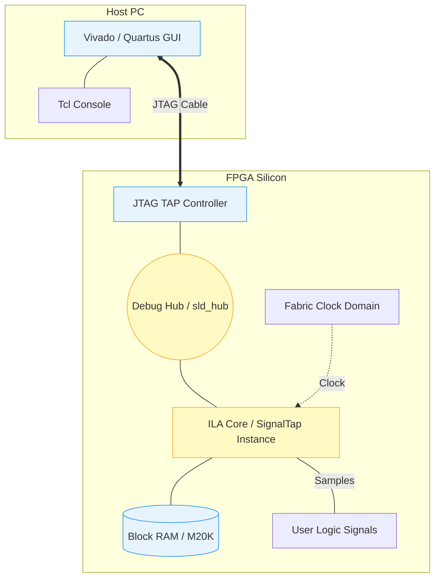

[← 08 Debug And Tools Home](README.md) · [← Project Home](../../README.md)

# Integrated Logic Analyzers — ILA and SignalTap

When your FPGA design synthesizes without error but misbehaves on actual hardware, and simulation cannot reproduce the bug (often due to unmodeled external asynchronous events), you need an **On-Chip Logic Analyzer**. 

Xilinx ILA (Integrated Logic Analyzer) and Intel SignalTap II are the industry standards. They synthesize actual memory (BRAM) and trigger logic directly into your fabric to capture real-time waveforms and extract them back to your PC via JTAG.

---

## System Architecture

An Integrated Logic Analyzer is not magic; it is simply an IP core synthesized out of standard FPGA logic (LUTs and Flip-Flops) that saves data into standard Block RAMs. It communicates with the host PC by hijacking the JTAG boundary scan chain using a Debug Hub.



### The Golden Rule of ILAs

> [!WARNING]
> **CDC: Requires Synchronizer**
> An ILA is a synchronous digital circuit. The clock you provide to the ILA **MUST** be exactly synchronous to the signals you are probing. If you probe signals from a 100MHz domain using an ILA clocked at 50MHz, or from an unrelated asynchronous domain, you will capture garbage, cause setup/hold violations, and introduce metastability into your trace.

---

## Vendor Differences & Open-Source Analogies

While they serve the same purpose, the architectures have distinct differences:

| Feature | Xilinx ILA (Vivado) | Intel SignalTap II (Quartus) | Open-Source Analogy (LiteScope) |
|---|---|---|---|
| **Max Signals** | 1,024 per core | 2,048 per instance | Configurable (LUT limited) |
| **Storage** | Raw BRAM / URAM | BRAM (M10K/M20K) | Block RAM |
| **Compression** | No (1 bit = 1 BRAM cell) | **Yes** (Run-length encoding) | No |
| **Bridge Type** | `dbg_hub` (JTAG USER instructions) | `sld_hub` (JTAG USER instructions) | UART / Ethernet / PCIe |
| **CLI Workflow** | `run_hw_ila` (Tcl) | `quartus_stp` (Tcl) | `litescope_cli` (Python) |

### The SignalTap Compression Advantage
Because Xilinx ILAs lack compression, capturing 128 signals for 32,000 clock cycles requires exactly 4 megabits of BRAM. Intel's SignalTap uses a clever run-length compression algorithm in hardware. If your monitored signals rarely toggle (e.g., waiting for an I2C packet), SignalTap only stores the transitions and the delta-time between them. This can yield a **2× to 10× effective depth increase** for bursty signals.

### The Open-Source Alternative: LiteScope
For open-source flows (Yosys/nextpnr) or custom soft-cores, you don't have access to Vivado ILA. Instead, the community uses **LiteScope** (part of the LiteX ecosystem). Unlike proprietary ILAs that mandate a JTAG adapter, LiteScope can extract captured traces over a standard UART serial port, Ethernet, or even PCIe.

---

## Automated CI/CD Cookbook (Headless ILA)

Interactive GUI debugging is fine for development, but in a CI/CD pipeline, hardware regression tests must run headlessly. Below is a complete Tcl script that configures a Xilinx ILA to wait for an AXI `TVALID` pulse, captures the waveform, and exports it to a `.vcd` file without ever opening the Vivado GUI.

```tcl
# headless_ila_capture.tcl
# Run with: vivado -mode batch -source headless_ila_capture.tcl

# 1. Connect to Hardware Server
open_hw_manager
connect_hw_server -url localhost:3121
current_hw_target [get_hw_targets */xilinx_tcf/Digilent/*]
set_property PARAM.FREQUENCY 15000000 [get_hw_targets current]
open_hw_target

# 2. Program the Device
set device [lindex [get_hw_devices xc7z020_1] 0]
set_property PROGRAM.FILE {build/top.bit} $device
set_property PROBES.FILE {build/top.ltx} $device
program_hw_devices $device

# 3. Configure the ILA Trigger
set ila [get_hw_ilas hw_ila_1]
set trig [create_hw_probe_trigger -ila $ila]

# Trigger on AXI Stream TVALID rising edge
add_hw_probe_trigger_condition $trig [get_hw_probes m_axis_tvalid] -edge rising
set_hw_probe_trigger $ila $trig

# 4. Arm and Wait (Blocks until trigger fires or timeout)
puts "Arming ILA and waiting for trigger..."
run_hw_ila $ila
wait_on_hw_ila $ila

# 5. Extract and Export Data
puts "Trigger fired! Downloading capture..."
upload_hw_ila_data $ila
write_hw_ila_data -force capture.ila [current_hw_ila_data]

# Convert to standard VCD for viewing in GTKWave
write_hw_ila_vcd -force capture.vcd [current_hw_ila_data]
puts "Capture saved to capture.vcd!"
```

---

## Resource Cost & Floorplanning

ILAs are notorious for causing timing failures in nearly-full designs because they fan out across the chip to monitor signals, creating routing congestion.

| Parameter | Formula |
|---|---|
| **BRAM blocks** | `ceil(signal_width × sample_depth / BRAM_data_width)` |
| **Logic (trigger)** | ~50–200 LUTs per trigger condition |
| **Logic (glue)** | ~100–300 LUTs for the JTAG bridge (`dbg_hub`) |

> [!TIP]
> **Rule of Thumb:** Keep ILA BRAM usage below 10% of total chip capacity. If your design is highly congested, consider locking the ILA to a specific `pblock` (Xilinx) or LogicLock region (Intel) to prevent the auto-router from spreading the ILA logic across the entire die.

---

## Pitfalls & Common Mistakes

### 1. The CDC Trigger Trap
*   **The Mistake**: You connect signals from a 100MHz clock and a 200MHz clock to the same ILA, and supply the ILA with the 200MHz clock.
*   **The Result**: The 100MHz signals will be oversampled, and because there is no synchronizer on the debug inputs, setup/hold violations will occur on the 100MHz nets, causing sporadic trigger failures and garbage data.
*   **The Fix**: Instantiate *two separate ILAs*. One clocked at 100MHz monitoring the 100MHz nets, and one clocked at 200MHz monitoring the 200MHz nets.

### 2. Synthesis Optimization Deleting Nets
*   **The Mistake**: You write your RTL, add an ILA core, and wire it up to an internal state machine variable. After compilation, Vivado complains the net doesn't exist.
*   **The Result**: The synthesis engine realized your internal state machine variable wasn't driving any real outputs, so it optimized it away. The ILA probe is left dangling.
*   **The Fix**: You must explicitly preserve the signal. In Xilinx, use the `(* MARK_DEBUG = "TRUE" *)` Verilog attribute. In Intel, use `(* preserve *)`.

### 3. Starving the Design of BRAM
*   **The Mistake**: Requesting a 131,072-depth trace on a 256-bit bus on a small Artix-7 FPGA.
*   **The Result**: The tools will fail during Place & Route because the ILA requires 100% of the available BRAM, leaving none for your actual design.
*   **The Fix**: Use advanced trigger sequences (state-machine triggers) to only capture the *exact* window of failure, drastically reducing the required sample depth.

---

## References

*   [Xilinx UG908: Vivado Programming and Debugging](https://docs.xilinx.com/)
*   [Intel Quartus Prime Standard Edition User Guide: Debug Tools](https://www.intel.com/content/www/us/en/docs/programmable/683705/current/introduction.html)
*   [LiteScope GitHub Repository](https://github.com/enjoy-digital/litescope)
