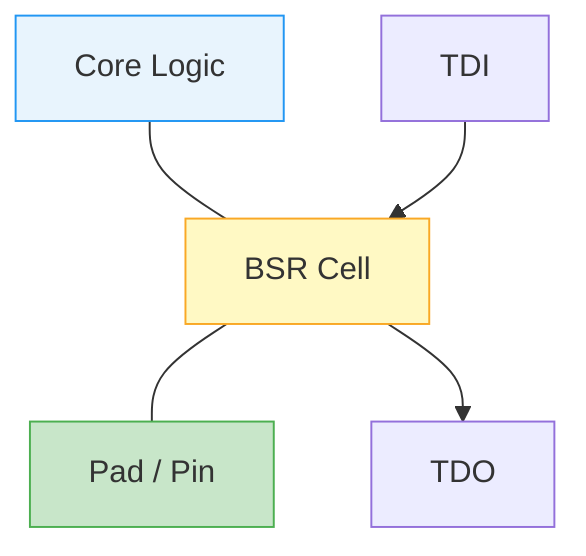

[← 08 Debug And Tools Home](README.md) · [← Project Home](../../README.md)

# JTAG and Boundary Scan: From Shift Registers to Core Debugging

## Overview

JTAG is arguably the most misunderstood interface in hardware engineering. It is frequently conflated with "Boundary Scan" or thought of as a specific debugging protocol. In reality, **JTAG is a physical transport layer**—a finite state machine that simply shifts bits through a chain of registers. 

What a chip *does* with those shifted bits defines its debugging capability. Modern FPGAs and Systems-on-Chip (SoCs) utilize the JTAG transport layer to expose massive internal architectures, allowing developers to halt CPU cores, read AXI memory directly, load bitstreams, and extract gigabytes of internal waveform data.

## Architecture: The TAP and Shift Registers

JTAG (IEEE 1149.1) defines a Test Access Port (TAP) controller governed by four pins: `TCK` (Clock), `TMS` (Mode Select), `TDI` (Data In), and `TDO` (Data Out).

Inside the chip, the TAP controller is a 16-state Finite State Machine (FSM). It routes the `TDI` → `TDO` path through one of two main areas: the **Instruction Register (IR)** or one of many **Data Registers (DR)**.

```text
┌─────────────────────────────────────────────────┐
│  TAP Controller (16-state FSM)                  │
│                                                 │
│  ┌──────────────┐    ┌────────────────────────┐ │
│  │  IR Register │    │  DR Registers (many)   │ │
│  │  (Instr.Reg) │    │  - BYPASS (1 bit)      │ │
│  │  N bits      │    │  - IDCODE (32 bits)    │ │
│  └──────────────┘    │  - BOUNDARY SCAN       │ │
│                      │  - USER1/USER2 (FPGA)  │ │
│                      │  - DBGACK, RESTART...  │ │
│                      └────────────────────────┘ │
└─────────────────────────────────────────────────┘
```

The fundamental JTAG loop is always the same:
1. Move the FSM to `Shift-IR` and shift an instruction opcode into the IR.
2. The loaded instruction physically connects one specific Data Register (DR) between TDI and TDO.
3. Move the FSM to `Shift-DR` and shift data through the selected register.
4. Move to `Update-DR` to latch the shifted data into the chip's internal logic.

Because every chip defaults to the 1-bit `BYPASS` register, multiple chips can be chained together sequentially (TDO of Chip 1 connects to TDI of Chip 2). The entire board appears as one giant, dynamically resizing shift register.

## Transport Layer vs. Boundary Scan

These two terms are not synonymous.

**Pure JTAG (Transport Layer)**
A chip is "JTAG compliant" if it contains a TAP controller and implements the mandatory `BYPASS` and `IDCODE` (Device ID) instructions. However, a purely compliant chip does not necessarily expose any of its internal logic or physical pins to the JTAG chain.

**Boundary Scan (IEEE 1149.1 Application)**
Boundary Scan is a specific capability built *on top* of the JTAG transport. It dictates that every single physical I/O pad on the chip is wrapped in a Boundary Scan Register (BSR) cell.



A BSR cell allows the JTAG controller to:
- **SAMPLE**: Silently capture the state of the pin while the core logic is running.
- **EXTEST**: Disconnect the core logic and force a value directly onto the physical pin (used to test PCB solder joints for shorts/opens without booting the chip).
- **INTEST**: Force a value into the core logic, ignoring what is on the physical pin.

## What Else Can Be Accessed via JTAG?

If the TAP controller is just a gateway, what else is hiding behind it in modern architectures?

### 1. Advanced Processors (ARM / RISC-V)
Modern CPUs do not use Boundary Scan for debugging; they use proprietary debug blocks accessed via custom JTAG DRs.

*   **ARM CoreSight & The Debug Access Port (DAP)**: ARM entirely abandons traditional JTAG Boundary Scan for CPU debugging. Instead, they use the [ARM Debug Interface (ADI)](https://developer.arm.com/documentation/ihi0031/e/) architecture. The ADI splits debugging into two layers:
    *   **The Debug Port (DP)**: The physical transport layer. This can be either a traditional JTAG-DP or a 2-wire SWD-DP (Serial Wire Debug).
    *   **The Access Port (AP)**: A bridge that translates DP commands into internal AMBA bus transactions. There are usually multiple APs on a chip:
        *   **APB-AP**: Connects to the slow APB bus to read/write internal CPU debug registers (e.g., to halt the core or set hardware breakpoints).
        *   **AHB-AP / AXI-AP**: Connects directly to the main system memory bus. By writing to the AHB-AP, a JTAG debugger like OpenOCD acts as a hardware bus master. **This allows the JTAG port to read and write system DDR memory or peripheral registers directly and invisibly**, entirely bypassing the CPU core. This is how "live memory viewing" works while the CPU is running.
*   **RISC-V DMI**: RISC-V specifies a Debug Transport Module (DTM) that bridges JTAG to the Debug Module (DM). This enables abstract commands (step, halt, read GPR) via standard shift registers.

### 2. SoC FPGAs: Dual-TAP Topologies (Zynq & Cyclone V)
When dealing with System-on-Chip (SoC) FPGAs that combine a hard ARM processor with FPGA fabric, JTAG becomes significantly more complex because there are multiple TAPs packed into a single chip. You must understand how they are routed to debug them effectively.

*   **Intel Cyclone V SoC**: Contains two distinct TAPs—the **HPS TAP** (Hard Processor System) and the **FPGA TAP**. Board designers have two choices: 
    1.  *Independent Mode*: Route them to two separate physical JTAG headers on the PCB. This prevents OpenOCD (debugging the ARM) from fighting with Quartus (debugging the FPGA logic).
    2.  *Chained Mode*: Route them serially. When you run `jtagconfig`, you will see two devices in the chain (e.g., `SOCVHPS` and `5CSEBA6`).
*   **Xilinx Zynq-7000**: Internally cascades the TAPs. The external JTAG pins always hit the **PS TAP** (Processing System/ARM CoreSight DAP) first. By default, the **PL TAP** (Programmable Logic/FPGA) is *not visible* on the chain until the PS boots up and explicitly enables the PL TAP via the `JTAG_CTRL` register. This often confuses beginners who plug in a JTAG cable and only see an ARM core!
*   **Xilinx Zynq UltraScale+ (MPSoC)**: Features an extremely advanced cascaded topology managed by the Platform Management Unit (PMU). The PMU can completely lock out the JTAG interface for secure boot operations, or dynamically switch the chain to expose the ARM Cortex-A53s, Cortex-R5s, or the PL fabric depending on the security level and boot state.

### 3. Deep FPGA Features (Xilinx / Intel)
FPGAs hide their most powerful tools behind the TAP controller.

*   **Configuration Engines**: FPGAs expose specific DRs that connect directly to the SRAM configuration engine. This allows you to stream a `.bit` or `.sof` file directly into the fabric, entirely bypassing the external SPI flash memory.
*   **The `USER` Instructions**: FPGAs implement undefined instructions like `USER1`, `USER2`, `USER3`. The vendor provides primitives (e.g., Xilinx `BSCANE2`) that allow you to route these JTAG data paths directly into your custom RTL fabric. This is how JTAG-UARTs are built—using a slow, but "zero physical pin cost" serial port.
*   **Integrated Logic Analyzers (ILA)**: Tools like Vivado ILA and Intel SignalTap leverage these `USER` instructions to extract gigabytes of captured waveform data from Block RAMs back to the host PC.
*   **Security (eFuses)**: JTAG is used in the factory to blow physical, non-volatile eFuses inside the FPGA. This is how hardware root-of-trust is established. 
    *   For **AMD/Xilinx** (e.g., 7-Series), JTAG is used to permanently burn the 256-bit AES bitstream decryption key into the silicon, and optionally blow the `JTAG_DISABLE` fuse to permanently destroy the TAP controller and prevent IP theft. *(Reference: [Xilinx UG470: 7 Series FPGAs Configuration User Guide](https://docs.amd.com/v/u/en-US/ug470_7Series_Config) and [XAPP1239](https://docs.amd.com/v/u/en-US/xapp1239-fpga-efuse-programming))*
    *   For **Intel/Altera** (e.g., Stratix 10), the JTAG port interacts with the **Secure Device Manager (SDM)** to provision the `.fuse` files containing the Root of Trust hashes and encryption keys. The Quartus Programmer (`quartus_pgm`) literally issues JTAG commands to physically vaporize the metal links inside the chip. *(Reference: [Intel Stratix 10 Device Security User Guide](https://www.intel.com/content/www/us/en/docs/programmable/683743/current/security-features.html))*

### 3. Advanced FPGA Use Cases

Beyond basic loading and ILAs, FPGAs leverage JTAG for complex system-level interactions:

*   **Virtual I/O (VIO)**: Tools like Xilinx VIO or Intel In-System Sources and Probes (ISSP) allow you to place virtual buttons, switches, and LEDs inside your RTL. You can click a button in the Vivado GUI on your PC, and it toggles a wire deep inside the FPGA fabric over the JTAG connection. This is invaluable for triggering state machines without physical hardware buttons.
*   **JTAG-to-AXI Master**: Xilinx provides an IP core that translates JTAG shift register data directly into AXI memory-mapped transactions. This allows a Tcl script on the host PC to read and write to DDR memory, configure peripheral CSRs, or reset IP blocks while the FPGA is running, all without a soft-core processor.
*   **Xilinx Virtual Cable (XVC)**: XVC is a protocol that encapsulates raw JTAG commands (`tms`, `tdi`, `tck`) into TCP/IP packets. By running a lightweight XVC server on an internal soft-core processor (or the ARM HPS in a Zynq) connected to the network, a remote instance of Vivado can connect to the FPGA over Ethernet and debug it exactly as if a physical USB-JTAG cable were plugged into the board.

### 4. Internal Daisy Chaining (The SoC Reality)
On a modern System-on-Chip (e.g., Zynq 7000 or Intel Cyclone V SoC), the physical JTAG pins do not go to a single TAP. Internally, the silicon contains **multiple cascaded TAPs**. A Zynq device internally chains the ARM DAP TAP to the FPGA Fabric TAP. To OpenOCD, a single Zynq chip appears as two entirely separate devices in the chain.

## BSDL: Mapping the Unknown

How does a tool know what instructions a chip supports? It uses a **BSDL (Boundary Scan Description Language)** file provided by the vendor. 

The BSDL file defines:
- The length of the Instruction Register (e.g., Xilinx 7-series is 6 bits; Intel Cyclone V is 10 bits).
- The opcodes for `BYPASS`, `IDCODE`, `EXTEST`, etc.
- The exact topology of the BSR cells mapping to physical pins.

> [!CAUTION]
> **The Vendor Link Rot Problem:** Do not rely on direct web links for BSDL files. Due to constant corporate restructuring (Intel spinning out Altera, AMD buying Xilinx, Microchip buying Microsemi), direct deep-links to BSDL files break on a yearly basis. Furthermore, vendors like Lattice and Microchip actively block direct automated downloads via Cloudflare.

### Where to Find BSDL Files (Active & Legacy)

Because web links rot rapidly, the most robust engineering practice is to pull BSDL files directly from your **local toolchain installation** rather than the web. If you must use the web, follow these navigation paths rather than relying on bookmarks.

| Vendor / Family | Official Navigation Path (Web) | Local Toolchain Path (Most Reliable) | Community Fallback (bsdl.info) |
|---|---|---|---|
| **AMD/Xilinx: All Series** | [AMD BSDL Portal](https://www.xilinx.com/support/download/index.html/content/xilinx/en/downloadNav/device-models/bsdl-models.html) | `<Vivado>/data/parts/xilinx/<family>/public/bsdl` | [Legacy Xilinx Mirror](https://bsdl.info/family.htm?m=74) |
| **Intel/Altera: All Series** | [Altera BSDL Portal](https://www.altera.com/design/devices/resources/models/bsdl) | `<Quartus>/quartus/libraries/misc/bsdl/` | [Legacy Altera Mirror](https://bsdl.info/family.htm?m=111) |
| **Lattice: CrossLink-NX / ECP5 / MachXO3** | `latticesemi.com` → Products → FPGA → *Device* → Downloads | `<Diamond/Radiant>/data/<family>/` | [Legacy Lattice Mirror](https://bsdl.info/family.htm?m=34) *(N/A for NX)* |
| **Lattice: iCE40** | *Not Supported* (iCE40 physically lacks a JTAG TAP; uses SPI) | N/A | N/A |
| **Microchip: PolarFire / SmartFusion2** | `microchip.com` → Search: `"BSDL Tech Docs"` | Exported dynamically via Libero SoC GUI | [Legacy Actel Mirror](https://bsdl.info/family.htm?m=230) |
| **Gowin: LittleBee / Arora** | Requires Gowin Support Portal Login | `<Gowin>/IDE/data/bsdl/` | Not Available |
| **Efinix: Trion / Titanium** | Requires Efinix Support Center Login | `<Efinity>/data/bsdl/` | Not Available |

*Note for Retro/Legacy Hardware: If you are dealing with deprecated CPLDs or FPGAs (like Altera MAX7000, Xilinx Spartan-II, Actel ProASIC), you MUST use [bsdl.info](https://www.bsdl.info) as the official vendor documentation has been entirely purged.*

> [!WARNING]
> **The Limit of BSDL:** Vendors *only* document public Boundary Scan instructions in the BSDL. The opcodes used for ARM CoreSight, FPGA configuration, or internal ILAs are deliberately omitted. Tools like OpenOCD must reverse-engineer or implement these proprietary DRs manually.

## Real-World Production Use Cases

While JTAG is famous for interactive debugging during board bring-up, it is heavily utilized in automated production and deployment environments:

### 1. Automated PCB Assembly Testing (PCBA)
Contract Manufacturers (CMs) use Boundary Scan as a primary testing vector for dense PCBs where flying probe testers cannot reach (e.g., underneath BGA packages). 
> **Tooling Note**: For a breakdown of the specific software/hardware packages used in production (XJTAG, Corelis, Lauterbach), see the dedicated [Commercial JTAG & Boundary Scan Tools](commercial_jtag_tools.md) guide.

*   **How it works:** Commercial software loads the BSDL files for all chips on the board to understand their boundary-scan register topologies. 
*   **The Execution:** The tool uses the `EXTEST` instruction to force a specific pin on an FPGA High, and then uses the BSR of an adjacent microcontroller to verify that the corresponding connected pin reads High. 
*   **The Result:** It automatically detects solder bridges (shorts), cold joints (opens), and missing passive components (pull-ups/pull-downs) without ever booting the CPUs or configuring the FPGAs.

### 2. Baseboard Management Controllers (BMC) & Remote Recovery
In modern servers, hyperscalers, and advanced network switches, the main application CPUs and FPGAs are completely headless. Their JTAG ports are permanently wired to an onboard Baseboard Management Controller (BMC), typically an ASPEED AST2600 running OpenBMC.
*   **Remote Firmware Updates:** The BMC can silently stream a new bitstream into the FPGA via JTAG (`PROGRAM` opcodes) over the network without requiring a physical JTAG cable.
*   **Post-Mortem Crash Dumping:** If the main SoC locks up entirely and cannot respond to SSH or PCI-e, the BMC can seize the JTAG TAP, halt the cores, and dump the CPU registers and DDR memory via ARM CoreSight DAP to diagnose the kernel panic.

### 3. Hardware-in-the-Loop (HIL) CI/CD
In CI/CD pipelines (e.g., GitLab CI) for FPGA firmware, physical hardware must be tested automatically upon every Git commit.
*   **The Setup:** A test runner (like a Raspberry Pi) is physically wired to the FPGA board's JTAG port. 
*   **The Pipeline:** The CI job uses OpenOCD to flash the newly synthesized bitstream via JTAG. It then interacts with internal Virtual I/O cores (like Xilinx VIO or Altera In-System Sources) via JTAG DR scans to stimulate the design (injecting mock sensor data) and read back the logic results to determine if the test passed or failed—all without human intervention.

## Practical JTAG Debugging with OpenOCD

You can interact directly with the TAP controller using OpenOCD to verify a chip is alive without needing any vendor tools (Vivado/Quartus).

```bash
# 1. Start OpenOCD with a generic adapter (e.g., FT2232)
$ openocd -f interface/ftdi/dp_busblaster.cfg

# 2. OpenOCD automatically walks the chain and reads IDCODEs
Info : JTAG tap: auto0.tap tap/device found: 0x23b560dd (mfg: 0x06e (Altera), part: 0x3b56, ver: 0x2)

# 3. Connect via Telnet to issue raw commands
$ telnet localhost 4444

# Read the IDCODE manually (e.g., for TAP auto0.tap)
> irscan auto0.tap 0x09   # (Assuming 0x09 is the IDCODE IR opcode for this chip)
> drscan auto0.tap 32 0   # Shift 32 bits of 0 in, read 32 bits out
```

## Pitfalls & Common Mistakes

### 1. Mixed Voltage Chains
If you daisy-chain a 3.3V FPGA and a 1.8V processor on the same JTAG bus without a level shifter, the 3.3V `TDO` will permanently damage the 1.8V `TDI` input.

### 2. The TRST vs. SRST Confusion
*   `TRST` (Test Reset) resets the **JTAG TAP Controller FSM** only. It does not reset the core logic.
*   `SRST` (System Reset) resets the **CPU / Core Logic**. 
If your board design ties `TRST` and `SRST` together, you can never debug the CPU, because resetting the CPU will also sever your JTAG connection.

## References

### Standards & Architectures
- [IEEE 1149.1-2013 Standard for Test Access Port](https://standards.ieee.org/)
- [ARM CoreSight Architecture Specification](https://developer.arm.com/)
- [RISC-V External Debug Support Version 1.0 (DMI/DTM)](https://github.com/riscv/riscv-debug-spec)

### Tooling & Transport
- [OpenOCD User's Guide: Boundary Scan](https://openocd.org/doc/html/Boundary-Scan-and-BSDL.html)
- [Xilinx Virtual Cable (XVC) Protocol Description](https://github.com/Xilinx/XilinxVirtualCable)

### FPGA Deep Integration
- [Xilinx `BSCANE2` Primitive Usage (UG953)](https://docs.xilinx.com/v/u/en-US/ug953-vivado-7series-libraries)
- [Intel Virtual JTAG (SLD_VIRTUAL_JTAG) IP Core User Guide](https://www.intel.com/content/www/us/en/docs/programmable/683705/current/introduction-to-the-virtual-jtag-intel.html)

### BSDL Repositories
- [BSDL.info: The Community BSDL Library](https://bsdl.info/)
- [AMD/Xilinx Official BSDL Portal](https://www.xilinx.com/support/download/index.html/content/xilinx/en/downloadNav/device-models/bsdl-models.html)
- [Altera Official BSDL Portal](https://www.altera.com/design/devices/resources/models/bsdl)
