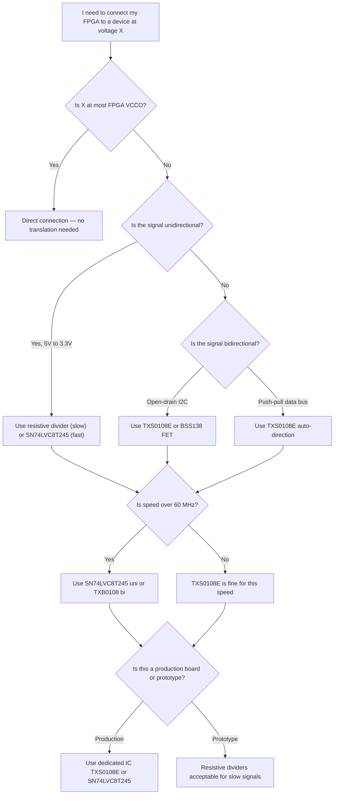

[← Home](../README.md) · [Board Design](README.md)

# IO Voltage Levels & Level Translation

Modern FPGAs operate at 1.2V–3.3V. Legacy computers, arcade hardware, and industrial systems run at 5V TTL/CMOS. Connecting these worlds requires understanding **IO bank voltage constraints**, **noise margins**, and **level translation techniques** — or you will destroy pins.

---

## The Voltage Compatibility Problem

### TTL/CMOS Logic Levels

| Standard | VCC | VOH (min) | VOL (max) | VIH (min) | VIL (max) |
|---|---|---|---|---|---|
| **5V TTL** | 5.0V | 2.4V | 0.4V | 2.0V | 0.8V |
| **5V CMOS** | 5.0V | 4.4V | 0.5V | 3.5V | 1.5V |
| **3.3V LVCMOS** | 3.3V | 2.4V | 0.4V | 2.0V | 0.8V |
| **2.5V LVCMOS** | 2.5V | 2.0V | 0.4V | 1.7V | 0.7V |
| **1.8V LVCMOS** | 1.8V | 1.35V | 0.45V | 1.17V | 0.63V |
| **1.2V LVCMOS** | 1.2V | 1.0V | 0.2V | 0.85V | 0.35V |

### The Three Failure Modes

1. **Over-voltage damage** — Driving 5V into a 3.3V FPGA pin exceeds the absolute maximum rating (typically VCCO + 0.5V). The ESD protection diode conducts, clamping to VCCO + 0.7V. Sustained current through this diode destroys the IO cell.

2. **Undervoltage logic error** — A 3.3V FPGA outputting 3.3V VOH into a 5V CMOS input expecting VIH ≥ 3.5V may be read as logic-low. This only affects CMOS inputs; TTL inputs (VIH ≥ 2.0V) are fine with 3.3V drive.

3. **Noise margin collapse** — A 1.8V FPGA driving a 3.3V receiver: VOH = 1.35V, but VIH(min) = 2.0V. The receiver never sees a valid high. This fails 100% of the time.

### The VCCO-per-Bank Rule

Every FPGA IO bank has a single VCCO supply rail. **All single-ended signals in that bank must operate at that voltage.** You cannot mix 3.3V and 1.8V signals in the same bank. This is the root constraint that drives level translator placement and board power supply design.

---

## Master Matrix: FPGA Family IO Voltage Support

| Vendor | Family | IO Type | VCCO Range | Max Single-Ended Rate | 5V Tolerant | Key Notes |
|---|---|---|---|---|---|---|
| **Xilinx** | Spartan-3/3E | Legacy | 3.3V | 200 MHz | **Yes** (some banks) | Last Xilinx FPGAs with 5V-tolerant inputs |
| Xilinx | **7-series** (Artix/Kintex/Virtex) | HR | 1.2–3.3V | 1.25 Gbps | **No** | 3.3V max. TMDS_33 on HR for HDMI |
| Xilinx | 7-series | HP | 1.0–1.8V | 1.6 Gbps | **No** | DDR3/DDR4 only. No 3.3V support |
| Xilinx | 7-series | HD | 1.2–3.3V | 800 Mbps | **No** | UltraScale+ only, no differential termination |
| Xilinx | UltraScale+ | HR | 1.2–3.3V | 1.25 Gbps | **No** | Similar to 7-series HR |
| Xilinx | UltraScale+ | HP | 1.0–1.8V | 1.6 Gbps | **No** | DDR4/LPDDR4 |
| Xilinx | Versal | XPIO | 1.0–1.8V | 2.0 Gbps | **No** | No 3.3V support at all |
| **Intel** | Cyclone V | 3.3V IO | 1.2–3.3V | 1.2 Gbps | **No** | 3.3V max. Schmitt trigger on all inputs |
| Intel | MAX 10 | 3.3V IO | 1.2–3.3V | 500 MHz | **No** | Integrated ADC, flash-based config |
| Intel | Arria 10 | Variable | 1.2–3.3V | 1.6 Gbps | **No** | Per-bank programmable |
| Intel | Stratix 10 | Variable | 1.0–3.3V | 1.6 Gbps | **No** | HyperFlex routing |
| **Lattice** | iCE40 LP/HX | sysIO | 1.2–3.3V | 250 MHz | **No** | Mostly 3.3V boards. UP5K has 1.2V core |
| Lattice | iCE40 UP5K | sysIO | 1.2–3.3V | 250 MHz | **No** | 1.2V core, 3.3V IO via internal regulator |
| Lattice | **ECP5** | sysIO | 1.2–3.3V | 800 Mbps | **No** | DDR3 capable at 1.5V |
| Lattice | CrossLink-NX | sysIO | 1.2–3.3V | 1.0 Gbps | **No** | FD-SOI, hard MIPI D-PHY |
| Lattice | CertusPro-NX | sysIO | 1.2–3.3V | 1.0 Gbps | **No** | PCIe Gen3, 10G SERDES |
| **Microchip** | PolarFire FPGA | Flash IO | 1.2–3.3V | 500 MHz | **No** | Flash-based, instant-on |
| Microchip | PolarFire SoC | Flash IO | 1.2–3.3V | 500 MHz | **No** | Same fabric as PolarFire FPGA |
| Microchip | SmartFusion2 | Flash IO | 1.2–3.3V | 350 MHz | **No** | Hard Cortex-M3, integrated ADC |
| Microchip | IGLOO2 | Flash IO | 1.2–3.3V | 350 MHz | **No** | Same fabric as SmartFusion2 |
| **Gowin** | LittleBee (GW1N) | IO | 1.2–3.3V | 250 MHz | **No** | Ultra-low cost, 55nm |
| Gowin | Arora (GW2A) | IO | 1.2–3.3V | 500 MHz | **No** | DDR3 capable |
| Gowin | Arora-V (GW5A) | IO | 1.2–3.3V | 500 MHz | **No** | 22nm, PCIe Gen2 |
| **Others** | Efinix Trion | IO | 1.2–3.3V | 250 MHz | **No** | 40nm, over-provisioned routing |
| Others | Efinix Titanium | IO | 1.2–3.3V | 1.0 Gbps | **No** | 16nm |
| Others | QuickLogic EOS S3 | eFPGA | 1.8V | 50 MHz | **No** | Cortex-M4F + 916 LUT4 eFPGA |

**Critical takeaway:** After the Spartan-3 generation (mid-2000s), **no major FPGA family has 5V-tolerant inputs.** If you need to interface with 5V TTL/CMOS, you must use external level translation.

---

## Level Translation Techniques

### Technique 1: Resistive Voltage Divider (Unidirectional, 5V → 3.3V)

For **5V outputs driving FPGA inputs only** (unidirectional), a simple resistor divider is the cheapest solution.

```
5V signal ─── R1 (1.8kΩ) ───┬── FPGA input (3.3V tolerant)
                            │
                        R2 (3.3kΩ)
                            │
                           GND
```
Vout = 5V × (R2 / (R1 + R2)) = 5V × (3.3k / 5.1k) ≈ 3.24V

| Parameter | Value | Why |
|---|---|---|
| R1 | 1.8kΩ | Limits current into FPGA clamp diode |
| R2 | 3.3kΩ | Pull-down, sets divider ratio |
| Vout | ~3.24V | Within 3.3V LVCMOS VIH (2.0V) and VCCO (3.3V) |
| Rise time | ~RC × ln(2) | With 10pF pin capacitance: ~23 ns |
| Max speed | ~10 MHz | Limited by RC time constant |

**When to use:** Slow signals (SPI, I2C, GPIO, reset), cost-sensitive designs, prototypes.
**When NOT to use:** Fast signals (>10 MHz), bidirectional buses, low-power designs (continuous current draw through resistors).

---

### Technique 2: FET-Based Bidirectional (BSS138)

The classic MOSFET level shifter uses a single N-channel FET and pull-up resistors on both sides.

```
3.3V side ─── Rpu1 (10kΩ) ───┬── Source (BSS138) ───┬── Rpu2 (10kΩ) ─── 5V side
                             │                      │
                         Gate = 3.3V              Drain
                             │                      │
                            GND                    GND
```

**How it works:**
- **Low-side (3.3V) drives low:** FET gate = 3.3V, source = 0V → VGS = 3.3V, FET turns on. Drain pulled to ~0.2V. Both sides see logic-low.
- **High-side (5V) drives low:** Drain = 0V, body diode conducts, source pulled to ~0.7V. VGS = 3.3V - 0.7V = 2.6V, FET turns on. Both sides see logic-low.
- **Either side drives high:** FET off, both sides pulled to their respective rails by pull-ups.

| Parameter | Typical |
|---|---|
| FET | BSS138 (SOT-23, $0.03) or 2N7002 |
| Rpu | 4.7kΩ–10kΩ per side |
| Max speed | ~1–2 MHz (limited by pull-up RC) |
| Power | Low — only draws current during low states |
| Bidirectional | Yes — open-drain only, no push-pull drive |

**When to use:** I2C, 1-Wire, slow bidirectional buses, cost-sensitive designs.
**When NOT to use:** Push-pull bidirectional (bus contention), high-speed (>2 MHz), long traces (pull-ups cause slow edges).

---

### Technique 3: Dedicated Level Shifter ICs

For robust, production-grade interfacing, use dedicated translator ICs. They offer ESD protection, known timing parameters, and eliminate the guesswork of discrete designs.

---

#### Master Comparison Table

| IC | Channels | Type | Direction | Vlow | Vhigh | Max Rate | tpd (typ) | Drive | Package | Price |
|---|---|---|---|---|---|---|---|---|---|---|
| **SN74LVC1T45** | 1 | Controlled | Uni | 1.65–3.6V | 1.65–5.5V | 420 Mbps | 2.5 ns | 32 mA | SOT-23, SC-70 | ~$0.15 |
| **SN74LVC2T45** | 2 | Controlled | Uni | 1.65–3.6V | 1.65–5.5V | 420 Mbps | 2.5 ns | 32 mA | VSSOP-8, DSBGA-8 | ~$0.25 |
| **SN74LVC4T245** | 4 | Controlled | Uni | 1.65–3.6V | 1.65–5.5V | 420 Mbps | 2.5 ns | 32 mA | TSSOP-16, VQFN-16 | ~$0.40 |
| **SN74LVC8T245** | 8 | Controlled | Uni | 1.65–3.6V | 1.65–5.5V | 420 Mbps | 2.5 ns | 32 mA | TSSOP-24, VQFN-24 | ~$0.70 |
| **SN74LVC16T245** | 16 | Controlled | Uni | 1.65–3.6V | 1.65–5.5V | 420 Mbps | 2.5 ns | 32 mA | TSSOP-48, VQFN-48 | ~$1.20 |
| **SN74LVC32T245** | 32 | Controlled | Uni | 1.65–3.6V | 1.65–5.5V | 420 Mbps | 2.5 ns | 32 mA | TFBGA-96 | ~$2.50 |
| **SN74AVC1T45** | 1 | Controlled | Uni | 0.8–3.6V | 0.8–3.6V | 380 Mbps | 2.0 ns | 12 mA | SOT-23, DSBGA-6 | ~$0.18 |
| **SN74AVC2T45** | 2 | Controlled | Uni | 0.8–3.6V | 0.8–3.6V | 380 Mbps | 2.0 ns | 12 mA | VSSOP-8, DSBGA-8 | ~$0.28 |
| **SN74AVC8T245** | 8 | Controlled | Uni | 0.8–3.6V | 0.8–3.6V | 380 Mbps | 2.0 ns | 12 mA | TSSOP-24, VQFN-24 | ~$0.80 |
| **TXB0101** | 1 | Auto | Bi | 1.2–3.6V | 1.65–5.5V | 100 Mbps | 5.0 ns | 2 mA | SOT-23, DSBGA-6 | ~$0.20 |
| **TXB0102** | 2 | Auto | Bi | 1.2–3.6V | 1.65–5.5V | 100 Mbps | 5.0 ns | 2 mA | VSSOP-8, DSBGA-8 | ~$0.30 |
| **TXB0104** | 4 | Auto | Bi | 1.2–3.6V | 1.65–5.5V | 100 Mbps | 5.0 ns | 2 mA | TSSOP-14, VQFN-14 | ~$0.40 |
| **TXB0108** | 8 | Auto | Bi | 1.2–3.6V | 1.65–5.5V | 100 Mbps | 5.0 ns | 2 mA | TSSOP-20, VQFN-20 | ~$0.60 |
| **TXB0108-Q1** | 8 | Auto | Bi | 1.2–3.6V | 1.65–5.5V | 100 Mbps | 5.0 ns | 2 mA | TSSOP-20 (AEC-Q100) | ~$0.90 |
| **TXS0101** | 1 | Auto | Bi | 1.2–3.6V | 1.65–5.5V | 60 Mbps | 6.0 ns | 4 mA | SOT-23, DSBGA-6 | ~$0.18 |
| **TXS0102** | 2 | Auto | Bi | 1.2–3.6V | 1.65–5.5V | 60 Mbps | 6.0 ns | 4 mA | VSSOP-8, DSBGA-8 | ~$0.28 |
| **TXS0104E** | 4 | Auto | Bi | 1.2–3.6V | 1.65–5.5V | 60 Mbps | 6.0 ns | 4 mA | TSSOP-14, VQFN-14 | ~$0.38 |
| **TXS0108E** | 8 | Auto | Bi | 1.2–3.6V | 1.65–5.5V | 60 Mbps | 6.0 ns | 4 mA | TSSOP-20, VQFN-20, TSSOP-20 | ~$0.50 |
| **NTS0101** | 1 | Auto | Bi | 1.0–3.6V | 1.6–5.5V | 33 Mbps | 8.0 ns | 8 mA | SOT-23, X2SON-6 | ~$0.15 |
| **NTS0102** | 2 | Auto | Bi | 1.0–3.6V | 1.6–5.5V | 33 Mbps | 8.0 ns | 8 mA | VSSOP-8, X2SON-8 | ~$0.25 |
| **NTS0104** | 4 | Auto | Bi | 1.0–3.6V | 1.6–5.5V | 33 Mbps | 8.0 ns | 8 mA | TSSOP-14, DHVQFN-14 | ~$0.35 |
| **PCA9306** | 2 | FET | Bi | 1.0–3.6V | 1.8–5.5V | 400 kHz | N/A | Open-drain | VSSOP-8, X2SON-8 | ~$0.30 |
| **PCA9306-Q1** | 2 | FET | Bi | 1.0–3.6V | 1.8–5.5V | 400 kHz | N/A | Open-drain | VSSOP-8 (AEC-Q100) | ~$0.50 |
| **LSF0101** | 1 | FET | Bi | 0.95–5.5V | 0.95–5.5V | 100 MHz | N/A | Open-drain | SOT-23, X2SON-6 | ~$0.20 |
| **LSF0102** | 2 | FET | Bi | 0.95–5.5V | 0.95–5.5V | 100 MHz | N/A | Open-drain | VSSOP-8, X2SON-8 | ~$0.30 |
| **LSF0108** | 8 | FET | Bi | 0.95–5.5V | 0.95–5.5V | 100 MHz | N/A | Open-drain | TSSOP-20, VQFN-20 | ~$0.55 |

**Key:** tpd = propagation delay (ns). Drive = output drive strength (mA). Bi = bidirectional. Uni = unidirectional.

---

#### Unidirectional vs. Bidirectional — Architecture and Trade-offs

This is the first decision you make when selecting a translator. It determines wiring complexity, speed, drive strength, and whether you need a direction control pin.

---

##### How Unidirectional Translators Work

Unidirectional translators have **dedicated input and output pins**. Data flows one way. The architecture is a simple buffer with level-shifted supplies:

```
Input A (1.8V) ──→ Level-shift buffer ──→ Output B (3.3V)
                        │
                   VCCA = 1.8V   VCCB = 3.3V
```

For devices with reversible direction (like SN74LVC8T245), a **DIR pin** selects A→B or B→A, but the flow is still unidirectional at any instant:

```
DIR = LOW:   B ──→ A  (3.3V side drives, 1.8V side receives)
DIR = HIGH:  A ──→ B  (1.8V side drives, 3.3V side receives)
```

**Key traits:**
- **Active push-pull output drivers** — Strong drive (12–32 mA), fast edges (1.5 ns rise time)
- **Deterministic timing** — Fixed tpd, no sensing delay
- **DIR pin required** (for reversible unidirectional devices) — One GPIO per 8-bit group
- **No bus contention** — Only one direction is active at a time

---

##### How Bidirectional Translators Work

Bidirectional translators use the **same physical pin** for both input and output. There are two architectures:

**Architecture A: Auto-Direction (TXS/TXB/NTS series)**

```
        ┌─────────────────────────┐
A (1.8V)├←───── One-shot edge    ├→┤ B (3.3V)
        │        accelerator      │
        │     + overdrive sense   │
        └─────────────────────────┘
```

The IC senses which side is driving by detecting when one side overdrives the other. It then briefly activates a one-shot accelerator to speed up the edge.

**Architecture B: FET Pass-Gate (PCA9306 / LSF / BSS138)**

```
A (1.8V) ───┬── FET (N-channel) ──┬── B (3.3V)
            │                     │
           Rpu1                 Rpu2
            │                     │
          VCCA                  VCCB
```

The FET conducts when either side is pulled low. High states are achieved through pull-up resistors on both sides. No active drive — just a switch.

**Key traits:**
- **No DIR pin** — Automatic direction sensing (TXS/TXB) or passive FET (PCA9306)
- **Weaker drive** — 2–8 mA (TXS/TXB) or open-drain only (FET)
- **Slower edges** — 4–6 ns rise time vs. 1.5 ns for unidirectional
- **Bus contention risk** — If both sides drive simultaneously, behavior is undefined

---

##### Unidirectional vs. Bidirectional Comparison

| Parameter | Unidirectional (LVC8T245) | Bidirectional Auto (TXS0108E) | Bidirectional FET (PCA9306) |
|---|---|---|---|
| **Direction control** | DIR pin | Auto-sense | Passive FET, no control |
| **Max data rate** | 420 Mbps | 60 Mbps | 400 kHz |
| **tpd (typ)** | 2.5 ns | 6.0 ns | N/A |
| **Output drive** | 32 mA push-pull | 4 mA one-shot | Open-drain only |
| **Rise time @ 15 pF** | 1.5 ns | 4.0 ns | Pull-up limited |
| **Bus contention** | Impossible (one direction only) | Undefined — may oscillate | Both sides can pull low simultaneously |
| **FPGA pins needed** | DIR + /OE per 8-bit group | None | None (or EN for isolation) |
| **Best for** | Address bus, SPI, fast parallel | Data bus, GPIO, I2C | I2C only |

---

##### Common Misconceptions

**"SPI needs a bidirectional translator"**

No. SPI has four separate lines:
- SCLK: Uni, master → slave
- MOSI: Uni, master → slave
- MISO: Uni, slave → master
- /CS: Uni, master → slave

Each line is unidirectional. You need **two unidirectional channels** (MOSI and MISO in opposite directions), not a bidirectional translator. Using a bidirectional translator for SPI wastes channels and introduces unnecessary contention risk.

**"Bidirectional means both sides drive at the same time"**

No. "Bidirectional" means the **same wire** can carry data in either direction, but **only one direction at a time**. A true simultaneous drive would be a bus contention fault. Think of a two-way street — traffic flows both ways, but not in the same lane simultaneously.

**"Unidirectional is always faster, so I should use it for everything"**

Not quite. For a data bus like the 68000's D0–D15, the direction changes with every read/write cycle. A unidirectional translator requires a DIR pin toggled by /RW. This adds FPGA logic but gives you 7× the speed and 8× the drive strength. For an 8 MHz 68000 bus, either works. For a 50 MHz AXI bus, unidirectional is mandatory.

---

##### Practical: 68000 Bus Breakdown

The Motorola 68000 has a classic mixed-direction bus:

| Signal | Width | Direction | Translator Type | Why |
|---|---|---|---|---|
| A1–A23 | 23 bits | CPU → peripheral | **Unidirectional** (LVC) | Address is always output |
| D0–D15 | 16 bits | Bidirectional | **Bidirectional** (TXS) or uni with DIR | Data flows both ways |
| /AS, /UDS, /LDS | 3 bits | CPU → peripheral | **Unidirectional** (LVC) | Control outputs |
| /RW | 1 bit | CPU → peripheral | **Unidirectional** (LVC) | Read/write indicator |
| /DTACK | 1 bit | Peripheral → CPU | **Unidirectional** (LVC) | Data acknowledge input |
| /INT | 1 bit | Peripheral → CPU | **Open-drain** | Interrupt, multiple sources |

**BOM for complete 68000 interface:**
- 3× SN74LVC8T245 (24 channels) for address + control outputs
- 1× SN74LVC16T245 (16 channels) for data bus, DIR tied to /RW
- 1× SN74LVC2T45 (2 channels) for /DTACK + spare
- 2× 4.7kΩ resistors for /INT open-drain

**Total: ~$5.00** for a complete, deterministic, tri-state-capable 68000 level translation interface.

---

##### When to Use Which

| Interface | Direction per Line | Recommended Translator |
|---|---|---|
| **UART (TX/RX)** | TX: A→B, RX: B→A | 2× unidirectional (LVC1T45) or 1× bidirectional (TXS0102) |
| **SPI** | All lines unidirectional | 2× unidirectional per line (LVC1T45) or 8-channel uni (LVC8T245) |
| **I2C (SDA, SCL)** | SDA: bidirectional, SCL: unidirectional | PCA9306 (SDA+SCL) or TXS0102 |
| **68000/ARM data bus** | Bidirectional per byte | SN74LVC16T245 with DIR=/RW, or TXS0108E for slow buses |
| **Address bus** | Unidirectional | SN74LVC8T245 or SN74LVC16T245 |
| **GPIO (direction changes)** | Bidirectional | TXS0101 per pin, or LVC1T45 + FPGA tri-state control |
| **PWM / clock** | Unidirectional | LVC1T45 — bidirectional adds jitter |
| **1-Wire** | Bidirectional | TXS0101 or FET-based (BSS138) |

**Rule:** Start by drawing the arrow direction on every signal in your interface. If any signal has arrows pointing both ways, it needs a bidirectional translator. If all arrows point one way, use unidirectional — it's faster, stronger, and safer.

---

#### Speed Deep Dive: What the Numbers Mean

**Propagation delay (tpd)** — Time from input crossing the logic threshold to output crossing the threshold on the other side. Lower is better. At 420 Mbps (SN74LVC8T245), the bit period is 2.38 ns. A 2.5 ns tpd means the translator adds **one full bit period of latency**.

**Rise/fall time (tr/tf)** — How fast the output slews from low to high. A slow rise time on a clock line causes the receiver to see the crossing at different times (jitter). SN74LVC8T245: tr ≈ 1.5 ns at 15 pF load. TXB0108: tr ≈ 5 ns at 15 pF load.

**Channel-to-channel skew (tskew)** — The maximum difference in propagation delay between any two channels in the same IC. Critical for parallel buses where all bits must arrive together.

| IC | tpd (typ) | tr/tf @ 15 pF | tskew (max) | Max Toggle Rate | Notes |
|---|---|---|---|---|---|
| SN74LVC8T245 | 2.5 ns | 1.5 ns / 1.5 ns | 1.0 ns | 200 MHz | Best-in-class speed, 32 mA drive |
| SN74AVC8T245 | 2.0 ns | 1.2 ns / 1.2 ns | 0.8 ns | 250 MHz | Slightly faster than LVC, less drive (12 mA) |
| TXB0108 | 5.0 ns | 5.0 ns / 5.0 ns | 2.0 ns | 100 MHz | One-shot accelerator, weak DC drive |
| TXS0108E | 6.0 ns | 4.0 ns / 4.0 ns | 2.5 ns | 60 MHz | Better for capacitive loads than TXB |
| NTS0104 | 8.0 ns | 6.0 ns / 6.0 ns | 3.0 ns | 33 Mbps | Lower voltage support (1.0V) |
| PCA9306 | N/A | N/A | N/A | 400 kHz | I2C only, open-drain |
| LSF0108 | N/A | ~3 ns / ~3 ns | 1.5 ns | 100 MHz | FET-based, pass-through for fast edges |

---

#### Speed vs Capacitive Load

All translator data sheets specify performance at a specific load capacitance (typically 15 pF or 30 pF). Real PCB traces and FPGA input pins add 5–15 pF per inch. A 6-inch trace + FPGA pin = ~20–30 pF total load.

| IC | Data Rate @ 15 pF | Data Rate @ 30 pF | Data Rate @ 50 pF | Behavior Under Heavy Load |
|---|---|---|---|---|
| SN74LVC8T245 | 420 Mbps | 380 Mbps | 300 Mbps | Linear degradation, strong drive maintains edges |
| TXB0108 | 100 Mbps | 70 Mbps | 40 Mbps | One-shot saturates; speed collapses |
| TXS0108E | 60 Mbps | 55 Mbps | 45 Mbps | One-shot handles capacitance better than TXB |
| NTS0104 | 33 Mbps | 28 Mbps | 20 Mbps | Graceful degradation, 8 mA helps |

**Rule of thumb:** For clock rates above 50 MHz or trace lengths >3 inches, use **SN74LVC8T245** (or LVC1T45/2T45 for fewer channels). Auto-direction translators (TXB/TXS) are fine for on-board traces <2 inches at <50 MHz.

---

#### Channel Count Selection Guide

| Channels | IC Options | Use Case |
|---|---|---|
| 1 | SN74LVC1T45, TXB0101, TXS0101, NTS0101 | Single UART line, reset, one GPIO |
| 2 | SN74LVC2T45, TXB0102, TXS0102, PCA9306 | I2C (SDA+SCL), SPI (MOSI+MISO), differential pair |
| 4 | SN74LVC4T245, TXB0104, TXS0104E | 4-bit data nibble, SPI + 2 control lines |
| 8 | SN74LVC8T245, TXB0108, TXS0108E | Full SPI bus, 8-bit data bus, address bus |
| 16 | SN74LVC16T245 | 16-bit data bus (68000, ISA), wide parallel interface |
| 32 | SN74LVC32T245 | 32-bit data bus (ARM AXI), wide memory interface |

**Package note:** For 8-bit translators, TSSOP-20 is hand-solderable with a fine-tip iron. VQFN-20 requires hot air or reflow. For prototypes, prefer TSSOP. For space-constrained production, use VQFN or DSBGA.

---

#### Package Types

| Package | Body Size | Pitch | Soldering | Best For |
|---|---|---|---|---|
| SOT-23 | 2.9×1.6 mm | 0.95 mm | Hand-solderable | 1-bit translators, prototypes |
| SC-70 | 2.0×1.25 mm | 0.65 mm | Fine-tip iron | Ultra-compact 1-bit |
| VSSOP-8 | 2.3×2.0 mm | 0.50 mm | Hot air / microscope | 2-bit in tiny space |
| TSSOP-20 | 6.5×4.4 mm | 0.65 mm | Hand-solderable (skilled) | 8-bit, most popular |
| TSSOP-48 | 12.5×6.1 mm | 0.50 mm | Hot air recommended | 16-bit |
| VQFN-20 | 4.5×3.5 mm | 0.50 mm | Hot air / reflow only | Space-constrained 8-bit |
| VQFN-48 | 7.0×7.0 mm | 0.50 mm | Reflow only | 16-bit, high density |
| DSBGA-8 | 1.5×1.0 mm | 0.50 mm | Reflow only, X-ray inspect | Ultra-compact 2-bit |
| TFBGA-96 | 9.0×13.0 mm | 0.80 mm | Reflow only | 32-bit wide bus |

---

#### TXS0108E vs TXB0108 vs SN74LVC8T245 — When to Use Which

| Scenario | Recommended IC | Why |
|---|---|---|
| I2C / SMBus / open-drain with pull-ups | **TXS0108E** | One-shot handles pull-up fight; TXB0108 oscillates |
| SPI @ 20–50 MHz, short traces | **TXB0108** | 100 Mbps rated, low power, no direction pin |
| SPI @ >50 MHz, long traces, or 3.3V→5V CMOS | **SN74LVC8T245** | 420 Mbps, 32 mA drive, deterministic timing |
| 16-bit 68000 bus @ 8–16 MHz | **SN74LVC16T245** | Enough speed, 16 channels in one IC, direction-controlled |
| 1.0V FPGA to 3.3V peripheral | **SN74AVC8T245** | Operates down to 0.8V on low side |
| Ultra-low power, slow GPIO | **NTS0102** | Lower quiescent current than TXS/TXB |
| 5V CMOS receiver (VIH = 3.5V) | **SN74LVC8T245** | 32 mA drive ensures VOH > 3.5V into capacitive load |
| Automotive / AEC-Q100 required | **TXB0108-Q1** or **PCA9306-Q1** | Qualified for −40° to +125°C |
| 100 MHz+ pass-through (no translation) | **LSF0108** | FET pass-gate, minimal insertion delay |

---

#### Quiescent Current & Power

| IC | Icc (quiescent) | Dynamic @ 10 MHz | Total @ 10 MHz (8 ch) | Best For |
|---|---|---|---|---|
| SN74LVC8T245 | 10 µA | ~1.6 mA | ~1.6 mA | Always-on systems, power not critical |
| TXB0108 | 5 µA | ~0.8 mA | ~0.8 mA | Battery-powered, low duty cycle |
| TXS0108E | 6 µA | ~1.2 mA | ~1.2 mA | Balanced power / capability |
| NTS0104 | 3 µA | ~0.5 mA | ~0.5 mA | Ultra-low power, wearable |
| PCA9306 | 15 µA | Negligible | ~15 µA | I2C, always-on bus |

**Note:** Auto-direction translators (TXB/TXS/NTS) draw near-zero quiescent current but consume dynamic power proportional to switching frequency and load capacitance. Direction-controlled translators (LVC/AVC) draw slightly more quiescent current but have lower dynamic power due to stronger, faster drivers.

---

#### ESD Protection

| IC | HBM ESD | CDM ESD | IEC 61000-4-2 | Notes |
|---|---|---|---|---|
| SN74LVC8T245 | 2 kV | 1 kV | No | Standard CMOS protection |
| TXS0108E | 2 kV | 1 kV | **±8 kV contact** | Built-in IEC ESD for direct connector attachment |
| TXB0108 | 2 kV | 1 kV | No | Standard protection |
| NTS0104 | 2 kV | 1 kV | No | Standard protection |

**TXS0108E's IEC ESD rating** is significant — it can be placed directly at a PCB connector without external TVS diodes for human-body discharge protection. This saves BOM cost and board area on consumer products.

---

#### Output Enable and Tri-State Control

Not all level translators can disconnect from the bus. This distinction — **tri-state capable vs. always-connected** — is critical for shared buses, FPGA boot sequences, and power-down safety.

**Tri-state (high-Z)** means the output pin enters a high-impedance state where it neither sources nor sinks current. It is electrically "disconnected." This is controlled by an **Output Enable (OE)** pin.

---

##### Tri-State Support by IC Family

| IC Family | Has OE | OE Polarity | When Disabled | Why It Matters |
|---|---|---|---|---|
| **SN74LVCxT245** (1/2/4/8/16/32-bit) | Yes | Active-low (/OE) | All outputs high-Z | Full bus isolation. FPGA can boot safely |
| **SN74AVCxT245** (1/2/8-bit) | Yes | Active-low (/OE) | All outputs high-Z | Same as LVC, lower voltage |
| **LSF010x** (1/2/8-bit) | Yes | Active-low (/OE) | Pass-gate opens, both sides isolated | Zero insertion delay when enabled |
| **PCA9306** | Yes | Active-low (EN) | FET off, both sides isolated | I2C bus isolation |
| **TXS010x** (1/2/4/8-bit) | **No** | N/A | Always connected | Cannot isolate. Outputs always drive |
| **TXB010x** (1/2/4/8-bit) | **No** | N/A | Always connected | Cannot isolate. One-shot always active |
| **NTS010x** (1/2/4-bit) | **No** | N/A | Always connected | Cannot isolate |

**Rule:** If your design has a shared bus, multiple bus masters, or requires FPGA boot-time isolation, you **must** use a translator with an OE pin (LVC/AVC/LSF series). Auto-direction translators (TXS/TXB/NTS) are permanently connected and will cause contention.

---

##### The FPGA Boot-Time Problem

During power-up, an FPGA's IO pins pass through three phases:

1. **POR (Power-On Reset)** — All IO are high-Z with weak pull-ups/pull-downs (vendor-specific)
2. **Configuration** — IO remain high-Z until the bitstream configures them
3. **User mode** — IO take on the programmed direction and drive strength

This takes **50–500 ms** depending on the FPGA and configuration source.

**The problem with always-connected translators:**

```
5V Microcontroller                TXS0108E (no OE)              FPGA (booting)
┌───────────────┐                ┌─────────────┐              ┌─────────────┐
│ MOSI = HIGH   │───────────────→│ ALWAYS ON   │─────────────→│ High-Z (weak│
│ (driving 5V)  │                │ drives 3.3V │              │ pull-up)    │
└───────────────┘                └─────────────┘              └─────────────┘
                                        │                            │
                                        └────────────────────────────┘
                                              Back-feeds 3.3V into
                                              unpowered FPGA VCCO!
```

The TXS0108E is always translating. If the 5V microcontroller drives high during FPGA boot, the translator drives 3.3V into the FPGA pin. If the FPGA's VCCO bank is not yet powered (or is at 0V), current flows through the FPGA's ESD protection diode into the VCCO rail, **back-powering the bank**. This can:
- Prevent the FPGA from entering POR correctly
- Damage the ESD diode over time
- Cause unpredictable boot behavior

**With SN74LVC8T245 + /OE tied to FPGA's DONE signal:**

```
FPGA DONE (low during boot) ───→ /OE (active-low)
                                    │
5V Microcontroller ──── SN74LVC8T245 ──── FPGA IO
```

When /OE is high (FPGA not done), all translator outputs are high-Z. The 5V side cannot affect the FPGA. When FPGA asserts DONE (low), /OE goes low and the translator activates.

---

##### Bus Contention on Bidirectional Buses

Auto-direction translators "sense" which side is driving by detecting an overdrive condition. But if **both sides drive simultaneously**, the result is undefined:

| Scenario | TXS0108E (no OE) | SN74LVC8T245 (with OE) |
|---|---|---|
| FPGA drives low + 5V device drives high | **Contention** — translator oscillates, draws >100 mA Icc | **Safe** — only one side enabled at a time via DIR |
| 5V device drives during FPGA config | **Back-feeds** into FPGA IO | **Safe** — /OE high, outputs high-Z |
| Multiple masters on shared bus | **Unsafe** — no way to release the bus | **Safe** — disable translator when not master |
| Power-down (FPGA off, 5V on) | **Back-powers FPGA** through IO | **Safe** — /OE high isolates FPGA |

**Real-world example — SPI bus with two masters:**

A 5V microcontroller and a 3.3V FPGA share an SPI bus to a flash chip. Only one master drives at a time.

```
        ┌──────────────┐
        │   SPI Flash  │
        │   (3.3V)     │
        └──────┬───────┘
               │
    ┌──────────┼──────────┐
    │          │          │
 /OE=H      MOSI       /OE=L
    │          │          │
 SN74LVC    (shared)   SN74LVC
 1T45                    1T45
    │                     │
 5V MCU                 FPGA
```

The microcontroller's translator has /OE tied to a "bus grant" signal. When the FPGA owns the bus, the microcontroller's translator is disabled (high-Z). When the MCU owns the bus, the FPGA's translator is disabled. This is **impossible with TXS0108E** because it has no OE pin and is always trying to drive both directions.

---

##### Power-Down Isolation

When a 3.3V FPGA is powered off (VCCO = 0V) but the 5V side remains active:

| Translator | Behavior | Risk |
|---|---|---|
| **TXS0108E** | Continues translating 5V → 3.3V into unpowered FPGA pin | Back-powers FPGA VCCO rail through ESD diode. Can prevent clean power-on reset |
| **SN74LVC8T245** (/OE = high or VCCB = 0V) | Outputs enter high-Z | No current path into FPGA. Safe power-down |
| **LSF0108** (/OE = high) | Pass-gate opens | Both sides isolated. No back-feeding |

Many LVC/AVC translators include a **power-down protection circuit** — if either VCCA or VCCB drops to 0V, all outputs automatically go to high-Z regardless of /OE state. Check the datasheet: "Ioff — partial power-down mode."

---

##### Tri-State vs. Always-Connected — Decision Guide

| Design Requirement | Use Tri-State (LVC/AVC/LSF) | Use Always-Connected (TXS/TXB) |
|---|---|---|
| Shared bus, multiple masters | **Required** | Unsafe — will cause contention |
| FPGA boot-time isolation | **Required** | Will back-feed during config |
| Power-down isolation | **Required** | Will back-power unpowered FPGA |
| Simple point-to-point, one direction at a time | OK, but overkill | **Fine** — no contention possible |
| I2C with multiple masters | Use PCA9306 (has EN) | TXS0108E works but no isolation |
| Lowest BOM cost, simple SPI/UART | LVC1T45 is cheap | TXS0101/TXB0101 also cheap |
| Need auto-direction (no DIR pin) | **Not possible** — tri-state requires DIR | **Required** — TXS/TXB only option |

**Key insight:** Auto-direction and tri-state are mutually exclusive in current translator families. You cannot have both. You must choose:
- **Auto-direction + no OE** (TXS/TXB/NTS) → Simple wiring, but always connected
- **Direction-controlled + OE** (LVC/AVC) → More FPGA pins (DIR + /OE), but full control
- **FET pass-gate + OE** (LSF/PCA9306) → Fastest, but requires pull-ups, weak drive

---

### Technique 4: Open-Drain with Pull-Up

If the 5V side is open-drain (or can be configured as such), pull the signal to the FPGA's VCCO (3.3V) instead of 5V.

```
5V device (open-drain output) ──┬── FPGA input (3.3V)
                                 │
                                Rpu (4.7kΩ) to 3.3V
```

The 5V device can only pull low. When released, the pull-up brings the line to 3.3V — safe for the FPGA. The 5V device sees a 3.3V high, which is above TTL VIH (2.0V) so it's read correctly.

**When to use:** I2C, interrupt lines, reset signals, any signal where the 5V device can be open-drain.
**When NOT to use:** Push-pull 5V outputs (they actively drive high to 5V).

---

## Per-Vendor Deep Dive

### Xilinx — HR vs HP vs HD vs XPIO

Xilinx has the most differentiated IO bank architecture:

| Bank Type | VCCO | Max V | Key Trait |
|---|---|---|---|
| **HR (High Range)** | 1.2–3.3V | 3.3V | General purpose. Supports LVCMOS33, LVTTL, TMDS_33 |
| **HP (High Performance)** | 1.0–1.8V | 1.8V | DDR3/DDR4 memory. Faster slew rates, no 3.3V |
| **HD (High Density)** | 1.2–3.3V | 3.3V | UltraScale+ only. Like HR but no internal differential termination |
| **XPIO (Versal)** | 1.0–1.8V | 1.8V | No 3.3V at all. Newest architecture |

**The HR bank is your friend for legacy interfacing.** Only HR banks can run at 3.3V. If you need to talk to 5V TTL, start with an HR bank at 3.3V, then add external level translation from 5V → 3.3V. You cannot use HP or XPIO banks for this at all.

**Special case: TMDS_33** — 7-series HR banks support TMDS at 3.3V for HDMI. This uses the bank's 3.3V capability with external termination, not 5V tolerance.

---

### Intel / Altera — Cyclone V and MAX 10

Intel FPGAs are simpler: most families support 1.2V–3.3V per bank with no HR/HP split. However:

- **Cyclone V:** 3.3V is the maximum. All IO banks can run at 3.3V, 2.5V, 1.8V, 1.5V, or 1.2V.
- **MAX 10:** Same 3.3V max, but integrated ADC means some pins are dual-purpose (IO or analog input).
- **Arria 10 / Stratix 10:** Per-bank programmable VCCIO. No special bank types needed.

**Intel advantage:** No HR/HP split means any bank can run at 3.3V. You don't have to sacrifice high-speed banks for legacy IO. But you still need external level translation for 5V.

---

### Lattice — sysIO and MIPI D-PHY

| Family | IO | VCCO | Special |
|---|---|---|---|
| iCE40 LP/HX | sysIO | 1.2–3.3V | Mostly used at 3.3V |
| iCE40 UP5K | sysIO + SPRAM | 1.2–3.3V | 1.2V core, internal regulator for 3.3V IO |
| ECP5 | sysIO | 1.2–3.3V | DDR3 capable at 1.5V |
| CrossLink-NX | sysIO + hard MIPI | 1.2–3.3V | Hard MIPI D-PHY at 1.2V |

**Lattice advantage for retro:** ECP5 and iCE40 boards (ULX3S, iCEBreaker) are cheap and 3.3V-native. Adding 5V level translation to a $15 Tang Nano or $110 ULX3S is trivial and cost-effective for retro projects.

---

### Microchip — Flash-Based IO

| Family | IO | VCCO | Special |
|---|---|---|---|
| PolarFire FPGA | Flash IO | 1.2–3.3V | Instant-on at configured voltage |
| PolarFire SoC | Flash IO | 1.2–3.3V | Same fabric, RISC-V cores |
| SmartFusion2 | Flash IO | 1.2–3.3V | Hard Cortex-M3, ADC |

**Microchip advantage:** Flash-based configuration means IO are live at power-on at their configured voltage. No 50–500 ms configuration delay before IO become active. For systems that need instant IO assertion (like a bus arbiter in a retro computer), this is a unique advantage.

---

### Gowin — Ultra-Low-Cost IO

| Family | IO | VCCO | Notes |
|---|---|---|---|
| LittleBee (GW1N) | IO | 1.2–3.3V | 55nm, low cost |
| Arora (GW2A) | IO | 1.2–3.3V | DDR3 capable |
| Arora-V (GW5A) | IO | 1.2–3.3V | 22nm, PCIe Gen2 |

**Gowin limitation:** LittleBee has fewer IO drive strength options than Xilinx/Intel. At 3.3V, output current may be insufficient for heavily loaded 5V TTL buses. Check the datasheet: GW1N-9 drive strength is typically 4–8 mA per pin. A 5V TTL input with a 4.7kΩ pull-up needs minimal current, but a bus with multiple TTL loads may need buffering.

---

## Practical: FPGA → 5V Legacy System

### Example: DE10-Nano (Cyclone V, 3.3V) to Amiga 500 Bus (5V TTL)

The Amiga 500 uses 5V TTL/CMOS on its expansion bus (68000 bus). The DE10-Nano's Cyclone V IO is 3.3V max. Here's the approach:

```
Amiga 500 Bus (5V)                            DE10-Nano (3.3V)
┌─────────────────┐                          ┌─────────────────┐
│ Address/Data    │── TXS0108E × 2 ─────────→│ FPGA IO Bank    │
│ (bidirectional) │   (16-bit bus)           │ (3.3V LVCMOS)   │
├─────────────────┤                          ├─────────────────┤
│ Control signals │── SN74LVC8T245 × 1 ─────→│ FPGA IO Bank    │
│ (unidirectional)│   (8 control lines)      │ (3.3V LVCMOS)   │
├─────────────────┤                          ├─────────────────┤
│ /INT (open-drain│── Open-drain + 3.3V pu ─→│ FPGA IO Bank    │
│  from Amiga)    │                          │ (3.3V LVCMOS)   │
└─────────────────┘                          └─────────────────┘
```

**BOM for 16-bit data + 8 control + 2 interrupts:**
- 2× TXS0108E ($1.00 total) for bidirectional data/address
- 1× SN74LVC8T245 ($0.70) for unidirectional control
- 2× 4.7kΩ resistors ($0.01) for open-drain interrupts
- **Total: ~$1.71** for complete 5V ↔ 3.3V translation

### Signal Direction Planning

| Signal Group | Direction | Translator | Why |
|---|---|---|---|
| Address bus | Amiga → FPGA | SN74LVC8T245 (A→B) | Unidirectional, fast |
| Data bus | Bidirectional | TXS0108E | Auto-direction, 8-bit |
| /AS, /UDS, /LDS | Amiga → FPGA | SN74LVC8T245 | Unidirectional control |
| /RW | Amiga → FPGA | SN74LVC8T245 | Unidirectional |
| /DTACK | FPGA → Amiga | SN74LVC8T245 (B→A) | FPGA drives 3.3V, Amiga reads TTL OK |
| /INT | FPGA → Amiga | Open-drain + pull-up | Amiga has internal 5V pull-up |

---

## Multi-VCCO Power Supply Design

A typical FPGA board needs multiple IO bank voltages:

```
Input: 5V barrel jack or USB-C PD
    │
    ├── Buck 1: 5V → 3.3V  @ 2A  (general IO, flash, regulators)
    │   │
    │   ├── VCCO Bank 0 (3.3V HR) ──→ Legacy IO
    │   ├── VCCO Bank 1 (3.3V HR) ──→ LEDs, buttons, UART
    │   └── Flash memory (3.3V QSPI)
    │
    ├── Buck 2: 5V → 1.8V  @ 1A  (HP banks, DDR3)
    │   │
    │   ├── VCCO Bank 2 (1.8V HP) ──→ DDR3 interface
    │   └── VCCO Bank 3 (1.8V HP) ──→ High-speed differential
    │
    ├── LDO 1: 3.3V → 1.0V @ 100mA (quiet analog)
    │   └── ADC reference, PLL analog supply
    │
    └── Buck 3: 5V → 1.0V @ 5A  (FPGA core VCCINT)
        └── FPGA internal logic
```

### Sequencing Requirements

| Vendor | Requirement |
|---|---|
| **Xilinx 7-series** | VCCINT (1.0V) before VCCAux (1.8V) before VCCO (any). Use PMIC or discrete sequencing |
| **Intel Cyclone V** | VCCINT (1.1V) before VCCIO (3.3V). 3.3V can ramp with VCCINT |
| **Lattice ECP5** | VCC (1.1V core) before VCCIO (3.3V). No strict sequence for different VCCIO rails |
| **Microchip PolarFire** | VDD (1.0V core) before VDDIO (1.2–3.3V). Flash-based: IO live at power-on |

**Practical rule:** Power the FPGA core first, then aux/PLL, then IO banks last. This prevents IO pins from driving into an unpowered device.

---

## Decision Flowchart



---

## Best Practices

1. **Always check the datasheet absolute maximum ratings** — not just VCCO. The input pin absolute max is typically VCCO + 0.5V or 4.0V. 5V exceeds this.
2. **Use dedicated level shifter ICs for production** — resistive dividers and FET shifters are fine for prototypes, but dedicated ICs have better signal integrity, ESD protection, and documented timing.
3. **Group legacy signals into one or two 3.3V banks** — consolidate all 5V→3.3V translated signals into dedicated HR/3.3V banks. Don't scatter them across banks with different VCCO requirements.
4. **Check output drive strength** — A 3.3V FPGA output driving a 5V TTL input is fine (VOH = 2.4V > VIH = 2.0V). But a 1.8V FPGA output driving a 3.3V input may fail (VOH = 1.35V < VIH = 2.0V).
5. **Don't forget the return path** — Level translator ICs need solid ground reference between the two voltage domains. Use a continuous ground plane, not a thin trace.

## Pitfalls

1. **"I'll just use a series resistor"** — A 1kΩ series resistor with a 5V input and 3.3V VCCO: current = (5V - 3.3V - 0.7V) / 1kΩ = 0.6 mA. This flows through the ESD diode. At 0.6 mA continuous, the diode may survive, but at >2 mA it degrades. For a full 16-bit bus switching at 1 MHz, that's 16 pins × heat. Use proper level translation.
2. **"The datasheet says 3.6V absolute max, so 5V is fine for a short time"** — No. Absolute max is the survival rating, not the operating rating. Operating above VCCO + 0.5V causes cumulative oxide damage.
3. **Mixing 3.3V and 1.8V signals in the same bank** — You can't. One bank = one VCCO. This is the #1 reason for pinout revisions.
4. **Using TXB0108 for I2C** — TXB0108 has weak 2 mA drivers that fight against I2C pull-ups. The auto-direction detection oscillates. Use TXS0108E instead.
5. **Forgetting that 5V CMOS ≠ 5V TTL** — TTL VIH is 2.0V (easy). CMOS VIH is 3.5V (hard). A 3.3V FPGA driving a 5V CMOS input may not reach valid high. Check the receiver's logic family.

---

## References

### FPGA Vendor Documentation

| Document | Source | What It Covers |
|---|---|---|
| **Xilinx UG471** — 7-Series SelectIO | AMD/Xilinx | IO bank types (HR/HP/HD), VCCO rules, TMDS_33, differential termination |
| **Xilinx UG571** — UltraScale SelectIO | AMD/Xilinx | UltraScale/UltraScale+ IO architecture, bank voltages, migration from 7-series |
| **Xilinx XAPP459** — Eliminating I/O Coupling Effects | AMD/Xilinx | Receiving large-swing signals, positive/negative overshoot protection |
| **Intel AN 447** — Interfacing Intel FPGA Devices with 3.3/3.0/2.5 V LVTTL/LVCMOS | Intel/Altera | MAX 10, Cyclone IV/V/10 LP interfacing guidelines, VCCIO compatibility, clamp diode usage |
| **Intel AN-490** — MAX Series Voltage Level Shifters | Intel/Altera | MAX II/V/10 as voltage translators, interfacing 1.5V–3.3V systems, eliminating external translators |
| **Intel UG-M10GPIO** — MAX 10 General Purpose I/O User Guide | Intel/Altera | MAX 10 IO architecture, Schmitt trigger, clamp diodes, ADC dual-purpose pins |
| **Intel CV-5V2** — Cyclone V Device Handbook | Intel/Altera | Cyclone V IO standards, VCCIO range, transceiver voltage requirements |
| **Lattice TN1262** — ECP5 sysIO Usage Guide | Lattice | sysIO voltage support, drive strength settings, differential pairs, DDR3 interface |
| **Lattice TN1281** — iCE40 sysIO Usage Guide | Lattice | iCE40 LP/HX/UP sysIO, 3.3V operation, internal regulator for UP5K |
| **Lattice TN1293** — CrossLink-NX sysIO and D-PHY | Lattice | CrossLink-NX IO, hard MIPI D-PHY at 1.2V, FD-SOI advantages |
| **Microchip MPF300-DS** — PolarFire FPGA Datasheet | Microchip | Flash IO specifications, VDDIO range, instant-on IO behavior |
| **Microchip SF2-DS** — SmartFusion2/IGLOO2 Datasheet | Microchip | Flash-based IO, Cortex-M3 hard core, mixed-signal IO with ADC |

### Texas Instruments — Level Translation Application Notes

| Document | What It Covers |
|---|---|
| **TI SCEA129** — [Enabling Power-Efficient FPGA Designs With Level Translation](https://www.ti.com/lit/pdf/scea129) | Using TI level shifters to reduce FPGA IO power, selecting TXS vs TXB vs LSF for FPGA interfaces |
| **TI SNLA471** — [Level Shift No More: Support Low Voltage I/O Signals into an FPGA](https://www.ti.com/lit/pdf/snla471) | Using LVDS + level shifter to avoid dedicated translation, 1.8V signal into 3.3V FPGA bank |
| **TI SCEA088** — Voltage Translation Between 3.3-V, 2.5-V, 1.8-V, and 1.5-V Logic Standards | Comprehensive guide to translating between all common logic families, noise margin analysis |
| **TI SLVA675** — [Voltage-Level Translation With the LSF Family](https://www.ti.com/lit/pdf/slva675) | Theory of operation for LSF pass-gate translators, pull-up resistor selection, speed vs load |
| **TI SCEA144** — [Top Questions About Auto Bi-Direction LSF Family Translators](https://www.ti.com/lit/pdf/scea144) | FAQ on LSF010x devices, common pitfalls, pull-up sizing, when to use vs TXS/TXB |
| **TI SCYB018H** — [Voltage-Level Translation Guide (Brochure)](https://www.ti.com/lit/ml/scyb018h/scyb018h.pdf) | TI portfolio overview: TXS, TXB, LSF, NTS families; selection flowchart; application matrix |
| **TI TXS0108E Datasheet** — [SCES642J](https://www.ti.com/lit/ds/symlink/txs0108e.pdf) | Auto-direction translator: one-shot timing, IEC ESD spec, max data rate vs capacitive load |
| **TI TXB0108 Datasheet** — [SCES650J](https://www.ti.com/lit/ds/symlink/txb0108.pdf) | Auto-direction translator: one-shot vs DC drive, I2C incompatibility note, power dissipation |
| **TI SN74LVC8T245 Datasheet** — [SCES646J](https://www.ti.com/lit/ds/symlink/sn74lvc8t245.pdf) | Direction-controlled translator: DIR/OE timing, Ioff power-down protection, 32 mA drive spec |
| **TI LSF0108 Datasheet** — [SCPS260](https://www.ti.com/lit/ds/symlink/lsf0108.pdf) | FET pass-gate translator: pass-through delay, pull-up requirements, enable/disable timing |

### NXP — Bidirectional Voltage Translators

| Document | What It Covers |
|---|---|
| **NXP AN10145** — [Bi-directional Low Voltage Translators](https://www.nxp.com/docs/en/application-note/AN10145.pdf) | GTL-TVC family theory of operation, reference transistor biasing, bidirectional clamp behavior |
| **NXP AN11127** — Bidirectional Voltage Level Translators NVT20xx and PCA9306 | NVT2008/PCA9306 comparison, I2C bus buffering, offset voltage requirements |
| **NXP VOLTLEVTRANSSG** — [Voltage Translators Selector Guide](https://www.nxp.com/docs/en/product-selector-guide/VOLTLEVTRANSSG.pdf) | Complete NXP portfolio: GTL2010, PCA9306, NVT2008, P3A1604; uni vs bi, speed, voltage ranges |

### Other Manufacturer Resources

| Document | What It Covers |
|---|---|
| **Nexperia BSS138 Datasheet** | FET-based bidirectional shifter: VGS(th), RDS(on), body diode behavior, 2N7002 comparison |
| **ON Semi NTS0104 Datasheet** | Nexperia/ON Semi auto-direction translator: lower voltage support (1.0V), quiescent current spec |
| **Diodes Inc. PI4ULS5V202 Datasheet** | Alternative to TXS0102: auto-direction, 2-channel, similar pinout, cost comparison |
| **Renesis (IDT) QS3VH16211 Datasheet** | 20-bit bus switch with level translation: wide bus applications, DDR memory interfacing |

### Cross-Reference Articles in This Knowledge Base

| Article | Topic |
|---|---|
| [IO Standards & SERDES](02_architecture/infrastructure/io_standards.md) | Architecture-level IO standards: LVCMOS, LVDS, SSTL, MGTs, bank planning |
| [Configuration Interfaces](configuration_interfaces.md) | Flash selection, config pin strapping, power-on sequencing for IO banks |
| [High-Speed Signals](high_speed_signals.md) | Signal integrity: impedance control, length matching, crosstalk, via effects |
