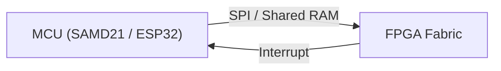
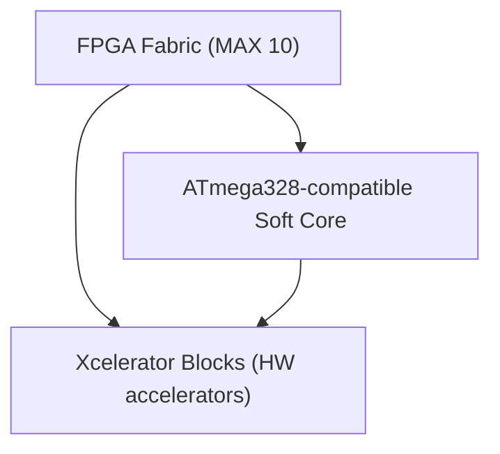
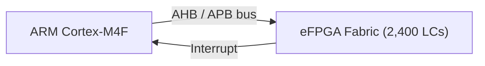
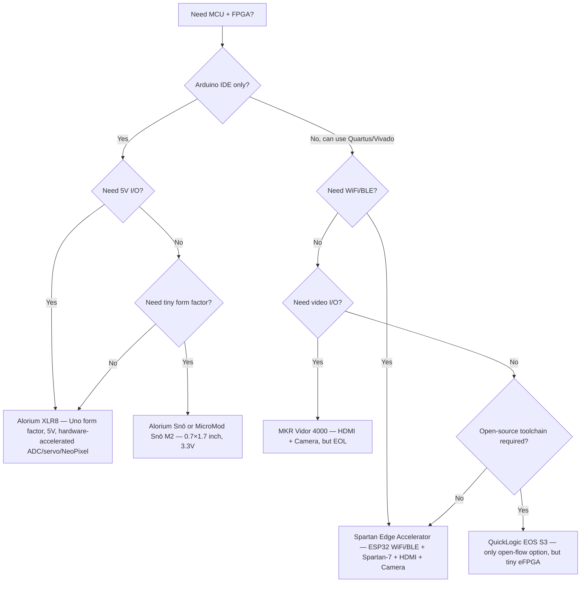

[← Board Design](README.md) · [← Project Home](../README.md)

# Arduino + FPGA Boards — MCU/FPGA Hybrids for the Arduino Ecosystem

Arduino+FPGA boards combine a microcontroller (or soft MCU) with FPGA fabric on a single board, programmable through the Arduino IDE. They occupy a niche between pure MCU development and standalone FPGA design — offering hardware acceleration for I/O-intensive, timing-critical, or parallel tasks without leaving the Arduino toolchain.

---

## Why Arduino + FPGA?

Traditional Arduino boards excel at sequential control but struggle with tasks requiring deterministic timing, parallel processing, or high-speed signal handling. FPGA fabric solves these problems at the hardware level:

| Problem | MCU-Only | MCU + FPGA |
|---|---|---|
| Driving dozens of servos simultaneously | Timer jitter, sequential updates | Parallel PWM generation, zero jitter |
| Quadrature encoder decoding at high RPM | Missed counts during interrupts | Hardware counter, no CPU load |
| NeoPixel/WS2812 bit-banging | Blocks CPU for ms per strip | Hardware SPI, CPU-free |
| High-speed ADC sampling | Limited by `analogRead()` overhead | FPGA samples at 1 MSPS+, DMA to SRAM |
| Real-time DSP (audio filtering, FFT) | Too slow for real-time | Parallel datapath, pipeline throughput |
| Custom protocols (1-Wire, Manchester) | Bit-bang with tight timing constraints | FSM in fabric, deterministic |

The FPGA is not a replacement for the MCU — it is a **co-processor** or **I/O offload engine** that handles tasks the MCU cannot do well.

---

## Board Comparison

| Board | FPGA | Logic Elements | FPGA RAM | MCU / Host | Form Factor | Price | Open Toolchain |
|---|---|---|---|---|---|---|---|
| **Arduino MKR Vidor 4000** | Intel Cyclone 10CL016 | 15,408 LEs | 504 Kb M9K + 8 MB SRAM | SAMD21 Cortex-M0+ | MKR | ~$60 | No (Quartus Lite) |
| **Alorium XLR8** | Intel MAX 10 10M16SAU | 16K LEs | 576 Kb M9K | ATmega328 soft core in FPGA | Arduino Uno | ~$75 | No (Quartus Lite) |
| **Alorium Snō** | Intel MAX 10 10M16SAU | 16K LEs | 576 Kb M9K | ATmega328 soft core in FPGA | SoM (0.7" × 1.7") | ~$49 | No (Quartus Lite) |
| **Spartan Edge Accelerator** | Xilinx Spartan-7 XC7S15 | 12.8K LCs | 360 Kb BRAM + 8 MB SDRAM | ESP32 (WiFi/BLE) | Arduino Uno shield | ~$40 | No (Vivado Lab) |
| **SparkFun QuickLogic Thing Plus** | QuickLogic EOS S3 eFPGA | 2,400 LCs | 64 Kb | ARM Cortex-M4F @ 80 MHz | Feather | ~$30 | Yes (SymbiFlow) |

> [!NOTE]
> Logic cells/elements are not directly comparable across vendors. Intel LEs, Xilinx LCs, and QuickLogic LCs have different 4-LUT/FF configurations. The EOS S3 eFPGA is significantly smaller than the others — suitable for glue logic and small accelerators only.

---

## Three Integration Architectures

Arduino+FPGA boards implement one of three architectural patterns for MCU↔FPGA communication:

### Architecture 1: MCU + FPGA as Co-Processors (Side-by-Side)



The MCU and FPGA are **separate chips** on the same board. The MCU runs Arduino sketches; the FPGA acts as a hardware accelerator. Communication happens over SPI, shared memory, or dedicated parallel interfaces.

**Used by:** MKR Vidor 4000, Spartan Edge Accelerator

| Advantage | Limitation |
|---|---|
| Full MCU available for Arduino code | MCU↔FPGA bandwidth limited by SPI speed |
| Independent clock domains | Latency for FPGA↔MCU handshaking |
| FPGA can be reprogrammed independently | Two toolchains (Arduino IDE + Quartus/Vivado) |

### Architecture 2: Soft MCU Inside the FPGA (Single-Chip)



The ATmega328 microcontroller is implemented as a **soft core** inside the FPGA fabric. Hardware accelerators ("Xcelerator Blocks") share the same address space and communicate with the soft MCU through memory-mapped registers.

**Used by:** Alorium XLR8, Alorium Snō

| Advantage | Limitation |
|---|---|
| Single chip, no inter-chip communication | Soft MCU consumes FPGA resources (~3K LEs) |
| Memory-mapped accelerator access — zero latency | ATmega328 compatibility limits performance ceiling |
| FPGA and MCU share the same clock domain | MAX 10 configuration flash wear (~10K cycles) |

### Architecture 3: eFPGA Inside the MCU SoC



The FPGA fabric is embedded **inside the MCU SoC die** — the ARM core configures the eFPGA and communicates via the internal bus. This is the tightest integration possible.

**Used by:** SparkFun QuickLogic Thing Plus (EOS S3)

| Advantage | Limitation |
|---|---|
| Tightest MCU↔FPGA integration (bus-level) | Tiny eFPGA (2,400 LCs) — very limited fabric |
| Lowest power (single die) | Limited to glue logic, small accelerators, protocol offload |
| Fully open-source toolchain (SymbiFlow) | Ecosystem and documentation still maturing |

---

## Board Deep Dives

### Arduino MKR Vidor 4000

The first (and only) official Arduino board with an FPGA. Now **end-of-life**, but still available from distributors.

| Component | Specification |
|---|---|
| **FPGA** | Intel Cyclone 10CL016 — 15,408 LEs, 504 Kb embedded RAM, 56 hardware multipliers (18×18) |
| **MCU** | Microchip SAMD21 Cortex-M0+ @ 48 MHz |
| **FPGA Memory** | 8 MB SDRAM (64 Mb, 4M × 16-bit), 2 MB QSPI flash for bitstream |
| **Wireless** | u-blox NINA-W102 (WiFi + BLE) |
| **Crypto** | Microchip ATECC508A |
| **Connectors** | Mini HDMI output, MIPI CSI camera input |
| **GPIO** | Up to 25 configurable pins (shared between MCU and FPGA) |
| **Programming** | Arduino IDE (MCU), Quartus Prime Lite (FPGA bitstream) |

```
MKR Vidor 4000 Architecture
┌─────────────────────────────────────┐
│ SAMD21 (Cortex-M0+)                │
│ ├─ Arduino sketches                │
│ ├─ VidorGraphics library           │
│ └─ SPI to FPGA ←→ shared SRAM      │
│                                     │
│ Cyclone 10CL016                     │
│ ├─ HDMI TX (TMDS encoder)           │
│ ├─ Camera RX (MIPI CSI-2)           │
│ ├─ 8 MB SDRAM controller            │
│ └─ Custom logic (Quartus bitstream) │
└─────────────────────────────────────┘
```

**FPGA programming model:** The SAMD21 loads a pre-compiled bitstream into the Cyclone 10 via SPI at boot. Custom FPGA images are built in Quartus and exported as `.ttf` (tabbed text format) files that the Arduino sketch loads into the FPGA.

**Key use cases:** HDMI video output, camera capture and processing, high-speed digital signal processing, custom peripheral implementations.

> [!WARNING]
> The MKR Vidor 4000 is **end-of-life**. New designs should consider the Spartan Edge Accelerator or Alorium boards as alternatives.

---

### Alorium XLR8

A drop-in Arduino Uno replacement where the ATmega328 is a **soft core inside an Intel MAX 10 FPGA**, alongside hardware accelerators called Xcelerator Blocks (XBs).

| Component | Specification |
|---|---|
| **FPGA** | Intel MAX 10 10M16SAU — 16K LEs, 576 Kb M9K, ADC, 16 Kb flash |
| **Soft MCU** | ATmega328-compatible instruction set (in FPGA fabric) |
| **Digital I/O** | 14 pins, 5V tolerant |
| **Analog** | 6 inputs, 12-bit, 254 kSPS |
| **Memory** | 32 KB flash (program), 2 KB SRAM (data) |
| **Programming** | Arduino IDE via USB (soft MCU + FPGA image) |
| **Price** | ~$75 |

**Xcelerator Blocks (pre-installed):**

| XB | Function | Benefit over ATmega328 |
|---|---|---|
| **Enhanced ADC** | 12-bit, 1 MHz sampling | 4× resolution, 50× speed vs `analogRead()` |
| **Floating Point** | IEEE 754 single-precision FPU | Software float takes ~800 cycles; hardware takes 5 cycles |
| **NeoPixel Control** | Hardware WS2812 driver | Zero CPU overhead, no timing jitter |
| **Servo Control** | Hardware PWM with <1 μs resolution | Eliminates timer contention and jitter |
| **Quadrature** | Hardware encoder decoder | No missed counts, handles MHz-rate encoders |

**OpenXLR8:** Users can create custom Xcelerator Blocks and reprogram the FPGA image through the Arduino IDE. This requires Quartus Prime Lite for synthesis but the flow is integrated into the Alorium board manager.

---

### Alorium Snō

A compact System-on-Module (SoM) using the same MAX 10 + soft ATmega328 architecture as the XLR8, but in a tiny 0.7" × 1.7" footprint. Also available as the **SparkFun MicroMod Alorium Snō M2** for the MicroMod M.2 ecosystem.

| Component | Specification |
|---|---|
| **FPGA** | Intel MAX 10 10M16SAU — 16K LEs, 576 Kb M9K |
| **Soft MCU** | ATmega328-compatible instruction set |
| **Digital I/O** | 32 dedicated + 6 shared with analog |
| **Analog** | 6 inputs, 12-bit, 254 kSPS |
| **Voltage** | 3.3V I/O (not 5V tolerant, unlike XLR8) |
| **Form Factor** | 0.7" × 1.7" SoM / MicroMod M.2 |
| **Price** | ~$49 (SoM), ~$40 (MicroMod variant) |

**Use cases:** Embedded product integration where an FPGA-accelerated MCU is needed in a small footprint — drone flight controllers, robotics, industrial sensor processing.

---

### Spartan Edge Accelerator Board

A Xilinx Spartan-7 FPGA in **Arduino Uno shield form factor** with an ESP32 companion. Works as either an Arduino shield or a standalone FPGA board.

| Component | Specification |
|---|---|
| **FPGA** | Xilinx Spartan-7 XC7S15 — 12.8K LCs, 360 Kb BRAM |
| **MCU** | Espressif ESP32 (WiFi/BLE, dual-core Xtensa LX6 @ 240 MHz) |
| **FPGA Memory** | 8 MB SDRAM |
| **Video** | Mini HDMI output |
| **Camera** | MIPI CSI connector |
| **Sensors** | 6-axis IMU (accelerometer + gyro) |
| **Audio** | 3.5 mm audio jack (sigma-delta DAC) |
| **Programming** | ESP32 loads bitstream via SPI; Vivado Lab Edition for FPGA |
| **Price** | ~$40 |

```
Spartan Edge Accelerator Architecture
┌───────────────────────────────────┐
│ ESP32 (WiFi/BLE + system ctrl)    │
│ ├─ Loads FPGA bitstream via SPI   │
│ ├─ Arduino-compatible programming │
│ └─ Network connectivity           │
│                                   │
│ Spartan-7 XC7S15                  │
│ ├─ HDMI TX output                 │
│ ├─ CSI camera input               │
│ ├─ 8 MB SDRAM controller          │
│ └─ Accelerator logic              │
│                                   │
│ Arduino Uno Headers (5V I/O)      │
│ ├─ Can mount on Uno as shield     │
│ └─ Or run standalone              │
└───────────────────────────────────┘
```

**Key differentiator:** The only Arduino-form-factor FPGA board with **WiFi and Bluetooth** via the ESP32, plus HDMI output and camera input — making it suitable for IoT edge applications with real-time video processing.

**Operating modes:**
1. **Shield mode** — Mount on an Arduino Uno; Uno controls the FPGA via SPI
2. **Standalone mode** — ESP32 acts as the host processor; FPGA is programmed by ESP32 at boot

---

### SparkFun QuickLogic Thing Plus (EOS S3)

The only Arduino-ecosystem FPGA board with a **fully open-source toolchain**. The EOS S3 integrates an ARM Cortex-M4F with a small embedded FPGA (eFPGA) on a single die.

| Component | Specification |
|---|---|
| **SoC** | QuickLogic EOS S3 — ARM Cortex-M4F @ 80 MHz + eFPGA |
| **eFPGA** | 2,400 effective logic cells, 64 Kb RAM |
| **MCU SRAM** | Up to 512 KB |
| **Flash** | 16 Mb QSPI NOR |
| **ADC** | 12-bit SAR |
| **Form Factor** | Feather (Adafruit-compatible) |
| **Wireless** | None on-board (Feather wings available) |
| **Toolchain** | SymbiFlow (fully open-source: Yosys + VPR) |
| **RTOS** | Zephyr RTOS, FreeRTOS |
| **Price** | ~$30 |

**Key differentiator:** The EOS S3 is the only MCU+eFPGA device with a **complete open-source FPGA toolchain** — synthesis through Yosys, place-and-route through VPR, and bitstream generation through SymbiFlow. No vendor license required.

**Limitations:** The eFPGA is very small (2,400 LCs) — suitable for protocol offload, glue logic, and simple state machines, but not for video processing or DSP pipelines.

---

## Decision Guide

### Which Board Should I Choose?



### Comparison by Use Case

| Use Case | Best Board | Why |
|---|---|---|
| **Drop-in Uno acceleration** | Alorium XLR8 | Same footprint, 5V I/O, XBs accelerate common tasks |
| **Embedded product integration** | Alorium Snō | Smallest form factor, 3.3V, MicroMod option |
| **IoT + real-time I/O** | Spartan Edge Accelerator | ESP32 WiFi/BLE + FPGA for deterministic tasks |
| **Video capture/display** | MKR Vidor 4000 | HDMI out + CSI camera (but EOL) |
| **Open-source FPGA flow** | QuickLogic EOS S3 | Only option with SymbiFlow toolchain |
| **ML / sensor processing** | QuickLogic EOS S3 | Cortex-M4F + eFPGA, low power, Zephyr RTOS |
| **Learning FPGA concepts** | Spartan Edge Accelerator | Cheapest with Xilinx fabric, HDMI, camera |

---

## When to Use an Arduino+FPGA Board vs Alternatives

| Factor | Arduino+FPGA | Pure FPGA Dev Board | Zynq / Cyclone V SoC |
|---|---|---|---|
| **Entry barrier** | Low (Arduino IDE) | High (HDL + vendor tools) | Medium (Linux + HDL) |
| **FPGA resource range** | 2.4K–16K LEs | 5K–500K+ LEs | 25K–400K+ LEs |
| **MCU performance** | 48–240 MHz | None (or soft core) | 667 MHz–1.5 GHz ARM |
| **Tool cost** | Free (Lite editions) | Free (Lite) to $5K+ | Free (Lite) to $5K+ |
| **Power consumption** | Low (0.5–3W) | Medium (1–10W) | Medium-high (2–15W) |
| **Price** | $30–75 | $15–200 | $89–500 |
| **Best for** | Accelerating existing Arduino projects | Learning FPGA design, custom logic | Linux + FPGA systems |

> [!WARNING]
> If your project needs more than 16K logic elements, Arduino+FPGA boards are too small. Move to a dedicated FPGA dev board like the ULX3S (ECP5, 84K LUTs) or Arty A7 (Artix-7, 33K LUTs).

---

## Practical Examples

### Example 1: Quadrature Encoder on Alorium XLR8

```cpp
// Alorium XLR8 — hardware quadrature decoder
// The Quadrature XB handles counting in FPGA fabric;
// the Arduino sketch just reads the position register.

#include <Xlr8Quadrature.h>

Xlr8Quadrature enc;

void setup() {
    Serial.begin(115200);
    enc.begin(0);  // XB instance 0, pins D2/D3
}

void loop() {
    int32_t position = enc.readPosition();
    int32_t velocity = enc.readVelocity();
    Serial.print("Pos: "); Serial.print(position);
    Serial.print("  Vel: "); Serial.println(velocity);
    delay(100);
}
```

The FPGA XB decodes quadrature signals at MHz rates without missing counts — impossible with interrupt-based decoding on a standard ATmega328 at high RPM.

### Example 2: Custom FPGA Image for MKR Vidor 4000

```verilog
// Simple PWM controller in Cyclone 10 — loaded by SAMD21
// Build in Quartus, export as .ttf for Arduino sketch

module vidor_pwm #(
    parameter WIDTH = 16
)(
    input  wire             clk,        // 48 MHz from SAMD21
    input  wire             reset_n,
    input  wire [WIDTH-1:0] duty_cycle, // From SAMD21 via SPI
    output reg              pwm_out
);

reg [WIDTH-1:0] counter;

always @(posedge clk or negedge reset_n) begin
    if (!reset_n) begin
        counter  <= 0;
        pwm_out  <= 0;
    end else begin
        counter <= counter + 1;
        pwm_out <= (counter < duty_cycle);
    end
end

endmodule
```

### Example 3: EOS S3 eFPGA with SymbiFlow

```verilog
// Tiny eFPGA design for QuickLogic EOS S3
// Synthesized with: symbiflow_synth -t top -v top.v

module top (
    input  wire clk,
    input  wire btn,
    output wire led
);

// Simple blinky — eFPGA fabric
reg [23:0] counter;

always @(posedge clk) begin
    counter <= counter + 1;
end

assign led = counter[23];  // ~3 Hz blink at 48 MHz

endmodule
```

---

## Best Practices

1. **Start with pre-built accelerator blocks** — Alorium XBs and Vidor libraries give immediate value without writing HDL
2. **Profile before accelerating** — Use Arduino `micros()` to identify the actual bottleneck; only offload code that genuinely benefits from parallelism
3. **Keep MCU↔FPGA data transfer minimal** — SPI bandwidth is the bottleneck on co-processor architectures; send commands, not raw data streams
4. **Use the FPGA for deterministic timing** — The killer feature is not speed, it is determinism; use FPGA for tasks where jitter matters (servo PWM, encoder counting, protocol timing)
5. **Version-pin your Quartus/Vivado project** — FPGA bitstreams are tool-version-sensitive; a bitstream built in Quartus 20.1 may not work with the Arduino library expecting Quartus 18.0 output

## Antipatterns

| Antipattern | Why It Fails | Correct Approach |
|---|---|---|
| **"I'll just do everything in the FPGA"** | 16K LEs runs out fast with soft CPUs, BRAM, and peripherals | Keep the MCU in charge; FPGA handles only timing-critical I/O |
| **Bit-banging protocols from the MCU into FPGA pins** | Defeats the purpose — the MCU is still the bottleneck | Implement the protocol FSM inside the FPGA fabric |
| **Treating eFPGA like a full FPGA** | EOS S3's 2,400 LCs can hold ~2 small state machines, not a DSP pipeline | Use eFPGA only for glue logic, address decoding, or simple protocol offload |
| **Mixing 5V and 3.3V I/O without level shifters** | XLR8 is 5V tolerant; Snō and EOS S3 are not — damage risk | Check I/O voltage compatibility before connecting peripherals |

---

## Pitfalls

### 1. MKR Vidor Bitstream Format Mismatch

The Vidor Arduino library expects FPGA bitstreams in a specific `.ttf` format generated by a Quartus project template. Using a generic Quartus output will not load correctly.

**Fix:** Always start from the official Vidor FPGA template project on GitHub, which includes the correct pin assignments and flash layout.

### 2. MAX 10 Configuration Flash Wear

The MAX 10 FPGA stores its configuration in internal flash. Alorium boards write to this flash every time you upload a new FPGA image. The flash is rated for ~10,000 write cycles.

**Fix:** Develop your soft MCU code first (no FPGA reconfiguration needed), then finalize the XB configuration to minimize flash writes.

### 3. Spartan Edge Accelerator 5V I/O on 3.3V Arduino Boards

The SEA board's Arduino headers are designed for 5V Uno boards. Connecting to a 3.3V board (MKR, Nano 33) without level shifting can damage the FPGA inputs.

**Fix:** Use the SEA in standalone mode (ESP32 host) when not using a 5V Arduino Uno host.

### 4. EOS S3 eFPGA Size Underestimation

2,400 logic cells sounds usable but disappears quickly:
- A single SPI controller: ~200 LCs
- A PWM controller (4 channels): ~150 LCs
- A simple state machine: ~100–300 LCs
- Total after a few blocks: 60–80% of fabric consumed

**Fix:** Plan your eFPGA resource budget before coding. Count LCs, not features.

---

## Use Cases

| Use Case | Board | FPGA Role |
|---|---|---|
| **Robot servo control** | Alorium XLR8/Snō | Hardware PWM with sub-microsecond jitter for 12+ servos |
| **CNC / 3D printer step generation** | Alorium XLR8 | Quadrature decode + step pulse generation in fabric |
| **LED matrix driving** | Alorium XLR8/Snō | Hardware NeoPixel/WS2812 controller — no blocking delays |
| **Drone flight controller** | Alorium Snō | Sensor fusion at deterministic rates in compact SoM |
| **IoT edge with video** | Spartan Edge Accelerator | ESP32 for WiFi/MQTT + FPGA for camera preprocessing |
| **Retro gaming display** | Spartan Edge Accelerator | Scanline generation, video scaling via HDMI output |
| **ML sensor preprocessing** | QuickLogic EOS S3 | Feature extraction in eFPGA, classification on Cortex-M4F |
| **Custom protocol bridge** | Any | Implement non-standard protocol (1-Wire, Manchester, proprietary) in fabric |
| **High-speed data acquisition** | MKR Vidor 4000 | FPGA samples ADC at 1 MSPS+, streams to SDRAM, MCU reads buffered data |

---

## References

- [Arduino MKR Vidor 4000 Documentation](https://docs.arduino.cc/hardware/mkr-vidor-4000) — official docs, datasheet, schematics
- [Vidor FPGA Tutorial (Quartus)](https://www.arduino.cc/en/Tutorial/VidorQuartusVHDL) — custom FPGA image walkthrough
- [Alorium Technology](https://aloriumtech.com/) — XLR8, Snō, Xcelerator Blocks documentation
- [OpenXLR8](https://aloriumtech.com/openxlr8/) — custom Xcelerator Block development methodology
- [Spartan Edge Accelerator (Seeed Studio)](https://www.seeedstudio.com/Spartan-Edge-Accelerator-Board-p-4261.html) — product page and wiki
- [Spartan Edge Accelerator Datasheet (DigiKey)](https://mm.digikey.com/Volume0/opasdata/d220001/medias/docus/189/Spartan_Edge_Accelerator_Board_Web.pdf)
- [SparkFun QuickLogic Thing Plus](https://www.sparkfun.com/sparkfun-quicklogic-thing-plus-eos-s3.html) — product page and hookup guide
- [EOS S3 SymbiFlow Documentation](https://github.com/quicklogic-corp/qorc-sdk) — open-source SDK and toolchain
- [Cheap FPGA Development Boards](https://www.joelw.id.au/FPGA/CheapFPGADevelopmentBoards) — comprehensive board comparison list
