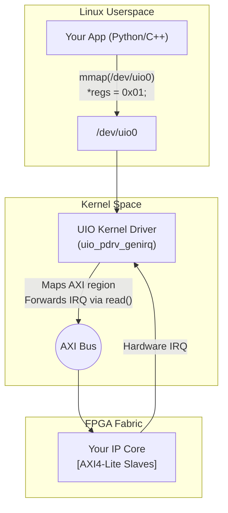

[<- Section Home](../README.md) · [<- Project Home](../../README.md)

# FPGA IP Driver Patterns: UIO, VFIO, and Kernel DMA

When you place a custom IP core in the FPGA fabric, someone must write a Linux driver for it. Writing a custom kernel driver for every FPGA IP register bank is heavy—compile, insert, crash, reboot, repeat. This article covers the four driver patterns for FPGA IPs and how to choose between them.

---

## The Driver Decision Matrix

| Pattern | Setup Complexity | Userspace Access | DMA Support | Interrupts | Best For |
|---|---|---|---|---|---|
| **`/dev/mem`** | Zero | Direct `mmap()` | None | None | Extremely quick tests in development (unsafe for production). |
| **UIO** | Very Low | Direct `mmap()` | **Unsafe** (No IOMMU) | Basic (blocking `read()`) | Simple AXI4-Lite control registers (no DMA), prototyping. |
| **VFIO** | High (IOMMU groups) | Direct `mmap()` | **Safe** (IOMMU protected) | Advanced (Eventfd + epoll) | High-perf DMA, DPDK, QEMU passthrough, PCIe FPGA cards. |
| **Kernel Platform Driver** | Medium (Writing a `.ko`) | Via `/dev/mydevice` + ioctl | **Safe** (Kernel DMA API) | Native kernel IRQ | Production IP, shared resources, standard kernel subsystem integration (V4L2, ALSA). |

---

## Userspace I/O (UIO)

UIO lets you map AXI register space directly into a userspace process via `mmap()`, allowing you to write your "driver" in Python, Rust, or C++ without a single kernel build.

### The Architecture



**No kernel module to write.** The generic `uio_pdrv_genirq` driver binds to your IP's `compatible` string in the device tree, exposes the AXI address range as `/dev/uioN`, and forwards the IP's interrupt as a blocking `read()`.

### Device Tree Binding

```dts
my_ip@43c00000 {
    compatible = "generic-uio";
    reg = <0x43c00000 0x10000>;
    interrupts = <0 29 4>;  /* IRQ 61 (SPI 29), level-high */
    interrupt-parent = <&intc>;
};
```

### Userspace Code (Python)

```python
import mmap, os, struct

fd = os.open("/dev/uio0", os.O_RDWR | os.O_SYNC)
regs = mmap.mmap(fd, 0x10000, mmap.MAP_SHARED, mmap.PROT_READ | mmap.PROT_WRITE)

# Write to AXI register at offset 0x04
struct.pack_into("I", regs, 0x04, 0x00000001)

# Read back
val = struct.unpack_from("I", regs, 0x00)[0]
print(f"Status register: 0x{val:08x}")

# Wait for interrupt (blocks until IRQ fires)
os.read(fd, 4)

regs.close()
os.close(fd)
```

### Interrupt Handling

UIO interrupt handling is synchronous and simple:
- `read()` blocks until the hardware IRQ fires.
- Returns a 4-byte interrupt count.
- You must `write()` back to re-enable the interrupt.
- Only one IRQ per UIO device is supported (no IRQ multiplexing in the kernel shim). For multiple interrupt sources from one IP, implement an IRQ status register in the FPGA and poll it in userspace after the `read()` unblocks.

---

## Virtual Function I/O (VFIO)

VFIO is the heavyweight userspace path. It provides:
- **IOMMU-gated DMA** — the FPGA can only access memory pages explicitly mapped by userspace.
- **Eventfd-based interrupts** — integrate with epoll/libevent without blocking threads.
- **PCIe topology awareness** — natural fit for FPGA PCIe accelerators (Alveo, Intel PAC).

### VFIO-PCI Platform Driver (Zynq MPSoC / Versal)

On Zynq MPSoC and Versal, PL PCIe endpoints can use VFIO-PCI:

```bash
# Unbind from default driver
echo 0000:01:00.0 > /sys/bus/pci/devices/0000:01:00.0/driver/unbind
# Bind to vfio-pci
echo 10ee 7021 > /sys/bus/pci/drivers/vfio-pci/new_id
# Userspace uses /dev/vfio/XX
```

Userspace access is through the VFIO API (ioctl-based), typically wrapped by DPDK or QEMU, not raw `mmap()`. VFIO is the only correct path if your FPGA accelerator needs to be driven by DPDK or passed through to a VM via KVM.

---

## Platform Driver — Production Kernel Driver

When you need to integrate your FPGA IP deeply into Linux (e.g., exposing an FPGA video pipeline as a standard V4L2 webcam, or exposing an I2C controller to the kernel I2C subsystem), you must write a kernel platform driver.

```c
static int myfpga_probe(struct platform_device *pdev) {
    struct myfpga_dev *dev;
    struct resource *res;

    dev = devm_kzalloc(&pdev->dev, sizeof(*dev), GFP_KERNEL);

    // 1. ioremap FPGA registers (gives kernel a virtual pointer)
    res = platform_get_resource(pdev, IORESOURCE_MEM, 0);
    dev->regs = devm_ioremap_resource(&pdev->dev, res);

    // 2. Request IRQ
    dev->irq = platform_get_irq(pdev, 0);
    devm_request_irq(&pdev->dev, dev->irq, myfpga_isr, 0, "myfpga", dev);

    // 3. Register character device /dev/myfpga
    alloc_chrdev_region(&dev->devt, 0, 1, "myfpga");
    cdev_init(&dev->cdev, &myfpga_fops);
    cdev_add(&dev->cdev, dev->devt, 1);

    platform_set_drvdata(pdev, dev);
    return 0;
}
```

---

## DMA Engine — How FPGA Moves Data to RAM

When bandwidth requirements exceed what the CPU can manually copy via MMIO/ioremap, hardware DMA is required. FPGAs typically instantiate soft DMA engines (like Xilinx AXI DMA or Intel mSGDMA) in the fabric to move data between DDR memory and AXI Stream peripherals (like ADCs or Ethernet MACs).

The Linux DMA Engine framework (`dmaengine`) provides a unified API for these controllers. The most common FPGA pattern is **cyclic DMA** with double-buffering.

### Setting up Cyclic DMA

```c
static int setup_fpga_dma(struct myfpga_dev *dev) {
    struct dma_async_tx_descriptor *desc;
    dma_addr_t dma_addr;
    void *buf;

    // Allocate DMA buffer
    buf = dma_alloc_coherent(dev->parent, BUF_SIZE, &dma_addr, GFP_KERNEL);

    // Get channel from device tree ("rx" or "tx")
    dev->dma_chan = dma_request_chan(dev->parent, "rx");

    // Set up cyclic transfer (double-buffered)
    // Buffer is divided into two periods: CPU processes one half while FPGA fills the other
    desc = dmaengine_prep_dma_cyclic(
        dev->dma_chan,
        dma_addr,           // destination in RAM
        BUF_SIZE,
        BUF_SIZE / 2,       // period = half-buffer
        DMA_DEV_TO_MEM,     // FPGA -> RAM
        DMA_PREP_INTERRUPT);

    desc->callback = dma_complete_callback;
    desc->callback_param = dev;

    dmaengine_submit(desc);
    dma_async_issue_pending(dev->dma_chan);
    return 0;
}

// Callback fires when each period (half-buffer) completes
static void dma_complete_callback(void *param) {
    struct myfpga_dev *dev = param;
    wake_up_interruptible(&dev->dma_wait);
}
```

### Choosing DMA Buffer Types

| Buffer Type | API | Coherency | When to Use |
|---|---|---|---|
| **Coherent (uncached)** | `dma_alloc_coherent()` | Hardware-coherent or uncached | Small buffers (<64 KB), descriptor rings, control structures |
| **Streaming (cached + sync)** | `dma_map_single()` + `dma_sync_*()` | Manually synchronized | Large buffers (>64 KB), high CPU read throughput after DMA |
| **CMA (contiguous, shareable)** | `dma_alloc_from_contiguous()` | Depends on platform | FPGA frame buffers shared with display subsystem |
| **Reserved (no-map)** | `dma_declare_coherent_memory()` | FPGA-direct (no CPU) | FPGA-exclusive memory: F2S bridge, video pipes |

> [!TIP]
> **On Cyclone V SoC (non-coherent):** streaming DMA with `dma_map_single()` is preferred for buffers >16 KB. The CPU pays a ~1 µs `dma_sync_for_cpu()` cost per period but reads cached memory at ~2 GB/s instead of ~200 MB/s (uncached). On coherent platforms (Zynq ACP, PolarFire SoC), `dma_alloc_coherent()` has no performance penalty.

---

## Best Practices & Pitfalls

1. **UIO for control-plane, kernel driver for data-plane**: Use UIO to poke configuration registers from Python, but use a real kernel driver with `dma_alloc_coherent()` for the high-bandwidth data pipes.
2. **UIO + DMA = System Memory Corruption**: UIO has no IOMMU awareness. An FPGA DMA engine controlled via UIO can read/write any physical address. One bad scatter-gather descriptor and you've corrupted the kernel's page tables.
3. **Use `O_SYNC` when mmap'ing UIO**: Without it, writes to the mmap'd region may be cached by the CPU and never reach the FPGA. `O_SYNC` forces uncached access.
4. **UIO interrupts can stall**: The synchronous `read()` model means one blocked thread per UIO device. For high-rate interrupts, the thread never sleeps—it burns a CPU. Use VFIO eventfd or a kernel interrupt handler for high-frequency IRQs.
5. **One UIO device per IP core**: Don't multiplex multiple IPs onto one UIO device. Give each IP its own device tree node and `/dev/uioN`.

---

## References

| Source | Description |
|---|---|
| Linux UIO HOWTO | https://www.kernel.org/doc/html/latest/driver-api/uio-howto.html |
| Linux DMA Engine API | `Documentation/driver-api/dmaengine/` in Kernel Tree |
| Linux VFIO documentation | https://www.kernel.org/doc/html/latest/driver-api/vfio.html |
| Xilinx UIO wiki | https://xilinx-wiki.atlassian.net/wiki/spaces/A/pages/18842492/UIO |
| [device_tree_and_overlays.md](device_tree_and_overlays.md) | Writing DT nodes that bind to these driver patterns |
| [hps_fpga_bridges.md](../03_hps_fpga_bridges/hps_fpga_bridges.md) | Bridge programming — the hardware side of DMA |
