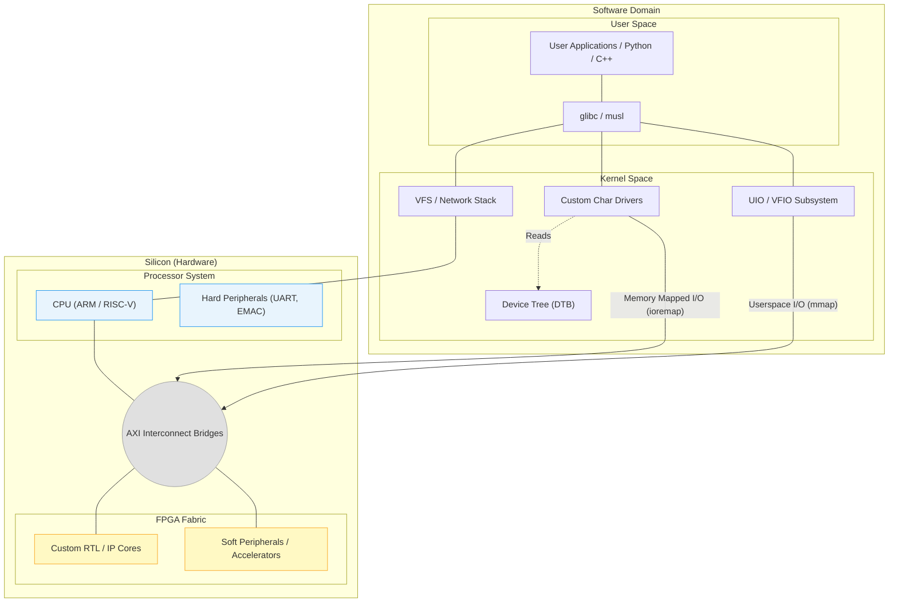

[← Home](../README.md) · [Embedded Linux](README.md)

# Embedded Linux on FPGA — Architecture and Toolchains

Running Linux on an FPGA System-on-Chip (SoC) fundamentally changes the development paradigm. It transforms a bare-metal hardware project into a full embedded system. This allows the FPGA to focus purely on high-bandwidth, deterministic hardware acceleration, while Linux handles complex software tasks like TCP/IP networking, file systems, package management, and web servers.

However, it also introduces significant complexity: hardware engineers must now write Device Tree Overlays, configure AXI memory coherency, and write Linux kernel drivers to bridge the software and hardware domains.

---

## System Architecture

The marriage of Linux and an FPGA relies on a strict separation of concerns, bridged by high-speed AXI interconnects.

*   **User Space**: Runs your business logic. It does not know the FPGA exists. It simply reads/writes to standard Linux file descriptors (e.g., `/dev/my_fpga_ip`).
*   **Kernel Space**: The Linux kernel manages the memory map. Drivers request memory regions from the Device Tree and translate file I/O into raw memory-mapped reads/writes across the AXI bus.
*   **Silicon**: The Hard Processor (e.g., dual-core ARM Cortex-A9) issues transactions over the AXI bridges to the custom IP cores sitting in the FPGA fabric.

---

## Decision Matrix: Build Systems

To boot Linux, you need a First Stage Bootloader (FSBL), U-Boot, a Linux Kernel, a Device Tree, and a Root Filesystem (RootFS). A "Build System" compiles all of these from source into a single bootable SD card image.

| Criterion | Yocto / OpenEmbedded | Buildroot | Debian / Ubuntu (`debootstrap`) |
|---|---|---|---|
| **Ideal Use Case** | Enterprise production, commercial products | Single-purpose appliances, fast booting | Fast prototyping, desktop-like experience |
| **Complexity** | Very High (steep learning curve) | Low (uses standard `make menuconfig`) | Medium |
| **Reproducibility** | Excellent (strict versioning/layers) | Good | Poor (live apt-get updates break state) |
| **Output** | Custom packages (rpm/ipk) | Single monolithic filesystem | Standard `.deb` packages |
| **Vendor Support**| Excellent (PetaLinux is Yocto) | Good (community maintained configs) | None (DIY kernel compilation required) |

> [!TIP]
> **When to use what?** If you are building a commercial product, invest the months required to learn **Yocto**. If you just want a lightweight Linux to run a single Python script that talks to your FPGA, use **Buildroot**.

---

## Vendor Distributions & Build Environments

Rather than building a Linux system completely from scratch, FPGA vendors provide their own branded build environments. These environments ingest the hardware description files generated by Vivado or Quartus to automatically configure the Device Tree and kernel drivers.

### AMD / Xilinx PetaLinux

*   **Underlying System**: Yocto Project
*   **Default Distro**: PetaLinux OS (Poky-based) or Ubuntu (for Kria/MPSoC).
*   **How it differs from pure Yocto**: PetaLinux is a heavy abstraction layer over Yocto. Instead of writing BitBake recipes and modifying `local.conf`, you use proprietary CLI wrappers (`petalinux-create`, `petalinux-config`, `petalinux-build`). When you feed it a Vivado `.xsa` hardware handoff file, PetaLinux automatically generates the Yocto `meta-user` layers, device trees, and U-Boot configurations behind the scenes.
*   **Pros/Cons**: Excellent for hardware engineers who don't want to learn Yocto. Frustrating for experienced Linux engineers because the PetaLinux wrappers hide standard Yocto errors and restrict customization.
*   **References**: [UG1144: PetaLinux Tools Reference Guide](https://docs.xilinx.com/r/en-US/ug1144-petalinux-tools-reference-guide)

### Intel / Altera SoC EDS and GSRD

*   **Underlying System**: Yocto Project
*   **Default Distro**: Angstrom (Historically) → Poky (Modern)
*   **How it differs from pure Yocto**: Unlike Xilinx, Intel does *not* wrap Yocto in a proprietary CLI. Intel simply provides standard Yocto meta-layers (e.g., `meta-intel-fpga`) and a "Golden System Reference Design" (GSRD). You interact directly with standard open-source tools using standard `bitbake` commands. You use the `sopc2dts` tool to convert Quartus `.sopcinfo` files into Device Trees.
*   **Angstrom vs. Poky**: For many years (Cyclone V era), Intel's GSRD used the **Angstrom** distribution. Angstrom is now largely defunct, and modern Intel GSRDs (for Arria 10, Stratix 10, Agilex) have fully transitioned to the standard Yocto **Poky** distribution.
*   **References**: [RocketBoards.org](https://www.rocketboards.org/) (Intel's official SoC FPGA community hub).

### Microchip PolarFire SoC Environments

*   **Underlying System**: Buildroot or Yocto Project
*   **Default Distro**: Custom Buildroot or Yocto Poky
*   **Details**: Microchip takes a highly open-source approach for their RISC-V SoCs. They maintain excellent, officially supported Buildroot external trees (`polarfire-soc-buildroot-sdk`), which are significantly faster and easier to use than Yocto for simple applications. For enterprise users, they also provide `meta-polarfire-soc-yocto-bsp`.
*   **References**: [Microchip PolarFire SoC GitHub](https://github.com/polarfire-soc)

---

## Decision Matrix: CPU Architectures

| Architecture | Implementation | Example FPGAs | Best For |
|---|---|---|---|
| **Hard ARM SoC** | Dedicated silicon die next to the FPGA fabric | Zynq-7000, Cyclone V SoC, Zynq Ultrascale+ | High performance (1+ GHz), low power, production reliability. This is the industry standard for Embedded Linux on FPGA. |
| **Soft RISC-V (with MMU)** | Synthesized entirely out of FPGA LUTs | VexRiscv (Linux variant), Rocket, CVA6 | Open-source CPU research, security auditing, or adding Linux to a pure-FPGA chip without a hard processor. |
| **Legacy Soft Cores** | Synthesized out of LUTs (MMU-less) | MicroBlaze, Nios II | Running `uClinux`. **Avoid if possible.** MMU-less Linux is exceptionally difficult to maintain, lacks `fork()`, and suffers from memory fragmentation. |

---

## Practical Context & Pitfalls

Transitioning to SoC FPGAs requires a mindset shift. The FPGA is no longer the master of the system; the Linux kernel is.

### The Device Tree is the Source of Truth
When you add an IP core in Vivado or Quartus, Linux does not automatically know it's there. You must update the **Device Tree** (`.dts`) to tell the kernel the physical address, interrupt line, and compatible driver string of your new IP.

### Pitfalls & Common Mistakes

1.  **Userspace Bitbanging vs. Kernel Drivers**
    *   *Antipattern*: Mapping `/dev/mem` in a C program to manually toggle AXI GPIO pins to implement an SPI protocol.
    *   *Correct*: Instantiate a hardware SPI IP core in the FPGA, configure the Linux `spidev` kernel driver in the Device tree, and use standard Linux SPI APIs in userspace. Let the hardware do the fast toggling.
2.  **Ignoring Cache Coherency**
    *   *Antipattern*: An FPGA DMA engine writes 1MB of video data to DDR memory, but the ARM CPU reads stale data from its L2 cache instead of the new DDR data.
    *   *Correct*: Use the Linux DMA API (`dma_alloc_coherent`) to allocate uncached memory regions, or use the Cache Coherent Interconnect (CCI) / Accelerator Coherency Port (ACP) hardware bridges provided by the SoC.
3.  **The UIO Subsystem vs. Custom Drivers**
    *   Writing custom kernel drivers for every simple FPGA IP is tedious. Instead, use the **Userspace I/O (UIO)** subsystem. It maps the IP's memory registers directly into userspace via `mmap()`, allowing you to write your driver entirely in Python or C++ without touching kernel code (suitable for low-interrupt, low-bandwidth control registers).

---

## Key Articles in This Section

| Article | Topic |
|---|---|
| [soc_linux_architecture.md](01_architecture/soc_linux_architecture.md) | Deep dive into the SoC Linux stack: kernel, userspace, and the FPGA manager. |
| [boot_flow.md](02_boot_flow/boot_flow.md) | The universal boot sequence (BootROM → FSBL → U-Boot → Kernel) and vendor-specific implementations. |
| [hps_fpga_bridges.md](03_hps_fpga_bridges/hps_fpga_bridges.md) | Configuring the physical AXI bridges connecting the CPU to the FPGA fabric. |
| [device_tree_and_overlays.md](04_drivers_and_dma/device_tree_and_overlays.md) | Syntax guide for Device Trees and using Overlays for dynamic FPGA reconfiguration. |
| [fpga_driver_patterns.md](04_drivers_and_dma/fpga_driver_patterns.md) | The definitive guide to writing Linux drivers (UIO, VFIO, Kernel Platform) for custom FPGA IP. |
| [build_and_update.md](05_build_systems/build_and_update.md) | Managing OTA updates and build systems (Yocto/Buildroot) in production. |
