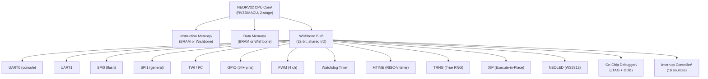

[← 11 Soft Cores And Soc Design Home](../README.md) · [← RISC-V Cores Home](README.md) · [← Project Home](../../../README.md)]

# NEORV32 — Best-Documented RISC-V SoC Platform

NEORV32 is a complete SoC platform built around a custom RV32 RISC-V core, with arguably the best documentation in open-source silicon — a 400+ page datasheet covering every peripheral, register, and the CPU microarchitecture. Written in self-contained VHDL with no third-party dependencies, it is the ideal choice when you need to **understand** your processor, not just use it.

---

## Architecture

| Parameter | Value |
|---|---|
| **ISA** | RV32I + M + A + C + U (Zicsr, Zifencei, Zicntr) |
| **Pipeline** | 2-stage (fetch → execute) |
| **LUTs** | ~2,000 (RV32I minimal) to ~4,500 (RV32IMACU + peripherals) |
| **FFs** | ~1,200 to ~2,500 |
| **fmax** | 100+ MHz on Artix-7, 80+ MHz on Cyclone V, 50+ MHz on iCE40 |
| **Performance** | ~0.6 DMIPS/MHz, ~0.8 CoreMark/MHz |
| **Debug** | JTAG via OpenOCD + GDB (on-chip debugger) |
| **Bootloader** | Built-in ROM bootloader (auto-loads from SPI flash) |
| **Language** | VHDL-93 (self-contained, no libraries required) |

---

## SoC Block Diagram



---

## Built-In Peripherals

Every peripheral is optional — only the CPU core and instruction memory are required. All other peripherals are enabled via VHDL generics.

| Peripheral | Function | Base Address | Key Registers |
|---|---|---|---|
| **MTIME** | 64-bit RISC-V machine timer | `0xFFFF8000` | `MTIME`, `MTIMECMP` |
| **UART0** | Primary serial console | `0xFFFF0000` | `CTRL`, `DATA` (8-bit TX/RX) |
| **UART1** | Secondary UART | `0xFFFF0100` | Same as UART0 |
| **SPI0** | SPI flash controller | `0xFFFF0200` | `CTRL`, `DATA`, `CLKDIV` |
| **SPI1** | General-purpose SPI | `0xFFFF0300` | Same as SPI0 |
| **TWI (I²C)** | Two-wire interface | `0xFFFF0400` | `CTRL`, `DATA`, `CLKDIV` |
| **GPIO** | 64+ configurable I/O pins | `0xFFFF0500` | `INPUT`, `OUTPUT`, `DIR` |
| **PWM** | 4-channel PWM output | `0xFFFF0600` | `CTRL`, `DC0..3` (duty cycle) |
| **WDT** | Watchdog timer | `0xFFFF0700` | `CTRL`, `RESET` |
| **TRNG** | True random number generator | `0xFFFF0800` | `CTRL`, `DATA` |
| **XIP** | Execute-in-place from SPI flash | `0xFFFF0900` | `CTRL`, `BASE` |
| **NEOLED** | Smart LED (WS2812) driver | `0xFFFF0A00` | `CTRL`, `DATA` |
| **OCD** | On-chip debugger | `0xFFFF0B00` | Debug control registers |
| **CFS** | Custom function subsystem | `0xFFFF0C00` | User-defined |

> [!NOTE]
> All peripheral addresses are in the `0xFFFFxxxx` range — the upper 64 KB of the 32-bit address space. This leaves the lower address space entirely available for application code and data.

### Peripheral Register Format

Each peripheral uses a simple register layout:

| Offset | Name | R/W | Description |
|---|---|---|---|
| `0x00` | `CTRL` | RW | Control register (enable, mode, flags) |
| `0x04` | `DATA` | RW | Data register (read/write data) |
| `0x08` | `CLKDIV` | RW | Clock divider (for UART, SPI, TWI) |

---

## Boot Flow

NEORV32 includes a built-in bootloader in ROM — no external programmer needed:

```
Power-On Reset
    │
    ▼
Bootloader (ROM, 2 KB)
    ├─ Initialize UART0 at configured baud rate
    ├─ Print NEORV32 banner to UART0
    ├─ Check for auto-boot timeout (configurable)
    │
    ├─ Timeout expired → XIP boot (execute from SPI flash)
    │                  │ or SPI flash boot (copy to RAM, jump)
    │
    └─ Key pressed → Interactive mode
        ├─ 'u' → Upload binary via UART (XMODEM)
        ├─ 's' → Store to SPI flash
        └─ 'r' → Run uploaded binary
```

### Boot Configuration (VHDL Generics)

```vhdl
-- NEORV32 top-level configuration
constant IO_UART0_BAUD : natural := 19200;     -- Console baud rate
constant MEM_INT_IMEM_SIZE : natural := 16*1024; -- 16 KB internal IMEM
constant MEM_INT_DMEM_SIZE : natural := 8*1024;  -- 8 KB internal DMEM
constant CLOCK_FREQUENCY : natural := 100000000; -- 100 MHz system clock
constant INT_BOOTLOADER_SIZE : natural := 2*1024; -- 2 KB bootloader ROM
```

---

## VHDL Integration

### Minimal Configuration

```vhdl
-- Minimal NEORV32: RV32I, 16KB IMEM, 8KB DMEM, UART only
neorv32_top_inst: entity neorv32.neorv32_top
generic map (
    CLOCK_FREQUENCY     => 100000000,  -- 100 MHz
    MEM_INT_IMEM_SIZE   => 16*1024,    -- 16 KB instruction memory
    MEM_INT_DMEM_SIZE   => 8*1024,     -- 8 KB data memory
    IO_UART0_EN         => true,       -- Enable UART0
    IO_GPIO_EN          => false,      -- No GPIO
    IO_SPI_EN           => false,      -- No SPI
    IO_PWM_EN           => false,      -- No PWM
    INT_BOOTLOADER_EN   => true        -- Enable bootloader
)
port map (
    clk_i    => clk_100MHz,
    rstn_i   => reset_n,
    uart0_txd_o => uart_tx,
    uart0_rxd_i => uart_rx
);
```

### Full Configuration

```vhdl
-- Full NEORV32: RV32IMACU, all peripherals, JTAG debug, XIP flash
neorv32_top_inst: entity neorv32.neorv32_top
generic map (
    CLOCK_FREQUENCY     => 100000000,
    CPU_EXTENSION_RISCV_B => true,      -- Zba, Zbb, Zbs (bit manipulation)
    CPU_EXTENSION_RISCV_M => true,      -- M extension (multiply/divide)
    CPU_EXTENSION_RISCV_C => true,      -- C extension (compressed)
    CPU_EXTENSION_RISCV_U => true,      -- U extension (user mode)
    MEM_INT_IMEM_SIZE   => 32*1024,
    MEM_INT_DMEM_SIZE   => 16*1024,
    IO_UART0_EN         => true,
    IO_UART1_EN         => true,
    IO_SPI_EN           => true,
    IO_TWI_EN           => true,
    IO_GPIO_EN          => true,
    IO_PWM_EN           => true,
    IO_WDT_EN           => true,
    IO_TRNG_EN          => true,
    IO_XIP_EN           => true,
    IO_NEOLED_EN        => true,
    IO_ONCHIP_DEBUGGER_EN => true,      -- JTAG debug
    INT_BOOTLOADER_EN   => true
);
```

---

## On-Chip Debugger

NEORV32 includes a JTAG on-chip debugger (OCD) compatible with the RISC-V Debug Specification v0.13:

```bash
# Connect via OpenOCD
openocd -f interface/ft2232h.cfg -f target/neorv32.cfg

# Connect GDB
riscv32-unknown-elf-gdb
(gdb) target remote :3333
(gdb) load firmware.elf
(gdb) break main
(gdb) continue
```

The OCD supports:
- Hardware breakpoints (2 by default, configurable)
- Single-step execution
- Register and memory access while halted
- GDB-compatible debug flow via OpenOCD

---

## RISC-V Compliance

NEORV32 passes the official RISC-V Architecture Test Suite, which validates:

| Extension | Test Status |
|---|---|
| RV32I | Passed |
| Zicsr | Passed |
| Zifencei | Passed |
| M (multiply/divide) | Passed |
| C (compressed) | Passed |
| Zicntr (hardware counters) | Passed |

This makes NEORV32 one of the few open cores with formal ISA compliance verification — code compiled for any compliant RV32IMAC toolchain will run correctly.

---

## When to Use / When NOT to Use

### When to Use

- **You want to understand your CPU** — 400+ page datasheet, clean VHDL, no magic
- **Self-contained SoC needed** — No external memory controllers, IP cores, or libraries
- **SPI flash boot without a programmer** — Built-in bootloader auto-loads from flash
- **Educational / research** — Best-documented open RISC-V for studying CPU design
- **VHDL-only projects** — No need for mixed-language simulation or Verilog conversion

### When NOT to Use

- **You need maximum performance** — 2-stage pipeline, 0.6 DMIPS/MHz; VexRiscv achieves 1.4+
- **You need Linux** — No MMU; use VexRiscv Linux variant
- **You prefer Verilog/SystemVerilog** — NEORV32 is VHDL-only; no official Verilog port
- **You need cache** — NEORV32 uses tightly-coupled BRAM, not caches; not suitable for large working sets

---

## Best Practices

1. **Start with the default test configuration** — NEORV32 provides a `neorv32_test_setup` that works on most FPGA boards out of the box
2. **Use the built-in bootloader** — Don't write your own boot sequence; the ROM bootloader handles SPI flash, UART upload, and XIP
3. **Enable JTAG debug during development** — The OCD adds ~300 LUTs but saves hours of UART-based debugging
4. **Use the NEORV32 GCC toolchain** — Pre-built riscv32-unknown-elf toolchain with NEORV32-specific headers; available from the project's releases
5. **Read the datasheet** — The 400+ page PDF is the best open-source CPU documentation available; it answers every question about registers, timing, and integration

## Antipatterns

| Antipattern | Why It Fails | Correct Approach |
|---|---|---|
| **Adding external memory controller separately** | NEORV32's Wishbone port is designed for tightly-coupled memory; external DDR adds latency and complexity | Use the internal BRAM-based memory; add external memory only if you exceed 64 KB |
| **Skipping the bootloader** | You'll need to implement your own reset vector and initialization — the bootloader already does this reliably | Use `INT_BOOTLOADER_EN => true` even in production |
| **Mixing NEORV32 VHDL with Verilog IP** | VHDL↔Verilog co-simulation is error-prone and tool-dependent | Use the custom function subsystem (CFS) to interface with external Verilog via documented signals |
| **Disabling OCD in early development** | UART-based debugging is slow and limited; OCD provides real breakpoints and register inspection | Keep `IO_ONCHIP_DEBUGGER_EN => true` until you freeze the design |

---

## Pitfalls

### 1. VHDL-Only Ecosystem

NEORV32 is pure VHDL. While most synthesis tools support mixed VHDL/Verilog, the test infrastructure and simulation scripts are VHDL-only. If your team uses Verilog exclusively, you'll need to adapt.

### 2. Internal Memory Size Limits

NEORV32 uses FPGA BRAM for instruction and data memory. On most FPGAs:
- Artix-7 35T: ~60 KB BRAM available (up to ~48 KB IMEM + 8 KB DMEM)
- ECP5-85F: ~370 KB BRAM (generous, but still limited)
- iCE40: Very limited (use minimal configuration only)

For working sets larger than the available BRAM, you need external memory — which requires a custom Wishbone memory controller.

### 3. No Cache, No Virtual Memory

NEORV32 uses tightly-coupled BRAM, not caches. This means:
- Deterministic access time (good for real-time)
- But no ability to handle working sets larger than BRAM
- No MMU — cannot run Linux or any OS requiring virtual memory

---

## Use Cases

| Use Case | Configuration | Why NEORV32 |
|---|---|---|
| **Educational CPU study** | Minimal + UART | Best documentation, self-contained, clean VHDL |
| **Embedded controller with SPI flash boot** | Full + XIP + SPI | Bootloader auto-loads from flash, no programmer needed |
| **WS2812 LED controller** | With NEOLED peripheral | Hardware NeoPixel driver, zero CPU overhead |
| **IoT sensor node** | With UART + SPI + TRNG | True RNG for crypto, SPI for sensors, UART for console |
| **RISC-V compliance testing** | Any | Passes official architecture test suite |
| **Custom accelerator platform** | With CFS (custom function subsystem) | Defined interface for user coprocessors |

---

## References

- [NEORV32 GitHub Repository](https://github.com/stnolth/neorv32) — source code, documentation, examples
- [NEORV32 Datasheet (400+ pages)](https://stnolth.github.io/neorv32/) — complete hardware reference
- [NEORV32 Quick Start Guide](https://github.com/stnolth/neorv32#quick-start-guide) — first project walkthrough
- [PicoRV32](picorv32.md) — smaller but less documented alternative
- [VexRiscv](vexriscv.md) — more performant, SpinalHDL-based
- [Ibex/CV32E](ibex_cv32e.md) — security-focused, formally verified
- [RISC-V ISA](../riscv/riscv_isa.md) — instruction set reference
