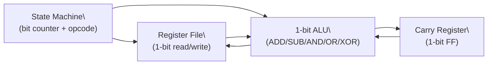
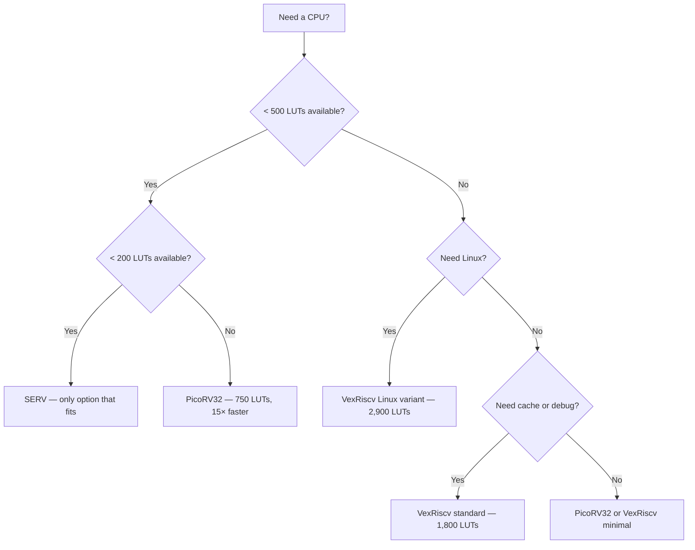

[← 11 Soft Cores And Soc Design Home](../README.md) · [← RISC-V Cores Home](README.md) · [← Project Home](../../../README.md)]

# SERV — World's Smallest RISC-V Core

SERV (SErial RISC-V) is a bit-serial RV32I implementation that processes one bit per clock cycle, achieving a fully functional 32-bit RISC-V core in as few as ~125 LUTs on iCE40. When every LUT counts — configuration management, redundant checker cores, or educational study — SERV is the only RISC-V core that fits.

---

## Architecture

| Parameter | Value |
|---|---|
| **ISA** | RV32I (Zicsr, Zifencei); M extension optional |
| **Pipeline** | None (bit-serial state machine) |
| **LUTs** | ~125 (minimal, iCE40) to ~400 (with M extension + IRQ) |
| **FFs** | ~90 (minimal) to ~200 (full) |
| **fmax** | ~50 MHz on iCE40, ~100 MHz on Artix-7 |
| **CPI** | ~32–64 cycles per instruction (1 bit per cycle × 32-bit operations) |
| **Performance** | ~1.5 MIPS at 50 MHz (DMIPS/MHz ~0.02) |
| **Bus** | Wishbone (variable width, typically 32-bit) |
| **Interrupts** | Optional IRQ port (single vector) |
| **Debug** | None built-in |

---

## How Bit-Serial Execution Works

SERV does not have a traditional pipeline with parallel datapaths. Instead, it uses a **1-bit ALU** that processes each instruction serially, one bit position at a time:

```
Traditional 32-bit CPU:  ADD r1, r2, r3 → 32 bits computed in parallel, 1 cycle
SERV bit-serial:         ADD r1, r2, r3 → 1 bit per cycle × 32 bits = 32+ cycles
```

### Execution Trace: ADD r1, r2, r3

```
Cycle  0: Load operand A bit 0 from register file
Cycle  1: Load operand B bit 0 from register file
Cycle  2: Compute sum bit 0, store carry
Cycle  3: Write result bit 0 to register file
...
Cycle 28-31: Process bits 7 (with carry chain)
...
Cycle 124-127: Process bits 31, final carry resolved
Cycle 128+: Next instruction begins
```

### Bit-Serial Datapath



The entire datapath — register file read/write ports, ALU, and carry chain — is 1 bit wide. The state machine tracks the current bit position and instruction opcode, stepping through each bit sequentially.

### Why This Works

- **Area is proportional to bit width**: A 32-bit parallel ALU needs 32 full adders; a 1-bit ALU needs 1
- **No forwarding or hazard logic**: There is no pipeline to create data hazards
- **No cache needed**: SERV runs slowly enough that simple Wishbone memory is sufficient
- **No branch prediction**: Branches resolve in ~32 cycles regardless — prediction would save nothing

---

## Resource Comparison

| Core | LUTs (iCE40) | LUTs (Artix-7) | CPI | DMIPS/MHz | Best For |
|---|---|---|---|---|---|
| **SERV** | ~125 | ~100 | ~32–64 | 0.02 | Absolute minimum footprint |
| **PicoRV32** | ~750 | ~600 | ~3.5 | 0.30 | Small but usable |
| **VexRiscv (small)** | ~1,600 | ~500 | ~1.9 | 0.52 | Balanced minimal |
| **NEORV32** | — | ~2,000 | ~1.5 | 0.60 | Full SoC with peripherals |

SERV is **6× smaller** than PicoRV32 and **12× smaller** than VexRiscv's minimal configuration. But it is **50× slower** than PicoRV32 in throughput.

---

## Integration

### Wishbone Interface

SERV connects to memory via a standard Wishbone bus. The bus width is configurable but typically 32-bit — SERV performs 32 separate 1-bit operations to compose a 32-bit bus transaction internally.

```verilog
// SERV top-level ports (simplified)
serv_top #(
    .RESET_PC(32'h00000000),
    .WITH_IRQ(1)
) serv (
    .clk        (clk),
    .i_reset    (reset),

    // Wishbone instruction interface
    .i_imem_cyc (imem_cyc),
    .i_imem_stb (imem_stb),
    .o_imem_ack (imem_ack),
    .i_imem_adr (imem_adr),
    .o_imem_dat (imem_dat),

    // Wishbone data interface
    .i_dmem_cyc (dmem_cyc),
    .i_dmem_stb (dmem_stb),
    .o_dmem_ack (dmem_ack),
    .i_dmem_we  (dmem_we),
    .i_dmem_adr (dmem_adr),
    .i_dmem_dat (dmem_dat),
    .o_dmem_dat (dmem_rdat),

    // IRQ
    .i_irq      (irq)
);
```

### LiteX Integration

SERV is available as a LiteX CPU option:

```python
# LiteX SoC with SERV CPU
from litex.soc.integration.soc_core import SoCCore

class ServSoC(SoCCore):
    def __init__(self):
        super().__init__(
            cpu_type="serv",    # SERV core
            # ... rest of SoC configuration
        )
```

### Multiple SERV Cores

SERV's tiny footprint enables designs with multiple redundant cores:

```verilog
// Triple Modular Redundancy with 3x SERV (~375 LUTs total)
// Still smaller than a single PicoRV32 (~750 LUTs)

wire [31:0] result [2:0];
wire [0:0]  irq;

serv_top serv0 (.o_result(result[0]), .i_irq(irq), /* ... */);
serv_top serv1 (.o_result(result[1]), .i_irq(irq), /* ... */);
serv_top serv2 (.o_result(result[2]), .i_irq(irq), /* ... */);

// Majority vote
assign final_result = (result[0] & result[1]) |
                      (result[1] & result[2]) |
                      (result[0] & result[2]);
```

---

## Decision Guide: SERV vs PicoRV32 vs VexRiscv



---

## When to Use / When NOT to Use

### When to Use

- **FPGA with < 500 LUTs free** — SERV is the only RISC-V that fits
- **Configuration/management CPU** — Read/write registers slowly; speed is irrelevant
- **Redundant monitoring core** — Use 3× SERVs for TMR (~375 LUTs) vs 1× PicoRV32 (~750 LUTs)
- **Test pattern generator** — Sequential state machine with RISC-V programmability
- **Educational** — Simplest possible RISC-V implementation to study

### When NOT to Use

- **Any design with > 750 LUTs available** — PicoRV32 is 15× faster for only 6× the area
- **Real-time processing** — 1.5 MIPS at 50 MHz is not enough for any DSP
- **Running an OS** — SERV has no MMU, no caches, no interrupt controller beyond basic IRQ
- **Communication stacks** — UART at 9600 baud is feasible; anything faster is not

---

## Best Practices

1. **Use SERV only when you've exhausted other options** — PicoRV32 at 750 LUTs is almost always a better choice
2. **Keep interrupt handlers short** — SERV's CPI of ~32 means each instruction takes ~640 ns at 50 MHz; long ISRs will miss events
3. **Use Wishbone RAM, not ROM** — SERV needs to fetch every instruction from memory; there is no cache to absorb latency
4. **Compile with -O1, not -Os** — Smaller code (from -Os) increases instruction count; faster code (from -O1) reduces total execution time despite larger binary

## Antipatterns

| Antipattern | Why It Fails | Correct Approach |
|---|---|---|
| **Using SERV for a "real" application** | 1.5 MIPS is too slow for most tasks beyond register twiddling | Use PicoRV32 or VexRiscv minimal |
| **Running C++ with exceptions on SERV** | Exception handling overhead is enormous at ~32 CPI | Use bare C with no heap allocation |
| **Expecting deterministic timing** | Bit-serial execution time varies by instruction (ADD=32 cycles, MUL=1000+ cycles) | Profile critical paths; use hardware for timing-critical paths |
| **Enabling M extension unnecessarily** | Multiply takes ~1000 cycles serially; consider shift-and-add in software | Only enable M if you need division (which is even slower in software) |

---

## Pitfalls

### 1. Instruction Timing Variability

SERV's execution time varies dramatically by instruction type:

| Instruction Type | Approximate Cycles | Notes |
|---|---|---|
| ADDI, ORI, ANDI | ~32 | Simple ALU, 1 bit per cycle |
| LUI, AUIPC | ~32 | No ALU operation, just load constant |
| LW, SW | ~100+ | Memory access via Wishbone + bit-serial store |
| BEQ, BNE | ~64 + misprediction | Branch condition evaluation + target fetch |
| JAL, JALR | ~64 | Jump target computation |
| MUL (if M ext) | ~1000+ | Bit-serial multiply: 32 × 32 iterations |
| DIV (if M ext) | ~1000+ | Bit-serial divide: 32 iterations with subtraction |

This variability makes real-time analysis difficult — worst-case timing is dominated by multiply/divide.

### 2. No Debug Support

SERV has no JTAG, no UART monitor, no printf. Debugging requires:
- Simulation (Verilator or Icarus Verilog)
- LED output on GPIO pins
- Wishbone bus tracing

### 3. Wishbone Bus Utilization

SERV performs 32 separate 1-bit memory operations per 32-bit word access. This means the Wishbone bus is occupied for 32+ cycles per instruction fetch. Other bus masters will be starved unless you implement bus arbitration.

---

## Use Cases

| Use Case | Configuration | Why SERV |
|---|---|---|
| **FPGA where every LUT counts** | Minimal (~125 LUTs) | Only RISC-V that fits in < 200 LUTs |
| **Configuration register management** | With IRQ (~200 LUTs) | Slow register reads/writes — speed doesn't matter |
| **TMR redundant checker** | 3× minimal (~375 LUTs) | 3 SERVs + voter < 1 PicoRV32 |
| **Boot state machine** | Minimal | Initialize hardware sequencers before main CPU starts |
| **Educational RISC-V study** | Any | Simplest implementation; bit-serial approach is instructive |

---

## References

- [SERV GitHub Repository](https://github.com/olofk/serv) — source code, documentation, test suite
- [SERV: A Bit-Serial RISC-V Core (FOSDEM 2019)](https://www.youtube.com/watch?v=ivDNlO7FuJk) — Olof Kindgren's talk on the design philosophy
- [PicoRV32](picorv32.md) — next step up in size/performance
- [VexRiscv](vexriscv.md) — full-featured configurable RISC-V
- [LiteX Overview](../../12_open_source_open_hardware/litex/litex_overview.md) — SoC builder framework with SERV support
