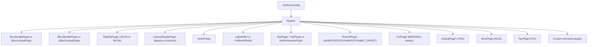

[← 11 Soft Cores And Soc Design Home](../README.md) · [← RISC-V Cores Home](README.md) · [← Project Home](../../../README.md)

# VexRiscv — SpinalHDL's Configurable RISC-V Soft Core

VexRiscv is a 32-bit RISC-V CPU generated from SpinalHDL — not hand-written Verilog, but a Scala software library that produces synthesizable RTL through metaprogramming. This approach allows pipeline depth, ISA extensions, cache topology, and debug infrastructure to be composed from a plugin system rather than hand-edited. It is the default CPU in LiteX and one of the few open soft cores capable of running mainline Linux on FPGA.

---

## Architecture

| Parameter | Options |
|---|---|
| **ISA** | RV32I[M][A][F][D][C] — any combination via plugins |
| **Pipeline** | 2-stage (smallest, ~500 LUTs) to 5-stage (full, ~3K LUTs) |
| **Bus Interfaces** | AXI4, Avalon, Wishbone (via IBus/DBus plugins) |
| **Caches** | Optional I$ and D$ (4 KB–16 KB each, configurable) |
| **MMU** | Optional hardware-refilled SV32 MMU (Linux-capable) |
| **FPU** | Optional F32/F64 (requires data cache) |
| **Debug** | JTAG debug module (RISC-V debug spec), OpenOCD + GDB |
| **Privilege** | Machine / Supervisor / User modes (CsrPlugin) |
| **Branch Prediction** | None, static, dynamic (BTB), or dynamic target |
| **Performance** | 0.52–1.44 DMIPS/MHz depending on configuration |

### Pipeline Variants

VexRiscv's pipeline is not fixed — the number of stages depends on which plugins are enabled:

```
5-stage (full):  Fetch → Decode → Execute → Memory → WriteBack
3-stage:         Decode → Execute → WriteBack
2-stage:         Fetch  → Execute  (minimal, no bypass)
```

The Fetch and Memory/WriteBack stages are optional. Removing them reduces area at the cost of lower IPC (no bypass paths, late result writes).

### Resource Usage by Configuration (Artix-7)

| Configuration | ISA | DMIPS/MHz | LUTs | FFs | fmax |
|---|---|---|---|---|---|
| **Smallest** (no bypass, no interrupt) | RV32I | 0.52 | 504 | 505 | 243 MHz |
| **Small + Productive** | RV32I | 0.82 | 816 | 534 | 232 MHz |
| **Full no-cache** (debug, exceptions, barrel shifter) | RV32IM | 1.21 | 1,418 | 949 | 216 MHz |
| **Full** (4 KB I$/D$, static branch) | RV32IM | 1.21 | 1,840 | 1,158 | 199 MHz |
| **Full max perf** (8 KB I$/D$, dynamic branch) | RV32IM | 1.38 | 1,935 | 1,216 | 200 MHz |
| **Full + MMU** (Linux-capable) | RV32IMA | 1.24 | 2,021 | 1,541 | 151 MHz |
| **Linux balanced** (Sv32, Supervisor) | RV32IMA | 1.21 | 2,883 | 2,130 | 180 MHz |

> [!NOTE]
> These numbers are synthesis-only (no place-and-route). Real fmax after P&R is typically 10–20% lower. The iCE40 numbers are ~50% lower in fmax and ~2× higher in LC count due to the iCE40's smaller LUT4 cells.

---

## The Plugin System

VexRiscv is not a single CPU — it is a **CPU generator**. Every functional unit is a SpinalHDL plugin that registers itself with the pipeline during elaboration:



### Key Plugins Reference

| Plugin | Function | When to Include |
|---|---|---|
| `IBusSimplePlugin` | Instruction bus, no cache | Tiny cores, tightly-coupled memory |
| `IBusCachedPlugin` | Instruction cache + bus | Any cached configuration |
| `DBusSimplePlugin` | Data bus, no cache | Minimal, sub-1K LUT targets |
| `DBusCachedPlugin` | Data cache + bus | Performance-critical, Linux |
| `RegFilePlugin` | Register file implementation | Always required; choose 1R1W (small) or 2R1W (full) |
| `HazardSimplePlugin` | Pipeline hazard resolution | Always required; bypass=true for performance, false for area |
| `IntAluPlugin` | Arithmetic/logic unit | Always required |
| `FullBarrelShifterPlugin` | Single-cycle shifts | Full configurations; use `LightShifterPlugin` for area |
| `MulPlugin` | Single-cycle multiplier | RV32M; requires DSP blocks or large LUT count |
| `DivPlugin` | 33-cycle divider | RV32M; iterative, shares multiplier input |
| `MulDivIterativePlugin` | Multi-cycle mul+div (area-saving) | When DSP slices are scarce |
| `BranchPlugin` | Branch resolution + prediction | Always required; choose prediction strategy |
| `CsrPlugin` | CSR file, privilege modes | Required for interrupts, exceptions, privilege |
| `MmuPlugin` | Sv32 hardware page table walker | Linux, bare-metal with virtual memory |
| `PmpPlugin` | Physical Memory Protection | Security, sandboxing |
| `DebugPlugin` | JTAG debug module | Development, GDB debugging |
| `FpuPlugin` | IEEE 754 F32/F64 | Floating-point workloads; requires D$ |

### How Plugins Communicate

Plugins interact through SpinalHDL's **pipeline service system**:

1. **Stage signals** — A plugin inserts data at one pipeline stage; the framework automatically pipelines it to later stages
2. **Services** — One plugin offers a service (e.g., exception handling); other plugins consume it (e.g., the divider emits a division-by-zero exception)
3. **Callbacks** — Plugins register hooks that fire during pipeline events (e.g., branch misprediction flush)

This decoupling means you can add a custom instruction plugin without modifying the ALU or decoder — the plugin system handles insertion into the pipeline automatically.

---

## Generating Custom Configurations

### Minimal Core (Scala)

```scala
// GenSmallest.scala — minimal RV32I, ~500 LUTs
object GenSmallest extends App {
  val config = VexRiscvConfig(
    plugins = List(
      // 2-stage pipeline, no bypass
      new IBusSimplePlugin(
        resetVector = 0x00000000L,
        cmdForkOnSecondStage = false,
        cmdForkPersistence = true
      ),
      new DBusSimplePlugin(
        catchAddressMisaligned = false,
        catchAccessFault = false
      ),
      new RegFilePlugin(
        regFileReadyKind = plugin.SYNC,
        zeroBoot = false
      ),
      new IntAluPlugin,
      new SrcPlugin(
        separatedAddSub = false,
        executeInsertion = true
      ),
      new LightShifterPlugin,
      new HazardSimplePlugin(
        bypassWrite = false,
        bypassRead = false,
        bypassExecute = false
      ),
      new BranchPlugin(
        earlyBranch = false,
        catchAddressMisaligned = false,
        prediction = NONE
      ),
      new YamlPlugin("cpu0.yaml")
    )
  )
  new VexRiscv(config)
}
```

### Full Linux-Capable Core (SBT)

```bash
# Generate a full Linux-capable VexRiscv Verilog
sbt "runMain vexriscv.demo.GenLinuxBalanced"
# Output: VexRiscv.v (synthesizable Verilog)
```

### Adding a Custom Instruction

```scala
// Custom instruction plugin — adds XOR-with-immediate
// (simplified example from VexRiscv documentation)
class XoriPlugin extends Plugin[VexRiscv] {
  override def setup(pipeline: VexRiscv): Unit = {
    import pipeline.config._
    val decoderService = pipeline.service(classOf[DecoderService])
    // Define the custom instruction encoding
    decoderService.add(
      key = M"""0000000----------100-----0110011""", // funct3=4, opcode=0x33
      List(
        SRC1_CTRL         -> Src1CtrlEnum.RS,
        SRC2_CTRL         -> Src2CtrlEnum.IMI,
        REGFILE_WRITE_VALID -> True,
        BYPASSABLE_EXECUTE_STAGE -> True,
        ALU_CTRL          -> AluCtrlEnum.XOR_IMM  // custom ALU control
      )
    )
  }
}
```

---

## LiteX Integration

VexRiscv is the **default CPU in LiteX** — the most common deployment path:

```python
# LiteX SoC with VexRiscv CPU
from litex.soc.integration.soc_core import SoCCore
from litex.soc.cores.cpu.vexriscv import VexRiscv

class MySoC(SoCCore):
    def __init__(self):
        super().__init__(
            cpu=VexRiscv(
                variant="linux",  # or "standard", "minimal", "debug"
            ),
            l2_size=8192,
        )
```

### LiteX Variants

| Variant | Features | Use Case |
|---|---|---|
| `"standard"` | RV32IM, I$/D$, debug | Default — balanced performance/area |
| `"minimal"` | RV32I, no cache, no debug | Smallest footprint, bare-metal control |
| `"debug"` | Same as standard + JTAG debug | Development and debugging |
| `"linux"` | RV32IMA, MMU, Supervisor, FPU | Running Linux |
| `"linux+smp"` | Multi-core Linux (2–4 cores) | SMP Linux on larger FPGAs |

---

## Linux on VexRiscv

VexRiscv is one of only a few soft cores that runs **mainline Linux** on FPGA. The Linux-on-LiteX-VexRiscv project provides a complete, reproducible build:

```
Linux-on-LiteX-VexRiscv Build Flow
1. LiteX generates SoC RTL (VexRiscv + LiteDRAM + peripherals)
2. Vivado/Quartus synthesizes bitstream for target board
3. Buildroot builds root filesystem
4. Linux kernel (riscv32, MMU-enabled) compiled with VexRiscv defconfig
5. Boot: FPGA bitstream → LiteX BIOS → Linux kernel → rootfs
```

**Supported boards for Linux:** Arty A7, DE10-Nano, ECPIX-5 (ECP5), ULX3S, Versa ECP5-5G

**Minimum requirements for Linux:**
- VexRiscv "linux" variant (~2,900 LUTs on Artix-7)
- 32+ MB RAM (SDRAM or DDR3)
- UART for console
- Storage (SD card, TFTP, or bitstream-initramfs)

---

## Debug with OpenOCD + GDB

The `DebugPlugin` provides a JTAG debug module compatible with the RISC-V Debug Specification v0.13:

```bash
# Start OpenOCD with VexRiscv target
openocd -f interface/ft2232h.cfg -f target/vexriscv.cfg

# Connect GDB
riscv32-unknown-elf-gdb
(gdb) target remote :3333
(gdb) load firmware.elf
(gdb) break main
(gdb) continue
```

The debug plugin supports:
- Hardware breakpoints (configurable count)
- Single-step execution
- Register access while halted
- Memory read/write via abstract commands

---

## Use Cases

| Use Case | Configuration | Why VexRiscv |
|---|---|---|
| LiteX SoC CPU (most common) | "standard" variant | Balanced performance/area, Wishbone interconnect |
| Linux on soft core | "linux" variant (MMU + Supervisor) | One of few soft cores that runs mainline Linux |
| Minimal controller | "minimal" variant (~500 LUTs) | Smallest RISC-V with full ISA compatibility |
| Custom instruction acceleration | Custom plugin | Add domain-specific instructions without forking RTL |
| Multi-core SMP | "linux+smp" variant | Cluster of VexRiscv cores sharing L2 via LiteX |
| Educational CPU design | SpinalHDL source | Study how pipeline plugins compose |

---

## When to Use / When NOT to Use

### When to Use

- **LiteX SoC projects** — VexRiscv is the default CPU for good reason; it works out of the box
- **You need Linux on a soft core** — VexRiscv is the most mature RV32 Linux option
- **You want to customize the CPU** — The plugin system is the most flexible of any open core
- **Resource-constrained FPGA** — The smallest configuration fits in ~500 LUTs

### When NOT to Use

- **You need 64-bit RISC-V** — VexRiscv is RV32 only; use Rocket or CVA6
- **You need production ASIC** — VexRiscv targets FPGA; Ibex is better verified for ASIC
- **You don't want a Java/Scala build dependency** — SpinalHDL requires SBT + JDK; use PicoRV32 (pure Verilog) instead
- **You need formal verification** — VexRiscv has limited formal proofs; Ibex/CV32E40S is better for safety-critical designs

---

## Best Practices

1. **Start from an existing GenXxx.scala** — Don't write a configuration from scratch; copy and modify the closest demo
2. **Use the LiteX variant system** — If deploying in LiteX, use the built-in variants before customizing
3. **Enable `DebugPlugin` during development** — GDB access saves hours of printf debugging; remove it for production to save ~200 LUTs
4. **Choose `LightShifterPlugin` for area** — The full barrel shifter costs ~150 extra LUTs; the iterative shifter costs 1 cycle per bit
5. **Use `MulDivIterativePlugin` when DSP blocks are scarce** — The single-cycle multiplier uses DSP slices; the iterative version uses LUTs instead

## Antipatterns

| Antipattern | Why It Fails | Correct Approach |
|---|---|---|
| **Forking VexRiscv Verilog to add features** | Loses plugin composability; every change requires re-fork | Add a custom plugin in SpinalHDL; the generator handles integration |
| **Using the full 5-stage config when 2-stage suffices** | Wastes ~1,500 LUTs on pipeline stages you don't need | Start with GenSmallest and add features incrementally |
| **Enabling FPU without data cache** | FpuPlugin requires DBusCachedPlugin; synthesizes but fails at runtime | Add `DBusCachedPlugin` before `FpuPlugin` |
| **Ignoring cache trashing in benchmarks** | 4 KB caches trash during Dhrystone; reported DMIPS/MHz underestimates | Use 8 KB caches for accurate benchmarking, or use tight-loop test binaries |

---

## Pitfalls

### 1. SpinalHDL Build Environment

VexRiscv requires **Java 8+ (JDK), SBT (Scala Build Tool), and SpinalHDL**. This is a non-trivial setup compared to pure Verilog cores:

```bash
# Install dependencies (Ubuntu)
sudo apt-get install openjdk-11-jdk sbt
# Generate Verilog from Scala source
 git clone https://github.com/SpinalHDL/VexRiscv.git
 cd VexRiscv
 sbt "runMain vexriscv.demo.GenFull"
```

The first `sbt` run downloads ~500 MB of dependencies. Subsequent runs are faster.

### 2. Cache Coherence in SMP Configurations

The `linux+smp` variant uses multiple VexRiscv cores sharing an L2 cache via LiteX, but **the cores do not have hardware cache coherence**. Linux uses software-based cache flushing (via `sync` instructions) — this is correct but slower than hardware coherence.

### 3. MMU Reduces fmax Significantly

Adding the `MmuPlugin` drops fmax from ~200 MHz to ~150 MHz on Artix-7 due to the page table walker adding a long critical path through the execute and memory stages.

### 4. Bus Plugin Selection Affects FPGA Fitting

`IBusSimplePlugin` and `IBusCachedPlugin` generate very different interconnect structures. The simple plugin produces a single-cycle memory interface; the cached plugin adds a cache controller with tag comparison. Mixing simple and cached plugins on the same bus can create timing issues.

---

## Vendor Cross-Reference

| Feature | VexRiscv (SpinalHDL) | PicoRV32 (Verilog) | NEORV32 (VHDL) | Ibex (SystemVerilog) |
|---|---|---|---|---|
| **Language** | Scala/SpinalHDL → Verilog | Pure Verilog | Pure VHDL | SystemVerilog |
| **Configurability** | Plugin system (max) | Verilog parameters | VHDL generics | Build options |
| **Min LUTs** | ~500 | ~750 | ~2,000 | ~3,000 |
| **Linux** | Yes (MMU) | No | No | No |
| **FPU** | F32/F64 | No | No | No |
| **Debug** | JTAG + GDB | UART only | JTAG + GDB | JTAG + GDB |
| **Formal verification** | Limited | None | Limited | Extensive (OpenTitan) |
| **Best for** | Flexible SoC, Linux | Minimal control | Well-documented SoC | Security-critical |

---

## References

- [VexRiscv GitHub Repository](https://github.com/SpinalHDL/VexRiscv) — source code, demo configurations, documentation
- [SpinalHDL Documentation — VexRiscv](https://spinalhdl.github.io/SpinalDoc-RTD/master/SpinalHDL/Libraries/vexriscv.html) — plugin reference
- [Linux-on-LiteX-VexRiscv](https://github.com/enjoy-digital/linux-on-litex-vexriscv) — complete Linux build for multiple FPGA boards
- [VexRiscv OpenOCD Debugging](https://tomverbeure.github.io/2021/07/18/VexRiscv-OpenOCD-and-Traps.html) — detailed debug walkthrough
- [VexiiRiscv](https://github.com/SpinalHDL/VexiiRiscv) — next-generation successor (dual-issue, early access)
- [LiteX Overview](../../12_open_source_open_hardware/litex/litex_overview.md) — SoC builder framework
- [RISC-V ISA](../riscv/riscv_isa.md) — instruction set reference
- [RISC-V Privileged](../riscv/riscv_privileged.md) — privilege modes and CSRs
