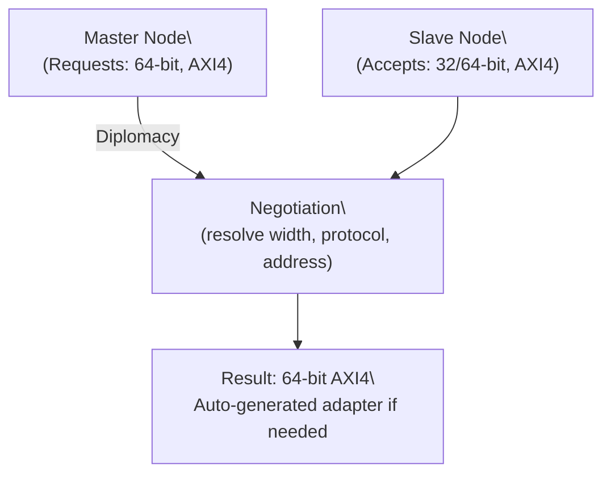

[← 11 Soft Cores And Soc Design Home](../README.md) · [← SoC Design Home](README.md) · [← Project Home](../../../README.md)]

# Chipyard / Rocket Chip — Chisel SoC Generation Framework

Chipyard is Berkeley's open-source SoC design framework built around the Rocket Chip generator — a Scala/Chisel library that produces complete RISC-V SoCs from configuration files. Its killer feature is **Diplomacy**, a type-safe parameter negotiation system that resolves bus widths, address maps, and cache coherence policies at elaboration time, before any Verilog is emitted.

---

## What Rocket Chip / Chipyard Provides

| Component | What It Generates |
|---|---|
| **Rocket Core** | RV64IMAFDC, 5-stage in-order CPU (see [High-Perf RISC-V](../riscv_cores/high_perf_riscv_cores.md)) |
| **BOOM Core** | RV64IMAFDC, out-of-order (optional) |
| **TileLink Interconnect** | Coherent on-chip network (Berkeley's alternative to AXI/ACE) |
| **L1/L2 Caches** | Configurable size, inclusive/exclusive policies |
| **Peripherals** | UART, SPI, GPIO, JTAG debug, Boot ROM, interrupt controller |
| **RoCC Interface** | Rocket Custom Coprocessor — attach FPGA accelerators tightly |

---

## Diplomacy: Parameter Negotiation at Elaboration

### The Problem Diplomacy Solves

In traditional SoC design, connecting two IP blocks requires manually matching:
- Bus data widths (32-bit? 64-bit? 128-bit?)
- Address map assignments (which peripheral at which address?)
- Cache coherence protocol (none? write-through? write-back?)
- Protocol version compatibility

Any mismatch causes subtle bugs that appear only during simulation — or worse, during silicon testing.

### How Diplomacy Works

Diplomacy is a Chisel-embedded type system that **negotiates parameters between blocks at elaboration time** (Java/Scala compilation), before any Verilog exists:

```scala
// Two blocks negotiate bus width automatically
val master = LazyModule(new MyMaster())  // Wants 64-bit bus
val slave  = LazyModule(new MySlave())   // Supports 32 or 64-bit
slave.node := master.node  // Diplomacy checks compatibility and resolves to 64-bit
```



### Diplomacy Node Types

| Node Type | Role | Example |
|---|---|---|
| `ClientNode` | Initiates requests (master) | CPU instruction fetch port |
| `ManagerNode` | Responds to requests (slave) | Memory-mapped peripheral |
| `AdapterNode` | Translates between protocols | AXI4 → TileLink bridge |
| `IdentityNode` | Pass-through (no transformation) | Debug wrapper |

When you connect nodes with `:=`, Diplomacy automatically:
1. Checks that protocol versions match
2. Resolves data widths (inserts width adapters if needed)
3. Assigns address ranges
4. Generates the appropriate wiring in the emitted Verilog

### Address Map Generation

Diplomacy automatically computes the SoC's address map and generates C headers for software:

```c
/* Auto-generated by Chipyard */
#define UART_BASE  0x10000000L
#define UART_SIZE  0x00001000L
#define SPI_BASE   0x10001000L
#define SPI_SIZE   0x00001000L
#define DDR_BASE   0x80000000L
#define DDR_SIZE   0x40000000L
```

No more hand-maintained address maps that drift out of sync with hardware.

---

## RoCC: Rocket Custom Coprocessor Interface

The RoCC (Rocket Custom Coprocessor) interface allows custom hardware accelerators to be tightly coupled with a Rocket core:

```
Rocket Core ←→ RoCC Accelerator
┌───────────────────────┐     ┌───────────────────────┐
│ Rocket Pipeline       │     │ Custom Accelerator    │
│                       │     │                       │
│ ┌───────┐  cmd        │     │ ┌───────┐             │
│ │Decode │────────────→│     │ │ FSM   │             │
│ │Stage  │  funct/rd/rs│     │ │       │             │
│ └───────┘             │     │ └───────┘             │
│                       │     │                       │
│ ┌───────┐  data       │     │ ┌───────┐  result     │
│ │Execute│←────────────│────→│ │ ALU   │────────────→│
│ │Stage  │             │     │ │ Array │             │
│ └───────┘             │     │ └───────┘             │
│                       │     │                       │
│ ┌───────┐  mem        │     │ ┌───────┐             │
│ │Memory │←────────────│────→│ │ SRAM  │             │
│ │Stage  │             │     │ │       │             │
│ └───────┘             │     │ └───────┘             │
└───────────────────────┘     └───────────────────────┘
```

### RoCC Accelerator Example (Chisel)

```scala
// Simple accumulator RoCC accelerator
class Accumulator(opcodes: OpcodeSet)
    extends LazyRoCC(opcodes, nPTWPorts = 0) {

  override lazy val module = new LazyRoCCModuleImp(this) {
    val reg = RegInit(0.U(64.W))

    // Command from Rocket decode stage
    when(io.cmd.fire) {
      when(io.cmd.inst.funct === 0.U) {
        reg := reg + io.cmd.rs1  // ACCUMULATE
      }.elsewhen(io.cmd.inst.funct === 1.U) {
        reg := 0.U               // CLEAR
      }
    }

    // Return result to Rocket
    io.resp.bits.data := reg
    io.resp.valid := RegNext(io.cmd.fire)

    // No memory operations
    io.mem.req.valid := false.B
    io.busy := false.B
    io.interrupt := false.B
  }
}
```

### RoCC Opcodes

RoCC uses custom opcodes in the RISC-V instruction encoding:

| Opcode | Format | Custom Name |
|---|---|---|
| `0b0001011` | R-type, funct7=custom-0 | `custom-0` |
| `0b0011011` | R-type, funct7=custom-1 | `custom-1` |
| `0b0101011` | R-type, funct7=custom-2 | `custom-2` |
| `0b0111011` | R-type, funct7=custom-3 | `custom-3` |

Your accelerator claims one or more of these opcodes; the Rocket decoder routes matching instructions to the accelerator instead of the ALU.

---

## FPGA Mapping

| Target | Works? | Notes |
|---|---|---|
| **Kintex-7 (325T+)** | Yes | Rocket single-core fits, BOOM needs 325T+ |
| **Zynq Ultrascale+** | Yes | Can co-exist with hard ARM cores |
| **VCU118** | Yes | Primary target for Chipyard FPGA prototyping |
| **Artix-7 (100T+)** | Limited | Rocket fits without L2 cache; tight |
| **ECP5 / iCE40** | No | Too small for 64-bit Rocket; use VexRiscv |
| **Cyclone V (110K)** | Marginal | Rocket fits, tight — no room for large accelerators |

### Chipyard FPGA Build Flow

```bash
# Build Chipyard SoC for VCU118 (FPGA prototyping)
cd chipyard
make -C sims/vcs CONFIG=RocketConfig \
     PLATFORM=fpga \
     TARGET=vcu118

# Or for Verilator simulation (no FPGA needed)
make -C sims/verilator CONFIG=RocketConfig
```

---

## When to Use Chipyard vs Alternatives

| Scenario | Chipyard | LiteX |
|---|---|---|
| Need RV64 Linux SoC | Yes | No (LiteX = mostly RV32) |
| Want to attach custom accelerators | Yes (RoCC interface) | Yes (Wishbone/AXI) |
| Need fast iteration (minutes) | No (Chisel compile = slow, 5–15 min) | Yes (Python config = fast, 1–3 min) |
| Targeting small FPGAs | No | Yes (ECP5, iCE40) |
| Need TileLink coherence | Yes | No (LiteX uses Wishbone/AXI) |
| Team knows Scala/Chisel | Yes | No (use LiteX with Python) |
| Auto-generated address maps | Yes (Diplomacy) | Yes (LiteX CSR generator) |
| Need production-quality verification | Yes (RISC-V DV, FPV) | Limited |

---

## When to Use / When NOT to Use

### When to Use

- **64-bit RISC-V SoC design** — Chipyard + Rocket is the most mature RV64 SoC framework
- **Custom accelerator integration** — RoCC provides the tightest CPU↔accelerator coupling available
- **Multi-core coherent SoC** — TileLink provides hardware cache coherence
- **ASIC prototyping** — Chipyard's Diplomacy and verification infrastructure target ASIC tape-outs

### When NOT to Use

- **Small FPGA designs** — Rocket alone needs 15K+ LUTs; use VexRiscv or PicoRV32
- **Rapid prototyping** — Chisel compilation takes 5–15 minutes per iteration; LiteX is faster
- **No Chisel expertise** — Chipyard requires Scala/Chisel knowledge; CVA6 (SystemVerilog) is more accessible
- **Simple microcontroller** — A single VexRiscv or NEORV32 is simpler and smaller

---

## Best Practices

1. **Start from an existing config** — Chipyard ships with `RocketConfig`, `LargeBoomConfig`, etc.; copy and modify rather than writing from scratch
2. **Use Diplomacy for all interconnect** — Don't hand-wire TileLink; let Diplomacy handle address assignment and width adaptation
3. **Test in Verilator before FPGA** — Verilator simulation is 10× faster than FPGA synthesis; catch functional bugs early
4. **Use the generated C headers** — Diplomacy auto-generates `address_map.h`; always use these instead of hand-written defines
5. **Budget for long build times** — Chisel elaboration + FIRRTL compilation + Verilog generation = 5–15 minutes; plan your iteration cycle

## Antipatterns

| Antipattern | Why It Fails | Correct Approach |
|---|---|---|
| **Hand-editing generated Verilog** | Changes are overwritten on next build; impossible to maintain | Modify the Chisel/Scala source and regenerate |
| **Hardcoding address maps** | Diplomacy manages addresses; hardcoding causes conflicts when config changes | Use auto-generated C headers from Diplomacy |
| **Using Chipyard for simple designs** | 15K+ LUT overhead for Rocket alone; Diplomacy adds complexity for simple SoCs | Use LiteX + VexRiscv for small/medium designs |
| **Skipping Verilator simulation** | FPGA synthesis takes 30+ minutes; catching bugs in simulation saves hours | Always verify in Verilator before FPGA build |

---

## Pitfalls

### 1. Chisel Build Time

Chipyard's build chain is slow:
- Chisel elaboration: 1–3 minutes
- FIRRTL → Verilog compilation: 2–5 minutes
- Vivado synthesis: 15–45 minutes

**Total per iteration: 20–50 minutes.** Compare with LiteX's 2–5 minute full build.

### 2. Generated Verilog Readability

The Verilog emitted by Chisel is machine-generated and nearly unreadable — thousands of `_T_1`, `_T_2` signal names. Debugging at the Verilog level requires cross-referencing with the Chisel source.

### 3. TileLink ↔ AXI Bridge Overhead

If you need to connect Rocket to AXI peripherals (DDR controllers, PCIe blocks), the TileLink-to-AXI bridge adds latency and area. The bridge is well-tested but adds ~1–2 cycles of latency per transaction.

---

## References

- [Chipyard GitHub Repository](https://github.com/ucb-bar/chipyard) — framework, examples, documentation
- [Chipyard Documentation (ReadTheDocs)](https://chipyard.readthedocs.io/) — configuration, build flow, RoCC guide
- [Rocket Chip GitHub](https://github.com/chipsalliance/rocket-chip) — core generator library
- [TileLink Specification](https://www.sifive.com/documentation/tilelink/tilelink-spec/) — interconnect protocol
- [Diplomacy Paper (Berkeley)](https://carrv.github.io/papers/asanovic-diplomacy-carrv2017.pdf) — parameter negotiation design
- [High-Performance RISC-V Cores](../riscv_cores/high_perf_riscv_cores.md) — Rocket, BOOM, CVA6 deep dive
- [LiteX Overview](../../12_open_source_open_hardware/litex/litex_overview.md) — Python-based alternative
- [VexRiscv](../riscv_cores/vexriscv.md) — practical RV32 soft core alternative
