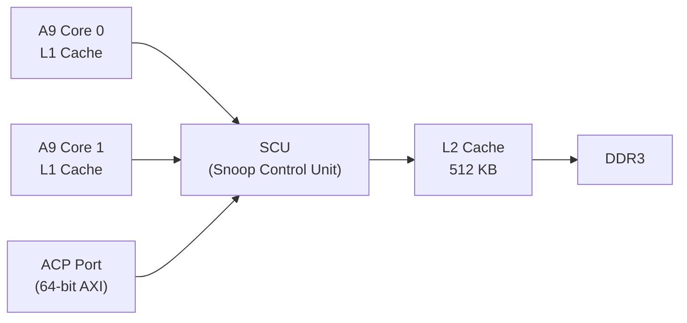

[← 11 Soft Cores And Soc Design Home](../README.md) · [← Soc Design Home](README.md) · [← Project Home](../../../README.md)

# Multi-Core Coherency on FPGA SoCs

Adding a second CPU core sounds simple, but cache coherency makes it one of the hardest problems in FPGA SoC design. When Core 0 writes a variable that Core 1 reads, the data must be visible — and without coherency hardware, it won't be.

This article covers the coherency problem, the ARM coherency protocols (ACP, ACE, ACE-Lite), how Zynq implements coherency, and when multi-core on FPGA makes sense vs when it doesn't.

---

## The Coherency Problem

```
Core 0 (L1: addr X = 42)     Core 1 (L1: addr X = 42)
        │                              │
        │ Core 0 writes X = 99         │
        │ (L1 updated, DDR still 42)   │ Core 1 reads X
        │                              │ (L1 hit → returns 42! WRONG!)
```

Without coherency, Core 1 sees stale data. This is not a software bug — it's a hardware limitation. The CPU's L1 cache is **write-back**: writes stay in cache until evicted. DDR doesn't see the update until the cache line is flushed.

### MESI Protocol — The Foundation

Modern ARM cores use MESI (Modified, Exclusive, Shared, Invalid) to track cache line state:

| State | Meaning | Can Read? | Can Write? | In Other Caches? |
|---|---|---|---|---|
| **M** (Modified) | This cache has the only valid copy; DDR is stale | Yes | Yes | No |
| **E** (Exclusive) | This cache has the only valid copy; DDR is current | Yes | Yes (→ M) | No |
| **S** (Shared) | This cache has a read-only copy; others may too | Yes | No (must upgrade) | Possibly |
| **I** (Invalid) | Line not present | No | No | — |

**MESI in action:**
1. Core 0 reads X → cache miss → fetch from DDR → state = E
2. Core 1 reads X → snoop hits Core 0 → both get state = S
3. Core 0 writes X → upgrade to M → Core 1 invalidated to I
4. Core 1 reads X → cache miss (I) → snoop → Core 0 writes back → both S again

---

## Coherency Solutions for FPGA

| Solution | How | FPGA Cost | Latency | When |
|---|---|---|---|---|
| **Software-managed** | Explicit cache flush/invalidate in code | Zero | Highest (CPU stalls) | Bare-metal, AMP, deterministic |
| **ACP** (Zynq-7000) | FPGA accesses via Snoop Control Port | Zero (hard IP) | ~10 ns extra | Single accelerator sharing data with CPU |
| **ACE-Lite** (Zynq UltraScale+) | FPGA is I/O coherent slave at CCI | Zero (hard IP) | ~20 ns extra | Multiple accelerators, DMA coherency |
| **ACE** (full) | FPGA participates as coherency peer | ~10K LUTs for cache | Variable | FPGA with its own cache (rare) |
| **Don't share memory** | Each core has private region | Zero | N/A | AMP, independent tasks |

---

## ACP — Accelerator Coherency Port (Zynq-7000)

The ACP is a 64-bit AXI slave port on the Zynq-7000 SCU (Snoop Control Unit) that gives the PL direct access to the CPU's L1/L2 caches.



```
FPGA DMA ──► ACP port ──► SCU ──► L2 Cache ──► DDR
                                 ↑ Snoop hit: return cached data
```

### ACP Read Path

1. FPGA issues AXI read on ACP port
2. SCU checks L1 caches of both Cortex-A9 cores
3. **Snoop hit:** Data returned from L1 (DDR not accessed)
4. **Snoop miss:** Data fetched from L2 or DDR

### ACP Write Path

1. FPGA issues AXI write on ACP port
2. SCU checks if any L1 has that cache line in Shared/Exclusive
3. **Hit:** Invalidates other cores' copies; updates L2
4. FPGA write is now visible to both CPU cores

### ACP Limitations

| Limitation | Detail |
|---|---|
| **Only 1 port** | Only one ACP on Zynq-7000; shared among all FPGA masters |
| **64-bit width** | vs 128-bit on HP ports → lower bandwidth |
| **No FPGA cache** | ACP makes FPGA coherent with CPU, but FPGA has no cache to snoop |
| **Zynq-7000 only** | Not available on Zynq UltraScale+ (use ACE-Lite instead) |
| **Burst limitation** | Max 4-beat bursts on ACP vs 16 on HP |

### When to Use ACP

| ✅ Use ACP | ❌ Don't Use ACP |
|---|---|
| FPGA accelerator reads data that CPU just wrote | Bulk data transfer (video frames, DMA buffers) |
| Shared control structures (ring buffers, semaphores) | Streaming data (use HP + manual cache mgmt) |
| Low-latency inter-core communication | High-bandwidth transfers (ACP is bandwidth-limited) |

---

## ACE-Lite — I/O Coherency (Zynq UltraScale+)

Zynq UltraScale+ replaces ACP with [ACE-Lite](https://developer.arm.com/documentation/ddi0470/i/functional-description/snoop-connectivity-and-control), connected through the CCI-400 (Cache Coherent Interconnect).

### ACE Protocol Family

| Protocol | Master Type | Coherency Level | FPGA Usage |
|---|---|---|---|
| **AXI4** | Non-coherent master | None | Default for HP ports |
| **ACE-Lite** | I/O coherent master | Can snoop CPU caches; CPU can't snoop FPGA | FPGA accelerators, DMA engines |
| **ACE** | Full coherent master | Bidirectional snoop; FPGA participates as peer | FPGA with own cache (rare) |

### ACE-Lite Signal Extensions

ACE-Lite adds to AXI4:

| Signal Group | Direction | Purpose |
|---|---|---|
| `ARDOMAIN` / `AWDOMAIN` | Master → Interconnect | Coherency domain (Inner, Outer, System, Non-shareable) |
| `ARSNOOP` / `AWSNOOP` | Master → Interconnect | Snoop type: ReadShared, ReadClean, ReadOnce, etc. |
| `RRESP` / `BRESP` | Interconnect → Master | Coherency response: Pass, Fail, Snoop |

### ACE-Lite Read Transaction Flow

```
1. FPGA issues ARDOMAIN=Inner, ARSNOOP=ReadShared
2. CCI forwards to L2 and all ACE masters
3. If another master has the line in Modified state:
   a. CCI sends snoop to that master
   b. Master returns data and downgrades to Shared
4. FPGA receives data + RRESP=PassSnoop
5. FPGA does NOT cache the data (ACE-Lite has no cache)
```

### Zynq UltraScale+ Coherent Port Selection

| Port | Coherency | Bandwidth | Use For |
|---|---|---|---|
| **HPC0 (ACE-Lite)** | I/O coherent | 128-bit, 128 GB/s | Accelerator reading CPU data |
| **HPC1 (ACE-Lite)** | I/O coherent | 128-bit, 128 GB/s | Second coherent accelerator |
| **HP0–HP3** | Non-coherent | 128-bit, 128 GB/s | Bulk DMA, streaming |
| **LPD (Low-Power)** | Non-coherent | 64-bit | RPU (Cortex-R5) access |

---

## CCI-400 — The Coherency Interconnect

The CCI-400 in Zynq UltraScale+ connects:
- 2× Cortex-A53 clusters (ACE masters)
- 2× ACE-Lite slave interfaces (for FPGA HPC ports)
- 1× I/O-coherent master (DCCI for I/O peripherals)

```
┌──────────────┐     ┌──────────────┐
│ A53 Cluster 0│     │ A53 Cluster 1│
│ (ACE master) │     │ (ACE master) │
└──────┬───────┘     └──────┬───────┘
       │                     │
       └────────┬────────────┘
                │
         ┌──────▼──────┐
         │   CCI-400    │
         │  (Snoop +   │
         │   Directory) │
         └──┬───────┬──┘
            │       │
    ┌───────▼──┐  ┌─▼────────┐
    │ HPC0     │  │ HPC1     │
    │ ACE-Lite │  │ ACE-Lite │
    │ (FPGA)   │  │ (FPGA)   │
    └──────────┘  └──────────┘
            │       │
         ┌──▼───────▼──┐
         │   DDR4      │
         └─────────────┘
```

### CCI Snoop Behavior

| Master Type | Snoop Generated? | Snoop Received? |
|---|---|---|
| ACE master (A53) | Yes — on every cache miss | Yes — must respond to other masters' snoops |
| ACE-Lite master (FPGA HPC) | Yes — ARSNOOP on every read | No — FPGA has no cache to snoop into |
| AXI4 master (HP ports) | No | No |

---

## Cache Stashing

Cache stashing is an optimization where a DMA write targets a specific CPU's cache, avoiding the latency of a subsequent CPU read from DDR.

```
Without stashing:
  DMA writes → DDR → CPU reads (DDR access latency ~100 ns)

With stashing:
  DMA writes → L2 cache → CPU reads (L2 hit ~10 ns)
```

### Implementation on Zynq UltraScale+

```c
// Linux: Use dma_map_resource() with DMA_ATTR_FORCE_CONTIGUOUS
// or explicitly target HPC port for coherent writes

// In FPGA: route DMA writes through HPC0 (ACE-Lite)
// CCI automatically stashes data in L2 if the CPU recently accessed that address
```

Cache stashing is **automatic** when using ACE-Lite — the CCI checks if any CPU has accessed the target address recently and keeps the data in L2. No software changes needed.

---

## Software Coherency — Manual Cache Management

When hardware coherency is unavailable (soft cores, non-coherent HP ports), you must manage caches in software:

### Bare-Metal (MicroBlaze, RISC-V soft cores)

```c
// After FPGA DMA writes to shared buffer:
Xil_DCacheInvalidateRange((u32)shared_buf, size);
// Invalidates CPU cache → next read fetches from DDR

// Before FPGA DMA reads from shared buffer:
Xil_DCacheFlushRange((u32)shared_buf, size);
// Writes dirty cache lines to DDR → DMA sees fresh data
```

### Linux Kernel

```c
// DMA to device (CPU → FPGA):
dma_sync_single_for_device(dev, dma_handle, size, DMA_TO_DEVICE);
// Flushes CPU cache lines → data in DDR for FPGA DMA to read

// DMA from device (FPGA → CPU):
dma_sync_single_for_cpu(dev, dma_handle, size, DMA_FROM_DEVICE);
// Invalidates CPU cache lines → next CPU read fetches from DDR
```

### Linux Userspace

```c
// Using /proc/sys/vm/drop_caches is NOT the right approach.
// Instead, use mmap() with MAP_SHARED and msync():

// After FPGA writes to shared buffer:
msync(shared_buf, size, MS_SYNC);    // Force write-back
// Before CPU reads:
// The kernel handles cache maintenance on page fault / mmap sync
```

---

## When NOT to Use Multi-Core on FPGA

| Reason | Explanation |
|---|---|
| **LUT budget** | Each soft core = 3K–15K LUTs; coherency adds 5K–10K more |
| **FPGA fmax** | Soft cores run 50–150 MHz, not 1+ GHz — diminishing returns |
| **Linux SMP overhead** | SMP kernel adds scheduler complexity; AMP is simpler |
| **Debug difficulty** | Multi-core race conditions are 10× harder to reproduce |
| **Coherency power** | Snooping consumes dynamic power on every cache access |
| **Verification** | Proving coherency correct requires formal methods, not simulation |

**Better alternative:** One fast core + DMA engines + hardware accelerators for parallel work. This is the standard FPGA SoC architecture:

```
┌──────────┐  ┌──────┐  ┌──────────┐
│ 1× CPU   │  │ DMA  │  │ HW accel │
│ (A53 or  │  │engine│  │ (ML,     │
│  RISC-V) │  │      │  │  crypto) │
└────┬─────┘  └──┬───┘  └────┬─────┘
     │           │           │
     └───────────┼───────────┘
                 │
            ┌────▼────┐
            │  DDR4   │
            └─────────┘
```

---

## Common Pitfalls

| Pitfall | Symptom | Fix |
|---|---|---|
| **Using HP port for shared data** | CPU reads stale data after FPGA write | Use HPC (ACE-Lite) for shared data; HP for bulk streaming |
| **Forgetting cache maintenance** | Intermittent data corruption on non-coherent paths | Always `dma_sync_single_for_cpu/device` on HP ports |
| **ACP bandwidth bottleneck** | DMA throughput drops 4× vs HP port | Use ACP only for small shared structures; use HP for bulk data |
| **MESI state misunderstanding** | Expecting immediate visibility after write | Write is visible only after L1 write-back; use DMB/DSB barriers |
| **ACE-Lite without CCI** | FPGA writes don't snoop CPU | CCI must be configured; check CCI slave interface enable bits |
| **Multiple FPGA masters on one HPC** | Coherency transactions conflict | One master per HPC port; arbitrate in interconnect |

---

## References

| Document | Source | What It Covers |
|---|---|---|
| [CCI-400 Snoop Connectivity](https://developer.arm.com/documentation/ddi0470/i/functional-description/snoop-connectivity-and-control) | ARM | CCI-400 snoop topology and ACE-Lite interface |
| [AMBA AXI and ACE Specification](https://www.arm.com/architecture/system-architectures/amba/amba-5) | ARM | ACE/ACE-Lite protocol reference |
| [DMA Architecture](dma_architecture.md) | This KB | DMA engines, descriptor chains, coherency from DMA perspective |
| [Memory Map Design](memory_map_design.md) | This KB | Address decoder patterns, AXI address filtering |
| [Interrupt Routing](interrupt_routing.md) | This KB | GIC, PLIC, NVIC, FPGA IRQ mapping |
