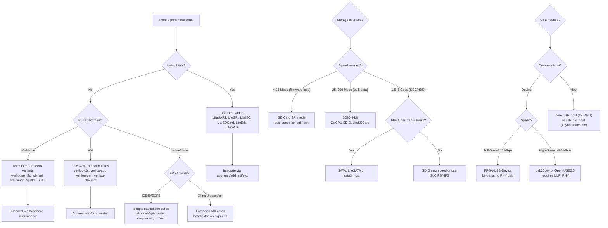

[← 12 Open Source Open Hardware Home](../README.md) · [← Cores Catalog Home](README.md) · [← Project Home](../../../README.md)

# Peripheral Core Catalog — Serial, Timer, GPIO & System IP

A catalog of open-source FPGA peripheral cores: the serial protocol controllers, timers, GPIO, memory interfaces, and utility IP blocks that form the backbone of virtually every FPGA SoC design. Unlike CPU cores or DMA engines, these peripherals are simple individually — but selecting the right one and integrating it correctly is what separates a working SoC from a debug nightmare.

---

## Overview

Every FPGA SoC needs the same basic infrastructure: a way to talk to the outside world (UART, SPI, I²C), a way to keep time (timers, watchdogs), a way to wiggle pins (GPIO), and glue logic to connect everything (bus bridges, interrupt controllers). The open-source ecosystem provides multiple implementations of each, with varying levels of maturity, bus attachment, and FPGA-family support.

The key decision axis for peripheral selection is **bus attachment** — Wishbone (LiteX/OpenCores), AXI (Xilinx/vendor), or native register interfaces (standalone). Pick the wrong bus and you'll spend more time on bridge logic than on your actual design.

---

## Serial Protocol Controllers

### I²C

| Core | Mode | Bus Attachment | Clock Stretching | Multi-Master | FPGA Verified | Repository |
|---|---|---|---|---|---|---|
| **wishbone_i2c** | Master/Slave | Wishbone | ✅ | ✅ | ECP5, Artix-7, Cyclone IV | olofk/wishbone_i2c |
| **i2c-master** | Master only | Native (AXI adapter available) | ✅ | No | iCE40, ECP5, Artix-7 | olofk/i2c |
| **Alex Forencich I²C** | Master/Slave | AXI-Stream / AXI-Lite | ✅ | ✅ | Ultrascale+ | alexforencich/verilog-i2c |
| **LiteI2C** | Master | LiteX (CSR) | ✅ | No | ECP5, Artix-7 | litex-hub/litei2c |

> **Selection tip**: If you're using LiteX, use LiteI2C. If you need AXI, use Forencich's. For Wishbone SoCs, wishbone_i2c is the most complete.

### SPI

| Core | Mode | Bus Attachment | CPOL/CPHA | Dual/Quad SPI | FPGA Verified | Repository |
|---|---|---|---|---|---|---|
| **spi-master** | Master | Native | Configurable | No | iCE40, ECP5, Artix-7 | jakubcab/spi-master |
| **Alex Forencich SPI** | Master/Slave | AXI-Stream | Configurable | ✅ QSPI | Ultrascale+ | alexforencich/verilog-spi |
| **LiteSPI** | Master | LiteX (CSR + DMA) | Configurable | ✅ QSPI, xIP | ECP5, Artix-7 | litex-hub/litespi |
| **spi-flash** | Master (flash-only) | Native | Mode 0 only | ✅ Dual/Quad | iCE40, ECP5 | various |
| **wb_spi** | Master | Wishbone | Configurable | No | ECP5, Artix-7 | olofk/wb_spi |

### UART

| Core | Baud Rate | Bus Attachment | Hardware Flow Control | FIFO Depth | FPGA Verified | Repository |
|---|---|---|---|---|---|---|
| **uart2bus** | Up to 3 MBaud | Wishbone (register bridge) | No | 16 bytes | ECP5, Artix-7 | olofk/uart2bus |
| **Alex Forencich UART** | Configurable | AXI-Stream | ✅ RTS/CTS | Configurable | Ultrascale+ | alexforencich/verilog-uart |
| **LiteUART** | Configurable | LiteX (CSR) | No | 16 bytes | ECP5, Artix-7 | litex-hub/liteuart |
| **simple-uart** | Configurable | Native | No | 16 bytes | iCE40, ECP5 | jakubcab/uart |

```verilog
// Minimal UART transmitter (standalone, no bus attachment)
module uart_tx #(
    parameter CLK_FREQ  = 50_000_000,
    parameter BAUD_RATE = 115200
)(
    input  clk,
    input  rst,
    input  [7:0] tx_data,
    input  tx_valid,
    output tx_ready,
    output tx_out
);
    localparam CLKS_PER_BIT = CLK_FREQ / BAUD_RATE;
    reg [$clog2(CLKS_PER_BIT)-1:0] clk_cnt;
    reg [2:0] bit_idx;
    reg [9:0] shift_reg;  // start + 8 data + stop
    reg busy;

    always @(posedge clk) begin
        if (rst) begin
            busy     <= 0;
            tx_out   <= 1;
            clk_cnt  <= 0;
            bit_idx  <= 0;
        end else if (!busy && tx_valid) begin
            shift_reg <= {1'b1, tx_data, 1'b0};  // stop + data + start
            busy      <= 1;
            clk_cnt   <= 0;
            bit_idx   <= 0;
        end else if (busy) begin
            if (clk_cnt == CLKS_PER_BIT - 1) begin
                clk_cnt <= 0;
                tx_out  <= shift_reg[bit_idx];
                if (bit_idx == 9)
                    busy <= 0;
                else
                    bit_idx <= bit_idx + 1;
            end else begin
                clk_cnt <= clk_cnt + 1;
            end
        end
    end
    assign tx_ready = !busy;
endmodule
```

---

## Timer & System Peripherals

### Timer Cores

| Core | Width | Bus | Capabilities | Repository |
|---|---|---|---|---|
| **RISC-V MTIME/MTIMECMP** | 64-bit | Native (CLINT) | mtime counter + mtimecmp compare, generates MTI interrupt | PicoRV32, VexRiscv, NEORV32 bundled |
| **APB Timer** | 32-bit | APB | Periodic + one-shot, interrupt on match | ARM-designstart |
| **wb_timer** | 32-bit | Wishbone | Prescaler, PWM mode, capture mode | olofk/wb_timer |
| **LiteX Timer** | 32-bit | CSR | Periodic, one-shot, interrupt | litex-hub (built-in) |

### Watchdog Timer

| Core | Width | Bus | Features | Repository |
|---|---|---|---|---|
| **wb_wdt** | 32-bit | Wishbone | Window watchdog, ping, system reset | olofk/wb_wdt |
| **LiteX Watchdog** | 32-bit | CSR | Timeout reset, periodic ping | litex-hub (built-in) |

### Interrupt Controllers

| Core | Sources | Bus | Priority | Repository |
|---|---|---|---|---|
| **Plic** (RISC-V) | 1–255 | Native | Configurable priority levels | OpenHW Group / lowRISC |
| **CLINT** (RISC-V) | Timer + Software IRQ | Native | Fixed (MTI, MSI) | Bundled with RISC-V cores |
| **LiteX IRQ** | Per-CSR | CSR | Round-robin | litex-hub (built-in) |

---

## GPIO & Interface Cores

### GPIO

| Core | Width | Bus | Features | Repository |
|---|---|---|---|---|
| **wishbone_gpio** | 1–32 bit | Wishbone | Per-pin direction, input/output/tri-state | olofk/wishbone_gpio |
| **LiteGPIO** | 1–32 bit | CSR | Per-pin direction, interrupts on edge | litex-hub/litegpio |
| **Alex Forencich GPIO** | Configurable | AXI-Lite | Per-bit direction, interrupt on change | alexforencich/verilog-axi |

```verilog
// Minimal GPIO with per-pin direction control (Wishbone-like interface)
module gpio #(
    parameter WIDTH = 8
)(
    input              clk,
    input              rst,
    // CPU interface (simplified)
    input              cs,
    input              wr,
    input  [1:0]       addr,     // 0=output, 1=input, 2=direction
    input  [WIDTH-1:0] wr_data,
    output [WIDTH-1:0] rd_data,
    // Pin interface
    inout  [WIDTH-1:0] pins
);
    reg [WIDTH-1:0] dir;       // 1 = output, 0 = input
    reg [WIDTH-1:0] out_reg;
    wire [WIDTH-1:0] in_reg;

    // Tri-state drivers
    genvar i;
    generate
        for (i = 0; i < WIDTH; i = i + 1) begin : pin_drv
            assign pins[i]   = dir[i] ? out_reg[i] : 1'bz;
            assign in_reg[i] = pins[i];
        end
    endgenerate

    // Register read
    always @(*) begin
        case (addr)
            2'd0: rd_data = out_reg;
            2'd1: rd_data = in_reg;
            2'd2: rd_data = dir;
            default: rd_data = {WIDTH{1'b0}};
        endcase
    end

    // Register write
    always @(posedge clk) begin
        if (rst)
            dir <= {WIDTH{1'b0}};  // all inputs after reset
        else if (cs && wr) begin
            case (addr)
                2'd0: out_reg <= wr_data;
                2'd2: dir     <= wr_data;
            endcase
        end
    end
endmodule
```

### I²S / Audio

| Core | Function | Bus | Sample Rate | Repository |
|---|---|---|---|---|
| **i2s_serializer** | I²S transmitter | Native | Up to 96 kHz | Various |
| **LiteI2S** | I²S master | CSR | Configurable | litex-hub |

### PS/2

| Core | Function | Bus | Notes | Repository |
|---|---|---|---|---|
| **ps2_host** | Keyboard/mouse host | Native | Scan code output, clock recovery | Various retro cores |
| **MiSTer ps2** | PS/2 host | HPS_BUS | Used in MiSTer retro cores | MiSTer-devel |

### SD Card

| Core | Mode | Bus | FAT Support | Repository |
|---|---|---|---|---|
| **sdc_controller** | SPI mode | Wishbone | No (raw block access) | olofk/sdc_controller |
| **LiteSDCard** | SPI + SD mode | CSR + DMA | No (raw block, software FAT) | litex-hub/litesdcard |
| **sdspi** | SPI mode only | Native | No | various |

---

## Storage & Mass Storage Interfaces

### SDIO (SD Card — Native Mode)

Unlike the SPI-mode SD card controllers listed earlier, SDIO cores use the SD card's native 1-bit or 4-bit protocol for higher throughput and access to extended commands (CMD6/CMD8 for eMMC and SD 3.0).

| Core | Modes | Bus | Max Speed | eMMC Support | DMA | Repository |
|---|---|---|---|---|---|---|
| **ZipCPU SDIO** | SPI + SDIO 1/4-bit + eMMC | Wishbone / AXI | HS200 (200 MHz SDR), HS400 (200 MHz DDR) | ✅ | ✅ Optional Wishbone/AXI DMA + AXI-Stream | ZipCPU/sdspi |
| **LiteSDCard** | SPI + SD 1/4-bit | LiteX (CSR + DMA) | SDR25 (50 MHz) | No | ✅ Built-in DMA | litex-hub/litesdcard |

> **SDIO vs SPI mode**: SPI mode maxes out at ~25 Mbps (theoretical 50 MHz × 1 bit). SDIO 4-bit SDR50 reaches ~200 Mbps. For video capture or rapid bulk data, SDIO is mandatory. For simple config/firmware loading, SPI is sufficient.

> **ZipCPU SDIO** is the most complete open-source SD/eMMC controller — it supports HS400 mode, has formal proofs for key components, and offers both Wishbone and AXI interfaces. However, HS400 requires SERDES I/O primitives not available on all FPGAs.

### IDE / PATA

Parallel ATA (IDE) is obsolete for new designs but essential for **retro computing** — Amiga, PC-XT/AT, and early Macintosh FPGA recreations need IDE or CF (CompactFlash in True IDE mode) interfaces.

| Core | Mode | Bus | UDMA | Notes | Repository |
|---|---|---|---|---|---|
| **rosco-ide-ata** | PIO only | Direct memory-mapped | No | Minimalist CPLD-based (GAL16V8); maps IDE task-file registers into 68k address space. No DMA, no Ultra ATA. | markrvmurray/rosco-ide-ata |
| **MiSTer IDE** | PIO + multi-word DMA | MiSTer HPS_BUS | No | Used in MiSTer AO486 and Minimig cores for hard disk emulation via HPS | MiSTer-devel |
| **CF True IDE** (various) | PIO | Wishbone / native | No | CompactFlash cards can operate in True IDE mode; many retro FPGA projects wire CF cards directly to FPGA I/O | Various retro cores |

> **CompactFlash in True IDE mode** is the easiest way to add PATA storage to an FPGA design — CF cards use a 16-bit data bus that maps directly to IDE task-file registers, and 3.3 V CF cards can connect to FPGA pins without level shifters.

> **There is no mature, general-purpose open-source UDMA/133 IDE controller for FPGA.** All existing open cores are PIO-only. If you need ATA UDMA, you must write it yourself or license commercial IP. For retro FPGA use, PIO mode 0 (3.3 MB/s) is adequate for emulating period-correct hard drives.

### SATA

| Core | Speed | Bus | FPGA | Notes | Repository |
|---|---|---|---|---|---|
| **LiteSATA** | SATA I (1.5 Gbps) / SATA II (3 Gbps) | LiteX (CSR + DMA) | ECP5, Artix-7 | Configurable; integrates with LiteX SoC. Uses GTP/GTX transceivers. | enjoy-digital/litesata |
| **sata3_host_controller** | SATA III (6 Gbps) | Simple memory-like | Xilinx 7-series | Read/write via memory-like interface; requires GTX transceivers. | CoreyChen922/sata3_host_controller |
| **OpenCores SATA** | SATA I | Wishbone | Simulation-only | Never completed to FPGA silicon; reference only. | opencores/nysa_sata |

> **SATA on FPGA requires high-speed serial transceivers** (GTP/GTX on Xilinx, Lattice SERDES on ECP5). FPGAs without transceivers (iCE40, Cyclone IV without GX, small ECP5) cannot implement SATA natively. For these, use SDIO or SPI flash for storage.

### NVMe (via PCIe)

NVMe storage on FPGA is a layered problem: you need a PCIe endpoint + NVMe controller + DMA engine. No fully open-source turnkey solution exists, but several building blocks are available.

| Core | Layer | Bus | Notes | Repository |
|---|---|---|---|---|
| **NVMeCHA** | NVMe Controller + DMA | AXI | Academic; pipelined architecture with admin + I/O queue pairs. Requires separate PCIe EP. | yhqiu16/NVMeCHA |
| **fpga-nvme-controller** | NVMe I/O queue offload | AXI (Chisel) | Offloads I/O queue management from CPU to FPGA. Chisel-based. | shengwenliang/fpga-nvme-controller |
| **LitePCIe** | PCIe Endpoint | LiteX (CSR + DMA) | PCIe endpoint + DMA; you still need NVMe protocol layer on top. | enjoy-digital/litepcie |
| **OpenPCIe** | PCIe Endpoint | AXI | Open-source PCIe EP in Verilog; multi-FPGA platform support. | MDPI publication / open-source |

> **NVMe over FPGA is not a weekend project.** You need to implement the PCIe transaction layer, NVMe submission/completion queue pairs, and DMA scatter-gather. Budget months of development. For most storage needs, SATA or SDIO is far simpler.

---

## USB (Soft Cores)

USB on FPGA is one of the hardest peripheral interfaces to get right. The open-source ecosystem covers two distinct niches: **USB 1.1 Full-Speed bit-bang** (no PHY chip needed) and **USB 2.0 High-Speed via ULPI** (requires external ULPI PHY). There is no mature open-source USB 3.x core.

> See also: [USB Cores — Detailed Analysis](../networking/usb_cores.md)

### USB Device (Function) Cores

| Core | Speed | PHY | Bus | USB Classes | FPGA | Repository |
|---|---|---|---|---|---|---|
| **FPGA-USB-Device** | Full-Speed (12 Mbps) | Bit-bang (3 pins + 1.5kΩ resistor) | Native | CDC-Serial, MSC (disk), HID (keyboard), UAC (audio), UVC (camera) | Xilinx, Altera, Lattice | WangXuan95/FPGA-USB-Device |
| **usbcorev** | Full-Speed (12 Mbps) | UTMI (requires external PHY) | Native | Configurable (4 IN + 4 OUT endpoints) | Any with UTMI PHY | avakar/usbcorev |
| **no2usb** | Full-Speed (12 Mbps) | Bit-bang | Native | Raw endpoint access | iCE40, ECP5 | no2fpga/no2usb |
| **usb20dev** | High-Speed (480 Mbps) | ULPI | AXI-Stream | Configurable | Xilinx Ultrascale+ | esynr3z/usb20dev |
| **Open USB 2.0 Device** | High-Speed (480 Mbps) | ULPI | AXI-Lite | Configurable | Xilinx 7-series | Zeba-Xie/Open-USB2.0-Device-Controller |

### USB Host Cores

| Core | Speed | PHY | Bus | Notes | Repository |
|---|---|---|---|---|---|
| **core_usb_host** | Full-Speed (12 Mbps) | UTMI (requires ULPI→UTMI bridge or UTMI PHY) | AXI4-Lite | ~392 LUTs on Spartan-6; no OHCI/EHCI compliance; CPU-intensive polling | ultraembedded/core_usb_host |
| **usb1_host** | Full-Speed (12 Mbps) | Integrated PHY | Native | Includes USB 1.1 host PHY; for specific FPGA families | dineshannayya/usb1_host |
| **usb_hid_host** | Low-Speed (1.5 Mbps) | Bit-bang | Native | Keyboard/mouse/gamepad only; minimal core for retro designs | nand2mario/usb_hid_host |

### USB Utility Cores

| Core | Function | Repository |
|---|---|---|
| **core_usb_sniffer** | Passive USB packet capture | ultraembedded/core_usb_sniffer |
| **core_usb_fs_phy** | Full-Speed PHY in Verilog | ultraembedded/core_usb_fs_phy |
| **FPGA-ftdi245fifo** | FT232H/FT600 FIFO interface (high-speed USB bridge) | WangXuan95/FPGA-ftdi245fifo |

> **USB Full-Speed bit-bang caveat**: WangXuan95's core uses 3 FPGA I/O pins and a 1.5 kΩ resistor — no PHY chip needed. This works on any FPGA with 3.3 V I/O. However, signal quality depends on trace length (< 10 cm flying leads) and clean grounding. It is not suitable for products requiring USB-IF certification.

> **USB High-Speed (480 Mbps) requires an external ULPI PHY** (e.g., USB3300). The PHY handles the 480 MHz USB signaling rate; the FPGA core communicates with the PHY via the 8-bit parallel ULPI interface at 60 MHz. This adds a BOM cost of ~$2–5 for the PHY IC.

---

## Networking Peripherals

### Ethernet MAC

| Core | Speed | Bus | PTP/1588 | Features | Repository |
|---|---|---|---|---|---|
| **verilog-ethernet** | 1G / 10G / 25G | AXI-Stream | ✅ (all speeds) | MAC + PCS/PMA + frame mux/demux; most complete open-source Ethernet suite | alexforencich/verilog-ethernet |
| **LiteEth** | 10M / 100M / 1G | LiteX (CSR + DMA) | No | Full stack: MAC + ARP + IP + ICMP + UDP + TCP; LiteX-native | litex-hub/liteeth |
| **LMAC_CORE1** | 10M / 100M / 1G | AXI | No | Silicon-proven on ZCU102; Linux driver available | lewiz-support/LMAC_CORE1 |
| **IOb-ETH** | 10M / 100M | Native + AXI-Lite | No | Minimal raw-socket Ethernet core with C driver | IObundle/iob-eth |
| **Corundum** | 1G / 10G / 25G / 100G | AXI + DMA | ✅ | Open-source NIC platform; full in-network compute framework | corundum/corundum |

> **verilog-ethernet** and **LiteEth** are the two most practical choices. Forencich's library gives you production-grade MAC/PHY modules you can instantiate in any Verilog design. LiteEth gives you a full TCP/IP stack in hardware (with LiteX integration). Choose based on whether you need raw Ethernet frames or a complete networking stack.

### CAN Bus

| Core | Standard | Bus | FD Support | Notes | Repository |
|---|---|---|---|---|---|
| **OpenCores CAN** | CAN 2.0A/B | Wishbone | No | Oldest open-source CAN controller; widely used in academic projects | opencores/can |
| **canola** | CAN 2.0B | Native (APB-like) | No | Radiation-tolerant design for space/avionics; VHDL | svnesbo/canola |
| **can_axi4lite** | CAN 2.0B | AXI4-Lite | No | AXI4-Lite interface; includes C driver and documentation | otto-tom/can_axi4lite |

> **CAN FD** (Flexible Data-Rate) is the modern evolution of CAN, supporting 64-byte frames and up to 5 Mbps data rates. As of 2025, there is no mature open-source CAN FD controller for FPGA. The CAN-in-Automation (CiA) organization published a reference open-source CAN FD core, but it targets ASIC/Altera HardCopy, not general FPGA flow.

---

## Industrial & Specialty Buses

### 1-Wire

| Core | Function | Bus | Devices Supported | Repository |
|---|---|---|---|---|
| **sockit_owm** | 1-Wire Master | Wishbone | DS18B20 (temp), DS2431 (EEPROM), iButton | opencores/sockit_owm |
| **wb_onewire** | 1-Wire Master | Wishbone | General 1-Wire | olofk/wb_onewire |

> 1-Wire is primarily used for **temperature sensors** (DS18B20), **authentication** (iButton/DS1990A), and **board ID/EEPROM** (DS2431). It is a single-wire, low-speed (16.3 kbps) protocol. Implementation is simple — the main complexity is the precise timing required for reset/presence detect and time-slot generation.

### MIL-STD-1553

| Core | Mode | Bus | FPGA Verified | Notes | Repository |
|---|---|---|---|---|---|
| **open1553** | Bus Monitor + Remote Terminal | UART / AXI FIFO | Arty-35T, CMOD-S7, Zedboard, ZCU102 | FPGA + PMOD 1553 transceiver; ASCII string-based data interface | johnathan-convertino-afrl/open1553 |

> **MIL-STD-1553 is a niche protocol** used almost exclusively in aerospace and defense. The open1553 project is the only known open-source FPGA implementation, but it requires a dedicated PMOD 1553 transceiver board and is not a drop-in IP core. For production avionics, commercial IP (Microchip Core1553BRM, Sital Technology) remains the standard.

### PCIe Endpoint

PCIe on FPGA is typically handled by **hardened SERDES + PCIe block IP** (Xilinx 7-series PCIE_2_1, Intel CvP). Open-source soft PCIe endpoints exist but require the FPGA's multi-gigabit transceivers.

| Core | Speed | Bus | FPGA | Notes | Repository |
|---|---|---|---|---|---|
| **verilog-pcie** | Gen 1/2/3 | AXI-Stream + AXI-Lite | Xilinx 7-series, Ultrascale+ | Forencich's PCIe DMA engine; most battle-tested open PCIe | alexforencich/verilog-pcie |
| **LitePCIe** | Gen 1/2 | LiteX (CSR + DMA) | ECP5, Artix-7, Kintex-7 | LiteX-native PCIe; integrates with LiteX SoC | enjoy-digital/litepcie |
| **pcie_7x** | Gen 1/2 | Native | Xilinx 7-series | Uses hard PCIE_2_1 block but without Vivado IP; openXC7 compatible | regymm/pcie_7x |
| **openCologne-PCIE** | Gen 1 | Native | Cologne Chip GateMate | First soft PCIe EP for GateMate; includes VIP | chili-chips-ba/openCologne-PCIE |

> **PCIe is not a "peripheral" in the traditional sense** — it is a system-level interconnect. See [PCIe Cores](../networking/pcie_cores.md) for deep-dive coverage.

---

## Bus Bridge & Interconnect IP

The glue that connects everything together. Most designs need at least one bridge.

| Core | From → To | Use Case | Repository |
|---|---|---|---|
| **WB2AXI** | Wishbone → AXI4 | Connect OpenCores IP to Xilinx interconnect | alexforencich/wb2axi |
| **AXI2WB** | AXI4 → Wishbone | Connect vendor IP to LiteX/OpenCores | alexforencich/verilog-wishbone |
| **AXI Crossbar** | AXI4 ↔ AXI4 | Multi-master, multi-slave interconnect | alexforencich/verilog-axi |
| **Wishbone Crossbar** | WB ↔ WB | LiteX interconnect, shared bus | liteX (built-in) |
| **AXI-Lite to AXI** | AXI-Lite → AXI4 | Register access to full AXI slave | Xilinx IP / Forencich |
| **APB Bridge** | AXI → APB | ARM peripheral bus attachment | ARM-designstart |

---

## Vendor-Peripheral Comparison

| Peripheral | Xilinx (7-series) | Intel (Cyclone V) | Lattice (ECP5) | Open-Source Equivalent |
|---|---|---|---|---|
| **UART** | MUART (PS) | UART (HPS) | None (soft only) | LiteUART, uart2bus |
| **SPI** | QSPI (PS) | SPI Master (HPS) | None (soft only) | LiteSPI, wb_spi |
| **I²C** | I²C (PS) | I²C (HPS) | None (soft only) | LiteI2C, wishbone_i2c |
| **GPIO** | MIO/EMIO (PS) | GPIO (HPS) | None (soft only) | LiteGPIO, wishbone_gpio |
| **SD Card** | SD0/SD1 (PS) | SDMMC (HPS) | None (soft only) | LiteSDCard, sdc_controller |
| **Ethernet** | GEM (PS) | EMAC (HPS) | None (soft only) | LiteEth |
| **USB** | USB2/3 (PS) | USB OTG (HPS) | None (soft only) | See [USB Cores](../networking/usb_cores.md) |

> **Key observation**: Zynq and Cyclone V SoC FPGAs have hardened peripherals in the PS/HPS. Lattice and Microchip FPGAs have none — everything is soft IP. This is why the open peripheral ecosystem matters most for Lattice and Gowin devices.

---

## Decision Guide



---

## Resource Usage Estimates

Approximate LUT usage for common peripherals on Lattice ECP5:

| Peripheral | LUTs | FFs | BRAM | Notes |
|---|---|---|---|---|
| UART (TX+RX, 16-byte FIFO) | ~80 | ~60 | 0 | Minimal |
| SPI Master (single, 50 MHz) | ~120 | ~80 | 0 | CPOL/CPHA configurable |
| I²C Master | ~150 | ~100 | 0 | Clock stretching adds ~30 LUTs |
| I²S Transmitter (stereo) | ~60 | ~50 | 0 | Simple serializer |
| GPIO (8-bit, with IRQ) | ~40 | ~30 | 0 | Per-pin direction + edge detect |
| Timer (32-bit, periodic) | ~50 | ~35 | 0 | Prescaler + comparator |
| Watchdog (32-bit) | ~30 | ~20 | 0 | Counter + reset logic |
| WB2AXI Bridge | ~200 | ~150 | 0 | Address phase + data phase FSMs |
| SD Card (SPI mode) | ~200 | ~130 | 0 | SPI + command FSM |
| SDIO 4-bit (SD mode) | ~800–1,500 | ~500 | 0 | ZipCPU SDIO; includes DMA + CRC engines |
| USB 1.1 Device (FS bit-bang) | ~300–500 | ~200 | 0 | WangXuan95 FPGA-USB-Device |
| USB 1.1 Host (FS, AXI4-Lite) | ~400 | ~320 | 0 | ultraembedded core_usb_host |
| Ethernet MAC (1G) | ~2,000–4,000 | ~1,500 | 2 | LiteEth or verilog-ethernet; includes TX/RX FIFOs |
| CAN 2.0B Controller | ~500–800 | ~300 | 0 | OpenCores CAN or can_axi4lite |
| 1-Wire Master | ~50 | ~30 | 0 | Minimal; timing-critical |

---

## When to Use / When NOT to Use

### When to Use Open Peripheral Cores

- **Lattice or Gowin FPGAs** — no hardened peripherals available; soft IP is your only option
- **LiteX SoCs** — Lite* cores are the native choice; zero integration friction
- **Custom bus widths or features** — open cores are configurable; vendor IP is rigid
- **Educational/hobbyist designs** — understand what the peripheral actually does
- **Portability** — Wishbone or native cores move between FPGA families with minimal changes

### When NOT to Use Open Peripheral Cores

- **Zynq or Cyclone V SoC designs** — the PS/HPS hardened peripherals are faster, more reliable, and consume zero fabric
- **Production designs needing certification** — vendor IP has been validated to industry standards; open cores may not have
- **High-speed SPI (100+ MHz)** — vendor-optimized SPI masters use specialized IO primitives that generic soft cores cannot match
- **USB 3.x or USB OTG** — no mature open-source USB 3.x core exists; use vendor IP or an external USB bridge chip
- **NVMe storage** — the open-source building blocks are immature; for production, use vendor NVMe IP or a CPU-based software stack
- **CAN FD** — no mature open-source CAN FD core exists as of 2025; use vendor IP (e.g., Xilinx CAN FD) for new designs

---

## Best Practices

1. **Pick the bus attachment first** — mixing Wishbone and AXI in the same design requires bridge IP, which adds latency and debugging complexity
2. **Use the LiteX built-in peripherals when in a LiteX SoC** — `soc.add_uart()`, `soc.add_spi()`, `soc.add_ethernet()`, etc. handle address mapping and CSR generation automatically
3. **Always include a FIFO on UART RX** — without it, any software that doesn't service the UART within one character time will lose data
4. **Use hardware I²C clock stretching** — some I²C slaves (e.g., EEPROMs during page writes) hold SCL low; masters without stretching support will hang
5. **Test SPI with a real logic analyzer** — SPI timing bugs are invisible in simulation and only appear on real hardware with capacitive loading
6. **Use Alex Forencich's bus bridges for cross-protocol integration** — they are the most battle-tested open-source Wishbone/AXI bridge implementations
7. **For USB, start with FPGA-USB-Device (bit-bang FS) for prototyping** — upgrade to ULPI-based HS cores only when you need 480 Mbps; the PHY chip adds BOM cost and PCB complexity
8. **SDIO over SPI for any serious data throughput** — SPI mode is fine for firmware loading, but SDIO 4-bit gives 4–8× the throughput with minimal additional LUTs
9. **For retro computing IDE/PATA, use CompactFlash in True IDE mode** — 3.3 V CF cards connect directly to FPGA pins and are far easier than interfacing real PATA hard drives (5 V level shifting required)

---

## Antipatterns

- **The Bus Babel** — mixing Wishbone, AXI, APB, and native interfaces in the same design without understanding that each bridge adds a clock cycle of latency and a potential deadlock point
- **The Bare UART** — instantiating a UART without a FIFO and then wondering why data is lost at higher baud rates; always include at least a 16-byte FIFO
- **The I²C Without Pullups** — forgetting external pull-up resistors on SDA/SCL; the open-drain bus requires them (4.7 kΩ for 100 kHz, 1 kΩ for 400 kHz)
- **The SPI Without CS** — accessing an SPI slave without asserting chip select; the slave's state machine will be in an undefined state
- **USB bit-bang on long cables** — FPGA-USB-Device works on short flying leads (< 10 cm) but will fail on cables or with poor grounding; USB-IF certification is impossible with bit-bang
- **SD Card in SPI mode for video/audio** — SPI mode throughput (~25 Mbps) is insufficient for video streaming; use SDIO 4-bit mode
- **IDE PIO for anything speed-critical** — PIO mode 0 tops out at 3.3 MB/s; if you need ATA DMA, write it yourself or license commercial IP
- **SATA without transceivers** — SATA requires GTP/GTX/SERDES; trying to bit-bang SATA is impossible

---

## Pitfalls

1. **I²C address confusion** — some datasheets specify 7-bit addresses (0x50), others specify 8-bit write addresses (0xA0 = 0x50 << 1). Always check which convention the core uses.
2. **SPI CPOL/CPHA mismatches** — four SPI modes exist (0–3) and many devices only support one. Mode 0 (CPOL=0, CPHA=0) is the most common, but always verify.
3. **UART baud rate tolerance** — a 1% baud rate error works for short frames; beyond 2%, framing errors occur. Calculate: `(|actual_baud - target_baud| / target_baud) × 100%`.
4. **Wishbone pipelined vs classic** — some cores use Wishbone classic (one cycle per access), others use pipelined (overlapped). Connecting a classic master to a pipelined slave without a proper adapter causes data corruption.
5. **GPIO metastability** — reading asynchronous external pins directly without synchronizers causes metastability. Always pass external inputs through a 2-stage flip-flop synchronizer.
6. **AXI4-Lite strobe signal** — `WSTRB` indicates which byte lanes are valid; ignoring it during writes causes byte-level data corruption on narrow registers.
7. **SD card initialization sequence** — SD cards must be clocked at ≤ 400 kHz during CMD0/CMD8 initialization before switching to high-speed clock. Skipping this step causes cards to not enumerate.
8. **USB pull-up resistor value** — Full-Speed devices need a 1.5 kΩ pull-up on D+; Low-Speed on D-. Wrong resistor value or wrong pin = enumeration failure.
9. **CAN bus termination** — CAN requires 120 Ω termination resistors at both ends of the bus. Missing terminators cause signal reflections and communication errors.
10. **SATA/SERDES clocking** — SATA cores require precise reference clocks (100 MHz for GTP, 125/250 MHz for GTX). Using the wrong clock frequency results in link training failure.

---

## Use Cases

- **Retro computing cores** — PS/2 keyboard/mouse, SD card for ROM/floppy images, UART for debug console, VGA/HDMI output (see [Display Cores](../video_display/display_cores.md)); IDE/PATA for hard disk emulation via CF True IDE mode
- **LiteX SoC** — LiteUART + LiteSPI + LiteI2C + LiteSDCard + LiteEth form the standard peripheral set; `soc.add_uart()`, `soc.add_ethernet()`, etc.
- **Sensor acquisition** — I²C for IMU/temperature sensors, SPI for ADCs, UART for host communication, GPIO for interrupt lines, 1-Wire for DS18B20 temperature
- **Motor control** — PWM generator, quadrature encoder (SPI or GPIO), watchdog for safety shutdown, CAN bus for multi-axis coordination
- **USB device prototyping** — start with FPGA-USB-Device (bit-bang FS) for UART/CDC debug, then migrate to ULPI-based HS core for mass storage or video streaming (see [USB Cores](../networking/usb_cores.md))
- **Data logging / video capture** — SDIO 4-bit for high-speed SD card writes; SATA for SSD/HDD recording; Ethernet for network streaming
- **Industrial / automotive** — CAN bus for ECU communication, 1-Wire for board ID/authentication, Ethernet for diagnostics, GPIO for relay/solenoid control
- **Avionics / defense** — MIL-STD-1553 via open1553 + PMOD transceiver; ARINC 429 (no open-source core exists, commercial IP only)

---

## References

- [OpenCores Wishbone I²C](https://opencores.org/projects/i2c)
- [Alex Forencich Verilog IP](https://github.com/alexforencich) — AXI-Stream/AXI-Lite UART, SPI, I²C, GPIO, Ethernet, PCIe, bus bridges
- [Project F](https://projectf.io/) — well-documented Verilog peripherals (display, I²C, SPI, UART)
- [LiteX Hub](https://github.com/litex-hub) — LiteUART, LiteSPI, LiteI2C, LiteSDCard, LiteGPIO, LiteEth, LiteSATA, LitePCIe
- [Wishbone Bus Specification (B4)](https://opencores.org/howto/wishbone)
- [AXI4 Protocol Specification](https://developer.arm.com/documentation/ihi0022/latest)
- [SPI Block Guide (NXP)](https://www.nxp.com/docs/en/reference-manual/SPIEX.pdf)
- [I²C Specification (NXP)](https://www.nxp.com/docs/en/user-guide/UM10204.pdf)
- [SD Specification (SD Association)](https://www.sdcard.org/downloads/)
- [USB 2.0 Specification](https://www.usb.org/document-library/usb-20-specification)
- [CAN Specification (Bosch)](https://www.bosch-semiconductors.com/microelectronics/microelectronics-ecosystem/can/)
- [SATA-IO Specification](https://sata-io.org/)
- [NVMe Specification](https://nvmexpress.org/specifications/)
- [MIL-STD-1553 Tutorial](https://www.mil-std-1553.com/)
- [PCI Express Base Specification](https://pcisig.com/specifications)
- [1-Wire Protocol Guide (Maxim)](https://www.maximintegrated.com/en/design/technical-documents/tutorials/1/1796.html)
