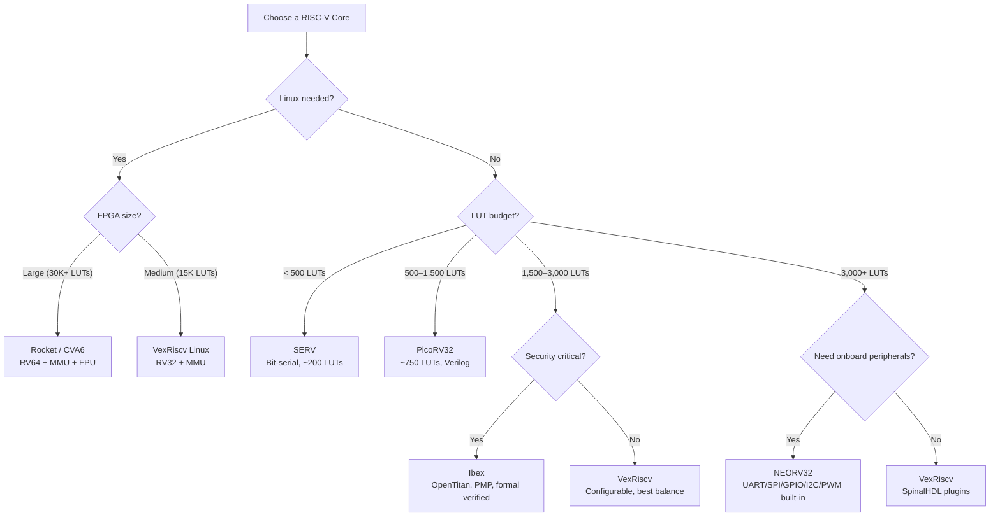

[← 12 Open Source Open Hardware Home](../README.md) · [← Cores Catalog Home](README.md) · [← Project Home](../../../README.md)]

# RISC-V Core Catalog

A curated catalog of open-source RISC-V soft cores for FPGA deployment, organized by capability tier. Each core links to its dedicated deep-dive article in [Section 11](../../11_soft_cores_and_soc_design/riscv_cores/) where available.

---

## Core Comparison Matrix

| Core | ISA | Pipeline | LUTs | fmax | FPGA Verified | Key Trait | Deep Dive |
|---|---|---|---|---|---|---|---|
| **VexRiscv** | RV32IM[A][C] | 2–5 stage, configurable | ~1,200–3,000 | 200+ MHz | ECP5, Artix-7, Cyclone V | SpinalHDL, most configurable | [Link](../../11_soft_cores_and_soc_design/riscv_cores/vexriscv.md) |
| **PicoRV32** | RV32IMC | 1 stage (multicycle) | ~750–2,000 | 150+ MHz | iCE40, ECP5, Artix-7 | Smallest, pure Verilog | [Link](../../11_soft_cores_and_soc_design/riscv_cores/picorv32.md) |
| **NEORV32** | RV32IM[A][C][U] | 2 stage | ~2,000–4,500 | 150+ MHz | Artix-7, Cyclone V | Best documentation, rich peripheral set | [Link](../../11_soft_cores_and_soc_design/riscv_cores/neorv32.md) |
| **Ibex** | RV32IMC | 2 stage | ~3,000–6,000 | 150+ MHz | Artix-7, Kintex-7 | lowRISC, OpenTitan RoT | [Link](../../11_soft_cores_and_soc_design/riscv_cores/ibex_cv32e.md) |
| **SERV** | RV32I | Bit-serial (1-bit ALU) | ~200–400 | 50 MHz | iCE40, ECP5, Artix-7 | World's smallest RV32 | [Link](../../11_soft_cores_and_soc_design/riscv_cores/serv.md) |
| **SweRV EH1** | RV32IMC | 9 stage, dual-issue | ~5,000–8,000 | 600+ MHz (ASIC) | Limited FPGA | Western Digital, high perf | — |
| **Rocket** | RV64IMAFDC | 5 stage, in-order | ~15,000+ | 100+ MHz | Kintex-7, Zynq | Linux-capable, Chisel | [Link](../../11_soft_cores_and_soc_design/riscv_cores/high_perf_riscv_cores.md) |
| **BOOM** | RV64IMAFDC | Out-of-order | ~30,000+ | 50+ MHz | Kintex-7 (large) | Superscalar, Chisel | [Link](../../11_soft_cores_and_soc_design/riscv_cores/high_perf_riscv_cores.md) |
| **CVA6 (Ariane)** | RV64IMAFDC | 6 stage | ~25,000+ | 50+ MHz | Kintex-7, Genesys 2 | Linux-capable, OpenHW | [Link](../../11_soft_cores_and_soc_design/riscv_cores/high_perf_riscv_cores.md) |
| **XiangShan** | RV64GCV | 10+ stage, superscalar | ASIC-only | — | — | Chinese Academy of Sciences | [Link](../../11_soft_cores_and_soc_design/riscv_cores/high_perf_riscv_cores.md) |

---

## Selection by Capability Tier

### Tier 1: Tiny Cores (< 1,500 LUTs)

For control logic, glue processors, and deeply embedded tasks.

| Core | LUTs | Clock | Trade-off |
|---|---|---|---|
| **SERV** | ~200 | 50 MHz | Slowest (bit-serial), but smallest. Good for watchdog, sequencer, boot state machine. |
| **PicoRV32** | ~750 | 150 MHz | Pure Verilog, easy integration. No cache, no MMU. Multi-cycle execution. |

### Tier 2: Mid-Range Cores (1,500–5,000 LUTs)

The workhorse tier — most FPGA soft CPU deployments live here.

| Core | LUTs | Clock | Trade-off |
|---|---|---|---|
| **VexRiscv** | 1,200–3,000 | 200+ MHz | Most configurable (SpinalHDL plugins). Linux-capable with MMU variant. Default in LiteX. |
| **NEORV32** | 2,000–4,500 | 150 MHz | Best documentation (400+ page datasheet). Onboard UART/SPI/GPIO/I2C/PWM. VHDL-only. |
| **Ibex** | 3,000–6,000 | 150 MHz | Security-hardened (PMP, formal verified). OpenTitan's core. SystemVerilog. |

### Tier 3: High-Performance Cores (5,000+ LUTs)

For Linux SoCs, application processors, and research.

| Core | LUTs | Clock | Trade-off |
|---|---|---|---|
| **SweRV EH1** | 5,000–8,000 | 600 MHz ASIC / ~100 MHz FPGA | Dual-issue, 9-stage. ASIC-first design limits FPGA performance. |
| **Rocket** | ~15,000+ | 100+ MHz | RV64, FPU, MMU, Linux. Chisel. Chipyard ecosystem. |
| **CVA6** | ~25,000+ | 50+ MHz | RV64, FPU, MMU, Linux. OpenHW Group. Verilog (via RTL generation). |
| **BOOM** | ~30,000+ | 50+ MHz | Superscalar OoO. Research-grade. Very large for FPGA. |

---

## Integration Ecosystems

| Core | SoC Framework | Notes |
|---|---|---|
| **VexRiscv** | LiteX | Default CPU in LiteX; one-line switch `--cpu-type=vexriscv` |
| **PicoRV32** | LiteX | Available as `--cpu-type=picorv32` |
| **Rocket** | Chipyard | Core generator in the Chipyard SoC framework; Chisel/Scala config |
| **Ibex** | OpenTitan | Core inside the Earlgrey RoT SoC; uses TileLink interconnect |
| **NEORV32** | Standalone | Self-contained SoC with own boot ROM; no framework dependency |
| **SERV** | LiteX | Available as `--cpu-type=serv`; also standalone with Swervolf |

---

## Decision Guide

### Core Selection Matrix

| Core | LUTs | Best For | Avoid When | Key Strength | Key Pitfall |
|---|---|---|---|---|---|
| **SERV** | ~200 | LUT-starved glue logic, watchdog, sequencer | Any timing-sensitive or ISA-extended need | Smallest RV32I core (~200 LUTs) | RV32I only (no M/A/F/C); bit-serial = very slow |
| **PicoRV32** | ~750 | Simple bare-metal controller, easy Verilog integration | Real-time or deterministic work | Pure Verilog, easy to embed | Variable CPI (3–150+); minimal verification |
| **VexRiscv** | 1.2K–3K | Default choice; bare-metal or Linux (RV32); LiteX SoC | You need to hand-edit Verilog output | Most configurable (SpinalHDL plugins); best ecosystem | Requires SpinalHDL/Scala source; generated Verilog not editable |
| **NEORV32** | 2K–4.5K | Best-documented core with onboard peripherals | Verilog-only toolchain/team | 400+ page datasheet; UART/SPI/GPIO/I2C/PWM/MTIME built-in | VHDL-only; no Verilog output |
| **Ibex** | 3K–6K | Security-critical: RoT, trusted boot, formal verification | Resource-constrained designs | PMP, formal-verified, OpenTitan ecosystem | Larger than VexRiscv for similar performance |
| **SweRV EH1** | 5K–8K | High-throughput ASIC designs (not FPGA) | Expecting FPGA performance close to ASIC specs | 600 MHz dual-issue in ASIC | ASIC-first; ~80–120 MHz on FPGA |
| **Rocket** | ~15K+ | Linux RV64 SoC, accelerator research (RoCC/Chipyard) | Small FPGA or simple controller needs | RV64 + MMU + FPU; RoCC coprocessor; Chipyard | Requires Chisel/Scala build chain |
| **CVA6** | ~25K+ | Linux RV64 SoC, OpenHW Group ecosystem | LUT-limited or latency-sensitive | RV64 + MMU + FPU; Verilog (generated) | Very large; limited FPGA clock speed |
| **BOOM** | ~30K+ | Superscalar OoO research only | Any production FPGA use | Out-of-order execution for research | Barely fits Kintex-7; ~50 MHz; requires Chisel |

### Decision by Use Case

| Use Case | Recommended Core | Why |
|---|---|---|
| Linux on soft CPU (RV64) | **Rocket** or **CVA6** | RV64 with MMU, FPU, supervisor mode |
| Linux on soft CPU (RV32) | **VexRiscv** (linux variant) | RV32 + MMU, smaller than Rocket |
| Bare-metal controller, low LUT budget | **VexRiscv** (minimal) or **PicoRV32** | ~1K LUTs achievable |
| Best docs and onboard peripherals | **NEORV32** | 400+ page datasheet, UART/SPI/GPIO/MTIME built-in |
| Security (RoT, trusted boot) | **Ibex** | PMP, formal verification, OpenTitan ecosystem |
| LUT-starved (< 500 LUTs) | **SERV** | 200 LUTs for full RV32I, but very slow |
| RISC-V + rich peripheral ecosystem | **VexRiscv + LiteX** | LiteX wraps VexRiscv with DRAM/Ethernet/PCIe |
| GPU/accelerator research | **Rocket + Chipyard** | RoCC coprocessor interface, Diplomacy parameter negotiation |

---

## Best Practices

1. **Start with VexRiscv unless you have a specific reason not to** — it has the best balance of performance, configurability, and ecosystem support
2. **Use LiteX for integration** — it handles address maps, CSR generation, and boot ROM automatically; avoids manual Verilog wiring
3. **Match ISA to your need** — don't pay for M (multiply) or F (float) extensions if your bare-metal firmware doesn't need them
4. **Budget 20–30% overhead** — a core listed at "1,200 LUTs" will consume more with interconnect, BRAM for boot ROM, and peripheral bridges
5. **Verify with Verilator first** — all major cores support Verilator simulation; iterate 100× faster than FPGA synthesis

---

## Antipatterns

- **Choosing BOOM for production FPGA** — BOOM is a research vehicle; it barely fits in a Kintex-7 and runs at ~50 MHz. Use Rocket for production 64-bit.
- **Using PicoRV32 for anything timing-sensitive** — the multicycle execution means variable CPI (3–150+ cycles per instruction); avoid for real-time applications
- **Ignoring verification** — Ibex and Rocket have world-class verification (UVM + formal); PicoRV32 and SERV have minimal testbenches. Choose accordingly for safety-critical designs.
- **Mixing ISA extensions without checking toolchain support** — not all GCC/newlib combinations support all extension combinations

---

## Pitfalls

- **VexRiscv requires SpinalHDL/Scala** — you cannot edit VexRiscv in Verilog; the generated Verilog is not meant to be hand-modified
- **NEORV32 is VHDL-only** — if your toolchain or team only supports Verilog, NEORV32 is not an option
- **SweRV on FPGA is underwhelming** — the 600 MHz clock speed is ASIC-only; on FPGA, expect 80–120 MHz due to deep pipeline and ASIC-optimized structures
- **Rocket/BOOM require Chisel/Scala build chain** — the Java/Scala dependency chain adds complexity; budget time for environment setup
- **RISC-V compliance varies** — SERV only supports RV32I (no M/A/F/C), PicoRV32 has optional and partial extension support

---

## Cross-References to Other CPU Core Catalogs

This catalog focuses on RISC-V soft cores. For a complete view of available FPGA CPU cores, see:

| Core Family | Catalog Article | Coverage |
|---|---|---|
| **RISC-V cores** | This document | VexRiscv, PicoRV32, NEORV32, SERV, Ibex, Rocket, BOOM, CVA6, XiangShan |
| **Other open ISA cores** | [Non-RISC-V Core Catalog](other_isa_cores_catalog.md) | OpenRISC (mor1kx), LEON3/4 (SPARC), Microwatt (POWER), NEO430 (MSP430), Plasma (MIPS), ZPU, retro cores (Z80, 6502, 68000) |
| **Multi-ISA collections** | [Non-RISC-V Core Catalog → Multi-ISA Section](other_isa_cores_catalog.md#multi-isa-core-collections--projects) | MicroCore Labs (68000, 6502, 8086, Z80, 8051, RISC-V), OpenCores, ZipCPU |
| **Vendor soft processors** | [Vendor Soft Processors (Section 11)](../../11_soft_cores_and_soc_design/vendor_soft/README.md) | MicroBlaze/MicroBlaze-V (Xilinx/AMD), Nios II/Nios V (Intel/Altera) |
| **Non-RISC-V deep dives** | [Other ISA Cores (Section 11)](../../11_soft_cores_and_soc_design/other_isa/other_isa_cores.md) | Detailed analysis of mor1kx, LEON3/4, Microwatt, ZPU, Plasma, NEO430 |
| **RISC-V ISA reference** | [RISC-V ISA Overview](../../11_soft_cores_and_soc_design/riscv/riscv_isa.md) | RV32I/RV64I base ISAs, standard extensions (M/A/F/D/C/V), encoding |
| **RISC-V privileged spec** | [RISC-V Privileged Architecture](../../11_soft_cores_and_soc_design/riscv/riscv_privileged.md) | M/S/U privilege modes, CSRs, virtual memory (Sv32/Sv39/Sv48), PMP, interrupts |
| **SoC integration** | [SoC Design (Section 11)](../../11_soft_cores_and_soc_design/soc_design/README.md) | Bus matrices, memory maps, interrupt routing, DMA, multi-core coherency, Chipyard |
| **Peripheral cores** | [Peripheral Cores Catalog](peripheral_cores_catalog.md) | UART, SPI, I2C, GPIO, PWM, timers, Wishbone/AXI infrastructure cores |

---

## References

- [RISC-V Cores Deep Dives (Section 11)](../../11_soft_cores_and_soc_design/riscv_cores/)
- [RISC-V ISA Overview](../../11_soft_cores_and_soc_design/riscv/riscv_isa.md)
- [RISC-V Privileged Architecture](../../11_soft_cores_and_soc_design/riscv/riscv_privileged.md)
- [LiteX SoC Builder](../litex/litex_overview.md)
- [Chipyard / Rocket Chip](../../11_soft_cores_and_soc_design/soc_design/chipyard_rocket_chip.md)
