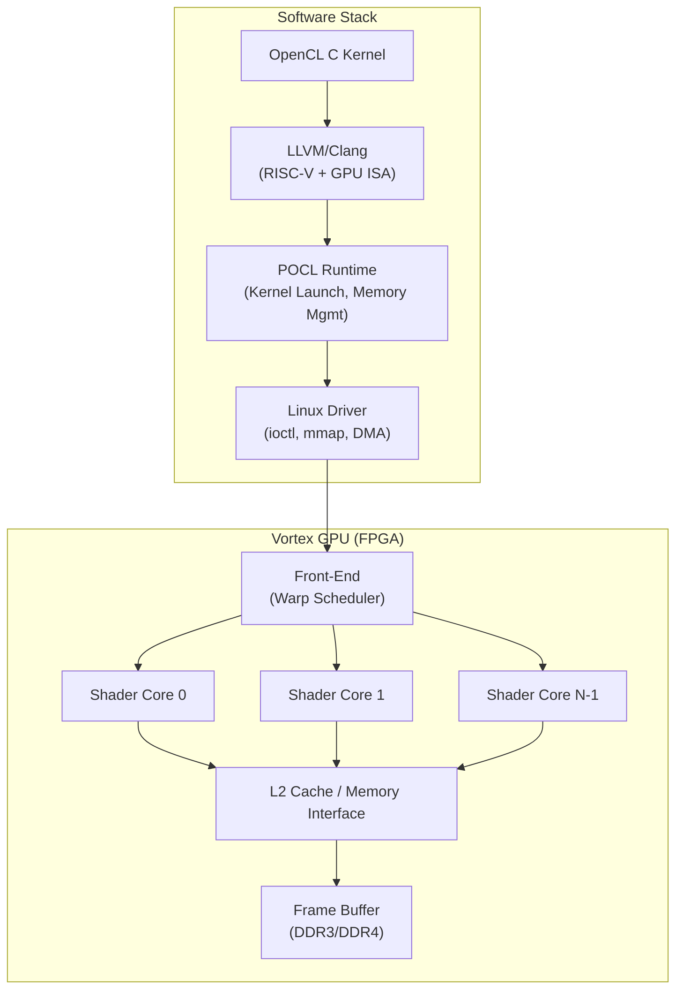
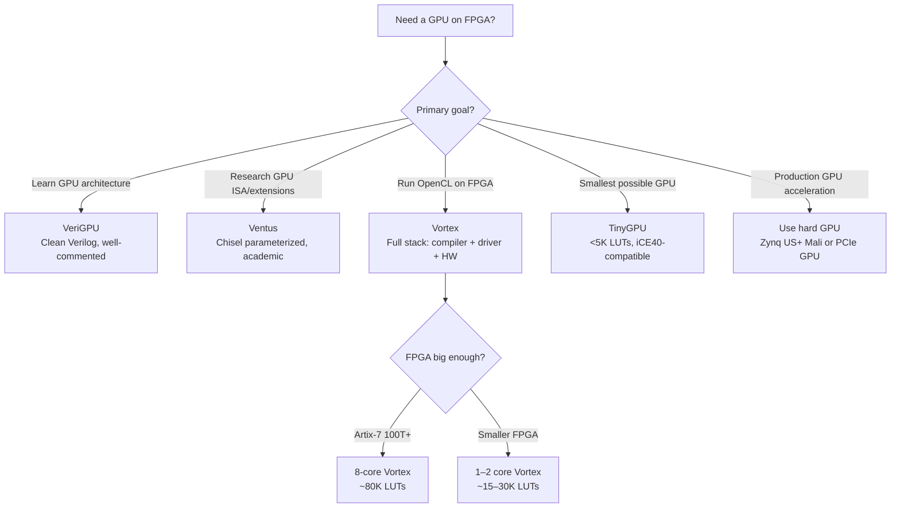

[← 12 Open Source Open Hardware Home](../README.md) · [← Gpu Compute Home](README.md) · [← Project Home](../../../README.md)

# Open-Source GPU Cores — Soft GPUs and GPGPU Platforms

Soft GPU implementations ranging from educational proof-of-concepts to full-stack GPGPU platforms with OpenCL compilers, device drivers, and cycle-accurate simulators. None approach modern iGPU performance — but they reveal how GPUs actually work in a way that no black-box ARM Mali or NVIDIA GPU ever can.

---

## Overview

A soft GPU on FPGA serves one of three purposes: **education** (understanding GPU architecture by reading every line of RTL), **research** (exploring novel ISA extensions, memory hierarchies, or scheduling policies), or **embedded display** (driving a low-resolution framebuffer when no hard GPU exists). The open-source landscape spans all three, from TinyGPU's 5K-LUT proof-of-concept to Vortex's full-stack OpenCL 1.2 platform.

> **Reality check**: All FPGA soft GPUs are 10–100× slower than a modern ARM Mali GPU. If you need production GPU performance, use a Zynq UltraScale+ with Mali, or connect a discrete GPU via PCIe.

---

## GPU Core Comparison

| GPU | ISA | Shader Cores | Clock (FPGA) | Driver Stack | FPGA Verified | Key Trait |
|---|---|---|---|---|---|---|
| **Vortex GPGPU** | RISC-V (custom ISA extension) | 1–32 warps | ~100 MHz | OpenCL 1.2 (POCL + LLVM) | Artix-7, Cyclone V | Most complete open GPU: simulator, compiler, driver, FPGA |
| **Ventus GPGPU** | RISC-V (custom vector) | 1–8 SMs | ~100 MHz | OpenCL (POCL) | VCU118 (Virtex) | Tsinghua Univ., Chisel-generated, active research |
| **VeriGPU** | Custom (Verilog) | Configurable | ~50 MHz | Bare (memory-mapped) | ECP5, Artix-7 | Educational, pure Verilog, best to learn GPU architecture |
| **TinyGPU** | Custom minimal | 1 core | ~50 MHz | Bare | iCE40, ECP5 | Smallest, fits in <5K LUTs |
| **FGPU** | Custom (VHDL) | SIMD array | ~100 MHz | Bare | Artix-7 | VGA output, memory controller included |

---

## Vortex GPGPU — The Full-Stack Platform

Vortex is the most complete open-source GPU — the only one with a full software stack from OpenCL kernel compilation through device driver to hardware execution.

### Architecture



### Vortex Warp Execution Model

| Parameter | Description |
|---|---|
| **Warp size** | 32 threads (like NVIDIA) |
| **ISA extension** | RISC-V base + custom vector instructions |
| **Scheduling** | Round-robin warp scheduling |
| **Memory model** | Weakly-ordered, barrier synchronization |
| **Cache hierarchy** | Per-core L1 + shared L2 |
| **Configurability** | 1, 2, 4, 8, 16, or 32 shader cores |

### Resource Usage (Artix-7)

| Config | Shader Cores | LUTs | BRAM | fMax |
|---|---|---|---|---|
| **Minimal** | 1 | ~15K | ~30 | ~100 MHz |
| **Medium** | 4 | ~45K | ~80 | ~90 MHz |
| **Full** | 8 | ~80K | ~140 | ~75 MHz |

---

## Ventus GPGPU — Chisel-Generated Research GPU

Ventus (Latin for "wind") from Tsinghua University is a Chisel-generated GPU targeting OpenCL workloads. It uses the RISC-V CVA6 (formerly ARIANE) as the management core with custom vector processing SMs (Streaming Multiprocessors).

| Feature | Detail |
|---|---|
| **Host CPU** | CVA6 (RV64GC) — management and kernel dispatch |
| **SM count** | 1–8 (parameterized) |
| **Warp size** | 16 threads |
| **Local memory** | 16 KB per SM (shared memory) |
| **L2 cache** | Shared, parameterized |
| **Generation** | Chisel → Verilog |
| **OpenCL runtime** | POCL |

Ventus is primarily a research platform — the Chisel parameterization makes it easy to experiment with different SM counts, cache sizes, and scheduling policies, but the FPGA resource requirements are large.

---

## VeriGPU — The Educational GPU

VeriGPU is a clean, well-commented Verilog GPU designed for learning. It implements a basic 3D graphics pipeline:

```
Vertex Data → Vertex Shader → Rasterizer → Fragment Shader → Framebuffer
```

| Pipeline Stage | Function | Complexity |
|---|---|---|
| **Vertex Shader** | Transform vertices (MVP matrix multiply) | ~2K LUTs |
| **Rasterizer** | Triangle → pixel coverage, barycentric interpolation | ~5K LUTs |
| **Fragment Shader** | Per-pixel color computation, texture sampling | ~3K LUTs |
| **Framebuffer** | Write to display memory | ~1K LUTs |

VeriGPU exposes each pipeline stage as a separate Verilog module with clear interfaces — ideal for understanding how data flows through a GPU.

---

## TinyGPU — The Minimal Proof-of-Concept

TinyGPU fits in under 5K LUTs — small enough for an iCE40. It implements a single shader core with:

- 4-thread interleaved execution
- Basic memory interface (no cache)
- Simple instruction set (MOV, ADD, MUL, LOAD, STORE, BRANCH)
- Framebuffer output

Use it to understand the **minimum viable GPU**: instruction fetch → decode → execute → memory → writeback, repeated across threads with round-robin scheduling.

---

## Soft GPU vs Hard GPU Comparison

| Metric | Soft GPU (Vortex, 8 cores) | ARM Mali-G52 (hard) | NVIDIA GTX 1650 |
|---|---|---|---|
| **Shader cores** | 8 | 2 × 8 | 896 |
| **Clock** | ~90 MHz | ~800 MHz | ~1.5 GHz |
| **GFLOPS (FP32)** | ~0.5 | ~50 | ~900 |
| **Power** | ~2W (FPGA) | ~2W | ~75W |
| **Memory BW** | ~1 GB/s | ~12 GB/s | ~192 GB/s |
| **OpenCL support** | 1.2 (partial) | 2.0 | 3.0 |

---

## Decision Guide



---

## When to Use / When NOT to Use

### When to Use

- **Learning GPU internals** — reading VeriGPU's rasterizer teaches you more about GPU architecture than any textbook
- **RISC-V GPU research** — Vortex and Ventus let you modify the ISA, scheduling policy, and memory hierarchy
- **Embedded display on Lattice/Microchip** — where no hard GPU exists and you need basic 2D/3D output
- **GPGPU compiler co-design** — Vortex's LLVM + POCL stack lets you experiment with compiler-hardware interfaces

### When NOT to Use

- **Production graphics or compute** — soft GPUs are 10–100× slower than even a mobile hard GPU
- **Real-time video processing** — soft GPUs cannot sustain the fill rates needed for 1080p@60
- **Machine learning inference** — use dedicated ML accelerators instead (see [ML Accelerators](ml_accelerators.md))
- **Any design with a Zynq UltraScale+** — the Mali GPU in the PS is free, fast, and validated

---

## Best Practices

1. **Start with VeriGPU to understand the pipeline** — then move to Vortex if you need OpenCL
2. **Use the Vortex simulator before FPGA** — the software simulator runs 100× faster than FPGA and supports printf debugging
3. **Set realistic resolution expectations** — soft GPUs top out at 640×480 or 800×600 for interactive 3D; 2D framebuffers can go higher
4. **Memory bandwidth is the bottleneck** — not shader count; a single shader core with a fast memory interface outperforms 8 cores starved for data
5. **Use FPGA Block RAM for framebuffer** — external SDRAM adds variable latency that disrupts the rendering pipeline

---

## Antipatterns

- **The Many-Core Mirage** — instantiating 32 Vortex shader cores on an Artix-7 that only has resources for 4; the design fails timing and the memory system cannot feed all cores anyway
- **The GPU-for-Everything** — using a soft GPU for signal processing or control logic that would be simpler and faster as dedicated RTL pipelines
- **Ignoring the Driver Stack** — choosing Vortex for its OpenCL support but then spending 90% of effort on the Linux driver instead of the GPU design

---

## Pitfalls

1. **Vortex FPGA builds are slow** — a full 8-core Vortex on Artix-7 takes 2–4 hours in Vivado; use the simulator for development
2. **OpenCL conformance is partial** — Vortex passes basic OpenCL 1.2 tests but fails on complex kernel patterns (dynamic branching, recursive functions); validate your kernels early
3. **Chisel build chain for Ventus** — requires JVM + SBT + Chisel + FIRRTL; the toolchain alone is several GB and can be fragile across versions
4. **Memory coherence** — soft GPUs typically implement weak memory ordering; if your kernel assumes sequential consistency, it will produce wrong results
5. **Display timing** — generating proper VGA/HDMI timing signals from a soft GPU requires careful clock domain crossing between the render clock and the pixel clock

---

## Use Cases

- **University GPU architecture courses** — VeriGPU as teaching tool, Vortex as advanced project platform
- **RISC-V ISA extension research** — adding custom vector instructions to Vortex or Ventus
- **Embedded dashboard display** — basic 2D rendering (gauges, text) on a Lattice ECP5 without a hard GPU
- **GPGPU compiler research** — Vortex's POCL + LLVM integration enables end-to-end compiler experiments
- **ASIC GPU prototyping** — Ventus and Vortex have both been used as pre-silicon prototypes for ASIC tape-outs

---

## References

- [Vortex GPGPU (GitHub)](https://github.com/vortexgpgpu/vortex)
- [Ventus GPGPU (GitHub)](https://github.com/THU-DSP-LAB/ventus-gpgpu)
- [VeriGPU (GitHub)](https://github.com/verigpu/verigpu)
- [TinyGPU (GitHub)](https://github.com/adam-nielsen/tinygpu)
- [POCL — Portable Computing Language](https://github.com/pocl/pocl)
- [RISC-V GPU ISA Extension Proposal](https://github.com/riscv/riscv-isa-manual)
- [ML Accelerators on FPGA](ml_accelerators.md) — for ML-specific FPGA acceleration
- [Display Cores](../video_display/display_cores.md) — for VGA/HDMI output from GPU framebuffers
