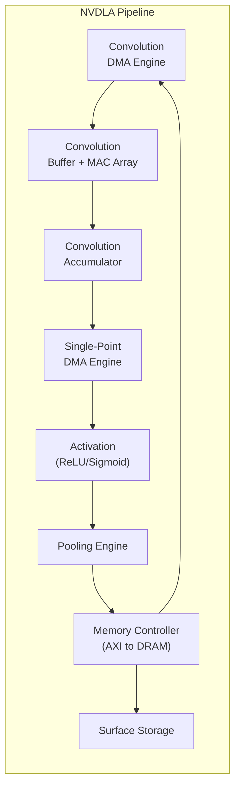
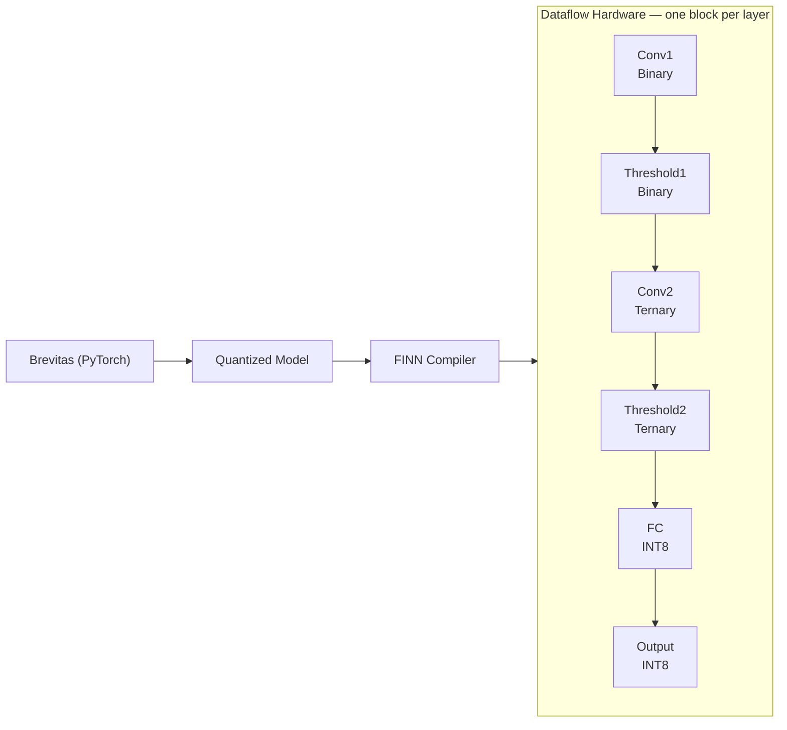
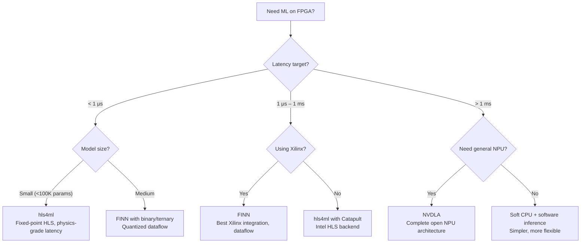

[← 12 Open Source Open Hardware Home](../README.md) · [← Gpu Compute Home](README.md) · [← Project Home](../../../README.md)

# ML Accelerators on FPGA — NVDLA, FINN, hls4ml & VTA

Open-source deep learning inference accelerators targeting FPGA fabric — from NVIDIA's full NPU architecture (NVDLA) to CERN's sub-microsecond physics trigger (hls4ml) to Xilinx's quantized neural network compiler (FINN). Each takes a fundamentally different approach to the same problem: making neural networks run fast on programmable silicon.

---

## Overview

The FPGA ML accelerator landscape has four distinct philosophies:

| Philosophy | Core Idea | Representative |
|---|---|---|
| **Hardware-first NPU** | Build a complete neural processing unit in RTL; compile models to it | NVDLA |
| **Quantization-first compiler** | Aggressively quantize the model, then map to dataflow hardware | FINN |
| **HLS-generated** | Write the accelerator in C/C++ and let HLS produce the RTL | hls4ml |
| **Compiler-hardware co-design** | Design the hardware and compiler together as a system | VTA |

There is no "best" approach — the right choice depends on your latency target, model complexity, and whether you control the entire stack.

---

## Major Projects

| Project | Origin | Type | Framework | FPGA Targets | Key Trait |
|---|---|---|---|---|---|
| **NVDLA** | NVIDIA | Configurable NPU (conv + activation + pooling) | Caffe, ONNX | Xilinx, Intel | Open-source hardware spec, full RTL, large |
| **FINN** | Xilinx Research | Quantized NN compiler → dataflow FPGA | Brevitas → FINN | Zynq, Alveo | Best for Xilinx, extreme low latency (μs) |
| **hls4ml** | CERN / FastML | ML → HLS (Vivado HLS / Catapult) | TensorFlow, PyTorch, Keras | Xilinx, Intel | Low latency ML for physics triggers, <100 ns inference |
| **VTA** | Apache TVM | Generic tensor accelerator | TVM (own compiler) | Pynq (Zynq) | End-to-end: TVM compiler → RTL, research platform |
| **DNNWeaver** | Georgia Tech | DNN accelerator generator | Caffe | Xilinx | Academic, parameterized systolic array generation |

---

## NVDLA — The Open NPU Architecture

NVIDIA's Deep Learning Accelerator is a complete, production-grade NPU design released as open-source RTL. It implements the standard CNN pipeline:



### NVDLA Configurations

| Config | Conv Engine | Activation | Pooling | Memory Interface | Typical FPGA |
|---|---|---|---|---|---|
| **NVDLA Small** | 8 MACs, 1 batch | ReLU | Max/Avg | AXI 64-bit | Artix-7, PYNQ-Z1 |
| **NVDLA Large** | 64 MACs, 4 batch | ReLU/Sigmoid | Max/Avg | AXI 128-bit | Kintex-7, Alveo |
| **NVDLA Headless** | Any | None | None | AXI (custom) | Research-only |

### Resource Usage (Kintex-7, Large Config)

| Resource | Usage | Notes |
|---|---|---|
| LUTs | ~80K | Dominated by convolution array |
| BRAM | ~120 | Weight buffers, feature maps |
| DSP48 | ~64 | MAC operations (one per multiply) |
| fMax | ~200 MHz | Limited by memory bandwidth, not logic |

> **NVDLA on FPGA reality**: The "large" config barely fits on a Kintex-7 325T. The small config is more practical for most Zynq boards. Memory bandwidth (not compute) is the bottleneck — a single DDR3 channel cannot feed 64 MACs at full throughput.

---

## FINN — Quantized Neural Network Compiler

FINN takes the opposite approach from NVDLA: instead of building a general NPU and compiling models to it, FINN compiles **quantized** models into **custom dataflow hardware** — each layer gets its own hardware block, connected in a streaming pipeline.

### FINN Architecture

```
Brevitas (PyTorch) → Quantized Model
         ↓
    FINN Compiler
         ↓
  ┌─────────────────────────────────────────────────────────────────────┐
  │ Dataflow Hardware (one block per layer)                             │
  │                                                                     │
  │  [Conv1] → [Threshold1] → [Conv2] → [Threshold2] → [FC] → [Output]. |
  │  Binary   Binary           Ternary   Ternary    INT8   INT8         │
  └─────────────────────────────────────────────────────────────────────┘
```



| FINN Feature | Detail |
|---|---|
| **Quantization levels** | Binary (1-bit), ternary (2-bit), INT4, INT8 |
| **Dataflow** | Layer-by-layer streaming (no DRAM access between layers) |
| **Latency** | Sub-microsecond for binary/ternary networks |
| **Target** | Zynq (PS for control + PL for dataflow), Alveo (large models) |
| **Input** | Brevitas-quantized PyTorch model |
| **Output** | Bitstream + driver (PYNQ or Alveo) |

### Quantization Impact on Resources

| Quantization | Weights/BRAM | DSP Usage | Relative Throughput | Accuracy Impact |
|---|---|---|---|---|
| **Binary (BNN)** | 32× denser | 0 (XNOR + popcount) | 10–50× faster | 5–15% accuracy loss on ImageNet |
| **Ternary (TNN)** | 16× denser | 0 (shift + add) | 5–20× faster | 3–10% accuracy loss |
| **INT4** | 8× denser | Reduced | 3–8× faster | 1–5% accuracy loss |
| **INT8** | 4× denser | 1 DSP per MAC | 2–3× faster | <1% accuracy loss (often negligible) |

### FINN Workflow Example

```python
# 1. Train and quantize with Brevitas
from brevitas.nn import QuantConv2d, QuantLinear
import torch

class QuantNet(torch.nn.Module):
    def __init__(self):
        super().__init__()
        self.conv1 = QuantConv2d(3, 32, 3, weight_bit_width=4)
        self.conv2 = QuantConv2d(32, 64, 3, weight_bit_width=4)
        self.fc    = QuantLinear(64 * 6 * 6, 10, weight_bit_width=4)

# 2. Export to FINN-ONNX
from finn.util.pytorch import PyTorchConverter
converter = PyTorchConverter(quant_model, (1, 3, 32, 32))
onnx_model = converter.convert()

# 3. Build dataflow hardware with FINN
from finn.builder import ModelBuilder
builder = ModelBuilder()
builder.build(onnx_model, target="ZCU104")
# Produces: bitstream + PYNQ driver
```

---

## hls4ml — ML for Physics Triggers

hls4ml (HLS for Machine Learning) was born at CERN for a specific use case: running neural network inference in the **trigger path** of particle physics experiments, where latency budgets are measured in **microseconds** and every nanosecond counts.

| hls4ml Feature | Detail |
|---|---|
| **Latency target** | <100 ns (L1 trigger), <1 μs (HLT) |
| **Input frameworks** | TensorFlow, PyTorch, Keras |
| **HLS backend** | Vivado HLS (Xilinx), Catapult (Intel/Mentor) |
| **Quantization** | Arbitrary fixed-point (configurable per-layer) |
| **Output** | Synthesizable C++ → RTL via HLS |

### hls4ml Latency vs Precision Trade-off

| Precision | Latency (ns) | Resources (Kintex-7) | Accuracy |
|---|---|---|---|
| FP32 | ~5,000 | ~3× baseline | Baseline |
| Fixed-point <16,8> | ~500 | ~1× baseline | <1% loss |
| Fixed-point <8,4> | ~200 | ~0.5× baseline | 1–3% loss |
| Fixed-point <6,2> | ~100 | ~0.3× baseline | 3–10% loss |

The key insight: physics trigger networks are typically small (3–5 layers, <100K parameters), so aggressive quantization works well. ImageNet-scale models are not the target.

---

## VTA — Compiler-Hardware Co-Design

VTA (Versatile Tensor Accelerator) is part of the Apache TVM ecosystem. Instead of designing hardware and then writing a compiler for it, VTA designs both simultaneously:

| VTA Component | Role |
|---|---|
| **Hardware** | 2D systolic array (GEMM core), load/store units, microcode dispatch |
| **Compiler** | TVM Relay → microcode for the GEMM core |
| **Runtime** | Python/C driver on PYNQ (ARM PS controls the PL accelerator) |

VTA is a research platform — its value is in demonstrating that hardware and compiler can be co-designed, not in production inference throughput.

---

## Framework Comparison

| Property | NVDLA | FINN | hls4ml | VTA |
|---|---|---|---|---|
| **Input format** | ONNX / Caffe model | PyTorch → quantized (Brevitas) | TensorFlow / PyTorch | TVM Relay IR |
| **Quantization** | INT8, INT16 | Binary / INT1–4 | Arbitrary fixed-point | INT8 |
| **FPGA families** | Xilinx, Intel (open) | Xilinx (Zynq, Alveo) | Xilinx, Intel (HLS backend) | Xilinx (Pynq) |
| **Latency target** | ~1 ms | <1 μs | <100 ns (trigger) | ~10 ms |
| **Throughput** | Medium (general NPU) | High (dataflow) | Low (small models) | Low (research) |
| **Complexity** | High (full NPU) | Medium | Low (Python API) | Medium |
| **Vendor lock-in** | Low (AXI interface) | High (Xilinx-only) | Medium (HLS-dependent) | High (TVM-dependent) |

---

## Decision Guide



---

## When to Use / When NOT to Use

### When to Use

- **Sub-microsecond inference** — FINN (binary/ternary) or hls4ml; no other platform gets below 1 μs
- **CERN-style physics triggers** — hls4ml is purpose-built for this
- **Quantized model deployment on Zynq** — FINN is the best-integrated solution
- **Studying NPU architecture** — NVDLA's RTL is the only complete open NPU
- **Compiler-hardware co-design research** — VTA + TVM is the only stack that lets you modify both

### When NOT to Use

- **FP32 inference** — FPGA DSP48 slices are too scarce for full-precision networks; use a GPU instead
- **Large language models** — even INT8-quantized LLMs need >10 GB of weight storage and >100 GB/s bandwidth; FPGAs cannot compete
- **Rapid prototyping without Xilinx tools** — FINN and hls4ml require Vivado/Vitis HLS; there is no open-toolchain path
- **Training** — all these frameworks target inference only; training on FPGA is not practical

---

## Best Practices

1. **Quantize first, accelerate second** — a quantized model on a soft CPU often beats a full-precision model on dedicated hardware
2. **Profile before building hardware** — identify which layers are bottlenecks; often 2–3 layers dominate inference time
3. **Use Brevitas for FINN quantization** — it's the officially supported path; rolling your own quantization will cause compatibility issues
4. **Start with hls4ml's QKeras integration** — it provides the simplest path from Keras model to synthesizable HLS
5. **Verify accuracy after quantization** — always compare quantized model accuracy against FP32 baseline before committing to hardware
6. **Budget for memory bandwidth** — a 64-MAC NVDLA needs >12 GB/s of weight bandwidth; a single DDR3 channel provides ~6 GB/s

---

## Antipatterns

- **The Full-Precision FPGA** — deploying an FP32 model on FPGA and wondering why it's slower than a CPU; FPGA strength is in low-precision arithmetic
- **The Oversized Systolic Array** — building a 256×256 MAC array when your model only needs 32×32; unused MACs waste LUTs and BRAM
- **The Custom Accelerator Without a Compiler** — designing beautiful hardware but then having no way to compile models to it; always design the compiler simultaneously

---

## Pitfalls

1. **NVDLA memory bandwidth starvation** — the "large" config needs 4+ DDR channels to operate at full throughput; most Zynq boards have only one DDR channel
2. **FINN quantization-dependent accuracy** — binary and ternary networks can lose 10–15% accuracy on complex tasks; always validate before hardware build
3. **hls4ml HLS pragma sensitivity** — changing a single `#pragma HLS PIPELINE` can change latency by 10×; HLS optimization requires careful tuning
4. **VTA is a research platform** — it is not production-grade; the TVM integration can break across versions
5. **Tool version dependencies** — FINN requires specific versions of Vivado, Vitis, and Python; version mismatches cause silent build failures
6. **BRAM is the bottleneck, not DSP** — most quantized models are limited by weight storage and data movement, not by MAC count

---

## Use Cases

- **Particle physics triggers** — hls4ml: <100 ns inference for event selection at LHC experiments
- **Autonomous drone perception** — FINN on PYNQ-Z1: binary neural network for obstacle detection at 5000+ fps
- **Keyword spotting** — FINN/hls4ml: <1 ms audio classification on edge devices
- **Industrial anomaly detection** — NVDLA small: CNN inference on factory floor with deterministic latency
- **Compiler research** — VTA: experimenting with novel hardware-software interfaces for ML acceleration
- **Data center low-latency inference** — FINN on Alveo: sub-microsecond inference for trading/signaling applications

---

## References

- [NVDLA (GitHub)](http://github.com/nvdla/hw) — full RTL, documentation, verification
- [NVDLA Spec](http://nvdla.org/architecture.html)
- [FINN (GitHub)](https://github.com/Xilinx/finn) — compiler + examples
- [Brevitas (GitHub)](https://github.com/Xilinx/brevitas) — PyTorch quantization toolkit
- [hls4ml (GitHub)](https://github.com/fastmachinelearning/hls4ml) — CERN ML-to-HLS
- [VTA (Apache TVM)](https://tvm.apache.org/docs/topic/vta/index.html)
- [Apache TVM](https://tvm.apache.org/)
- [DNNWeaver (GitHub)](https://github.com/sharannarang/DNNWeaver)
- [GPU Cores on FPGA](gpu_cores.md) — for GPGPU approaches to parallel compute
