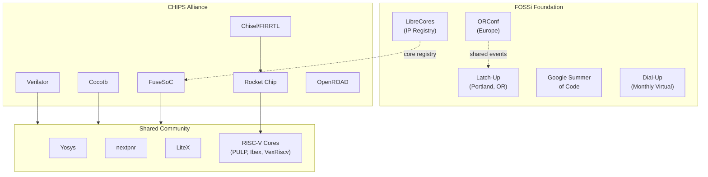

[← 12 Open Source Open Hardware Home](../README.md) · [← Initiatives Home](README.md) · [← Project Home](../../../README.md)

# FOSSi Foundation & CHIPS Alliance — The Organizations Behind Open Silicon

The two major non-profit organizations driving open-source silicon: FOSSi (community-focused, grassroots) and CHIPS Alliance (Linux Foundation, corporate-backed). Understanding their roles, projects, and relationship is essential for navigating the open-source silicon ecosystem — because nearly every open-source FPGA tool and IP core you'll use is supported by one or both.

---

## Overview

Open-source silicon is not just code — it requires organizational infrastructure for funding, governance, legal protection, and community building. FOSSi and CHIPS Alliance provide this infrastructure, but from different perspectives:

| Aspect | FOSSi Foundation | CHIPS Alliance |
|---|---|---|
| **Founded** | 2015 | 2019 |
| **Under** | Independent non-profit | Linux Foundation |
| **Funded by** | Donations, GSoC | Corporate memberships (Google, Intel, SiFive, WD) |
| **Focus** | Community, education, events | Standards, infrastructure, corporate collaboration |
| **Key projects** | LibreCores, ORConf, Latch-Up | Verilator, Cocotb, FuseSoC, Chisel, OpenROAD |
| **Vibe** | Grassroots, academic | Corporate, production-oriented |

Both are essential. Without FOSSi, there's no community. Without CHIPS Alliance, there's no production-grade infrastructure.

---

## FOSSi Foundation

**fossi-foundation.org** — The grassroots organization for open-source silicon, founded in 2015.

### Activities

| Activity | Description | Frequency |
|---|---|---|
| **ORConf** | Annual open-source digital design conference (Europe, ~200+ attendees) | Yearly |
| **Latch-Up** | Portland, OR — North American counterpart of ORConf | Yearly |
| **LibreCores** | Directory/registry of open-source IP cores (librecores.org) | Ongoing |
| **Google Summer of Code** | Mentors FPGA/RTL/VLSI student projects each year | Annual (summer) |
| **FOSSi Dial-Up** | Monthly virtual meetup since 2020 | Monthly |
| **Community Hub** | Discussion forums, mailing lists, IRC/Matrix channels | Ongoing |

### FOSSi's Impact on FPGA Development

FOSSi's most important contribution is **community building**. Before FOSSi, open-source FPGA development was fragmented across individual GitHub repos with no shared venue. ORConf and Latch-Up brought Yosys developers, LiteX contributors, RISC-V designers, and FPGA hobbyists into the same room — and the cross-pollination produced collaborations that wouldn't have happened otherwise.

---

## CHIPS Alliance

**chipsalliance.org** — A Linux Foundation project, founded 2019, backed by Google, Intel, SiFive, Western Digital, and others. CHIPS Alliance provides governance, funding, and legal infrastructure for open-source silicon projects.

### CHIPS Alliance Projects

| Project | Description | FPGA Relevance | License |
|---|---|---|---|
| **Rocket Chip** | RISC-V SoC generator (Chisel) | Can target Kintex-7 / large FPGAs | Apache 2.0 |
| **Chisel/FIRRTL** | Hardware construction language | FPGA + ASIC, Chisel → Verilog | Apache 2.0 |
| **Verilator** | Fast open-source Verilog simulator | Critical for FPGA simulation | LGPL 2.1 / Artistic |
| **OpenROAD** | Digital ASIC flow (RTL → GDS) | ASIC focus, but PDK concepts transfer | BSD 3-Clause |
| **FuseSoC** | IP package manager / build system | Directly used in FPGA projects | BSD 2-Clause |
| **Cocotb** | Python-based verification | FPGA verification framework | BSD 3-Clause |
| **SV-Tests** | SystemVerilog compliance test suite | Validates open-source SV tools | Apache 2.0 |
| **Core-V CVA6** | 64-bit RISC-V core (from OpenHW Group) | FPGA-verified on VCU118 | Apache 2.0 |
| **UVM-SystemVerilog** | Open UVM implementation | Verification infrastructure | Apache 2.0 |

### Why CHIPS Alliance Matters for FPGA Developers

1. **Verilator** — the fastest open-source Verilog simulator, 10–100× faster than Icarus Verilog; essential for testing FPGA designs without hardware
2. **Cocotb** — write testbenches in Python instead of Verilog/VHDL; dramatically reduces verification effort
3. **FuseSoC** — package your FPGA IP so others can use it with a single dependency; the `npm` of RTL
4. **Chisel** — generates Verilog from Scala; the basis of Rocket Chip and many RISC-V cores

---

## Relationship Map

Both organizations share many contributors and projects. **Verilator**, **Cocotb**, and **FuseSoC** are CHIPS Alliance projects used daily by the broader FOSSi community.

---

## How to Get Involved

| Level | FOSSi | CHIPS Alliance |
|---|---|---|
| **Attend** | ORConf, Latch-Up, Dial-Up | CHIPS Alliance workshops at OSSNA |
| **Contribute** | LibreCores listings, GSoC projects | GitHub repos (Verilator, Cocotb, FuseSoC) |
| **Membership** | Free (individual) | Corporate membership ($5K–$50K/year) |
| **Governance** | Community-elected board | Linux Foundation governance |

---

## Best Practices

1. **List your IP on LibreCores** — it's the FOSSi directory; helps others find your work
2. **Use FuseSoC for your FPGA projects** — it's the de facto standard for open-source IP packaging
3. **Write Cocotb testbenches** — Python verification is 3–5× faster to write than Verilog testbenches
4. **Attend ORConf or Latch-Up** — the single best way to meet open-source silicon developers

---

## Antipatterns

- **The "Not Invented Here" IP** — writing your own UART/SPI/I2C core instead of using a LibreCores-listed one; the ecosystem already solved these problems
- **The Corporate vs Community Divide** — treating CHIPS Alliance and FOSSi as competitors; they are complementary

---

## Pitfalls

1. **CHIPS Alliance membership is corporate** — individual developers cannot join; participate through GitHub contributions instead
2. **LibreCores is under-maintained** — the directory has many outdated entries; always verify that a listed project is still active
3. **Conference timing** — ORConf and Latch-Up are typically in September and April respectively; plan travel early as venues are small

---

## Use Cases

- **Finding open-source IP** — LibreCores directory + FuseSoC package index
- **Verifying FPGA designs** — Verilator for simulation, Cocotb for Python testbenches
- **Packaging FPGA IP for distribution** — FuseSoC core files
- **Networking with open-source silicon developers** — ORConf, Latch-Up, Dial-Up

---

## References

- [FOSSi Foundation](https://www.fossi-foundation.org/)
- [CHIPS Alliance](https://chipsalliance.org/)
- [LibreCores](https://www.librecores.org/)
- [ORConf](https://orconf.org/)
- [Verilator (GitHub)](https://github.com/verilator/verilator)
- [Cocotb (GitHub)](https://github.com/cocotb/cocotb)
- [FuseSoC (GitHub)](https://github.com/olofk/fusesoc)
- [OpenTitan](opentitan.md) — security-focused initiative
- [Open-Source EDA](open_source_eda.md) — tool survey
