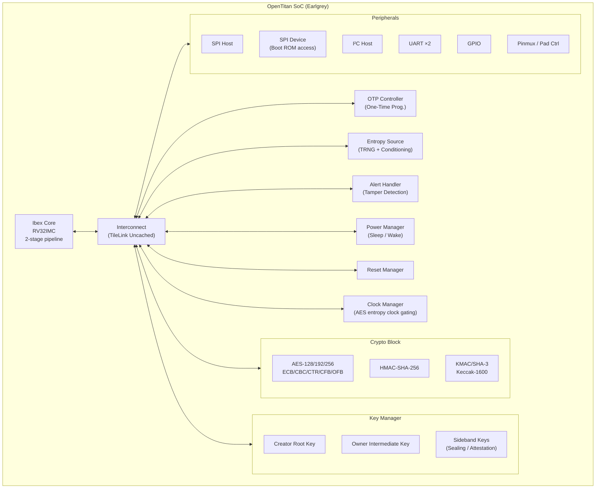
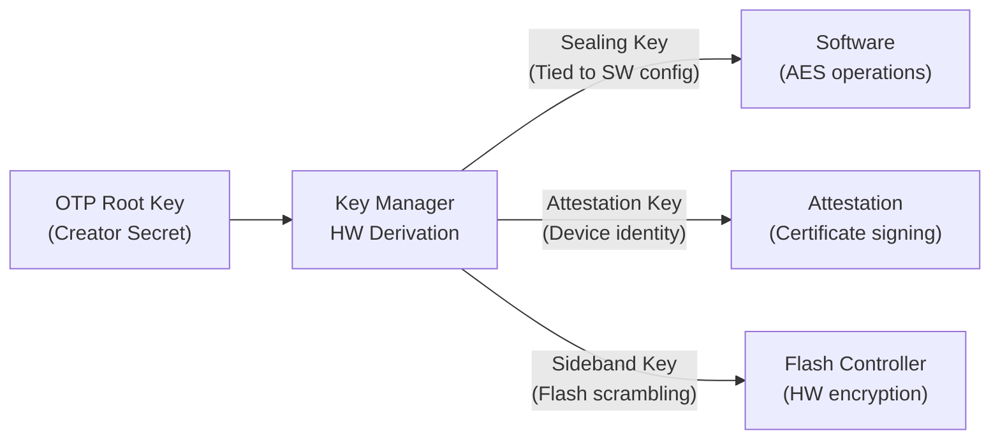
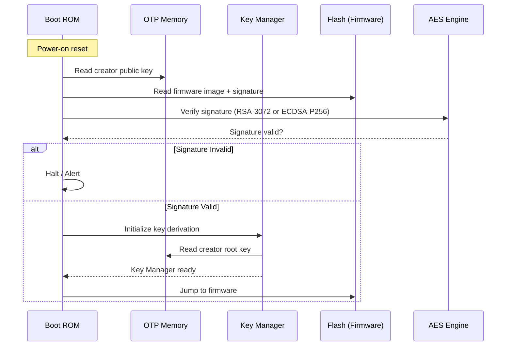

[← 12 Open Source Open Hardware Home](../README.md) · [← Initiatives Home](README.md) · [← Project Home](../../../README.md)

# OpenTitan — Open-Source Silicon Root of Trust

OpenTitan is the first open-source silicon Root of Trust (RoT) — a collaborative project led by lowRISC and Google to build a transparent, auditable, and vendor-neutral security chip foundation. Every line of RTL, firmware, verification infrastructure, and documentation is open — unprecedented transparency for a security-critical component that has traditionally been a proprietary black box.

---

## Overview

A Root of Trust is the foundational security component in any system — the component that verifies boot firmware integrity before the main CPU executes. Every secure boot chain requires one: Apple's Secure Enclave, Google's Titan, Microsoft's Pluton, and ARM's TrustZone are all proprietary RoT implementations.

OpenTitan's core value proposition: **if you cannot inspect the security chip, you cannot verify the security**. By making every layer open — from the Ibex RISC-V core to the crypto engines to the OTP memory controller — OpenTitan enables:

- **Independent security audits** — any researcher can review the RTL for side channels, backdoors, or implementation flaws
- **Supply chain transparency** — no proprietary IP that must be taken on trust
- **Customization** — organizations can modify the design for their specific threat model
- **Educational value** — a production-grade security SoC that students and researchers can study, modify, and tape out

### Project History & Stakeholders

| Organization | Role |
|---|---|
| **lowRISC CIC** | Steward — governance, roadmap, community management |
| **Google** | Primary funder — initiated the project, contributes RTL and verification |
| **Western Digital** | Early adopter — exploring OpenTitan for storage controllers |
| **Seagate** | Advisory — interested in RoT for storage devices |
| **Rivos** | Contributing — RISC-V server platform with OpenTitan RoT |

OpenTitan is not a Google product — it is a community-governed open project under the Apache 2.0 license.

---

## Architecture

### Block Diagram



### Core Components

| Component | Implementation | Purpose |
|---|---|---|
| **Ibex Core** | RV32IMC, 2-stage pipeline, PMP (4 regions) | Executes firmware; small enough to verify formally |
| **AES Engine** | 128/192/256-bit, 6 modes | Symmetric encryption for sealed storage and communication |
| **HMAC** | SHA-256 based | Message authentication and integrity |
| **KMAC** | Keccak-1600 based (SHA-3 family) | Post-quantum-safe MAC; also serves as SHA-3 hash |
| **Key Manager** | Hardened key derivation | Derives sealing and attestation keys without exposing root key |
| **OTP Controller** | One-time programmable memory | Stores device secrets, creator/owner keys, configuration; unmodifiable after provisioning |
| **Entropy Source** | Physical TRNG + SHA-3 conditioning | True random number generation for key generation and nonce creation |
| **Alert Handler** | Hardware alert aggregation | Detects and escalates security violations (tamper, fault injection, parity errors) |
| **Power Manager** | Sleep/wake state machine | Minimizes power during idle; gates clocks to reduce side-channel leakage |
| **Pinmux** | Configurable I/O mapping | Allows any peripheral to be routed to any pad — flexibility for different board designs |

---

## The Ibex Core

OpenTitan uses the [Ibex](../../11_soft_cores_and_soc_design/riscv_cores/ibex_cv32e.md) RISC-V core — chosen for its minimal attack surface and formal verifiability.

| Parameter | OpenTitan Configuration |
|---|---|
| ISA | RV32IMC |
| Pipeline | 2-stage (IF + ID/EX) |
| Multiplier | Fast (single-cycle) or iterative (area-optimized) |
| PMP | 4 regions (hardware isolation) |
| Interrupts | 32 external + NMI |
| Debug | JTAG via debug module |
| Security | Latch-based register file (ASIC), secure PC stepping, dummy instruction insertion |

The 2-stage pipeline is deliberately simple — fewer pipeline stages mean fewer speculative side channels and a smaller verification surface. The PMP (Physical Memory Protection) regions isolate firmware from peripheral address space and protect the key manager from unauthorized access.

---

## Key Manager: Hardware Key Derivation

The Key Manager is OpenTitan's most security-critical component. It derives all operational keys from a root secret stored in OTP, without ever exposing the root key to software.



**Key derivation flow**:
1. At manufacturing, the **Creator Root Key** is provisioned into OTP (one-time, cannot be changed)
2. The Key Manager uses a hardware KDF (based on KMAC) to derive **Owner Intermediate Keys**
3. Owner keys are further derived into **Sealing Keys** (tied to specific software configurations) and **Attestation Keys** (device identity for remote attestation)
4. The root key **never leaves the Key Manager hardware** — software can only request derived keys for specific operations

This architecture means that even if firmware is compromised, the attacker cannot extract the root key or derive keys for different software configurations.

---

## Secure Boot Flow



1. **Mask ROM** (immutable) executes first — reads creator public key from OTP
2. ROM verifies the **first-stage bootloader** signature using RSA-3072 or ECDSA-P256
3. If valid, the Key Manager initializes and the bootloader executes
4. Each subsequent stage verifies the next before handing off control
5. The **ROM cannot be modified** — it is hardcoded in the silicon (or FPGA bitstream)

---

## Alert Handler: Tamper Detection

The Alert Handler is a hardware security monitor that aggregates alerts from across the SoC:

| Alert Source | Example | Severity |
|---|---|---|
| **Crypto parity errors** | AES computation produced parity fault | Fatal |
| **Key manager integrity** | Unauthorized key access attempt | Fatal |
| **OTP integrity error** | ECC mismatch in OTP read | Fatal |
| **Bus integrity** | TileLink protocol violation | Fatal |
| **Clock glitch detection** | Frequency outside expected range | Fatal |
| **Power glitch detection** | Voltage droop outside threshold | Recoverable |
| **Software alert** | Firmware-reported anomaly | Configurable |

**Escalation path**: Local alert → class aggregation → phase escalation (timeout → wipe secrets → reset → permanent disable). The escalation is hardware-only — software cannot prevent or delay it.

---

## FPGA Targets

| Board | FPGA | Resource Usage | Use Case |
|---|---|---|---|
| **ChipWhisperer CW310** | Kintex-7 XC7K410T | ~25% LUTs, ~15% BRAM | Primary development + side-channel analysis |
| **Nexys Video** | Artix-7 XC7A200T | ~40% LUTs, ~25% BRAM | Alternate dev board (lower cost) |
| **CW305** | Artix-7 XC7A100T | ~80% LUTs | Side-channel analysis (smaller, cheaper) |

> **Note**: OpenTitan on FPGA runs at ~10–20 MHz — much slower than ASIC (100+ MHz expected). The FPGA implementations are for development, verification, and security research, not for production deployment.

### FPGA Build

```bash
# Clone OpenTitan
git clone https://github.com/lowRISC/opentitan.git
cd opentitan

# Build for CW310 (requires Vivado)
./meson_init.sh
ninja -C build-out sw/device/lib/testing/test_rom/test_rom_export_fpga_cw310
ninja -C build-out hw/top_earlgrey/top_earlgrey_cw310.bit

# Flash bitstream
util/opentitantool.py fpga load-bitstream build-out/hw/top_earlgrey/top_earlgrey_cw310.bit
```

---

## Verification Methodology

OpenTitan's verification infrastructure is as important as its RTL — for a security chip, an unverified design is an insecure design.

| Method | Tool | Coverage |
|---|---|---|
| **Functional DV** | UVM + Verilator | 100% line/branch/FSM toggle on all IP blocks |
| **Formal verification** | JasperGold, CV4W | Proves absence of deadlocks, bus protocol compliance, PMP isolation |
| **Security verification** | Custom testbench | Fault injection, side-channel leakage detection, alert path testing |
| **FPGA validation** | CW310 + ChipWhisperer | Power analysis, timing fault injection, JTAG debug |
| **Software tests** | on-device + Verilator sim | Boot ROM, firmware, crypto correctness, key manager |

Each IP block requires a **full verification plan** (V2) before merge — including functional coverage closure, assertion coverage, and security-specific test cases. The project uses a strict "no V2, no merge" policy.

---

## Why It Matters for FPGA Developers

1. **Transparent security**: Every mechanism is documented and auditable — unlike proprietary TPMs/secure elements where you must trust the vendor
2. **RISC-V + Ibex**: A real-world example of a production-hardened open RISC-V core running security firmware in a safety-critical context
3. **Verification methodology**: OpenTitan's DV methodology (UVM + formal + FPGA + security) is a model for verifying any security-critical FPGA design
4. **Hardware/software co-design**: Demonstrates how to architect a chip where firmware and hardware are co-designed around security invariants
5. **Side-channel awareness**: Clock gating, dummy instruction insertion, and constant-time crypto implementations show how to mitigate power analysis attacks in FPGA designs

---

## When to Use OpenTitan

| Use Case | Recommended | Alternative |
|---|---|---|
| Custom secure boot for FPGA SoC | OpenTitan Ibex + key manager | Vendor-specific secure boot (Xilinx eFUSE, Intel OTP) |
| Learning hardware security design | OpenTitan FPGA on CW310 | Textbooks only (no hands-on) |
| Side-channel research | OpenTitan on CW305/CW310 | Custom DUT (less representative) |
| Production RoT in custom ASIC | OpenTitan Earlgrey (tape out) | Commercial TPM (less transparent) |
| Embedded key management | Key Manager IP only (extract) | Software-only key derivation (less secure) |

---

## Best Practices

1. **Use the provided FPGA bitstreams** — building from source requires Vivado and takes 30+ minutes; pre-built bitstreams are available in the releases
2. **Start with the ChipWhisperer CW310** — it has the most complete OpenTitan support including side-channel measurement headers
3. **Study the verification plans first** — the DV plans in `hw/ip/*/dv/` are often more instructive than the RTL itself for understanding security design intent
4. **Clock gating matters** — OpenTitan deliberately gates clocks in the AES engine to reduce power-side-channel leakage; replicate this pattern in your own crypto FPGA designs
5. **Read the mask ROM** — `sw/device/silicon_creator/rom/` contains the immutable boot code; understanding it is essential for understanding the security model

---

## Antipatterns

- **Deploying FPGA bitstream as production RoT** — FPGA bitstreams can be extracted and cloned; use ASIC tapeout for production
- **Modifying the Key Manager without formal verification** — the key derivation logic is security-critical; any modification must be formally verified against the security specification
- **Disabling alert handler for debugging** — the alert handler is essential for tamper detection; disabling it creates a permanent security hole
- **Assuming Ibex is a general-purpose CPU** — it is deliberately minimal (2-stage, no cache, no branch prediction) to reduce attack surface; do not try to run Linux on it

---

## Pitfalls

- **OTP is one-time programmable** — once you burn a key into OTP, it cannot be changed; incorrect provisioning bricks the device
- **FPGA implementations are slow** — 10–20 MHz vs 100+ MHz ASIC; do not benchmark performance on FPGA
- **Side-channel leakage differs between FPGA and ASIC** — countermeasures effective on ASIC (latch-based register files, clock gating) may not translate directly to FPGA
- **The Boot ROM is immutable** — in ASIC, it is mask ROM; in FPGA, it is compiled into the bitstream. Either way, bugs in the ROM cannot be patched — only worked around in later boot stages
- **Verification is the bottleneck** — OpenTitan's verification takes significantly more engineering effort than the RTL itself; expect a 3:1 verification-to-design ratio

---

## References

- [OpenTitan GitHub](https://github.com/lowRISC/opentitan)
- [OpenTitan Documentation](https://opentitan.org/book/)
- [Ibex Core Details](../../11_soft_cores_and_soc_design/riscv_cores/ibex_cv32e.md)
- [ChipWhisperer CW310](https://www.newae.com/chipwhisperer-cw310)
- [lowRISC Organization](https://www.lowrisc.org/)
- [OpenTitan Security Specification](https://opentitan.org/book/doc/security/spec/)
