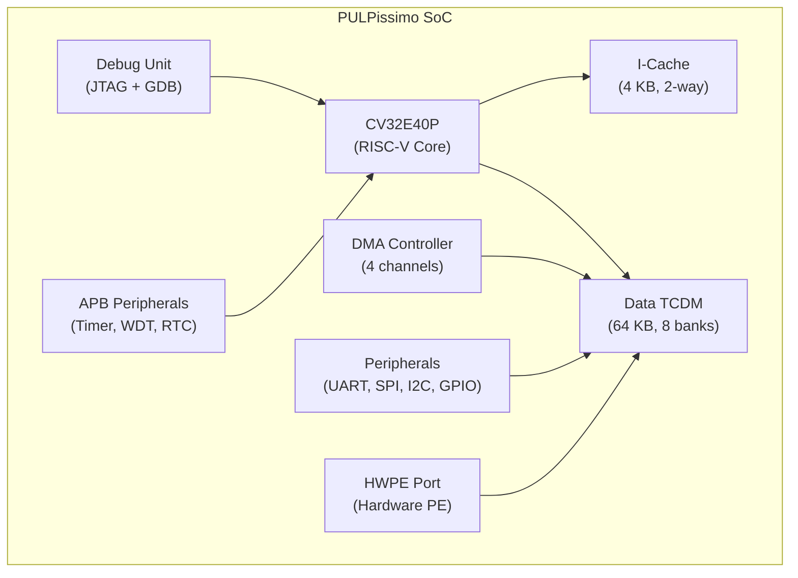

[← 12 Open Source Open Hardware Home](../README.md) · [← Initiatives Home](README.md) · [← Project Home](../../../README.md)

# PULP Platform — Parallel Ultra-Low-Power Computing from ETH Zürich

ETH Zürich's PULP (Parallel Ultra-Low-Power) platform is one of the most impactful academic open-source silicon projects — 50+ ASIC tape-outs, multiple RISC-V cores adopted by industry, and fully FPGA-compatible. PULP bridges the gap between academic research and production silicon better than any other open-source project.

---

## Overview

PULP started in 2013 at ETH Zürich's Integrated Systems Laboratory (IIS) as a research project exploring how to achieve energy-proportional computing — the idea that a processor should consume power proportional to its workload, not always burn peak power. The answer was a cluster of simple RISC-V cores with shared memory, operating at near-threshold voltage (0.5–0.8 V), with hardware accelerators for domain-specific workloads.

What makes PULP unique: the same RTL that runs in simulation also runs on FPGA prototypes and has been taped out as ASIC on multiple foundry nodes (65 nm, 22 nm, 12 nm). This is not just academic code — GreenWaves Technologies' GAP8 commercial IoT processor is a PULP derivative.

---

## Core Projects

| Project | Description | FPGA Status | ASIC Taped Out |
|---|---|---|---|
| **PULPissimo** | Single-core microcontroller SoC (CV32E40P) | ✅ Full FPGA support (Xilinx, Intel) | ✅ 22 nm FD-SOI |
| **PULP** | Multi-core cluster platform (4–8 cores) | ✅ FPGA proven | ✅ 65 nm, 22 nm |
| **Snitch** | Minimal RISC-V core with custom accelerators | ✅ FPGA support | ✅ 12 nm |
| **Ara** | RISC-V vector processor (RVV 1.0) | ✅ FPGA (large devices) | ✅ 22 nm |
| **Mempool** | 256-core shared-L1 manycore | 🟡 Research, large FPGA needed | No (simulation only) |
| **Occamy** | Chiplet-based HPC system | 🟡 Advanced research | ✅ 12 nm (test chip) |

---

## RISC-V Cores from PULP

| Core | Type | Pipeline | RV ISA | Adopted By | FPGA LUTs |
|---|---|---|---|---|---|
| **CV32E40P (RI5CY)** | 4-stage in-order | Single-issue, HW loops | RV32IMFCXpulp | OpenHW Group, GreenWaves GAP8 | ~14K (Artix-7) |
| **CVE2 (Zero-riscy)** | 2-stage in-order | Ultra-low area | RV32IMC | OpenHW Group | ~5K (Artix-7) |
| **CV32E40S** | 4-stage in-order | Safety features | RV32IM[F]Zfinx | OpenHW Group (safety certified) | ~18K |
| **Snitch** | 2-stage minimal | Lightweight + custom ISA | RV32IMA | ETH research, HPC | ~3K |
| **Ara** | Vector unit | Attached to CVA6 | RVV 1.0 | HPC research | ~50K+ (large) |

### The Xpulp ISA Extensions

The CV32E40P implements **Xpulp** — custom ISA extensions for DSP and embedded workloads that go beyond the base RISC-V ISA:

| Extension | Instructions | Purpose |
|---|---|---|
| **Hardware loops** | `lp.starti`, `lp.endi`, `lp.counti` | Zero-overhead loops (no branch penalty) |
| **Post-increment loads** | `p.lw`, `p.lh`, `p.lb` with increment | DSP-style streaming memory access |
| **Multiply-accumulate** | `p.mac`, `p.msu` | Single-cycle MAC for filter operations |
| **Vector operations** | `p.add`, `p.sub` (SIMD-like) | Sub-word parallelism (2× 16-bit or 4× 8-bit) |
| **Bit manipulation** | `p.extract`, `p.insert`, `p.bclr` | Efficient bitfield operations |

---

## PULPissimo SoC Architecture



### PULPissimo FPGA Build

```bash
# Clone and build PULPissimo for Xilinx FPGA
git clone https://github.com/pulp-platform/pulpissimo.git
cd pulpissimo
export VSIM_PATH=$(pwd)/sim
# FPGA build (Xilinx)
make -C fpga TARGET=zcu104
# Or for Intel FPGA
make -C fpga TARGET=de10_nano
```

---

## Why PULP Matters for FPGA Developers

1. **Production-quality RISC-V cores** — CV32E40P/CVE2 are OpenHW-verified, not just research toys
2. **Full SoC templates** — PULPissimo gives you a working SoC with CPU + peripherals + debug in hours
3. **FPGA-first prototyping** — PULP uses FPGA as the primary prototyping platform before ASIC tape-out
4. **Hardware/software co-design** — PULP SDK provides GCC + OpenMP + FreeRTOS targeting their cores
5. **Energy-proportional computing** — near-threshold voltage operation is a PULP innovation that transfers to FPGA power management

---

## PULP vs Other RISC-V Platforms

| Feature | PULP (PULPissimo) | OpenTitan (Earl Grey) | LiteX + VexRiscv |
|---|---|---|---|
| **Core** | CV32E40P (Xpulp) | Ibex (RV32IMC) | VexRiscv (RV32IMC) |
| **Primary target** | ASIC + FPGA | ASIC (FPGA prototype) | FPGA |
| **Focus** | Ultra-low-power DSP | Security (RoT) | General-purpose SoC |
| **Custom ISA** | Xpulp (HW loops, MAC) | None | None |
| **SDK** | PULP SDK (GCC, OpenMP) | OpenTitan OTFN + test ROM | LiteX BIOS + Linux |
| **Verification** | UVM + formal | UVM + formal + security | LiteX automated tests |
| **ASIC proven** | ✅ 50+ tape-outs | ✅ (tape-out planned) | No (FPGA only) |

---

## When to Use / When NOT to Use

### When to Use PULP

- **Ultra-low-power design research** — near-threshold voltage, energy-proportional computing
- **DSP/embedded workloads** — Xpulp ISA extensions provide significant speedups for signal processing
- **ASIC prototyping on FPGA** — PULP's FPGA flow is the same RTL that goes to silicon
- **RISC-V core selection** — CV32E40P is one of the most mature RV32 cores available

### When NOT to Use PULP

- **General-purpose Linux SoC** — PULP cores are microcontroller-class; for Linux, use VexRiscv or Rocket
- **High-performance computing** — PULP optimizes for energy efficiency, not peak performance
- **Security-critical designs** — use OpenTitan instead, which is designed for security from the ground up

---

## Best Practices

1. **Use the PULP SDK for software development** — it includes GCC with Xpulp support, OpenMP runtime, and FreeRTOS
2. **Start with PULPissimo** — it's the simplest SoC template; move to multi-core PULP only when you need parallelism
3. **Use the HWPE port for custom accelerators** — the Hardware Processing Engine interface is the standard way to add custom compute to PULPissimo

---

## Antipatterns

- **The General-Purpose Linux Expectation** — deploying PULP expecting to run Linux; it's a microcontroller, not an application processor
- **The FPGA-Only Deployment** — PULP's value is in the ASIC path; if you never intend to tape out, LiteX + VexRiscv is simpler

---

## Pitfalls

1. **PULP build system complexity** — the build uses Bender and FuseSoC; installing the toolchain requires specific versions
2. **Xpulp GCC support** — the Xpulp ISA extensions require the PULP-specific GCC fork; standard RISC-V GCC does not support them
3. **FPGA resource usage** — the full PULPissimo SoC with DMA, peripherals, and cache is larger than a minimal VexRiscv SoC
4. **Documentation fragmentation** — PULP documentation is spread across multiple repos, wikis, and papers; start with the PULP GitHub organization

---

## Use Cases

- **IoT sensor processing** — PULP's ultra-low-power design is ideal for battery-powered sensor nodes
- **DSP accelerator research** — Xpulp ISA extensions and HWPE port for custom DSP hardware
- **ASIC prototyping** — validate your SoC design on FPGA before committing to an expensive tape-out
- **RISC-V core evaluation** — compare CV32E40P vs Ibex vs VexRiscv for your specific workload

---

## References

- [PULP Platform (GitHub)](https://github.com/pulp-platform)
- [PULPissimo SoC (GitHub)](https://github.com/pulp-platform/pulpissimo)
- [CV32E40P Core (GitHub)](https://github.com/openhwgroup/cv32e40p)
- [PULP SDK](https://github.com/pulp-platform/pulp-sdk)
- [GreenWaves GAP8 (Commercial)](https://www.greenwaves-technologies.com/)
- [PULP Research Papers](https://iis.ee.ethz.ch/research/digital-circuits.html)
- [OpenTitan](opentitan.md) — security-focused alternative
- [Ibex/CV32E Core](../../11_soft_cores_and_soc_design/riscv_cores/ibex_cv32e.md) — detailed core article
