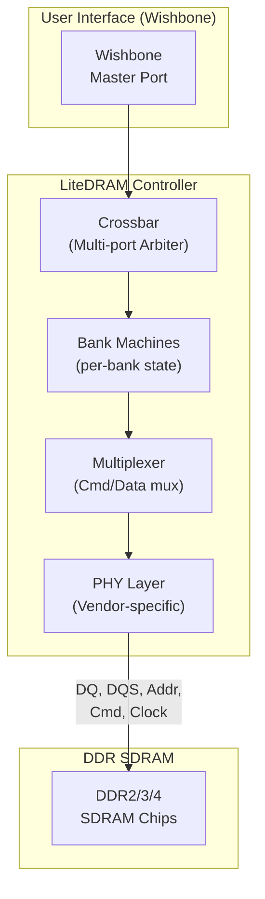
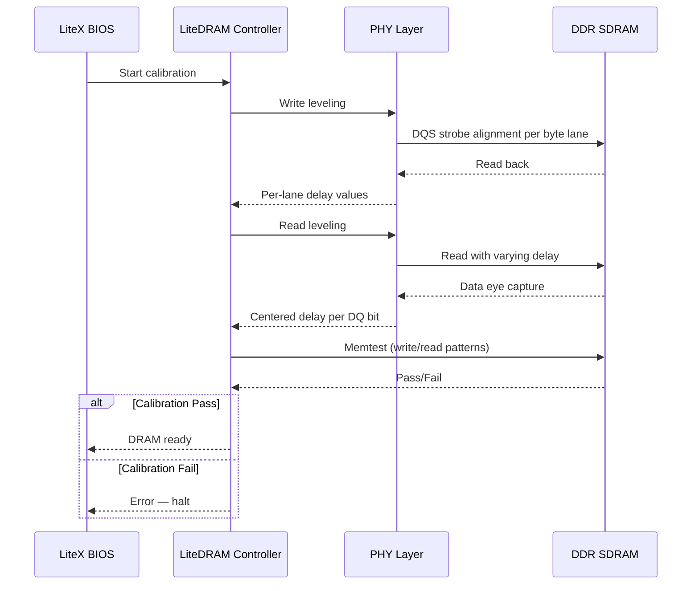
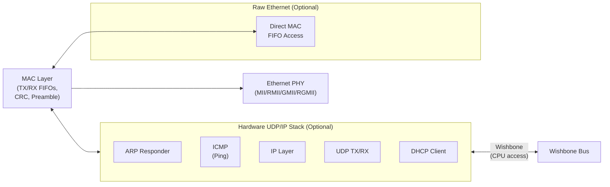
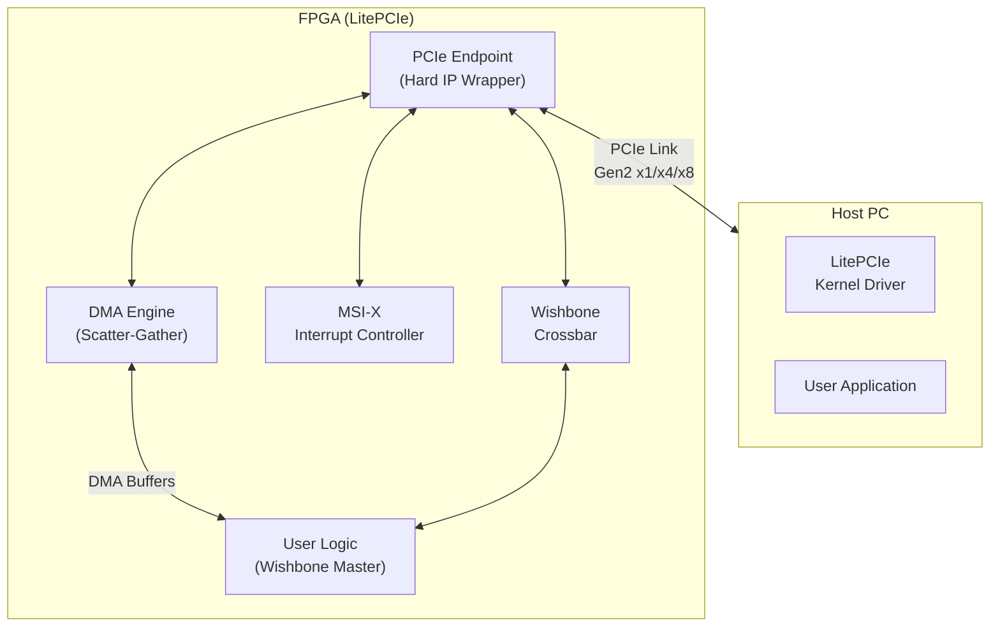
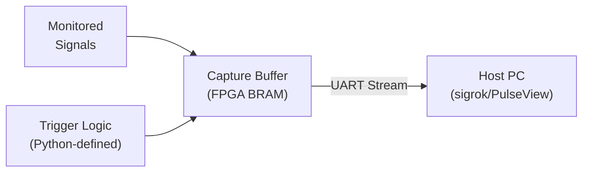

[← 12 Open Source Open Hardware Home](../README.md) · [← Litex Home](README.md) · [← Project Home](../../../README.md)

# LiteX Core Ecosystem — LiteDRAM, LiteEth, LitePCIe & More

LiteX's power comes from its ecosystem of "Lite" cores — open-source, vendor-agnostic IP blocks that provide essential SoC functions (DRAM controller, Ethernet MAC, PCIe endpoint, SD card, etc.) with clean Wishbone interfaces. Each core is designed to be used standalone or integrated into a LiteX SoC, and all share the same design philosophy: Python-based configuration, Migen/Amaranth RTL generation, and portable Verilog output.

---

## Overview

The LiteX ecosystem follows a consistent pattern across all cores:

| Design Principle | Implementation |
|---|---|
| **Vendor agnostic** | Wishbone bus as the standard interconnect; vendor-specific primitives isolated in PHY layers |
| **Python-configurable** | All parameters (data width, clock frequency, burst length) set via Python constructors |
| **Auto-generated** | RTL is generated from Python/Migen descriptions, not hand-written Verilog |
| **Self-testing** | Built-in test suites (LiteDRAM: memtest, LiteEth: loopback, LitePCIe: DMA stress) |
| **Simulation-first** | All cores simulate in Verilator before FPGA testing |

---

## Core Catalog

| Core | Function | FPGA Families | Resource (approx) | Maturity |
|---|---|---|---|---|
| **LiteDRAM** | DDR2/3/4, SDRAM, LPDDR controller | All | 3K–8K LUTs | Mature |
| **LiteEth** | 10/100/1000 Ethernet MAC + UDP/IP stack | All (with PHY) | 2K–5K LUTs | Mature |
| **LitePCIe** | PCIe Gen2 x1/x4/x8 endpoint + DMA | 7-Series, ECP5, Ultrascale+ | 5K–12K LUTs | Mature |
| **LiteSATA** | SATA Gen1/2 host controller | 7-Series, ECP5 | 3K–6K LUTs | Mature |
| **LiteSDCard** | SD/SDHC card SPI/SD-mode controller | All | ~500 LUTs | Mature |
| **LiteSPI** | QSPI/Dual/Octal SPI flash controller | All | ~400 LUTs | Mature |
| **LiteICLink** | Inter-FPGA high-speed serial link | 7-Series, ECP5 | 1K–3K LUTs | Good |
| **LiteScope** | On-chip logic analyzer | All | 2K–6K LUTs | Mature |

---

## LiteDRAM — Cross-Platform DRAM Controller

LiteDRAM is arguably the most important core in the ecosystem. It provides a portable DRAM controller that auto-calibrates at every boot — no vendor IP, no locked-in toolchain.

### Architecture



### Auto-Calibration Sequence

LiteDRAM calibrates at every boot — this is what makes it portable across boards without manual timing adjustment:



1. **Write leveling** — aligns DQS to clock per byte lane (critical for DDR3/4 fly-by topology)
2. **Read leveling** — adjusts per-bit delays to center DQ in the data eye
3. **Memtest** — writes/reads patterns (0x00000000, 0xFFFFFFFF, walking 1s/0s, pseudo-random) to verify calibration

### Compatibility Matrix

| FPGA | DDR Type | Speed | Status | Notes |
|---|---|---|---|---|
| Artix-7 (Arty A7) | DDR3-1600 | 800 MHz data rate | Mature | Primary test platform |
| Kintex-7 (KC705) | DDR3-1600 | 800 MHz | Mature | |
| Kintex Ultrascale+ | DDR4-2400 | 1200 MHz | Mature | |
| ECP5 (ULX3S) | SDRAM | 100 MHz | Mature | Rock-solid, recommended for beginners |
| ECP5 (ButterStick) | DDR3 | 800 MHz | Experimental | Requires careful pin constraints |
| Cyclone V | SDRAM / DDR3 | Varies | Limited | Intel PHY integration not complete |
| Gowin GW5A | SDRAM | 100 MHz | Experimental | Community contribution |

### Integration Example

```python
from migen import *
from litex.soc.interconnect import wishbone
from litedram import modules as dram_modules
from litedram.phy import s7ddrphy, ecp5ddrphy

# Arty A7 with DDR3-1600
class BaseSoC(SoCCore):
    def __init__(self, **kwargs):
        super().__init__(**kwargs)

        # DDR3 controller
        self.submodules.ddrphy = s7ddrphy.A7DDRPHY(
            platform.request("ddram"),
            memtype="DDR3",
            nphases=4,
            sys_clk_freq=sys_clk_freq
        )
        self.add_sdram("sdram",
            phy=self.ddrphy,
            module=dram_modules.MT41K128M16(sys_clk_freq, "1:4"),
            size=0x10000000,  # 256 MB
        )
```

### Resource Usage

| Configuration | LUTs | FFs | BRAM | DSPs |
|---|---|---|---|---|
| SDRAM (ECP5, 16-bit) | ~2,500 | ~1,800 | 2 | 0 |
| DDR3-1600 (Artix-7, 16-bit) | ~5,200 | ~4,100 | 4 | 0 |
| DDR3-1600 (Artix-7, 32-bit) | ~7,800 | ~6,200 | 6 | 0 |
| DDR4-2400 (Kintex US+, 16-bit) | ~6,800 | ~5,400 | 5 | 0 |

---

## LiteEth — Ethernet MAC + Hardware UDP/IP Stack

LiteEth provides a complete 10/100/1000 Ethernet MAC with an optional hardware UDP/IP stack — meaning your FPGA can respond to ping, ARP, and DHCP without any soft CPU.

### Architecture



### Hardware Stack Features

| Feature | Implementation | Notes |
|---|---|---|
| **ARP** | Hardware responder | Responds to ARP requests for configured IP |
| **ICMP** | Hardware ping reply | Sub-millisecond ping latency |
| **IP** | Hardware header processing | Checksum verification and generation |
| **UDP** | Hardware TX/RX | Payload accessible via Wishbone or direct FIFO |
| **DHCP** | Hardware client | Auto-configures IP address at boot |

### Integration Example

```python
class BaseSoC(SoCCore):
    def __init__(self, with_ethernet=False, **kwargs):
        super().__init__(**kwargs)
        
        if with_ethernet:
            # PHY (board-specific)
            self.submodules.ethphy = LiteEthPHYRGMII(
                platform.request("eth_clocks"),
                platform.request("eth"),
                tx_delay=0e-9, rx_delay=2e-9
            )
            # MAC + hardware UDP/IP stack
            self.add_ethernet(
                phy=self.ethphy,
                ip_address="192.168.1.50",
                mac_address=0x10e2d5000000,
            )
            # FPGA now responds to ping — no CPU needed
```

### Resource Usage

| Configuration | Speed | LUTs | FFs | BRAM |
|---|---|---|---|---|
| MAC only (MII) | 10/100 Mbps | ~1,800 | ~1,200 | 2 |
| MAC + UDP/IP (MII) | 10/100 Mbps | ~3,500 | ~2,400 | 4 |
| MAC only (RGMII) | 1 Gbps | ~2,500 | ~1,800 | 2 |
| MAC + UDP/IP (RGMII) | 1 Gbps | ~4,800 | ~3,200 | 5 |

---

## LitePCIe — PCIe Endpoint + DMA Engine

LitePCIe provides a portable PCIe endpoint with an integrated DMA engine — the most complex core in the ecosystem.

### Architecture



### DMA Modes

| Mode | Direction | Mechanism | Use Case |
|---|---|---|---|
| **DMA Reader** | Host → FPGA | Host writes to FPGA buffer; FPGA consumes via Wishbone | Streaming data into FPGA |
| **DMA Writer** | FPGA → Host | FPGA produces via Wishbone; DMA pushes to host memory | Sensor data capture, crypto results |
| **Scatter-Gather** | Both | Chain of descriptors in host memory; DMA follows chain | Large transfers across non-contiguous host buffers |

### Integration Example

```python
class PCIeSoC(SoCCore):
    def __init__(self, **kwargs):
        super().__init__(**kwargs)
        
        # PCIe endpoint (uses hard IP block)
        self.submodules.pcie_phy = LitePCIePHY(
            platform.request("pcie_x4"),
            bar0_size=0x10000,  # 64 KB BAR0
        )
        self.add_pcie(
            phy=self.pcie_phy,
            ndmas=2,  # 2 DMA channels
            with_msi=True,
        )
```

### Compatibility

| FPGA | PCIe Gen | Lanes | Status |
|---|---|---|---|
| Artix-7 | Gen2 | x1, x2, x4 | Mature |
| Kintex-7 | Gen2 | x1, x4, x8 | Mature |
| Kintex Ultrascale+ | Gen3 | x1, x4, x8 | Mature |
| ECP5 | Gen2 | x1, x2 | Mature |
| Cyclone V | Gen1 | x1 | Limited |

---

## LiteSDCard — SD Card Controller

A minimal SD card controller supporting both SPI and native SD modes:

| Feature | SPI Mode | SD Mode |
|---|---|---|
| **Clock** | Up to 25 MHz | Up to 50 MHz |
| **Bus width** | 1-bit | 1-bit or 4-bit |
| **LUTs** | ~300 | ~500 |
| **Use case** | Boot, simple file read | Higher throughput |

LiteX BIOS uses LiteSDCard to load payloads from SD card at boot. No filesystem — the BIOS reads raw sectors. Filesystem support (FAT32) must be provided by the payload (e.g., Linux kernel).

---

## LiteSPI — SPI Flash Controller

Controls QSPI/Dual/Octal SPI flash chips — used for:
- **Booting** — load bitstream or initial firmware from SPI flash
- **Configuration storage** — persist settings across power cycles
- **Execute-in-place (XIP)** — map flash directly into CPU address space (some configurations)

| Mode | Data Width | Clock | Throughput |
|---|---|---|---|
| Standard SPI | 1-bit | Up to 50 MHz | ~6 MB/s |
| Dual SPI | 2-bit | Up to 50 MHz | ~12 MB/s |
| Quad SPI (QSPI) | 4-bit | Up to 50 MHz | ~25 MB/s |
| Octal SPI | 8-bit | Up to 50 MHz | ~50 MB/s |

Resource cost: ~400 LUTs for QSPI mode.

---

## LiteICLink — Inter-FPGA Serial Link

Provides point-to-point high-speed serial communication between FPGAs using transceivers:

```python
# Connect two FPGAs via high-speed serial
self.submodules.serdes = SERDES(
    platform.request("serdes"),
    data_width=16,
    clock_freq=125e6,  # 2 Gbps
)
```

| FPGA | Transceiver | Line Rate | Status |
|---|---|---|---|
| Artix-7 | GTP | Up to 6.6 Gbps | Good |
| Kintex-7 | GTX | Up to 12.5 Gbps | Good |
| ECP5 | PCIe PCS | Up to 3.125 Gbps | Good |

---

## LiteScope — On-Chip Logic Analyzer

The open-source equivalent of Xilinx ILA and Intel SignalTap — with a crucial difference: the capture data is streamed over UART, not JTAG, and the trigger logic is fully configurable in Python.

### Architecture



### Integration Example

```python
# Add logic analyzer to debug a signal
self.submodules.analyzer = LiteScopeAnalyzer(
    signals=[
        self.cpu.dbus.stb,
        self.cpu.dbus.cyc,
        self.cpu.dbus.adr,
        self.cpu.dbus.dat_w,
        self.cpu.dbus.ack,
    ],
    depth=256,  # 256 samples
    clock_domain="sys",
)

# On host: capture and view in PulseView
# $ litex_server --uart --port /dev/ttyUSB0
# $ litescope_cli --analyzer
# Export to sigrok for PulseView visualization
```

Resource cost: 2K–6K LUTs depending on signal width and capture depth.

---

## Cross-Core Integration Pattern

All Lite cores share a common integration pattern within a LiteX SoC:

```python
from litex.soc.cores import *

class MySoC(SoCCore):
    def __init__(self, **kwargs):
        super().__init__(**kwargs)
        
        # Each core adds itself to the Wishbone bus
        # Auto-generates: csr.h, sdram_phy.h, mem.h
        self.add_sdram(...)        # LiteDRAM
        self.add_ethernet(...)     # LiteEth
        self.add_pcie(...)         # LitePCIe
        self.add_spi_flash(...)    # LiteSPI
        self.add_sdcard(...)       # LiteSDCard
```

The auto-generated C headers provide:
- **`csr.h`** — Control and Status Register addresses and bit layouts for all peripherals
- **`mem.h`** — Memory map (RAM, ROM, peripheral base addresses)
- **`sdram_phy.h`** — SDRAM PHY settings for the BIOS calibration routine

---

## When to Use Lite Cores

| Use Case | Recommended Lite Core | Vendor Alternative |
|---|---|---|
| Cross-platform DDR3/4 on Xilinx + Lattice | LiteDRAM | MIG (Xilinx-only), EMIF (Intel-only) |
| Ethernet with hardware UDP/IP | LiteEth | 1G/10G Ethernet IP (vendor, no HW stack) |
| Custom PCIe accelerator with DMA | LitePCIe | Xilinx DMA/Bridge Subsystem (more complex) |
| SD card boot for soft CPU | LiteSDCard | vendor SPI IP (less portable) |
| On-chip debug without vendor tools | LiteScope | ILA (Xilinx), SignalTap (Intel) — require vendor GUI |
| Inter-FPGA data link | LiteICLink | Aurora (Xilinx-only) |

---

## Best Practices

1. **LiteDRAM: Start with SDRAM on ECP5** — DDR3 on ECP5 is experimental; SDRAM is rock-solid and requires no calibration
2. **LiteEth: Use for lightweight UDP** — the hardware stack handles ARP/ICMP/UDP/DHCP; for TCP, use a soft CPU (LwIP, FreeRTOS)
3. **LitePCIe: Verify link training first** — check LTSSM state before debugging DMA; same approach as vendor PCIe debug
4. **Pin constraints matter** — LiteDRAM needs correct pin grouping (same byte lane, same bank) just like MIG/EMIF
5. **Use LiteScope early** — add the analyzer to your SoC from day one; it is much faster than re-synthesizing to add SignalTap/ILA
6. **Version-pin your LiteX commit** — the main branch moves fast and cores can have breaking API changes

---

## Antipatterns

- **Using LiteEth for high-throughput TCP** — the hardware stack only supports UDP/IP; for TCP, use a soft CPU with LwIP or a dedicated TCP offload core
- **Mixing LiteDRAM with vendor DDR IP** — they share the same physical pins; you cannot use both simultaneously
- **Ignoring calibration failures** — if LiteDRAM memtest fails, do not proceed; debug the PHY settings and pin constraints first
- **Using LitePCIe on FPGAs without hard PCIe blocks** — the soft PCIe endpoint is extremely resource-intensive and rarely works; always use the hard PCIe block

---

## Pitfalls

- **ECP5 DDR3 is experimental** — LiteDRAM DDR3 on ECP5 works but is sensitive to pin routing and board layout; prefer SDRAM for reliability
- **LiteEth RGMII timing** — TX/RX delays must match the board layout; incorrect values cause packet loss (typically tx_delay=0, rx_delay=2ns for Arty A7)
- **LitePCIe DMA alignment** — DMA buffers must be aligned to cache line size on the host; unaligned buffers cause silent data corruption
- **LiteScope capture depth** — limited by available BRAM; a 128-bit wide signal at 256 depth uses ~4 BRAM blocks — plan your budget
- **Cyclone V support is limited** — most cores are developed and tested on Xilinx 7-Series and Lattice ECP5; Intel FPGA support lags behind

---

## References

- [LiteDRAM GitHub](https://github.com/enjoy-digital/litedram)
- [LiteEth GitHub](https://github.com/enjoy-digital/liteeth)
- [LitePCIe GitHub](https://github.com/enjoy-digital/litepcie)
- [LiteSDCard GitHub](https://github.com/enjoy-digital/litesdcard)
- [LiteSPI GitHub](https://github.com/litex-hub/litespi)
- [LiteICLink GitHub](https://github.com/enjoy-digital/liteiclink)
- [LiteScope GitHub](https://github.com/enjoy-digital/litescope)
- [LiteX Overview](litex_overview.md)
