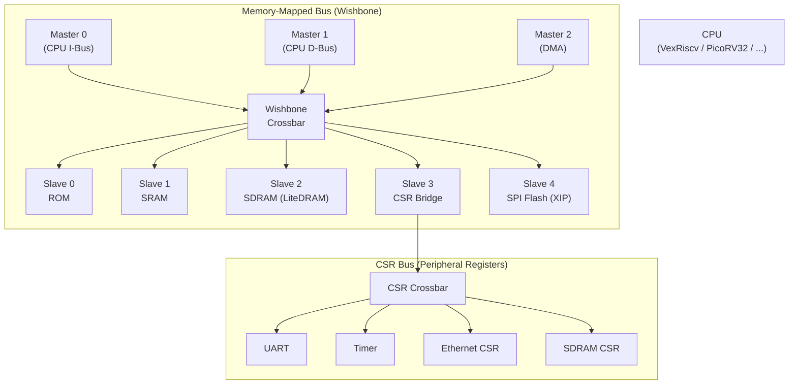
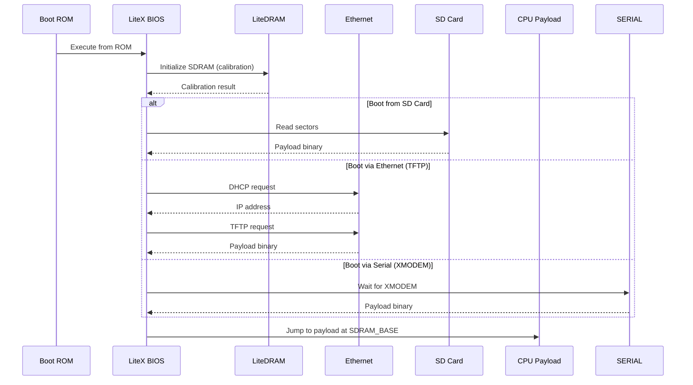

[← 12 Open Source Open Hardware Home](../README.md) · [← Litex Home](README.md) · [← Project Home](../../../README.md)

# LiteX — Python-Based SoC Generation Framework

LiteX is the most complete open-source SoC builder for FPGAs — a Python/Migen framework that generates full systems with CPU, memory controller, Ethernet, PCIe, SATA, and SD card support from a single Python configuration. Instead of dragging blocks in Vivado IP Integrator or Intel Platform Designer, you write a Python class that instantiates components, and LiteX generates the Verilog, compiles the BIOS, and produces a bitstream.

---

## Overview

### Why LiteX Matters

| Traditional SoC Design | LiteX |
|---|---|
| GUI drag-and-drop (not reproducible) | Python script (version-controlled, diffable) |
| Vendor-locked IP (AXI = Xilinx, Avalon = Intel) | Wishbone bus (cross-vendor) |
| Manual address map assignment | Auto-calculated memory map |
| Write C headers by hand | Auto-generate `csr.h`, `sdram_phy.h`, `mem.h` |
| Days to port between FPGAs | Change one line: `platform = "arty"` → `platform = "ulx3s"` |
| Vendor-specific build scripts | Unified `litex_soc_gen.py` + standard toolchain |

### What LiteX Generates

```
build/
├── gateware/               # Generated Verilog
│   ├── top.v               # Top-level SoC (CPU + bus + peripherals)
│   ├── cpu.v               # Soft CPU (VexRiscv, PicoRV32, etc.)
│   ├── mem.h               # Memory map constants
│   └── csr.h               # CSR register addresses + bit fields
├── software/
│   ├── bios/               # Boot BIOS (C, compiled for target CPU)
│   └── libbase/            # C runtime library
└── soc.py                  # The Python script that generated everything
```

---

## Architecture: Migen FHDL

LiteX is built on **Migen** (Milkymist Generator), a Python-based HDL that generates Verilog through Python metaprogramming. Migen provides three core abstractions:

### Combinational Logic (`self.comb`)

```python
from migen import *

class AndGate(Module):
    def __init__(self):
        self.a = Signal()
        self.b = Signal()
        self.y = Signal()
        self.comb += self.y.eq(self.a & self.b)
```

Generates:
```verilog
assign y = (a & b);
```

### Sequential Logic (`self.sync`)

```python
class Counter(Module):
    def __init__(self, width=26):
        self.counter = Signal(width)
        self.led = Signal()
        self.sync += self.counter.eq(self.counter + 1)
        self.comb += self.led.eq(self.counter[width-1])
```

Generates proper clock-domain-handled Verilog with `always @(posedge clk)` blocks.

### Bus Interconnect (`self.bus`)

LiteX's Wishbone interconnect is auto-generated from Python:

```python
# Add three Wishbone slaves — address map is auto-calculated
self.register_mem("rom",  origin=0x00000000, size=0x8000)
self.register_mem("sram", origin=0x10000000, size=0x2000)
self.register_mem("csr",  origin=0x60000000, size=0x10000)
```

---

## SoC Builder API

The `SoCCore` class is the foundation. It provides a complete SoC skeleton that you customize through Python constructors:

### Minimal SoC

```python
from litex.soc.cores.cpu import VexRiscv
from litex_boards.platforms import arty

class MinimalSoC(SoCCore):
    def __init__(self, **kwargs):
        # Platform = board target
        platform = arty.Platform()
        
        # SoCCore with VexRiscv CPU
        SoCCore.__init__(self, platform, 
            cpu_type="vexriscv",
            cpu_variant="standard",
            integrated_rom_size=0x8000,
            integrated_sram_size=0x2000,
            **kwargs
        )
```

### Full-Featured SoC

```python
class FullSoC(SoCCore):
    def __init__(self, with_ethernet=False, with_pcie=False, **kwargs):
        platform = arty.Platform()
        sys_clk_freq = int(100e6)
        
        SoCCore.__init__(self, platform,
            cpu_type="vexriscv",
            cpu_variant="linux",  # With MMU for Linux
            sdram_controller=True,
            **kwargs
        )
        
        # Clocking
        self.submodules.crg = _CRG(platform, sys_clk_freq)
        
        # DDR3 (LiteDRAM)
        self.submodules.ddrphy = s7ddrphy.A7DDRPHY(
            platform.request("ddram"),
            memtype="DDR3",
            nphases=4,
            sys_clk_freq=sys_clk_freq
        )
        self.add_sdram("sdram",
            phy=self.ddrphy,
            module=MT41K128M16(sys_clk_freq, "1:4"),
        )
        
        # Ethernet (LiteEth)
        if with_ethernet:
            self.submodules.ethphy = LiteEthPHYRGMII(
                platform.request("eth_clocks"),
                platform.request("eth"),
            )
            self.add_ethernet(phy=self.ethphy)
        
        # SPI Flash (LiteSPI)
        self.add_spi_flash(mode="4x")  # QSPI
        
        # SD Card (LiteSDCard)
        self.add_sdcard()
```

### Build and Flash

```bash
# Generate Verilog + BIOS + bitstream
./make.py --board=arty --cpu-type=vexriscv --cpu-variant=linux \
    --with-ethernet --with-spi-flash

# Flash via OpenOCD
openocd -f interface/ftdi/ftdi-6.cfg -f board/arty.cfg \
    -c "init; pld load 0 build/arty/gateware/top.bit; exit"
```

---

## CPU Options

| CPU | ISA | LUTs | Linux? | Clock (typical) | Best For |
|---|---|---|---|---|---|
| **VexRiscv** | RV32IMAC | 800–4,000 | Yes (with MMU variant) | 100–150 MHz | Default — best balance of performance and area |
| **PicoRV32** | RV32IMC | ~750 | No | ~50 MHz | Tiny control CPUs, glue logic |
| **Rocket** | RV64IMAFDC | 15,000+ | Yes | 50–100 MHz | 64-bit Linux SoC |
| **Microwatt** | ppc64le | 8,000+ | Yes | 40–60 MHz | Open POWER architecture |
| **SERV** | RV32I | ~125 | No | ~25 MHz | World's smallest RISC-V — education/novelty |
| **BlackParrot** | RV64IMAFDC | 20,000+ | Yes | 50–80 MHz | Multicore research |
| **LM32** | LatticeMico32 | ~1,500 | No | 75 MHz | Legacy Lattice ecosystem |
| **Mor1kx** | OpenRISC | ~3,500 | Yes (Linux) | 50–80 MHz | OpenRISC ISA |

### VexRiscv: The Default Choice

VexRiscv is the default CPU in LiteX because of its SpinalHDL plugin architecture — features are added or removed by including plugins:

```python
# Minimal VexRiscv (control CPU)
cpu_type="vexriscv", cpu_variant="minimal"

# Standard (most common)
cpu_type="vexriscv", cpu_variant="standard"

# Linux-capable (with MMU, caches, debug)
cpu_type="vexriscv", cpu_variant="linux"

# Full debug (with JTAG + GDB)
cpu_type="vexriscv", cpu_variant="linux+debug"
```

---

## Wishbone Bus Architecture

LiteX uses the **Wishbone** bus as its standard interconnect — a simple, open bus protocol that is vendor-neutral and easy to implement.

### Bus Hierarchy



### Auto-Generated Memory Map

LiteX calculates the address map automatically and generates `mem.h`:

```c
// Auto-generated mem.h
#define ROM_BASE    0x00000000
#define ROM_SIZE    0x00008000
#define SRAM_BASE   0x10000000
#define SRAM_SIZE   0x00002000
#define SDRAM_BASE  0x40000000
#define SDRAM_SIZE  0x10000000  // 256 MB
#define CSR_BASE    0x60000000
```

### CSR Register Auto-Generation

Peripheral registers (CSRs) are defined in Python and auto-documented in `csr.h`:

```python
# Define a peripheral with CSRs
class MyPeripheral(Module, AutoCSR):
    def __init__(self):
        self._control = CSRStorage(8, description="Control register")
        self._status  = CSRStatus(8, description="Status register")
        self._data    = CSRStorage(32, write_from_dev=True, description="Data register")
```

Generates:
```c
// Auto-generated csr.h
#define MYPERIPHERAL_BASE  0x60001000
#define MYPERIPHERAL_CONTROL  0x60001000  // Write: Control register [7:0]
#define MYPERIPHERAL_STATUS   0x60001004  // Read:  Status register [7:0]
#define MYPERIPHERAL_DATA     0x60001008  // R/W:   Data register [31:0]
```

---

## BIOS and Boot Flow

LiteX includes a built-in BIOS (written in C) that handles the initial boot sequence:



### Boot Sources

| Source | Speed | Requirements |
|---|---|---|
| **SD Card** | ~1–5 MB/s | LiteSDCard, FAT32 or raw |
| **Ethernet (TFTP)** | ~10–50 MB/s | LiteEth, DHCP server, TFTP server |
| **Serial (XMODEM)** | ~1 KB/s | UART + terminal program |
| **SPI Flash (XIP)** | Instant | LiteSPI, pre-flashed |

---

## Supported Boards

| Board | FPGA | RAM | Ethernet | Open Toolchain? | LiteX Support |
|---|---|---|---|---|---|
| **ULX3S** | ECP5-85F | 32 MB SDRAM | Yes (RGMII) | Yosys+nextpnr | Excellent |
| **Arty A7** | Artix-7 35T | 256 MB DDR3 | Yes | Needs Vivado | Excellent |
| **DE10-Nano** | Cyclone V SoC | HPS DDR3 | Yes (HPS) | Needs Quartus | Good |
| **KC705** | Kintex-7 | 1 GB DDR3 | Yes | Needs Vivado | Good |
| **DE2-115** | Cyclone IV | 128 MB SDRAM | Yes | Needs Quartus | Good |
| **ButterStick** | ECP5-85F | None | Yes (RGMII) | Yosys+nextpnr | Good |
| **OrangeCrab** | ECP5-25F | 128 MB DDR3 | No | Yosys+nextpnr | Experimental |
| **ECPIX-5** | ECP5-85F | 64 MB DDR3 | Yes | Yosys+nextpnr | Good |
| **NeTV2** | Artix-7 35T | 256 MB DDR3 | Yes | Needs Vivado | Good |
| **QMTECH Wukong** | Artix-7 100T | 256 MB DDR3 | No | Needs Vivado | Good |

50+ boards available in the `litex-boards` repository. Adding a new board requires only a Python platform file (~100–200 lines) describing the FPGA, pin assignments, and clock frequencies.

---

## Linux on LiteX

LiteX can generate Linux-capable SoCs with the VexRiscv (MMU variant) or Rocket core:

### Build Flow

```bash
# 1. Build LiteX SoC with VexRiscv Linux variant
./make.py --board=arty --cpu-type=vexriscv --cpu-variant=linux \
    --with-ethernet --with-spi-flash --build

# 2. Build Linux kernel (buildroot)
git clone https://github.com/litex-hub/linux.git
cd linux
make ARCH=riscv CROSS_COMPILE=riscv32-unknown-linux-gnu- \
    litex_vexriscv_defconfig
make ARCH=riscv CROSS_COMPILE=riscv32-unknown-linux-gnu-

# 3. Create root filesystem
# (buildroot or busybox initramfs)

# 4. Boot via TFTP
# Set up TFTP server with Image + rootfs.cpio
# LiteX BIOS will load via TFTP and boot Linux
```

### Boot Output

```
        __   _ __      _  __
       / /  (_) /____ | |/_/
      / /__/ / __/ -_)>  <
     /____/_/\__/\__/_/|_|
   LiteX BIOS

 (c) Copyright 2012-2024 Enjoy-Digital

 BIOS built on May 4 2026 12:00:00
 BIOS CRC passed

 Migen git sha1: abc1234
 LiteX git sha1: def5678

--=============== SoC ==================--
CPU:       VexRiscv @ 100MHz
ROM:       32KB
SRAM:      8KB
SDRAM:     262144KB (256 MB)
  MEMTEST: OK
  MEMTEST: OK
--========= Boot Sequence ==============--
Booting from SD card...
Loading Image from 0x40000000...
Linux version 6.1.0 (vexriscv) (gcc 12.2.0)
```

---

## Simulation

LiteX supports cycle-accurate simulation via Verilator — no FPGA needed for development and testing:

```bash
# Build simulation target
./make.py --cpu-type=vexriscv --sim-build

# Run simulation
./sim.py --ram-size=0x10000000

# Connect terminal
litex_term /dev/ptyp0
```

### Simulation Advantages

- **No hardware required** — develop and test SoC designs without an FPGA board
- **Full visibility** — all internal signals are accessible via waveform tracing
- **Fast iteration** — no synthesis/place-and-route wait (compiles in seconds)
- **CI/CD integration** — automated testing of SoC designs in continuous integration

---

## Toolchain Support

| Toolchain | Vendor | FPGAs | Open Source? | LiteX Support |
|---|---|---|---|---|
| **Yosys + nextpnr** | Community | ECP5, iCE40, Gowin | Yes | Excellent (ECP5 primary target) |
| **Vivado** | AMD/Xilinx | 7-Series, Ultrascale+ | No | Excellent |
| **Quartus** | Intel | Cyclone, Arria, Stratix | No | Good |
| **Diamond** | Lattice | ECP3, MachXO2/3 | No | Good |
| **Gowin EDA** | Gowin | GW1N, GW2A | Partially | Good |
| **Trellis + nextpnr** | Community | ECP5 | Yes | Excellent |

---

## Comparison with Alternatives

| Feature | LiteX | Chipyard | Vivado IPI | Intel Platform Designer |
|---|---|---|---|---|
| **Language** | Python + Migen | Chisel | GUI (Tcl) | GUI (Tcl) |
| **Bus** | Wishbone | TileLink/AXI | AXI | Avalon |
| **CPU variety** | 8+ cores | RISC-V only | MicroBlaze | Nios II |
| **Vendor lock-in** | None | None (but Xilinx-focused) | Xilinx only | Intel only |
| **Open-source cores** | Full ecosystem | Limited | No | No |
| **Linux-capable** | Yes | Yes | Yes (PetaLinux) | Yes (Yocto) |
| **Simulation** | Verilator | Verilator + FPGA sim | XSIM / ModelSim | ModelSim |
| **Auto-generated headers** | Yes | Partial | No | No |

---

## When to Use LiteX

| Use Case | Recommended | Alternative |
|---|---|---|
| Cross-vendor FPGA SoC | LiteX (Wishbone, portable) | Vendor IP (locked to one vendor) |
| Education / learning FPGA SoC design | LiteX (Python, readable, simulation) | Chipyard (Scala, steeper learning curve) |
| Quick prototype with DDR3 + Ethernet | LiteX (one Python file) | Vivado IPI (hours of GUI work) |
| Open-source toolchain only (ECP5) | LiteX + Yosys/nextpnr | No alternative at this maturity level |
| Production ASIC SoC | Chipyard (Chisel, better ASIC flow) | LiteX (FPGA-focused, less ASIC tooling) |
| High-performance 64-bit Linux | Chipyard (Rocket, BOOM) | LiteX (Rocket works, but Chipyard is more mature for 64-bit) |

---

## Best Practices

1. **Use `venv` for LiteX** — Python dependency isolation prevents breakage; LiteX depends on specific versions of Migen, nmigen, and pyyaml
2. **Start from board target** — `litex-boards` repo has pre-configured targets for 50+ boards; don't write a platform file from scratch
3. **Version-pin your LiteX commit** — the `main` branch moves fast and API changes can break existing designs
4. **Verify LiteDRAM calibration first** — if memtest fails, nothing else works; debug PHY settings and pin constraints before anything else
5. **Use simulation for development** — `--sim-build` compiles in seconds vs minutes/hours for FPGA synthesis; iterate fast in simulation
6. **Separate gateware from software** — keep your Python SoC definition and C/Bare-metal firmware in separate directories; LiteX generates the interface headers automatically

---

## Antipatterns

- **Writing Verilog when Migen works** — if you're inside the LiteX framework, use Migen/Amaranth Python; mixing hand-written Verilog with generated code creates maintenance burden
- **Hardcoding address maps** — let LiteX auto-generate `mem.h` and `csr.h`; hardcoding addresses breaks when you add/remove peripherals
- **Using VexRiscv `linux` variant for bare-metal** — the MMU and caches add 3× the LUT count; use `standard` or `minimal` for bare-metal applications
- **Ignoring the BIOS** — the LiteX BIOS handles SDRAM calibration and boot; replacing it with custom firmware means you must implement calibration yourself

---

## Pitfalls

- **Migen is deprecated in favor of Amaranth** — LiteX still uses Migen internally; new projects should consider Amaranth (nMigen) for custom HDL, but LiteX itself remains Migen-based
- **Wishbone performance ceiling** — Wishbone is a simple bus; for high-throughput designs (multi-Gbps DMA), you may need to bridge to AXI or use custom interconnects
- **DDR3 on ECP5 is experimental** — LiteDRAM DDR3 on ECP5 works but is sensitive to pin routing; prefer SDRAM for ECP5 projects
- **Build times** — full SoC builds (Vivado + BIOS + LiteDRAM calibration) can take 15–30 minutes; use incremental builds and simulation for faster iteration
- **Cyclone V SoC support is incomplete** — the HPS (ARM) side of the Cyclone V is not fully supported in LiteX; the FPGA fabric works, but HPS-FPGA bridge integration requires manual work

---

## References

- [LiteX GitHub](https://github.com/enjoy-digital/litex)
- [LiteX Wiki](https://github.com/enjoy-digital/litex/wiki)
- [LiteX Boards Repository](https://github.com/litex-hub/litex-boards)
- [Migen HDL](https://github.com/m-labs/migen)
- [Amaranth HDL (successor)](https://github.com/amaranth-lang/amaranth)
- [VexRiscv Core](../../11_soft_cores_and_soc_design/riscv_cores/vexriscv.md)
- [LiteX Core Ecosystem](litex_core_ecosystem.md)
- [Linux on LiteX VexRiscv](https://github.com/litex-hub/linux-on-litex-vexriscv)
