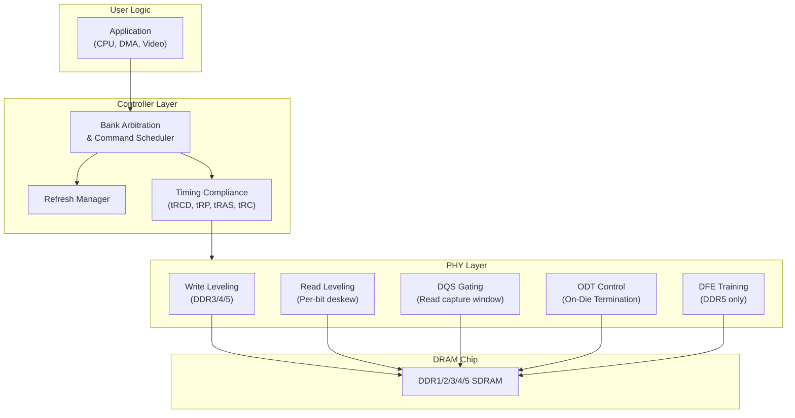
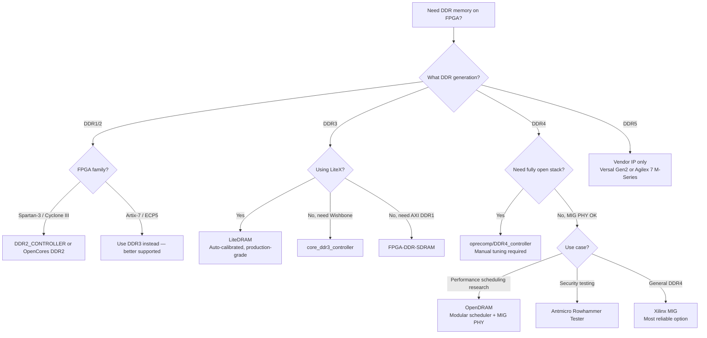

[← 12 Open Source Open Hardware Home](../README.md) · [← Memory Controllers Home](README.md) · [← Project Home](../../../README.md)

# Open DDR & LPDDR Controllers — DDR1/2/3/4/5 & LPDDR for FPGA

Open-source DDR and LPDDR SDRAM controllers for FPGA — from simple DDR1 on Artix-7 to LPDDR4 on Kintex-7. DDR controllers are significantly harder to implement than SDRAM because they transfer data on both clock edges, require source-synchronous capture with DQS strobes, and need per-bit read calibration (training) to compensate for PCB skew. DDR5 and LPDDR5 remain beyond the reach of soft controllers — they require hardened PHY blocks found only in Versal Gen2 (DDR5 + LPDDR5/5X up to 8533 Mb/s) and Agilex 7 M-Series (DDR5 + LPDDR5).

---

## Overview

DDR memory doubles bandwidth over SDRAM by transferring data on both the rising and falling edges of the clock. Each generation doubles the peak transfer rate, reduces voltage, and adds PHY complexity:

| Parameter | DDR1 | DDR2 | DDR3 | DDR4 | DDR5 |
|---|---|---|---|---|---|
| **Vdd/Vddq** | 2.5 V | 1.8 V | 1.5 V | 1.2 V | 1.1 V |
| **Transfer rate** | 200–400 MT/s | 400–1066 MT/s | 800–2133 MT/s | 1600–3200 MT/s | 3200–6400 MT/s |
| **Peak bandwidth (per channel)** | 1.6–3.2 GB/s | 3.2–8.5 GB/s | 6.4–17 GB/s | 12.8–25.6 GB/s | 25.6–51.2 GB/s |
| **Prefetch** | 2n | 4n | 8n | 8n | 16n |
| **Burst length (BL)** | 2, 4, 8 | 4, 8 | 8, BC4 (on-the-fly) | 8, BC4 (on-the-fly) | 8, 16 (BC4 via mask) |
| **Internal core ratio** | 1/2 × clock | 1/4 × clock | 1/4 × clock | 1/4 × clock | 1/8 × clock |
| **Bank groups** | — | — | — | 4 | 8 (2× 4 per subchannel) |
| **Banks** | 4 | 4–8 | 8 | 16 (4 groups × 4) | 32 (2 subchannels × 4 groups × 4) |
| **DQS signaling** | Single-ended | Single-ended, differential option | Differential | Differential | Differential + DFE |
| **CMD/ADDR clocking** | Synchronous to clock | Synchronous to clock | Fly-by daisy-chain | Fly-by daisy-chain | Fly-by + dual CA subchan |
| **DIMM pins** | 184 | 240 | 240 | 288 | 288 |
| **Data width per DIMM** | 64-bit | 64-bit | 64-bit | 64-bit | 2× 32-bit subchannels |
| **Topology** | Point-to-point / T-branch | T-branch | Fly-by daisy-chain | Fly-by daisy-chain | Fly-by daisy-chain |
| **ODT (On-Die Termination)** | No | Yes | Yes (dynamic) | Yes (dynamic, multi-range) | Yes (DRAM-side + host-side) |
| **On-die ECC** | No | No | No | No (optional) | Yes (mandatory) |
| **PMIC on DIMM** | No | No | No | No | Yes (mandatory) |
| **Max density (per die)** | 512 Mb | 2 Gb | 8 Gb | 16 Gb | 32 Gb |
| **CL range** | 2–3 | 3–6 | 5–11 | 12–24 | 28–40 |
| **tRCD (typical)** | 15–20 ns | 10–15 ns | 7.5–13 ns | 10–15 ns | 10–14 ns |
| **tRP (typical)** | 15–20 ns | 10–15 ns | 7.5–13 ns | 10–15 ns | 10–14 ns |
| **Calibration** | None | ODT only | Write leveling, read leveling, ZQ cal | Same + VrefDQ training | Same + DFE training |
| **Open soft controller?** | ✅ Yes | ✅ Yes (limited) | ✅ Yes (LiteDRAM, core_ddr3) | 🟡 Experimental | ❌ Hard PHY only |

> **Burst Length and Prefetch explained**: The prefetch width determines the minimum burst length (BL). DDR1's 2n prefetch means at least 2 data words per access; DDR3/4's 8n prefetch means 8 words. **BC4 (Burst Chop)** in DDR3/4 still internally reads 8 words but masks the last 4 — this allows efficient sub-cache-line transfers. DDR5's 16n prefetch supports BL8 and BL16, with BL8 implemented by masking the second half of the 16-word burst from each subchannel independently.

> **Bandwidth scaling plateau**: Despite each generation doubling the peak transfer rate, **absolute latency (tRCD, tRP) has barely improved since DDR3** — DDR5's ~12 ns tRCD is similar to DDR3's. The bandwidth improvement comes entirely from wider prefetch, higher signaling rates, and (in DDR5) dual subchannels, not from faster core access. This matters for FPGA controllers: random-access workloads see far less benefit from newer generations than streaming workloads do.

> **Fly-by topology** (DDR3+): DDR1/2 used a T-branch topology where CMD/ADDR signals arrived at all DRAM chips simultaneously. DDR3 introduced fly-by daisy-chain, where signals arrive at each chip at slightly different times. This improves signal integrity at high speeds but requires **write leveling** calibration — the controller must skew DQS per byte lane to align with each chip's arrival time. This is the primary reason DDR3 controllers need PHY calibration that DDR1/2 don't.

> **The escalation problem**: Each DDR generation makes the PHY harder. DDR1 needs no calibration. DDR3 needs write and read leveling (due to fly-by). DDR4 adds VrefDQ training. DDR5 adds Decision Feedback Equalization (DFE) training on top of everything else, plus splits the DIMM into two independent 32-bit subchannels. This is why DDR5 has no open-source soft controller — the equalization and dual-subchannel architecture requires hardware that doesn't exist as soft logic on any current FPGA.

The open-source DDR controller landscape is dominated by **LiteDRAM**, which is the only controller that provides automatic PHY calibration across multiple FPGA families. Standalone controllers exist but require manual tuning per board.

---

## Controller Comparison

| Controller | DDR Gen | Max Clock | Data Width | Interface | FPGA Verified | Auto-Cal | Repository |
|---|---|---|---|---|---|---|---|
| **FPGA-DDR-SDRAM** | DDR1 | 200 MHz | 16-bit | AXI-4 | Artix-7, Cyclone IV | No | WangXuan95/FPGA-DDR-SDRAM |
| **DDR2_CONTROLLER** | DDR2 | 200 MHz | 16-bit | Native | Spartan-3A, Cyclone III | No | dtysky/DDR2_CONTROLLER |
| **OpenCores DDR2** | DDR2 | 266 MHz | 16/32-bit | Wishbone | Spartan-3A | No | opencores/ddr2_sdram |
| **core_ddr3_controller** | DDR3 | 400 MHz (800 MT/s) | 16/32-bit | Wishbone | ECP5, Artix-7 | No | ultraembedded/core_ddr3_controller |
| **DDR4_controller** | DDR4 | 800 MHz (1600 MT/s) | 32/64-bit | Native FIFO | Kintex-7, Artix-7 | No | oprecomp/DDR4_controller |
| **OpenDRAM** | DDR4 | 800 MHz (1600 MT/s) | 32/64-bit | AXI-4 | Kintex UltraScale+ | No (uses MIG PHY) | FanosResearch/OpenDRAM |
| **LiteDRAM** | DDR1/2/3 | Up to 800 MT/s | 8–64-bit | LiteX native | iCE40, ECP5, Artix-7, Cyclone V | ✅ Yes | enjoy-digital/litedram |
| **Antmicro Rowhammer Tester** | DDR4/LPDDR4/DDR5 | Varies | Module-width | LiteX + VexRiscv | Kintex-7 | ✅ (custom PHY) | antmicro/rowhammer-tester |
| **(No open soft controller)** | DDR5 | — | — | — | Hard PHY only (Versal, Agilex 7) | N/A | — |

---

## DDR Protocol Stack



| Layer | Responsibility | Open-Source Status |
|---|---|---|
| **Command scheduling** | Bank management, row hit/miss optimization, refresh insertion | Well-understood, multiple implementations |
| **Timing compliance** | Enforce tRCD, tRP, tRAS, tRC, tFAW, tRRD | Straightforward state machine |
| **Write leveling** | Align DQS to CLK at the DRAM (DDR3/4/5) | LiteDRAM: automated; others: manual |
| **Read leveling** | Per-bit deskew to compensate for PCB trace length differences | LiteDRAM: automated; others: manual |
| **DQS gating** | Find the valid read data window within the DQS strobe | LiteDRAM: automated; others: manual |
| **ODT** | On-Die Termination for signal integrity at high speeds | Typically static configuration |
| **DFE training** | Decision Feedback Equalization for high-speed DQ equalization (DDR5) | Hard PHY only; no soft implementation exists |

---

## Controller Deep Dives by Generation

### DDR1 — The Simplest Double-Data-Rate

DDR1 (200–400 MT/s, 2.5 V) is the easiest DDR to implement on an FPGA. It uses single-ended DQS strobes, requires no write leveling or read leveling, and the SSTL-2 I/O standard is supported by virtually every FPGA made in the last 20 years.

| DDR1 Characteristic | Detail |
|---|---|
| **Prefetch** | 2n (2 words per access) |
| **Banks** | 4 |
| **DQS** | Single-ended, bidirectional |
| **ODT** | No |
| **Calibration** | None required |
| **I/O standard** | SSTL-2 (2.5 V) |
| **Typical FPGA use** | Artix-7, Cyclone IV, Spartan-3 |

**WangXuan95/FPGA-DDR-SDRAM** is the primary open DDR1 controller — clean AXI-4 interface, tested on Artix-7, with full initialization and refresh handling.

### DDR2 — Prefetch Doubles, ODT Arrives

DDR2 (400–1066 MT/s, 1.8 V) doubles the prefetch to 4n and introduces On-Die Termination (ODT), which the controller must enable during reads and writes. SSTL-18 I/O is still single-ended DQS, but differential DQS is optional.

| DDR2 Characteristic | Detail |
|---|---|
| **Prefetch** | 4n |
| **Banks** | 4–8 |
| **DQS** | Single-ended (differential optional) |
| **ODT** | Yes — controller must drive ODT pin |
| **Calibration** | ODT configuration only |
| **I/O standard** | SSTL-18 (1.8 V) |
| **Added commands** | AL (Additive Latency), OCD (Off-Chip Driver) calibration |

Open DDR2 controllers are rare — **dtysky/DDR2_CONTROLLER** (VHDL, Spartan-3A) and the **OpenCores DDR2 controller** (Wishbone, Spartan-3A) are the only options. Both are mature but limited to specific boards.

### DDR3 — The Open-Source Sweet Spot

DDR3 (800–2133 MT/s, 1.5 V) is the most widely-supported DDR generation in open-source FPGA tooling. It introduces differential DQS, write leveling, read leveling, and ZQ calibration — making a calibration-capable PHY essential.

| DDR3 Characteristic | Detail |
|---|---|
| **Prefetch** | 8n |
| **Bank groups** | — (none; 8 banks flat) |
| **DQS** | Differential (mandatory) |
| **ODT** | Yes, with multiple RTT values |
| **Calibration** | Write leveling, read leveling, ZQ calibration |
| **I/O standard** | SSTL-15 (1.5 V) |
| **Fly-by topology** | Yes — writes require leveling to compensate for clock-to-DQS skew at each DRAM on the DIMM |

> **Why DDR3 is the sweet spot**: ECP5 + DDR3 (via LiteDRAM) gives you ~1.6 GB/s for about $20 on a Colorlight or OrangeCrab board. This is enough for 1080p video, RISC-V Linux, and most soft-CPU workloads. The calibration is automated by LiteDRAM, and the PCB requirements (4-layer, impedance-controlled) are achievable by hobbyists.

### DDR4 — The Open-Source Frontier

DDR4 (1600–3200 MT/s, 1.2 V) introduces bank groups, VrefDQ training, and pseudo-open-drain (POD) I/O. Open-source DDR4 support is experimental — the PHY calibration is significantly harder than DDR3.

| DDR4 Characteristic | Detail |
|---|---|
| **Prefetch** | 8n (same as DDR3) |
| **Bank groups** | 4 (improves interleaving) |
| **DQS** | Differential |
| **ODT** | Yes, with dynamic ODT |
| **Calibration** | Write leveling, read leveling, ZQ calibration, VrefDQ training |
| **I/O standard** | POD12 (1.2 V) |
| **New features** | Bank groups for higher concurrency, ACTn pin, geographic addressing |

**Open-source DDR4 options:**

- **oprecomp/DDR4_controller** — migrated from their DDR3 controller; native FIFO interface; Kintex-7 verified. No auto-calibration.
- **OpenDRAM** (FanosResearch/OpenDRAM) — a 2025 research-grade modular DDR4 soft MC. Uses AMD MIG PHY with a custom high-performance command scheduler (5 variants). Published at FPT 2025. AXI-4 interface. **Caveat**: only the controller logic is open — it still relies on the closed-source AMD MIG PHY.
- **LiteDRAM** — experimental DDR4 on Kintex-7; not production-validated.
- **Antmicro Rowhammer Tester** — open hardware platform (Kintex-7) with custom DDR4/LPDDR4 PHY for security testing. LiteX-based with VexRiscv debug core. Also being extended to DDR5.

### DDR5 — Hard PHY Territory

DDR5 (3200–6400 MT/s, 1.1 V) is a fundamental architectural shift from DDR4. No open-source soft controller exists, and none is likely to appear for current FPGA families.

| DDR5 Characteristic | Detail |
|---|---|
| **Prefetch** | 16n (doubled from DDR4) |
| **Architecture** | 2 independent 32-bit subchannels per DIMM (effectively 2× DDR5 half-width channels) |
| **Bank groups** | 8 (4 per subchannel) |
| **DQS** | Differential + Decision Feedback Equalization (DFE) |
| **On-die ECC** | Mandatory (corrects single-bit errors within the DRAM chip) |
| **PMIC** | Power Management IC on DIMM (baseboard no longer supplies Vdd) |
| **Calibration** | Write leveling, read leveling, ZQ, VrefDQ, **DFE training** |
| **I/O standard** | POD11 (1.1 V — the lowest voltage Series-7 I/O banks can handle) |
| **Same 288-pin DIMM** | Yes, but different key notch from DDR4 |

> **Why DDR5 needs a hard PHY**: The dual-subchannel architecture means the controller must manage two independent 32-bit channels simultaneously. DFE requires per-lane adaptive equalization that runs continuously during operation. The 16n prefetch demands 512-bit internal data paths. These requirements exceed what soft FPGA logic can achieve at the required frequencies. AMD/Xilinx has stated that DDR5 is only supported via hardened memory controllers in Versal Gen2+ devices, with no soft DDR5 IP planned.

> **Antmicro's DDR5 effort**: Antmicro is extending their open-source Rowhammer testing framework to DDR5. They have built a custom Kintex-7 board with a DDR5 DIMM slot and are developing an open PHY. This is a research/verification platform, not a production controller. The 1.1 V POD11 I/O is at the absolute limit of what Series-7 FPGAs can drive.

### LPDDR — Low-Power DDR for Embedded & SoC

LPDDR (Low-Power Double Data Rate) is the mobile/embedded variant of DDR, designed for smartphones, tablets, and — critically for FPGA — SoC platforms like Zynq UltraScale+ and Intel Agilex. LPDDR uses less power, fewer pins, and smaller packages than standard DDR, making it the default choice for FPGA SoCs where the memory is soldered directly to the PCB.

#### LPDDR vs DDR — Key Architectural Differences

| Parameter | DDR1/2/3/4/5 | LPDDR1/2/3/4/5 |
|---|---|---|
| **Target** | Desktop, server, DIMM slots | Mobile, embedded, PoP/BGA on PCB |
| **Channel width** | 64-bit (x8/x16 chips in parallel on DIMM) | 16-bit or 32-bit per channel |
| **CMD/ADDR** | Separate pins | **Multiplexed CA bus** (10-bit DDR, LPDDR2+) |
| **Pin count** | 40–80+ per DIMM | 20–30 per chip |
| **I/O signaling** | SSTL (DDR1/2/3), POD (DDR4/5) | SSTL (LPDDR1), HVSTL (LPDDR2/3), POD (LPDDR4/4X/5) |
| **Vdd/Vddq** | Same as DDR counterparts | Lower (see table below) |
| **Topology** | DIMM, multi-drop | Point-to-point, PoP (Package-on-Package) |
| **Power modes** | Self-refresh only | Self-refresh + **deep sleep** + **power-down** |
| **Write leveling** | Required (DDR3+) | **Not required** (point-to-point, no fly-by skew) |
| **Open soft controller?** | DDR1–3 yes, DDR4 experimental | LPDDR4 via Antmicro/LiteDRAM; others hard PHY only |

> **Why LPDDR skips write leveling**: Standard DDR3+ uses a fly-by daisy-chain topology that introduces clock-to-DQS skew at each DRAM chip, requiring write leveling to compensate. LPDDR uses point-to-point connections (one DRAM chip per channel), so there is no skew to compensate for. This makes the LPDDR PHY simpler than the equivalent DDR generation's PHY.

> **The CA bus trade-off**: LPDDR2+ multiplexes command and address onto a 10-bit CA bus transmitted at DDR rate. This saves ~30 pins compared to standard DDR's parallel address bus, but the controller must serialize commands and meet tighter timing on the CA bus. The CA bus is also bidirectional in some LPDDR5 modes.

#### LPDDR Generation Comparison

| Parameter | LPDDR1 | LPDDR2 | LPDDR3 | LPDDR4 | LPDDR4X | LPDDR5 | LPDDR5X |
|---|---|---|---|---|---|---|---|
| **Vdd1/Vdd2** | 1.8 V | 1.2 / 1.8 V | 1.2 / 1.8 V | 1.1 / 1.8 V | 0.6 / 1.1 V | 1.05 / 1.8 V | 0.55 / 1.1 V |
| **Transfer rate** | 200–400 MT/s | 400–1066 MT/s | 800–2133 MT/s | 1600–4266 MT/s | 1600–4266 MT/s | 3200–6400 MT/s | 4800–8533 MT/s |
| **Prefetch** | 2n | 4n | 8n | 8n (dual channel) | 8n (dual channel) | 16n | 16n |
| **Channel width** | 16/32-bit | 16/32-bit | 16/32-bit | 16-bit × 2 ch | 16-bit × 2 ch | 16-bit × 2 ch | 16-bit × 2 ch |
| **CA bus** | Separate pins | 10-bit DDR CA | 10-bit DDR CA | 6-bit CA per ch | 6-bit CA per ch | 7-bit CA per ch | 7-bit CA per ch |
| **Banks** | 4 | 4–8 | 8 | 8 per ch (2 BG) | 8 per ch (2 BG) | 8 per ch (4 BG) | 8 per ch (4 BG) |
| **ODT** | No | No | Yes (DRAM-side) | Yes (DRAM + host) | Yes (DRAM + host) | Yes | Yes |
| **Packaging** | PoP / BGA | PoP / BGA | PoP / BGA | BGA | BGA | BGA | BGA |
| **Open soft PHY?** | 🟡 Limited | 🟡 Limited | 🟡 Experimental | ✅ Antmicro/LiteDRAM | ✅ Same as LPDDR4 | ❌ Hard PHY only | ❌ Hard PHY only |

#### FPGA SoC LPDDR Support

| FPGA SoC | LPDDR Generation | Controller Type | Notes |
|---|---|---|---|
| **Zynq-7000** | LPDDR2 | Hard (PS) | PS memory controller supports LPDDR2 via MIO |
| **Zynq UltraScale+** | LPDDR4 | Hard (PS) | PS DDR controller supports both DDR4 and LPDDR4; PL has no soft LPDDR4 IP |
| **Zynq UltraScale+ RFSoC** | LPDDR4 | Hard (PS) | Same as ZU+ MPSoC |
| **Intel Cyclone V SoC** | LPDDR2 | Hard (HPS) | HPS SDRAM controller supports DDR2/DDR3/LPDDR2 |
| **Intel Arria 10 SoC** | LPDDR3 | Hard (HPS) | HPS EMIF supports DDR3/LPDDR3 |
| **Intel Agilex 7** | LPDDR4/4X | Hard (HPS) | EMIF hard PHY |
| **Intel Agilex 5** | LPDDR4/5 | Hard (HPS + FPGA EMIF) | First mid-range FPGA with LPDDR5 support |
| **Gowin GW2AR-18** | PSRAM (LPDDR-like) | Hard IP | Tang Nano 20K's PSRAM uses Gowin hard IP; no open controller |

> **Zynq PS vs PL for LPDDR**: On Zynq UltraScale+, the PS (Processing System) has a hardened DDR/LPDDR4 memory controller, but the PL (Programmable Logic) does **not** have a soft LPDDR4 IP. AMD/Xilinx has confirmed they have no plans to develop a PL LPDDR4 controller. If your PL design needs LPDDR4 access, you must route it through the PS via AXI HP ports, or use Antmicro's open-source LiteDRAM LPDDR4 PHY (research-grade).

#### Open-Source LPDDR Controllers

| Controller | LPDDR Gen | FPGA | Status | Repository |
|---|---|---|---|---|
| **Antmicro LPDDR4 PHY + LiteDRAM** | LPDDR4 | Kintex-7 | ✅ Working (research/verification) | antmicro/lpddr4-test-board |
| **Antmicro Rowhammer Tester** | LPDDR4 | Kintex-7 | ✅ Working (security testing) | antmicro/rowhammer-tester |
| **LiteDRAM (experimental)** | LPDDR4 | ECP5, Artix-7 | 🟡 Experimental | enjoy-digital/litedram |
| **(No open soft controller)** | LPDDR5 | — | ❌ Hard PHY only (Agilex 5) | — |

> **LPDDR4 vs DDR4 for FPGA designs**: If you're designing a custom PCB with a Zynq UltraScale+, LPDDR4 uses ~30 fewer pins than DDR4 (multiplexed CA bus vs parallel address), supports PoP stacking (saving PCB area), and consumes less power. The trade-off is lower per-channel bandwidth (16-bit vs 64-bit) and no DIMM upgrade path. For embedded designs where the memory is soldered down, LPDDR4 is usually the better choice.

---

## LiteDRAM — The Cross-Platform DDR Controller

LiteDRAM is the only open-source DDR controller with automatic PHY calibration. It works by running a software calibration sequence at boot time:

### LiteDRAM Calibration Sequence

```
1. Reset & Initialize DRAM (LOAD MODE, ZQCL)
2. Write Leveling
   - Write DQS patterns, sample with CLK-domain FFs
   - Adjust DQS delay until aligned with CLK
3. Read Leveling
   - Write known pattern to DRAM
   - Read back, sample with varying DQS delay
   - Find center of valid window per bit
4. Write Verification
   - Write and read back multiple patterns
   - Verify data integrity
5. Ready for user traffic
```

| LiteDRAM Feature | Detail |
|---|---|
| **DDR1** | ✅ ECP5, Artix-7 |
| **DDR2** | ✅ ECP5, Artix-7 |
| **DDR3** | ✅ ECP5, Artix-7, Cyclone V (production-grade) |
| **DDR4** | 🟡 Experimental (Kintex-7, not production-validated) |
| **DDR5** | ❌ Not supported (requires hard PHY) |
| **LPDDR4** | 🟡 Via Antmicro Rowhammer PHY (research/verification) |
| **Auto-calibration** | ✅ Software calibration at boot |
| **Native interface** | LiteX (Wishbone + AXI adapters available) |
| **Max bandwidth** | Up to 800 MT/s × 64-bit = ~6.4 GB/s (DDR3) |

### LiteDRAM Integration (Python)

```python
# Add DDR3 to a LiteX SoC on ECP5
soc.add_sdram("sdram",
    phy=LiteDDRPHY(platform.request("ddram"),
        memtype="DDR3",
        sys_clk_freq=sys_clk_freq),
    module=MT41K64M16(sys_clk_freq, "1:4"),  # 128 MB DDR3
    size=0x8000000,
)
```

---

## DDR3 on ECP5 — The Sweet Spot

DDR3 on Lattice ECP5 is the most common open-source DDR configuration — it's supported by LiteDRAM and used on boards like OrangeCrab, ButterStick, and Versa.

| Parameter | Typical Value (ECP5 + DDR3) |
|---|---|
| **Clock** | 50 MHz (1:4 ratio → 200 MHz SDRAM clock) |
| **Data rate** | 800 MT/s |
| **Data width** | 16-bit |
| **Bandwidth** | ~1.6 GB/s |
| **Calibration time** | ~100 ms at boot |
| **Resource usage** | ~1200 LUTs, ~800 FFs, 2 BRAM |

---

## DDR4 on Kintex-7 — The Open-Source Frontier

DDR4 support in open-source controllers is still maturing. LiteDRAM has experimental DDR4 support for Kintex-7, but it requires:

- A 1:4 clock ratio (sys_clk = 100 MHz, mem_clk = 400 MHz)
- Vref training and ZQ calibration
- More stringent PCB requirements (controlled impedance, matched lengths)

| DDR4 Parameter | Kintex-7 Typical |
|---|---|
| **Clock** | 100 MHz (1:4 → 400 MHz) |
| **Data rate** | 1600 MT/s |
| **Data width** | 32-bit |
| **Bandwidth** | ~6.4 GB/s |
| **Calibration time** | ~200 ms at boot |

### OpenDRAM — The 2025 DDR4 Controller

OpenDRAM (FanosResearch/OpenDRAM) is the newest open DDR4 controller, published at FPT 2025. It takes a different approach: instead of replacing both the controller and PHY, it replaces only the **command scheduler** while using the AMD MIG PHY for the physical layer.

| OpenDRAM Feature | Detail |
|---|---|
| **Architecture** | Modular: 5 swappable command scheduler variants |
| **Interface** | AXI-4 |
| **PHY** | AMD MIG PHY (closed-source) |
| **FPGA** | Kintex UltraScale+ |
| **License** | SolderPad Hardware License 0.51 |
| **Status** | Research-grade; Vivado 2022.1 required |

> **OpenDRAM caveat**: It is "open" in the controller logic but depends on the closed-source AMD MIG PHY. This makes it unsuitable for fully open toolchains. Its value is in the high-performance command scheduling algorithms, not in providing an independent DDR4 stack.

---

## DDR5 — Vendor IP Only

DDR5 on FPGA is exclusively the domain of vendor-hardened memory controllers. There are no open-source DDR5 soft controllers, and the architectural requirements (DFE, dual subchannels, 16n prefetch) make one unlikely for current FPGA families.

| FPGA Family | DDR5 | LPDDR5 | LPDDR5X | Max DDR5 Rate | Interface | Notes |
|---|---|---|---|---|---|---|
| **AMD Versal Premium Gen2** | ✅ Hard MC | ✅ Hard MC | ✅ Hard MC | 6400 Mb/s | AXI NoC2 | DDR5 component/DIMM + LPDDR5/5X; 2-rank RDIMM limited to 4000 Mb/s |
| **AMD Versal Prime Gen2** | ✅ Hard MC | ✅ Hard MC | ✅ Hard MC | 6400 Mb/s | AXI NoC2 | Same DDRMC5E as Premium Gen2 |
| **AMD Versal AI Edge Gen2** | ✅ Hard MC | ✅ Hard MC | ✅ Hard MC | 6400 Mb/s | AXI NoC2 | Same DDRMC5E; LPDDR5X up to 8533 Mb/s |
| **Intel Agilex 7 M-Series** | ✅ Hard MC | ✅ Hard MC | — | 5600 Mb/s | AXI | 2× 40-bit channels (32 data + 8 ECC); also HBM2E (16/32 GB) |
| **Intel Agilex 7 F/I-Series** | ❌ DDR4 only | ❌ | — | — | AXI | EMIF supports DDR4 only; no DDR5 on F-Series or I-Series |
| **Intel Agilex 5 E-Series** | ❌ DDR4 only | ✅ Hard MC | — | — | AXI | First mid-range FPGA with LPDDR5; DDR4 @ 2667, LPDDR4 @ 4267 Mb/s |
| **AMD Kintex UltraScale+** | ❌ No | ❌ No | ❌ No | — | — | Not supported; use DDR4 instead |
| **AMD Artix-7 / Kintex-7** | ❌ No | ❌ No | ❌ No | — | — | I/O voltage floor is 1.1 V (barely DDR5); no DFE support |
| **Lattice ECP5** | ❌ No | ❌ No | ❌ No | — | — | Nowhere near the I/O speed required |

> **If you need DDR5 on FPGA**: You must use a Versal Gen2 or Agilex 7 M-Series device with the vendor's hardened memory controller. There is no open-source or soft-IP path. For open toolchains, DDR3 on ECP5 remains the highest generation achievable.

> **Agilex 7 DDR5 is M-Series only**: The Agilex 7 F-Series and I-Series development kits only support DDR4 — only the newer M-Series (with HBM2E) adds DDR5 support. Don't assume all Agilex 7 devices support DDR5.

> **Versal Gen2 LPDDR5X at 8533 Mb/s**: AMD's Versal Gen2 DDRMC5E supports LPDDR5X at up to 8533 Mb/s on single-rank components — the fastest external memory interface available on any FPGA. This is particularly relevant for designs that need maximum bandwidth without the PCB complexity of DIMM slots.

---

## Selection Guide



| Scenario | Recommendation | Why |
|---|---|---|
| DDR on iCE40/ECP5 | **LiteDRAM** | Only option with full open-toolchain support |
| Minimal AXI DDR1 for retro/embedded | **FPGA-DDR-SDRAM** | Clean AXI-4, well-tested on Artix-7 |
| DDR2 on older FPGAs | **OpenCores DDR2** or **dtysky/DDR2_CONTROLLER** | Only open DDR2 options (limited board support) |
| DDR3 with Wishbone | **core_ddr3_controller** | Mature, Wishbone, verified on multiple platforms |
| DDR3 on ECP5 | **LiteDRAM** | Production-grade, auto-calibrated, the de facto standard |
| DDR4 on Xilinx 7-series | **oprecomp/DDR4_controller** | Only fully-open DDR4 option (but needs manual tuning) |
| DDR4 high-performance scheduler | **OpenDRAM** | Best command scheduling, but depends on MIG PHY |
| DDR4/LPDDR4 security testing | **Antmicro Rowhammer Tester** | Purpose-built open hardware for DRAM security research |
| DDR5 on FPGA | **Vendor IP only** | Use Versal Gen2 or Agilex 7; no open-source option exists |
| Using LiteX ecosystem | **LiteDRAM** | Tight LiteX integration, automatic PHY calibration |
| Any DDR that must "just work" | **LiteDRAM** | Auto-calibration eliminates the #1 DDR bring-up failure |

---

## When to Use / When NOT to Use Open DDR Controllers

### When to Use

- **LiteX SoCs** — LiteDRAM is the natural choice
- **ECP5 designs** — LiteDRAM is the only production-grade open DDR3 option for ECP5
- **Educational purposes** — understanding DDR PHY calibration by reading the LiteDRAM source

### When NOT to Use

- **Production designs** — vendor DDR IP (Xilinx MIG, Intel EMIF) is more reliable and better tested
- **High-speed DDR4 (>1600 MT/s)** — open controllers haven't been validated at higher speeds
- **When you can use vendor IP for free** — Xilinx MIG comes with Vivado at no extra cost; use it if you're already in the Vivado ecosystem

---

## Best Practices

1. **Use LiteDRAM for any open DDR project** — it's the only controller with auto-calibration; without it, DDR bring-up can take weeks
2. **Run calibration at every boot** — DDR timing drifts with temperature and voltage; recalibrate every power cycle
3. **Follow the PCB design guidelines** — DDR needs impedance-controlled traces, matched lengths, and proper termination; bad PCBs cause intermittent failures that no software can fix
4. **Use the 1:4 clock ratio** — most LiteDRAM PHYs are designed for a 1:4 sys_clk:mem_clk ratio; other ratios may not work
5. **Verify with a memory test** — after calibration, run a walking-ones and checkerboard test to confirm data integrity

---

## Antipatterns

- **The Manual PHY Tuning** — spending days manually adjusting read/write delays in a standalone DDR controller; LiteDRAM automates this
- **The Cheap PCB with DDR3** — routing DDR3 on a 2-layer board without impedance control; it will not work reliably regardless of the controller
- **The Skip-Calibration Shortcut** — hard-coding calibration values from one board and expecting them to work on another; each board needs its own calibration
- **The DDR5 Soft Controller Hope** — waiting for an open-source DDR5 soft controller; the architecture (DFE, dual subchannels) makes this infeasible on current FPGAs
- **The OpenDRAM Misunderstanding** — choosing OpenDRAM expecting a fully open DDR4 stack; it replaces the scheduler only and still requires the closed-source AMD MIG PHY
- **The DDR2 on Modern FPGAs** — trying to use DDR2 on ECP5 or Artix-7; DDR3 is better supported, faster, and no harder to implement

---

## Pitfalls

1. **PHY calibration is the hard part** — the controller logic (command scheduling, timing compliance) is well-understood; the PHY (read leveling, DQS gating) is where 90% of DDR bring-up time is spent
2. **Board-specific pin constraints** — DDR pin assignments must match the PCB exactly; even a single swapped DQS pair causes calibration failure
3. **Vref for DDR3/4** — the reference voltage pin (Vref) must be clean and stable; noise on Vref causes read errors that look like calibration failures
4. **ODT settings are board-dependent** — incorrect ODT values cause signal integrity issues at high speeds; check the DRAM datasheet and simulation
5. **Vendor DDR IP is almost always more reliable** — Xilinx MIG and Intel EMIF have been validated across thousands of boards; open controllers have been validated on dozens
6. **Temperature sensitivity** — DDR3/4 timing changes with temperature; calibration values valid at 25°C may fail at 85°C
7. **DDR5 dual subchannels** — DDR5 has two independent 32-bit subchannels per DIMM; you cannot treat a DDR5 DIMM as a single 64-bit channel like DDR4
8. **DDR5 PMIC sequencing** — DDR5 modules have their own Power Management IC; the baseboard must properly sequence the PMIC enable and wait for power-good before starting controller initialization
9. **OpenDRAM is not fully open** — it depends on the AMD MIG PHY; don't choose it expecting a fully open DDR4 stack from PHY to scheduler

---

## Use Cases

- **LiteX SoC main memory** — VexRiscv + LiteDRAM + DDR3 on ECP5 (OrangeCrab, ButterStick)
- **Video frame buffer** — DDR3 provides enough bandwidth for 1080p@60 double-buffered frame buffer
- **Data acquisition** — streaming ADC samples to DDR3 at >1 GB/s
- **ML inference** — weight storage for NVDLA or FINN on DDR3/DDR4
- **RISC-V Linux** — VexRiscv + LiteDRAM + DDR3 provides enough memory for Linux
- **DRAM security research** — Antmicro Rowhammer Tester for DDR4/LPDDR4/DDR5 vulnerability analysis
- **High-performance DDR4 scheduling** — OpenDRAM's modular schedulers for research into memory controller policies
- **Retro DDR1/DDR2 platforms** — FPGA-DDR-SDRAM or OpenCores DDR2 for legacy system recreation

---

## References

- [LiteDRAM (GitHub)](https://github.com/enjoy-digital/litedram) — cross-platform DDR1/2/3 controller with auto-calibration
- [FPGA-DDR-SDRAM (GitHub)](https://github.com/WangXuan95/FPGA-DDR-SDRAM) — open DDR1 controller, AXI-4
- [DDR2_CONTROLLER (GitHub)](https://github.com/dtysky/DDR2_CONTROLLER) — VHDL DDR2 controller
- [OpenCores DDR2](https://opencores.org/projects/ddr2_sdram) — Wishbone DDR2 controller
- [core_ddr3_controller (GitHub)](https://github.com/ultraembedded/core_ddr3_controller) — Wishbone DDR3 controller
- [DDR4_controller (GitHub)](https://github.com/oprecomp/DDR4_controller) — open DDR4 controller
- [OpenDRAM (GitHub)](https://github.com/FanosResearch/OpenDRAM) — modular DDR4 MC with MIG PHY
- [Antmicro Rowhammer Tester (GitHub)](https://github.com/antmicro/rowhammer-tester) — open DDR4/LPDDR4/DDR5 testing platform
- [Antmicro DDR5 extension blog](https://antmicro.com/blog/2022/08/extending-the-open-source-rowhammer-testing-framework-to-ddr5/) — DDR5 testing platform details
- [LiteX Core Ecosystem — LiteDRAM Deep Dive](../litex/litex_core_ecosystem.md)
- [SDRAM Controllers](sdram_controllers.md) — simpler memory alternative
- [Specialized Memory](specialized_memory.md) — HyperRAM, QSPI PSRAM, async SRAM
