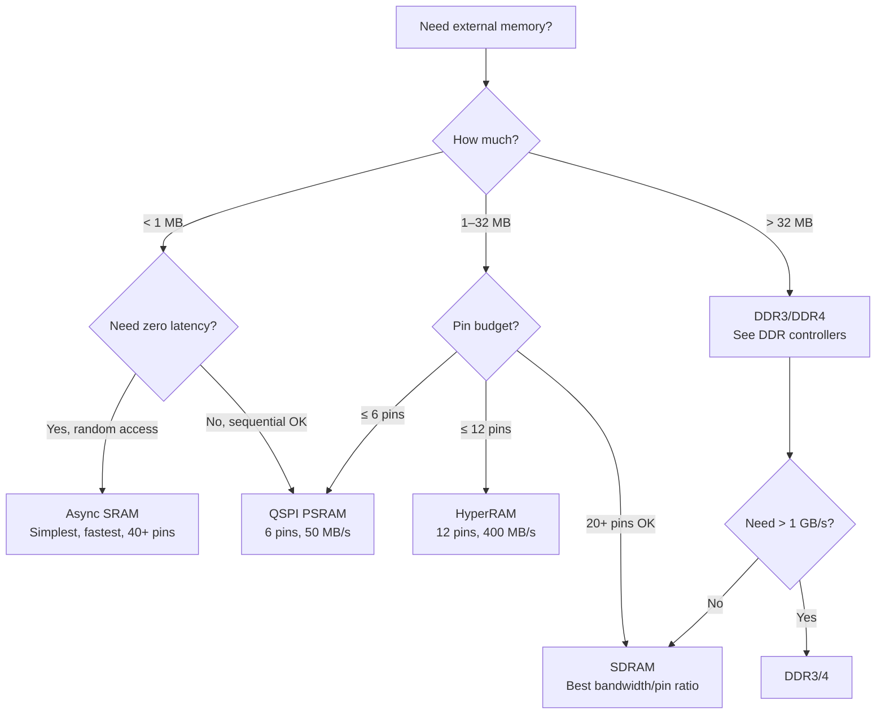

[← 12 Open Source Open Hardware Home](../README.md) · [← Memory Controllers Home](README.md) · [← Project Home](../../../README.md)

# Specialized Memory Controllers — HyperRAM, QSPI PSRAM & Async SRAM

For designs where a full DDR PHY is overkill: HyperRAM for medium bandwidth with minimal pins, QSPI PSRAM for ultra-low pin count buffers, and async SRAM for zero-latency random access. These memories fill the gap between on-chip BRAM (fast but tiny) and DDR3/4 (huge but complex).

---

## Overview

Not every FPGA design needs DDR3. Many designs need just a few megabytes of external storage for frame buffers, audio samples, or soft CPU memory — but can't afford the pin count, PCB complexity, or PHY calibration overhead of DDR. This is where specialized memories shine:

| Memory Type | Sweet Spot |
|---|---|
| **HyperRAM** | 8–32 MB, 12 pins, 200–400 MB/s — medium bandwidth, pin-constrained designs |
| **QSPI PSRAM** | 8–64 MB, 6 pins, 50–100 MB/s — ultra-low pin count, small buffers |
| **Async SRAM** | 1–4 MB, 40+ pins, ~100 MB/s — zero-latency random access, simplest controller |

---

## Memory Type Comparison

| Type | Interface | Max Bandwidth | Pins | PCB Complexity | Cost per MB | Best For |
|---|---|---|---|---|---|---|
| **HyperRAM** | 12-pin (CS, CK, RWDS, DQ[7:0], RESET) | 400 MB/s (200 MHz DDR) | 12 | 2-layer OK | ~$1 | Medium bandwidth, pin-constrained |
| **QSPI PSRAM** | 6-pin (CS, CLK, DQ[3:0]) | 50 MB/s (100 MHz QSPI) | 6 | 2-layer OK | ~$0.50 | Ultra-low pin count, small buffers |
| **Async SRAM** | 20+ pin (addr, data, control) | ~100 MB/s (depends on FPGA fmax) | 40+ | 2-layer OK | ~$5 | Lowest latency, simplest controller |
| **SDRAM** | 20+ pin | ~667 MB/s (166 MHz, 32-bit) | 20+ | 2-layer OK | ~$0.50 | Balanced performance (see [SDRAM](sdram_controllers.md)) |
| **DDR3** | 40+ pin | ~6.4 GB/s (800 MT/s, 64-bit) | 40+ | 4+ layers | ~$1 | High bandwidth (see [DDR](ddr_controllers.md)) |

---

## HyperRAM

HyperRAM (Cypress/Infineon) is a self-refreshing DRAM with a compact 12-pin interface. It uses a DDR interface on an 8-bit data bus with a clock and a bidirectional data strobe (RWDS).

### HyperRAM Interface

```
FPGA                          HyperRAM
┌──────┐                     ┌──────────┐
│      │──── CS# ────────────│ CS#      │
│      │──── CK ─────────────│ CK       │
│      │──── RWDS ───────────│ RWDS     │
│      │──── DQ[7:0] ────────│ DQ[7:0]  │
│      │──── RESET# ─────────│ RESET#   │
└──────┘                     └──────────┘
```

| Signal | Direction | Description |
|---|---|---|
| **CS#** | FPGA → HRAM | Chip select (active low) |
| **CK** | FPGA → HRAM | Differential clock (CK, CK#) |
| **RWDS** | Bidirectional | Read/Write Data Strobe (DDR) |
| **DQ[7:0]** | Bidirectional | Data bus (DDR, 8 bits) |
| **RESET#** | FPGA → HRAM | Hardware reset |

### HyperRAM Read Timing

```
CK      ──┐ ┌─┐ ┌─┐ ┌─┐ ┌─┐ ┌─┐ ┌─┐ ┌─┐ ┌─┐ ┌─┐ ┌─┐ ┌─
         └─┘ └─┘ └─┘ └─┘ └─┘ └─┘ └─┘ └─┘ └─┘ └─┘ └─┘

CS#     ─────────────────────────────────────────────────

CMD     ──< CA0 >─< CA1 >──────────────────────────────
        (command + address, 2 × 16-bit DDR words)

RWDS    ──────────────────────────<  DDR strobe  >──────

DQ      ──────────────────────────────< D0 >< D1 >──────
                                           (read data)
```

### HyperRAM Configurations

| Part | Density | Speed | Package | Price |
|---|---|---|---|---|
| **S27KL0641** | 64 Mbit (8 MB) | 200 MHz DDR (400 MB/s) | 24-BGA | ~$2 |
| **S27KL1281** | 128 Mbit (16 MB) | 200 MHz DDR (400 MB/s) | 24-BGA | ~$3 |
| **S27KL2561** | 256 Mbit (32 MB) | 200 MHz DDR (400 MB/s) | 24-BGA | ~$5 |

### Open HyperRAM Controllers

| Controller | Bus | FPGA Verified | Features | Repository |
|---|---|---|---|---|
| **hyperram** | Wishbone | ECP5, Artix-7 | Fixed timing, configurable frequency | ultraembedded/hyperram |
| **LiteHyperRAM** | LiteX CSR | ECP5, Artix-7 | Auto-calibrated, LiteX-integrated | litex-hub/litehyperram |
| **hyperbus** | Native | ECP5, Artix-7 | Configurable latency, burst mode | Various on GitHub |

```python
# LiteX integration
soc.add_hyperram("hyperram",
    phy=LiteHyperRAMPHY(platform.request("hyperram"),
        sys_clk_freq=sys_clk_freq),
    size=0x800000,  # 8 MB
)
```

---

## QSPI PSRAM

QSPI PSRAM (Quad Serial Pseudo-Static RAM) provides the lowest pin count of any external memory — just 6 pins for up to 64 MB. It uses the same SPI-like protocol as QSPI flash but with faster random access and no erase cycles.

### QSPI PSRAM Protocol

| Mode | Pins Used | Bandwidth (100 MHz clock) |
|---|---|---|
| **Standard SPI** | CS, CLK, DQ0, DQ1 | 12.5 MB/s (1-bit data) |
| **Dual SPI** | CS, CLK, DQ0, DQ1 | 25 MB/s (2-bit data) |
| **Quad SPI** | CS, CLK, DQ[3:0] | 50 MB/s (4-bit data) |
| **QPI** (full quad cmd+addr+data) | CS, CLK, DQ[3:0] | 50 MB/s (lower command overhead) |

### QSPI PSRAM Commands

| Command | Opcode | Description |
|---|---|---|
| **READ** | 0x03 | Standard SPI read |
| **FAST_READ** | 0x0B | SPI read with dummy cycles |
| **QFAST_READ** | 0xEB | Quad SPI fast read |
| **WRITE** | 0x02 | Standard SPI write |
| **QUAD_WRITE** | 0x38 | Quad SPI write |
| **RESET_EN** | 0x66 | Reset enable |
| **RESET** | 0x99 | Reset execute |

### Available PSRAM Chips

| Part | Density | Speed | Package | Price |
|---|---|---|---|---|
| **APS6404L** | 64 Mbit (8 MB) | 133 MHz QSPI | SOIC-8 | ~$1 |
| **APS12808L** | 128 Mbit (16 MB) | 133 MHz QSPI | SOIC-8 | ~$2 |
| **ESP-PSRAM64** | 64 Mbit (8 MB) | 120 MHz QSPI | SIP (ESP32 module) | ~$1 |

### Open Controllers

| Controller | Bus | FPGA Verified | Repository |
|---|---|---|---|
| **qspi_psram** | Native | ECP5, Artix-7 | Various on GitHub |
| **LitePSRAM** | LiteX CSR | ECP5 | litex-hub (experimental) |

> **QSPI PSRAM on the Tang Nano**: The Gowin GW1NR-9 and GW2AR-18 used on Tang Nano boards include on-chip PSRAM, which is accessed through dedicated pins. The Gowin IP provides a controller, but there is no open-source controller yet.

---

## Async SRAM

Async SRAM is the simplest external memory — no refresh, no clock, no calibration. You present an address, assert the chip select and output enable, and data appears on the bus after the access time (typically 10–55 ns).

### Async SRAM Interface

```
FPGA                          Async SRAM
┌──────┐                     ┌──────────┐
│      │──── A[17:0] ────────│ A[17:0]  │  (address)
│      │──── DQ[7:0] ────────│ DQ[7:0]  │  (bidirectional data)
│      │──── CE# ────────────│ CE#      │  (chip enable)
│      │──── OE# ────────────│ OE#      │  (output enable)
│      │──── WE# ────────────│ WE#      │  (write enable)
│      │──── BHE# ───────────│ BHE#     │  (byte high enable, 16-bit)
│      │──── BLE# ───────────│ BLE#     │  (byte low enable, 16-bit)
└──────┘                     └──────────┘
```

### Async SRAM Timing

```
READ:
       ┌──────────────────────────────────
A[] ───< VALID ADDRESS            >──────
       ┌──────────────────────┐
OE# ───┘                       └───────
                     ┌─────────────────
D[] ────────────────< VALID DATA      >

       ├── tAA ──┤    (address access time, 10–55 ns)
       ├── tOE ──┤    (output enable access time, 5–20 ns)
```

### Async SRAM Controller (< 100 lines of Verilog)

```verilog
// Minimal async SRAM controller
module sram_ctrl #(
    parameter ADDR_WIDTH = 18,
    parameter DATA_WIDTH = 16
)(
    input  clk,
    input  [ADDR_WIDTH-1:0] addr,
    input  [DATA_WIDTH-1:0] wr_data,
    input  wr_en,
    input  rd_en,
    output [DATA_WIDTH-1:0] rd_data,
    output reg data_valid,
    // SRAM pins
    output [ADDR_WIDTH-1:0] sram_addr,
    inout  [DATA_WIDTH-1:0] sram_dq,
    output sram_ce_n,
    output sram_oe_n,
    output sram_we_n
);
    assign sram_ce_n = 1'b0;  // always enabled
    assign sram_addr = addr;
    assign rd_data   = sram_dq;

    reg [DATA_WIDTH-1:0] dq_out;
    reg dq_oe;

    // Tri-state data bus
    genvar i;
    generate
        for (i = 0; i < DATA_WIDTH; i = i + 1) begin : bus_drv
            assign sram_dq[i] = dq_oe ? dq_out[i] : 1'bz;
        end
    endgenerate

    always @(posedge clk) begin
        if (wr_en) begin
            dq_out    <= wr_data;
            dq_oe     <= 1;
            sram_we_n <= 0;
            sram_oe_n <= 1;
            data_valid <= 0;
        end else if (rd_en) begin
            dq_oe     <= 0;
            sram_we_n <= 1;
            sram_oe_n <= 0;
            data_valid <= 1;
        end else begin
            sram_we_n <= 1;
            sram_oe_n <= 1;
            dq_oe     <= 0;
            data_valid <= 0;
        end
    end
endmodule
```

### Available Async SRAM Chips

| Part | Density | Speed | Package | Price |
|---|---|---|---|---|
| **IS61LV25616AL** | 4 Mbit (512 KB) | 10 ns | TSOP-44 | ~$5 |
| **IS61WV51216BLL** | 8 Mbit (1 MB) | 10 ns | TSOP-44 | ~$7 |
| **CY7C1041DV33** | 4 Mbit (512 KB) | 12 ns | SOJ-36 | ~$4 |
| **AS7C34098A** | 4 Mbit (512 KB) | 55 ns | SOP-32 | ~$2 |

---

## Decision Guide



---

## When to Use / When NOT to Use

### When to Use

- **HyperRAM**: Pin-constrained designs (wearables, small PCBs) that need >1 MB of memory — 12 pins for 8–32 MB
- **QSPI PSRAM**: Ultra-low pin count designs that need <100 MB/s — 6 pins for 8–16 MB
- **Async SRAM**: Zero-latency random access (lookup tables, cache, FIFO) where BRAM is too small

### When NOT to Use

- **HyperRAM**: When you have enough pins for SDRAM (SDRAM is faster and cheaper per MB)
- **QSPI PSRAM**: For bandwidth >50 MB/s or latency-sensitive designs (QSPI PSRAM has high command overhead)
- **Async SRAM**: When you need >1 MB (SRAM is expensive per MB and uses too many pins)

---

## Best Practices

1. **Use LiteHyperRAM for HyperRAM** — auto-calibrated, LiteX-integrated, avoids manual timing tuning
2. **Use QSPI PSRAM for frame buffers on tiny FPGAs** — the iCE40UP5K can't address DDR3, but QSPI PSRAM works with 6 pins
3. **Use async SRAM for zero-latency lookup tables** — when BRAM is too small and you need deterministic single-cycle access
4. **Check your FPGA's I/O voltage** — HyperRAM is 1.8V or 3.0V; QSPI PSRAM is typically 1.8V or 3.3V; match to your FPGA's bank voltage

---

## Antipatterns

- **The DDR3 for a Frame Buffer** — using DDR3 when 8 MB of HyperRAM would suffice; DDR3 requires 40+ pins, 4-layer PCB, and PHY calibration
- **The Async SRAM for Bulk Storage** — using a 512 KB async SRAM when 8 MB of HyperRAM would be cheaper and use fewer pins
- **The QSPI PSRAM for Low-Latency Access** — QSPI PSRAM has high per-access latency (command + address + dummy cycles); it's optimized for sequential access, not random reads

---

## Pitfalls

1. **HyperRAM latency** — HyperRAM has variable latency (initial access: 4–7 clock cycles; burst: 2 cycles per word); random access is slower than sequential
2. **QSPI PSRAM refresh** — some PSRAM chips require periodic refresh (like DRAM); check the datasheet
3. **HyperRAM 1.8V vs 3.0V** — some HyperRAM chips operate at 1.8V only; verify compatibility with your FPGA's I/O voltage
4. **Async SRAM access time** — the access time (tAA) limits the maximum clock frequency; a 55 ns SRAM limits you to ~18 MHz for random access
5. **QSPI PSRAM command overhead** — each access requires command + address + dummy cycles (5–10 clocks); effective bandwidth is much lower than the raw data rate

---

## Use Cases

- **HyperRAM**: ESP32 companion memory, portable device frame buffer, MiSTer-like retro core memory
- **QSPI PSRAM**: Audio sample buffer, small frame buffer on iCE40, sensor data buffer
- **Async SRAM**: CPU cache, lookup table, NPU weight buffer, test equipment FIFO
- **HyperRAM on Tang Nano**: The Gowin boards include PSRAM accessible through dedicated pins

---

## References

- [Infineon HyperRAM Datasheet](https://www.infineon.com/cms/en/product/memories/hyperram/)
- [AP Memory PSRAM](https://www.apmemory.com/) — QSPI PSRAM manufacturer
- [LiteHyperRAM (GitHub)](https://github.com/litex-hub/litehyperram)
- [ultraembedded/hyperram (GitHub)](https://github.com/ultraembedded/hyperram)
- [SDRAM Controllers](sdram_controllers.md) — balanced performance option
- [DDR Controllers](ddr_controllers.md) — high-bandwidth option
- [LiteX Core Ecosystem](../litex/litex_core_ecosystem.md) — LiteDRAM deep dive
