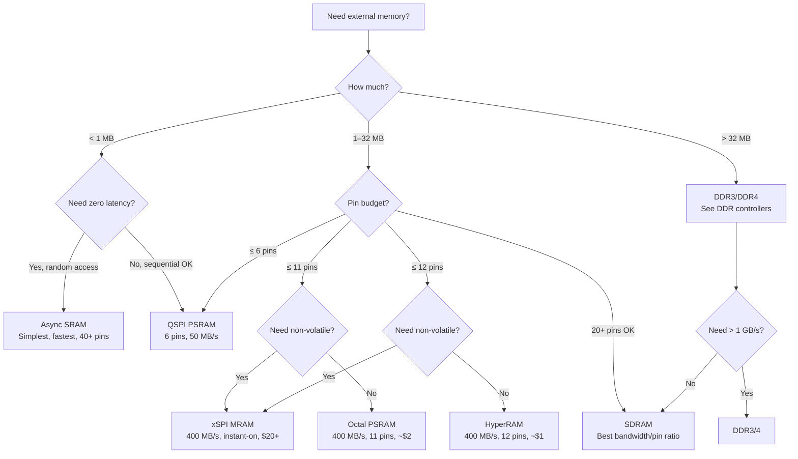

[← 12 Open Source Open Hardware Home](../README.md) · [← Memory Controllers Home](README.md) · [← Project Home](../../../README.md)

# Specialized Memory Controllers — HyperRAM, QSPI PSRAM & Async SRAM

For designs where a full DDR PHY is overkill: HyperRAM for medium bandwidth with minimal pins, QSPI PSRAM for ultra-low pin count buffers, and async SRAM for zero-latency random access. These memories fill the gap between on-chip BRAM (fast but tiny) and DDR3/4 (huge but complex).

---

## Overview

Not every FPGA design needs DDR3. Many designs need just a few megabytes of external storage for frame buffers, audio samples, or soft CPU memory — but can't afford the pin count, PCB complexity, or PHY calibration overhead of DDR. This is where specialized memories shine:

| Memory Type | Sweet Spot |
|---|---|
| **HyperRAM** | 8–32 MB, 12 pins, 200–400 MB/s — medium bandwidth, pin-constrained designs |
| **QSPI PSRAM** | 8–64 MB, 6 pins, 50–100 MB/s — ultra-low pin count, small buffers |
| **Octal/xSPI RAM** | 8–64 MB, 11 pins, 266–400 MB/s — replaces HyperRAM with 2–4× the bandwidth |
| **Async SRAM** | 1–4 MB, 40+ pins, ~100 MB/s — zero-latency random access, simplest controller |
| **MRAM** | 1–16 MB, 6–11 pins, up to 400 MB/s — non-volatile SRAM replacement, instant-on |
| **FRAM** | 64 KB–4 MB, 4–6 pins, ~10 MB/s — non-volatile, ultra-low power, wear-limited |

---

## Memory Type Comparison

| Type | Interface | Max Bandwidth | Pins | PCB Complexity | Cost per MB | Best For |
|---|---|---|---|---|---|---|
| **Octal/xSPI RAM** | 11-pin (CS, CLK, DQ[7:0], RWDS) | 400 MB/s (200 MHz DDR OPI) | 11 | 2-layer OK | ~$1 | Replaces HyperRAM with 2–4× bandwidth |
| **HyperRAM** | 12-pin (CS, CK, RWDS, DQ[7:0], RESET) | 400 MB/s (200 MHz DDR) | 12 | 2-layer OK | ~$1 | Medium bandwidth, pin-constrained |
| **QSPI PSRAM** | 6-pin (CS, CLK, DQ[3:0]) | 50 MB/s (100 MHz QSPI) | 6 | 2-layer OK | ~$0.50 | Ultra-low pin count, small buffers |
| **MRAM** | 6–11 pin (xSPI or parallel) | 400 MB/s (xSPI DDR) | 6–11 | 2-layer OK | ~$20+ | Non-volatile SRAM replacement |
| **FRAM** | 4–6 pin (SPI) | ~10 MB/s (SPI) | 4–6 | 2-layer OK | ~$10+ | Non-volatile, ultra-low power |
| **Async SRAM** | 20+ pin (addr, data, control) | ~100 MB/s (depends on FPGA fmax) | 40+ | 2-layer OK | ~$5 | Lowest latency, simplest controller |
| **SDRAM** | 20+ pin | ~667 MB/s (166 MHz, 32-bit) | 20+ | 2-layer OK | ~$0.50 | Balanced performance (see [SDRAM](sdram_controllers.md)) |
| **DDR3** | 40+ pin | ~6.4 GB/s (800 MT/s, 64-bit) | 40+ | 4+ layers | ~$1 | High bandwidth (see [DDR](ddr_controllers.md)) |

---

## HyperRAM

HyperRAM (Cypress/Infineon) is a self-refreshing DRAM with a compact 12-pin interface. It uses a DDR interface on an 8-bit data bus with a clock and a bidirectional data strobe (RWDS).

### HyperRAM Interface

```
FPGA                          HyperRAM
┌──────┐                     ┌──────────┐
│      │──── CS# ────────────│ CS#      │
│      │──── CK ─────────────│ CK       │
│      │──── RWDS ───────────│ RWDS     │
│      │──── DQ[7:0] ────────│ DQ[7:0]  │
│      │──── RESET# ─────────│ RESET#   │
└──────┘                     └──────────┘
```

| Signal | Direction | Description |
|---|---|---|
| **CS#** | FPGA → HRAM | Chip select (active low) |
| **CK** | FPGA → HRAM | Differential clock (CK, CK#) |
| **RWDS** | Bidirectional | Read/Write Data Strobe (DDR) |
| **DQ[7:0]** | Bidirectional | Data bus (DDR, 8 bits) |
| **RESET#** | FPGA → HRAM | Hardware reset |

### HyperRAM Read Timing

```
CK      ──┐ ┌─┐ ┌─┐ ┌─┐ ┌─┐ ┌─┐ ┌─┐ ┌─┐ ┌─┐ ┌─┐ ┌─┐ ┌─
         └─┘ └─┘ └─┘ └─┘ └─┘ └─┘ └─┘ └─┘ └─┘ └─┘ └─┘

CS#     ─────────────────────────────────────────────────

CMD     ──< CA0 >─< CA1 >──────────────────────────────
        (command + address, 2 × 16-bit DDR words)

RWDS    ──────────────────────────<  DDR strobe  >──────

DQ      ──────────────────────────────< D0 >< D1 >──────
                                           (read data)
```

### HyperRAM Configurations

| Part | Density | Speed | Package | Price |
|---|---|---|---|---|
| **S27KL0641** | 64 Mbit (8 MB) | 200 MHz DDR (400 MB/s) | 24-BGA | ~$2 |
| **S27KL1281** | 128 Mbit (16 MB) | 200 MHz DDR (400 MB/s) | 24-BGA | ~$3 |
| **S27KL2561** | 256 Mbit (32 MB) | 200 MHz DDR (400 MB/s) | 24-BGA | ~$5 |

### Open HyperRAM Controllers

| Controller | Bus | FPGA Verified | Features | Repository |
|---|---|---|---|---|
| **hyperram** | Wishbone | ECP5, Artix-7 | Fixed timing, configurable frequency | ultraembedded/hyperram |
| **LiteHyperRAM** | LiteX CSR | ECP5, Artix-7 | Auto-calibrated, LiteX-integrated | litex-hub/litehyperram |
| **hyperbus** | Native | ECP5, Artix-7 | Configurable latency, burst mode | Various on GitHub |

```python
# LiteX integration
soc.add_hyperram("hyperram",
    phy=LiteHyperRAMPHY(platform.request("hyperram"),
        sys_clk_freq=sys_clk_freq),
    size=0x800000,  # 8 MB
)
```

---

## QSPI PSRAM

QSPI PSRAM (Quad Serial Pseudo-Static RAM) provides the lowest pin count of any external memory — just 6 pins for up to 64 MB. It uses the same SPI-like protocol as QSPI flash but with faster random access and no erase cycles.

### QSPI PSRAM Protocol

| Mode | Pins Used | Bandwidth (100 MHz clock) |
|---|---|---|
| **Standard SPI** | CS, CLK, DQ0, DQ1 | 12.5 MB/s (1-bit data) |
| **Dual SPI** | CS, CLK, DQ0, DQ1 | 25 MB/s (2-bit data) |
| **Quad SPI** | CS, CLK, DQ[3:0] | 50 MB/s (4-bit data) |
| **QPI** (full quad cmd+addr+data) | CS, CLK, DQ[3:0] | 50 MB/s (lower command overhead) |

### QSPI PSRAM Commands

| Command | Opcode | Description |
|---|---|---|
| **READ** | 0x03 | Standard SPI read |
| **FAST_READ** | 0x0B | SPI read with dummy cycles |
| **QFAST_READ** | 0xEB | Quad SPI fast read |
| **WRITE** | 0x02 | Standard SPI write |
| **QUAD_WRITE** | 0x38 | Quad SPI write |
| **RESET_EN** | 0x66 | Reset enable |
| **RESET** | 0x99 | Reset execute |

### Available PSRAM Chips

| Part | Density | Speed | Package | Price |
|---|---|---|---|---|
| **APS6404L** | 64 Mbit (8 MB) | 133 MHz QSPI | SOIC-8 | ~$1 |
| **APS12808L** | 128 Mbit (16 MB) | 133 MHz QSPI | SOIC-8 | ~$2 |
| **ESP-PSRAM64** | 64 Mbit (8 MB) | 120 MHz QSPI | SIP (ESP32 module) | ~$1 |

### Open Controllers

| Controller | Bus | FPGA Verified | Repository |
|---|---|---|---|
| **qspi_psram** | Native | ECP5, Artix-7 | Various on GitHub |
| **LitePSRAM** | LiteX CSR | ECP5 | litex-hub (experimental) |

> **QSPI PSRAM on the Tang Nano**: The Gowin GW1NR-9 and GW2AR-18 used on Tang Nano boards include on-chip PSRAM, which is accessed through dedicated pins. The Gowin IP provides a controller, but there is no open-source controller yet.

---

## Async SRAM

Async SRAM is the simplest external memory — no refresh, no clock, no calibration. You present an address, assert the chip select and output enable, and data appears on the bus after the access time (typically 10–55 ns).

### Async SRAM Interface

```
FPGA                          Async SRAM
┌──────┐                     ┌──────────┐
│      │──── A[17:0] ────────│ A[17:0]  │  (address)
│      │──── DQ[7:0] ────────│ DQ[7:0]  │  (bidirectional data)
│      │──── CE# ────────────│ CE#      │  (chip enable)
│      │──── OE# ────────────│ OE#      │  (output enable)
│      │──── WE# ────────────│ WE#      │  (write enable)
│      │──── BHE# ───────────│ BHE#     │  (byte high enable, 16-bit)
│      │──── BLE# ───────────│ BLE#     │  (byte low enable, 16-bit)
└──────┘                     └──────────┘
```

### Async SRAM Timing

```
READ:
       ┌──────────────────────────────────
A[] ───< VALID ADDRESS            >──────
       ┌──────────────────────┐
OE# ───┘                       └───────
                     ┌─────────────────
D[] ────────────────< VALID DATA      >

       ├── tAA ──┤    (address access time, 10–55 ns)
       ├── tOE ──┤    (output enable access time, 5–20 ns)
```

### Async SRAM Controller (< 100 lines of Verilog)

```verilog
// Minimal async SRAM controller
module sram_ctrl #(
    parameter ADDR_WIDTH = 18,
    parameter DATA_WIDTH = 16
)(
    input  clk,
    input  [ADDR_WIDTH-1:0] addr,
    input  [DATA_WIDTH-1:0] wr_data,
    input  wr_en,
    input  rd_en,
    output [DATA_WIDTH-1:0] rd_data,
    output reg data_valid,
    // SRAM pins
    output [ADDR_WIDTH-1:0] sram_addr,
    inout  [DATA_WIDTH-1:0] sram_dq,
    output sram_ce_n,
    output sram_oe_n,
    output sram_we_n
);
    assign sram_ce_n = 1'b0;  // always enabled
    assign sram_addr = addr;
    assign rd_data   = sram_dq;

    reg [DATA_WIDTH-1:0] dq_out;
    reg dq_oe;

    // Tri-state data bus
    genvar i;
    generate
        for (i = 0; i < DATA_WIDTH; i = i + 1) begin : bus_drv
            assign sram_dq[i] = dq_oe ? dq_out[i] : 1'bz;
        end
    endgenerate

    always @(posedge clk) begin
        if (wr_en) begin
            dq_out    <= wr_data;
            dq_oe     <= 1;
            sram_we_n <= 0;
            sram_oe_n <= 1;
            data_valid <= 0;
        end else if (rd_en) begin
            dq_oe     <= 0;
            sram_we_n <= 1;
            sram_oe_n <= 0;
            data_valid <= 1;
        end else begin
            sram_we_n <= 1;
            sram_oe_n <= 1;
            dq_oe     <= 0;
            data_valid <= 0;
        end
    end
endmodule
```

### Available Async SRAM Chips

| Part | Density | Speed | Package | Price |
|---|---|---|---|---|
| **IS61LV25616AL** | 4 Mbit (512 KB) | 10 ns | TSOP-44 | ~$5 |
| **IS61WV51216BLL** | 8 Mbit (1 MB) | 10 ns | TSOP-44 | ~$7 |
| **CY7C1041DV33** | 4 Mbit (512 KB) | 12 ns | SOJ-36 | ~$4 |
| **AS7C34098A** | 4 Mbit (512 KB) | 55 ns | SOP-32 | ~$2 |

---

## Octal/xSPI RAM (OPI PSRAM) — The HyperRAM Successor

Octal/xSPI PSRAM extends the QSPI PSRAM concept to an 8-bit data bus with DDR signaling, delivering up to 400 MB/s through just 11 pins. It is rapidly replacing HyperRAM in new designs because it offers the same pin count with 2–4× the bandwidth.

### Octal/xSPI RAM Interface

```
FPGA                          Octal PSRAM
┌──────┐                     ┌──────────┐
│      │──── CS# ────────────│ CS#      │
│      │──── CLK ────────────│ CLK      │
│      │──── DQ[7:0] ────────│ DQ[7:0]  │  (DDR, 8 bits)
│      │──── RWDS ───────────│ RWDS     │  (data strobe)
└──────┘                     └──────────┘
```

The interface is nearly identical to HyperRAM's, but the 8-bit DDR data bus delivers 2 bytes per clock cycle instead of 1 byte, effectively doubling throughput at the same clock frequency.

### Octal PSRAM Protocol Modes

| Mode | Command Width | Address Width | Data Width | Bandwidth (200 MHz) |
|---|---|---|---|---|
| **SPI** (legacy) | 1-bit | 1-bit | 1-bit | 25 MB/s |
| **QPI** (quad) | 4-bit | 4-bit | 4-bit | 100 MB/s |
| **OPI SDR** | 8-bit | 8-bit | 8-bit | 200 MB/s |
| **OPI DDR** | 8-bit DDR | 8-bit DDR | 8-bit DDR | **400 MB/s** |

### Available Octal PSRAM Chips

| Part | Density | Speed | Voltage | Package | Price |
|---|---|---|---|---|---|
| **APS6408L-OC** (AP Memory) | 64 Mbit (8 MB) | 200 MHz DDR OPI | 1.8 V or 3.3 V | BGA-24 | ~$2 |
| **APS12808L-OC** (AP Memory) | 128 Mbit (16 MB) | 200 MHz DDR OPI | 1.8 V | BGA-24 | ~$3 |
| **APS25608L-OC** (AP Memory) | 256 Mbit (32 MB) | 200 MHz DDR OPI | 1.8 V | BGA-24 | ~$5 |
| **IPS256408** (Infineon) | 256 Mbit (32 MB) | 200 MHz DDR OPI | 1.8 V | BGA-24 | ~$6 |

### Open Octal PSRAM Controllers

| Controller | Bus | FPGA Verified | Repository |
|---|---|---|---|
| **LiteOSPI** (experimental) | LiteX CSR | ECP5, Artix-7 | litex-hub (in development) |
| **Gowin IP** | Native | GW2AR, GW5A | Gowin EDA (proprietary) |
| **ESP32-P4 built-in** | — | N/A (MCU) | Espressif (reference) |

> **Octal PSRAM vs HyperRAM**: At the same clock frequency and similar pin count, Octal PSRAM's 8-bit DDR bus delivers 2× the bandwidth of HyperRAM's 4-bit DDR bus. New designs should prefer Octal PSRAM unless they need HyperRAM's dedicated reset pin or specific vendor compatibility. The controller logic is nearly identical — both use a command/address phase followed by a DDR data phase with RWDS strobe.

---

## MRAM — Non-Volatile SRAM

MRAM (Magnetoresistive RAM) combines the speed and endurance of SRAM with the non-volatility of flash. It stores data using magnetic tunnel junctions (MTJs) rather than electric charge, so it retains data without power and has no wear-out mechanism during reads.

### MRAM Types

| Type | Full Name | Write Endurance | Speed | Notes |
|---|---|---|---|---|
| **Toggle MRAM** | Toggle-mode MRAM | ~10¹⁴ cycles | 35–45 ns | Parallel interface, SRAM-compatible |
| **STT-MRAM** | Spin-Transfer Torque MRAM | ~10¹⁵+ cycles | 35–45 ns | Newer, higher density, lower power |
| **xSPI STT-MRAM** | Octal SPI STT-MRAM | ~10¹⁵+ cycles | Up to 400 MB/s | Same xSPI interface as Octal PSRAM |

### xSPI MRAM Interface

xSPI MRAM uses the same 8-pin DDR OPI interface as Octal PSRAM, making it a **pin-compatible, non-volatile drop-in replacement** for Octal PSRAM.

```
FPGA                          xSPI MRAM
┌──────┐                     ┌──────────┐
│      │──── CS# ────────────│ CS#      │
│      │──── CLK ────────────│ CLK      │
│      │──── DQ[7:0] ────────│ DQ[7:0]  │  (DDR, 8 bits)
│      │──── RWDS ───────────│ RWDS     │  (data strobe)
└──────┘                     └──────────┘
  Same 11-pin interface as Octal PSRAM!
```

### Available MRAM Chips

| Part | Density | Interface | Speed | Price |
|---|---|---|---|---|
| **EM064LXO** (Everspin) | 64 Mbit (8 MB) | xSPI DDR OPI | 400 MB/s | ~$20 |
| **EM128LXO** (Everspin) | 128 Mbit (16 MB) | xSPI DDR OPI | 400 MB/s | ~$35 |
| **MR4A16B** (Everspin) | 16 Mbit (2 MB) | Parallel (35 ns) | ~57 MB/s | ~$25 |
| **MR2A16A** (Everspin) | 2 Mbit (256 KB) | Parallel (35 ns) | ~57 MB/s | ~$15 |

### MRAM for FPGA — Key Use Cases

- **Instant-on configuration storage** — MRAM can store FPGA configuration data that survives power loss. Lattice has partnered with Everspin to use MRAM as a NOR flash replacement for FPGA bitstream storage, enabling sub-millisecond configuration load times.
- **Non-volatile register files** — Store calibration data, encryption keys, or state machine context that must survive power cycles without battery backup.
- **Code execution** — xSPI MRAM's 400 MB/s read bandwidth supports execute-in-place (XIP) for soft CPU firmware, eliminating the need to copy from flash to RAM at boot.
- **Write-intensive logging** — Unlike flash, MRAM has no erase cycle and essentially unlimited write endurance (~10¹⁵ cycles), making it ideal for continuous data logging.

> **MRAM vs flash for FPGA configuration**: NOR flash takes 50–200 ms to read a bitstream; xSPI MRAM can read the same data in < 1 ms. For applications requiring sub-second boot times (automotive, industrial), MRAM configuration storage is a significant advantage. Lattice's CrossLink-NX and Certus-NX FPGAs can use MRAM as their configuration source.

---

## FRAM — Ferroelectric RAM

FRAM (Ferroelectric RAM, also called FeRAM) uses a ferroelectric layer to store data non-volatilely. It has extremely low write power consumption and virtually unlimited read endurance, but limited write endurance (~10¹⁴ cycles) and low density.

### FRAM Characteristics

| Parameter | Detail |
|---|---|
| **Write endurance** | ~10¹⁴ cycles (lower than MRAM's ~10¹⁵) |
| **Read endurance** | Unlimited (unlike MRAM, reads are non-destructive) |
| **Write speed** | ~100 ns (no erase cycle needed, unlike flash) |
| **Read speed** | ~100 ns |
| **Retention** | 10–100 years (temperature dependent) |
| **Power** | Ultra-low — ~100× less write energy than EEPROM |
| **Interface** | SPI (up to 40 MHz) or parallel |
| **Max density** | 4 Mbit (512 KB) — much lower than MRAM |

### Available FRAM Chips

| Part | Density | Interface | Speed | Price |
|---|---|---|---|---|
| **MB85RS4MT** (Fujitsu) | 4 Mbit (512 KB) | SPI (40 MHz) | ~5 MB/s | ~$5 |
| **MB85RS2MT** (Fujitsu) | 2 Mbit (256 KB) | SPI (40 MHz) | ~5 MB/s | ~$3 |
| **FM25W256** (Cypress/Infineon) | 256 Kbit (32 KB) | SPI (40 MHz) | ~5 MB/s | ~$2 |

### FRAM for FPGA — Key Use Cases

- **Configuration storage** — Store small FPGA configuration data or calibration constants with ultra-low power
- **Data logging in power-constrained systems** — FRAM's write energy is ~100× lower than EEPROM, making it ideal for battery-powered data loggers
- **Boot parameter storage** — Store boot configuration that must survive power cycles; much faster write than EEPROM (no erase cycle)

> **FRAM vs MRAM**: FRAM is cheaper and lower power for small capacities (< 512 KB), but MRAM offers much higher density (up to 16 MB) and bandwidth (400 MB/s vs 5 MB/s). For new designs requiring non-volatile RAM, prefer xSPI MRAM unless your design is extremely cost-sensitive at low densities.

---

## Decision Guide



---

## When to Use / When NOT to Use

### When to Use

- **Octal/xSPI PSRAM**: New designs that would have used HyperRAM — 11 pins for 8–32 MB at 2× HyperRAM bandwidth
- **HyperRAM**: Legacy designs or when you need the dedicated reset pin; being superseded by Octal PSRAM
- **QSPI PSRAM**: Ultra-low pin count designs that need <100 MB/s — 6 pins for 8–16 MB
- **Async SRAM**: Zero-latency random access (lookup tables, cache, FIFO) where BRAM is too small
- **MRAM**: Non-volatile storage that must survive power loss — instant-on configuration, calibration data, encryption keys
- **FRAM**: Ultra-low-power non-volatile storage at small capacities (< 512 KB) — battery-powered data logging

### When NOT to Use

- **HyperRAM**: When you could use Octal PSRAM instead (same pin count, 2× bandwidth); prefer Octal PSRAM for new designs
- **QSPI PSRAM**: For bandwidth >50 MB/s or latency-sensitive designs (QSPI PSRAM has high command overhead)
- **Async SRAM**: When you need >1 MB (SRAM is expensive per MB and uses too many pins)
- **MRAM**: For volatile-only applications (MRAM costs 10–20× more per MB than PSRAM); use Octal PSRAM instead
- **FRAM**: For capacities > 512 KB or bandwidth >10 MB/s; use MRAM instead

---

## Best Practices

1. **Use LiteHyperRAM for HyperRAM** — auto-calibrated, LiteX-integrated, avoids manual timing tuning
2. **Prefer Octal PSRAM over HyperRAM for new designs** — same pin count, 2× bandwidth; the APS6408L is widely available at ~$2
3. **Use QSPI PSRAM for frame buffers on tiny FPGAs** — the iCE40UP5K can't address DDR3, but QSPI PSRAM works with 6 pins
4. **Use async SRAM for zero-latency lookup tables** — when BRAM is too small and you need deterministic single-cycle access
5. **Use MRAM for instant-on FPGA configuration** — xSPI MRAM loads bitstreams 100× faster than NOR flash; Lattice CrossLink-NX supports this natively
6. **Check your FPGA's I/O voltage** — HyperRAM is 1.8V or 3.0V; Octal PSRAM is typically 1.8V or 3.3V; MRAM is 1.8V; match to your FPGA's bank voltage

---

## Antipatterns

- **The DDR3 for a Frame Buffer** — using DDR3 when 8 MB of Octal PSRAM would suffice; DDR3 requires 40+ pins, 4-layer PCB, and PHY calibration
- **The HyperRAM for New Designs** — using HyperRAM when Octal PSRAM gives 2× bandwidth at the same pin count; HyperRAM is a legacy choice
- **The Async SRAM for Bulk Storage** — using a 512 KB async SRAM when 8 MB of Octal PSRAM would be cheaper and use fewer pins
- **The QSPI PSRAM for Low-Latency Access** — QSPI PSRAM has high per-access latency (command + address + dummy cycles); it's optimized for sequential access, not random reads
- **The MRAM for Volatile Storage** — paying 10–20× more per MB for non-volatility you don't need; use Octal PSRAM for volatile buffers
- **The FRAM for Large Non-Volatile Storage** — FRAM maxes out at 512 KB; use xSPI MRAM for > 512 KB non-volatile needs

---

## Pitfalls

1. **HyperRAM latency** — HyperRAM has variable latency (initial access: 4–7 clock cycles; burst: 2 cycles per word); random access is slower than sequential
2. **QSPI PSRAM refresh** — some PSRAM chips require periodic refresh (like DRAM); check the datasheet
3. **HyperRAM 1.8V vs 3.0V** — some HyperRAM chips operate at 1.8V only; verify compatibility with your FPGA's I/O voltage
4. **Async SRAM access time** — the access time (tAA) limits the maximum clock frequency; a 55 ns SRAM limits you to ~18 MHz for random access
5. **QSPI PSRAM command overhead** — each access requires command + address + dummy cycles (5–10 clocks); effective bandwidth is much lower than the raw data rate
6. **Octal PSRAM DDR alignment** — OPI DDR mode requires precise RWDS-to-CLK timing; the controller must handle read data strobe alignment (similar to DDR DQS gating but simpler)
7. **MRAM cost** — xSPI MRAM costs 10–20× more per MB than volatile PSRAM; only use it when non-volatility is a hard requirement
8. **FRAM write endurance** — FRAM's ~10¹⁴ write cycle limit means it's unsuitable for continuously written data (unlike MRAM's ~10¹⁵+); a 4 MB FRAM chip writing at 5 MB/s would exhaust endurance in ~80 days

---

## Use Cases

- **Octal PSRAM**: ESP32-P4 companion memory, modern frame buffer replacing HyperRAM designs, soft CPU memory on pin-constrained FPGAs
- **HyperRAM**: ESP32 companion memory (legacy), portable device frame buffer, MiSTer-like retro core memory
- **QSPI PSRAM**: Audio sample buffer, small frame buffer on iCE40, sensor data buffer
- **Async SRAM**: CPU cache, lookup table, NPU weight buffer, test equipment FIFO
- **MRAM**: Instant-on FPGA configuration storage, non-volatile register files, XIP code storage, data logging without wear
- **FRAM**: Battery-powered data logger, calibration constant storage, boot parameter persistence
- **Octal PSRAM on Tang Nano**: The Gowin GW2AR-18 and GW5A boards include PSRAM accessible through dedicated pins (Gowin proprietary IP)

---

## References

- [Infineon HyperRAM Datasheet](https://www.infineon.com/cms/en/product/memories/hyperram/)
- [AP Memory PSRAM](https://www.apmemory.com/) — QSPI and Octal PSRAM manufacturer
- [AP Memory APS6408L Octal PSRAM Datasheet](https://www.apmemory.com/product/aps6408l/) — the de facto standard OPI PSRAM
- [Everspin MRAM](https://www.everspin.com/) — Toggle and STT-MRAM manufacturer
- [Everspin xSPI STT-MRAM](https://www.everspin.com/persyst-xspi-industrial-iot-and-embedded-systems) — OPI MRAM for instant-on applications
- [Fujitsu FRAM](https://www.fujitsu.com/emea/products/devices/semiconductor/memory/fram/) — SPI and parallel FRAM
- [Lattice + Everspin MRAM Collaboration](https://www.everspin.com/news/everspin-and-lattice-semiconductor-collaborate-bring-high-reliability-mram-solutions-fpga) — MRAM for FPGA configuration
- [LiteHyperRAM (GitHub)](https://github.com/litex-hub/litehyperram)
- [ultraembedded/hyperram (GitHub)](https://github.com/ultraembedded/hyperram)
- [SDRAM Controllers](sdram_controllers.md) — balanced performance option
- [DDR Controllers](ddr_controllers.md) — high-bandwidth option
- [LiteX Core Ecosystem](../litex/litex_core_ecosystem.md) — LiteDRAM deep dive
