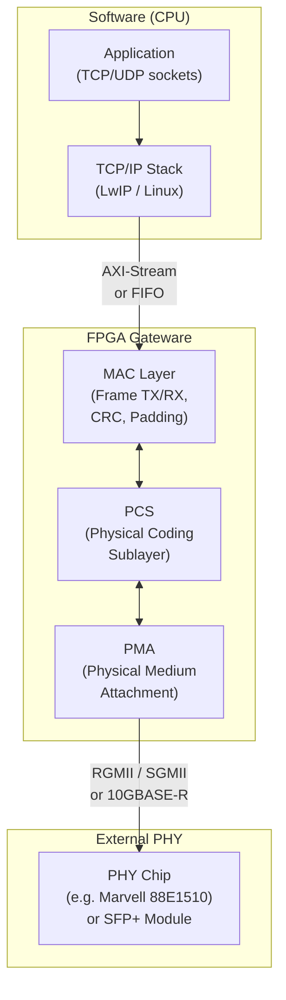
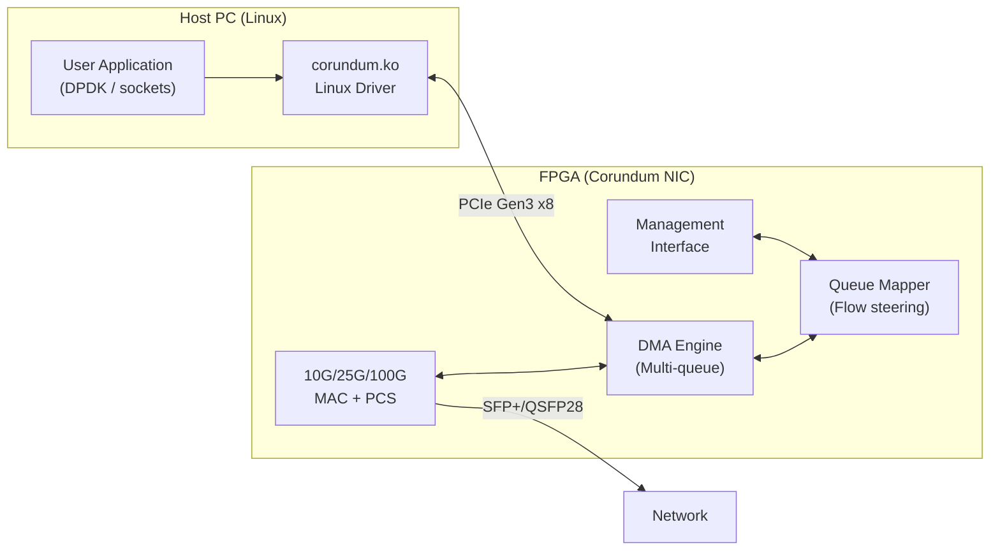

[← 12 Open Source Open Hardware Home](../README.md) · [← Networking Home](README.md) · [← Project Home](../../../README.md)]

# Open Ethernet Cores

FPGA Ethernet MAC/PCS/PMA cores — from 1G to 100G, covering the dominant open-source ecosystem built around Alex Forencich's verilog-ethernet and the Corundum open NIC platform.

---

## Major Projects

| Project | Speeds | Interface | FPGA Support | Key Trait |
|---|---|---|---|---|
| **verilog-ethernet** | 1G, 2.5G, 10G, 25G | AXI-Stream | Xilinx 7-series, Ultrascale+, Intel Arria/Cyclone/Stratix | Modular: MAC + PCS + PMA components, mix-and-match |
| **Corundum** | 10G, 25G, 100G | AXI-Stream + PCIe DMA | Xilinx Ultrascale+, Versal | Full open-source NIC (network interface card) |
| **LiteEth** | 10/100M, 1G | Wishbone (LiteX) | iCE40, ECP5, Artix-7, Cyclone V | Lightweight, hardware UDP/IP stack, part of LiteX ecosystem |
| **NetFPGA** | 1G, 10G | AXI-Stream + Linux driver | NetFPGA-SUME (Virtex-7), NetFPGA-1G-CML (Kintex-7) | Academic, full network research platform |

---

## Ethernet Protocol Stack on FPGA



| Layer | Function | Who Implements |
|---|---|---|
| **MAC** | Frame assembly/disassembly, CRC32 generation/checking, padding, inter-packet gap | FPGA (verilog-ethernet or LiteEth) |
| **PCS** | 8b/10b or 64b/66b encoding, auto-negotiation, link training | FPGA (verilog-ethernet) or hard PCS in transceivers |
| **PMA** | Serializer/deserializer, clock recovery, signal conditioning | Hard transceivers (GTP/GTX/GTH) or external PHY chip |

---

## verilog-ethernet: The Dominant Open Ethernet Library

Alex Forencich's [verilog-ethernet](https://github.com/alexforencich/verilog-ethernet) is the most complete open Ethernet IP library, with modular components you can mix and match.

### Component Architecture

| Component | Function | Speed Support | Resource (approx) |
|---|---|---|---|
| **eth_mac_1g** | 1G MAC (TX + RX) | 1 Gbps | ~2,000 LUTs |
| **eth_mac_1g_fifo** | 1G MAC + FIFO interface | 1 Gbps | ~3,000 LUTs |
| **eth_mac_10g** | 10G MAC | 10 Gbps | ~5,000 LUTs |
| **eth_mac_10g_fifo** | 10G MAC + FIFO | 10 Gbps | ~7,000 LUTs |
| **eth_10g_pcs** | 10G PCS (64b/66b) | 10 Gbps | ~4,000 LUTs |
| **eth_mac_25g** | 25G MAC | 25 Gbps | ~6,000 LUTs |
| **eth_25g_pcs** | 25G PCS | 25 Gbps | ~5,000 LUTs |

### Interface: AXI-Stream

All verilog-ethernet components use AXI-Stream for data interface:

```verilog
// TX interface (CPU/MAC → Ethernet)
output logic        tx_axis_tvalid,
input  logic        tx_axis_tready,
output logic [63:0] tx_axis_tdata,
output logic [7:0]  tx_axis_tkeep,
output logic        tx_axis_tlast,
output logic        tx_axis_tuser,

// RX interface (Ethernet → CPU/MAC)
input  logic        rx_axis_tvalid,
output logic        rx_axis_tready,
input  logic [63:0] rx_axis_tdata,
input  logic [7:0]  rx_axis_tkeep,
input  logic        rx_axis_tlast,
input  logic        rx_axis_tuser,
```

The `tuser` signal indicates frame errors (CRC mismatch, frame too long, etc.).

### Integration Example (1G RGMII)

```verilog
// Instantiate 1G MAC with RGMII PHY interface
eth_mac_1g_rgmii_fifo #(
    .TARGET("XILINX"),       // XILINX, INTEL, or GENERIC
    .CLOCK_INPUT_STYLE("BUFR"), // Clocking strategy
    .ENABLE_PADDING(1),       // Add Ethernet padding to short frames
    .ENABLE_DIC(1)            // Deficit idle count
) eth_mac (
    .rx_clk(rx_clk_125mhz),
    .tx_clk(tx_clk_125mhz),
    
    // RGMII to external PHY
    .rgmii_rx_data(rgmii_rx_data),
    .rgmii_tx_data(rgmii_tx_data),
    .rgmii_rx_ctl(rgmii_rx_ctl),
    .rgmii_tx_ctl(rgmii_tx_ctl),
    
    // AXI-Stream to user logic
    .tx_axis_tvalid(tx_valid),
    .tx_axis_tready(tx_ready),
    .tx_axis_tdata(tx_data),
    .tx_axis_tlast(tx_last),
    .rx_axis_tvalid(rx_valid),
    .rx_axis_tdata(rx_data),
    .rx_axis_tlast(rx_last)
);
```

### PHY Interfaces by Speed

| Speed | Common PHY Interface | FPGA Requirement |
|---|---|---|
| 10/100M | MII / RMII | Regular I/O pins |
| 1G | RGMII / SGMII | DDR-capable I/O (most FPGAs) or SGMII transceivers |
| 2.5G | SGMII / 2500BASE-X | Transceivers (GTP/GTX) |
| 10G | XGMII / 10GBASE-R | Transceivers (GTX/GTH) + hard PCS |
| 25G | 25GBASE-R | Transceivers (GTH/GTY) + hard PCS |
| 100G | CAUI-4 / 100GBASE-R4 | 4× 25G transceivers (GTY) |

---

## Corundum: Open-Source 100G NIC

[Corundum](https://github.com/corundum/corundum) is a full open-source NIC implementing a complete network interface with DMA, multiple queues, and a Linux driver.

### Architecture



| Feature | Specification |
|---|---|
| **Max speed** | 100 Gbps (4× 25G) |
| **Queue count** | 1024+ queues (TX + RX) |
| **DMA** | Scatter-gather, multi-queue |
| **Linux driver** | `corundum.ko` — standard `ethtool`, `ifconfig` |
| **Management** | registers via PCIe BAR |
| **FPGA targets** | Xilinx Ultrascale+, Versal VCK190 |

---

## LiteEth: Lightweight Ethernet for LiteX

For integration details, see the [LiteX Core Ecosystem](../litex/litex_core_ecosystem.md) article. Key differentiator: **hardware UDP/IP stack** — your FPGA can respond to ARP/ping/DHCP without a soft CPU.

```python
# Add 1G Ethernet with hardware UDP/IP stack
soc.add_ethernet(
    phy=soc.submodules.ethphy,
    ip_address="192.168.1.50",
    with_hw_udp_ip=True,  # Hardware UDP/IP stack
)
```

---

## Selection Guide

| Need | Use | Why |
|---|---|---|
| Basic 1G MAC | **verilog-ethernet** 1G module | Battle-tested, AXI streaming, works everywhere |
| Custom network card | **Corundum** | Complete NIC: MAC + PCIe DMA + Linux driver |
| Ethernet in a LiteX SoC | **LiteEth** | Tight integration, automatic MAC address, UDP/IP stack included |
| Network research | **NetFPGA** | Reference pipelines, research community, Linux driver ecosystem |
| 10G+ on Xilinx Ultrascale+ | **verilog-ethernet** 10G/25G | Uses hard PCS/PMA, modular, well-tested |
| Multi-queue 100G NIC | **Corundum** | Only open-source option at 100G with Linux driver |

---

## Best Practices

1. **Use hard transceivers for 10G+** — soft PCS/PMA at 10G+ rarely meets timing; rely on the vendor's hardened transceiver blocks
2. **RGMII requires DDR I/O** — use `IOBUF`/`ODDR` primitives; generic RTL will not meet RGMII timing on most FPGAs
3. **Set the correct target in verilog-ethernet** — `TARGET("XILINX")`, `TARGET("INTEL")`, or `TARGET("GENERIC")` selects the right clocking and I/O primitives
4. **Test with `ethtool` first** — verify link status, speed, and auto-negotiation before debugging your own logic
5. **Use SFP+ modules for 10G** — they include the PHY; direct attach is simpler than designing a PHY board

---

## Antipatterns

- **Implementing your own MAC from scratch** — Ethernet MACs handle CRC32, inter-packet gap, padding, and collision detection; use verilog-ethernet or LiteEth instead
- **Using MII instead of RMII** — MII uses 16 pins vs RMII's 8; RMII is standard for 10/100M on modern boards
- **Ignoring PHY configuration via MDIO** — most PHY chips need MDIO register writes at startup to select speed, duplex, and auto-negotiation settings

---

## Pitfalls

- **RGMII timing is FPGA-specific** — the 2 ns setup/hold window requires vendor-specific I/O primitives (IDELAY on Xilinx, delay elements on Intel); generic RTL will not work
- **1G SGMII requires a transceiver** — even though the data rate is only 1.25 Gbps, you need a GTP/GTX transceiver, not regular I/O
- **10GBASE-KR auto-negotiation is complex** — if your link partner expects KR training, you need the full LT (Link Training) state machine; most open cores skip this
- **verilog-ethernet license is BSD-2-Clause but check submodules** — some example/test files may have different licenses
- **Corundum requires Ultrascale+ or better** — the 100G DMA engine needs high-bandwidth PCIe and transceivers; 7-Series is not supported

---

## References

- [verilog-ethernet (GitHub)](https://github.com/alexforencich/verilog-ethernet)
- [Corundum (GitHub)](https://github.com/corundum/corundum)
- [LiteEth (GitHub)](https://github.com/enjoy-digital/liteeth)
- [NetFPGA](https://netfpga.org/)
- [LiteX Core Ecosystem — LiteEth Deep Dive](../litex/litex_core_ecosystem.md)
- [Alex Forencich's GitHub](https://github.com/alexforencich)
