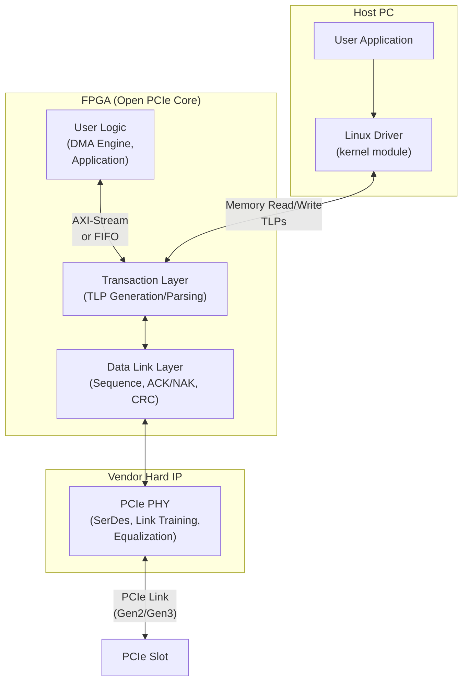
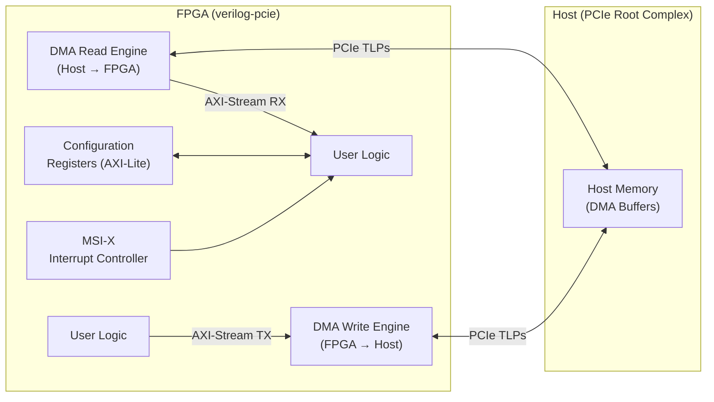

[← 12 Open Source Open Hardware Home](../README.md) · [← Networking Home](README.md) · [← Project Home](../../../README.md)]

# Open PCIe Cores

Open-source PCI Express endpoint/DMA cores — dominated by Alex Forencich's verilog-pcie and its derivatives. All open PCIe cores still use the vendor's hardened PCIe PHY block; the "open" part covers the transaction layer, data link layer, and DMA engine.

---

## Core Comparison

| Core | PCIe Gen | Lanes | Interface | FPGA Support | DMA | Repository |
|---|---|---|---|---|---|---|
| **verilog-pcie** | Gen2, Gen3 | x1, x4, x8, x16 | AXI-Stream + AXI-Lite | Xilinx Ultrascale+, Versal | Multi-channel scatter-gather | alexforencich/verilog-pcie |
| **Antmicro NVMe fork** | Gen3 | x4 | AXI-Stream | Xilinx Ultrascale+ | NVMe-optimized DMA | antmicro/verilog-pcie |
| **LitePCIe** | Gen2 | x1, x4 | Wishbone (LiteX) | Xilinx 7-series, ECP5 | Basic DMA | enjoy-digital/litepcie |
| **RIFFA** | Gen1, Gen2 | x1–x8 | FIFO-like C API | Xilinx 7-series, Intel (older) | Scatter-gather | KastnerRG/riffa |
| **OpenPCIe** | Gen1 | x1 | Research | Artix-7 (experimental) | No | Research-only |

---

## PCIe Protocol Stack on FPGA



| Layer | What It Does | Who Implements |
|---|---|---|
| **Application / DMA** | Moves data between host memory and FPGA | Open core (verilog-pcie DMA, LitePCIe DMA) |
| **Transaction Layer** | Formats TLPs (Memory Read/Write, Completion, Message) | Open core (verilog-pcie) |
| **Data Link Layer** | Sequence numbers, ACK/NAK, LCRC | Vendor hard IP (usually) |
| **Physical Layer** | 8b/10b (Gen1/2) or 128b/130b (Gen3), link training, equalization | Vendor hard IP (always) |

> **Key constraint**: The PHY and data link layer are always vendor hard IP. Open cores provide the transaction layer and DMA engine on top. This means all open PCIe cores are vendor-specific at the hard IP boundary.

---

## verilog-pcie: The Reference Implementation

Alex Forencich's [verilog-pcie](https://github.com/alexforencich/verilog-pcie) is the most complete open PCIe solution, supporting Gen2 and Gen3 with multi-channel scatter-gather DMA.

### Architecture



### DMA Engine

The scatter-gather DMA engine uses descriptor tables in host memory:

| DMA Feature | Description |
|---|---|
| **Scatter-gather** | Descriptor chains in host memory; each descriptor points to a host buffer |
| **Multi-channel** | Up to 16 independent DMA channels (configurable) |
| **Direction** | Separate read (host→FPGA) and write (FPGA→host) engines per channel |
| **Completion** | DMA completion signaled via MSI-X interrupt |
| **Descriptor format** | 16-byte entries: {addr[63:0], len[31:0], flags} |

### Integration Example

```verilog
// PCIe Gen3 x8 with DMA on Xilinx Ultrascale+
pcie_uscale_plus #(
    .PCI_GEN(3),
    .PCI_LANES(8),
    .NUM_DMA_CHANNELS(4)
) pcie_inst (
    // PCIe lane signals (to hard IP)
    .pci_exp_rxp(pci_exp_rxp),
    .pci_exp_rxn(pci_exp_rxn),
    .pci_exp_txp(pci_exp_txp),
    .pci_exp_txn(pci_exp_txn),
    
    // User clock (250 MHz for Gen3 x8)
    .user_clk(user_clk),
    .user_reset(user_reset),
    
    // DMA AXI-Stream interface
    .dma_rx_axis_tvalid(dma_rx_valid),
    .dma_rx_axis_tdata(dma_rx_data),
    .dma_tx_axis_tready(dma_tx_ready),
    
    // Register access (AXI-Lite)
    .reg_wr_addr(reg_wr_addr),
    .reg_wr_data(reg_wr_data),
    .reg_wr_en(reg_wr_en),
    
    // MSI-X interrupt
    .msi_irq(msi_irq)
);
```

---

## LitePCIe: PCIe for LiteX SoCs

LitePCIe integrates PCIe into the LiteX SoC framework with Wishbone bus bridging. See the [LiteX Core Ecosystem](../litex/litex_core_ecosystem.md) article for full details.

```python
# Add PCIe to a LiteX SoC
soc.add_pcie(
    phy=soc.submodules.pcie_phy,
    ndmas=2,           # 2 DMA channels
    with_msi=True,     # MSI-X interrupts
    bar0_size=0x10000, # 64 KB BAR0
)
```

---

## RIFFA: Simple FIFO-Based PCIe

[RIFFA](https://github.com/KastnerRG/riffa) provides a simpler programming model — FIFO-like channels instead of raw TLP access. It uses a C API on the host side:

```c
// Host-side RIFFA API (simplified)
fpga_t *fpga = fpga_open(0);                    // Open FPGA device
fpga_send(fpga, 0, data, len, 0, 1, 0);        // Send to channel 0
fpga_recv(fpga, 0, buffer, len, 0);             // Receive from channel 0
fpga_close(fpga);
```

RIFFA is simpler to use but less performant than verilog-pcie for high-throughput applications.

---

## PCIe Link Training: The First Debug Step

Before any DMA works, the PCIe link must train successfully. The LTSSM (Link Training and Status State Machine) must reach **L0 (Active)**:

| LTSSM State | Description | What to Check If Stuck |
|---|---|---|
| **Detect** | Detecting receiver on far end | Are the PCIe lanes connected? Check schematic. |
| **Polling** | Bit lock, symbol lock | Transceiver reference clock present? Correct frequency? |
| **Configuration** | Link width and number negotiation | Lane reversal / polarity swap needed? Check `pcie_lane_swap`. |
| **Recovery** | Bit realignment (during speed change) | Gen1→Gen3 speed change; equalization settings. |
| **L0 (Active)** | **Normal operation** | Link is up! DMA can begin. |
| **L1/L2** | Power management states | Not commonly used in FPGA designs. |

> **Debugging tip**: Use `lspci -vvv` on the host to check link status. If the device shows up but link width is lower than expected (e.g., x4 instead of x8), check for lane mapping issues in your pin constraints.

---

## Selection Guide

| Scenario | Recommended | Why |
|---|---|---|
| Production PCIe Gen3 on Xilinx | **verilog-pcie** | Best open-source PCIe, extensive test suite |
| NVMe SSD access from FPGA | **Antmicro fork** | NVMe-optimized, data-center proven |
| PCIe in a LiteX SoC | **LitePCIe** | LiteX-integrated, Wishbone bridge included |
| Cross-vendor PCIe (Xilinx + Intel) | **RIFFA** | Multi-vendor, simpler FIFO API, good for research |
| High-throughput DMA (10+ Gbps) | **verilog-pcie** | Multi-channel scatter-gather, AXI-Stream |
| Simple data transfer, C API | **RIFFA** | FIFO abstraction, easiest host-side programming |

---

## Best Practices

1. **Verify link training before debugging DMA** — if `lspci` doesn't show the device at the expected speed/width, no amount of DMA debugging will help
2. **Use the vendor's PCIe hard IP wrapper** — never try to implement the PHY or data link layer in soft logic; it will not meet timing
3. **Set correct BAR sizes** — BAR0 is typically for registers (64 KB–1 MB), BAR2+ for DMA descriptors and data windows
4. **Use MSI-X instead of legacy INTx** — MSI-X supports multiple interrupt vectors (one per DMA channel); INTx is shared and slow
5. **Pin-swapping is common** — PCIe lane polarity reversal and lane ordering swaps are normal; configure these in the hard IP wrapper

---

## Antipatterns

- **Implementing your own TLP parser from scratch** — verilog-pcie's TLP generation/parsing is battle-tested; rolling your own introduces subtle compliance bugs
- **Using Gen1 when Gen2/3 is available** — Gen1 (2.5 GT/s) is 10× slower than Gen3 (8 GT/s); always use the highest speed your hardware supports
- **Polling for DMA completion instead of using interrupts** — DMA completion polling wastes CPU cycles; use MSI-X interrupts

---

## Pitfalls

- **PCIe reference clock must come from the host** — most boards use a 100 MHz reference clock from the PCIe slot; local oscillators cause clock drift and link instability
- **Lane reversal and polarity swap** — PCB routing often swaps lane order or polarity; configure these in the hard IP or they will silently corrupt data
- **verilog-pcie license is BSD-2-Clause** — check the specific submodule licenses before commercial use
- **Intel/Altera open PCIe is scarce** — most open PCIe work targets Xilinx because Intel's PCIe hard IP integration is less well-documented in open-source projects
- **DMA buffer alignment** — host DMA buffers must be page-aligned (4 KB) for scatter-gather; unaligned buffers cause silent data corruption

---

## References

- [verilog-pcie (GitHub)](https://github.com/alexforencich/verilog-pcie)
- [Antmicro NVMe fork](https://github.com/antmicro/verilog-pcie)
- [LitePCIe (GitHub)](https://github.com/enjoy-digital/litepcie)
- [RIFFA (GitHub)](https://github.com/KastnerRG/riffa)
- [LiteX Core Ecosystem — LitePCIe Deep Dive](../litex/litex_core_ecosystem.md)
- [Alex Forencich's GitHub](https://github.com/alexforencich)
